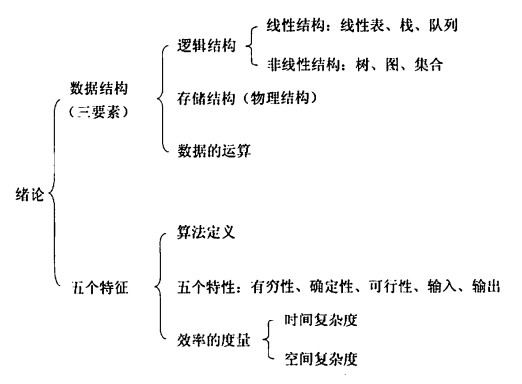
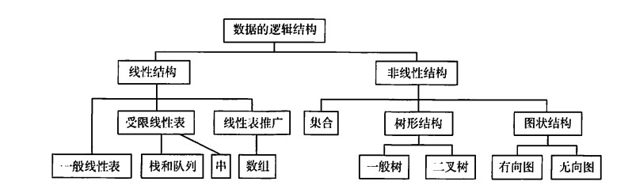
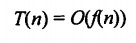
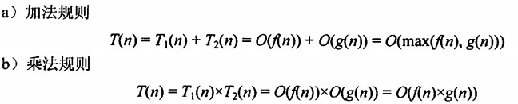
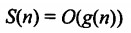

# 前言
本专题作为考研408复习笔记，以王道考研书为准复习，计划在本月内学习整理完所有知识点。题目只做选择题并记录错误，无习题讲解，以记录算法本身为主。

******
知识整理目前已经更新完成，相应的算法练习会整理成项目放到GitHub上。
<!-- more -->
## 概述
本章除了时间复杂度和空间复杂度以外不在考纲中，但是要重点掌握前者，并且了解一些基本概念。
### 基本概念
#### 术语
数据，是信息的载体，描述客观事物属性的数、字符并能被计算机处理的集合；

数据元素，数据的基本单位，可由若干数据项组成，数据项是构成数据元素的最小单位；

数据对象，具有相同性质的数据元素的集合，是数据的子集；

数据类型，定义为包括值的集合和在此集合上操作的总称{*Data，Operation*}，分为原子类型，结构类型和抽象数据类型；

数据结构，互相存在一种或多种特定关系的数据元素的集合，包括三要素。

>区分数据结构和抽象数据类型，数据结构是具体的，要求描述具体的实现方法在内的三要素，但是抽象数据类型是抽象的，不用说明实现方法，只需要定义值和对值的操作。
例如，栈就是抽象数据类型，可以用链式存储或者顺序存储处理数据，只表示逻辑结构；而循环队列则是具体的数据结构，用顺序表表示队列。
#### 数据结构三要素
逻辑结构指数据元素之间的逻辑关系，与数据的存储无关，独立于计算机。分为线性结构（线性表）和非线性结构（集合，树，图）。

存储结构指数据在计算机中的表示，也称物理结构，包括数据元素的表示和关系的表示，是用计算机语言实现的逻辑结构，主要有顺序存储，链式存储，索引存储和散列存储。

数据的计算指施加在数据上的运算，包括运算的定义和实现。定义针对逻辑结构，实现针对存储结构。 

### 算法和算法评价
#### 基本概念
算法，对特定问题求解步骤的描述，是指令的有限序列，其中每条指令表示一个或多个操作。
特点：有穷性，确定性，可行性，输入，输出。

优秀算法目标：正确性，可读性，健壮性，效率和低存储需求。

#### 算法效率
时间复杂度，所有语句频度之和的数量级。记为：

根据具体场景，分为最坏，最好，平均时间复杂度，遵循加法和乘法规则：

空间复杂度，算法耗费的存储空间。记为：

算法原地工作是算法所需要的辅助空间为常量*O(*1*)*。

以斐波那契数列求解的递归和非递归（循环）方式为例，分析时间复杂度。
递归求解，表示成二叉树形式，时间复杂度是对树高（规模n）的函数（结点数），为2的n次方减一；

> 更正，这篇[博客](https://zhuanlan.zhihu.com/p/257214075)指出应该是$O((1+\sqrt{5})/2)^n$

循环求解，直接循环n次就得到结果，时间复杂度自然是*O(*n*)*。

