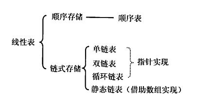
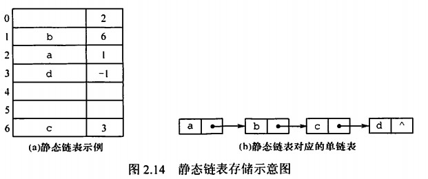

# 前言
本章介绍线性表，包括顺序表示和链式表示，要熟练掌握，要能写出最优性能。要注意动手编写代码。

<!-- more -->

# 定义和基本操作
## 定义
线性表是具有相同数据类型的*n*个数据元素的有限序列，*n*为表长，*n = 0*时表为空表。

线性表有唯一一个表头元素和唯一一个表尾元素，且除表头元素外，每个元素都有且仅有一个前驱；除表尾元素外，每个元素都有且仅有一个后继。

线性表是逻辑结构，表示元素间一对一的相对关系。顺序表和链表是存储结构。

## 基本操作
```
InitList(&L)
Length(&L)
LocateElem(L,e)
GetElem(L,i)
ListInsert(&L,i,e)
ListDelete(&L,i,e)
PrintList(L)
Empty(L)
DestroyList(L)
```

# 顺序表
## 定义
线性表的顺序存储就是线性表，用地址连续的存储单元依次存储数据元素，使逻辑上相邻的两个元素在物理位置上也相邻，位置称为位序，从1开始。

特点是逻辑顺序和物理顺序相同。是一种随机存取的存储结构，一般用数组表述，空间可以静态分配也可以动态分配。

> 静态/动态分配空间指的是分配内存的大小是否能变化，本质上还是顺序存储。

## 操作
### 建表
```
//静态分配
#define MaxSize 50
typedef struct{
    ElemType data[MaxSize];
    int length;
}SqList;
```
```
//动态分配，一旦数据空间占满，就申请一块更大的空间替换现有空间。
#define InitSize 50
typedef struct{
    ElemType *data;
    int length;
}SqList;
SqList L;
L.data = (ElemType*)malloc(sizeof(ElemType) * InitSize);
/*L.data = new ElemType[InitSize];*/
```

### ListInsert
``` 
bool ListInsert(SqList &L, int i, ElemType e)
{
    if(i<1 || i>L.Length+1);
        return false;
    if(L.length > MaxSize)
        return false;
    for(int j = L.length; j>=i; i--)
    {
        L.data[j] = L.data[j-1];
    }
    L.data[i] = e;
    L.Length++;
    return true;
}
```
时间复杂度*n/2*;
### ListDelete
```
bool ListDelete(SqList &L, int i, ElemType &e)
{
    if(i<1 || i>L.Length+1);
        return false;
    e = L.data[i-1];
    for(int j = i; j < L.length; j++)
    {
        L.data[j-1] = L.data[j];
    }
    L.length--;
    return true;
}
```
时间复杂度(*n-1*)*/2*。
### LocateElem
```
LocateElem(SqList L, ElemType e)
{
    for(int i = 0;i<L.Length;i++)
    {
        if(L.data[i] == e)
            return i+1;
    }
    return 0;
}
```
时间复杂度(*n+1*)*/2*。

# 链表
## 单链表
线性表的链式存储叫单链表，通过一组任意的存储单元来存储线性表中的数据元素，在每个结点存放指向后继的指针。

由于物理地址不相邻，所以插入删除元素不用进行移动，但同时也不能随机存取了。

使用头指针来标识一个单链表，头指针为NULL则表空。还可以在第一个结点之前增加一个头结点，优点是：1）方便处理第一个元素，统一所有元素的增删操作；2）方便处理空表，因为头结点非空，只要判断指针域即可，统一空表和非空表的。

## 操作
```
typedef struct LNode{
    ElemType data;
    struct LNode *next;
}LNode, *LinkList;
```
### 头插法建表
```
//注意这里用了引用传递的特性，下面会将参数解释成一个指向该类型的const指针，且指针指向的链表可以被修改，避免值传递的复制行为。
//一般对于基本数据类型用值传递就可以，但是对于复杂的结构体，对象，最好使用引用传递。
LinkList List_HeadInsert(LinkList &L)
{
    LNode *s; //临时结点
    int x;    //临时值
    L = (LinkList)malloc(sizeof(LNode));
    L->next = NULL;
    scanf("%d", &x);
    while(x != -1)
    {
        s = (LNode*)malloc(sizeof(LNode));
        s->data = x;
        s->next = L->next;
        L->next = s;
        scanf("%d", &x);
    }
    return L;
}
```
### 尾插法建表
```
LinkList List_TailInsert(LinkList &L)
{
    int x;
    L = (LinkList)malloc(sizeof(LNode));
    LNode *s = L;
    LNode *r = L;
    scanf("%d", &x);
    while(x != -1)
    {
        s = (LNode *)malloc(sizeof(LNode));
        s->data = x;
        r->next = s;
        r = s;
        scanf("%d", &x);
    }
    r->next = NULL;
    return L;
}
```
### GetElem
```
LNode* GetElem(LinkList L, int i)
{
    int j = 1;
    LNode* p = L->next;
    if(i==0)
    {
        return L;
    }
    if(i<1)
    {
        return NULL;
    }
    while(p != NULL && j < i)
    {
        p = p->next;
        j++;
    }
    return p;
}
```
### LocateElem
```
LNode* LocateElem(LinkList L, ElemType e)
{
    LNode* p = L->next;
    while(p != NULL && p->data != e)
    {
        p = p->next;
    }
    return p;
}
```

### ListInsert
```
bool ListInsert(LinkList L, int i, ElemType e)
{
    if(i<1 || i>Length(L)+1)
        return false;
    LNode* s = (LNode*)malloc(sizeof(LNode));
    s->data = e;
    LNode* p = GetElem(L,i-1);
    s->next = p->next;
    p->next = s;
    return true;
}
```

### ListDelete
```
bool ListDelete(LinkList L, int i)
{
    if(i < 1 || i > Length(L))
        return false;
    LNode* p = GetElem(L, i-1);
    LNode* q = p->next;
    p->next = q->next;
    free(q);
    return true;
}
```

### Length
```
int Length(LinkList L)
{
    LNode* p = L->next;
    int l = 0;
    while(p != NULL)
    {
        l++;
        p = p->next;
    }
    return l;
}
```

## 双链表
相比于单链表，双链表设置两个指针分别指向结点的前驱和后继，这样在寻找结点前驱的时候就不用从头开始遍历。
```
typedef struct DNode{
    ElemType data;
    struct DNode* prior, * next;
}DNode, *DLinkList;
```
### ListInsert
在p指向的结点后插入元素。
```
bool ListInsert(DLinkList L, DNode* p, ElemType e)
{
    if(p == NULL)
        return false;
    DNode* s = (DNode*)malloc(sizeof(DNode));
    s->data = e;
    if(p->next == NULL)        
    {    
        s->next = p->next;
        p->next = s;
        s->prior = p;
        return true;
    }
    s->next = p->next;
    p->next->prior = s;
    s->prior = p;
    p->next = s;
    return true;
}
```
### ListDelete
删除p指向的结点的后继。
```
bool ListDelete(DLinkList L, DNode* p)
{
    if(p == NULL || P->next == NULL)
        return false;
    p->next = p->next->next;
    p->next->next->prior = p;
    free(p->next);
}
```
## 循环链表
### 循环单链表
单链表的尾结点后继指针指向头结点。表中没有为NULL的指针，通过判断头结点后继是否是头结点判断表空。而且因为已经成环，所以不用判断表尾，在每个位置上的插入删除都是等价的。

### 循环双链表
同理将双链表的尾结点后继指向头结点，头结点前驱指针也指向尾结点，就构成了循环双链表。

有时对单链表所做的操作通常在表头表尾，这时可以通过仅设置尾指针来优化，这样对头尾结点的操作都是统一的，且时间复杂度都是常数级。

## 静态链表
借助数组来表述线性表的链式存储结构，结点也有数据域data和指针域next，不过这里的指针是相对地址，称为游标。需要预先分配一块连续的内存空间。

```
#define MaxSize 50
typedef struct{
    ElemType data;
    int next;
}SLinkList[MaxSize];
```
以next为-1结束链表，通常使用在不支持指针的语言中。
# 顺序表和链表比较
## 存取方式
顺序表可以顺序存取，也可以随机存取；链表只能顺序存取；
## 逻辑结构和物理结构
顺序存储时逻辑地址相邻的元素物理地址也相邻，链式存储时逻辑地址相邻的元素物理地址不一定相邻。
## 查找、插入、删除操作
按值查找，顺序表和链表时间复杂度都为*O*(*n*)，顺序表如果有序可以用折半查找降低；
按序查找，顺序表随机访问*O*(*n*)，链表*O*(*n*)；
插入，删除操作，顺序表要移动一定表长的元素，而链表只需要修改对应指针；
## 空间分配
顺序存储，如果采用静态存储分配，不灵活，可能会溢出；采用动态分配，又需要移动大量元素，而且可能分配失败；
链式存储，只在需要的时候申请分配，比较灵活高效。
## 存储结构的选择
存储上，如果线性表规模难以估计，用链式存储；
运算上，对于访问元素，按序访问使用顺序存储，按值访问区别不大；对于插入删除，表比较大的时候使用顺序存储很不方便，要移动的规模太大了，链表虽然要查找，但是操作更方便。
环境上，顺序表更容易实现，链表需要指针支持。

通常，稳定的线性表使用顺序存储，频繁插入删除使用链式存储。

