# 前言
本章介绍三种逻辑结构，栈和队列都是操作受限的线性表，而数组则是线性表的推广。栈和队列的操作以及特征是重点，而且要掌握特殊形式和常见应用方式。
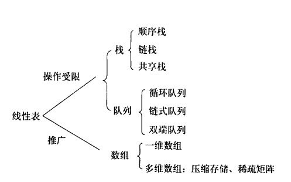
<!-- more -->
# 栈
首先栈是一种线性表，但只允许在一端进行插入和删除，即栈是插入删除等操作受限的线性表（逻辑结构）。
## 概念
栈顶，线性表允许进行插入删除的一端；
栈底，不允许进行插入和删除的一端；
空栈，不含任何元素的空表；
特点：后进先出（LIFO）；
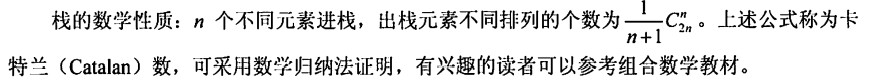

## 顺序存储
### 顺序栈
采用顺序存储的栈称为顺序栈，用一组地址连续的存储单元存放元素，同时用一个指针保存当前栈顶元素的位置。
```
#define MaxSize 50
typedef struct{
    ElemType data[MaxSize];
    int top;
}SqStack;
```
栈空：top==-1；
栈满：top==MaxSize-1；
栈长：top+1；
栈顶元素：S.data[S.top];

### 基本操作
```
//栈初始化
void InitStack(SqStack &S)
{
    S.top = -1;
}
```

```
//判栈空
bool StackEmpty(SqStack &S)
{
    if(S.top == -1)
        return true;
    else
        return false;
}
//判栈满操作相似
```

```
//进栈
bool Push(SqStack &S, ElemType x)
{
    if(S.top == MaxSize - 1)
    {
        return false;
    }
    S.top++;
    S.data[S.top] = x;
    return true;
}
```

```
//出栈
bool Pop(SqStack &S, ElemType &x)
{
    if(S.top == -1)
        return false;
    X = S.data[S.top];
    S.top--;
    return true;
}
```

```
//读栈顶元素
bool GetTop(SqStack S, ElemType &x)
{
    if(S.top == -1)
        return false;
    x = S.data[S.top];
    return true;
}
```

### 共享栈
将两个栈共享在同一个数组空间，栈底设置在两端，两个栈向中间延伸。
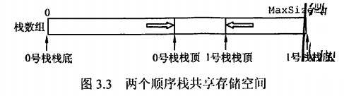

## 链式存储
采用链式存储的栈叫链栈，优点是便于多个栈共享存储空间和提高效率，不存在栈满上溢的情况。

一般用单链表实现，头结点同样会有影响。

```
trpedef struct LinkNode{
    ElemType data;
    struct LinkNode *next;
}*LinkStack;
```
# 队列
也是一种操作受限的线性表，只允许在表的一端插入，另一端删除，特点是先进先出（FIFO）。
## 概念
队头，允许删除的一端；
队尾，允许插入的一端；
空队列，不含任何元素的空表。
## 顺序存储
### 普通顺序存储
分配一块连续的存储单元存放队列元素，同时用队头指针指向队头元素，队尾指针指向队尾元素。
```
#define MaxSize 50
typedef struct{
    ElemType data[MaxSize];
    int front, rear;
}SqQueue;
```
```
//初始化
bool InitQueue(SqQueue &Q)
{
    Q.front = 0;
    Q.rear = 0;
}
```
但是由于顺序队列有一个缺点，在计算过程中会发生假上溢：
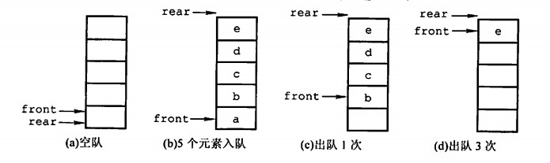
此时判空可以通过队首队尾指针是否相同判断，但是要判满就不能实现了，所以要用循环队列的方式克服。

### 循环队列
将队列想象成环状的空间，当队首计算到MaxSize-1时，再出队则队首变为0，用取余运算实现。
初始：Q.front=0;Q.rear=0;
队首指针进一：Q.front=(Q.front+1)%MaxSize;
队尾指针进一：Q.rear=(Q.rear+1)%MaxSiae;
队列长度：(Q.rear + MaxSize - Q.front) % MaxSize;

判空判满：需要单独处理。

1）牺牲一个单元来区分，约定当队头在队尾的下一位置时队满，此时
队满：(Q.rear + 1)%MaxSize == Q.front;
队空：Q.front == Q.rear;
2)增加一个表示元素个数的数据成员，用来保存个数判断；
3）增加tag数据成员，tag=0，若因为删除导致Q.front == Q.rear，则是队空；tag=1，如果因为插入导致Q.front == Q.rear，则为队满。

```
//判空
bool isEmpty(SqQueue Q)
{
    if(Q.rear == Q.front)
        return true;
    return false;
}
```


```
//入队
bool EnQueue(SqQueue &Q, ElemType x)
{
    if((Q.rear + 1) % MaxSize == Q.front)
        return false;
    Q.data[Q.rear] = x;
    Q.rear = (Q.rear + 1) % MaxSize;
    return true;
}
```

```
//出队
bool DeQueue(SqQueue &Q, ElemType &x)
{
    if(Q.rear == Q.front)
        return false;
    x = Q.data[Q.front];
    Q.front = (Q.front + 1) % MaxSize;
    return true;
}
```
## 链式存储
队列的链式存储叫做链队列，实际上就是同时有头指针和尾指针的单链表。
```
typedef struct LinkNode{
    ElemType data;
    struct LinkNode *next;
}LinkNode;

typedef struct{
    LinkNode *front, *rear;
}LinkQueue;
```

```
//初始化
void InitQueue(LinkQueue &Q)
{
    Q.front = Q.rear = (LinkNode*)malloc(sizeof(LinkNode));
    Q.front->next = NULL;
}
```

```
//判空
bool IsEmpty(LinkQueue Q)
{
    if(Q.front == Q.rear)
        return true;
    else
         return false;
}
```

```
//入队
void EnQueue(LinkQueue &Q, ElemType x)
{
    LinkNode *s = (LinkNode*)malloc(sizeof(LinkNode));
    s->data = x;
    s->next = NULL;
    Q.rear->next = s;
    Q.rear = s;
}
```

```
//出队
bool DeQueue(LinkQueue &Q, ElemType &x)
{
    if(Q.front == Q.rear)
        return false;
    LinkNode *p = Q.front->next;
    x = p->next;
    Q.front->next = p->next;
    if(Q.rear == p)
    {
        Q.rear=Q.front;
    }
    free(p);
    return true;
}
```
## 双端队列
双端队列允许队列两端都能进行入队和出队操作，将两端称为前端和后端。

输出受限的双端队列是只允许一端进行入队出队，另一端入队操作。

输入受限的双端队列是只允许一端进行入队出队，另一端出队操作。
# 栈和队列的应用
栈和队列不仅仅有这些应用，下面是一些例子，要掌握规律。
## 栈——括号匹配
括号匹配问题是要求将一个表达式中相同但方向相反的括号进行匹配，例如读到（后一定会出现），否则表达式错误。

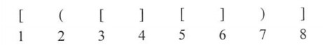

该过程和栈的思想吻合，设置如下：
空栈顺序读入括号；
读入左括号入栈，直到等待下一个同类型右括号才能出栈；
读入右括号入栈，如果和栈顶不一致，那么就是非法的。

## 栈——表达式求值
表达式求值涉及到中缀后缀表达式的转换，感兴趣还可以看看表达式树。总之，栈可以用来计算后缀表达式的值。

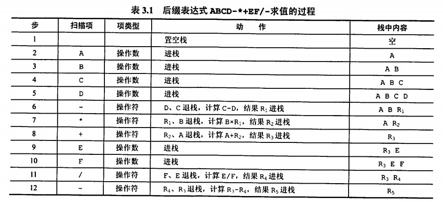

具体流程是，按顺序读入表达式，如果读入的是值，则入栈；如果读入的是操作符，则进行两次出栈操作并将两个值的运算结果重新入栈，直到栈中只有一个值。

## 栈——递归
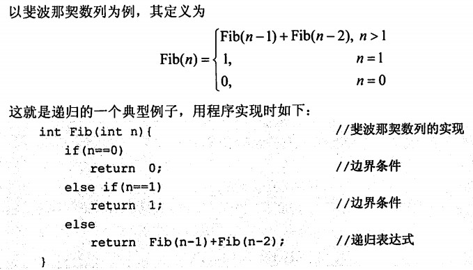
将递归转换为非递归算法，通常需要用栈实现。
## 队列——层次遍历

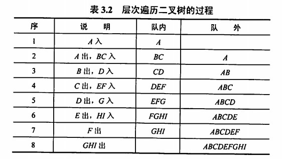

## 队列在计算机系统中应用
队列在计算机中应用非常广泛，可以解决外设和计算机速度不匹配的问题，另外还可以解决多用户引起的资源竞争问题。
# 数组和特殊矩阵
着重研究怎么更有效地存储矩阵，并提取元素。
## 定义
数组，由n个相同类型的数据元素构成的有限序列，数组元素的下标取址范围称为数组的维界。

数组是线性表的推广，一维数组可以视为线性表，二维数组可以视为元素是线性表的线性表。

数组的维数和维界确定后就不能修改。
## 存储结构
采用数组数据类型进行存储，一个数组的所有元素在内存中占用一端连续的存储空间。

对于多维数组可以采用行优先和列优先的方法存储。
## 特殊矩阵的压缩存储
压缩存储，为多个相同值的元素分配同一个存储空间，对零元素不分配空间，从而节省存储空间。

特殊矩阵，由许多元素相同，并且分布有一定规律性，如对称矩阵，三角矩阵，对角矩阵等。

特殊矩阵的压缩存储：找到值相同元素的分布规律，压缩存储到一个存储空间中。

### 对称矩阵
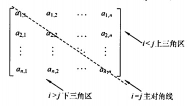
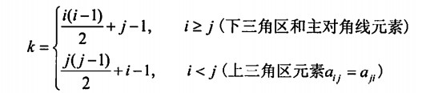
第*i*行有*j-1*个元素，依次类推。

### 三角矩阵
三角矩阵指上三角或下三角矩阵值相同的特殊矩阵，存储方法和对称矩阵类似，不过存储主对角线、非常量三角区后再存放常量一次。
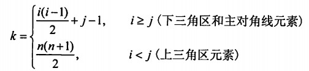

### 对角矩阵
普通对角矩阵直接存储对角线元素即可，这里以三对角矩阵为例，所有非零元素集中在以主对角线为中心的三条对角线上。
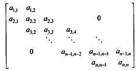
*k=2i+j-3*

## 稀疏矩阵
矩阵中非零元素很少，仅存储非零元素。
将非零元素以及其行列构成一个三元组，稀疏矩阵压缩后失去了随机存取特点。
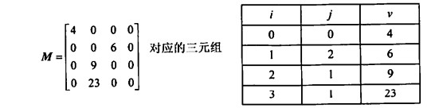


