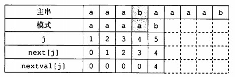

# 前言
主要是掌握字符串模式匹配，KMP匹配算法原理以及next数组推理过程。了解nextval数组求解的方法。

<!-- more -->
王道书中讲解next数组代码求法部分写的不太清晰，建议先看这篇[知乎文章](https://www.zhihu.com/question/21923021)理解。这是一个链接
# 串
串就是字符串的简称，下面先介绍存储结构和基本操作。
## 定义
串，由零个或多个字符组成的有限序列，一般记为：

长度n为0时，称为空串。

子串，任意多个连续的字符组成的子序列称为该串的子串；

主串，包含子串的串；

位置，字符在串中的序号；

相等，两个串长度和对应位置的字符都相同；

空格串，由一个或多个空格组成的串；

串对比线性表，只是数据类型限定为字符集；线性表操作以元素为主，串的操作以子串为主。
## 存储结构
### 定长顺序存储
用一组地址连续的存储单元存储字符，即定长数组。超过预定长度的串值会被截断，串长可以由额外的变量来存放，也可以在串尾加上不及长度的标记字符，隐含串长。

### 堆分配存储
仍然用一组地址连续的存储单元存放，但是存储空间动态分配，malloc为每个新串在自由存储区“堆”内分配空间。

### 块链存储
类似线性表的链式存储结构，每个结点称为块，可以存放一个或多个字符，整个链表称为块链结构。
## 基本操作


其中串赋值，比较，串长，连接，子串五种操作为基本操作，其他操作可以通过这五种实现。

# 串的模式匹配
串的模式匹配就是子串的定位操作，即求子串（模式串）在主串中的位置。
## 简单模式匹配算法
暴力匹配算法：
遍历主串和子串的每一个字符，用两个指针标识比较的字符位置，当两个字符相同，那么两个指针加1继续比较下一个字符；如果字符不同，那么主串指针从主串的下一个字符位置开始重新匹配，子串指针从头开始匹配。遍历完成后，如果子串的指针超过了子串长度，那么说明匹配成功，返回主串指针回退子串长度个单位的值；否则匹配失败返回0。
```c
int Index(SString S, SString T)
{
    int i = 0, j = 0;
    while(i <= S.Length() - 1 && j <= T.Length() - 1)
    {
        if(S[i] == T[j])
        {
            i++, j++;
        }
        else
        {
            i = i - j + 1;
            j = 0;
        }
    }
    if(j == T.Length())
        return i - T.Length();

    return 0;
}
```

时间复杂度为O(mn)。

## KMP算法
王道这部分讲得一般，前面手推还好，后面代码实现基本无法理解，也可能是我没智商吧。

前缀：除最后一个字符外所有子串；
后缀：除第一个字符外所有子串；
部分匹配值：前后缀的最长相等前后缀长度；

KMP算法利用公式“移动位数 = 已匹配字符数 - 对应部分匹配值”改进暴力算法，缩短子串指针的回退长度，每次发生不匹配的时候，通过公式算出下一次移动的位数，重新匹配，而非简单地进1，具体做法后面说。

其中对应部分匹配值通过查询PM表获得。


从左到右提取子串，长度依次加一：

* 'a'的前后缀都为空，所以部分匹配值为0；
* 'ab'的前缀为{a}，后缀{b}，交集为空，匹配值为0；
* 'abc'的前缀{a,ab}，后缀{c,bc}，交集为空，匹配值为0；
* 'abca'的前缀{a,ab,abc}，后缀{a,ca,bca}，交集为{a}，匹配值为1；
* 'abcac'的前缀{a,ab,abc,abca}，后缀{c,ac,cac,bcac}，交集为空，匹配值为0；

通过这样的方式就得到了PM表(Partial Match)。它记录了前i个字符组成的串中前后重复的字符个数，下面看看如何使用它。

### 原理


KMP公式中“已匹配字符数”表示如果最后一个匹配字符的部分匹配值为0的时候，子串应该在主串上移动的距离，因为这部分串已经和模式串不同了，需要直接移动模式串到主串的下一位并从头开始比较，而且部分匹配值为0说明此时头部和尾部没有相同的部分，没必要比较。这等价于主串指针进一的情况下，将子串的指针退回到0。

如果匹配的最后一个字符的部分匹配值不为0，说明子串的这个地方首尾会发生重复，本例中就是'a'发生重复，既是最后一个匹配的字符，同时也是子串开头，下一次移动的时候应该把子串移动到这里，使得子串开头的'a'同主串的'a'对齐，并且从这里继续匹配，从而防止跳过而发生遗漏。

总的来说，“已匹配字符数 - 对应部分匹配值”表示用不重复的情况下应该移动的距离，减去重复的字符个数，就能计算出实际要移动的距离了。上图中已匹配字符数为4，但是重复了一个字符，所以只能移动三下。逐个比较i，j指向的字符，不论是否成功都让i++，j根据下面的比较结果计算。

右移步数Move = (j-1) - PM[j-1];

直接使用PM表时，由于要指针减1找到最后匹配的字符，所以不妨直接将PM表的值右移，得到next数组：


右移步数Move = (j-1) - next[j];

* 右移空缺用-1填补，第一个元素不匹配通过公式也可以算出要移动到下一位；
* 溢出的元素舍去，因为没有需要使用这个匹配值的元素了；

前面说了，右移的操作等价于将模式串(子串)的指针j回退，j计算为：
j = j - Move = next[j] + 1;

有时为了简洁，还将next数组整体加1，就省去了上面公式的加1，从而直接移动即可。


这样将公式化简为：
j = next[j];
含义为：在子串的第j个字符发生不匹配时，跳到子串的next[j]位置重新与主串当前位置匹配。例如4.4图中在编号为5时匹配失败了，但是i++，j更新为next[5]=2，c和c又对齐了，继续比较。

### next数组的一般公式
上面推导next公式用代码表示其实比较繁琐，我们需要不断比较前后缀并找到最长的相同前后缀。有没有更一般的方法？

通过对模式串的遍历，我们可以快速求出next数组。定义left指向当前长度下，最长相同前缀的后一个元素，由于数组从0开始，它的值还代表了达到当前长度时，相同前后缀的最长长度。right指向最长后缀的后一个元素，我们用它遍历整个模式串。

代码如下。
```C++
    int kmp(string haystack, string needle) {
        //特例返回
        if(needle.size() == 0) return 0;

        //next数组，大小和模式串相同
        vector<int> next(needle.size());
        next[0] = 0;

        //遍历求next数组
        for(int left = 0, right = 1; right < needle.size(); right++)
        {
            //匹配失败，回溯到前一个匹配的
            while(left > 0 && needle[left] != needle[right])
            {
                left = next[left-1];
            }
            //匹配成功，left++
            if(needle[left] == needle[right])
            {
                left++;
            }
            //left的值代表当前长度下，最长相同前缀的后一个元素
            //由于数组从0开始，它的值还代表了达到当前长度时，相同前后缀的最长长度
            next[right] =  left;
        }

        //匹配主串
        for(int i = 0, j = 0; i < haystack.size(); i++)
        {
            //匹配失败，寻找回溯值
            while(j > 0 && haystack[i] != needle[j])
            {
                j = next[j-1];
            }
            //匹配成功，模式串指针++
            if(haystack[i] == needle[j])
            {
                j++;
            }
            //如果j已经匹配完成，返回主串中的起始地址
            if(j == needle.size()) return i - needle.size() + 1;
        }

        return -1;
    }

```
下面再解释一下如何求next数组，先理解left和right。

通过前面公式我们定义next[0] = 0，现在要求next[j+1]。我们先看abcab这个模式串。根据left和right的初始化，我们知道刚开始它们分别指向a和b，由于不相等，我们让b的next值为next[j-1]=0，也就是a的next值。一直重复，直到迭代到第二个a，发现有重复了，那么我们就让left和right同时进1，看看后面还有没有进一步的重复，让第二个a的next值为1。

然后发现同时进1后left和right指向的b也是相同的，那么b对应的next值就是c的下标，它就是left在匹配成功之后进1的值。所以说left就是最长相同前后缀的长度，指向最长相同前缀的后一个位置。right和left在匹配成功后会同步地进1，right指向的是最长相同后缀的后一个位置。

然后理解left = next[left-1]。

在下面的例子中，left在前缀中达到了d，right在后缀中达到了c，它们前面的部分都是匹配的，此时应该寻找有没有短一些的相同前后缀，所以让指向d的left回溯到前一个位置上next的状态，也就是b对应的2。


这个值说明什么？说明在right指向的c前面，已经有两个字符是相同的前后缀(下图中的ab)，我们不用比较它们，得让left为2，也就是前缀中第三个字符和当前字符比较，发现是相同的，那么我们相同前后缀长度就又可以+1了，下面图中的？就应该是2+1=3。


如果不相同，那么就会一直回溯直到left为0，此时没有相同的前后缀，left不会移动，right++，比较下一个字符和第一个字符。

## KMP算法的优化
形如aaabaaaab的主串匹配aaaab模式串时，KMP算法会对前面几个a一一比对，显然没有必要。关键在于出现了T[j]=T[next[j]]，因此如果出现这种情况，则再进行一次递归：
```C++
//另一种求next的写法，除了改进的部分过程是一样的
void get_nextval(String T, int nextval[])
{
    int i = , j = 0;
    nextval[1] = 0;
    while(i<T.Length())
    {
        if(j == 0 || T.ch[i] == T.ch[j])
        {
            i++, j++;
            if(T.ch[i] != T.ch[j])
                nextval[i] = j;
                //如果不相等则正常加1
            else
                nextval[i] = nextval[j]; 
                //相等则递归一次
        }
        else
            j = nextval[j];
    }
}
```


>只需要递归一次，相同的值就会传递下去，这样修正了next数组。
