# 前言
本章介绍树这种数据结构。重点内容是树和二叉树的性质，遍历操作，转换，存储结构等；满二叉树，完全二叉树，线索二叉树，哈夫曼树；二叉排序树，二叉平衡树。
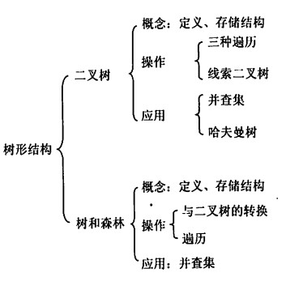
<!-- more -->
# 树
## 定义
树是n个结点的有限集。n=0时称为空树。树有以下性质：
* 只有一个称为根的结点；
* n>1时，结点可以分为若干互不相交的有限集，也就是子树；
* 根结点没有前驱；其他结点都只有一个前驱；
* 所有结点可以有任意个后继；
可以看出,树是一种递归定义的结构，适合表示有层次结构的数据，并且n个结点的树含有n-1条边。
## 基本概念
祖先，从根结点到目标结点上的任意结点都是目标结点的祖先；
双亲，目标结点的前驱；
孩子，目标结点的后继；
兄弟，具有相同双亲的结点；
堂兄弟，具有同一层次的结点；
度，目标结点孩子的个数；树中最大的度称为树的度；
分支结点，度大于0的结点；
叶子结点，度等于0的结点；
层次，从第一层根结点累计增加；
深度，从根结点逐层积累的层次；
高度，从叶子结点逐层积累的层次；
树高，树中结点的最大高度；
有序树，各子树从左到右有次序；
无序树，各子树从左到右没有次序；
路径，两个结点之间在树中的路径序列；
路径长度，路径序列的结点数；
森林，m棵互不相交的树的集合。

## 性质
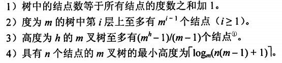

# 二叉树
## 定义
二叉树是n个结点的有限集，每个结点至多有两个子树，且子树左右不能颠倒，左子树和右子树分别是一棵二叉树；

二叉树不同于度为2的有序树：1）度为2的有序树最少需要三个结点，否则度小于2；2）度为2的有序树如果某个结点只有一个孩子，则不需要区分左右，但是二叉树仍然需要。

## 特殊二叉树
### 满二叉树
一棵高度为h，且含有2的h次方-1个结点的二叉树称为满二叉树，每层结点都是满的，除叶子结点外。

编号：自上而下，从左到右。对于编号为i的结点，其双亲编号为i/2向下取整，左孩子2i，右孩子2i+1。
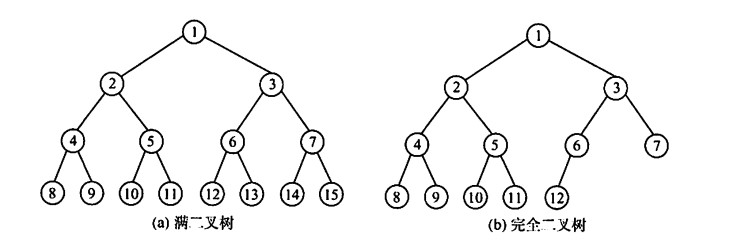


### 完全二叉树
高度为h，有n个结点的二叉树，当且仅当每个结点都与满二叉树对应时称为完全二叉树。
满足以下性质：
* i<=n/2向下取整，则结点i为分支结点；否则为叶子结点；
* 叶子结点只在最大的两层中出现，且最大层次中的叶子结点都在该层左边的位置上；
* 如果有度为1的结点，那么只有一个，且只有左孩子；
* 出现结点i为叶子结点，或者只有左孩子，那么编号大于i的结点全部为叶子结点；
* 奇数分支结点度都为2；偶数分支结点中最大的只有左孩子，其他都有；

### 二叉排序树
左子树所有结点关键字小于根，右子树所有结点关键字大于根，且左右子树依然是二叉排序树；

### 平衡二叉树
平衡二叉树，树上任意结点的左子树和右子树的深度差不超过1；

## 性质
* 非空二叉树上叶子结点数等于度为2的结点数加1，n0 = n2 + 1；
* 非空二叉树第i层至多有2的i-1次方个结点；
* 高度为h的非空二叉树至多有2的h次方-1个结点（等比数列）；
* 完全二叉树，结点i的双亲为i/2向下取整；i为偶数，是左孩子；i为奇数，是右孩子；2i<=n，i的左孩子编号为2i，否则没有左孩子；2i+1<=n，右孩子编号为2i+1，否则没有右孩子；结点i的深度为log(i)向下取整加1；
* 具有n个结点的完全二叉树高度为log(n+1)向上取整或log(n)向下取整加1；

## 存储结构
### 顺序存储
用一组连续地址的存储单元从上往下，从左到右存储结点。

完全二叉树和满二叉树采用顺序存储比较合适，可以直接通过特殊关系映射到序号上；一般二叉树只能添加空结点从而与完全二叉树对照。

>如果数组下标从0开始，不满足完全二叉树的编号计算性质，所以最好从1开始。

### 链式存储
顺序存储空间利用率比较低，所以一般采用链式存储，结点至少有数据域，左指针域和右指针域。
```
typedef struct BiTNode{
    ElemType data;
    struct BiTNode *lchild, *rchild;
}BiTNode, *BiTree;
```
含有n个结点的二叉链表，含有n+1个空链域。

# 二叉树的遍历和线索二叉树
## 二叉树遍历
二叉树的遍历是指按照某条路径访问树中的每个结点，让所有结点都被访问一次。
### 先序遍历
```
void PreOrder(BiTree T)
{
    if(T != NULL)
    {
        visit(T);
        PreOrder(T->lchild);
        PreOrder(T->rchild);
    }
}
```

### 中序遍历
```
void InOrder(BiTree)
{
    if(T != NULL)
    {
        InOrder(T->lchild);
        visit(T);
        InOrder(T->rchile);
    }
}
```

### 后序遍历
```
void PostOrder(BiTree)
{
    if(T != NULL)
    {
        PostOrder(lchild);
        PostOrder(rchild);
        visit(T);
    }
}
```
这里给出一个例子：
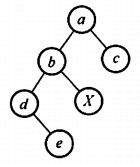
前序：abdexc
中序：debxac
后续：edxbca

### 递归和非递归
上面三种遍历方式都是递归的，时间复杂度均为O(n)。要实现递归方法到非递归方法的转变，可以借助栈来实现。
```
void PreOrder1(BiTree T)
{
    InitStack(S);
    BiTree p = T;
    while(p != NULL || IsEmpty(S))
    {
        if(p != NULL)
        {
            visit(p);
            Push(S,p);
            p = p->lchild;
        }
        else
        {
            Pop(S,p);
            p = p->rchild;  
        }
    }
}
```

```
void InOrder1(BiTree T)
{
    InitStack(S);
    BiTree p = T;
    while(p != NULL || IsEmpty(S))
    {
        if(p != NULL)
        {
            Push(S,p);
            p = p->lchild;
        }
        else
        {
            Pop(S,p);
            visit(p);
            p = p->rchild;  
        }
    }  
}
```
前序遍历和中序遍历思想差不多，都是在寻找左子树的同时用栈记录走过的路径，并在左子树为空的时候利用出栈操作找到双亲结点接着记录。所以后序遍历就难以实现，因为后序遍历的根结点在最后才进行访问。

所以，后序遍历的非递归应该是，搜索到左子树为空后依然不能将双亲结点其出栈访问，而是取栈顶并访问右子树，做相同操作，直到右子树为空，或者右子树确定被访问完毕，才能出栈并访问。非递归后序遍历利用了后续遍历的关键性质，一个已经返回的节点，它的左右子树也必定返回过，且上一个返回的节点就是它的右子树。
```C++
vector<int> postorderTraversal(TreeNode* root) {
        vector<int> ans;
        if(root == nullptr) return ans;

        TreeNode* prev = nullptr;
        stack<TreeNode*> s;
        
        while(root != nullptr || s.empty() == false)
        {
            //先找左孩子
            while(root != nullptr)
            {
                s.push(root);
                root = root->left;
            }

            //取出非空左孩子
            root = s.top();
            s.pop();
            
            //判断是否能返回
            if(root -> right == nullptr || prev == root->right)
            {
                ans.push_back(root->val);
                prev = root;
                root = nullptr;
            }
            else
            {
                s.push(root);
                root = root->right;
            }

        }
        return ans;
    }
```

### 层次遍历
在线性表一章提到过，要实现层次遍历可以利用队列实现。入队顺序按照根结点、左子树、右子树的顺序，并在出队的时候进行访问，就实现了层次遍历。
```
void LevelOrder(BiTree T)
{
    InitQueue(Q);
    BiTree p = T;
    EnQueue(Q,T);
    while(!IsEmpty(Q))
    {
        DeQueue(Q,p);
        visit(p);
        if(p->lchild != NULL)
            EnQueue(Q,p->lchild);
        if(p->rchild != NULL)
            EnQueue(Q,p->rchild);
    }
}
```

### 根据遍历序列确定二叉树
这个问题本身不算是严格的算法，只是该类题型比较多，因此重点记录。

中序遍历+前序遍历可以确定二叉树；
中序遍历+后续遍历可以确定二叉树；
中序遍历+层次遍历可以确定二叉树；
前序遍历+后续遍历不能确定；

确定的方法就是找根结点的位置，对比两种序列的相同根节点，最后就能确定了。

## 线索二叉树
### 概念
以一定的规则将二叉树中的结点排列成一个线性序列。这个规则可以是前中后序的遍历，节点的前驱后继通过遍历后的序列唯一确定。

前面有结论，n个结点的二叉树有n+1个空指针（链式存储），为了加快查找结点前驱和后继的速度，利用这些空指针来存储指向结点前驱和后继的指针。

因此直接做规定：结点没有左子树，则lchild指向前驱；没有右子树，lchild指向后继。除此之外，为了表示左右指针指向孩子还是前驱后继，要额外引入两个标记值来记录。
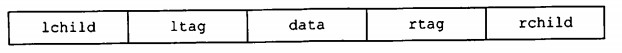

```
typedef struct ThreadNode
{
    ElemType data;
    struct ThreadNode *lchild, *rchild;
    int ltag, rtag;
}ThreadNode, *ThreadTree
```

### 中序线索二叉树的构造
二叉树线索化就是将空指针改为前驱后继，因此实际上是要遍历一遍二叉树。
```
InThread(ThreadTree &p, ThreadTree &pre)
{
    if(p != NULL)
    {
        InTread(p->lchild, pre);
        if(p->lchild == NULL)
        {
            p->lchild = pre;
            p->ltag = 1;
        }
        if(pre != NULL && pre->rchild == NULL)
        {
            pre->rchild = p;
            pre->rtag = 1;
        }
        pre = p;
        InThread(p->rchild, pre);
    }
}
```
判断左指针是否指向前驱的时候，因为用pre保存了p的前驱，所以比较方便，p的左指针为空就用pre赋值；但是判断右指针是否指向后继的时候比较麻烦，因为p的后继没有访问到，所以只能访问pre的后继p，判断pre的右指针从而决定要不要赋值。
```
void CreateInTread(ThreadTree T)
{
    ThreadTree pre = NULL;
    if(T != NULL)
    {
        InThread(T,pre);
        pre->rchild = NULL;//处理最后一个结点的后继
        pre->rtag = 1;
    }
}
```

### 中序线索二叉树的遍历
由于已经保存了后继信息，所以从第一个结点开始依次访问其后继。定义一个结点的后继是，如果右标志为1，则直接访问后继线索；否则目标结点右子树中第一个中序遍历访问的结点为其后继。
```
//先找到中序遍历的首结点
ThreadNode *FirstNode(Thread *p)
{
    while(p-ltag == 0)
    {
        p = p->lchild;
    }
    return p;
}
```

```
//然后找目标结点后继
ThreadNode *NextNode(ThreadNode *p)
{
    if(p->rtag == 0)
        return FirstNode(p->rchild)
    else
        return p->rchild;
}
```
```
//不含头结点的中序线索二叉树遍历算法
void InOrderThread(ThreadNode *T)
{
    for(ThreadNode *p = FirstNode(T); p != NULL; p = NextNode(p))
        visit(p);
}
```

### 前序和后序线索二叉树
前序和后序进行线索化的过程类似，只是按照遍历顺序不同结点前驱后继有所改变。
总之，按照对应的线索化序列遍历，结点前面就是前驱，后面就是后继，没有就置空，然后修改空指针即可。

# 树、森林
## 存储结构
树的存储方式有多种，要求能唯一反应结点的逻辑关系。
### 双亲表示法
顺序存储，同时为每个结点增加一个伪指针，指向双亲。其中根结点下标为0，伪指针为-1。
```
#define MAX_SIZE 100
typedef struct{
    ElemType data;
    int parent;
}PTNode;

typedef struct{
    PTNode nodes[MAX_SIZE];
    int n;//结点数
}PTree;
```
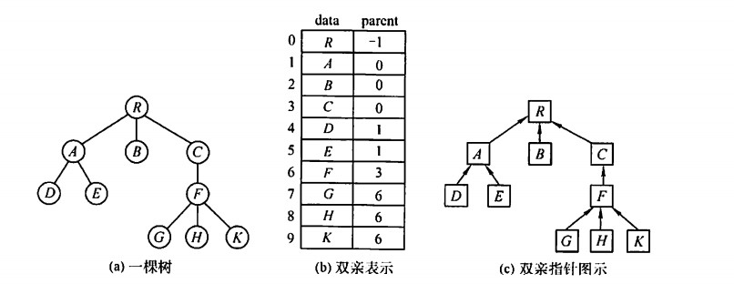
求双亲直接，求孩子需要遍历。
>区别于二叉树的顺序存储，因为限制了二叉树的形状是完全二叉树，所以下标既表示结点也能表示关系；而树的顺序存储因为不知道形状，所以不能确定，要用数组中的额外内容确定关系。

### 孩子表示法
将每个结点的孩子结点都用单链表连接起来形成线性结构，n个结点就有n个孩子链表。
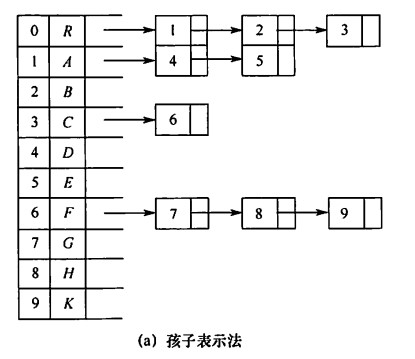
求孩子直接，求双亲要遍历。

### 孩子兄弟表示法
以二叉链表作为树的存储结构，每个结点包括三部分：结点值，指向结点第一个孩子结点的指针，指向结点下一个兄弟结点的指针，从而表示所有结点关系。
```
typedef struct CSNode{
    ElemType data;
    struct CSNode *fitstchild, *nextsibling;
}CSNode, *CSTree;
```
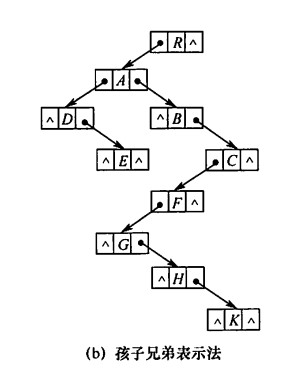
优点是容易转换树为二叉树，查找孩子结点；缺点是难查找双亲结点。

## 树、二叉树、森林的转换
树->二叉树：左孩子右兄弟，即使用二叉链表来存储树；
兄弟之间加连线；每个结点只保留和第一个孩子的连线，删掉其他连线；以树根为中心顺时针旋转45度。

森林->二叉树：将森林每棵树转化为二叉树，然后按照右子树依次连接；
每棵树转化成二叉树后，在每棵树的根之间加连线，以第一颗树的根为中心顺时针旋转45度。

二叉树->森林（树）：断开右子树，直到得到一棵没有右子树的二叉树；对每棵二叉树再转化成树（拆开的二叉树没有右子树，根节点连着的都是孩子结点），就得到了森林。
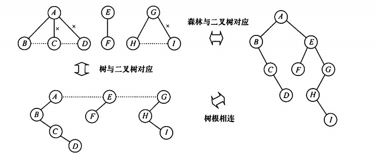

## 树和森林的遍历
树：
* 先根遍历：先访问根节点，再依次访问结点的每棵子树；（类似前序遍历）
* 后根遍历：先遍历每棵子树，再访问根节点；（类似中序遍历）
* 层次遍历：与前面介绍的相同；

森林：
* 先序遍历森林：先序遍历第一颗子树，再遍历剩下的森林；
* 中序遍历森林：中序遍历第一颗子树，再遍历剩下的森林；

森林的先序和中序遍历为其对应二叉树的先序和中序遍历。
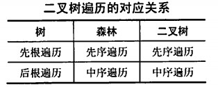

# 树和二叉树的应用
## 哈夫曼树
带权路径长度，从树根到任意结点的路径长度与该结点权值的乘积。树中所有叶子结点的带权路径长度之和称为树的带权路径长度。

在一棵含有n个带权叶子结点的二叉树中，按照不同方式构造，带权路径长度最小的二叉树称为哈夫曼树。

### 构造
给定n个带权叶子结点，构造哈夫曼树：
* 每个结点作为一个二叉树，构成森林；
* 选出权值最小的两个结点作为左右子树，根结点权重为两结点之和；
* 新得到的二叉树放入森林，并删除刚才选出的两个结点；
* 重复上面的步骤，直到森林中只剩下一棵树；
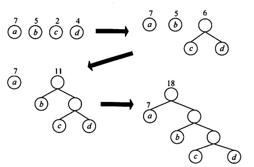

可以看到，权值越小的结点离根结点越远；n个叶子结点构造的哈夫曼树共有2n-1个结点；不存在度为1的结点。

### 哈夫曼编码
数据通信中，哈夫曼编码是一种数据压缩编码，也是可变长度编码，给出现频率高的字符以较短编码，出现频率低的字符以较长编码。

另外，没有字符的编码是另一个字符编码的前缀，这种编码方式称为前缀编码。哈夫曼编码也是前缀编码。

在哈夫曼树中，将每个字符当作一个独立的叶子结点，权值为出现的频度，构造出哈夫曼树，使得较高频率的字符离树根较近。
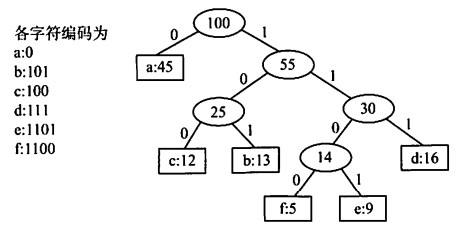
将编码与边进行映射，0表示转向左孩子，1表示转向右孩子。这时哈夫曼树的带权路径长度WP(Weighted Path Length)可以视为得到的字符串二进制编码长度，哈夫曼树可以设计出总长度最短的二进制前缀编码。哈夫曼树并不唯一，但相同层的结点应该相同，只是顺序不同（代表着WPL相同）。

## 并查集
并查集是一种简单的集合表示，支持三种操作，主要用来处理不相交集合的合并和查询。
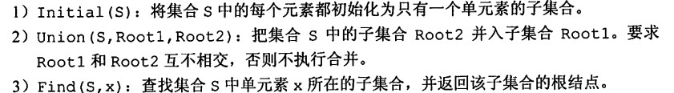
一般用树的双亲表示作为并查集的存储结构，初始时每个子集用一棵树表示，所有子集构成森林，将他们的双亲存储在数组内（此时没有双亲就是自己），此时还没有集合进行过合并；让数组元素下标代表元素名，数组内容代表双亲；

>408书中说这里如果一个结点是根结点，那么就把他的双亲数组内容设置为负数；否则设置为他的双亲。但是我看其他地方没有这个规定，只要把它的双亲按照初始化设置为自己就行了，这样在后面查找的时候一直查找双亲就能找到根结点，不过需要改一下查找循环的判断条件。

```
#define SIZE 100
int UFsets[SIZE];
//初始化
void Initial(int S[])
{
    for (int i = 0; i < SIZE; i++){
        S[i] = -1;
    }
}
//查找
int Find(int S[], int x)
{
    while(S[x] >= 0)
    {
        x = S[x];
    }
    return x;
}
//合并Root2到Root1中
void Union(int S[], int Root1, int Root2)
{
    S[Root2] = Root1;
}
```

