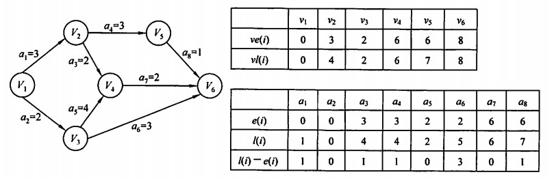

# 前言
本章介绍图这种数据结构。图相关的算法重点是深度优先搜索(DFS)和广度优先搜索(BFS)；对图本身要掌握基本概念和性质，以及存储结构及其转化，在存储结构上的操作。重在掌握思想方法。

<!-- more -->

# 概念
## 定义
图*G*由顶点集*V*和边集*E*组成，记为*G = (V,E)*，其中*V(G)*表示图G中顶点的有限非空集；*E(G)*表示图G中顶点之间的关系集合。
*|V|，|E|*分别表示顶点数和边数。

>线性表和树都可以是空的，但是图不能为空，即顶点集非空，边集可以为空。

* 有向图：*E*是有向边的集合，图就是有向图。其中有向边是顶点有序对*<v,w>*，*v*是弧头，*w*是弧尾。
* 无向图：*E*是无向边的集合，图就是无向图。其中无向边是顶点无序对*(v,w)*，两者可以调换位置。
* 简单图：如果图没有重复边，没有顶点自环，那么就是简单图；
* 多重图：如果两个顶点边数大于1条，且允许顶点自环，图就是多重图；
* 完全图：在任意两个顶点之间都存在边；对无向图共有*n(n-1)/2*条边；有向图共有*n(n-1)*条边；
* 子图：设有两个图*G(V,E)*和*G1(V1,E1)*，如果其中一个图的边集和顶点集都分别是另一个图边集和顶点集的子集，该图就是另一个图的子图；
* 连通：无向图中如果从顶点*v*到顶点*w*有路径存在，那么*v*和*w*就是连通的；
* 连通图：无向图中任意两个顶点都是连通的，就是连通图；
* 连通分量：无向图中的极大连通子图称为连通分量；下图中左图一共有三个连通分量；
>一个非连通图有n个顶点，最多有n-1条边；加入任意一条边就变成连通图


* 强连通：在有向图中，如果从顶点*v*到顶点*w*和从*w*到*v*都有路径存在，这两个点就是强连通的；
* 强连通图：有向图中任意顶点都是强连通的，图就是强连通图；
* 强连通分量：有向图中的极大强连通子图就是强连通分量；
>一个有向连通图最少需要n条边，构成一个环路；

* 生成树：连通图的生成树是包含图中全部顶点的极小连通子图；顶点数为n的生成树含有n-1条边，少一条变成非连通图，多一条变成一个回路；
* 生成森林：在非连通图中，连通分量的生成树构成了非连通图的森林；
* 度：顶点*v*的度指顶点连接的边数*TD(v)*。无向图的顶点度之和等于边数的两倍；
* 入度和出度：有向图中入度是以顶点为终点的有向边数目；出度是以顶点为起点的有向边数目；度等于入度和出度之和；有向图的入度和出度相等，并且等于边数。
* 边权：图上每条边的权值叫做边权；带权图也称为网；
* 稠密图和稀疏图：边数很少就是稀疏图(一般|E|<|V|log|V|)；边数很多就是稠密图；
* 路径：从顶点*v*到顶点*w*之间的的路径序列；
* 路径长度：路径上边的数目；
* 回路：第一个顶点和最后一个顶点相同的路径就是回路（环）；
* 简单路径：路径序列中顶点不重复；
* 简单回路：除第一个和最后一个顶点外其余顶点不重复的回路；
* 距离：两个顶点之间最短路径的长度；若不存在则是无穷；
* 有向树：图中一个顶点入度为0，其他入度均为1的有向图。

## 存储结构
### 邻接矩阵
对于非带权图：


对于带权图：


邻接矩阵和图的关系可以用下图表示：
：

```
#define MaxVertexNum 100
typedef char VertexType;
typedef int EdgeType;
typedef struct{
    VertexType Vex[MaxVertexNum];
    EdgeType Edge[MaxVertexNum][MaxVertexNum];
    int vexnum, arcnum;//当前顶点数和弧数；
}MGraph;
```

邻接矩阵有以下特点：
* 无向图的邻接矩阵是对称矩阵；
* 对无向图，第i行非零元素个数就是顶点i的度；
* 对有向图，第i行非零元素个数是出度，第i列非零元素个数是入度；
* 邻接矩阵只适合稠密图；
* 邻接矩阵的n次幂的元素等于从顶点i到顶点j的长度为n的路径数；
* 求两个顶点有没有连边容易，求顶点有多少邻边效率低。

### 邻接表
给每个顶点建立一个单链表，结点表示顶点连接的边（有向图中是以顶点为起始的边），也就是顶点i的边表。边表的头指针和顶点的数据信息采用顺序存储。所以邻接表中有顶点表结点和边表结点。

```
#define MaxVertexNum 100
//边表结点
typedef struct ArcNode{
    int adjvex;
    struct ArcNode *next;
}ArcNode;
//顶点表结点
typedef struct VNode{
    VertexType data;
    ArcNode *first;
}VNode, AdjList[MaxVertexNum];
//邻接表
typedef struct{
    AdjList vertices;
    int vexnum, arcnum;
}ALGraph;
```

邻接表有以下特点：
* 无向图中每条边在邻接表中出现了两次；有向图中每条边只出现一次；
* 邻接表能节省稀疏图的存储空间；
* 求顶点出度可以计算邻接表的结点数，求入度需要遍历整个表；
* 邻接表不唯一，因为边表结点顺序不确定；
* 求顶点邻边容易，求两点连边效率低。

### 十字边表
存储有向图的链式结构，每条弧和每个顶点都建立一个结点：


其中对弧结点，尾指针和头指针分别指向弧尾和弧头两个顶点的位置；hlink指向弧头相同的下一条弧；tlink指向弧尾相同的下一条弧；info存储弧的信息；这样存储弧头相同和弧尾相同的弧分别在一个链表上。

对顶点结点，data存放顶点数据信息，firstin和firstout分别指向以该顶点为弧头和弧尾的第一个弧结点（第一个没有定义，图中是按照序号定义）。


### 邻接多重表
存储无向图的链式结构，边和顶点的结点结构如下：


mark为标志域，标记边是否被搜索过；ivex和jvex是边连接的顶点的位置；ilink指向下一条顶点ivex连接的边；jlink指向下一条顶点jvex连接的边；info存储边信息；

data存储顶点信息；firstegde指向第一条顶点连接的边；


对无向图，邻接多重表和多重表区别只在于邻接表中同一条边用两个结点表示；而多重表只用一个结点，但该结点同时在边连接的两个顶点的链表中。

## 图基本操作

* 遍历：DFS, BFS。

# 图的遍历
## 广度优先搜索
BFS(Breadth-First-Search)，访问起始顶点*v*，然后依次访问它的所有邻接顶点，再进而访问邻接顶点的临界顶点，直到图中所有顶点都访问过；如果有不连接的顶点，则再选择一个进行重复。也就是依次访问距离起始顶点距离为1，2，……的所有顶点。

类似树层序遍历，要借助队列完成。访问一个节点的同时，将它所有的邻居入队，并且从根节点开始访问，这样就可以借助队列先进先出的特点按顺序访问邻居，然后再访问邻居的邻居。
```
bool visited[MAX_VERTEX_NUM];
void BFSTraverse(Graph G)
{
    for (int i = 0; i < G.vexnum; i++)
    {
        visited[i] = FLASE;
    }
    InitQueue(Q);
    for (int i = 0; i < G.vexnum; i++)
    {
        if(!visited[i])
        {
            BFS(G,i);
        }
    }    
}

void BFS(Graph G, int v)
{
    visit(v);
    visit[v] = TRUE;
    EnQueue(Q,v);
    while(!isEmpty(Q))
    {
        DeQueue(Q,v);
        for(w = FirstNeighbor(G,v); w>=0; w = NextNeighbor(G,v,w))
        {
            if(!visited[w])
            {
                visit(w);
                visited[w] = TRUE;
                EnQueue(Q,w);
            }
        }
    }
}
```
图的BFS遍历可以看作二叉树层序遍历的推广。

### 性能分析
空间复杂度：队列最大需要存储所有顶点编号，所以是O(|v|)；
时间复杂度：采用邻接矩阵，遍历一遍顶点且遍历顶点对应的行/列，所以是O(|V|^2)；采用邻接表，要遍历顶点结点和对应边表，所以是O(|V|+|E|)；

### BFS求单源最短路径
下面是一个对非带权图的算法：
```
void BFS_min_distance(Graph G, int u)
{
    for (int i = 0; i < G.vernum; i++)
    {
        d[i] = Inf;//d[i]是从u到i的最短路径
    }
    visited[u] = TRUE;
    d[u] = 0;
    EQueue(Q,u);
    while(!isEmpty(Q))
    {
        DeQueue(Q,u);
        for (w = FirstNeighbor(G,u); w >= 0; w = NextNeighbor(G,u,w))
        {
            if(!visited[w])
            {
                visited[w] = TRUE;
                d[w] = d[u] + 1;
            }
        }
        EnQueue(Q,w);
    }
}
```

### 广度优先生成树
广度遍历得到的生成树。邻接矩阵表示的图有唯一广度优先生成树；邻接表表示的图不唯一。

## 深度优先搜索
DFS(Depth-First-Search)，首先访问一个起始顶点*v*，然后访问其任意邻居，重复，直到目标顶点没有还未访问的邻居，然后退回到最近的上一个顶点再重复，直到所有顶点完成访问。代码上我们借助递归来实现，从根节点开始访问邻居节点，直到节点没有邻居再返回函数值。

当然前面学习树的遍历时我们知道，递归也可以用栈来实现，每次访问时将节点入栈，如果节点没有邻居，那么取栈顶元素继续访问，直到节点全部都被访问过。

```
//递归形式
bool visited[MAX_VERTEX_NUM]；
void DFSTraverse(Graph G)
{
    for (int v = 0; v < G.vexnum; v++)
    {
        visited[v] = FLASE;
    }
    for (int v = 0; v < G.vexnum; v++)
    {
        if(!visited[v])
        {
            DFS(G,v);
        }
    }
}

void DFS(Graph G, int v)
{
    visit(v);
    visited[v] = TRUE;
    for (int w = FirstNeighbor(G,v); w >= 0; w = NextNeighbot(G,v,w))
    {
        if(!visited[w])
        {
            DFS(G,w);
        }
    }
}
```
同样对于同样一个图，邻接矩阵的遍历序列唯一，但是邻接表不唯一。

### 性能分析
空间复杂度：递归非递归都要借助栈，所以空间复杂度为O(|V|)；
时间复杂度：与BFS相同。

### 深度优先的生成树和生成森林
同BFS，DFS后也会产生一个深度优先生成树，但是只有对连通图调用DFS才能产生生成树，否则会是森林。如下所示：


## 图遍历判断连通性
对无向图，连通的时候遍历一次就能访问到所有顶点；非连通的时候只能遍历该顶点所在的连通分量。对有向图也是一样的道理。

因此，调用BFS或者DFS的次数就是该图的连通分量数。

# 图的应用
## 最小生成树
图G的所有生成树中，边权和最小的生成树就是最小生成树MST(Minimum-Spanning-Tree)。
* 最小生成树不唯一，只有当生成树的边权和都不相等，才是唯一的；
* 无向图的边数比顶点数少1，那么G就是他本身的最小生成树；
* 最小生成树的边数为顶点数减一；

最小生成树的算法一般都利用这个性质：*U*是*V*的一个非空顶点子集，如果有*U*中顶点u，*V-U*中顶点v，且(u,v)是一条具有最小边权的边，那么一定存在一棵包含(u,v)的最小生成树。

首先介绍一个通用的算法：
```
GENERIC_MST(G)
{
    T = NULL;
    while(not_Tree(T))
    {
        find(最小代价边且加入T后不产生回路);
        T = add(T,(u,v));
    }
}
```

### Prim算法
初始从图中任取顶点加入树T，然后找到距离顶点集合最近(边权最小)的邻居，将边和点都加入T；直到图中所有顶点都加入了T。此时T中必然有n-1条边。

时间复杂度O(V^2)，与边数无关，所以适合求稠密图的最小生成树。

### Kruskal算法
该算法通过并查集检查环完成，初始时T中只有顶点集没有边集，每个顶点都是单独的连通分量，也就是初始化的并查集；然后按照边权的大小排序所有边，依次权值最小的边，如果这条边连接的顶点在不同连通分量中（加入后不构成回路），也就是并查集find找到root不一致，则将这条边加入T，直到T中所有顶点在一个连通分量中，或者边集有n-1条边。

算法中存放边权通常使用堆，所以找到最小边权的边时间只需要O(log(E))；其它排序方法也可以。此外，生成树T中的所有边可以视为一个等价类，采用并查集描述T，构造T需要O(E*log(E))。时间复杂度与顶点数无关，所以适合处理边稀疏多顶点的图。

## 最短路径
无向图路径长度视为路径上的边数；有向图路径长度视为路径上的边权和。从顶点*v1*到顶点*v2*的具有最短路径长度的路径就是两点之间的最短路径。

最短路径算法一般使用这个性质：两点之间的最短路径由其他点之间的最短路径构成。Dijkstra算法用来求单源最短路径；Floyd算法用来求每对顶点之间的最短路径。

### Dijkstra
设置一个集合S记录求得最短路径的顶点，初始时将起始顶点*v*加入S，然后在*v*的所以邻居中，选择距离最近的顶点加入S，并修改记录从*v*到其他顶点*i*最短路径长度的数组dist[i]，如果加入的顶点j使得dist[j]+arcs[j][k]<dist[k]，就更新dist[k]；以及记录从*v*到其他顶点*i*最短路径的前驱数组path[i]。重复以上操作，直到S中包含了所有顶点。


时间复杂度：邻接矩阵和邻接表都是O(V^2)；

当边上带有负权值的时候，算法不适用，因为算法的贪心策略认定，在某次选择最小路径长度的时候，目标顶点已经加入了集合S，就已经找到了对应该顶点的最短路径，接下来显然也不会再更新这个点的最短路径，负边的存在却有可能让这个路径变短。如下所示：


这种情况下算法先将2加入集合S，1作为最后一个添加的顶点并不会影响2的最短路径。

### Floyd
该算法是一个迭代的过程，定义一个最短路径邻接矩阵，初始时就是图的邻接矩阵，每次迭代时增加一个顶点考虑最短路径，直到所有顶点都考虑过。原理就是矩阵每迭代一次，最短路径都已经更新到考虑某个顶点为中介时的情况，下次迭代就可以在这个基础上进一步考虑另一个顶点做中介的情况，而且还保留了上一个顶点做中介时最短路径长度。

从这一点考虑，Floyd算法实际上采用了动态规划的思想，最短路径邻接矩阵就是一个动态规划数组，且数组之间的关系也明了（取经过中介k和不经过中介的最小路径），初始值也具备（初始邻接矩阵），可以用历史值推出新的矩阵。


表中有下划线的数字代表更新过的最短路径。

时间复杂度：O(V^3)；

同时Floyd算法也允许带负权的边，但不允许有包含负权边的回路。Dijkstra也可以用来求每对顶点之间的最短路径，对每个顶点都运行一次算法即可，时间复杂度变得和Floyd相同。

## 有向无环图描述表达式
有向无环图，有向图中不存在环的图，简称DAG图。这种图可以用来描述含有公共子式的表达式，例如：

相同子式为(c+d)和(c+d)*e，二叉树也可以表示这个式子，但是有向无环图能节省存储空间。


## 拓扑排序
AOV网，用DAG图表示一个工程，顶点表示活动，且规定<v1,v2>有向边表示活动1必须在活动2之前进行，这种图就是顶点表示活动的网络(Activity On Vertex Network)。其中v1是v2的直接前驱，v2是v1的直接后继。任何活动不能作为自己的前驱后继。

拓扑排序，由一个有向无环图顶点组成的序列，如果每个顶点仅出现一次，且当顶点A在序列中排在顶点B前面时图中就不存在从B到A的顶点，这个序列就是图的一个拓扑排序。每个AOV网都有一个或多个拓扑排序。

下面是常用的一种拓扑排序算法：
找到AOV网中所有（可能有多个顶点入度为0）没有前驱的顶点并输出，删除这个顶点和以他为起点的有向边，重复前面的步骤直到AOV为空或者网络中不存在无前驱的顶点。后面一种情况说明图中有环存在。


```
bool TopologicalSort(Graph G)
{
    InitStack(S);
    for (int i = 0; i < G.vexnum; i++)
    {
        if(indegree[i] == 0)
        {
            Push(S,i);
        }
    }
    int count = 0;
    while(IsEmpty(S))
    {
        Pop(S,i);
        print[count++] = i;
        for (p = G.vertices[i].firstarc; p; p = p->nextarc)
        {
            v = p->adjvex;
            if((--indegree[v]) == 0)
                Push(S,v);
        }
    }
    if(count<G.vexnum)//有回路失败
        return false;
    else
        return true;//排序成功
}
```
时间复杂度：邻接表O(V+E)，邻接矩阵O(V^2)；

* 入度为0的顶点，在AOV网中代表活动可以从这里开始，不需要前置活动；
* 一个顶点有多个直接后继，则拓扑排序结果通常不唯一；每个顶点有唯一的前驱后继时，结果是唯一的；
* 可以按照拓扑排序的结果重新给AOV网编号，生成邻接矩阵，这种矩阵可以是三角矩阵；但对于一般的图，如果邻接矩阵是三角矩阵，那么一定存在拓扑排序（三角矩阵的有向图肯定没有环）；存在拓扑排序，邻接矩阵不一定是三角矩阵。（注意这里不是有序拓扑排列，有序拓扑排列这两者互为充分必要条件）

## 关键路径
AOE网，顶点表示事件，边表示活动，边权代表活动时间开销，称为边表示活动网络(Activity On Edge)。只有在某顶点表示的事件发生后，该顶点出发的有向边活动才能开始；而只有进入某顶点的有向边活动都结束时，该顶点的事件才能发生。

因此，网络中只有一个入度为0的源点，代表工程开始；只有一个出度为0的汇点，代表工程结束。

从源点到汇点的所有路径中，具有最大路径长度的称为关键路径。关键路径的长度就是完成工程的最短时间，这是因为关键活动影响了整个工程的时间，只要找到关键活动，就找到了关键路径。例如有两条边指向同一个顶点，两条边代表的活动要全部完成才能进行顶点代表的事件，所以要找相对长的那一条边作为关键路径。


关键路径算法设计了五个参数：

* 事件最早发生时间*ve(k)*：从源点到顶点k的最长路径长度，**决定所有从顶点k开始的活动最早能开始的时间**。计算时可以在拓扑排序的基础上完成，初始时*ve*的值为0，输出一个入度为0的顶点j时，计算所有直接后继顶点k的最早发生时间，如果j的最早发生时间加上j到其后继边权的长度比k记录的最早发生时间长，那么就更新*ve(k)*。

> 人话：找到达每个点最长的路径的边权和

* 事件最迟发生时间*vl(k)*：从后往前，**不推迟工程完成时间的前提下，事件发生的最迟时间**。计算在逆拓扑排序的基础上进行，增加一个栈记录拓扑序列，拓扑排序结束后从栈顶到栈底就是逆拓扑排列序列。初始时*vl*的值和计算后的*ve*相同，排序完成后直接出栈顶点j，计算其前驱顶点k的最迟发生时间，如果j的最迟发生时间减去j前驱边的边权比k的最迟发生长度小，那么就更新*vl(k)*。

> 人话：从最后一个点往前看，找这个点为起点的边，取其中终点的ve(i)减去边权为最小值的

* 活动最早开始时间*e(i)*：活动弧的**起点事件的最早发生时间**；

> 人话：边的起点的ve(i)

* 活动最迟开始时间*l(i)*：活动弧的**终点事件的最迟发生时间与该活动所需时间之差**；

> 人话：边的终点的vl(i)减去这条边的权重

* 活动最迟开始时间和最早开始时间的差额*d(i)*：活动完成的余量时间，为零说明活动必须如期完成；所以*d(i)*为零的活动就是关键活动。

算法步骤：




>缩短关键活动可以加快工期，但是缩短到关键活动与其他活动进度相同时，就不能再缩短了；网络中的关键路径也不是唯一的，对于多条关键路径的网络，缩短只在一条路径上的关键活动不能缩短整个工期，只有缩短包含在全部关键路径中的关键活动才能达到目的。


