# 前言
本章着重排序算法，重点是排序算法，插入排序，交换排序，选择排序，归并排序，基数排序，熟悉排序过程，掌握时间复杂度、稳定性、适用性、初态影响，从而选择最好的排序算法。
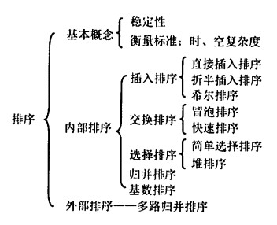
<!-- more -->
# 概念
* 排序，重新排列表中的元素，使关键字有序的过程；
* 算法的稳定性，表中有两个元素a1和a2的关键字相同，且a1在a2的前面，如果使用某个排序算法后，a1仍然在a2前面，则该算法是稳定的；否则算法是不稳定的；
* 内部排序，在排序期间元素全部存放在内存中的排序；
* 外部排序，在排序期间元素不能全部存放在内存中，必须要在内存和外存之间移动的排序。

# 插入排序
基本思想是，每次将一个待排序的记录按照关键字大小插入前面已经排好的子序列中，找到全部记录完成排序。

## 直接插入排序
```
void InsertSort(ElemType A[], int n)
{
    int i, j;
    for (i = 2; i <= n; i++)
    {
        if(A[i] < A[i-1])
        {
            A[0] = A[i];
            for (j = i-1; A[0] < A[j]; j--)
            {
                A[j+1] = A[j];
            }
            A[j+1] = A[0];
        }
    }
}
```
最简单的插入排序，以升序为例，从头往后遍历，如果当前元素小于前一个元素，就将当前元素保存到哨兵A[0]中，并再次遍历前面排序完成的部分，从当前元素的位置-1往前遍历，如果该位置大于要插入的元素，就把这个位置的元素后移，直到找到要插入元素的位置，插入即可。
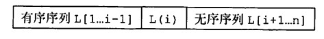
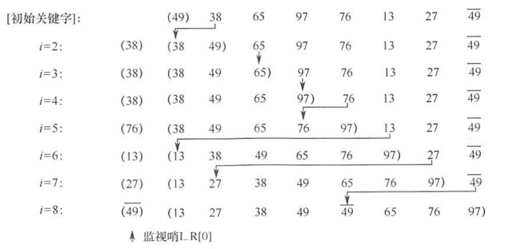
括号中的是有序序列。

空间效率：O(1)；
时间效率：最好情况O(n)，平均O(n^2)；
稳定性：稳定（如上图中的49）；
适用性：顺序存储和链式存储的线性表，链式存储要求能从后往前查找元素。

## 折半插入排序
```
void InsertSort(ElemType A[], int n)
{
    int i, j, low, high, mid;
    for (i = 2; i <= n; i++)
    {
        A[0] = A[i];
        low = 1; high = i-1;
        while(low <= high)
        {
            mid = (low + high) / 2;
            if(A[mid] > A[0]) high = mid - 1;
            else low = mid + 1;
        }
        for (j = i - 1; j >= high; j--)
        {
            A[j+1] = A[j];
        }
        A[high+1] = A[0];
    }
}
```
先折半查找元素的待插入位置，然后统一移动待插入位置之后的所有元素。折半查找的时候，high总是指向待插入位置的前一个位置，low和mid总是指向待插入位置，所以high+1，low，mid都是待插入位置。

空间效率：O(1)；
时间效率：O(n^2)，减少了比较的次数；
稳定性：稳定；
适用性：顺序存储的线性表，链式存储无法进行折半查找。

## 希尔排序
每累计d个位置的增量取一个元素，将表分成d个子表，每个子表分别进行直接插入排序，然后逐步减小d，直到d等于1，对整体进行插入排序。
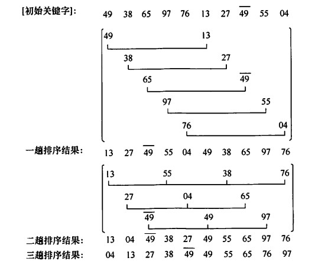

```
//升序排列
void ShellSort(ElemType A[], int n)
{
    for (int dk = n/2; dk >= 1; dk = dk/2)
    {
        for (int i = dk + 1; i <= n; i++)
        {
            if(A[i] < A[i-dk])
            {
                A[0] = A[i];
                for (int j = i - dk; j > 0 && A[0] < A[j]; j = j - dk)
                {
                    A[j + dk] = A[j];
                }
                A[j + dk] = A[0];
            }
        }
    }
}
```
空间效率：O(1)；
时间效率：最坏O(n^2)；
稳定性：不稳定（如图中49）；
适用性：顺序存储的线性表。

# 交换排序
根据序列中两个关键字的大小进行对换。
## 冒泡排序
从头遍历元素，比较相邻两个元素的大小，如果不满足排序要求，就交换。这样经过第一次遍历后，最大或者最小（取决于排序要求）会被排到最前或者最后面，此时确定这个元素的位置，对剩下的元素进行下一趟排序，n个元素最多经过n-1次排序就能排好。
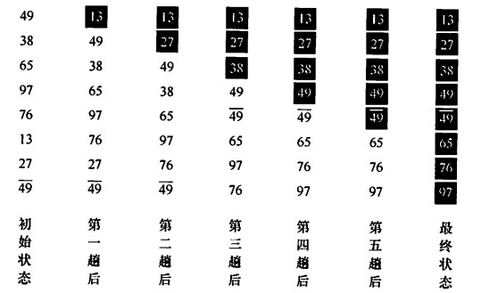
```
//升序排列
void BubbleSort(ElemType A[], int n)
{
    for (int i = 0; i < n-1; i++)
    {
        flag = false;
        for (int j = n - 1; j > 1; j--)
        {
            if(A[j-1] > A[j])
            {
                swap(A[j-1], A[j]);
                flag = true;
            }
        }
        if(flag == false)//如果一次排序中没有发生交换，说明已经有序。
            return;
    }
}
```

空间效率：O(1)；
时间效率：最坏O(n^2)， 最好O(n)；
稳定性：稳定，元素相等时不交换；
适用性：顺序存储和链式存储的线性表；

## 快速排序
在待排序表中取一个基准元素（一般取首元素），让小于该元素的所有元素排在基准元素左边，大于该元素的所有元素排在基准元素右边，然后递归地对两边的子表进行相同操作，直到每个子表只有一个元素。

设置两个指针i，j来标记，i从左边开始搜索，j从右边开始搜索，也就是说i负责管理小于基准的元素，j负责管理大于基准的元素，如果j先开始搜索，找到一个小于基准的元素，就要先把他放到i指向的位置（在第一轮中，i初始时指向基准元素，基准元素被中间值保存，直接替换），空出j此时的位置；i开始从作左半边寻找填补空白的元素，搜索到的元素大于基准元素，就应该将这个元素交换到j指向的空位。一直重复这样的操作，直到i和j相等，当然还是空位，所以将之前中间值存放的基准元素填补到这里，就完成了一轮操作。
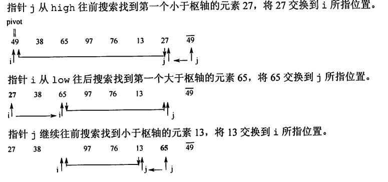
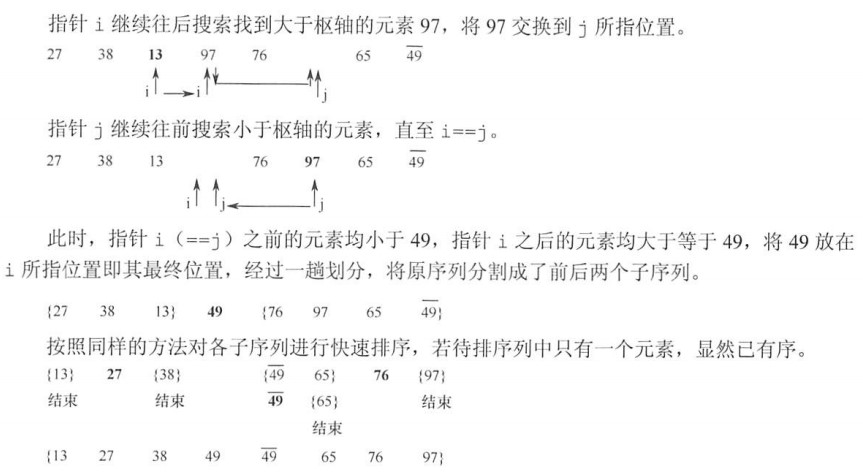
```
//递归方法
void QSort(ElemType A[], int low, int high)
{
    if(low < high)
    {
        int pivotpos = Partition(A, low, high);
        QSort(A,low,pivotpos-1);
        QSort(A,pivotpos+1,high);
    }
}
//划分操作以第一个元素作为基准，升序排列
int Partition(ElemType A[], int low, int high)
{
    ElemType pivot = A[low];
    while(low < high)
    {
        while(low < high && A[high] >= pivot) high--;
        A[low] = A[high];
        while(low < high && A[low] <= pivot) low++;
        A[high] = A[low];
    }
    A[low] = pivot;
    return low;//返回存放基准位置的地方
}
```

空间效率：平均O(log(n))，最坏O(n)，借助了栈；
时间效率：最坏O(n^2)，基准选择好，理想情况O(n*log(n))；一般情况下都和理想情况比较接近，快排是内部排序算法中性能最好的算法；
稳定性：不稳定；
适用性：顺序存储的线性表。

# 选择排序
遍历待排序元素，每次找到最小或最大的元素，然后依次存放，直到遍历了n-1次。
## 简单选择排序
```
void SelectSort(ElemType A[], int n)
{
    for (int i = 0; i < n-1; i++)
    {
        min = i;
        for (int j = i+1; j < n; i++)
        {
            if(A[j] < A[min])
            {
                min = j;
            }
            if(min != i)
            {
                swap(A[i], A[min]);
            }
        }
    }
}
```

空间效率：O(1)；
时间效率：始终是O(n^2)；
稳定性：不稳定；
适用性：顺序存储。

## 堆排序
遍历找到最值不方便，采用堆来维护。

### 堆
如果n个关键字序列满足：
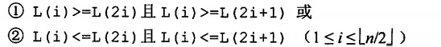
上述关系是完全二叉树的位置关系，满足第一个条件的是大顶堆（根结点最大），满足第二个条件是小顶堆（根结点最小）。不同于排序二叉树，堆不要求左右子树区分大小，只要求根结点大于子树结点。

#### 构造
元素不必实际存入二叉树，可以根据下标进行调整。从最后一个叶子结点开始，以它的双亲结点开始，如果结点小于孩子，就同孩子中较大的值进行交换，使这个根结点构成的子树称为一个堆，然后慢慢往前重复，直到找到整个树的根结点。
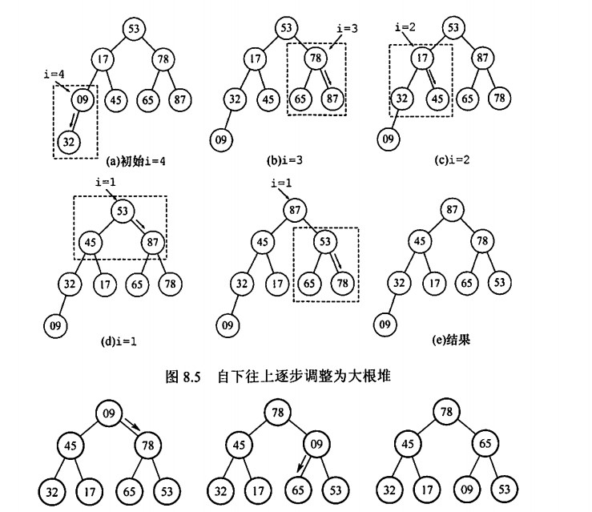

```
void BuildMaxHeap(ElemType A[], int len)
{
    for (int i = len / 2; i > 0; i--)
    {
        HeadAdjust(A, i, len);
    }
}
```

#### 输出元素后调整
选择排序取走堆顶后，需要继续调整。将最后一个元素和堆顶交换，显然最后一个元素很小，所以要从堆顶开始，交换成孩子中的较大值，交换后破坏了被交换孩子的堆性质，再次重复，直到完成调整。
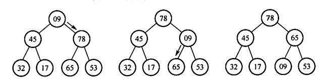
上面的堆输出87后调整过程如上图。
```
void HeadAdjust(ElemType A[], int len)
{
    for(i = 2*k; i <= len; i = i*2)
    {
        if(i < len && A[i+1]) i++;
        if(A[0] >= A[i]) break;
        else{
            A[k] = A[i];
            k = i;
        }
    }
    A[k] = A[0];
}
```

### 排序
```
void HeapSort(ElemType A[], int len)
{
    BuildMaxHeap(A, len);
    for(int i = len; i > 1; i--)
    {
        Swap(A[i], A[1]);
        HeapAdjust(A, 1, i-1);
    }
}
```
排序在堆的基础上进行，构建好堆以后，从堆顶开始输出最大的元素，输出后交换堆顶（空）和最后一个元素，调整剩下的i-1个元素，重复操作直到堆中只剩下一个元素，输出，就完成了堆排序。

### 插入
堆还支持插入的操作，新增最后一个结点，然后往上调整即可。
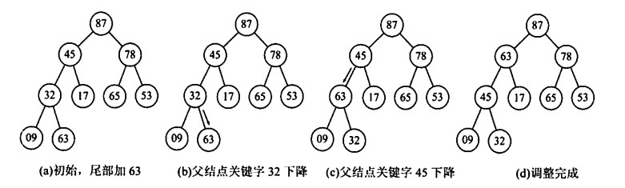

### 修改
堆也支持修改元素值的操作，根据修改元素位置的不同，操作方法也不同。如果是修改叶子结点，那么按照插入一个值的方法进行相同调整，从下往上；如果修改内部结点，可以按照排序的方法重新排序，也可以根据修改结点大小与其双亲和孩子结点的大小关系，在大顶堆中，小于孩子就往下调整，大于双亲就往上调整，否则不调整。

### 总结
空间效率：O(1)；
时间效率：均为O(n*log(n))；
稳定性：不稳定；
适用性：顺序存储的线性表。

# 归并排序和基数排序
## 归并排序
归并指的是将两个或两个以上的有序表合并成一个有序表，对于n个元素的序列，可以视为n个有序的子表，然后两两合并，直到合并成一个长度为n的有序表为止，也就是二路归并排序。
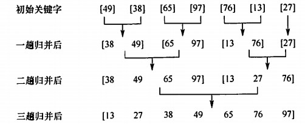
```
//合并两个相邻的有序子表，在数组中标记为low-mid，mid+1-high
ElemType *B = (ElemType *)malloc(siezof(ElemType) * (n+1));

void Merge(ElemType A[], int low, int mid, int high)
{
    //辅助数组复制
    for(int k = low; k <= high; k++)
    {
        B[k] = A[k];    
    }
    int i, j, k;
    for(i = low, j = mid + 1, k = i; i <= mid && j <=>= high; k++)
    {
        //比较两个子表的元素大小，进行复制
        if(B[i] <= B[j])
        {
            A[k] = B[i];
            //复制完成后要记得将指针位置移动到被复制数组的下一个位置
            i++;
        }
        else
        {
            A[k] = B[j];
            j++;
        }
    }
    while(i <= mid) A[k++] = B[i++];
    while(j <= high) A[k++] = B[j++];
}
```
用辅助数组记录两个数组，每次从两个子表中分别取出一个关键字，比较大小，将较小的关键字放到原数组中子表开始的位置，然后被取出数组指向下一个位置的关键字继续比较，重复直到比较完一个表，然后根据此时指针指示的位置，检查另一个表是否有剩余关键字，如果有，就将他们按顺序全部复制到原来的表中。

上面的算法将被用来对整个数组进行二路归并排序。
```
void MergeSort(ElemType A[], int low, int high)
{
    if(low < high)//至少子表有两个元素时，进行下面的操作
    {
        int mid = (low + high) / 2;
        MergeSort(A,low,mid);//左子表递归归并
        MergeSort(A,mid+1,high);//右子表递归归并
        Merge(A,low,mid,high);//左右子表合并
    }
    //return 返回上一层递归调用
}
```
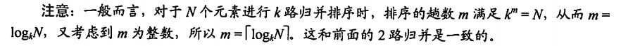

空间效率：O(n)；
时间效率：O(n*log(n))；合并一次时间复杂度为O(n)，一共要合并log(n)取上界次；
稳定性：稳定；
适用性：顺序存储。

## 基数排序
基于关键字的大小进行排序，借助多关键字逻辑对单逻辑关键字进行排序的方法。

假设线性表中每个元素关键字由一个d元组构成，这个d元组左边是高位，右边是低位，且高位一定大于低位，不论该位上实际的大小情况；即d元组中左边的一定大于右边的。称最高位关键字是最主位关键字，最低为关键字是最次位关键字。基数r指的是d元组中每个关键字可能出现的情况种数。例如，d元组是一个十进制三维数，即d=3，r=10，百位就是最主位关键字，个位就是最次位关键字，每个位最多有r=10中情况，0~9。

另外，多关键字排序有两种方法，最高位优先(MSD)按关键字权重递减划分子序列，最低位优先(LSD)按关键字递增划分子序列。

### LSD
构建r个队列，分别对每个关键字的d元组的每个位进行一次分配，从最低位开始，如果该位等于某个小于r的值，就把他放进对应的队列中；分配完成后进行收集，将所有队列中的结点首尾相连，得到新的序列，组成新的线性表，就完成了第一次排序。
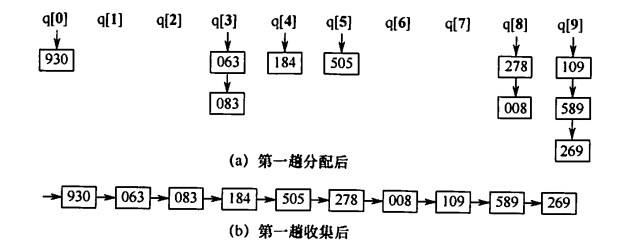
之后重复这项操作，直到查看完最主位关键字。
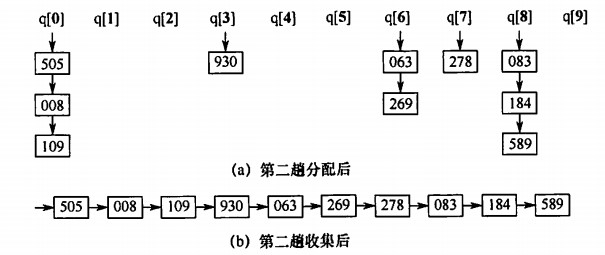
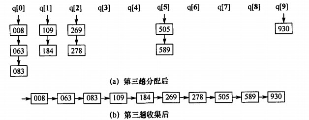

空间效率：O(r)；需要r个指向队列的头指针和r个尾指针；
时间效率：O(d(n+r))；d次排序，每次需要O(n)的分配和O(r)的收集，和初始状态无关；
稳定性：稳定；
适用性：链式存储的线性表。

# 外部排序
外部排序在算法设计上比较复杂，不过可能会考相关概念方法。

## 基本概念
前面的排序方法都是在内存中进行，称为内部排序。而对于许多大文件，需要在排序时一部分一部分地将记录调入内存，需要进行内存和外存之间的交换，所以叫外部排序。

## 方法
由于访问外存的速度远远小于访问内存，所以访问磁盘次数为主要的时间代价。

通常采用归并排序，根据内存缓冲区大小，将外存的文件分为许多子文件，依次读入内存并采用内部排序方法排序，然后重新写回外存。这些有序子文件称为**归并段**或**顺串**。完成后对归并段进行归并，并使归并段逐渐从小到大，直到获得有序文件。

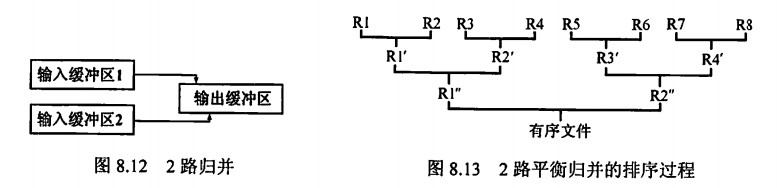
如图，缓冲区被分为输入和输出两块，输入区分别读取一段记录，归并后结果不断存放到输出区中，输出区写满就按顺序转移到输出归并段中，然后清空输出缓存继续存放。

但是由于不可能一次读取完两个有序段同时保存排序结果，所以要不断和外存交换。
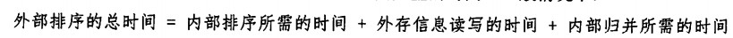
外存信息读写时间远大于两外两项，所以要尽力减少读写次数。
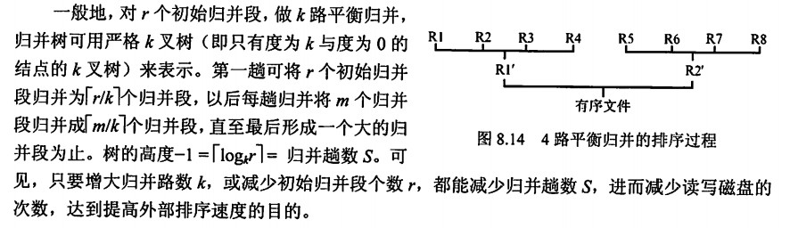

### 多路平衡归并与败者树
根据前面分析，S趟归并，内部排序采用选择排序（k个记录找最小要比较k-1次，每趟n个元素需要(n-1)(k-1)次比较），内部排序总共需要的比较次数是：
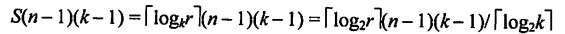
如果为例提高外部排序速度增大k，内部排序会变慢，从上面的比较次数可以看出，会导致整个次数增加，因而不能适用普通的内部排序，引入败者树。

败者树可以视为一棵完全二叉树，叶子结点存放归并段，规定两个数中大的为失败者，小的为胜利者，内部结点记录左右子树中的“失败者”序号，胜者继续往上比较，最后根结点就是最小的数。
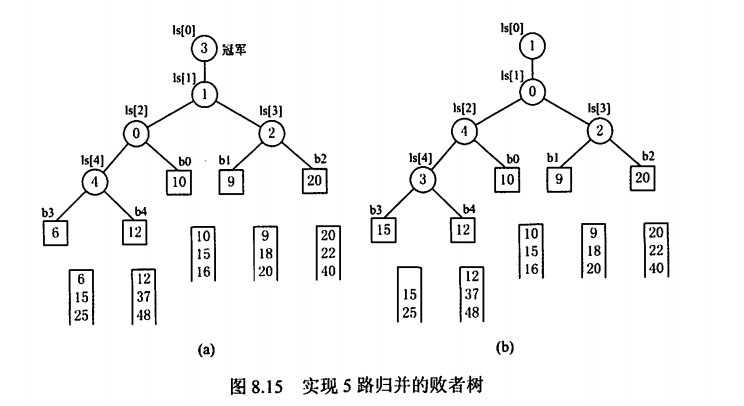

败者树深度为log(k)向上取整，即k个记录中选择最小值的比较次数就是败者树的深度，上面的内部排序总比较次数变成下面的大小。
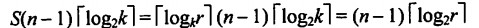
所以采用败者树以后k就不会影响内部排序比较次数了，也就是说，在内存足够的情况下，增大k能减小归并树高度，让每次I/O尽可能多地读取，从而减少归并趟数而不改变内部排序比较次数，同时减少I/O次数（意味着归并趟数和I/O次数相关），提高外部排序速度。

但是k也不是越大越好，增加k就要同时增加缓冲区个数，如果内存不够，就要减小每个缓冲区容量，所以k过大的时候虽然减少了归并趟数，但同时又增加了外存读写次数。

### 置换—选择排序
除了优化k以外，减小r也可以减少归并趟数S，所以要采用新的方法找到更长的初始归并段。
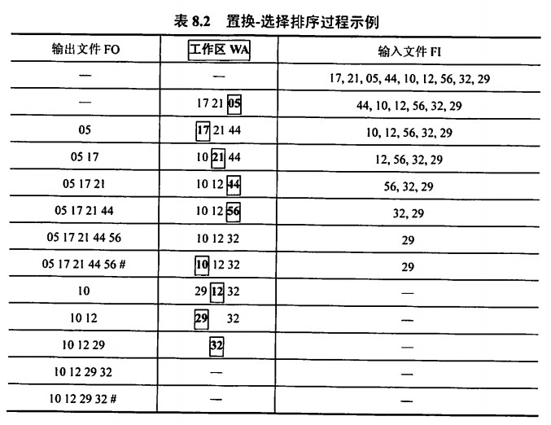
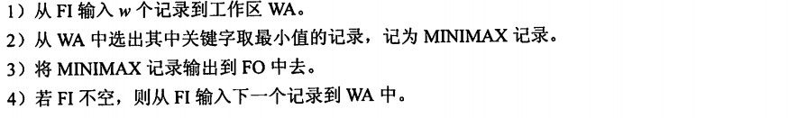
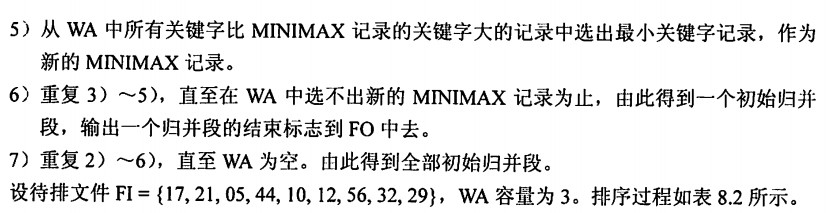

上面的过程中，选择MINIMAX要借助败者树完成。

### 最佳归并树
采用置换选择排序后，得到的是不同长度的归并段，所以要再找方法组织不同长度的归并段，使得I/O次数最少。

假设置换-选择排序得到下面的初始段，并画出三路归并的归并树：
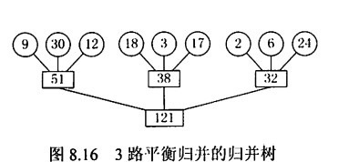
其中叶子结点标识初始归并段，其余结点的权值表示子树片段的长度和。叶子结点到根的路径长度（也就是前面的深度-1）表示参加归并的趟数，根结点表示最终生成的归并段。

树的带权路径长度WPL就是归并过程的读取次数了，上面的树WPL为242，则I/O次数为两倍，484。所以可以用哈夫曼树推广到m叉树来优化，让记录数少的初始归并段最先归并，记录数多的初始归并段最后归并，让WPL达到最小，这棵树就称为最佳归并树。上面例子的最佳归并树如下：
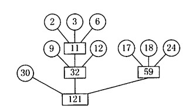

步骤：如果初始段不能像上面一样构成一棵严格的k叉树（不能保证除叶子结点外的每个结点出度为k），需要添加长度为0的“虚段”，而且权为0的叶子应该离树根最远。将上面例子中长度为30的段删除，再次构建最佳归并树如下：
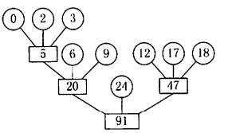

虚段数目的确定：
假设度为0的结点有n0个，度为k的结点有nk个，严格二叉树中应该有n0==(k-1)nk + 1，即nk==(n0-1)/(k-1)。
* 如果(n0-1)%(k-1)==0，说明是严格二叉树；
* 如果(n0-1)%(k-1)==u，说明对于n0个叶子结点，其中u个是多余的，所以应该增加一个内部结点。内部结点在归并树中占据了一个叶子结点的位置，此时有u+1个叶子结点在外部没有被接纳，所以还需要k-(u+1)个空归并段同u+1个（不存在u+1=k的情况，因为取余的时候u取值最大就是k-2）多余的叶子结点作为兄弟，存储在归并树中。

# 总结
* 直接插入排序，冒泡排序，简单选择排序是基本排序方法，用于元素个数不是特别大的情况(n<10000)。
>直接插入排序复杂度和初始序列有关，线性表有序，n-1次比较就完成排序，最差和平均情况是O(n^2)；
冒泡排序情况和直接插入排序相同；
简单选择排序复杂度中，比较次数和初始序列无关，比较次数总是O(n^2)，但元素移动次数和初始序列有关，最好情况不移动，最坏不超过3(n-1)次。
* 希尔排序，用于元素个数处于中等规模的情况(n<=1000)。
>随着希尔排序对每个组的处理，记录的比较和移动越来越少，其总比较次数要比直接插入排序少得多，而且不需要额外内存，缺点是希尔排序并不稳定。
* 快排，堆排，基数排序，可以用于n特别大的情况，快排和堆排都是不稳定的，归并和基数排序是稳定的。
>快排是最通用的高效内部排序算法，平均情况时间复杂度O(nlog(n))，空间复杂度O(log(n))，最坏情况（元素已经有序）时间复杂度O(n^2)和空间复杂度O(n)，但是已经有了优化的办法，即“三者取中”；
堆排序也是重要的高效排序算法，时间复杂度是O(nlog(n))，一般不会产生最坏情况，也不需要额外空间，但是一般比快排慢；
归并排序也是重要的高效排序算法，性能与输入元素序列无关，时间复杂度总是O(nlog(n))，缺点是空间复杂度O(n)；
基数排序相对特殊，虽然时间复杂度O(d(n+r))线性增长，但是并不会比快排好很多，而且d元组的关键字抽取很多时候不方便，适应性比较差，况且还需要基数规模的一系列桶和与待排序元素规模相同的存储空间。

* 混合使用使用不同的排序算法，达到更好的性能。