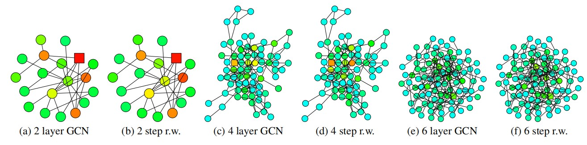
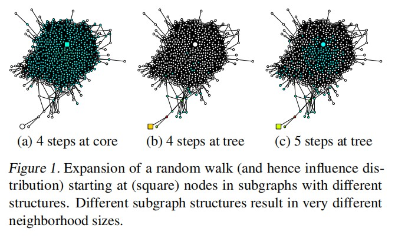
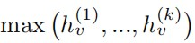
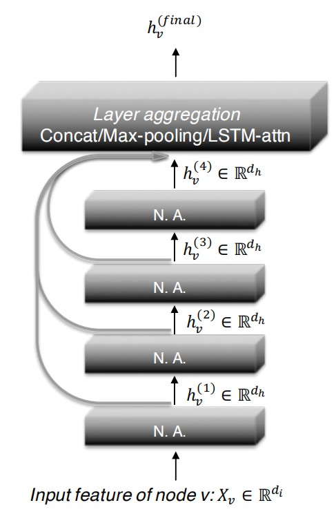
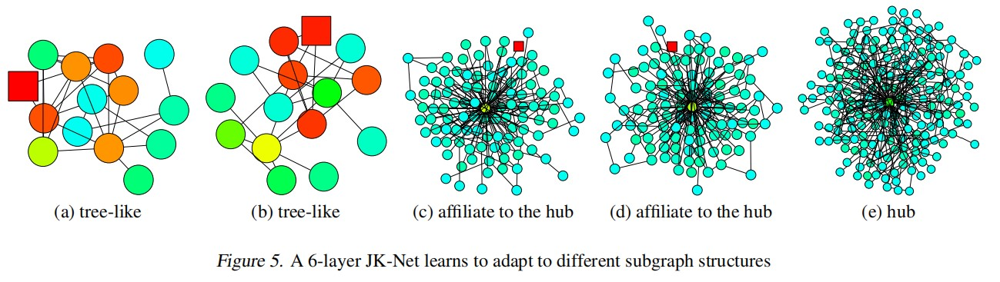

# 前言
在 *《图嵌入和图神经网络》* 一文中，介绍了图表示的三类基本方法，GNN作为GCN延伸的神经网络，是其中十分重要的一类方法，通常将其中介绍的那种GNN称为GCN，不过严格定义的GCN在聚合邻居特征的时候公式上略有不同，结果是一致的。在本文中，受到 *Representation Learning on Graphs with Jumping Knowledge Networks* 一文的启发，将进一步介绍一些先进GNN的做法，有人将这种做法称为“多跳”邻居的聚合方案。
<!--more-->
# GNN的局限
## GNN存在什么问题？
GNN也并不是一开始就能在所有数据上表现出良好性能的，实际上在一些真实网络上GNN的表现要比传统方法更差。有一个很明显的问题已经被人们注意到了，深度学习往往通过利用深度的网络达到更好的拟合效果，但是GNN在深层网络的效果缺远不如浅层网络，这是非常值得分析的。

实际上，GNN中结点对邻居信息的汇聚意味着重复的“平均”，经过深层迭代以后，所有结点的特征都包含了整个图的特征，这样一来留给结点自己的信息就会越来越少，导致网络完全无法利用这部分信息做出有效的预测。因此，这个空白需要进行填补，这就是JK-net一文中着重介绍的部分，用RandomWalk对比GCN的聚合过程，系统地阐释“平均”效果产生的原因。

## Random Walk与GCN
可以考虑这样一件事情，Random Walk从网络中一个结点出发，经过一定步数k后，将有可能给影响到某个范围内的所有结点，这就是距离出发结点k跳的所有结点，假设对所有邻居的访问概率完全相同，那么RW经过一定次数迭代后会收敛，访问所有结点的概率将确定到某个值，将访问不同点的概率定义为Walk Distribution。而GCN聚合同样可以这样考虑，一个结点想要聚合到距离它两跳的结点的信息，同样需要两次聚合，因为只有到第二次聚合的时候，该结点的邻居结点才会带有距离他两跳的结点的信息。进行可视化以后，得到这样的效果：

GCN中一层汇聚就相当于RW中走一步，文中用雅可比矩阵定义了Influence Distribution，表示结点y的输入特征对结点x输出特征的影响程度，记为Ix(y)，并证明这个值和Walk Distribution相等，上面的图中方块表示出发点，其他深颜色的点表示值越高的点。

这样，我们可以重新直观地看待“平均”效果，GCN中每层layer都加大了某个点影响与被其他点影响的分布，不管使用的是加权和还是平均等聚合方法，每个结点本身的特征会越来越少，表示全局特征的信息会越来越多，6层的GCN汇聚就涵盖了如此多的点，显然自身信息很难得到保留。

## “平均”的坏处？
前面说，“平均”让GCN难以分辨不同结点的特征，比较笼统，现在我们接着这部分理论完整分析一下， 到底是什么样的结点不需要这种平均。首先，我们将结点分成两种来分析，位于边缘的和位于中心的。

中心结点的Influence Distribution扩散很快，而边缘结点刚开始扩散很慢，但是到达中心结点后又快速扩散到周围了。如果这两个点都经过四层的GCN，得到的信息将非常不一致，用前人的数学方法分析，中心结点的RW收敛很快，带有丰富的全局信息和有限的局部信息；而边缘结点的RW收敛很慢，带有有限的全局信息和丰富的局部信息。因此，中心点过快的“平均”会导致信息丢失，但是边缘点却又需要足够的邻居来得到不那么局部的信息。只有在这两者中做出权衡，才有可能达到更好的表示效果，要进一步探索能不能让每个结点选择自己合适的层数。

# JK-net
现在，正式提出JK-net，它能够解决上面的问题，这将从两个方面入手分析。第一，需要记录不同层的信息供结点自己选择；第二，结点如何选择最适合自己的层。

## 不同层之间的Jump-Connections
文中提出三种方法记录不同层的特征，分别是concatenation、max-pooling，和LSTM-attention。这里着重介绍max-pooling，因为作者证明了这种聚合能同时解决第二个问题，另外两个暂时不明朗，不过concatenation的做法和DGCNN十分类似，可以作为参考。

Max-pooling通过下面的式子对不同层的特征进行选择：

这就是说，对结点v，每个通道选择不同层中最大的特征作为v的特征表示。

## 结点如何自动选择
Max-pooling已经选择了最大的特征作为最合适的表示，在文中作者用中心点来解释。JK-net使用max-pooling，通过自动学习，对非中心点总是将大部分影响尽可能施加在当前结点上，其余影响传播出去(限制在局部上防止丢失信息)；对中心点总是将影响扩散到一个合理的范围(中心点连接的结点多，有可能其中包含另外的中心点)。

在本人看来，从网络结构上，其实如何自动选择还是依靠可训练参数矩阵实现的，只不过max-pooling的存在让GNN进一步细化了优化目标实现的方式，多层次信息的存在可以让不同层之间的可训练参数进一步提升自己的表达，而不用为了只得到最后一层的表达进行一定程度的妥协。也就是说，JK-net中不同层之间的参数矩阵完全独立，每个结点的每个特征总是选择最合适的一层进行优化，从而实现了很好的效果。

# 总结
文章指出了GNN存在的关键问题，结合一些已有的优化GNN的做法，系统地分析了原因，并提出了一般的解决方案。下一步的工作是对不同层之间的聚合方式(拼接，最大池化，LSTM等)，不同结点之间的聚合方式(最大，平均，加权和等)，以及这两种方案的不同组合，在不同结构的网络上进一步探索。