软件工程期末复习总结
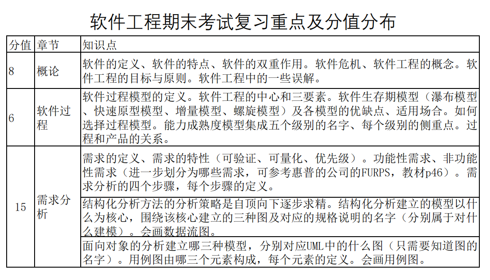
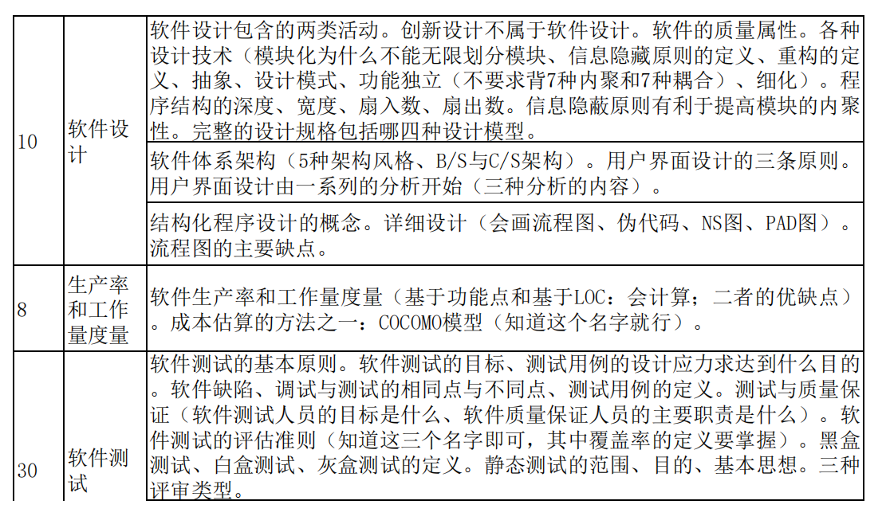
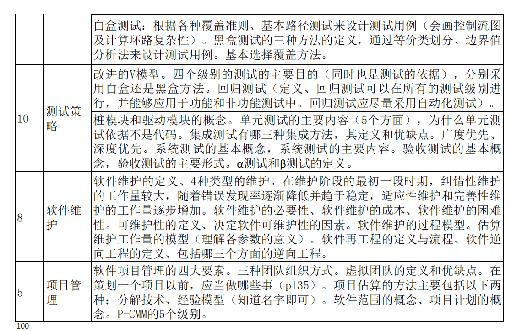
<!-- more -->
# 概论
## 软件的定义
软件是一系列按照特定顺序组织的计算机数据和指令的集合，包括程序相关的文档。简单地说，软件就是程序加文档的集合体。软件是逻辑和物理的系统, 软件由程序、文档、数据和其它相关元素构成，是一个过程的抽象表示。
## 软件的特点
* 软件是开发出来的或者说是工程化的，并不是制造出来的。
* 软件开发环境对产品影响较大。
* 软件开发的时间和工作量难以估算。
* 用户往往不能一次性提出完整的需求，因此在经历了许多次修改后，软件才能令人满意。
* 几乎没有任何客观的标准或措施来评估软件的开发进度。
* 软件测试是非常困难的，测试所有路径的代价是极其昂贵的。
* 软件不会“耗尽”。
* 硬件可使用物理模型评价。软件设计的评价取决于判断和直觉。
* 硬件和软件项目管理之间存在很大区别。

## 软件的双重作用
一方面，软件是一种产品，可以提供计算能力；另一方面，软件是开发其它软件产品的工具。

## 软件危机、软件工程的概念
软件工程过程是指生产一个最终能满足需求且达到工程目标的软件产品所需要的步骤。

软件危机描述计算机能力和其能解决的问题复杂度迅速变化带来的影响。
## 软件工程的目标与原则
目标：
在给定的时间和预算内，按照用户的需求，开发易修改、高效、可靠、可维护、适应力强、可移动、可重用的软件。

原则：
* 使用阶段性生命周期计划的管理
* 进行连续的验证
* 保持严格的产品控制
* 使用现代编程工具/工程实践
* 保持清晰的责任分配
* 用更好更少的人
* 保持过程改进

## 软件工程中的一些误解
* 管理者：加人赶进度，外包便轻松 | 延迟了的软件项目中加入新的开发人员只会让它延迟更多，管理方不懂得如何从内部管理和控制软件项目，即使将项目外包也无济于事；
* 客户：不正确的期望，需求要详细；
* 开发者：写好就完了，不运行不能评估，交接仅仅是程序，文档太麻烦 | 写完了要对接客户，评估通过技术报告，还有其他部分要交接，文档很重要。
# 软件过程
开发和维护软件及其相关产品所涉及的一系列活动。
## 软件过程模型的定义
软件过程模型是软件开发全部过程、活动和任务的结构框架。
## 软件工程的中心和三要素
以质量为中心，过程，方法，工具为三要素。

## 软件生存期模型及其优缺点、适用场合

### 瀑布模型
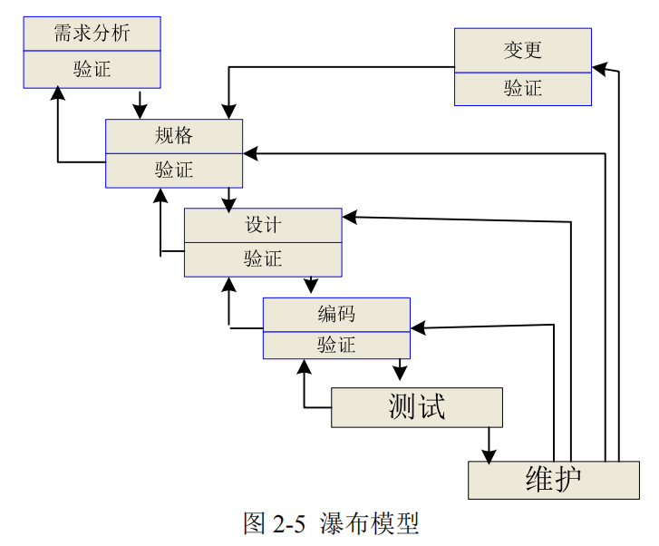
优点：
* 简单，过程透明，可管理性高；
* 推迟实现，写软件之前要分析设计；
* 以阶段评审和文档控制为手段进行质量控制，从而改进到预期质量；

缺点：
* 模型灵活性差，不好调整；
* 风险控制能力差；
* 过多文档增加工作量，而且完全用文档评估项目进度不准确；

适用场合：
瀑布模型适用于系统需求明确，技术成熟，工程管理较严格的场合。

### 快速原型模型
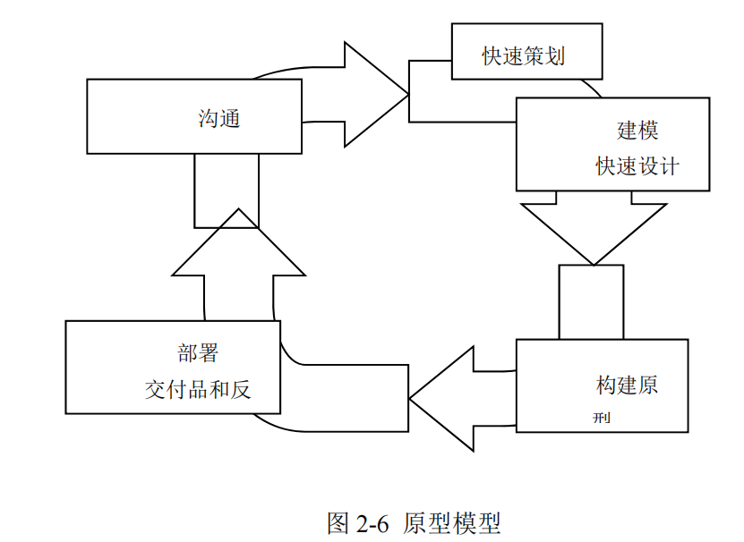

优点：
* 强调用户参与和决策，加强沟通；
* 可以加快需求的确定，减少不确定性和风险；
* 简化了项目管理，缩短了开发时间，降低了风险和成本。

缺点：
* 不适合开发大型系统；
* 软件可维护性差；
* 用户合作要求高，合作不好反而拖慢进度。

适用场合：
原型模型适用于客户不清楚系统具体输入输出，定义一个总体目标集；或者不确定算法效率、软件兼容性、如何交互的方式。
### 增量模型
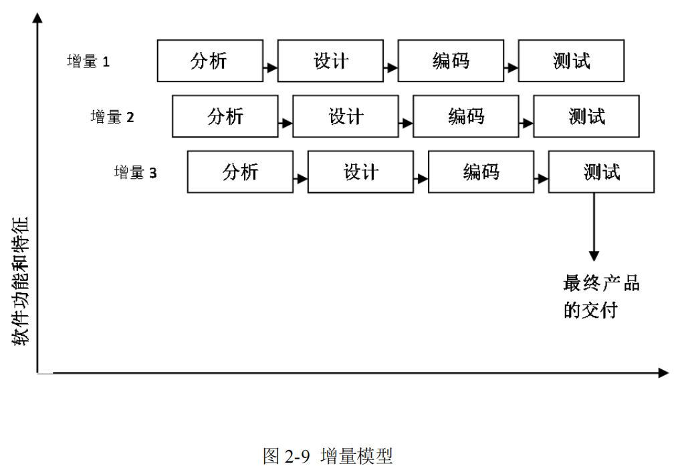

优点：
* 不需要完整需求；
* 初始阶段不用投入太多人力；
* 增量可以有效管理技术风险；
* 有利于增强客户信心，提高系统稳定性，可维护性，可靠性。

缺点：
* 增量粒度难以选择；
* 确定所有的基本业务比较困难。

适用场合：
（1）软件产品可以分批次地进行交付。
（2）待开发的软件系统能够被模块化。
（3）软件开发人员对应用领域不熟悉，难以一次性地进行系统开发。
（4）项目管理人员把握全局的水平较高。
（5）具有较大的灵活性，适合软件需求不明确，设计方案有一定风险的软件项目。
### 螺旋模型
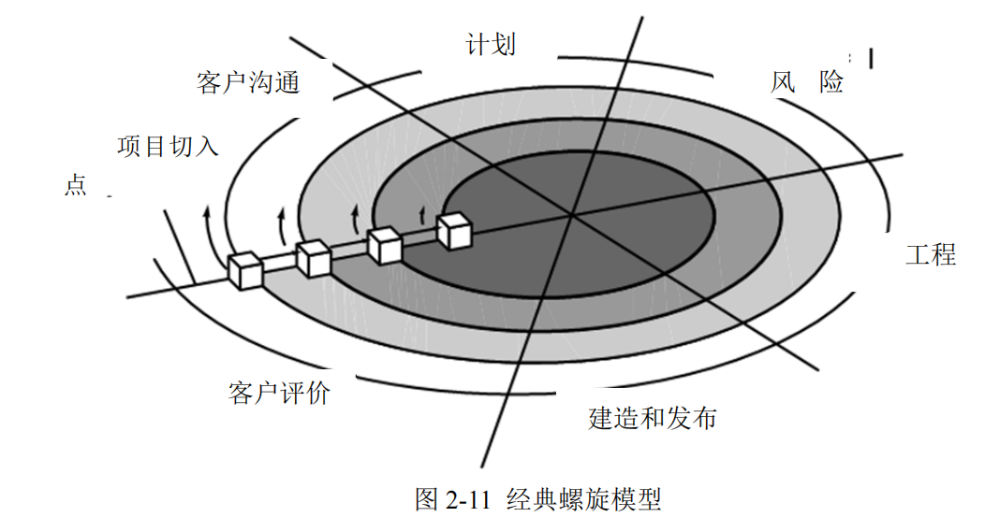

 优点：
* 支持需求动态变化；
* 原型可以看作可执行的需求规格说明书；
* 强调原型的可扩充性和可修改性；
* 降低了开发风险；

缺点：
* 迭代效率不高会导致成本增加，提交时间延迟；
* 要求开发队伍水平很高；
  
适用场合：
适合需求不明确，特别是大型系统开发。

## 如何选择过程模型
软件开发模型是不断发展的，各种模型各有优缺点，选用时不必拘泥于某种模型，可以组合，创建新的模型。
## 能力成熟度模型及其侧重点
* 5 优化级：持续的过程改进；
* 4 量化管理级：量化管理；
* 3 已定义级：过程标准化；
* 2 可重复级：基本项目管理；
* 1 初始级：有能力的人和个人英雄主义
## 过程和产品的关系
以过程为中心的软件开发，比以产品为中心的软件开发能得到更好的产品。

# 需求分析

## 定义
软件需求表达了对解决现实世界中某类问题的产品的要求和约束。
## 特性
### 可验证
验证某个软件的需求非常困难，代价很大，可验证性是测试的依据。
### 可量化
需求应尽可能量化表述。
### 优先级
根据需求紧迫程度和现有资源，安排需求实现的先后顺序。
## 功能性需求
F
功能需求
## 非功能性需求
URPS
易用性Usability，可靠性Reliability，性能Performance，可支持性Supportability。
## 需求分析步骤
需求获取-需求提炼-需求描述-需求验证
* 需求获取
软件获取指的是软件需求的来源以及软件工程师收集这些软件需求的方法。
* 需求提炼
产生操作规格参数表，指明与其他系统元件的软件接口，确定软件必须遵循的约束。
对应用问题及环境的理解和分析，为问题涉及的信息，功能和系统行为建立模型。
* 需求描述
产生SRS需求规格说明书，包含了描述用户与软件交互的用例的集合，以及非功能性需求。
* 需求验证
检查需求的正确性、完整性、非二义性及内部和外部的连贯性。
## 结构化分析方法的分析策略
自顶向下逐步求精
### 模型核心
数据字典，把三种分析模型粘合在一起，是分析模型的核心。
### 三种图及其对应的规格说明
功能建模采用数据流图描述，数据建模采用实体-关系图，行为建模用状态转换图。
## 数据流图

* 环境图（顶层数据流图）
* 一层数据流图
* 二层数据流图

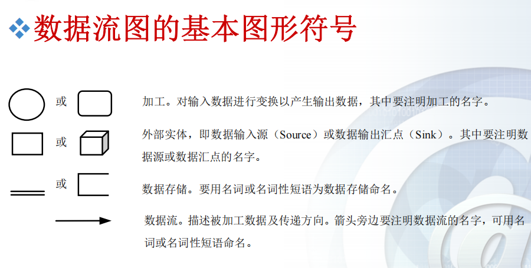
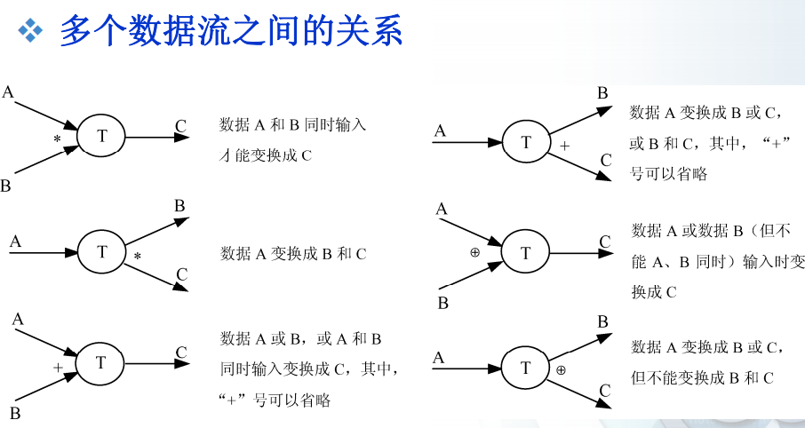
## 面向对象的分析建立的三种模型
用例模型（用例图），对象模型（类图），动态模型（状态图和交互图）
## 画用例图
三种元素：
* 用例：系统执行的一系列动作，动作的结果能被参与者察觉到。
* 参与者：与系统交互的人或物，代表外部实体。
* 关系：参与者与用例、用例之间的关系（泛化，包含，扩展），参与者之间的关系（泛化）。

# 软件设计

## 软件设计包含的两类活动
软件架构设计和软件详细设计。
## 创新设计不属于软件设计
软件设计主要为分解设计，可以包括系列模式设计，不包括创新设计。
## 质量属性
FURPS
## 设计技术

### 模块化不能无限划分模块
随着模块数量的增加，开发单个软件模块的总工作量（成本）下降，但是集成所有模块的工作量（成本）随着模块个数的增加而增加，存在一个模块个数 M 将导致理论上最低的开发成本。
### 信息隐藏原则的定义
模块应该具有彼此相互隐藏的特性。信息隐蔽原则有利于提高模块的内聚性
### 重构的定义
不改变组件功能和行为条件下简化组件设计（或编码）的一种重组技术。
### 抽象
忽略具体的信息将不同事物看成相同事物的过程，侧重相关细节忽略不相关细节。
### 设计模式
在给定上下文环境中一类共同问题的共同解决方法。
### 独立功能（不要求七种内聚其中耦合）
每个模块只解决需求中特定的子功能并对系统其他模块而言具有具有简单的访问接口。
### 细化
逐步求精的过程，与抽象是一组相对的概念，相辅相成。
## 程序结构
* 深度：程序结构的层次数
* 宽度：层次结构中同一层模块的最大模块个数称为结构的宽度
* 扇入数：调用一个给定模块的模块个数
* 扇出数：一个模块直接调用的其他模块数目

## 完整的设计规格（四种设计模型）
包括数据设计、架构设计、接口设计、组件设计
## 软件体系架构

### 五种架构风格
* 数据中心架构
* 数据流体系架构
* 调用和返回架构
* 面向对象架构
* 层次架构
### B/S和C/S架构
客户端/服务器：基于资源不对等，为实现共享提出来的，由客户机，服务器，网络组成；
浏览器/服务器：三层体系结构的一种实现方式，具体结构为浏览器/web服务器/数据库服务器

## 用户界面设计的三条原则
* 用户控制系统
* 减少用户记忆负担
* 保持界面一致
## 用户界面设计由一系列的分析开始（三种分析的内容）
* 用户特点分析:应用从具体业务和技术资料收集而来的各种信息来定义各种最终用户的属性和配置信息;
* 用户任务分析:使用结构化设计方法或面向对象方法定义用户任务和相关操作，包括用户用例、任务和目标描述、工作流程分析，充分理解人机交互任务的分层描述;
* 应用场景分析:确定了用户操作接口的呈现方式约束和布局风格约束;
## 结构化程序设计的概念
基于过程设计的理念，限制了算法表示细节的逻辑结构数量和类型，便于设计师编写不复杂的算法，方便阅读、测试和维护。
如果一个程序的代码块仅仅通过顺序，选择，循环三种基本控制结构进行连接，并且只有一个入口和一个出口，那么这个程序就是机构化的。
## 详细设计

### 流程图及其主要缺点
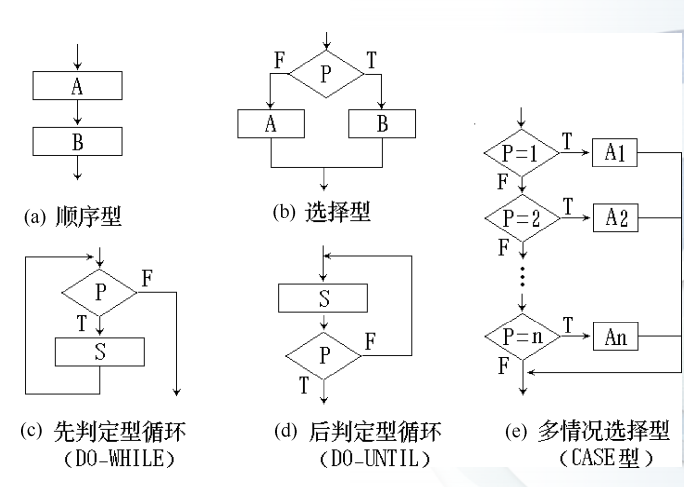
缺点：
* 本质上不是逐步求精的好工具，容易过早考虑控制结构而忽略全局结构；
* 箭头可以随意转移控制流，不顾结构化程序设计的精神；
* 在表示数据结构方面不足。
### 伪代码

### N-S图
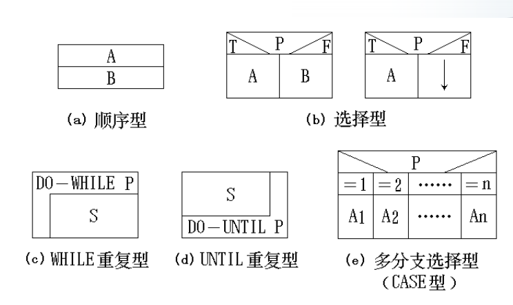
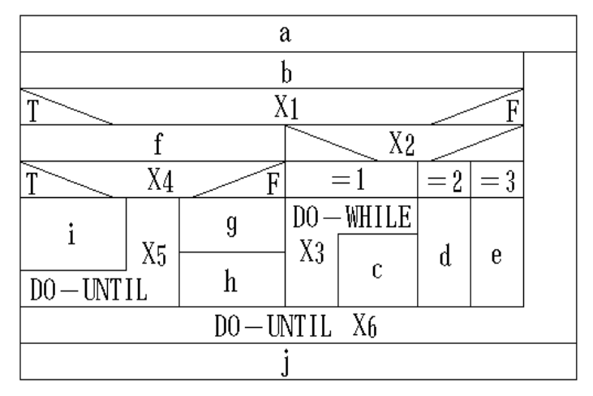
### PAD图
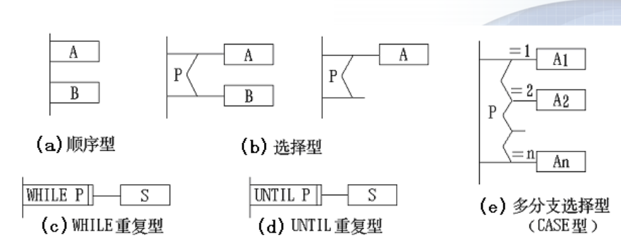
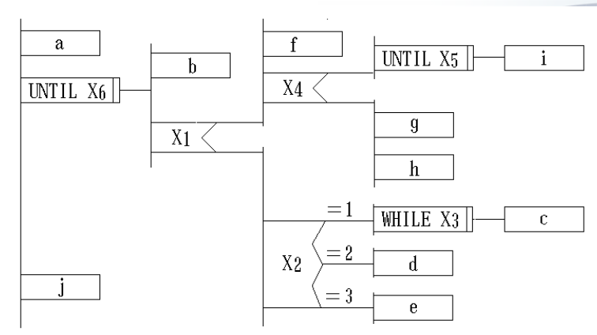
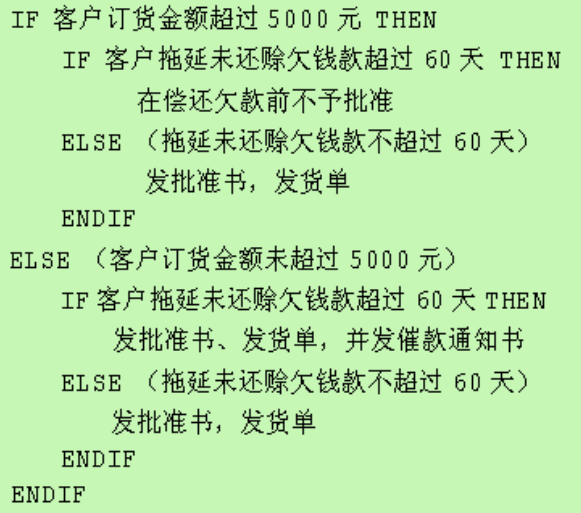

# 生产率和工作量度量
## 方法

### 基于功能点
功能点数：从直接度量软件信息域和评估软件复杂性的经验量化关系中获得。
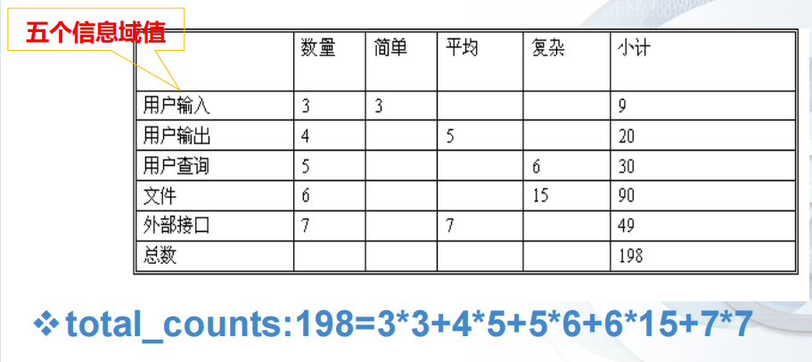
复杂性调整值：
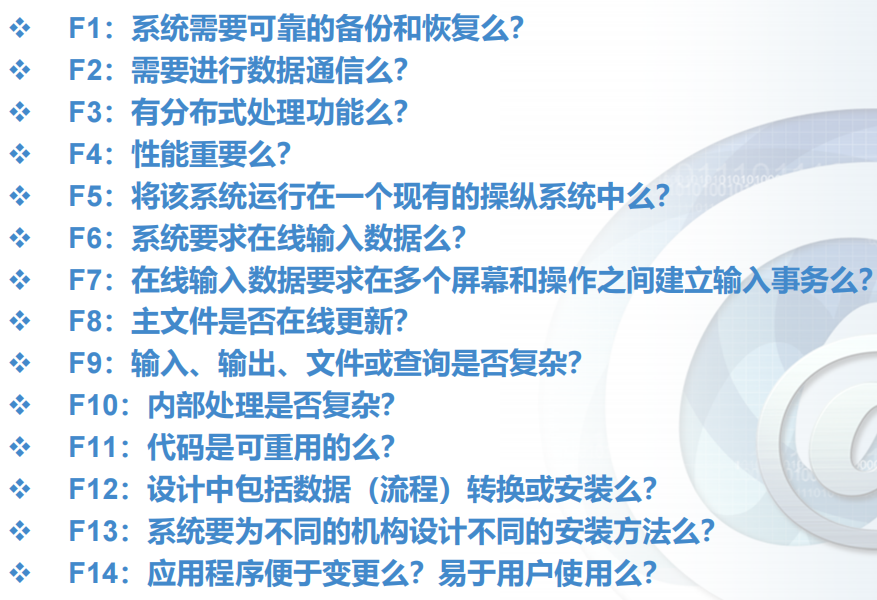
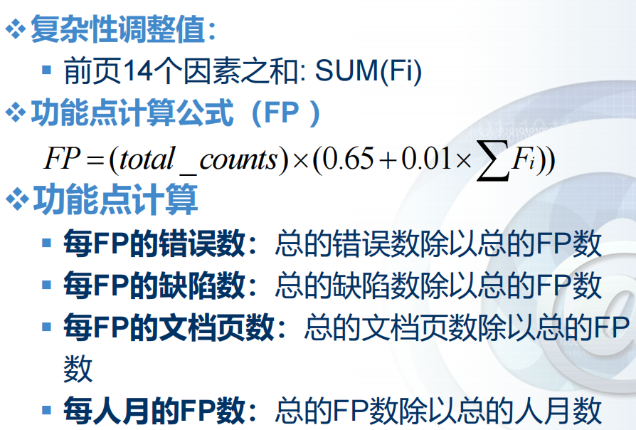
优点：
* 可用于软件项目开发的初期阶段的项目估算。因为在可行性研究和需求分析阶段已能基本确定输入、输出等各个参量；
* 与程序设计语言无关。适合于过程或非过程式语言。

缺点：
* 某些参考量的收集有一定困难；
* 度量值的主观因素较多，如Fi取值；
* 功能点FP本身没有直观的物理意义。
### 基于KLOC
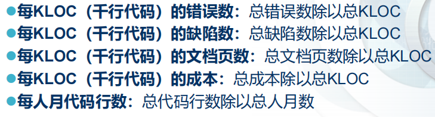
优点：
* 容易计算
* 许多估算软件都适用LOC和KLOC作为重要输入
* 有大量关于LOC的文献和数据

缺点：
* 依赖于适用的语言
* 不太适用于非过程化语言
* 设计完成的时候才能计算，完成之前需要细节，难以估算。

## 成本估算方法
COCOMO模型

# 软件测试
## 基本原则
1. 穷尽测试是不可能的
2. 测试无法显示潜伏的软件缺陷
3. 测试活动应尽早进行
4. 软件缺陷具有群聚性
5. 注意杀虫剂现象
6. 应尽量由独立的测试团队进行测试
## 目标
1) 确认系统满足其预期的使用和用户的需要。
2) 确认解决了所需解决的问题（如实现商业规则和使用合适的系统假定）。
3) 为测试的过程建立责任和可解释性。
4) 便于及早发现软件和系统的异常。
5) 及早提供软件和系统的性能的评估。
6) 为管理提供真实信息，以决定在当前状态下发布产品在商业上的风险
7) 鉴别出程序在功能等方面的异常集聚之处。
## 测试用例设计
### 目的
????
### 定义
测试输入、执行条件，以及预期结果的集合，为特定目的开发。
## 软件缺陷
项目现有检测结果和应有结果之间的差异（未完成，有错误，画蛇添足，隐含需求没实现，不好用）
## 调试与测试的相同和不同
相同：都包含处理软件缺陷和查看代码的过程；
不同：测试的目标是发现缺陷所在，调试的目标是修复缺陷。
## 测试与质量保证
### 测试人员的目标
尽早找出软件缺陷，并确保缺陷得以修复
### 质量保证人员的主要职责
创建和执行改进软件开发过程并防止软件缺陷发生的标准和方法
## 评估准则
* 覆盖率=测试集合T/测试需求集合TR
* 故障插入
* 变异分值
## 分类
### 黑盒测试
忽略系统或组件内部机制，仅关注输入响应和相应执行条件的输出测试，即功能性测试。
#### 等价类划分
把所有可能的输入划分成若干部分，选择有代表性的数据作为测试用例。需要选择有效等价类和无效等价类。
#### 边界值分析
选择边界值作为用例测试
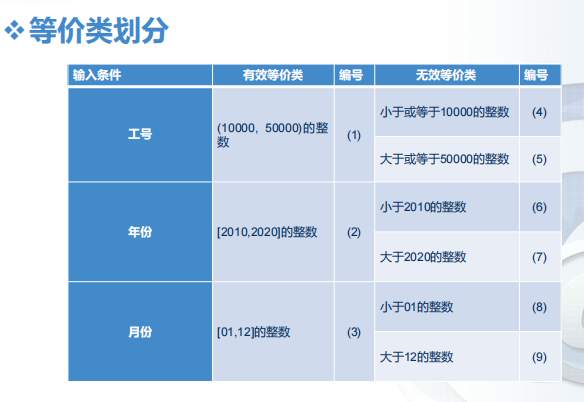
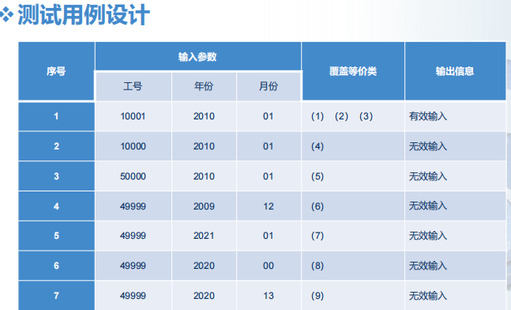
#### 状态值测试
一种基于模型的测试，用状态图来描述时间序列，由此产生测试用例。
### 白盒测试
考虑系统或自建内部机制（分支，路径，语句测试），即结构性测试。
* 所有独立的执行路径至少测试一次；
* 所有逻辑判断，取真和取假都要测试一次；
* 在循环边界和运行界限内执行循环体；
* 测试内部数据结构有效性。
#### 逻辑覆盖测试
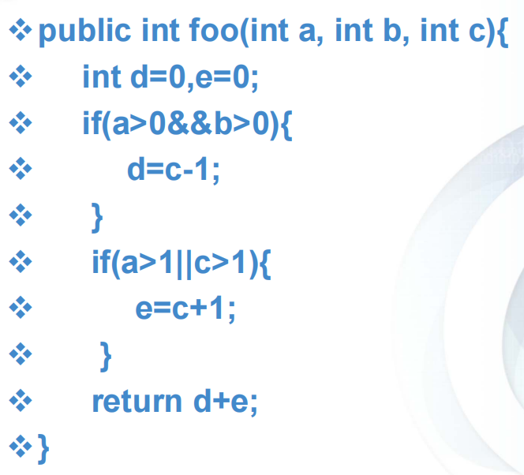
##### 语句覆盖
每一执行语句至少执行一次
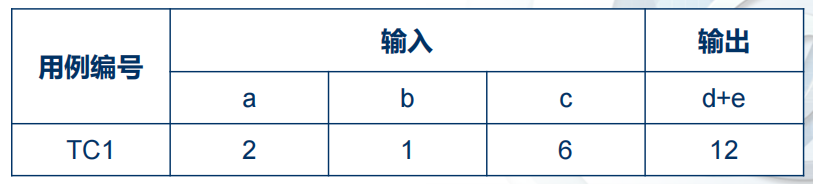
##### 条件覆盖
每个判断条件为真或者为假都至少执行一次
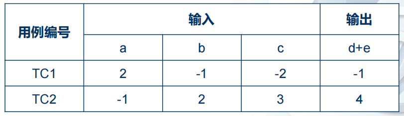
##### 分支覆盖（判定覆盖）
每个判断的真假分支都要执行
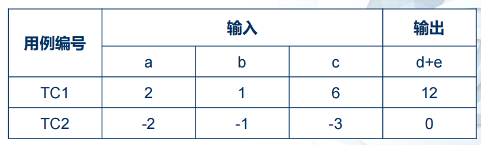
##### 条件组合覆盖
每个判断条件的取值组合执行一次
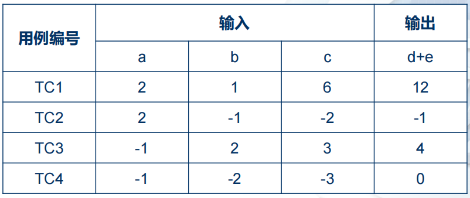
#### 控制流图
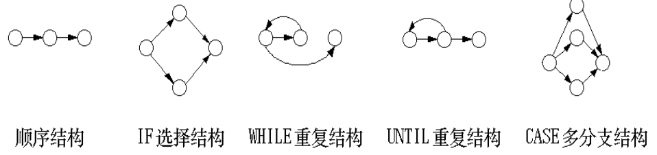
##### 节点覆盖
等价于语句覆盖，对所有节点测试路径集合中至少存在一条测试路径访问该节点
##### 边覆盖
对于所有边，至少存在一条测试路径访问，包含节点覆盖，可以实现分支覆盖
##### 路径覆盖
覆盖程序中所有可能路径，但是在某些情况下难以继续，所以采用基本路径测试。

##### 基本路径测试
把覆盖的路径数压缩，循环体最多执行一次。

步骤：
1. 程序环路复杂性；
2. 确定线性独立路径的集合；
3. 为基本集合中每条路径生成测试用例。

环路复杂性：程序基本路径中独立路径条数，是确保每个可执行语句至少执行一次所必须的测试用例数目的上界。独立路径是，至少包含一条在其他独立路径中从未有过的边的路径。
V = e - n + 2
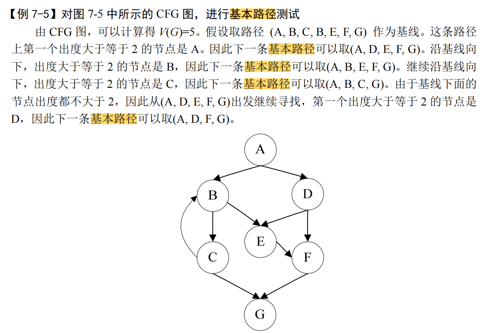
### 灰盒测试
混合黑白测试。
## 静态测试
### 范围
静态测试的范围很广，软件开发项目中代码、所有的文档以及项目外有价值文档都可以通过人工方式审查。
### 目的
其目的是从已有的规格说明、已定义的标准乃至项目的计划中发现缺陷和偏差。
### 基本思想
静态测试的基本思想是缺陷的预防，即尽可能早地在缺陷和偏差对将来开发过程产生影响之前发现并修改它们，否则会致代价高昂的返工。
### 评审类型
* 同事审查
* 走查
* 审查

# 测试策略
## 改进的V模型
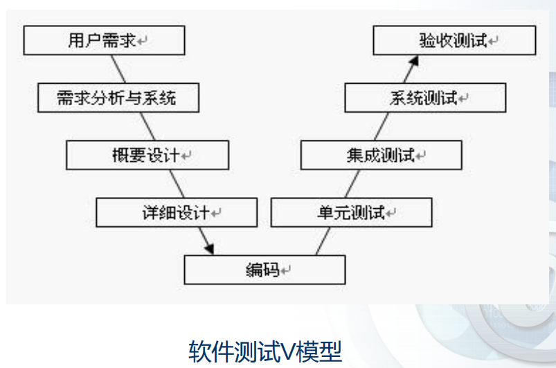

各个级别测试的目的（依据）：
* 单元测试的主要目的是验证软件模块是否按详细设计的规格说明正确运行（白盒为主，黑盒为辅）；
* 集成测试主要目的是检查多个模块间是否按概要设计说明的方式协同工作（灰盒）；
* 系统测试的主要目的是验证整个系统是否满足需求规格说明（黑盒）；
* 验收测试从用户的角度检查系统是否满足合同中定义的需求，以及以确认产品是否能符合业务上的需要（用户参与）；

## 回归测试

定义：
回归测试是指有选择地重新测试系统或其组件，以验证对软件的修改没有导致不希望出现的影响，以及系统或组件仍然符合其指定的需求。

回归测试可以在所有的测试级别执行，并应用于功能和非功能测试中。

回归测试应该尽量采用自动化测试。

## 单元测试
### 桩模块和驱动模块
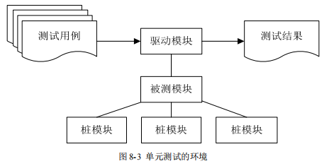
桩模块（存根模块）：被测模块中也难免调用其他的模块，桩模块（也称存根模块）就是用以替代被测模块所调用的那些模块。
驱动模块：驱动模块用以调用被测模块，使被测的模块得到执行。
### 主要内容
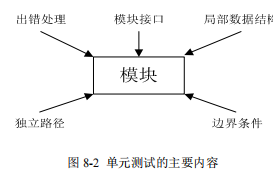
对模块接口的测试保证在测试时进出程序单元的数据流是正确的；对局部数据结构的检查保证临时存储的数据在算法执行的整个过程中都能维持其完整性；对边界条件的测试保证模块在极限或严格的情形下仍然能够正确执行；控制结构中的所有独立路径（基本路径）原则上都应覆盖，以保证在一个模块中的所有语句都能执行至少一次；最后，要对所有出错处理的路径进行测试。
### 单元测试依据不是代码
单元测试的主要依据是详细设计，而不是针对代码的测试。因为未测代码可能包含错误和缺陷，如果依照其测试，则可能无法发现一些错误。
## 集成测试

### 自顶向下的集成方法
定义：将模块按照系统程序结构，沿控制层自顶向下进行集成，从属于主控模块的按深度优先或广度优先集成到结构中去。
优点：
* 较早验证主要控制和判断点
* 如果按照深度优先，可以实现和验证一个完整的软件功能。
缺点：
* 桩的开发量大

广度优先和深度优先
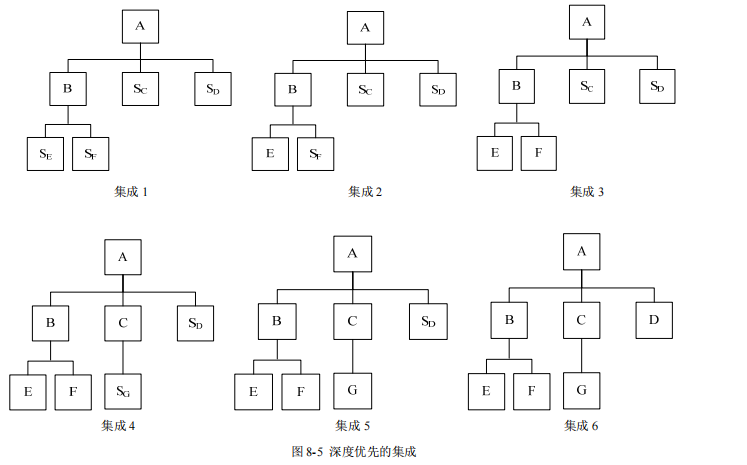
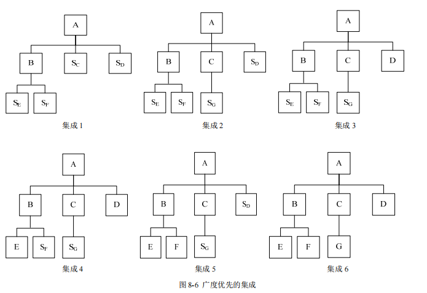

### 自底向上的集成方法
从软件结构最底层的模块开始，按照接口依赖关系逐层向上集成，以进行测试。
优点：每个底层模块都已经测试，不需要桩；
缺点：每个模块都需要编写驱动模块，缺点的隔离和定位不如自顶向下。

### SMOKE方法
对整个系统进行基本测试，验证基本功能；是一种预测试，也叫做可测性测试。
优点：节省测试时间，防止构造失败；
缺点：覆盖率低。
## 系统测试
从用户角度进行测试，将完成了集成测试的系统在真实环境下测试，用于功能确认和验证。

主要内容：
* 功能性测试
* 性能测试
* 压力测试
* 恢复测试
* 安全测试
* 其他系统测试
## 验收测试
验收测试是软件测试部门对经过项目组内部单元测试、集成测试和系统测试后的软件所
进行的测试，测试用例采用项目组的系统测试用例子集，或者由验收测试人员自行决定测试
内容。
* 根据合同进行的验收测试
* 用户验收测试
* 现场测试
## α测试和β测试
α测试：用户在开发者的场所来进行的，软件在开发者对用户的指导下进行测试，开发者负责记录错误和使用中出现的问题；
β测试：软件由不用用户在实际适用过程中测试，反馈错误信息给开发者。

# 软件维护

## 定义
软件维护是指由于软件产品出现问题或需要改进而对代码及相关文档的修改，其目的是对现有软件产品进行修改的同时保持其完整性。
## 分类
* 纠错性维护
* 适应性维护
* 完善性维护
* 预防性维护

在维护的初期，纠错性维护的工作量较大，随着错误发现率逐渐降低并趋于稳定，适应性维护和完善性维护的工作量逐步增大。
## 必要性
软件维护的必要性体现在软件维护对软件能持续满足用户的需求有重要的意义。

1) 软件维护能够改正错误。
2) 软件维护能够改善设计。
3) 软件维护能够实现软件的改进（Implement enhancements）
4) 软件维护能够与其他系统进行交互。
5) 软件维护能够为使用不同的硬件、软件、系统的新性能以及通讯设备等而对软件进行改进。
6) 软件维护能够完成遗留程序的移植。
7) 软件退出使用。
## 成本
？？？？
## 困难性
* 配置管理工作不到位
* 人员变动的影响
* 软件可读性差
* 任务紧，时间急的情况下处理维护请求
## 可维护性
### 定义
纠正软件系统出现的错误和缺陷，以及为满足新要求进行修改，扩充或压缩的容易程度。
### 决定因素
* 可理解性
* 可使用性
* 可测试性
* 可修改性
* 可移值性
* 效率
* 可靠性
## 过程模型
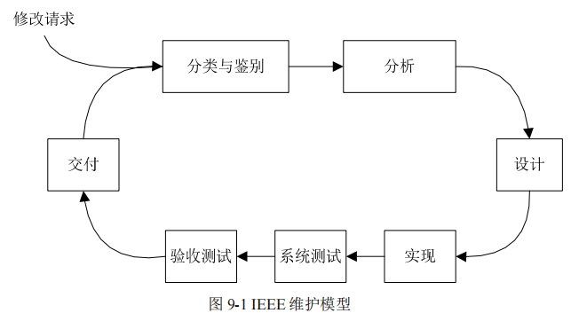
## 估算工作量的模型
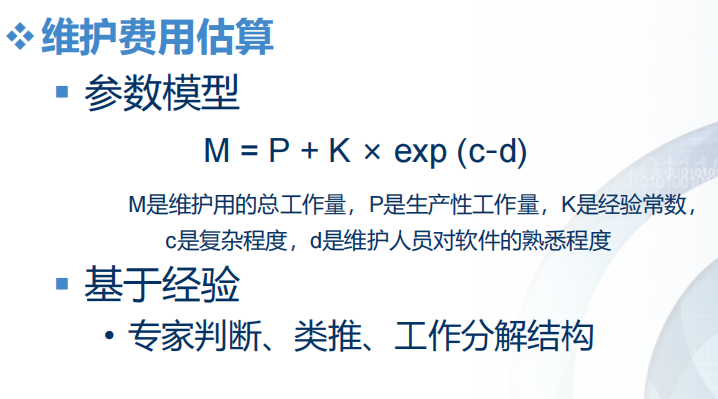
## 软件再工程
### 定义
对现有软件进行仔细审查和改造，对其进行重新构造，使之称为一个新的形式，同时包括随之产生的对新形式的实现。
### 流程
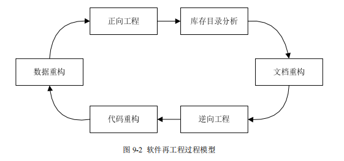
### 软件逆向工程
#### 定义
恢复设计结果的过程，分析程序，在源程序更高的抽象层次上创建出某种描述过程。
#### 方面
* 数据的逆向工程
* 处理的逆向工程
* 用户界面的逆向工程

# 项目管理
## 四大要素（四个P）
* People人员
* Product产品
* Process过程
* Project项目

## 团队组织方式
* DD（民主分权制）
* CD（有控制的分权制）
* CC（有控制的集中制）
## 虚拟团队

### 定义
是跨越时间、空间和组织界限，运用通信技术网加强连接的队伍。
### 优缺点
优点：提高生产力，扩大市场机会，知识转移；
缺点：沟通不足，缺少领导和管理，不称职的团队成员。
## 策划项目前应该做的事情

## 项目估算的主要方法
分解技术、经验模型

## 软件范围
在技术和管理层面上都是无二义性和可理解的项目范围，是软件开发各阶段的工作依据。
## 项目计划
目的是使项目经理能够对资源、成本及时间进行合理的估算，一般是在项目开始时进行，随着项目进展定期更新。
## P-CMM
人力资源管理成熟度模型
* 初始级
* 重复级
* 定义级
* 定量级
* 优化级