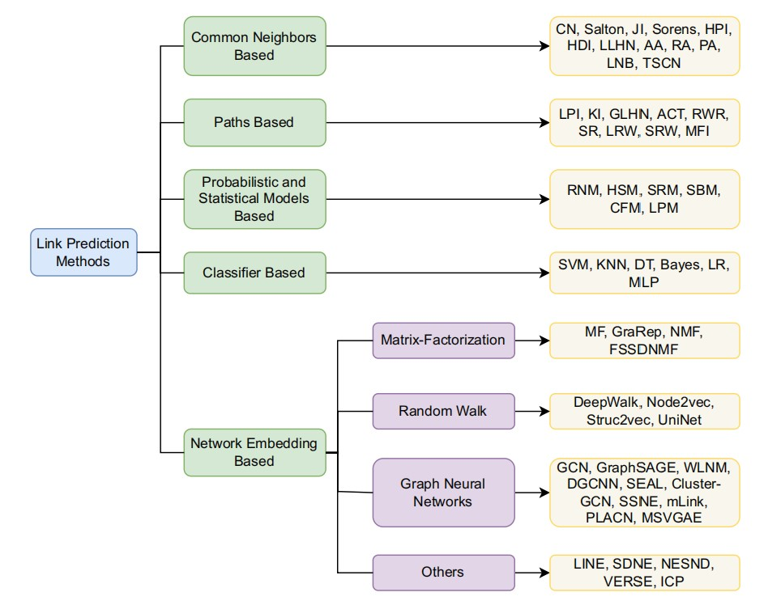
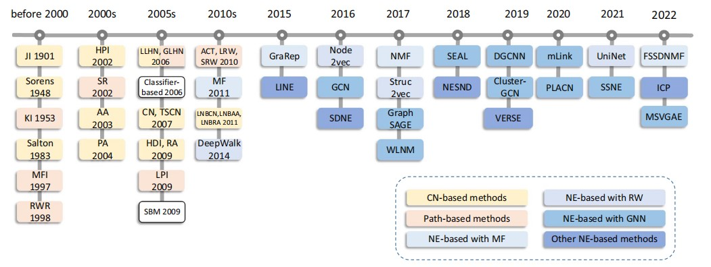
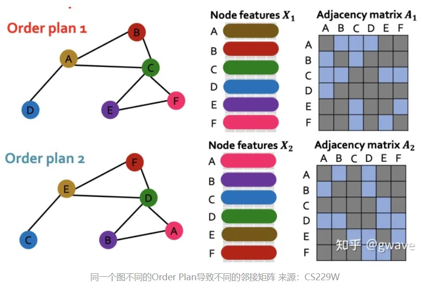
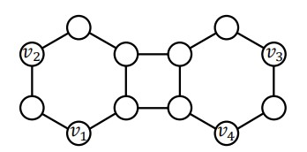

# 前言
链路预测作为图的基本问题，应用广泛。问题本身可以从几个方面来考虑，从图表示学习上，这是一个双节点表示问题，可以利用多节点表示的方法解决；从矩阵分解上，这是一个降维恢复的问题，分解得到网络的潜在特征和构成方式可以进一步帮助预测；从机器学习上，这是一个二分类问题，可以用各种已经存在的方法拟合；还有另外一些先验假设方法，计算连接产生的可能性。

现在，我们不考虑时间复杂度的情况，找到一种泛化性足够强的方法，开发一个链路预测框架。
<!--more-->

# 寻找最好的方法
以最新的调查为例，可以将上面讲的各种角度延伸出来的方法分成五类，如下图。

首先，基于相同邻居的方法和基于路径的方法可以统称为启发式方法，也就是预定义一个计算式来对网络中不同的连接进行预测，虽然时间复杂度方面具有优势，但是精度不高；基于统计的方法建立一个统计模型对网络进行预测，引入繁杂的参数，对大型网络不方便实施，而且也不容易解释其中的内核；作为一个二分类问题，机器学习中已有的许多分类器方法都可以直接应用到网络上，例如著名的K近邻算法等。但是，前面的方法都忽略了一个问题，即应该如何应对大型网络。一个大型的网络通常会有几万个结点，需要庞大的邻接矩阵进行描述，不管如何处理这个邻接矩阵都是难以接受的，这导致了空间和时间上的巨大花销，也就催生了图嵌入方法的产生。

图嵌入，或者称为图表示学习，旨在将高维的图用低维的向量表示，并且在向量中尽可能保留图的拓扑信息，实现图的降维。从文章的统计来看，图嵌入已经成为链路预测问题中的主要方法了，部分传统方法得益于其方便的计算，通常作为一种比较方法存在。

而图嵌入又可以分为多种方法。首先，矩阵分解将原先的邻接矩阵表示的网络分解为不同的“子”矩阵，可以是一些矩阵的乘积，也可以是一些矩阵的和或差，总之，矩阵分解得到了网络的低维表示，在这些低维的矩阵中，有的表示网络的潜在信息，有的描述了网络潜在信息之间的关联，在不同的分解方式也有不同的意义。但是矩阵分解只能简单利用网络最直接的拓扑结构，完全无法考虑两个结点之间多跳路径的信息，所以比较局限。

随机游走作为另一类嵌入方法，弥补了矩阵分解在上下文方面的不足之处，对每个结点可以生成一个低维向量，包含结点的拓扑信息，两个结点如果多次出现在同一条随机游走序列中，那么他们的结点嵌入表示也应该是相似的。通过得到结点的嵌入表示，然后再利用传统的相似度计算方法，可以完成链路预测任务，不过这种方法一般效果不好，因为他们学习机制比较简单，难以改进，实际的拟合效果也一般，再通过简单的相似性计算显然不能得到精确的结果。

由于图是非欧几里得空间的数据，完全不存在空间上的上下左右关系，而只有连接关系，所以用CNN等方法无法对这种数据完成很好的效果，因为不规整的图往往无法定义结点或边的顺序如何，况且想要让一般的神经网络处理图必须要让图的结构转化成规整的形式。也就是说，解决同构图问题也是对传统神经网络的一大挑战，CNN处理欧几里得空间的数据，具有平移不变性和旋转不变性；而GNN处理图，则需要具有置换不变性，也就是对具有某种特征的结点，标号顺序的不同将不会导致最终表示有所差别。如下图，使用CNN一样的方式对邻接矩阵进行卷积，得到的显然是不同的结果，但是这两个图除了标号外完全一样。

GNN除了解决图同构的问题，保证了置换不变性，还可以进一步优化随机游走方法得到的表示。通过邻接矩阵和特征矩阵，GNN汇聚结点的邻居特征信息，可训练参数进行进一步调整，最终得到结点最有用的全局嵌入表示，用这些高质量的信息作为输入，分类器可以达到很好的效果。当然，普通的GNN在一些网络的上表现还不如传统方法，这就要提到GCN另一个问题了。

总之，分析不同的预测方法后，结合实验结果，可以确定GNN是最有前景的一类方法了，但绝不是简单的GNN，还需要对GNN存在的问题再深入解决。

# GCN的缺陷：添加Labeling Trick
图具有置换不变性，设计的GCN围绕这一点实现了正确的结构，并不会因为邻接矩阵的不同导致不同的结果。但是，区分同构图仍热是具有挑战的问题。我们之前说，链路预测问题是一个双节点表示问题，前面著名的工作GAE训练得到结点的完整表示后，通过两个点的表示相似性来计算这两个结点产生连接的可能。而另一个著名的工作SEAL同样基于GNN，却实现了非常好的性能，这里有两个不同的地方，一个是SEAL使用了结构标签作为显式特征输入，GAE没有；另一个是GAE对链路连接性的评价方式很简单，聚合两个结点的表示并不能得到这条链路的表示，不足以支撑完成链路预测的任务。

第一个问题就可以通过Labeling Trick的添加完成，对一组同构结点，GCN会给这两个结点以相同的结点表示，而且还不能区分这组结点与其他结点的结构表示，意味着对相同的一个结点，GCN会给这个结点与前面两个同构结点分别连接的链路以相同的链路表示，因为GCN简单地聚合两个结点的表示作为这条链路的表示。Labeling Trick通过对不同的链路附加一个标签，作为特征信息，可以让GCN拥有区分两个同构点对其他不同点的能力。直观表示如下：

v2和v3同构，但是(v1,v2)与(v1,v3)在GCN中会得到相同的表示；添加Labeling Trick后，v2,v3的表示不同，对两条链路的最终表示也就不同了。

第二个问题可以通过网络自主学习完成，即收集所有结点的信息，用其他网络进行训练即可。

这样一来，GCN既可以区分同构点的相对位置，同时也有办法聚合多个点的信息得到所有链路表示，就完成了预测任务。这就是SEAL。

# SEAL的缺陷
相比于对图进行训练，子图显然信息有限，因为抓取子图以后，子图外面一些motif被断开了，导致在子图中，处于motif结构中的链路和不在motif中的链路表现出相同的拓扑结构，但是实际上处于motif中的链路显然是更重要的。因此，我们应该寻找一个办法探测这些处于motif中的链路，并在汇聚的同时给他们更高的权重。这样，一条motif链路连接的两个点就比其他点具有相对更高的重要性，相互汇聚的信息就会更多。

关于如何探测这种motif链路，有文章提出一种Katz指数计算的方法，即以预测链路为准，目标链路和预测链路总共有四个结点，将这四个结点对应的四个链路的Katz指数求和，作为最终的链路分数，替换邻接矩阵供结点进行汇聚。这样，GCN汇聚的同时就是有偏的了。进一步的，可以尝试其他统计指标，用类似的方式为这些无权的边进行赋权，从而让子图能够对不同的边加以区别，重点要让motif中的边突出，将带来三个好处：
* GNN聚合过程中，节点可以区别对待联系紧密和不紧密的邻居节点，提高了学习能力；
* 边权包含了全局信息，提供了子图中没有的信息；
* 增加了GNN学习的信息，提高表达上限；
  
# 赋权网络的缺陷
即便采用了上面的赋权方法，仍然有一个问题难以解决：泛化性。GNN作为泛化解决链路预测问题的范例，从聚合到读出都应该使用机器学习的方法，而使用上面根据某个指标进行赋权的方法显然不能达到泛化的要求，这正是启发式方法的缺点，如果有办法解决这个问题，GNN通过学习子图结构解决链路预测问题的方法应该可以得到提升。