记录一些常用的竞赛数据结构和算法，当然不包括基本知识，包含的内容是：线段树，并查集，差分数组，期望DP，博弈，数论基础。

<!--more-->

# 数据声明

算法竞赛中经常会因为数据声明不到位而产生误差和错误，要对数据运算有清晰的把握，需要多开的时候完全不用精打细算。

* int：10^9
* long long：10^18

# 线段树

几乎是算法竞赛中最常用的数据结构，用来维护区间信息，能实现对数级别复杂度的区间修改，重点是只能处理满足结合律的问题。

线段树是一个平衡二叉树，每个父亲节点代表区间信息，因此最上面的父节点就代表整个区间的信息；此外，每个节点还对应了一个区间，也就是所谓的线段，线段信息就是节点存储的值。例如一个数组[1,2,3,4,5]的线段树如下，定义区间信息为区间内的数字和：

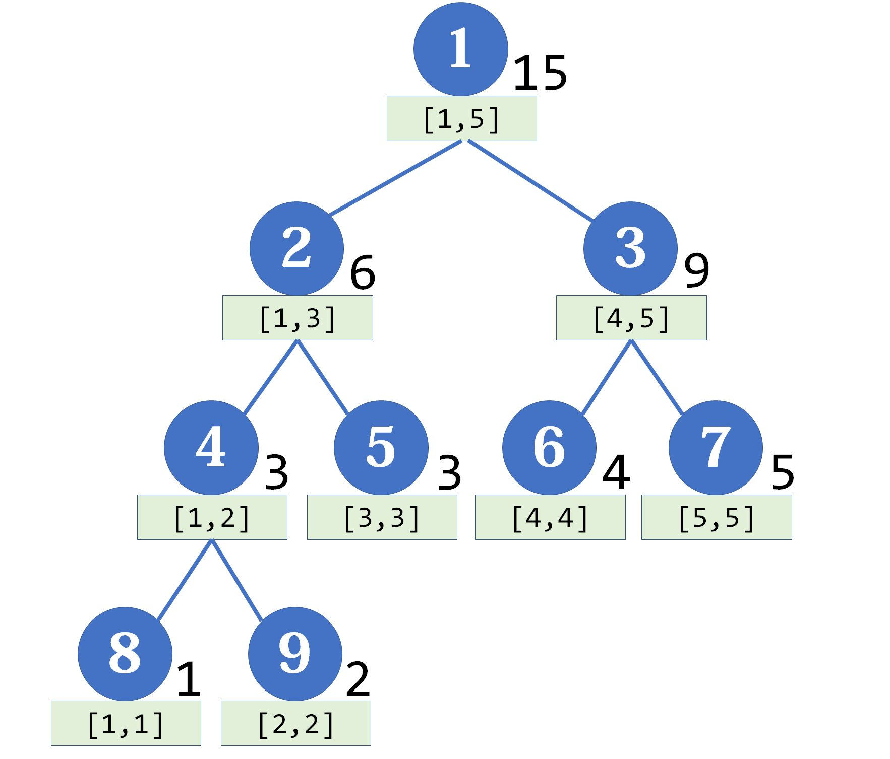

下面是具体的模板，一般采用树状数组来实现线段树，学过数据结构可以知道，此时一个节点下标为k，那么它的左儿子下标是2k，右儿子是2k+1，父亲节点下标是floor(k/2)，以这样的规则建立线段树和维护线段树。

## 建立线段树和维护线段树关系

首先根据线段树的性质，假设元素个数$n=2^h$(就是说最后一行有$2^h$个元素为全部的元素)，h就是线段树的高度，这里不论n是不是2的幂函数都无所谓，因为最后一行可能不会全部用到，可以先这样假设。因此总共要存储的节点数为$1+2+4+8+...+2^h=2^{h+1}-1=2*2^h-1=2n-1$，空间复杂度是$O(2n)$，但是在实际使用中，我们只要找到一个可以满足n需要的h，让$2^{h-1}<=n<=2^h$，那么显然$2^h<=2n$，因此之前计算的复杂度进一步扩充应该是$2*2^{h}-1 <= 2*2n-1$，所以开4n的空间，没必要精打细算。

而线段树的维护则是从最下层开始的，因为每个元素更新以后才能逐层往上更新，这就是线段树的维护。这里以区间和跟区间最大值为例。

```C++
int n;
//线段树
int tree[n*4];
//数据
int ans[n];
//取左儿子
int ls(int p)
{
    return p << 1;
}
//取右儿子
int rs(int p)
{
    return p << 1 | 1;
}
//维护区间和
void load_sum(int p)
{
    tree[p] = tree[ls(p)] + tree[rs(p)];
}
//维护区间最大值
void load_max(int p)
{
    tree[p] = max(tree[ls(p)], tree[rs(p)]);
}
//递归建树
//建树过程涉及前面的全部函数，所以可以从build开始写
void build(ll p, ll l, ll r)
{
    //这是懒标记初始化，后面会说
    mark[p] = 0;
    if(l == r)
    {
        tree[p] = ans[l];
        return;
    }
    else
    {
        ll mid = (l + r)/2;
        //递归到左儿子和右儿子
        build(ls(p),l,mid);
    	build(rs(p),mid+1,r);
        load_sum(p);
    }
}
```

## 区间修改和“懒”标记

对于区间修改，朴素的想法是改动叶子的值后像建树一样递归上去，但是通过懒标记可以大大降低这个时间复杂度。懒标记就是给需要修改的所有区间进行一次标记，因此这个懒标记是从上传递到下面的，表示当前区间已经更新过，但是子区间没有更新，以及更新的信息是什么。

```C++
//给区间[l,r]内的元素全部加上k，当前在p点
ll mark[4*n];

//传递懒标记到p的下层，并清除当前的懒标记
void save(ll p, ll l, ll r)
{
    ll mid = (l+r)/2;
    //更新左子树
    mark[ls(p)] += mark[p];
    tree[ls[p]] += mark[p] * (mid - l + 1);
    //更新右子树
    mark[ls(p)] += mark[p];
    tree[p] += mark[p] * (r - mid);
    mark[p] = 0;
}
//更新元素值，t代表目标
void update(ll tl, ll tr, ll l, ll r, ll p, ll k)
{
    //要修改的区间包含当前区间则标记当前区间并直接返回
    if(tl<=l && r <= tr)
    {
        tree[p] += k*(r-l+1);
        mark[p] += k;
        return;
    }
    //传递懒标记，此时还没有递归到下层
    save(p,l,r);
    ll mid = (l+r)/2;
    //目标区间涉及左子树区间，递归更新左子树
    if(tl <= mid)
        update(tl,tr,l,mid,ls(p),k);
    //目标区间涉及右子树区间，递归更新右子树
    if(tr>mid)
        update(tl,tr,mid+1,r,rs(p),k);
    //已经递归完左右子树了，回到上层更新节点值
    load_sum(p);
}
```

归结起来就是三个步骤：

* 判断当前区间是否包含于被修改区间，是则给当前区间添加懒标记并返回；否则下一步；
* 传递当前层的标记到下一层；
* 递归传递左右子树；
* 更新并返回上层节点。

值得注意的是，如果当前区间被包含于目标区间，更新函数直接返回了，因此这个节点之下的其他节点并没有更新，这就是懒的地方，虽然没有更新下面的节点，但是这个点已经有了懒标记并且没有被save清空，也就是说，这一步以后线段树的状态是这个节点的值更新了，并且打上了标记，但是它的子树并没有更新，仍然是原来的状态。

显然这会导致部分错误，但是，线段树的精髓就在于懒标记，我们完全可以在查询的时候将这个没有传递的懒标记传递下去，从而保证查询结果的正确；而那些没有懒标记的节点即使传递了懒标记也不会出现问题，因为它们的懒标记应当为0，除非它们的某个祖先节点为他们传递了懒标记。

因此，懒标记实际上记录的是修改的操作值，而不仅仅是要不要修改的flag。

## 区间查询

```C++
ll query(ll qx, ll qy, ll l, ll r, ll p)
{
	ll res = 0;
    //查询区间包含当前区间，返回当前区间的值
	if(qx<=l && r <= qy)
		return tree[p];
	ll mid = (l+r)/2;
    //否则传递到下面继续查询
	save(p,l,r);
    //涉及左子树
	if(qx <= mid) 
		res += query(qx,qy,l,mid,ls(p));
    //涉及右子树
	if(qy > mid)
		res += query(qx,qy,mid+1,r,rs(p));
	return res;
}
```

最后，在设计线段树维护的信息的时候要注意两个地方，一个是怎么安排懒标记或者信息的初值，例如在洛谷线段树2模板中，要求同时支持加和乘两种操作，由于两种操作的懒标记意义不同，因此要维护两个标记，其中加操作的懒标记显然初植为0，而乘操作的懒标记则需要为1的初植；另一个是查询时的懒标记传递函数怎么确定，前面的问题中，我们只能在查询的时候才能将懒标记传递下去，因此对左右子孙的更新要先乘法再加法，如果先加法，那么在加法之前的乘法会多乘，显然是错的。

# 差分数组

前面线段树有提到区间操作这个概念，对一个数组来说，直接随机存取后虽然能很快地查询每个元素值，但是并不利于修改整个数组区间的值，或者查询数组区间的值，因为大量的遍历显然会很大程度地浪费时间，换句话说随机存取的数组方便进行单点操作而不便进行区间操作。

有个方法叫前缀和，比较简单，就是记录数组累加或者其他的一些操作，从而方便进行区间查询，对单点查询一般也可以实现随机存取，但是并不能方便单点和区间修改，因为无论什么修改操作都只能让后面的数组重新更新一遍。

线段树则比较全面，查询和修改都是对数级别，泛用性比较强。

因此，除去普通数组，我们现在知道前缀和方便查询，线段树对查询修改都不错，最后还要介绍一个差分数组，当然就是方便修改了，对区间和单点修改，它的复杂度都是$O(1)$级别的。

简单来说，差分数组存储的就是当前元素和前一个元素的差值，就像下面这样：

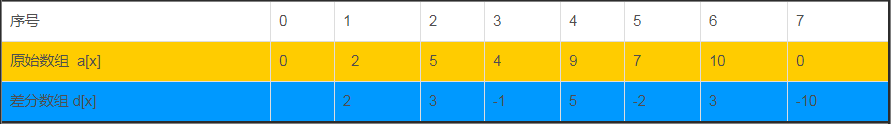

区间修改利用了差分数组的性质，试着将序号为[2,4]内的所有元素全部加3，那么差分数组中实际上只有序号为2，5的两个元素发生了改变，前者减3，后者加3，也就是说对区间[l,r]修改后差分数组中只有l和r+1发生改变，前者改变相同，后者改变相反，而中间的元素并不会发生改变，这样以来就实现了修改的$O(1)$操作。

更有意思的是，差分数组的前缀和就是原数组！这就是从差分数组求原数组的方法。

总结一下，方便区间查询用前缀和，方便区间修改用差分数组，都需要的话要么同时前缀和+差分，要么线段树。

# 并查集

维护一个类似树的数据结构，其中的含义是每个树作为一个集合，其中的根节点是集合代表元素，而子节点属于这个集合，从而表示一种从属关系，将不同的数据分成不同集合。可以用数组来实现：

```c++
int fa[max]
void Init(int n)
{
	for (int i = 1; i <= n; ++i)
        fa[i] = i;
}
```

数组存储每个节点的父节点。

```C++
void merge(int i, int j)
{
    fa[find(i)] = find(j);
}
```

将节点i合并到节点j的集合中，也就是将节点i的最终的父结点设置为j的最终父结点。

```C++
int find(int x)
{
    if(fa[x] == x)
        return x;
    else
        return find(fa[x]);
}
```

所谓最终父节点就是节点所在集合的代表元素，通过递归的方式查询，确定从属于哪一个集合。

此外还有一个称为路径压缩的操作，将一个代表元素下的所有的子元素的父结点都直接设置为这个代表元素，这样就不用通过慢慢递归的方式查询了，因此可以在第一次查询的时候进行一次维护，也就是路径压缩，将子结点的子结点变成子结点：

```C++
int find(int x)
{
    return x == fa[x] ? x : (fa[x] = find(fa[x]));
}
```

## 带权并查集

并查集的推广，有些情况下不仅要记录不同元素之间的关系，还要记录他们之间某个相关联的值，此时声明另一个数组val来将连边上的值存储为节点上的值，方便查找。

```C++
int fa[max];
int val[max];
void Init(int n)
{
	for(int i = 0; i < n; i++)
	{
		fa[i] = i;
		val[i] = 0;
	}
}
```

```C++
int find(int x)
{
	if(x == fa[x]) return x;
	else
	{
		//路径压缩
        //注意这里必须是先查father再更新value
        //递归的时候让value从根节点往下更新到当前节点
        //先find再更新value根本原因是，递归过程中可能把前面的节点路径压缩了
        int tmp = fa[x];
        fa[x] = find(fa[x]);
		val[x] += val[tmp];
		return fa[x];
	}
}
```

```C++
void merge(int i, int j, int weight)
{
	int px = find(i);
	int py = find(j);
	if(px != py)
	{
		fa[px] = py;
		val[px] = val[j] + weight - val[i];
	}
}
```

带权并查集的合并比较难理解，可以通过下图这样计算理解：

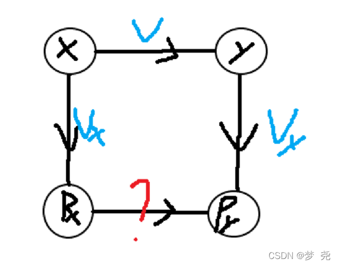

当然也不全是这样计算权值，有些题目中可能会进行取模乘除等操作，要参考具体情况。

# 期望DP

相比于普通的动态规划，期望DP主要是在求期望的递推式，常见的一种做法是，定义dp[i]为在第i个状态下，到达目标dp[n]还需要的花费，因此可以利用期望的线性可加性质计算dp[i]的状态为$dp[i] = p_1 dp[j]+p_2dp[k]+1$，注意后面可能还要加1，这是因为有时候题目表述下无论dp为何种状态，总是要先进行一次花费才能转移状态，因此每次要迭代加上一个1。此外还有很多期望DP的问题，不一定利用这种类似全概率公式的方式推导，这里暂时不记录了。

下面是一道典型例题，问有T组测试，每个测试输入一个n，表示一个n面的骰子，问期望投几次才能投到所有的面。

思路：定义dp[i]为摇到第i种点数时，还要摇到n种点数的期望，那么可以判断，dp[i]时再摇一次有两种可能，即摇到前面i种点数之一和摇到新的点数了，因此写出方程$dp[i] = dp[i+1] * (n-i)/n + i/n * dp[i] + 1$，也就是说摇到前面的点数那么期望就是现在的dp[i]，有新的点数就将状态转移到下一个dp[i+1]，最后无论是否转移状态，都要摇一次骰子，因此还要加1。化简这个式子得到状态转移方程：

$dp[i] = dp[i+1] + n / (n-i)$

代码如下：

```C++
#include<iostream>
#include<algorithm>
#include<stdio.h>

using namespace std;

int main()
{
	int t;
	cin >> t;
	for(int i = 0; i < t; i++)
	{
		int n;
		cin >> n;
		double dp[1005] = {0};
		dp[n] = 0;
		for(int j = n-1; j >= 0; j--)
		{
			dp[j] = dp[j+1] + (double)n / (double)(n-j);
		}
		printf("%.2f\n", dp[0]);
	}
	return 0;
}

```

# 博弈相关

有许多游戏可以通过博弈来确定最佳策略，从而达到先手或者后手必胜的情况，根据策梅洛定理，这类游戏满足五个特点：

* 双人、回合制；
* 信息完全公开（perfect information）；
* 无随机因素（deterministic）；
* 必然在有限步内结束；

* 没有平局；

可以通过必胜态和必败态的转换情况，最终确定玩家先手胜利还是后手胜利。采用模拟的办法来记录，判断条件为下面三个：

* 游戏终局是必败态，取决于游戏规则，如果当前局面下玩家已经无路可走，那么就是必败态，这位玩家的上一位就赢了；
* 某个状态进行一步游戏操作后，如果只能转变为必胜态，那么这个状态就是必败态（通过操作将必胜态给了对手）；
* 某个状态进行一步游戏操作后，如果至少存在一个必败态，那么这个状态就是必胜态（通过操作将必败态给了对手）；

因此对于博弈问题，可以确定某个状态的玩家必胜还是必败。竞赛中给出打表和DFS两种模板。打表还不明白，先介绍DFS的一般做法。

## 打表

其实就是先DFS再记录，然后拷贝进来根据输入直接输出，所以其实没啥区别。

打表方法就是竞赛中简单的暴力方法，只不过打表要求数据有限多(指你方便暴力循环后重新复制一遍)，然后复制进代码里直接输出，就不会超时了。

## DFS

其实DFS就是暴力方法，只不过结合了博弈论的判断方法，加快了终止。一个博弈游戏因为两个人的决策会出现许多分支，那么我可以把这些分支像树的节点那样全部记录下来，同时判断出这些分支的状态是必胜还是必败，如果一个节点后面的状态是终局，那么就结束；如果后面的状态都是必胜态，那么当前这位玩家处于必败态，同样可以结束；如果后面的状态存在必败态，那么选择这个必败态继续遍历(因为没必要让对手得到必胜态)，这也是选择DFS而不是BFS的原因。

也就是说，DFS解决这种博弈问题就是写check函数和遍历函数，这两个确定了之后就都能常规处理。

下面是2022年蓝桥杯第二题的解法，就是经典的nim博弈游戏，用递归dfs解决。

```C++
#include<iostream>
#include<vector>
#include<map>
using namespace std;

bool checklast(string s)
{
    int count = 0;
    for(int i = 0; i < s.size(); i++)
    {
        if(s[i] == '0')
            count++;
    }
    return count == 1;
}

//创建二元数组记录dfs情况
map<string, bool> m;
bool dfs(string s)
{
    //m中存在s，直接将刚才判断的状态返回
    if(m.count(s) == 1)
        return m[s];
    //如果s是终局状态，也就是必败态，返回false
    if(checklast(s) == true)
        return m[s] = false;
    //对没有判断过，也不是终局的状态进行递归dfs
    for(int i = 0; i < s.size(); i++)
    {
        if(s[i] == '0')
        {
            string tmp = s;
            tmp[i] = '1';
            //能转移到必败态都是必胜态
            if(dfs(tmp) == false)
                return m[s] = true;
        }
    }
    for(int i = 0; i < s.size() - 1; i++)
    {
        if(s[i] == '0' && s[i+1] == '0' && i != 3)
        {
            string tmp = s;
            tmp[i] = tmp[i+1] = '1';
            //能转移到必败态都是必胜态
            if(dfs(tmp) == false)
                return m[s] = true;
        }
    }
    //一次都不能转移到必败态，只能转移到必胜态，此时当前状态则是必败
    return m[s] = false;
}


int main()
{
    string s[] = {"10000000", "11000000", "01000000", "01100000"};
    for(int i = 0; i < 4; i++)
    {
        if(dfs(s[i]) == true)
            cout<<"L";///此时为必胜态，说明后手面临的局面必胜，输出L
        else 
            cout<<"V";
    }
    return 0;
}


```


# 数论基础

数论是数学的分支，研究整数的性质，自然在计算机中就有很大用处。不过我们竞赛过程中也没必要完全掌握，下面是竞赛中常见的数论内容，并且以C++的处理为主，对于某些问题(例如对负数取模)不同语言结果不同，这一点要注意。

## 模运算

在竞赛中会出现一些比较大的数字，没办法直接输出或者计算，采用模运算来减小规模。编程上取模运算就是%，但是要注意左操作数（被除数）的正负，因为在C++中，如果有负数参与了取模运算，遵循以下规则：

* 结果的符号只于左操作数有关；
* 结果的绝对值等于操作数绝对值的模运算；

这种模运算定义被称为**truncated division**，Java和C都采用这种定义。Python采用的是**floored division**，可以自行了解。

模运算具有一些基本定理：

* 和的模运算=模运算的和取模；
* 差的模运算=模运算的差取模；
* 积的模运算=模运算的积取模；

除法则没有这个性质。通过这些定理可以防止数据溢出，从而计算大的数据。例如，下面的程序计算了(a*b)%m的结果：

```c++
ll mul(ll a, ll b, ll m)
{
	a = a%m;
	b = b%m;
	ll res = 0;
	while(b > 0)
	{
		if(b&1) 
            res = (res + a) % m;
		a = (a + a) % m;
		b >>= 1;
	}
	return res;
}
```

利用了乘法的性质，同时还利用了快速幂运算(while循环，后面会说)，先得到a、b的模运算结果，然后要计算积的模运算，此时将a、b看成二进制，b作为乘数，最低位如果是奇数，那么结果中就会有a取模的结果，再将a移动到高一位，乘以2，然后b移动到低一位，除以2，最终当b已经运算完了最高位，那么就得到结果。

## 快速幂

直接做幂运算，那么显然a^n%m的时间复杂度是log(n)，如果采用快速幂运算方法，降低到对数级别。思想就是分治，下面的代码计算了a^n%m的值：

```C++
ll fastPow(ll a, ll n, ll m)
{
    ll ans = 1;
    a %= m;
    while(n)
    {
        if(n & 1)
            ans = (ans * a) % m;
        a = (a  * a) % m;
        n >>= 1;
    }
    return ans;
}
```

和上面的例子差不多，都是利用模运算性质后进一步优化乘法，这里a不断相乘，指数翻倍，从而减少乘法运算。

## 费马小定理

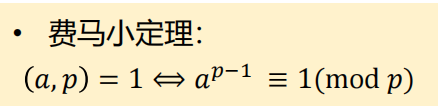

可以用来求乘法逆元。将快速幂和费马小定理结合，通常用来处理x/y%m形式的数据，求出y的乘法逆元$y^{-1}$，就得到$x*y^{-1}\%m$，从而防止了精度丢失，对大数据的运算很有用。22年蓝桥杯E题爬树的甲壳虫需要用这个方法。

## 矩阵快速幂

原理和普通的快速幂相似，定义矩阵乘法后，可以用几乎相同的代码计算，依然是分治的思想：

```C++
struct matrix {int m[N][N];};
matrix operator * (const matrix &a, const matrix &b)
{
    matrix c;
    memset(c.m, 0, sizeof(c.m));
    for(int i = 0; i < N; i++)
    {
        for(int j = 0; j < N; j++)
        {
            for(int k = 0; k < N; k++)
            {
                c.m[i][j] = (c.m[i][j] + a.m[i][k] * b.m[k][j]) % mod;//如果数字大可以取模
            }
        }
    }
    return c;
}
```

```C++
matrix fastPow(matrix a, int n)
{
    matrix ans;
    //初始为单位矩阵
    memset(ans.m, 0, sizeof(ans.m));
    for(int i = 0; i < N; i++)
    {
        ans.[i][i] = i+1;
    }
    while(n)
    {
        if(n & 1) ans = ans * a;
        a = a * a;
        n >> 1;
    }
    return ans;
}
```

矩阵快速幂的时间复杂度是$O(N^3\log(n))$，通常会给出一个较大的n和较小的N来考察。

### 应用到dp问题
矩阵快速幂可以用于解决部分能化简成幂函数形式的dp问题，将递归数列的递推关系转化为矩阵乘法，所以递推数列就能转化为幂函数，最后就可以应用快速幂得到结果。

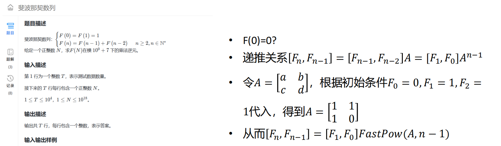


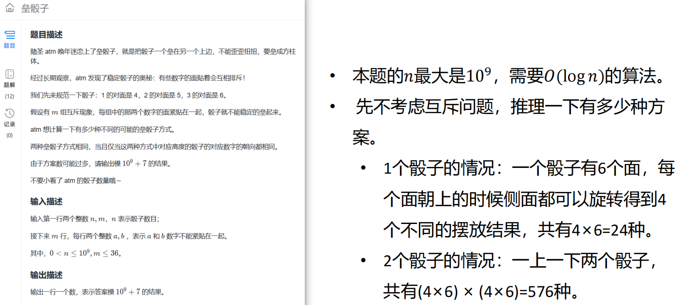

垒骰子这道题考察得比较隐蔽，dp可以想到，如何转化为快速矩阵幂不容易想。
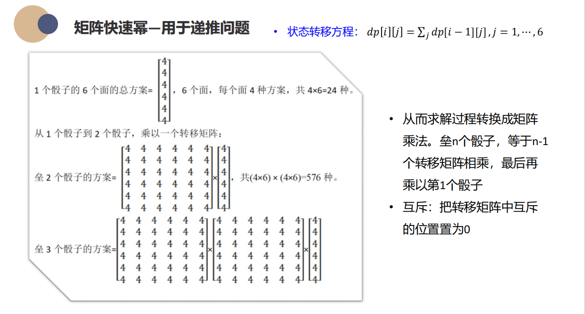
这里通过手推找到规律，确定幂函数的底数a是六行六列的矩阵，其中每个元素表示确定了下面骰子以j为顶面且确定了位置时上面骰子以i为顶面的方案数为4，就将问题转化成矩阵快速幂了，最后求出n-1次方，然后取模即可。

### 应用到图的最短路径
可以计算出赋权图上只经过m条边的最短通路长度，因为这个本来是通过邻接矩阵的幂函数实现的，邻接矩阵的m次方代表经过m条边的路径数，那么显然就可以通过快速幂计算。

```C++
matrix fastPow(matrix adj, int n)
{
    matrix ans = a;
    n--;
    while(n)
    {
        if(n & 1) ans = ans * a;
        a = a * a;
        n >>= 1;
    }
    return ans;
}
```

可以看出重要的其实就是while内部的操作，这里将ans赋值为单位矩阵也可以的，只不过要多计算一次a和单位矩阵的乘法。

## GCD和LCM

最大公约数和最小公倍数有很多性质：

* $gcd(a,b) = gcd(a,a+b) = gcd(a,k*a+b)$
* $gcd(ka,kb) = k * gcd(a,b)$
* $gcd(a,b,c) = gcd(gcd(a,b), c)$
* 如果$gcd(a,b)=d$，那么$gcd(a/d,b/d)=1$
* $gcd(a+cb,b)=gcd(a,b)$
* 辗转相除法：$gcd(a,b)= gcd(b, a\%b)$
* $gcd(a,b)*lcm(a,b)=a*b, lcm(a, b) = a*b/gcd(a, b) = a/gcd(a, b)*b$

还是要多做题才方便记住这些定理。

### 贝祖定理

* 如果$gcd(a,b) = d$，那么对任意的$x,y$一定有$ax+by$是$d$的倍数

* 推论：$a,b$互质，那么存在$x,y$使得$ax+by=1$

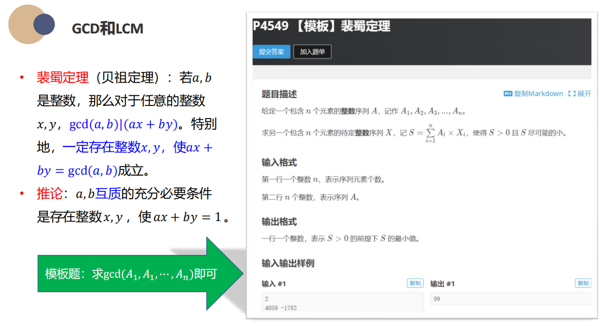

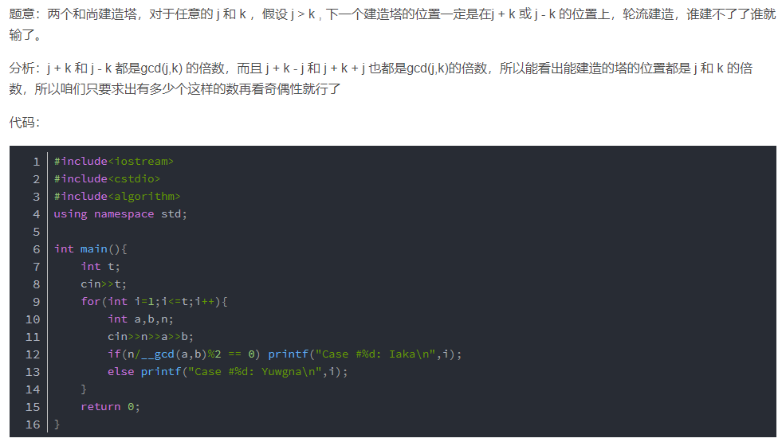

### 扩展欧几里得算法

用于求出$ax+by=gcd(a,b)$时的x，y和最大公因数。这个方程可以写成二元线性丢番图方程$ax+by=c$，这个方程有解的充要条件就是$c$能被$gcd(a,b)$整除。

```C++
#include <iostream>

using namespace std;

typedef long long ll;

ll extend_gcd(ll a, ll b, ll &x, ll &y) {
  if (b == 0) {//如果辗转相除到b为0，此时a就是最大公因数了
    x = 1;
    y = 0;
    return a;
  }
  //递归调用，每次辗转相除找最大公因数，并交换x，y
  //这是因为在递归结束后要更新此时x，y的值，根据辗转相除法得到
  //如果里层递归时的值为x1和y1，那么外层的x应该等于y1，y等于按照下面式子更新后的值
  //才能保证ax+by=gcd(a,y)，推导见代码块之后
  ll d = extend_gcd(b, a % b, y, x);
  
  y -= a / b * x;
  
  return d;
}

```

* $b * x1 + (a \% b) * y1 = gcd(b, a \% b)$
* $a * x + b * y = gcd(a, b)$
* $gcd(a,b) = b * x1 + (a - (a/b)*b) * y1     = a * y1 + b * (x1 - (a/b)*y1)$

以上是推导过程。此时已经求出一个方程的特解(x,y)，其通解为$x^* = x_0+(b/gcd(a,b))*t,y^*=y_0-(a/gcd(a,b))*t$。利用通解我们可以进一步求出这个方程的最小正整数解，将x，y分别对$b/gcd(a,b)$和$a/gcd(a,b)$取正整数即可。

下面是一个实例：

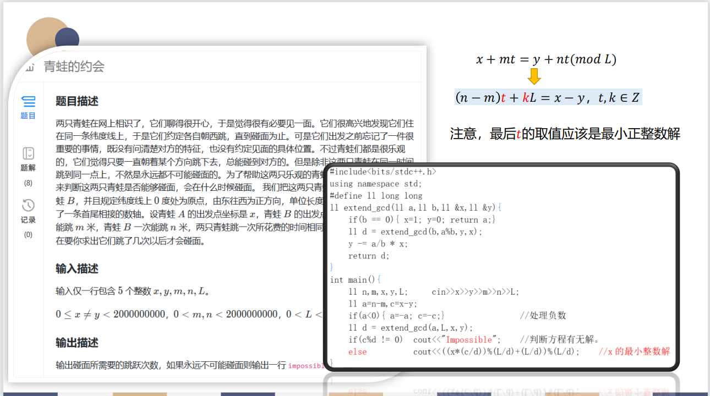

在这里两个地方要注意，一个是列出线性同余方程，这一步是关键；其次输出的时候为了保证x不是负数，要通过上面的取模处理：

```
x = x * c / d;//求出初步的特解
x = (x % (L/d) + L/d);//将x转化为正整数，这里L/d从扩展欧几里得算法中的x通解得来
x = x % (L/d);//再次取模，如果x之前为负，这里没用；否则这里就是除去之前加上的一个L/d
```

## 素数

基本定理：

* 有无穷多个素数，从小到大分布越来越稀少；
* 对任意整数n，存在n个连续的合数；
* 小的素数判断，只需要遍历到这个数的平方根处，因为不可能会有两个大于它平方根的数相乘得到这个数；

### 大素数检验

#### 费马素性检验

基于费马小定理的逆定理，如果两个数a，n互质，那么，$a^{n-1}\equiv 1 \pmod n$。从1~n中选择一个数a来验证即可。

#### Miller-Rabin素性检验

如果存在$x$使得$x^2 \equiv 1 \pmod n,x \not= 1或n-1$，那么n是合数。

步骤：

* 找到一个$t$和$u$使得$n- 1 = 2^t * u$；
* 找到一个$x_0$和$a$使得$x_0^2 = a^u \% n$；
* 递推$x_t = x_{t-1}^2 \% n$;
* 对最后的$x_t$判断，如果$x_t \not = 1$，且$x_t^{n-1} \not \equiv 1 \pmod n$，那么证明$n$是合数；对每个$x_t$判断，如果$x_t = 1$，而且$x_{t-1} \not = 1或n-1$，也证明n是合数。
* 注意，要对所有选择过的$x_t$都进行判断后才能输出，因为费马小定理对合数不一定正确，只要求两个数互质，因此即便满足了$x_t^{n-1} \equiv 1 \pmod n$也不能说n就是质数，除非确定此时的$x_t$是质数。但是，只要不符合这个条件，$n$就一定不是质数，所以费马小定理的逆定理仅作为判断合数的充分条件。

如果遍历完选择的$t$个$x_t$后，条件都满足合数，那么就判断是合数，一般这样测试五十次就够了。

```C++
bool witness(ll a, ll b)
{
    ll u = n-1;
    int t = 0;
    //求出u和t
    while(u$l == 0)
    {
        //看n-1能被2整除几次得到t
        u = u>>1;
        t++;
    }
    ll x1, x2;
    x1 = fast_pow(a,u,n);
    for(int i=1; i<=t; i++)
    {
        x2 = fastPow(x1,2,n);
        //如果满足第二个条件，说明是合数，存在非平凡平方根
        if(x2 == 1 && x1 !=1 && x1 != n-1)
            return true;
        x1 = x2;
    }
    //如果满足第二个条件，即不满足费马小定理，那就是合数
    if(x1 != 1)
        return true;
    //都没检测出来，大概率是质数
    return false;
}

int miller_rabin(ll n, int s)
{
    //1既不是质数也不是合数
    if(n < 2) return 0;
    //2是质数
    if(n == 2) return 1;
    //偶数是合数
    if(n % 2 == 0) return 0;
    //做s次测试
    for(int i = 0; i < s && i < n; i++)
    {
        //a通过随机数确定，1~n-1
        ll a = rand() % (n-1) + 1;
        if(witness(a,n))
            return 0;
    }
    return 1;
}
```

### 威尔逊定理

给定一个素数p，那么：

* $((p-1)!+1)\%p=0$
* $(p-1)!\%p=p-1$
* $(p-1)!=kp-1$
* $(p-1)! \equiv -1 \pmod p$

对合数：除4外，(n-1)!肯定有两个数积为n的倍数。

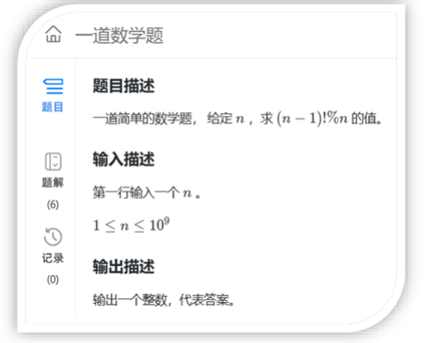

对这个题来说，n=4的时候单独计算，其余的n都是0。

### **素数筛和合数分解质因数**

素数筛可以找出小于数n的所有质数。

#### 素数筛

* 埃氏筛：找到一个素数，筛去它所有的倍数；遍历所有小于n的数，输出没有被标记为合数的数，就是全部的质数；
* 欧拉筛：初始将所有数标记为素数isPrime，然后开始遍历，对标记为素数的数，添加到素数组Prime中并遍历Prime，筛去它所有已知素数倍数的合数，并且筛去后判断当前的这个数是否是Prime中某个素数的倍数，这样能保证每个合数只被它最小质因数筛选一次，例如对2标记为素数后，只筛去4；3标记为素数后，筛去6，9；4标记为合数，不加入Prime，筛去8，12；5标记后筛去10，15，25；

```C++
const int MAXN = 10000;
int prime[MAXN+1];
bool isprime[MAXN+1];
int count = 0;
void euler()
{
    memset(isprime,true,sizeof(isprime));
    isprime[1] = false;
    for(int i = 2; i < n; i++)
    {
        if(isprime[i] == true)
            prime[++count] = i;
        for(int j = 1; j <= count && i * prime[j] <= n; j++)
        {
            isprime[i * prime[j]] = false;
            if(i % prime[j] == 0) break;
        }
    }
}
```


#### 合数分解

* 试除法：用筛后的素数去除；如果有素数整除了n，那么用这个数再除，直到不能整除，记录这个素数，用下一个素数继续遍历以此类推；

```C++
//试除法
ll factor[100][2];
int facount;
int getFactors(ll x)
{
    facount = 0;
    ll tmp = x;
    //只需要遍历到平方根即可
    for(int i = 1; prime[i] <= tmp/prime[i]; i++)
    {
        //factor[i][0]记录n被prime[i]整除
        //factor[i][1]记录n能被几个prime[i]整除
        //没有达到终止条件就要继续找下一个素因数，而不是用上次剩下的tmp作为最后的素因数
        factor[facount][1] = 0;
        //看n能不能整除素数prime[i]
        if(tmp % prime[i] == 0)
        {
            //记录这次整除到多少
            factor[facount][0] = prime[i];
            //循环整除到几次
            while(tmp%prime[i] == 0)
            {
                factor[facount][1]++;
                tmp /= prime[i];
            }
            facount++;
        }
        //记录剩下多少tmp，作为最后一个因数
        if(tmp!=1)
        {
            factor[facount][0] = tmp;
            factor[facount++][1] = 1;
        }
    }
    return facount;
}
```

* Pollard_rho启发式方法；

该方法采用随机数的方式选择试除对象，根据生日悖论提供一个以两个数绝对值作为除数的方法，不同的组合可以增加这个数是因数的概率，从而在判断中快速找到因数。而构造的序列$x_i=(x_{i-1}^2+C)%N$会构成一个$\rho$形状的数环，即不论从什么地方开始，这个序列总会进入循环，因此这也是一个伪随机的序列。

而为了判断环的存在，可以使用简单的Floyd判环算法，设经过时间$i$后，$t=i，r=2i$，表示后者速度是前者的一倍。因此当后者遇上前者时，有$x_t=x_r$，也就是$x_i=x_{2i}=x_{i+kC}$，其中k是整数，C是环的长度。

```C++
//启发式方法pollard_rho
//返回一个因数，不一定是质因数

//序列函数x=(x^2+c)%n
int f(int x,int c,int n)
{
    return (x*x+c)%n;
}
//返回N的一个因数，不一定是质因数
int pollard_rho(int N)
{
    //生成常数C
    int c=rand()%(N-1)+1;
    //floyd优化环判断，t是龟，r是兔子
    //设t=x1=f(0)，r=x2=f(x1)
    int t=f(0,c,N),r=f(f(0,c,N),c,N);
    while(t!=r)
    {
        int d=gcd(abs(t-r),N);
        if(d>1)
            return d;
        //更新时保证t=f(t)=x_i，那么r=f(r)=x_2i
        t=f(t,c,N),r=f(f(r,c,N),c,N);
    }
    return N;//没有找到,重新调整参数c
}
```

## 同余

定义：$a \equiv b \pmod m$

性质：

* 自反性：$a \equiv a \pmod p$
* 对称性：$a \equiv b \pmod m \Rightarrow b \equiv a \pmod m$
* 传递性：$a \equiv b \pmod p，b \equiv c \pmod p \Rightarrow a \equiv c \pmod m$

运算，如果a，b同余，c，d同余，那么：

* $a\pm c \equiv b \pm d$
* $ac \equiv bd$
* $a^k \equiv b^k$
* $(a/b)\%m = ((a\%m)*(b^{-1}\%m))\%m$


### 一元线性同余方程和乘法逆元

一元线性同余方程基本形式：$ax\equiv b \pmod m$，等价于前面扩展欧几里得算法提到的二元线性丢番图方程$ax+my=b$，因此有以下定理：

* 定理：方程有解的充要条件是$gcd(a,m)|b$，与前面相同；此时有$gcd(a,m)$个不同的整数$x$使得$ax \equiv b \pmod m$；
* 推论：$gcd(a,m)=1$时，只有一个满足要求的解$x$，称为$a$模$m$的乘法逆元，记作$a^{-1}$。

求乘法逆元的方法前面已经介绍了，通过扩展欧几里得算法，如果有一个特解是$x_0$，那么通解是$x=x_0+km$，其中k是整数，可以求出最小正整数解(逆的代表元)为：$((x_0\%m)+m)\%m$。

另外还可以通过费马小定理求逆，如果正好两个数$a$和$n$互质，那么有$a^{n-1} \equiv 1 \pmod n$，因此$a$的乘法逆元就是$a^{n-2}\%n$，而且已经是唯一解，因为此时$gcd(a,n)=1$。利用快速幂运算就是$fastPow(a,m-2,m)$。

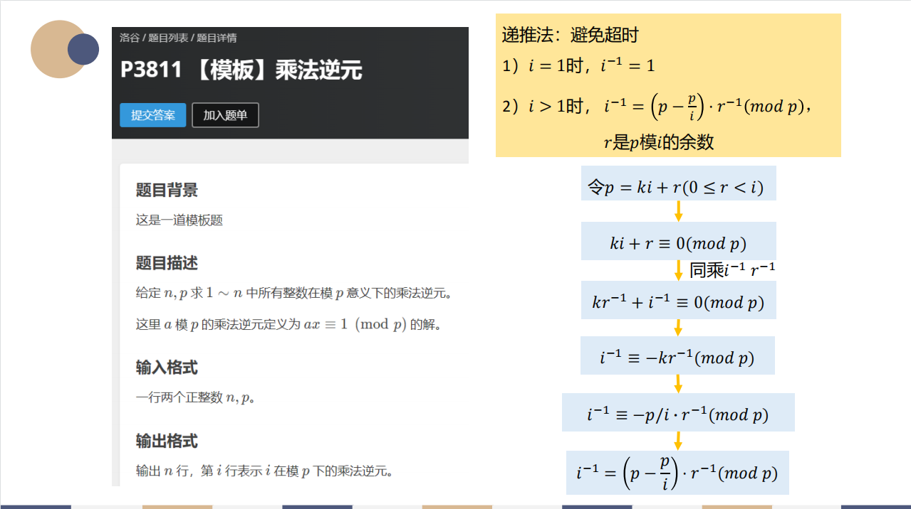

### 同余方程组

中国剩余定理，如果同余方程组的模两两互素，设$m_1,m_2,...,m_r,r \geq 1$为$r$个方程的模，令$M=m_1*m_2*...*m_r=m_1*M_1=...=m_k*M_k$，那么方程组的解是$x=a_1*M_1*M_1^{-1}+...+a_r*M_r*M_r^{-1} \pmod M$，其中$M_i^{-1}$是$M_i$对方程的模$m_i$的逆元，即$M_i*M_i^{-1} \equiv 1 \pmod {m_i}$。

如果同余方程组的模并不是两两互素，那么就要使用扩展中国剩余定理。

扩展中国剩余定理每次将两个方程合并成一个，假设有方程$x \equiv r_1 \pmod {m_1},x \equiv r_2 \pmod {m_2}$，那么将这两个方程等价于$x = r_1 + k_1 * m_1,x=r_2+k_2*m_2$，合并两个方程并移项可以得到：

* $k_1m_1-k_2m_2=r_2-r_1$

根据贝祖定理，这个方程组有解的充要条件是$r_2-r_1$能被$gcd(m1,m2)$整除，所以这时需要进行判断，如果不能整除，方程组无解；如果能整除，那么自然就是扩展欧几里得算法了，能求出方程$k_1m_1-k_2m_2=gcd(m_1,m_2)$的参数。

因此，进一步令$p_1=gcd(m_1,m_2)/(r_2-r_1)*k_1,p2=-gcd(m_1,m_2)/(r_2-r_1)*k_2$，那么这个式子就变成：

* $p_1*m_1+p_2*m_2=gcd(m_1,m_2)$

然后用扩展欧几里得算法得到$p_1,p_2$，进而求出$k_1=p_1*gcd(m_1,m_2)/(r_2-r_1)，k_2=-p_2*gcd(m_1,m_2)/(r_2-r_1)$，这样以来又可以求出满足这两个方程的特解$x$，从而得到通解$x^*=x+k*lcm(m_1,m_2)$，等价于同余方程$x^* \equiv x \pmod {lcm(m_1,m_2)}$，就把两个方程合并成一个了。

因此，扩展中国剩余定理的流程就是：

* 读入一个方程；
* 判断能否与之前处理好的方程合并，如果不能，返回无解；否则执行下一步；
* 返回第一步，直到全部方程都读入了。

```C++
typedef long long ll;
ll n,mod[100009],yu[100009];

//快速幂运算a*b%m
ll qMul(ll a,ll b,ll m){
    ll an = 0;
    while(b) {
        if(b&1) an =(an+a) % m;
        a = (a+a)%m;
        b>>=1;
    }return an%m;
}

//扩展欧几里得算法，返回gcd(a,b),并计算出ax+by = gcd(a,b)中的x和y
ll exGcd(ll a,ll b,ll &x,ll &y){
    if( b == 0 ) { x = 1;y = 0; return a;}
    ll gcd = exGcd(b,a%b,y,x);  //注意x和y的顺序
    y = y - a/b*x;
    return gcd;
}

//exCrt
int main() {
    //读数据
    cin>>n;
    for(int i = 1;i <= n;i++) cin>>mod[i]>>yu[i];
    //ans表示前i-1个方程式的特解（余数），M为前i-1个方程式的模数的最小公倍数(i从2开始)
    //k1和k2是合并两个同余方程时的待求参数
    ll ans = yu[1],M = mod[1] ,k1,k2;
    for(int i = 2;i <= n;i++){
        //记录mi和r2-r1
        ll mi = mod[i],res = ((yu[i] - ans)%mi + mi)%mi;
        //求出gcd(mi,M)
        ll gcd = exGcd(M,mi,k1,k2);
        //如果等式右边不能整除gcd，方程组无解
        if(res % gcd != 0) 
        { 
            cout<<-1<<endl;
            exit(0); 
        }
        //求出k1还要乘上倍数，注意是快速乘取模mi (对谁取模要分清)
        k1 = qMul(k1,res/gcd,mi);
        //得到前i个方程的特解（余数）
        ans += k1 * M; 
        //M等于lcm(M,mi)，注意乘法要在除法后面做，否则会爆long long
        M = mi /gcd * M; 
        //合并后的ans特解取最小正整数
        ans = (ans%M+M)%M;
    }
    cout<<ans;
    return 0;
}
```

