# 前言
更新中
****************
来成都上学到现在还是去了不少食店，简单记录下这些店的位置和价格，顺带放一些游玩的照片。欢迎推荐~
<!-- more -->
# 火锅串串类
## 小郡肝串串香
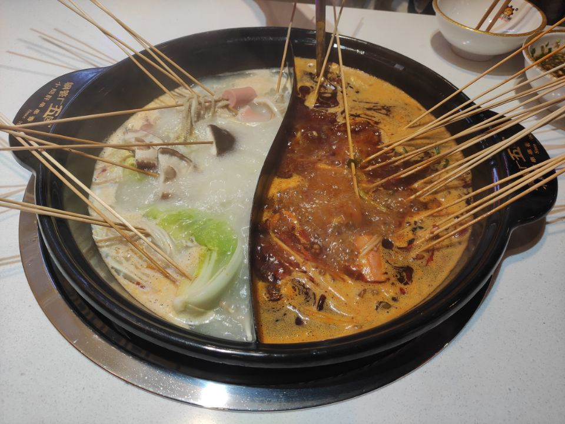
时间长忘记叫啥了😀，中规中矩的一家店，消费比较高，人均100左右，小酥肉好吃，又嫩又香。虽说买的是串串，但我吃串串总感觉跟火锅差不多，经常吃到一半然后把签子全部拿了当火锅吃。

味道印象中还可以，我感觉要把这种做难吃也挺不容易。

# 自助
## 泰澜汀·海鲜自助烤肉火锅
我去的这家是郫都龙湖新开的，美团63一位，据说价格恢复是一百多。60块钱的海鲜其实挺划算，他那里货都挺新鲜，不过种类不多，海鲜有螃蟹，蛤蜊，生蚝，扇贝，还有海星跟两种贝类，皮皮虾也有。肉类也正常，不过我觉得挺一般的。
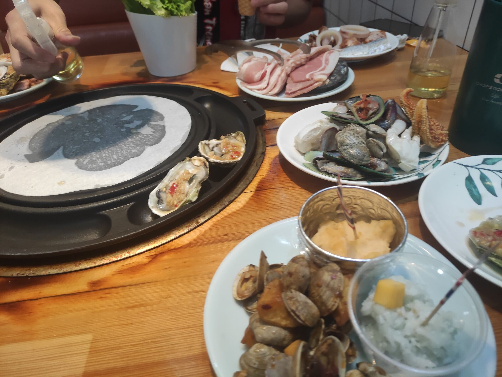
生蚝挺小，螃蟹够大，总之那几种海鲜都挺新鲜，皮皮虾也小，基本没肉，要说60块钱倒也划算，总之海鲜是推荐的，如果没恢复原价。
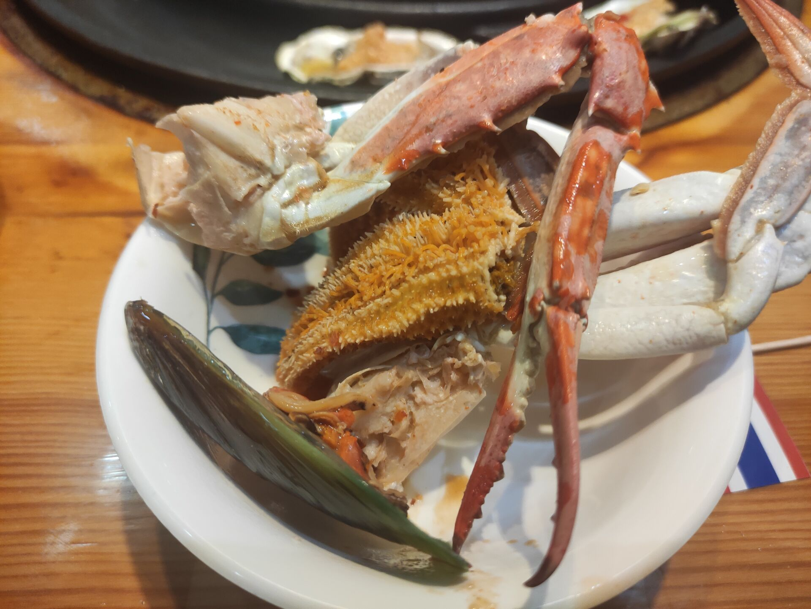
肉类就不说了，五花虽然不是合成，但是切的比较大，不太好吃；而且他这里很多腌过的肉都挺咸的，我当时吃了没多久就不想吃了。

酒水提供的也算一般般，有可乐雪碧什么的，其他就是常见的冒牌货了；水果也不多，大概三四种，不过吃还是挺好吃的，准备了沙拉可以自己拌。甜点也一般，就是抹茶蛋糕什么的，还提供了甜筒冰淇淋，不过一吃就知道很便宜那种，没什么味道。

总之60的海鲜自助算可以了，我现在吃下来还是觉得80块钱的吉布鲁最划算，酒水，甜点，熟菜种类都够，海鲜种类比这个多但是显然没这个好（吉布鲁甚至有刺身，见过有三文鱼的）。

## 匠和风（悠方店）
这家我馋好久了，多说一些。晚间自助288/人，到店消费办会员（不要钱也不用定额充值）可以打9折，可以预约。我当时要了个靠窗的位置，不过要脱鞋。服务员态度都很好，所以也倒不会尴尬。
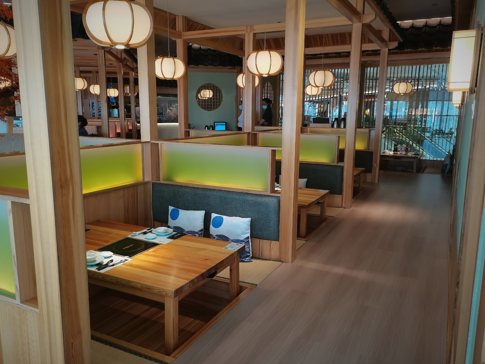
288一位值不值就看个人了，点单用平板，火锅可以选寿喜锅，其他就是刺身和熟菜，酒水，甜点。上来我先要了一份刺身拼盘，点单按只算，总的来说不会拖时间，上菜也齐，现在这些自助，这一点来说就挺不错了。
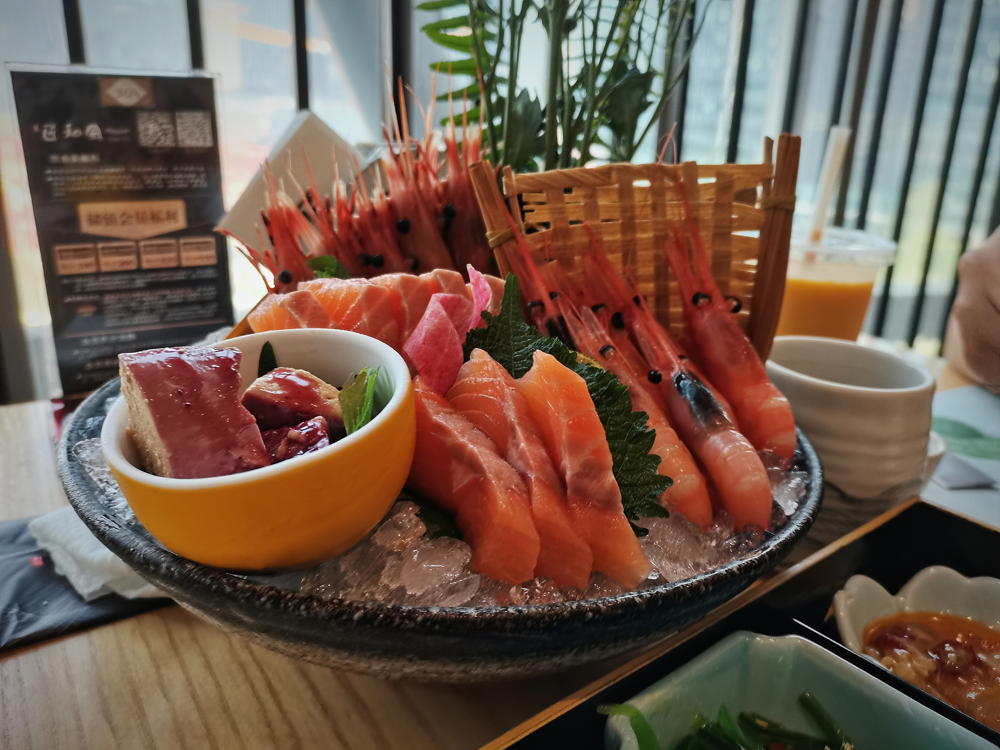
我要的鳌虾，甜虾，红酒鹅肝然后厚切三文鱼（我去的时候还有种刺身没有了，什么鱼腹来着），都没有腥味，很不错。不过我觉得鹅肝最好吃，有人说红酒酱放多了盖住了鹅肝香味，我倒觉得无所谓哈哈，鹅肝的口感真的一绝。

后面是要的火锅，素食就不说了，这个和牛特别好吃，我确实到这次才知道和牛这种差距，主要是口感上很不一样，属于吃进去就觉得好吃，另外还给了无菌蛋，寿喜锅出来很好吃，非常推荐。
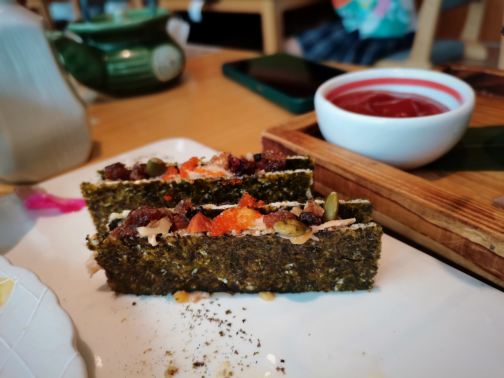
这个忘记叫什么了，外面海苔饼干我觉得一般，里面是冰淇淋混着鱼籽，虾肉什么的，吃起来感觉冰淇淋的甜味太大了，盖住了其他味道。另外就是这个太容易吃饱了。
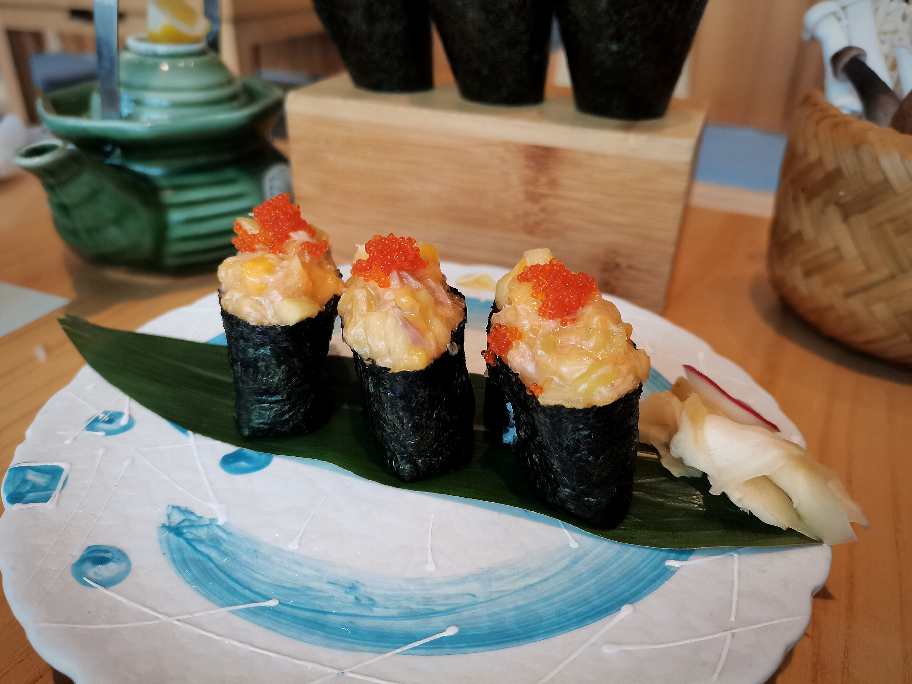
这个就是正常的军舰寿司，上面是刺身，鱼籽，水果，出品算不错。

蒲烧鳗鱼，非常好吃，鱼皮香软，鱼肉有蒲叶的清香，酱汁又很好地进行调味，是我比较喜欢的菜。
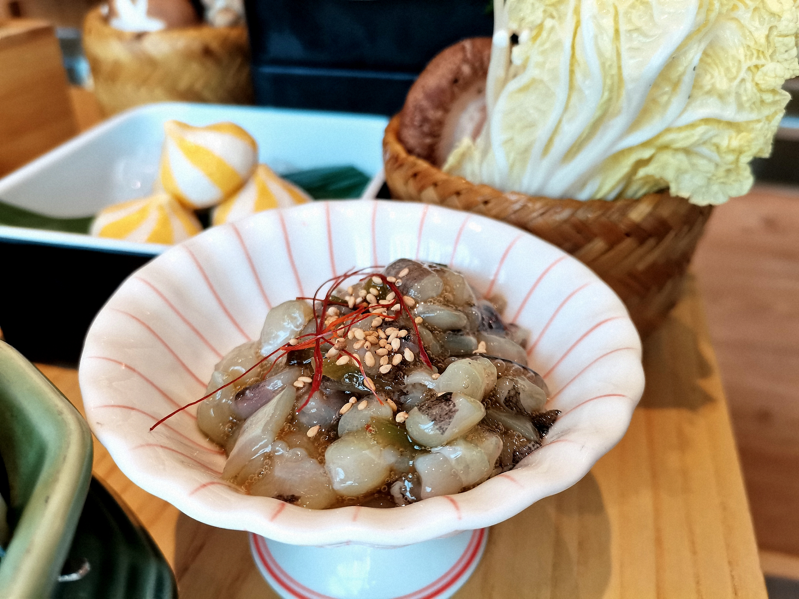
最后是我最不能接受的菜，这个芥末章鱼。我估计一般人都接受不了，章鱼是刺身，虽然切小了但是真的好硬啊，嚼不动，而且芥末有点多，吃起来那叫一个难受。

酒水什么的就不说了，对得起这个价格，清酒我看人家说算比较好的了，这方面我就不是很清楚。如果你要更好的酒可以加钱买。甜点也很不错，中看也中吃，有做奶茶，水果茶什么的。

最后这家还是推荐的，就是价格略贵，同一家公司开的还有花潮日料自助，这两家应该在成都挺出名的了，花潮主打高端，还有海胆什么的，这家是没有的。如果没有吃过可以试试，两个小时用餐时间，最后一次加餐会有服务员来问你，时间还是够了，毕竟上菜不会拖。那天有些菜品没有了挺可惜，期待下次再去。

## 吉布鲁海鲜自助
这家就很多店了，性价比很不错，83/人，在自助里不算最便宜那档，不过他这个规模倒也说得过去。
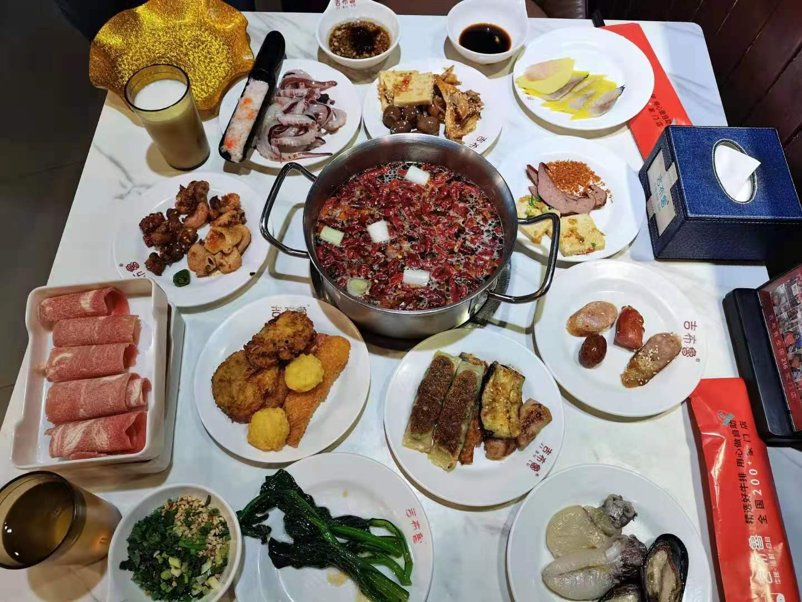
特别好吃的其实说不上，对比上面一家就知道了，他这里我觉得还是胜在菜品多，想吃的基本都有，并且酒水都有好好提供，甜点也都还可以，如果不知道想吃什么的话去这里还是不错的。

## 飞火令·西昌火盆自助烤肉
这家也还行，会员68/人，特点是肉类不错，但是菜品少，酒水一般。
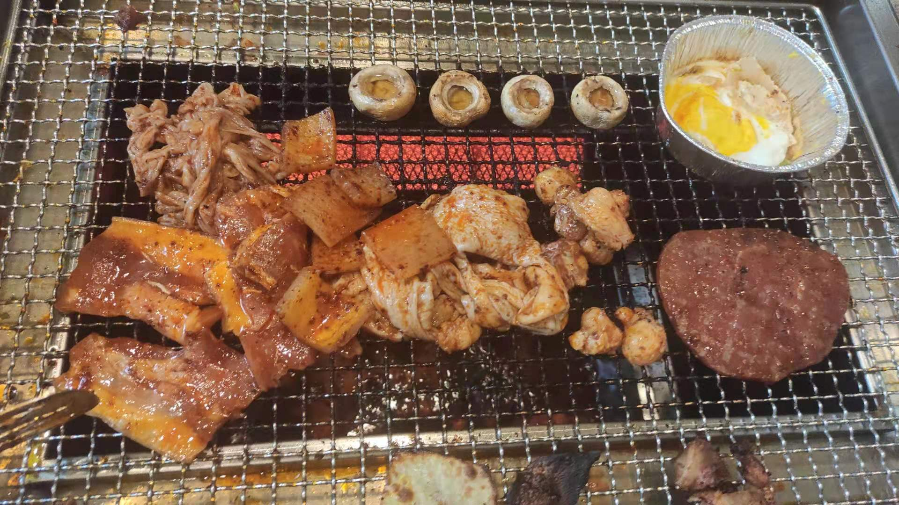
我有段时间吃烤肉太多了，所以印象就不是很好，店里的服务员有空会帮你烤，算是好吃吧，不过谈不上多享受，店比较小（郫都），有生蚝和扇贝。

# 家常菜/炒菜/单点
## 御柴源北京烤鸭
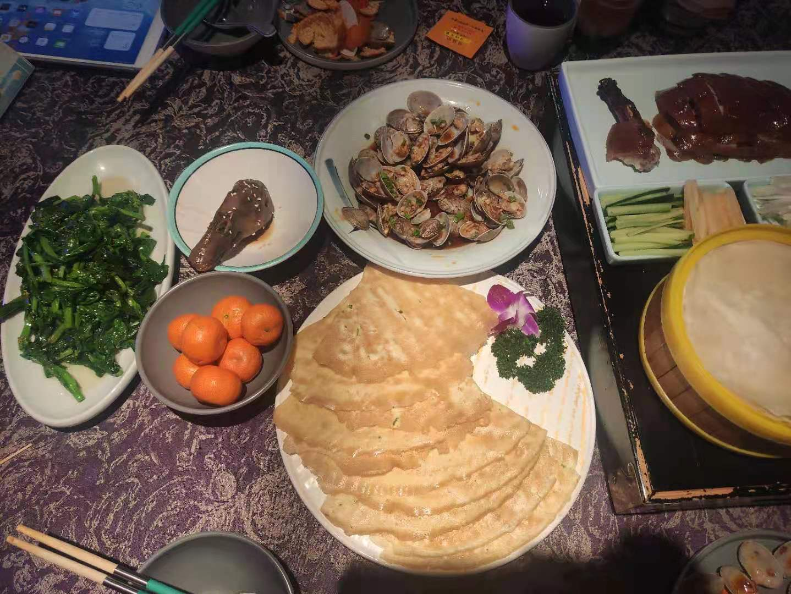
这家我印象也很不错，环境很好，当时要了一个套餐加一个番茄鸡蛋汤，上面都是套餐里的，烤鸭挺好吃，我这个估计只切了半只，两个人吃还是勉勉强强。人均60，请客吃饭的话这里很好，当时有很多桌在谈事情，不过都有包厢。

# 干锅
## 盐都干锅王
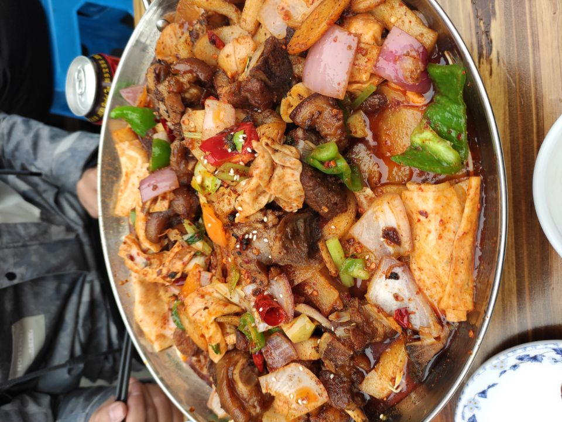
电子科大清水河南门对面的小巷子走到转角，这家专买干锅，生意很不错，基本每次去都快满了，他家有烤鸭干锅（图里这个就是），还算好吃，价格大概在40/人，因为在学校附近所以平时对付一下还是挺不错的，其他没啥好说的。

# 冒菜

# 套饭
## 吉野家
这家不用多说了吧，价格偏贵一点，大概30/人，随便对付一下还可以，算比较好吃的。
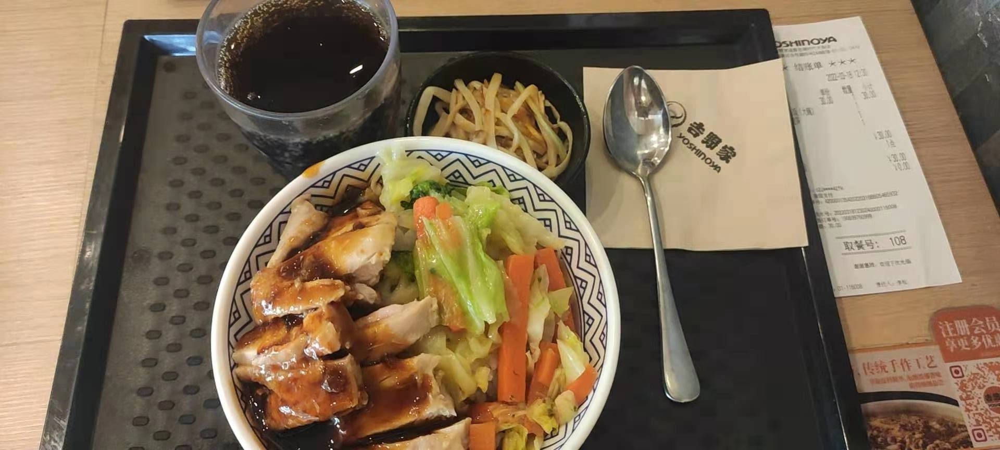
标配就是肉+蔬菜+咸菜+饮料（可以自选）

# 烧烤
成都这边我还没吃过好吃的，晚上要回学校一般只能在学校附近找，又找不到好吃的碳烤，电烤跟炸的就不说了，根本不好吃。还是云南的烧烤得劲。
# 小吃
## 宽窄巷子
第一天来成都逛的地方，属于是外地人必去了。小吃属于都还可以但是没有什么特色，并且价格很贵，人也挺多的。
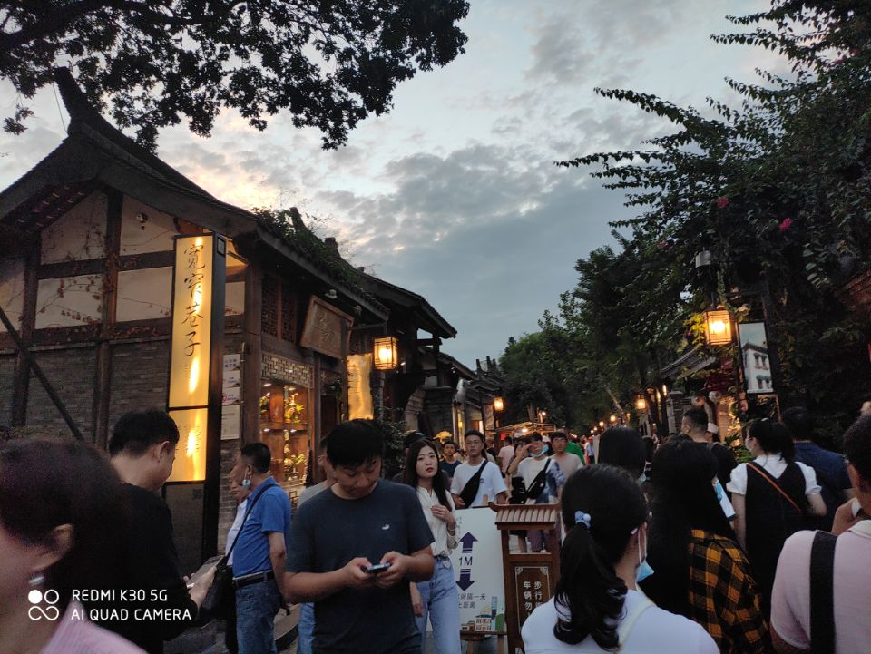
有些东西没拍照，我就留了三张照片。
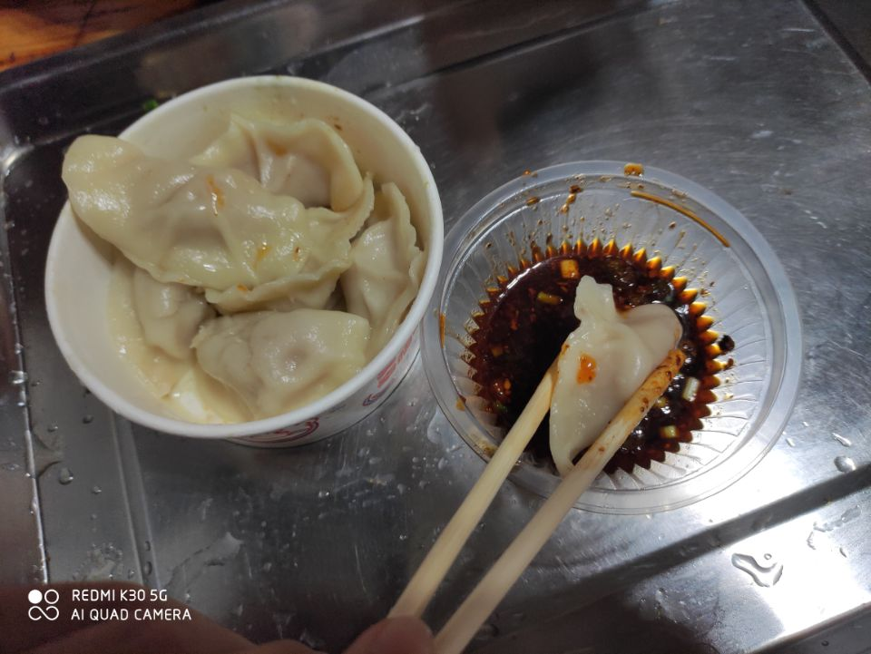
当时挺饿的，进去想找点面之类的吃，然后就找到这个买饺子的店，这一小份钟水饺好像二三十，味道也算正常，没啥好说的。
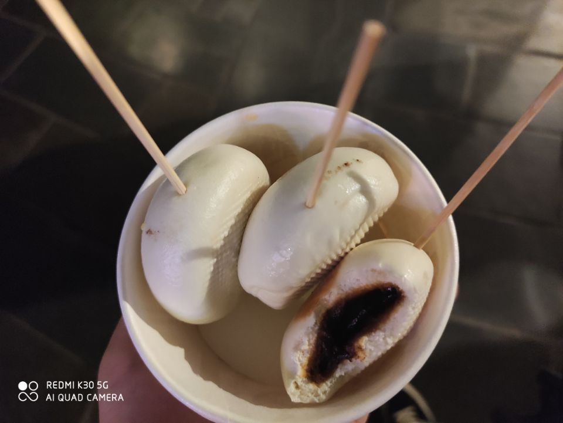
这玩意忘了叫什么了，什么包来着，还算便宜，五块钱三个，就是太硬了，里面的馅是豆沙，挺好吃的，外面的面皮我都有点咬不动说实话。
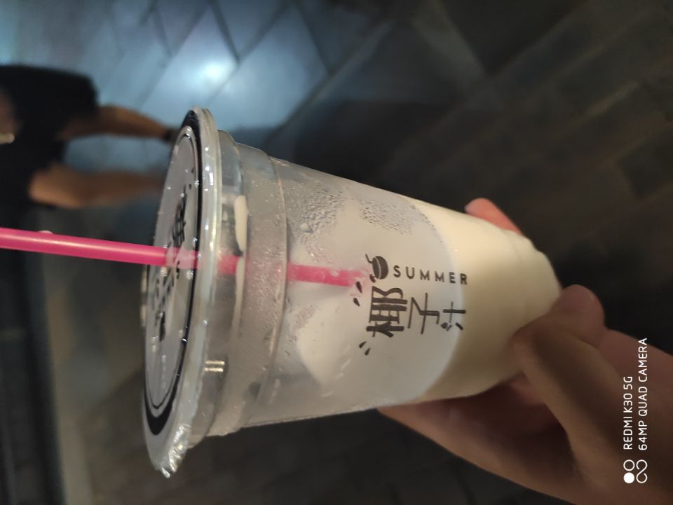
然后一杯普普通通的椰子汁，兑水不少，糖也不少，不如说糖水算了，15一杯。
总之宽窄巷子逛逛挺好的，虽然都是按旅游区装修，可毕竟没去过。以后估计也不大可能去哈哈。

## 建设路
这也是挺多人推荐的，我没全部吃过来，路口有一家买烤五花的特别多人，基本每次去都能看到在排长队。
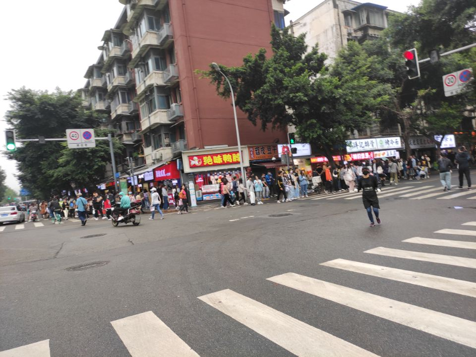
暂时没吃到很难吃的，这些店都不错，然后单份小吃价格基本都在10-20块钱，分量都还可以，我一般吃三份就差不多了，所以说比较适合那种到外面玩中午想将就一下的。
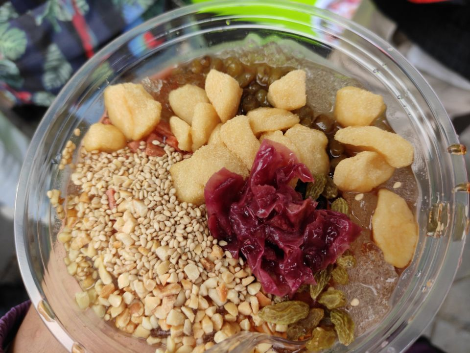
这份八块好像，料很足，尤其是糍粑很好吃，我还挺喜欢的，也是在靠近拐角的地方，叫阿姨冰粉还是什么来着。

照片没留很多，下次去有机会再拍。