# 前言
games101是由闫令琪老师讲解的计算机图形学入门课程，主要涉及光栅化、图形学几何、光线追踪和路径追踪，以及动画模拟四部分。本人在学习完成后再完成作业，结合自己理解，不完全与games101重合，因此博客系列将以课程发布的七个作业为例作为课程的学习总结笔记，会给出作业中需要修改部分的代码，以及基本原理分析。
完整项目在课程主页上，需要修改的函数在博客中已经给出，仅供参考交流，更多内容请访问[课程主页](https://sites.cs.ucsb.edu/~lingqi/teaching/games101.html)。
<!-- more -->
第一次作业主题是变换。在图形学中，要模拟真实感图形自然也要模拟真实世界中观察物体的方式，相当于摄像机记录场景的过程。因此整个作业会涉及到光栅化方法的实时渲染管线，利用一系列变换，将定义的物体从三维空间转换到二维图形，并且使用光栅化的方法将其表示在屏幕上。

先总结光栅化方法渲染管线中的变换，然后再分析作业；由于作业一并不需要设计其他内容，所以将在后面的博客中再总结完整的渲染管线。

# 光栅化方法渲染管线—变换
## 变换的作用
之前说渲染管线就是模拟摄像机成像的过程，但是这样理解当然是片面的，严格来说渲染管线从顶点开始处理，经过一系列变换生成三角形面，然后对三角形面进行光栅化，接着还要处理光栅化后的片元，进行着色，最后才映射到屏幕上。
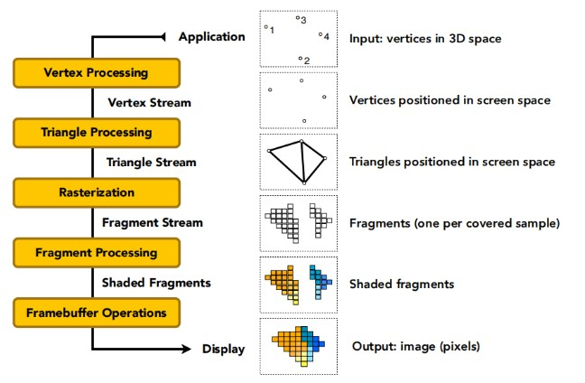
因此，模拟摄像机成像的过程仅仅是对顶点的一系列变换，其他内容将在对各个过程有所了解以后再总结。
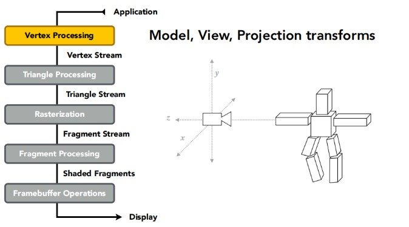

图形学中MVP变换就是基本的变换，M是对物体的Model变换，V是对摄像机的View变换，P是将三维映射到二维的Projection变换。不理解没关系，下面会详细说明他们的定义。

要介绍这几种变换，首先要介绍以下几个坐标系概念。
* *MODEL*首先是物体坐标系，或者说模型坐标系，这个坐标系用来给物体进行建模，定义复杂物体的各种几何属性；
* *WORLD*世界坐标系，建模完成的物体在世界坐标系中进行变换，从而移动到不同的位置和朝向；
* *VIEW*视图坐标系，将世界坐标系中的物体再进行视图变换，使其符合摄像机的观察(“符合”同样会在后面解释)；
* *PERSPECTIVE*裁剪坐标系，或者说透视坐标系，透视投影变换再次对物体进行处理，这时让整个可见空间的坐标范围缩放到标准的单位大小；
* *SCREEN*屏幕坐标系，透视投影已经让物体从三维变换到二维上了，所以可以根据屏幕大小再次缩放可见图形，在根据Z轴提供的深度关系，就完成了整个变换。

实际在图形学的过程中，并不会很严格地对这几个坐标系进行区分，而是以具体的变换操作为主，接下来就借助坐标系转换的过程，对MVP变换进行总结。

模型变换，就是将物体在世界坐标系中移动到合适位置和朝向的过程；视图变换则是将摄像机在世界坐标系中移动到合适位置和朝向的过程。在实际过程中，由于模型变换和视图变换具有可逆性，也就是对物体的变换可以视为对摄像机的逆变换，所以通常将这两部分变换放在一起进行，统称模型视图变换(OpenGL就是这么做的)。而且，总是将摄像机看作固定的，位置在坐标原点，朝向Z轴负方向，以Y轴正方向为向上方向(注意这里是右手坐标系)。要移动摄像机就相当于对物体做逆变换，这样就简化了模型视图变换，采用统一的变换方式就能让物体"符合"摄像机的观察方向，将世界坐标系和视图坐标系合二为一。另外，对模型几何的详细处理一般不在这里进行，只要知道模型的形状即可进行变换。

到这里我们已经定义了物体的位置、朝向以及摄像机的位置、朝向，但是像前面裁剪坐标系说的一样，要将一个三维场景渲染到二维平面上，还需要进行投影变换，并且进行规格化地缩放，才能方便将场景映射到屏幕坐标系上。而投影也有两种方法，称为正交投影和透视投影。

正交投影，不会改变物体的任何几何属性，平行的直线一定不会相交，类似我们平时说的三视图一样；而透视投影则更符合人的直觉，例如火车铁轨相交。后面总结原理之后，再详细描述一下投影的数学过程。

现在，我们可以总结一下为什么需要使用变换了，MVP变换对物体进行了移动、旋转、缩放，还有投影，实际上是很多变换的集合，实现MVP变换需要借助变换这个工具。

## 变换的数学过程
前面只介绍了变换的基本过程是什么，现在从数学的角度实际讲一讲什么是变换。首先数学上的对变换有严格的定义，先看我们需要的是什么变换，然后再进行数学计算。

### 线性变换
MV变换中，需要的是对物体移动到不同的位置和朝向，这通过平移和旋转就能完成；P变换中，还需要进行缩放。假设物体坐标是列优先存储的(x,y,z,1)，我们可以用矩阵的方式来表示这种变换：
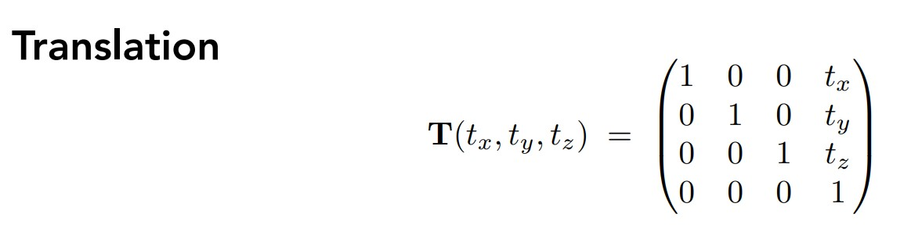
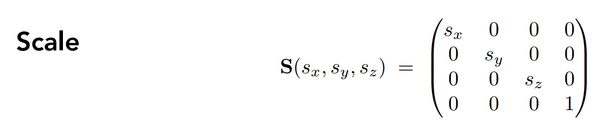
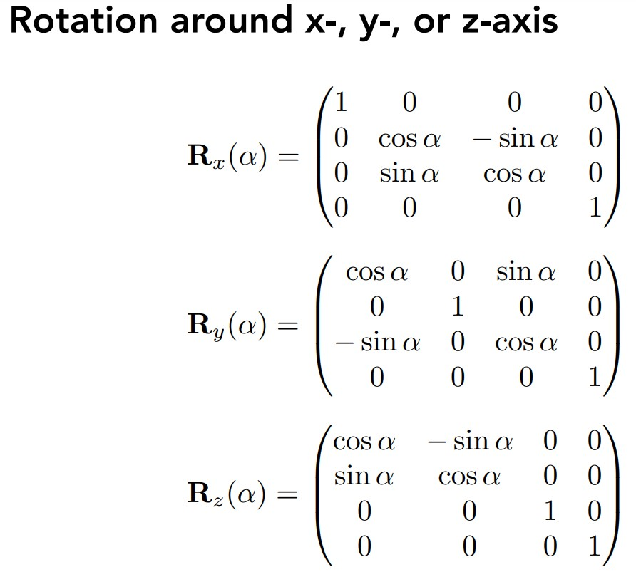
由于是列优先存储，将上面的矩阵对坐标进行左乘，就得到了变换后的坐标。详细推导不再赘述。

像旋转，缩放这种变换，统称为线性变换，投影也是线性变换，因为这些变换都保证变换以后向量保持加法和数乘运算，直观来说就是不会让图形发生中心的移动。也就是说，平移变换就不是严格的线性变换，不满足数学上的性质。但是在我们模型视图变换中也需要平移，把这种经过线性变换和平移变换的变换叫做仿射变换。

另外，由于是左乘的关系，最先生效的是最靠近坐标的变换矩阵，最简单可以试试先平移后旋转和先旋转后平移，效果是不一样的，要格外注意。也是因为这个原因，一般我们做变换都是按照缩放、旋转、平移的顺序，保证得到理想的结果，不必严格区分，清楚原理就行。

### 齐次坐标
你可能还注意到，上面的三维空间坐标，却总是用四维表示。这就是齐次坐标，用最后一维去表示一个向量的方向性，(x,y,z,0)表示一个向量，其他表示一个具体的点。当然齐次坐标并不仅仅有这一个用途，前面提到平移变换比较特殊，其实最根本的原因是用同一维度的矩阵没办法表示平移变换，必须要加上一个向量。因此我们加上一维，用多出来的维度表示平移变换，在上面的变换矩阵中也可以观察到，只有平移变换使用了第四维。

除此外，齐次坐标表示的平移变换还具有特殊的性质，点和点相加仍然是点，向量和向量相加仍然是向量，同时向量和点相加会得到一个点(相当于点朝向量方向平移)，点相减得到一个向量，这都是符合直觉的事情，原理就是坐标的第四维w不会变化。

### 投影
详解原理之前，先介绍视锥体的概念。在之前说的裁剪坐标系中，实际上我们是在世界坐标系中划定了一个用来投影的空间，也就是视锥体。视锥体有前后、上下、左右六个坐标。

另外，投影虽然是将三维转换为二维，但是这里仅仅是处理几何，输出一个视锥，等后面还要光栅化以后才能决定像素的颜色是什么。
#### 正交投影
正交投影的平截体就是一个长方体，它可能在任意一个地方，也可能是任意大小。所以正交投影很简单，将这个长方体移动到原点，然后缩放到单位大小。
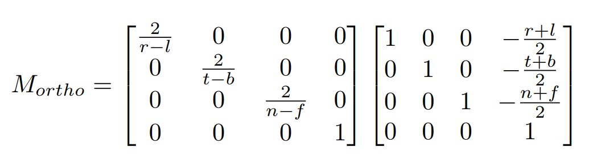
right,left,top,bottom,near,far就是长方体的各种坐标。先平移，后缩放。上面的式子结果如下：


### 透视投影
对于透视投影，做法是先将透视投影的视锥压成一个长方体，再按照正交投影的方法进行处理。之所以要说要"压"成长方体，是因为透视的视锥是一个四棱台。
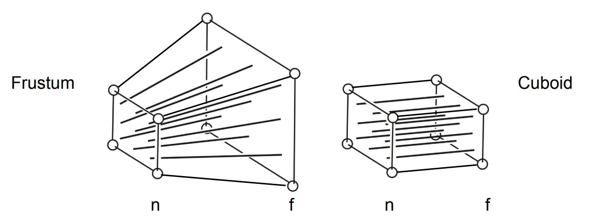
当然这样压缩以后得到的内容会变形，但是后面的光栅化过程会解决这个问题。

投影的原理实际上是从一个点延伸出一个四棱锥，然后通过near和far定义远近，形成视锥。
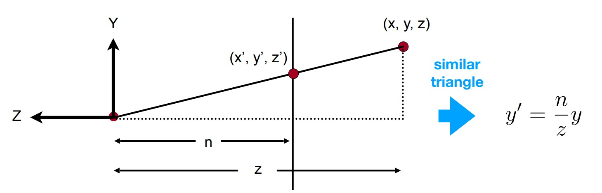
现在要挤压这个视锥，那么假设近平面的z为n，远平面的z为z，现在要将远平面的(x,y,z)挤压到和y'同样的高度，这样引申出一个对应关系，利用相似三角关系可以写出上面的对应关系。这里补充一点，因为我们这里讨论的Z坐标都是负的，所以有的地方会把这个相似关系右边加一个负号，保证值和原来一样，比较严谨，否则推出来就是齐次坐标的最后一个值正负不同，这里就先这样作为长度来推导。

同理，x也有一样的对应关系(从Y轴负方向观察)，因此建立了x和y的对应关系，但是z如何变化我们仍然不知道。
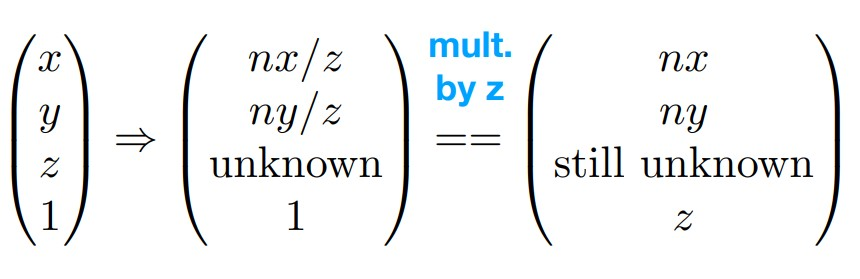
因此我们现在要找的问题就变成了上面的形式，什么样的矩阵可以将齐次坐标变成对应关系的结果。利用其次坐标，可以同时乘以z简化分母z。此时可以直接推出矩阵形式应该和下面一样：
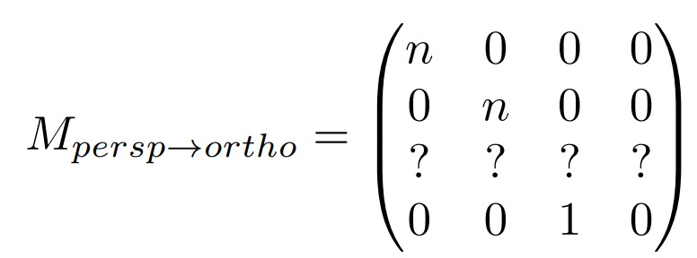
求解第三行是关键。不过还有另外两个条件可以利用，在最远平面上，他的z值是不会变化的，因为我们没有从z轴两边进行变换，同理在近平面上也会这样：
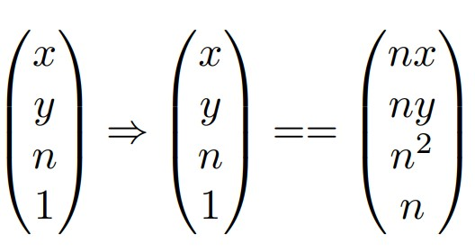
而且，第三行的前两项也一定为0.因为结果中没有出现x，y，综上可以推出两个额外的条件：
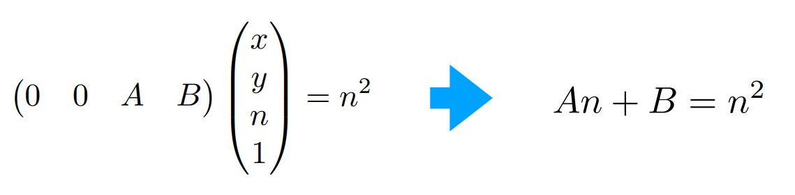
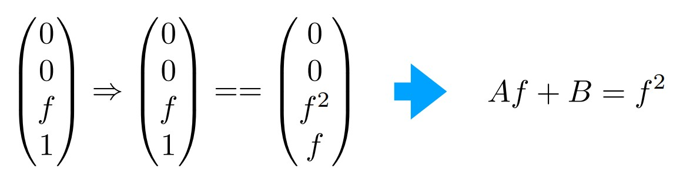
这样就解出AB：
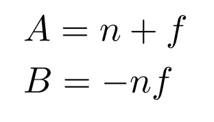
这样就得到了完整的"挤压矩阵"，所以先对视锥坐标左乘这个矩阵，然后再左乘正交投影的矩阵，就得到了透视投影后的标准空间，进行下一步光栅化。更详细的讲解在这篇[知乎](https://zhuanlan.zhihu.com/p/554093703)

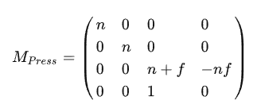

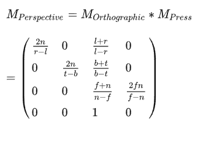

推导完成后，我们实际上要的反而是通过坐标计算，对于正交投影，这一步应该给出长方体的六个坐标，然后通过上面的正交投影矩阵计算；

对于透视投影则不同，还定义了一些量来进行进一步计算。
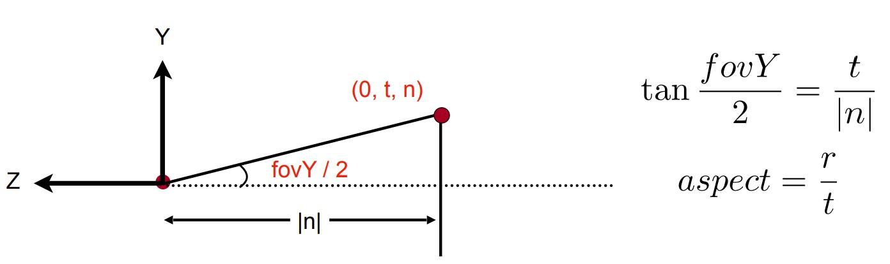
fov角(field of view)，定义了Y轴方向上的视野宽度，从透视点延伸的两条视锥边之夹角。另外是aspect比例，定义为某点对应的高度与宽度之比，对每个点应当是相同的，因为线性延伸并不会改变这个比例。

这样就比较清晰了，计算的时候给出fov角，Znear和Zfar，这时就已经确定了"挤压"矩阵；接着利用tan(fov/2)计算t，进一步根据aspect比例计算r，就完成了。至于l和b，如果移动透视点到原点，那么他们应该是对应坐标r和t的负数。如果没有移动到原点，需要根据透视点和原点的距离进一步计算。

# 作业1
理解上述变换原理后，作业1还是比较简单的。代码构建了一个基于CPU的光栅化渲染器，其中三角形的光栅化已经写好，要求填写的只有两个矩阵：绕Z轴旋转矩阵和透视投影矩阵。main函数中，按下ESC退出程序，按下a增加旋转角度，按下d减小旋转角度，渲染对象是一个三角形，坐标也已经确定。
## 旋转矩阵
前面已经有了Z轴旋转的矩阵形式，函数输入是一个角度，要转化成弧度才能用数学库计算。下面是矩阵代码：
```
Eigen::Matrix4f get_model_matrix(float rotation_angle)
{
    Eigen::Matrix4f model;
    rotation_angle = rotation_angle * PI / 180;
    model << cosf(rotation_angle), -sinf(rotation_angle), 0, 0,
        sinf(rotation_angle), cosf(rotation_angle), 0, 0,
        0, 0, 1, 0,
        0, 0, 0, 1;
    return model;
}
```
## 透视投影矩阵
透视投影矩阵是"挤压"矩阵和正交投影矩阵的乘积，正交投影矩阵又是平移和旋转矩阵的乘积。所以任务就是计算三个矩阵，计算方法和上面是一样的，将结果返回即可。
```
Eigen::Matrix4f get_projection_matrix(float eye_fov, float aspect_ratio,
    float zNear, float zFar)
{
    // Students will implement this function
    Eigen::Matrix4f projection = Eigen::Matrix4f::Identity();
    Eigen::Matrix4f M_p_o, M_scale, M_translate;
    //计算视锥
    float top, bottom, left, right, near, far, fovY;
    fovY = eye_fov / 180 * PI;

    near = -zNear;
    far = zFar;

    top = tan(fovY / 2) * zNear;
    bottom = -top;

    right = top * aspect_ratio;
    left = -right;

    //计算矩阵
    M_scale << 2 / (right - left), 0, 0, 0,
        0, 2 / (top - bottom), 0, 0,
        0, 0, 2 / (near - far), 0,
        0, 0, 0, 1;

    M_translate << 
        1, 0, 0, -(right + left) / 2,//==0
        0, 1, 0, -(top + bottom) / 2,//==0
        0, 0, 1, -(near + far) / 2,//!=0
        0, 0, 0, 1;

    M_p_o << near, 0, 0, 0,
        0, near, 0, 0,
        0, 0, near + far, -near * far,
        0, 0, 1, 0;
    
    projection = M_scale * M_translate * M_p_o * projection;
    return projection;
}
```

## 绕任意轴旋转的矩阵
罗德里格公式就是用来求解绕任意轴旋转的，现在假设要将向量v绕过原点的轴K旋转θ角度。
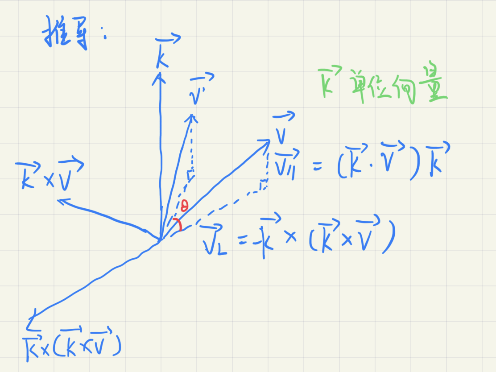
由轴K和待旋转的向量v，可以确定一个平面，因此有过原点并垂直该平面的方向向量，也就是K方向向量和v的叉积，再通过右手坐标系得到三个相互垂直的向量如图，从而建立一个"歪斜"的坐标系。

建立坐标系的意义在于能够将待旋转向量分解成两个方位角，而且已经知道旋转后的向量的一个方位角没有变化，也就是K轴上的方位角不用求解了，只需要解得另一个方位角，矢量相加以后就得到了结果。v的分解如图所示，Vl就是会发生改变的那个方向角。

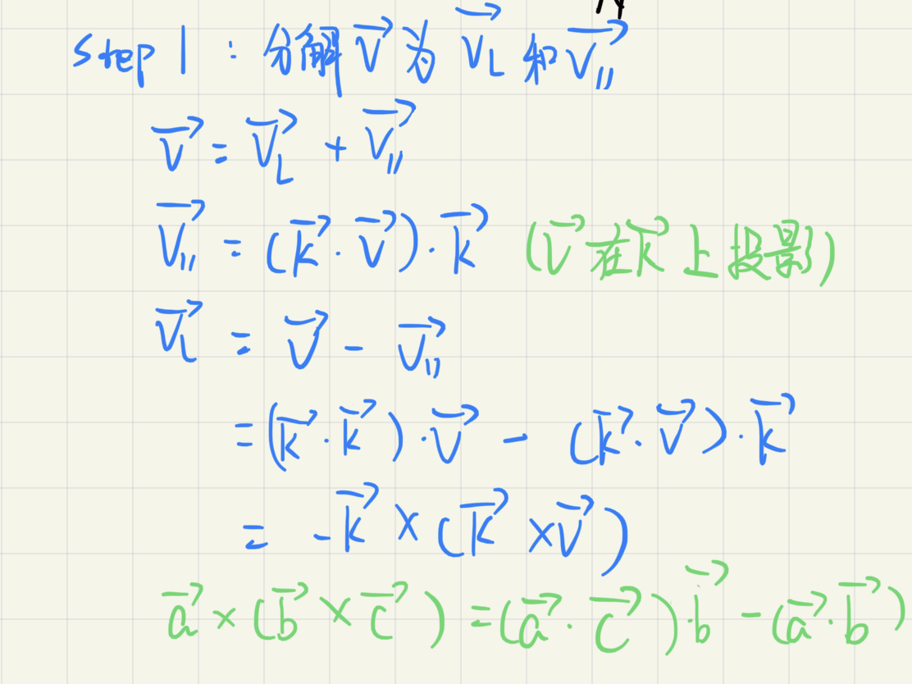

而Vl旋转以后，模不会改变，同样分解到方位角，通过旋转的角度推出Vl的变换。


现在将两个方位角相加，得到最后的结果。


到这里已经能求出结果了，不过我们因为要得到旋转矩阵形式，所以要进一步化简。

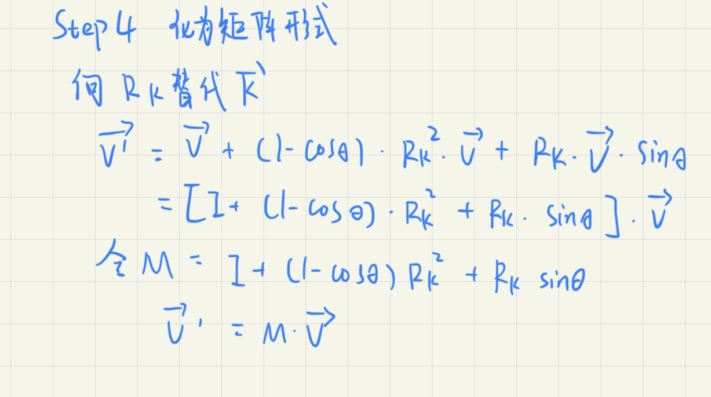

到这里，M就是要求的旋转矩阵了，可以看到Rk代表的就是K轴上的单位向量，θ则是旋转角度。代码上要实现的也就很简单了，不过要注意上图中虽然都是点乘，实际上是为了表示矩阵运算，Rk要写成叉乘矩阵(数学上实际叫做对偶矩阵)的形式。

```
Eigen::Matrix3f get_rotation(Vector3f K, float theta)
{
    theta = theta * PI / 180;
    Eigen::Matrix3f I = Eigen::Matrix3f::Identity();
    K = K.normalized();
    Eigen::Matrix3f K_dual;
    K_dual << 0, -K.z(), K.y(),
        K.z(), 0, -K.x(),
        -K.y(), K.x(), 0;
    
    return (I + (1 - cos(theta)) * K_dual * K_dual + K_dual * sin(theta))
}
```

返回以后的矩阵是三维的，要实际使用还要用齐次坐标扩展，第四维就是(0, 0, 0, 1)。