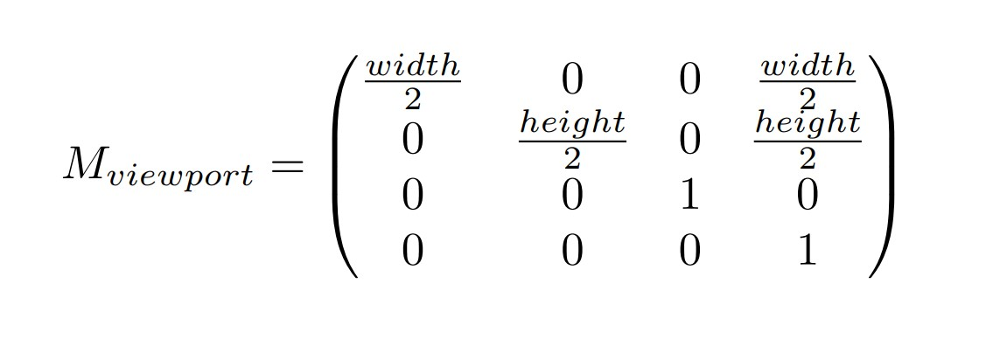
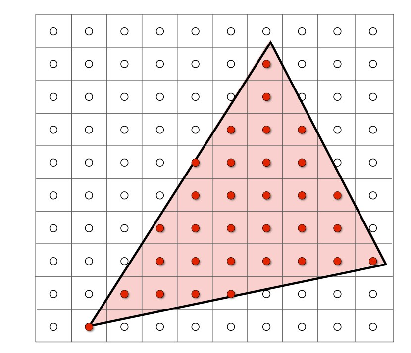
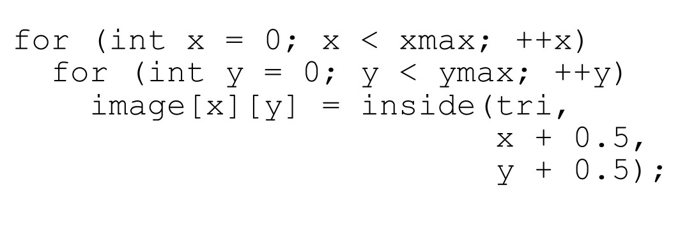
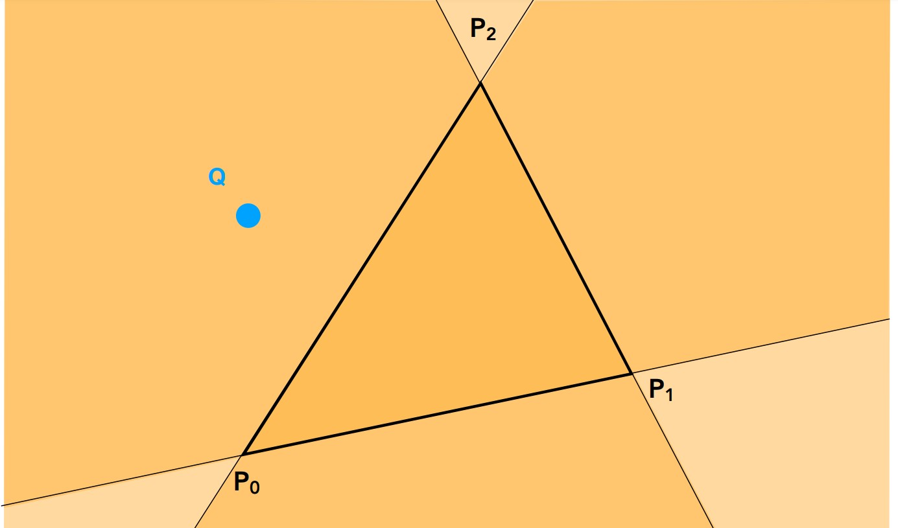
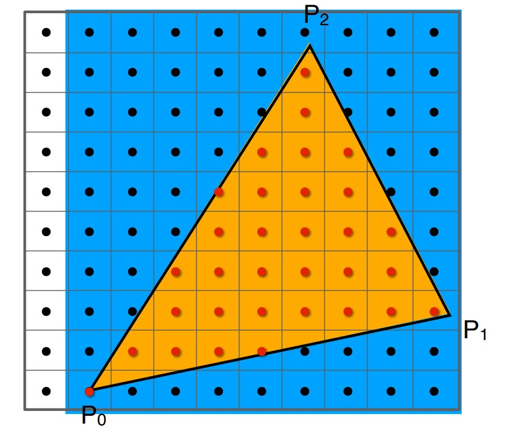
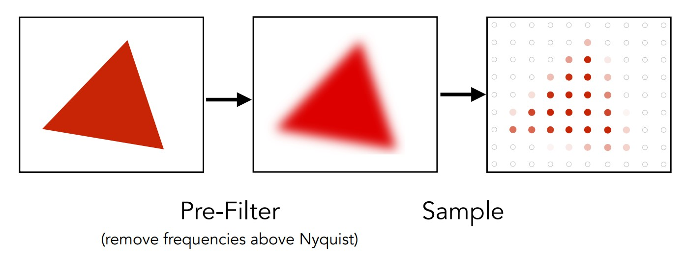
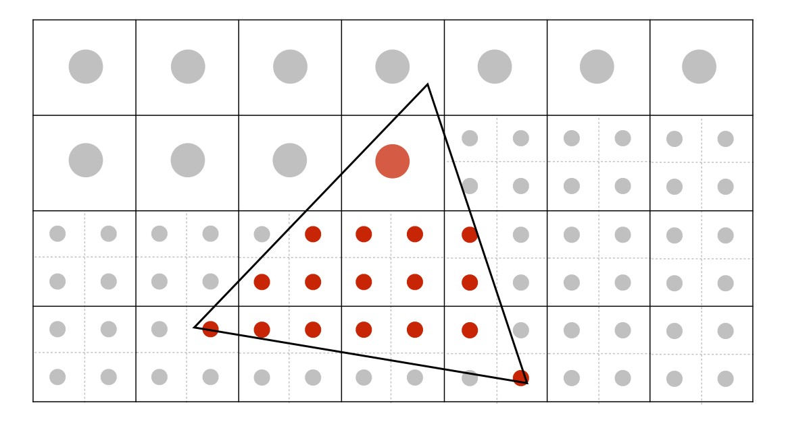
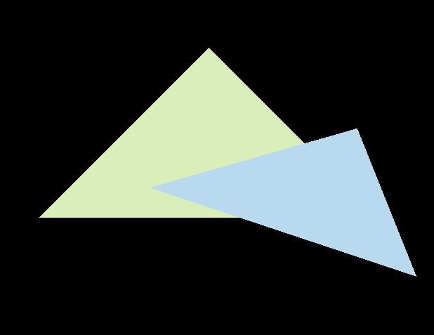
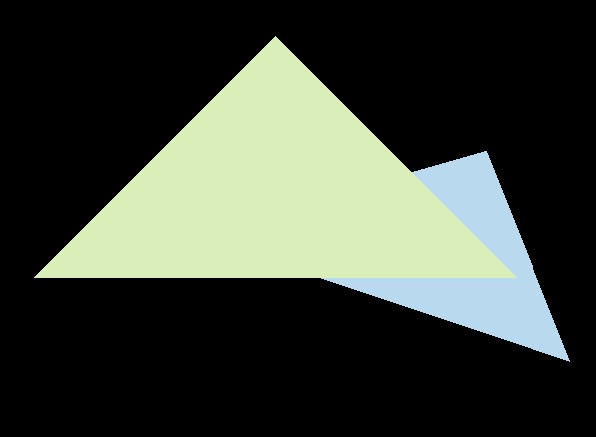
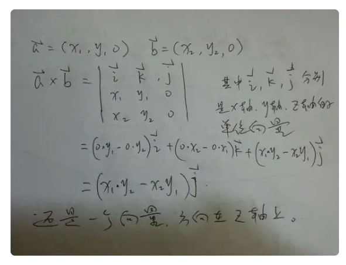

# 前言
前面说到，在渲染管线中顶点流首先经过MVP变换，得到一个标准立方体(canonical cubic)，但是显然不能将这个立方体直接显示到屏幕上，而是要将这个立方体压到屏幕上，从而给每个像素赋值，这一步就是光栅化。当然，将立方体压到屏幕上这个过程显然是在对Z轴上的坐标进行处理，在这之前还需要先处理一下X，Y轴坐标，这就是视口矩阵的作用。
<!-- more -->
现在我们先介绍视口矩阵，然后再关注三角形的光栅化。

# 视口矩阵
标准立方体是通过某种投影，将顶点坐标变换到标准立方体空间中得到的结果，这个立方体包含了所有我们需要表示的物体。而现在要处理各个物体的XYZ坐标，符合屏幕大小，并且还要通过某种方式来做出物体遮挡的效果。直观地来想，调整到屏幕大小应该是在XY轴上处理，遮挡应该是在Z轴上处理，所以先处理XY轴，通过视口矩阵让XY坐标放大，计算出屏幕坐标，再思考如何处理Z轴。

上一节求出的标准立方体，坐标范围都在[-1,1]之间，实际上视口矩阵的处理也很简单，因为屏幕坐标规定的范围分别是[0,width]和[0,height]，所以想到之前的线性变换，只需要一个平移和一个缩放，也就是一次仿射变换，就能得到需要的屏幕坐标了。

首先对坐标进行一次缩放，标准立方体的X，Y轴长度都是2，等比例放大到width和height，也就是变成原来的width/2和height/2倍，接着都向正方向平移一半的长度，就将起始位置变换到(0,0)。


现在可以总结一下顶点坐标的变换了，一个物体的顶点流，先经过(MVP变换)模型视图变换，投影变换，得到标准立方体(canonical cubic)，然后还要经过视口变换，将裁剪坐标系中的XY坐标变换到屏幕坐标系，与Z坐标进入光栅化过程。

# 光栅化
光栅化的真正原因是受限于硬件的像素排布，我们会给每个像素计算一个颜色用于显示，而每个像素显示怎样的颜色，才是要解决的问题。

这时就需要用到前面的处理的坐标了，通过采样的方式，我们判断每个像素在什么物体的面上，根据物体的颜色给像素赋值，建立一种映射关系。下图是2D平面的三角形光栅化例子。

显然，判断一个像素点是否在这个三角形内部是非常必要的。下面的算法假设像素大小为1*1，平面最左下角坐标为(0,0)。


## 判断点在三角形内部
这里使用的方法是判断向量叉积，只要一个点在三角形内部，那么从三个顶点到该点连线的向量，与顺序连接三个顶点得到的边向量，他们分别的乘积，一定是同号的。否则，一定会有异号的结果。

如图顺时针连接P0，P1，P2，得到向量P0P1，P1P2，P2P0，同时连接指向Q点的三个向量P0Q，P1Q，P2Q，计算叉积P0P1与P0Q>0，P1P2与P1Q>0，P2P0与P2Q<0，因此判断Q在三角形外部。

## bouding box
为了减少需要计算的像素点，采用包围盒是很有用的措施，利用三角形三个顶点可以求出一个包围三角形的长方体如下，只需要计算包围盒中的像素即可，因为包围盒外部的像素不可能在三角形中。



## 抗锯齿
锯齿的产生是因为采样率低(低分辨率)导致的信号混叠，详细原理涉及频域和时域的傅里叶变换，这部分可以看课程理解，不理解也可以直观感受抗锯齿或者反走样的做法。

前面光栅化得到的三角形与实际看到的三角形差别很大，就是因为锯齿的存在。而反走样也有一些方法，最简单的是低通滤波器，用这个卷积核将图形中的高通滤波过滤，就得到模糊的样本，在一定程度上消除锯齿，使其同样变得模糊。


还有一个方法叫超采样(MSAA)，增加采样频率，将每个像素分成很多个像素采样，最后平均像素中子像素得到的结果。


当然还有很多反走样技术，稍后的作业2中会实现MSAA反走样，作为入门。

## 深度测试
现在来解决前面留下的Z轴坐标，物体的遮挡关系显然是要通过Z轴坐标来判断，离摄像机近的物体才能被显示到平面上，因此设计一个缓冲区，也就是Z—Buffer来判断，在之前遍历像素的过程中，如果发现了物体某个点有更靠近平面的Z值，就将这个对应像素的值更新为靠近平面的点的值。

# 作业2
作业2要实现一个三角形的光栅化过程，其中我们需要编写的是三角形bounding box求解的函数，以及判断三角形内部的Inside函数，当然还有深度测试即像素更新。

## 三角形光栅化函数
我们从基本的光栅化开始，要绘制的物体只有两个固定的三角形，所以要先设计函数求三角形的包围盒，然后遍历包围盒中的像素，进行深度测试，并更新深度缓存中的深度值和对应像素的颜色，最后得到正确的渲染结果。
```
void rst::rasterizer::rasterize_triangle(const Triangle& t) 
{
    auto v = t.toVector4();//返回顶点的齐次坐标形式
    
    // TODO : Find out the bounding box of current triangle.
    int box_l, box_r, box_b, box_t;
    box_l = static_cast<int> (std::min(v[0].x(), std::min(v[1].x(), v[2].x())));
    box_r = static_cast<int> (std::max(v[0].x(), std::max(v[1].x(), v[2].x())));
    box_b = static_cast<int> (std::min(v[0].y(), std::min(v[1].y(), v[2].y())));
    box_t = static_cast<int> (std::max(v[0].y(), std::max(v[1].y(), v[2].y())));
    
    // iterate through the pixel and find if the current pixel is inside the triangle
    for (int i = box_l; i <= box_r; i++)
    {
        for (int j = box_b; j <= box_t; j++)
        {
            // If so, use the following code to get the interpolated z value.
            if (insideTriangle(i + 0.5, j + 0.5, t.v))
            {
                float alpha, beta, gamma;   
                std::tie(alpha, beta, gamma) = computeBarycentric2D(static_cast<float>(i + 0.5), static_cast<float>(j + 0.5), t.v);
                float w_reciprocal = 1.0 / (alpha / v[0].w() + beta / v[1].w() + gamma / v[2].w());
                float z_interpolated = alpha * v[0].z() / v[0].w() + beta * v[1].z() / v[1].w() + gamma * v[2].z() / v[2].w();
                z_interpolated *= w_reciprocal;

                if (depth_buf[get_index(i, j)] > -z_interpolated)
                {
                    // TODO : set the current pixel (use the set_pixel function) to the color of the triangle (use getColor function) if it should be painted.
                    depth_buf[get_index(i, j)] = -z_interpolated;

                    Eigen::Vector3f point;
                    point << static_cast<float>(i), static_cast<float>(j), -z_interpolated;
                    set_pixel(point, t.getColor());
                }
            }
        }
    }
}
```
求解包围盒很简单，找到三角形坐标的四个最值并记录，要记得转换为整型变量，因为像素是以1为单位长度的，就像课程中假设的那样。然后，直接根据这个坐标开始遍历，对象是用i为横坐标，j为纵坐标表示的像素，如果该像素在传入的三角形当中(使用下面编写的函数判断，而且所有坐标都转换到屏幕空间了)，那么先计算该坐标位置的深度插值(利用三角形重心坐标，只需要知道顶点就可以计算任意位置的深度值)，并比较当前深度缓存中该像素的深度，如果这个深度值小于当前深度缓存值，说明现在找到一个更靠近屏幕的点，应该优先显示，所以更新深度缓存的值，同时也更新该像素的颜色，就完成了一次遍历的过程。

值得说明的是，网上有博客指出Z值并没有反转，所以如果你直接使用原本的Z值，得到的结果正好与作业说明相反，是下面这个样子：

所以，要得到和他相同的结果，实际上需要手动将得到的Z轴插值取反，这就是上面负号的由来了。最终得到的效果是这样：

另外，如果将大于改成小于，而不改变符号，那么得到的是全黑的窗口，这显然是因为完全没有更新过，说明深度缓存的初始值是一个很大的正值。在代码中可以找到，clear函数中会将深度值赋值为正无穷Infinity。

现在再从上面的基础上实现2*2的MSAA抗锯齿。根据前面介绍的原理，现在修改一下像素个数和像素坐标，将原来的每个像素划分为四块即可，然后根据这四个子像素在三角形中的个数，然后决定颜色的比例。
```
void rst::rasterizer::rasterize_triangle(const Triangle& t) 
{
    auto v = t.toVector4();//返回顶点的齐次坐标形式

    // TODO : Find out the bounding box of current triangle.
    int box_l, box_r, box_b, box_t;
    box_l = static_cast<int> (std::min(v[0].x(), std::min(v[1].x(), v[2].x())));
    box_r = static_cast<int> (std::max(v[0].x(), std::max(v[1].x(), v[2].x())));
    box_b = static_cast<int> (std::min(v[0].y(), std::min(v[1].y(), v[2].y())));
    box_t = static_cast<int> (std::max(v[0].y(), std::max(v[1].y(), v[2].y())));

    std::vector<Eigen::Vector2f> position{
        {0.25, 0.25},
        {0.75, 0.25},
        {0.25, 0.75},
        {0.75, 0.75}
    };

    // iterate through the pixel and find if the current pixel is inside the triangle
    for (int i = box_l; i <= box_r; i++)
    {
        for (int j = box_b; j <= box_t; j++)
        {
            int count = 0;
            for (int index = 0; index < 4; index++)
            {
                if(insideTriangle(position[index].x() + i, position[index].y() + j, t.v))
                    count++;
            }
            // If so, use the following code to get the interpolated z value.
            if (count > 0)
            {
                float alpha, beta, gamma;
                std::tie(alpha, beta, gamma) = computeBarycentric2D(static_cast<float>(i + 0.5), static_cast<float>(j + 0.5), t.v);
                float w_reciprocal = 1.0 / (alpha / v[0].w() + beta / v[1].w() + gamma / v[2].w());
                float z_interpolated = alpha * v[0].z() / v[0].w() + beta * v[1].z() / v[1].w() + gamma * v[2].z() / v[2].w();
                z_interpolated *= w_reciprocal;

                if (depth_buf[get_index(i, j)] > -z_interpolated)
                {
                    // TODO : set the current pixel (use the set_pixel function) to the color of the triangle (use getColor function) if it should be painted.
                    depth_buf[get_index(i, j)] = -z_interpolated;

                    Eigen::Vector3f point;
                    point << static_cast<float>(i), static_cast<float>(j), -z_interpolated;
                    set_pixel(point, t.getColor() * (count / 4.0));
                }
            }
        }
    }
}
```
可能采样数较少，这里看着还是不太明显。算法上改变的并不多，详细步骤是对每个像素计算子像素的四个坐标，只要有一个子像素在三角形中，就进入if更新，并且根据子像素在三角形中的比例调整颜色百分比，从而实现"模糊"的效果。


## 三角形内部函数
方法和前面介绍的一样，三个叉积符号判断是否在内部，这里选择的边向量是逆时针连接，那么根据右手定则，在内部时结果都为正，所以只要有一个结果为负数，就说明不在三角形内部。

这里注意作业的说明，将Z值做了反转，保证都是正值，也就是说本来框架中屏幕向里才是Z轴的负方向，屏幕向外是Z轴的正方向，所以前面判断叉积结果为正没有问题(根据右手定则拇指朝外)。而且两个二维向量的叉积，实际上是两个第三维为0的三维向量进行叉积，按照右手系标准确定方向，计算结果确定正负，所以直接通过数值判断也是正确的。


```
static bool insideTriangle(int x, int y, const Vector3f* _v)
{
    // TODO : Implement this function to check if the point (x, y) is inside the triangle represented by _v[0], _v[1], _v[2]
    Vector3f a, b, c;
    //只关注XY坐标，Z坐标为视为0
    a << _v[1].x() - _v[0].x(), _v[1].y() - _v[0].y(), 0;
    b << _v[2].x() - _v[1].x(), _v[2].y() - _v[1].y(), 0;
    c << _v[0].x() - _v[2].x(), _v[0].y() - _v[2].y(), 0;

    Vector3f d, e, f;
    d << x - _v[0].x(), y - _v[0].y(), 0;
    e << x - _v[1].x(), y - _v[1].y(), 0;
    f << x - _v[2].x(), y - _v[2].y(), 0;

    if (a.cross(d).z() < 0 || b.cross(e).z() < 0 || c.cross(f).z() < 0)
    {
        return false;
    }
    return true;
}
```
可能由于Eigen的cross函数只支持三维向量的计算，所以如果用二维向量，需要手动用公式进行计算，否则可能编译错误；使用三维向量，只需要将第三维设置成0即可。