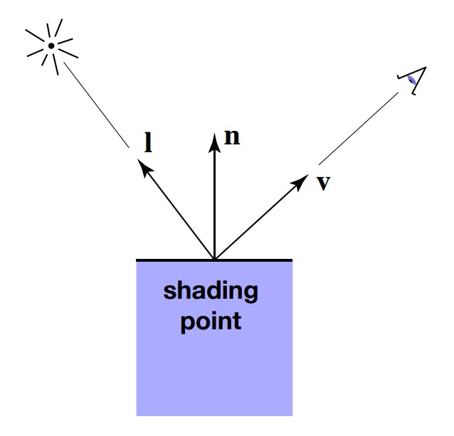
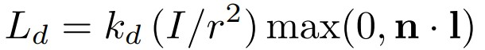
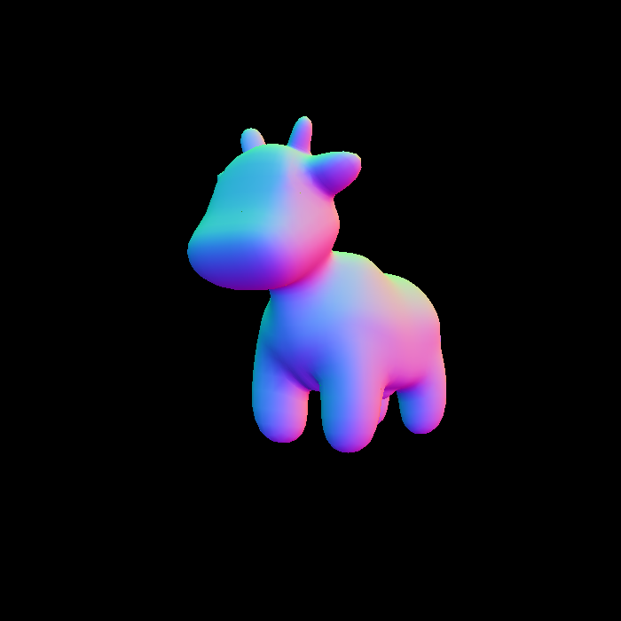

# 前言
前面两个作业内容以后，我们已经掌握了简单的几何变换以及光栅化过程，现在可以将一个物体和摄像机移动到任意位置，投影得到屏幕坐标，然后通过光栅化与深度测试，计算屏幕上每个像素的值，从而将物体显示到屏幕上。现在，我们再考虑一下真实感，显然颜色是我们忽略的，物体也没有什么阴影，在作业3中，我们使用纹理和光照模型，渲染一个obj对象。着色(Shading)，给每个像素一个确定的颜色表示，让物体显示出明暗特征；纹理，让物体表面呈现不同的性质(凹凸，颜色等)。之前的作业中，我们都是用的黑白颜色来表示物体。
<!-- more -->
现在，我们先介绍Blinn-Phong反射模型，这是一种简单的光照模型；然后再看看纹理技术的实现，最后在作业中将这些方法全部实现。

# Blinn—Phong Reflectance Model
通过观察光照下的一个光滑物体表面(下面的茶杯)，这种模型将物体上的光分为三种类。

* Specular highlights，镜面光，是物体上最亮的那部分高光；
* Diffuse reflection，漫反射光，是物体上渐变的那部分光，在面对光源的地方让物体显得比较明亮，背对光源的地方让物体显得比较暗淡；
* Ambient lighting，环境光，环境中其他物体反射到茶杯上的光；

通过这三种类型的光，就能简单地模拟光照情况。现在从数学角度介绍一下这几种光的计算方法。

## Diffuse reflection
显然，这种光出现的地方应该和物体与光源的角度有关。正对光源就应该比较亮，否则就比较暗。所以我们先定义几个方向向量，然后在此基础上具体计算。

l是从待着色点指向光源的单位向量，n是待着色点在物体表面的法线向量，b则是从待着色点指向摄像机的单位向量。初次之外，还做一种假设，一个点光源朝四面八方发出光线，能量会逐渐衰减，这里假设能量与离光源的距离的平方成反比。最后得到这样的式子，被称为Lambert's law：

其中 *Ld* 是待着色点光强，*Kd* 是漫反射系数，决定物体接受光照以后是什么颜色；*I* 表示点光源的能量，*r* 表示距离；最后一项决定光源以这种角度照射到着色点，会接受多少能量，且这个值不会为负数，否则后方照来的光线也会照亮待着色点。

漫反射光的位置与摄像机视角无关，只和光源与物体表面法线的夹角有关。

## Specular highlights
从直觉上感受，镜面光应该与摄像机视角有关了，从光学上解释，这部分光是光源的光线反射出来的，包含了大部分的能量，所以比较明亮。

通过反射，我们定义一个半程向量h，也就是向量l和v的角平分线向量。

之所以使用这个向量，是因为我们假设当观察视角和反射光方向比较接近的时候，看到的镜面光比较强；而这个时候，角平分线向量就应该比较接近法线向量，也就是直接比较法线向量n和这个半程向量就可以得出光照结果了，避免了反射光的复杂计算。

然后和漫反射相似，也定义一个镜面反射系数 *Ks*， 另外还引入一个容忍度 *p*。

由于后一项一定是在[0,1]之间的值，所以容忍度p越大，随着夹角变大，该项下降地就越快，镜面光就越暗，也就是容忍度与镜面光面积大小成反比。

## Ambient lighting
由于是环境光，所以从任何方向观察都应该没有变化，而且还不和光源有关系，换句话说这种光应该是常数项。

*Ka* 是环境光反射系数，*Ia*则是环境光强度。

## 总结
现在我们将三种光加起来，这就是Blinn-Phong反射模型的效果。不过要注意，这种光照模型是各向同性的，如果固定视角和光源，旋转物体，得到的效果完全一样，因此不适用于各向异性材质。


# 着色频率
## Flat Shading 平面着色
这种着色方式对每个三角形进行一次着色，每个面计算一个法线向量。


## Gouraud Shading 顶点着色
对每个顶点进行一次着色，以插值的方式计算所有点的颜色。

这样一来每个顶点都需要一个法线，使用每个顶点相邻面的法线和的平均值(例如加权和平均)。


## Phong Shading 像素着色
这种着色方式并不是前面提到的光照模型，对每个像素计算一个法线，方法就是先计算每个顶点的法线，然后利用重心坐标，求出三角形内部的所有像素的法线。


# 实时渲染管线


现在可以好好总结渲染管线了，首先我们定义一系列顶点，以及这些顶点的连接方式，从而构成一个物体。

然后对这些顶点流斤进行MVP变换，移动到我们想要的位置。确定以后，按照连接方式连接这些顶点，形成三角形流。

接着像素在许多三角形上进行采样，判断内部外部，生成片段流。这里的片段流指的是一个采样点覆盖的区域，例如一个像素采样一次就是一个片段，一个像素如果有四个子像素采样就是四个片段。

进行深度测试，用Z-Buffer判断不同片段的可见性。

完成后光照模型也在这里应用，依然对可见的片段流处理。通过插值求出片段流的法线向量。

纹理操作同样对片段进行处理，这部分后面再介绍。

根据处理对象的不同，各种计算也发生在不同的阶段，例如对顶点进行几何变换就是顶点处理阶段发生的，规定三角形法线自然也要到三角形处理阶段完成，反比后面计算顶点法线，甚至进行插值。当然不同的API有不同的渲染管线定义，大致和这个类似，也不用完全依照这个记忆，重在理解。

# 纹理映射
物体上如果通过手动指定的方式实现各种细节，需要的数据量是非常大的，所以采用纹理进行辅助，让物体上的一个点能够通过查询的方式找到它对应的属性，这个属性可以是颜色，也可以是几何特点，还可以是其他特征。

而纹理函数通常是二维的函数，定义纹理坐标(u,v)用来查询纹理上的值，纹理坐标又对应实际渲染像素(i,j)，通过某种方式将像素(或者说片段)的坐标映射到纹理坐标，查询需要的特征，就是纹理映射的过程。

## 像素放大
纹理分辨率过小，导致纹理映射的纹理坐标出现非整数值，所以需要将纹理放大。这里有三种放大纹理的方法，Nearst，Bilinear，Bicubic。

Nearst，根据纹理坐标取最近的整数值，即四舍五入，不过这样导致不同的纹理查询到相同的颜色。

Bilinear，双线性插值，在u，v方向上先选择一个方向进行线性插值，然后再使用插值结果在另外一个方向进行线性插值，就是双线性插值。

如图先选择水平u方向插值，得到u0和u1，然后用u1和u0的垂直v方向插值，得到目标点的颜色值。

Bicubic，和双线性插值类似，不过取16个相邻的纹理颜色而不是4个进行插值。

## 像素缩小
纹理分辨率过大，查询的时候一个像素可能对应多个纹理值，应该缩小纹理。提高采样频率可以解决，例如前面的MSAA，但是太耗费时间。

### MipMap
采用范围查询代替点查询，具体做法是使用Mipmap，不断对一个纹理进行区域平均(平均一定大小块的颜色值)。

但是怎么确定查询那个维度等级的MipMap呢？首先我们知道，维度每上升一次，纹理大小就缩小一倍，因此我们要找到这个缩放的比例，就先定义一个距离L，在一个像素查询纹理的同时，查询它相邻两个像素的纹理坐标，通过这三个纹理坐标计算L如下：

然后直接对L取对数，找到缩小多少倍，就得到维度D了。当然D可能不是整数，需要进一步处理。如果直接四舍五入，得到的纹理显然不连续。

#### 三线性插值
对于D不是正数的情况，当然还可以通过插值解决。在D的两个上下界维度的MipMap中，分别做双线性插值，找到两个对应的纹理特征，再用这两个特征在MipMap维度上插值。

通过这样的方式查新一个像素的纹理，整个图形得到的纹理特征就显然是连续的了。

### 各向异性
现在看看MipMap处理后的结果图形。

这是直接采样的结果。

通过上面的MipMap得到的结果，在远处的图形还是变得模糊了，这是因为MipMap处理的仅是正方形，前面进行距离L计算的时候，取像素邻居模拟的是一个正方形形状，但是有时候映射到纹理图上这个像素邻居组成的矩形并不是正方形，而是矩形或其他形状。而且，三线性插值本来也是一种近似处理，所以得到的结果显然没有那么精细。


解决的方法就是使用各向异性过滤，可以设置将MipMap在水平或竖直方向进行压缩，从而解决映射结果为水平矩形或者竖直矩形的问题。但是对于斜的矩形，仍然效果不好，可以使用EWA过滤解决，这里不再讨论。

## 应用

### 环境光贴图 Environment Map
用贴图记录各个方向的光照，表示环境光。

## 凹凸贴图 Bump Mapping
记录顶点法线的偏移，但是不改变物体原本的几何信息。查询到纹理坐标后，先求该坐标在凹凸曲线上的法线(通过导数)，然后再垂直并取单位值得到法线向量。图中h表示高度函数，C表示扰动程度。


三维的情况，先求其中两个方向的切线，然后同样垂直得到结果。


### 位移贴图 Displacement mapping
使用和凹凸贴图相同的原理，不过会使得顶点实际发生移动。凹凸贴图和位移贴图会在作业中实现。

###  程序化纹理 Procedural Noise&Procedural textures
定义一种噪声函数作为纹理来进行查询。

### 预计算着色 Precomputed Shading
纹理存储环境光遮蔽的信息，着色的时候使用其他着色结果与这个信息作用，得到结果。

### 3D Texture and Volume rendering
纹理是三维的，应用在体积渲染中。

# 作业3
作业3的内容比较多，在这次作业中实现了一个完整的渲染框架，包括前面的变换，以及这次的光照纹理，一共实现了五种渲染，使用法线作为颜色的Normal，使用Phong光照模型的Phong，应用了纹理的Texture，使用了凹凸贴图并且以法线作为颜色的Bump，最后应用了位移贴图的Displacement，要编写的就是这些shader，其中第一个shader已经给出。

## 投影矩阵
使用前面编写的函数即可。
```
Eigen::Matrix4f get_projection_matrix(float eye_fov, float aspect_ratio, float zNear, float zFar)
{
    // TODO: Use the same projection matrix from the previous assignments
    // Students will implement this function

    Eigen::Matrix4f projection = Eigen::Matrix4f::Identity();

    Eigen::Matrix4f M_p_o, M_scale, M_translate;

    //计算视锥
    float top, bottom, left, right, near, far, fovY;

    fovY = eye_fov / 180 * PI;

    near = -zNear;
    far = zFar;

    top = tan(fovY / 2) * zNear;
    bottom = -top;

    right = top * aspect_ratio;
    left = -right;


    //计算矩阵
    M_scale << 2 / (right - left), 0, 0, 0,
        0, 2 / (top - bottom), 0, 0,
        0, 0, 2 / (near - far), 0,
        0, 0, 0, 1;

    M_translate <<
        1, 0, 0, -(right + left) / 2,//==0
        0, 1, 0, -(top + bottom) / 2,//==0
        0, 0, 1, -(near + far) / 2,//!=0
        0, 0, 0, 1;

    M_p_o << near, 0, 0, 0,
        0, near, 0, 0,
        0, 0, near + far, -near * far,
        0, 0, 1, 0;

    projection = M_scale * M_translate * M_p_o * projection;
    return projection;
}
```

## Normal
第一个模型由于shader已经给出，现在反而要求是编写片段的各种插值量，修改第二次作业的光栅化函数。
```
//Screen space rasterization
void rst::rasterizer::rasterize_triangle(const Triangle& t, const std::array<Eigen::Vector3f, 3>& view_pos) 
{
    // TODO: From your HW3, get the triangle rasterization code.
    auto v = t.toVector4();//返回顶点的齐次坐标形式

    // TODO : Find out the bounding box of current triangle.
    int box_l, box_r, box_b, box_t;
    box_l = static_cast<int> (std::min(v[0].x(), std::min(v[1].x(), v[2].x())));
    box_r = static_cast<int> (std::max(v[0].x(), std::max(v[1].x(), v[2].x())));
    box_b = static_cast<int> (std::min(v[0].y(), std::min(v[1].y(), v[2].y())));
    box_t = static_cast<int> (std::max(v[0].y(), std::max(v[1].y(), v[2].y())));

    std::vector<Eigen::Vector2f> position{
        {0.25, 0.25},
        {0.75, 0.25},
        {0.25, 0.75},
        {0.75, 0.75}
    };

    // iterate through the pixel and find if the current pixel is inside the triangle
    for (int i = box_l; i <= box_r; i++)
    {
        for (int j = box_b; j <= box_t; j++)
        {
            int count = 0;
            for (int index = 0; index < 4; index++)
            {
                if (insideTriangle(position[index].x() + i, position[index].y() + j, t.v))
                    count++;
            }
            
            // If so, use the following code to get the interpolated z value.
            if (count > 0)
            {
                // TODO: Inside your rasterization loop:
                //    * v[i].w() is the vertex view space depth value z.
                //    * Z is interpolated view space depth for the current pixel
                //    * zp is depth between zNear and zFar, used for z-buffer
                float alpha, beta, gamma;
                std::tie(alpha, beta, gamma) = computeBarycentric2D(static_cast<float>(i + 0.5), static_cast<float>(j + 0.5), t.v);
                float Z = 1.0 / (alpha / v[0].w() + beta / v[1].w() + gamma / v[2].w());
                float zp = alpha * v[0].z() / v[0].w() + beta * v[1].z() / v[1].w() + gamma * v[2].z() / v[2].w();
                zp *= Z;

                if (depth_buf[get_index(i, j)] > -zp)
                {
                    // TODO : set the current pixel (use the set_pixel function) to the color of the triangle (use getColor function) if it should be painted.
                    depth_buf[get_index(i, j)] = -zp;

                    //插值求颜色，法线，纹理坐标，着色坐标
                    // TODO: Interpolate the attributes:
                    // auto interpolated_color
                    // auto interpolated_normal
                    // auto interpolated_texcoords
                    // auto interpolated_shadingcoords
                    auto interpolated_color = interpolate(alpha, beta, gamma, t.color[0], t.color[1], t.color[2], 1);
                    auto interpolated_normal = interpolate(alpha, beta, gamma, t.normal[0], t.normal[1], t.normal[2], 1).normalized();
                    auto interpolated_texcoords = interpolate(alpha, beta, gamma, t.tex_coords[0], t.tex_coords[1], t.tex_coords[2], 1);
                    auto interpolated_shadingcoords = interpolate(alpha, beta, gamma, view_pos[0], view_pos[1], view_pos[2], 1);
                    // Use: Instead of passing the triangle's color directly to the frame buffer, pass the color to the shaders first to get the final color;
                    fragment_shader_payload payload(interpolated_color, interpolated_normal.normalized(), interpolated_texcoords, texture ? &*texture : nullptr);
                    payload.view_pos = interpolated_shadingcoords;
                    auto pixel_color = fragment_shader(payload);

                    Eigen::Vector2i point;
                    point << i, j;
                    set_pixel(point, pixel_color * (count / 4.0));
                }
            }
        }
    }
}
```
修改一个是上面几项插值计算，颜色，法线，纹理坐标，着色坐标(着色器要用)，计算出重心坐标以后用函数即可。另外还有一个改动是set_pixel，作业二中传入的point三维坐标改成了二维，因为像素只用XY坐标。最后注释给出Z轴插值坐标计算，与作业二相比改了一下名字。
实际上必要的代码都给了，但是需要调整代码，不然写完这个函数以后用Normal着色器很可能会报错，多修改几次。



## Phong
现在开始，就可以正式编写shader了。首先看看给出的法线着色器例子，熟悉一下传入的参数是什么。
```
Eigen::Vector3f normal_fragment_shader(const fragment_shader_payload& payload)
{
    Eigen::Vector3f return_color = (payload.normal.head<3>().normalized() + Eigen::Vector3f(1.0f, 1.0f, 1.0f)) / 2.f;
    Eigen::Vector3f result;
    result << return_color.x() * 255, return_color.y() * 255, return_color.z() * 255;
    return result;
}
```
分析代码，payload包含了片段的颜色、法线，纹理坐标、顶点转换到视角坐标系中的坐标信息，这个着色器中将片段的法线坐标归一化后加上0.5，然后放大到255的颜色值，返回就构成了上面的颜色结果，还是比较好看的。

根据前面介绍的理论，Phong反射光照模型可以用一个公式表示片段颜色，框架中也给了模型中一些值的取值，要做的只是用这些值，在循环中分别计算不同的光照效果，然后相加。注意环境光由于不会改变，所以可以放在循环体外。
```
Eigen::Vector3f phong_fragment_shader(const fragment_shader_payload& payload)
{
    Eigen::Vector3f ka = Eigen::Vector3f(0.005, 0.005, 0.005);
    Eigen::Vector3f kd = payload.color;
    Eigen::Vector3f ks = Eigen::Vector3f(0.7937, 0.7937, 0.7937);

    auto l1 = light{{20, 20, 20}, {500, 500, 500}};
    auto l2 = light{{-20, 20, 0}, {500, 500, 500}};

    std::vector<light> lights = {l1, l2};
    Eigen::Vector3f amb_light_intensity{10, 10, 10};
    Eigen::Vector3f eye_pos{0, 0, 10};

    float p = 150;

    Eigen::Vector3f color = payload.color;
    Eigen::Vector3f point = payload.view_pos;
    Eigen::Vector3f normal = payload.normal;

    Eigen::Vector3f result_color = {0, 0, 0};
    for (auto& light : lights)
    {
        // TODO: For each light source in the code, calculate what the *ambient*, *diffuse*, and *specular* 
        // components are. Then, accumulate that result on the *result_color* object.

        Eigen::Vector3f l = (light.position - point).normalized();
        Eigen::Vector3f v = (eye_pos - point).normalized();
        Eigen::Vector3f h = (l + v).normalized();

        float r = (light.position - point).dot(light.position - point);
        //diffuse
        Eigen::Vector3f Ld = kd.cwiseProduct(light.intensity / r) * std::max(0.0f, normal.dot(l));
        //specular
        Eigen::Vector3f Ls = ks.cwiseProduct(light.intensity / r) * std::pow(std::max(0.0f, normal.dot(h)), p);
        result_color += Ls + Ld;
    }
    Eigen::Vector3f La = ka.cwiseProduct(amb_light_intensity);
    result_color += La;

    return result_color * 255.f;
}
```
首先规定了三种光的反射系数(反射光和总光能量的比例)，其中漫反射就是直接采用在前面插值计算出的颜色，作为物体表面的颜色。然后规定了两个光源，指定了位置和强度(对应RGB分量强度)，确定了摄像机位置，环境光颜色。然后再次规定了片段坐标point，片段法线normal，结合前面规定的光源位置和摄像机位置，还有物体在视点坐标系中的坐标，就可以用这个循环计算两个光源的效果了。

循环里面，计算理论部分定义的l，v，h向量判断光照情况，然后就是公式计算，得到结果颜色后仍然是归一化的结果，放大到255的颜色区间。这样，就完成了一个着色器，不过我看到网上有人说，将环境光计算放到循环里会导致画面变暗，应该是result_color加了两次环境光，环境光有比较暗的情况，导致归一化的结果也变暗了。完成后是下面这个样子。


## Texture
现在在上面光照模型的基础上，还要加上纹理的应用。原理就是修改光照模型的漫反射颜色，其他完全相同。
```
Eigen::Vector3f texture_fragment_shader(const fragment_shader_payload& payload)
{
    Eigen::Vector3f return_color = {0, 0, 0};
    if (payload.texture)
    {
        // TODO: Get the texture value at the texture coordinates of the current fragment
        return_color = payload.texture->getColor(payload.tex_coords.x(), payload.tex_coords.y());

    }
    Eigen::Vector3f texture_color;
    texture_color << return_color.x(), return_color.y(), return_color.z();

    Eigen::Vector3f ka = Eigen::Vector3f(0.005, 0.005, 0.005);
    Eigen::Vector3f kd = texture_color / 255.f;
    Eigen::Vector3f ks = Eigen::Vector3f(0.7937, 0.7937, 0.7937);

    auto l1 = light{{20, 20, 20}, {500, 500, 500}};
    auto l2 = light{{-20, 20, 0}, {500, 500, 500}};

    std::vector<light> lights = {l1, l2};
    Eigen::Vector3f amb_light_intensity{10, 10, 10};
    Eigen::Vector3f eye_pos{0, 0, 10};

    float p = 150;

    Eigen::Vector3f color = texture_color;
    Eigen::Vector3f point = payload.view_pos;
    Eigen::Vector3f normal = payload.normal;

    Eigen::Vector3f result_color = {0, 0, 0};

    for (auto& light : lights)
    {
        Eigen::Vector3f l = (light.position - point).normalized();
        Eigen::Vector3f v = (eye_pos - point).normalized();
        Eigen::Vector3f h = (l + v).normalized();

        float r = (light.position - point).dot(light.position - point);
        //diffuse
        Eigen::Vector3f Ld = kd.cwiseProduct(light.intensity / r) * std::max(0.0f, normal.dot(l));
        //specular
        Eigen::Vector3f Ls = ks.cwiseProduct(light.intensity / r) * std::pow(std::max(0.0f, normal.dot(h)), p);
        result_color += Ls + Ld;
    }
    Eigen::Vector3f La = ka.cwiseProduct(amb_light_intensity);
    result_color += La;

    return result_color * 255.f;
}
```
实际上，纹理坐标和纹理都已经给到片段的payload中了，而且方法也写好，向上面那样调用，会得到一个三维的颜色值，作为漫反射系数，然后进入Phong反射模型计算颜色即可。


## 凹凸贴图
知道纹理的基本用法，现在考虑一下凹凸贴图的原理，需要计算微分求切线，微分量取纹理宽度或高度的倒数，然后垂直得到法线向量。
```
Eigen::Vector3f bump_fragment_shader(const fragment_shader_payload& payload)
{
    
    Eigen::Vector3f ka = Eigen::Vector3f(0.005, 0.005, 0.005);
    Eigen::Vector3f kd = payload.color;
    Eigen::Vector3f ks = Eigen::Vector3f(0.7937, 0.7937, 0.7937);

    auto l1 = light{{20, 20, 20}, {500, 500, 500}};
    auto l2 = light{{-20, 20, 0}, {500, 500, 500}};

    std::vector<light> lights = {l1, l2};
    Eigen::Vector3f amb_light_intensity{10, 10, 10};
    Eigen::Vector3f eye_pos{0, 0, 10};

    float p = 150;

    Eigen::Vector3f color = payload.color; 
    Eigen::Vector3f point = payload.view_pos;
    Eigen::Vector3f normal = payload.normal;


    float kh = 0.2, kn = 0.1;

    // TODO: Implement bump mapping here
    // Let n = normal = (x, y, z)
    float x = normal.x();
    float y = normal.y();
    float z = normal.z();
    Vector3f t(x * y / sqrt(x * x + z * z), sqrt(x * x + z * z), z * y / sqrt(x * x + z * z));
    Vector3f b = normal.cross(t);
    Eigen::Matrix3f TBN;
    TBN << t.x(), b.x(), normal.x(),
        t.y(), b.y(), normal.y(),
        t.z(), b.z(), normal.z();
    //TBN矩阵的作用是将局部坐标转化成实际坐标表示

    float u = payload.tex_coords.x();
    float v = payload.tex_coords.y();
    float w = payload.texture->width;
    float h = payload.texture->height;

    //求u，v微分
    float dU = kh * kn * (payload.texture->getColor(u + 1 / w, v).norm() - payload.texture->getColor(u, v).norm());
    float dV = kh * kn * (payload.texture->getColor(u, v + 1 / h).norm() - payload.texture->getColor(u, v).norm());

    Vector3f ln(-dU, -dV, 1);

    
    Eigen::Vector3f result_color = (TBN * ln).normalized();

    return result_color * 255.f;
}

```
注释中写出了大部分伪代码，但是这里还是要说明，凹凸贴图的计算涉及到TBN矩阵和切空间，可以简单理解为把物体的三维坐标和纹理坐标连接起来，课程中只说了后面求局部坐标系中法线的方法，并且让局部坐标系中的法线都为(0,0,1)，这个局部空间实际上就是TBN空间，在u和v方向求切线后得到垂直的扰动法线，当然要将这个纹理空间中的法向量转化到片段所在的空间。所以TBN矩阵就是将局部坐标中的法向量变换到着色时的空间中了。

具体的计算可以找这部分知识推导，理解可以就这样。

## 位移贴图
在实现了凹凸贴图的基础上，对顶点做实际的移动。所以要添加的代码只有一行。
```
Eigen::Vector3f displacement_fragment_shader(const fragment_shader_payload& payload)
{
    
    Eigen::Vector3f ka = Eigen::Vector3f(0.005, 0.005, 0.005);
    Eigen::Vector3f kd = payload.color;
    Eigen::Vector3f ks = Eigen::Vector3f(0.7937, 0.7937, 0.7937);

    auto l1 = light{{20, 20, 20}, {500, 500, 500}};
    auto l2 = light{{-20, 20, 0}, {500, 500, 500}};

    std::vector<light> lights = {l1, l2};
    Eigen::Vector3f amb_light_intensity{10, 10, 10};
    Eigen::Vector3f eye_pos{0, 0, 10};

    float p = 150;

    Eigen::Vector3f color = payload.color; 
    Eigen::Vector3f point = payload.view_pos;
    Eigen::Vector3f normal = payload.normal;

    float kh = 0.2, kn = 0.1;
    
    // TODO: Implement displacement mapping here
    float x = normal.x();
    float y = normal.y();
    float z = normal.z();
    Vector3f t(x * y / sqrt(x * x + z * z), sqrt(x * x + z * z), z * y / sqrt(x * x + z * z));
    Vector3f b = normal.cross(t);
    Eigen::Matrix3f TBN;
    TBN << t.x(), b.x(), normal.x(),
        t.y(), b.y(), normal.y(),
        t.z(), b.z(), normal.z();
    //TBN矩阵的作用是将局部坐标转化成实际坐标表示

    float u = payload.tex_coords.x();
    float v = payload.tex_coords.y();
    float w = payload.texture->width;
    float h = payload.texture->height;

    //求u，v微分，微分量取纹理宽、高的倒数
    float dU = kh * kn * (payload.texture->getColor(u + 1 / w, v).norm() - payload.texture->getColor(u, v).norm());
    float dV = kh * kn * (payload.texture->getColor(u, v + 1 / h).norm() - payload.texture->getColor(u, v).norm());

    Vector3f ln(-dU, -dV, 1);

    //仅仅添加了下面这一行函数
    point = point + kn * normal * payload.texture->getColor(u, v).norm();

    normal = (TBN * ln).normalized();


    Eigen::Vector3f result_color = {0, 0, 0};

    for (auto& light : lights)
    {
        // TODO: For each light source in the code, calculate what the *ambient*, *diffuse*, and *specular* 
        // components are. Then, accumulate that result on the *result_color* object.

        Eigen::Vector3f l = (light.position - point).normalized();
        Eigen::Vector3f v = (eye_pos - point).normalized();
        Eigen::Vector3f h = (l + v).normalized();

        float r = (light.position - point).dot(light.position - point);
        //diffuse
        Eigen::Vector3f Ld = kd.cwiseProduct(light.intensity / r) * std::max(0.0f, normal.dot(l));
        //specular
        Eigen::Vector3f Ls = ks.cwiseProduct(light.intensity / r) * std::pow(std::max(0.0f, normal.dot(h)), p);
        result_color += Ls + Ld;

    }
    Eigen::Vector3f La = ka.cwiseProduct(amb_light_intensity);
    result_color += La;

    return result_color * 255.f;
}
```
得到了下面的结果：


## 总结
到这里作业就全部完成了，提高项这次就不做了，有机会再说。关于代码还要提到一个点，计算result_color的时候，先声明其为一个全0的三维向量，后面赋值只能一次一次累加，而不能直接赋值，例如result_color = Ls + Ld，只能是result_color += Ls + Ld，否则得到的最后这个位移贴图结果就是比较灰暗的，这就是因为有两个光源，直接赋值显然就错了，只计算了一个光的光照结果。
