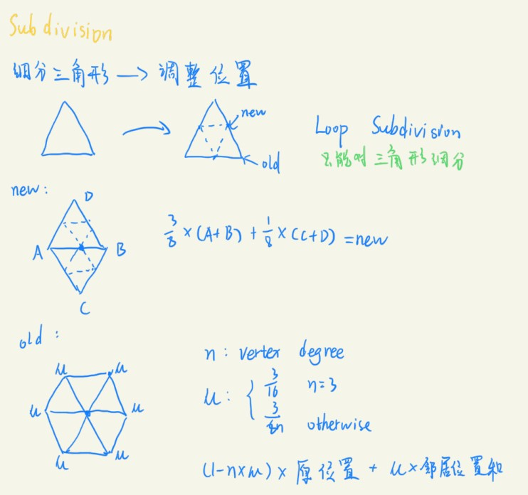
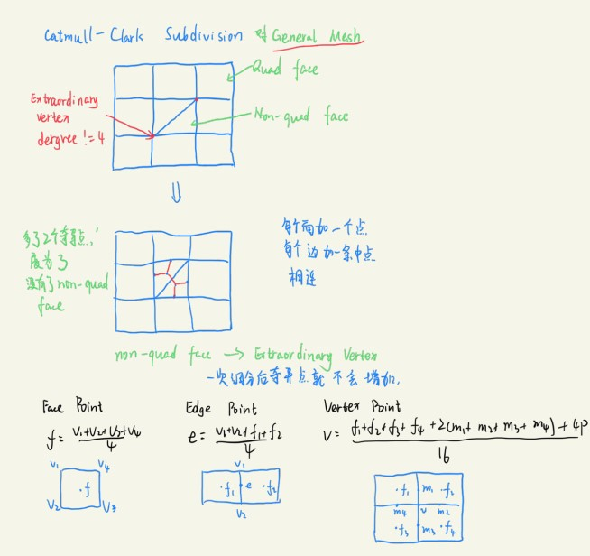
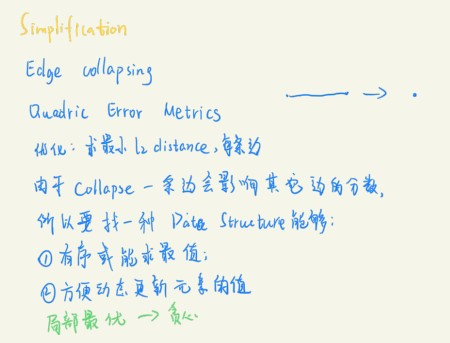
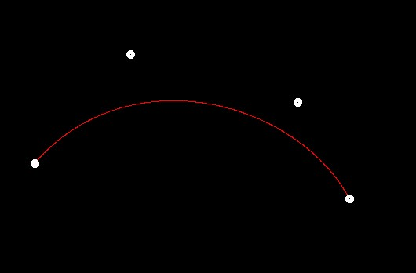
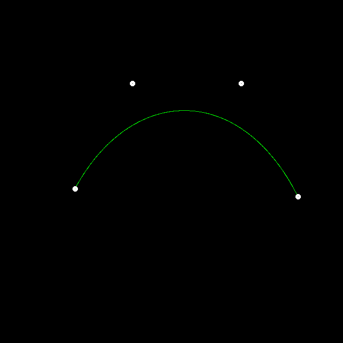
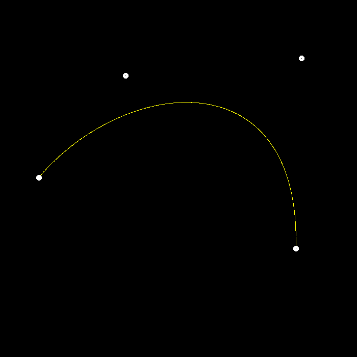

# 前言
第四次作业是几何部分的内容，课程中关于这部分讲了很多，比较庞杂，所以只选择了贝塞尔曲线简单实现。博客会回顾一下这部分的知识，然后给出作业效果。
<!-- more -->

# 几何概念
## 隐式表示
间接表示某些满足特定条件的点，例如公式表示f(x,y,z)=0。

### 隐式表示方法
* Algebraic Surface
* Constructive Solid Geometry
* Distance Functions
* Level Set Methods
* Fractals

### 优缺点
* 描述使用等式，比较简单；
* 查询简单，速度快；
* 计算光线容易
* 能够精确描述简单的物体
* 拓扑变换容易掌握；

* 但是不能描述复杂的形状。

## 显式表示
直接给出点的坐标，或者点坐标的查询方式。

### 显式表示方法
* 点云；
* 多边形面；
* wavefront obj，定义点和点的连接关系，纹理坐标，法线等。

### 优缺点
* 容易判断内外；
* 需要存储空间；


# 曲线

## 贝塞尔曲线
### 二次贝塞尔曲线


### 分段贝塞尔曲线


# 曲面
## Subdivision
增加面数。
### Loop Subvision


### Catmull—Clark Subvision


## Simplification
减少面数。

### Edge Collapsing & Quadric Error Metrics


## Regularization
面数不变。 

# 作业
作业4内容就是通过鼠标选择4个控制点，然后绘制贝塞尔曲线。框架直接给出了通过前面推导的二项式公式得出的贝塞尔曲线，也就是数学方法，现在我们要做的是通过几何方法得到正确的贝塞尔曲线。先看看数学方法得到的效果。

绘制的曲线是红色的，现在看看代码是怎样实现的。
```
void naive_bezier(const std::vector<cv::Point2f>& points, cv::Mat& window)
{
    auto& p_0 = points[0];
    auto& p_1 = points[1];
    auto& p_2 = points[2];
    auto& p_3 = points[3];

    for (double t = 0.0; t <= 1.0; t += 0.001)
    {
        auto point = std::pow(1 - t, 3) * p_0 + 3 * t * std::pow(1 - t, 2) * p_1 +
            3 * std::pow(t, 2) * (1 - t) * p_2 + std::pow(t, 3) * p_3;

        window.at<cv::Vec3b>(point.y, point.x)[2] = 255;
    }
}
```
函数作用是使用opencv在窗口中改变像素的颜色，所以没有返回值，输入一个是指定的控制点数组points，一个是用于绘制的opencv窗口句柄window。那么现在我们就知道绘制的方法了，先得到要绘制的点的坐标，然后仿照上面使用window.at方法指定。

作业要求实现两个函数，一个是Bezier函数，输入和作用与native_bezier完全相同，只是方法不同，要求对比例t进行迭代，增量微小，每次调用另一个函数recursive_bezier，返回当前t值对应的像素坐标。注意，这里按照要求要将曲线绘制成绿色，所以将像素的RGB中G赋值为255最大值。
```
void bezier(const std::vector<cv::Point2f>& control_points, cv::Mat& window)
{
    // TODO: Iterate through all t = 0 to t = 1 with small steps, and call de Casteljau's 
    // recursive Bezier algorithm.
    for (double t = 0; t <= 1; t += 0.001)
    {
        auto point = recursive_bezier(control_points, t); 
        //下面之所以只赋值[1]，是为了将曲线显示成绿色
        //将y行x列的像素的Green值赋值为255
        window.at<cv::Vec3b>(point.y, point.x)[1] = 255;
    }
}
```
再分析另一个，recursive_bezier函数就是使用之前介绍的算法，输入还是控制点，回顾算法过程，实际上是一个递归的过程，三个控制点的贝塞尔曲线，只需要递归一次，四个控制点的贝塞尔曲线，需要递归两次，从中发现一个规律，每递归一次，控制点减少一个，当控制点组points只剩下两个点的时候，按照t比例划分就能得到最后的结果了。所以递归结束的标志就是控制点只剩下两个的时候，将两个控制点的t比例分割点返回即可。
```
cv::Point2f recursive_bezier(const std::vector<cv::Point2f>& control_points, float t)
{
    // TODO: Implement de Casteljau's algorithm
    if (control_points.size() == 2) 
        return control_points[0] + t * (control_points[1] - control_points[0]);
    
    std::vector<cv::Point2f> ano_points;
    for (int i = 0; i < control_points.size() - 1; i++)
    {
        ano_points.push_back(control_points[i] + t * (control_points[i + 1] - control_points[i]));
    }
    return recursive_bezier(ano_points, t);
}
```
这部分函数是参照网上写的，因为我起初没有详细看框架，一些方法不知道怎么用，所以这里建议自己写的时候都看一看框架。现在调用自己编写的函数，得到下面的结果。

最后根据作业要求，同时调用Bezier和native_bezier，得到曲线颜色应该是(255,255,0)，也就是黄色，这就说明自己编写的函数是正确的。


# 反走样
有机会以后再做，作业要求里有注释。
