# 前言
前面的课程和作业中，我们熟悉了一套完整的光栅化过程，然后学习了一些典型的几何表示，现在来到课程的第三个部分，光线追踪。从渲染的角度来说，光栅化和光线追踪是两种不同的着色方式，前者通过光照模型对片段进行投影，然后得到片段颜色，是从物体颜色的计算再到像素；后者虽然是光照模型，但是完全改变了着色方法，从像素出发，模仿光线的传播，完整地计算片段经过光线折射、投射后得到的结果。
<!-- more -->
下面，我们简单介绍一下两种方法的优缺点，然后进入光线追踪的学习。

# 光栅化与光线追踪
## 光栅化总结
光栅化计算比较简单，将物体投影到屏幕上进行内外判断，决定片段颜色。

另外，光栅化做阴影的方法也有，就是Shadow Map，原理就是一个点如果不在阴影中，那么应该是从光源和摄像机视角都能看见的。具体做法是，从光源打光线到场景物体，得到一个含有每个像素的深度信息的Shadow Map，然后再从摄像机打光线到整个场景，这次计算每个像素(或片段)与光源的距离(转化到之前空间中，其实反过来也可以)作为深度值，然后映射(可能走样)找到Shadow Map中记录的值进行比较，如果这两个值相同，就说明该像素没有在阴影中；否则像素就在阴影中。
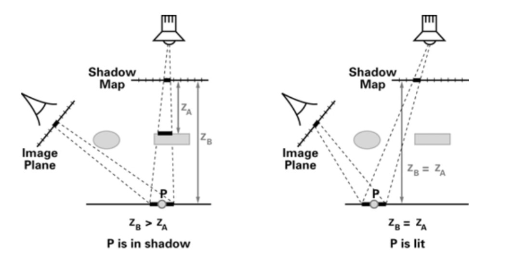
上面ZA就是光源记录的深度值，ZB是摄像机记录后，转换到光源空间中的值，ZB大于ZA表示ZB离光源更远，所以该点是光源不可见的，在阴影中。

这样，光栅化的基本方法就都介绍完了，最大的优点就是计算快，所以可以轻松做到实时计算，并且也有不错的效果。但是光栅化由于模型都是假设得到的，缺乏实际理论，导致光栅化的结果也很简单，一个是阴影是硬阴影，再一个是只模拟了局部光照，并没有光线多次反射的间接光照效果，也就是全局光照。

## 光线追踪优缺点
光线追踪的做法就跟名字一样，基本按照光学原理在场景中计算光线的弹射，模拟全局光照效果。优点当然是对全局光照效果的精确模拟，缺点也很明显，光线的多此计算是非常耗费计算量的，所以光线追踪不容易实时应用。

# 光线追踪

## 光线
要模拟光线传播，首先要定义光线的性质。在光线追踪中，光线就用射线表示，做如下假设：
* 光线沿直线传播；
* 光线之间不会发生碰撞；
* 光线从光源出发，经过反射、折射得到摄像机，并且这个过程可逆。

## 光线投射 Ray Casting
这个模型是80年代提出的，可以称为光线追踪的基本过程。先说一下基本的做法：
* 从摄像机出发，每个像素投射一根光线出去；
* 用投射的光线寻找光源，从而判断阴影。
也就是说，由于光线具有可逆性，所以从光源出发和从相机出发等效，从相机出发达到一个物体，这个物体就是相机可见；进一步，如果这个光线最终达到了光源，那么这个光源就不在阴影中，这样的一条光路包含的能量，就可以用来计算一个像素的颜色。现在，可以明确光线追踪的做法细节了。

## 针孔相机模型 Pinhold Camera Model 
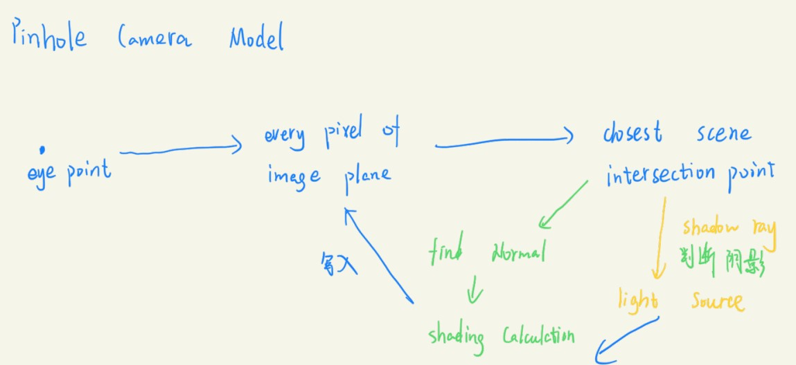

从观察点出发，对每个像素都进行光线投射，每根光线进行上面的操作：光线沿着光路找到第一个相交的物体点，对这个物体点找到法线进行着色计算(例如使用Phong光照模型)，而且还要通过这个点能否达到光源(与光源是否有遮挡物，反过来看就是光线从光源出发没有到观察点)判断点是否在阴影中，然后综合阴影和着色结果，写入光线发出的像素中。

## Witted-Style Ray Tracing (Recursive)
很显然，上面的模型虽然是通过光线进行追踪，但是仍然没有考虑光线弹射，所以得到的结果还是局部的光照。考虑通过递归的方式处理任何一根光线，如果光线发生了折射或者反射，那么以这个点为出发点重新计算光线的投射，这才是完整的光线追踪。
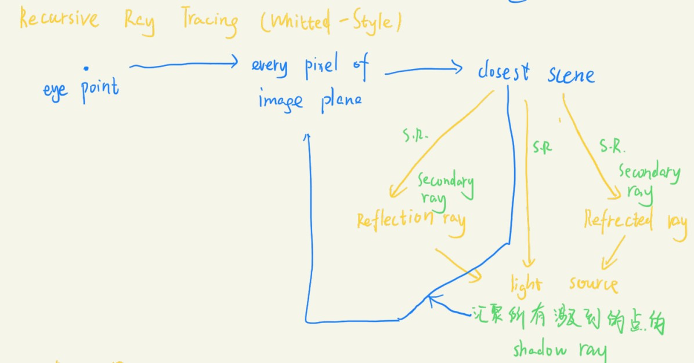
仍然从观察点出发，对每个像素投射光线，光线找到最近的相交点，并且考虑反射和折射光线(统称为Secondary Ray)，如果发生了反射折射，就对反射折射光线进行递归；如果不发生(例如遇到漫反射材质)，则停止追踪这条光线，对这个不发生发射折射的点使用其他光照模型得到着色结果，并返回颜色，最终在递归中汇聚所有值，平均到出发的像素中。   

### 光线求交点
现在，给光线一个完整的数学定义：
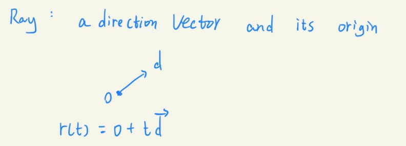

#### 隐式表示的物体
然后，先考虑二维中光线与球相交的情况，球可以用隐式的公式表示，所以把两个方程联列求解：
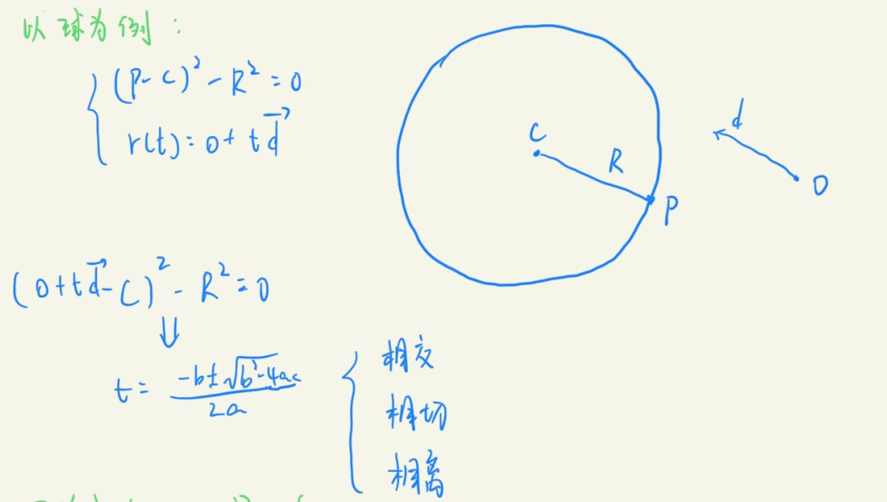
所以，可以使用相同的方法对三维中所有隐式表示f(p)=0，p点如果也可以用光线的方程表示，那么p就是交点。

#### 显式表示的物体
显式表示的物体确定了点的坐标，其实也就确定了许多的三角形面，光线追踪中，我们先看光线与面的交点，再这个交点是否在面上的三角形内，如果两者都满足，才能确定一个交点。

##### 普通方法
与面相交的交点是比较好求的，方便了计算过程。
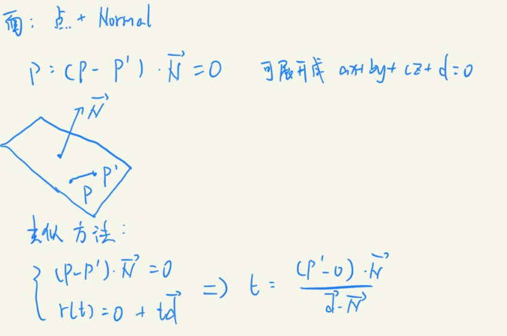
其实也是隐式求交的方法，只不过是平面的函数表示。P点是平面上的点，P'是等待判断的点，如果P'在平面上，那么他和P点连成的向量应该和法线N垂直。最后解出t的表示如上，如果t是非负实数，说明这个点存在，带入光线的定义得到点坐标。

求出点的坐标后就是判断三角形内外了，采用前面的向量叉乘法，就可以得到判断结果。

###### Moller Trumbore Algorithm
这里介绍一种更快的方法，利用重心坐标的性质求解。
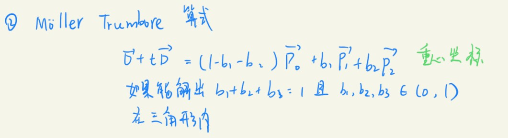
右边三个P向量表示三角形的三个顶点(不是向量)，如果点在三角形内部，那么重心坐标的三个权重应该在[0,1]之间，秩为3的矩阵求解三个未知数，通过克莱默法则得到下面的解形式：
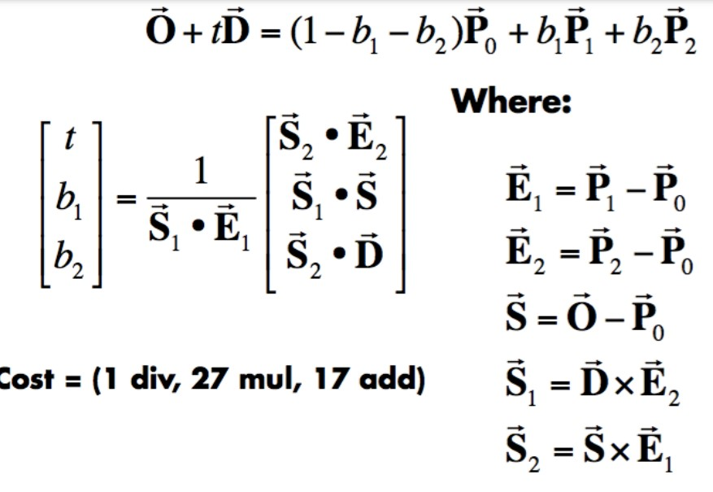

好了，现在知道了如何求交点，完成作业5以后，再进一步学习光线追踪。

# 作业
本次作业还是使用了新的框架，要求写的内容就是上面求交点的算法，还有最简单的光线追踪算法。首先我们分析光线追踪算法的具体实现。

## 光线追踪算法部分
作业要求为每一个像素生成一条对应的光线，调用castRay()函数得到颜色，并存储在帧缓冲区的相应像素中。阅读框架发现，实际上要做的只是求屏幕空间的像素对应到世界中的坐标，也就是说，这和之前光栅化之前的步骤都相同，而且已经得到了屏幕坐标系(NCD)中的像素坐标了。但是现在使用了不同的渲染方式，从像素出发，所以要重新计算片段原本在世界系中的位置，方便投射光线。
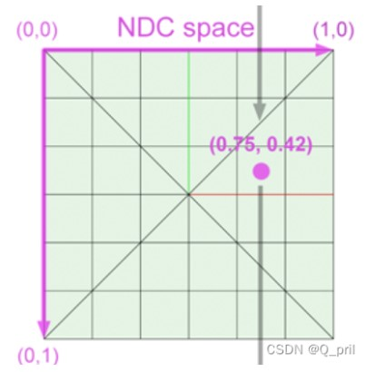
那么分析一下这些坐标的变换情况如下，世界坐标系中的原始坐标P0，经过透视投影压缩到[-1,1]的范围中，这是P1，这一步中定义了fov角和横纵比ratio，然后投射到屏幕上得到P2，范围是[0,+inf]。所以现在反过来已知P2求P0，首先要将P2重新压缩到[-1,1]上，对X坐标应该先除以屏幕宽度width，然后乘以2，减去1；Y坐标和X的计算相反，因为屏幕坐标系中Y正方向向下，所以我们是用负的Y坐标除以屏幕高度，乘以二然后加上1。
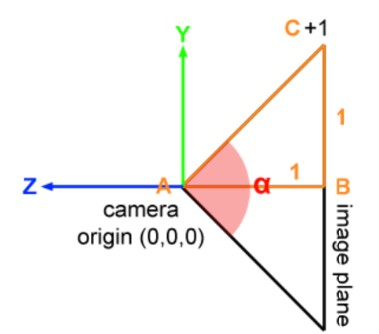

得到P1后，分析透视投影的fov角，tan(fov/2)=高宽/Z值，这实际上就是直接对XY坐标的缩放，所以框架给出了scale这个值放大坐标。最后，这样得到的XY坐标实际上是相等的，因为还有一个宽高比没有用，宽高比就是宽度是高度的多少倍，所以把X坐标乘以这个宽高比，就得到了原始的X坐标，Y坐标不用乘，这就是P0。
```
void Renderer::Render(const Scene& scene)
{
    std::vector<Vector3f> framebuffer(scene.width * scene.height);

    float scale = std::tan(deg2rad(scene.fov * 0.5f));
    float imageAspectRatio = scene.width / (float)scene.height;

    // Use this variable as the eye position to start your rays.
    Vector3f eye_pos(0);
    int m = 0;
    for (int j = 0; j < scene.height; ++j)
    {
        for (int i = 0; i < scene.width; ++i)
        {
            // generate primary ray direction
            //(i+0.5,j+0.5)才是像素在屏幕上的位置，而且因为屏幕以左上角作为原点，
            //导致y轴坐标向下为正方向，所以实际上y的计算和x相反
            float x = (2 * (i + 0.5) / scene.width - 1) * imageAspectRatio * scale;
            float y = (1 - 2 * (j + 0.5) / scene.height) * scale;
            // TODO: Find the x and y positions of the current pixel to get the direction
            // vector that passes through it.
            // Also, don't forget to multiply both of them with the variable *scale*, and
            // x (horizontal) variable with the *imageAspectRatio*            

            Vector3f dir = normalize(Vector3f(x, y, -1)); // Don't forget to normalize this direction!
            framebuffer[m++] = castRay(eye_pos, dir, scene, 0);
        }
        UpdateProgress(j / (float)scene.height);
    }

    // save framebuffer to file
    FILE* fp = fopen("binary.ppm", "wb");
    (void)fprintf(fp, "P6\n%d %d\n255\n", scene.width, scene.height);
    for (auto i = 0; i < scene.height * scene.width; ++i) {
        static unsigned char color[3];
        color[0] = (char)(255 * clamp(0, 1, framebuffer[i].x));
        color[1] = (char)(255 * clamp(0, 1, framebuffer[i].y));
        color[2] = (char)(255 * clamp(0, 1, framebuffer[i].z));
        fwrite(color, 1, 3, fp);
    }
    fclose(fp);    
}
```
只有中间求x，y那里是需要填写的，其他已经写好，不过记得对dir这个方向向量进行归一化。

## 三角形求交部分
这部分就很简单了，按照公式计算即可，向量和点都已经给出。
```
bool rayTriangleIntersect(const Vector3f& v0, const Vector3f& v1, const Vector3f& v2, const Vector3f& orig,
                          const Vector3f& dir, float& tnear, float& u, float& v)
{
    // TODO: Implement this function that tests whether the triangle
    // that's specified bt v0, v1 and v2 intersects with the ray (whose
    // origin is *orig* and direction is *dir*)
    // Also don't forget to update tnear, u and v.
    //按照克莱默法则得到的解形式计算就行了
    Vector3f E1 = v1 - v0;
    Vector3f E2 = v2 - v0;
    Vector3f S = orig - v0;
    Vector3f S1 = crossProduct(dir, E2);
    Vector3f S2 = crossProduct(S, E1);
    tnear = dotProduct(S2, E2) / dotProduct(S1, E1);
    u = dotProduct(S1, S) / dotProduct(S1, E1);
    v = dotProduct(S2, dir) / dotProduct(S1, E1);
    if (tnear >= 0 && u >= 0 && v >= 0 && (1 - u - v) >= 0)
        return true;
    return false;
}
```
这里都是引用形式，所以直接修改变量名即可。如果解出的三个值都满足条件，t非负，重心坐标的三个权重都在0和1之间，那么点就在三角形内部。

## 结果
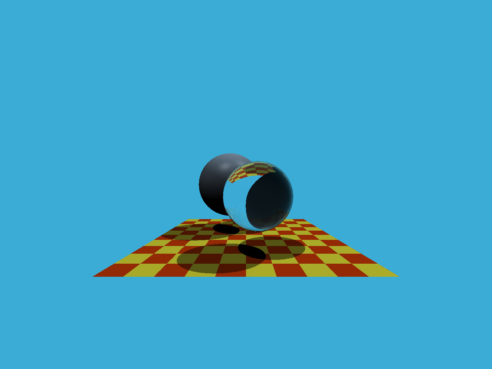
