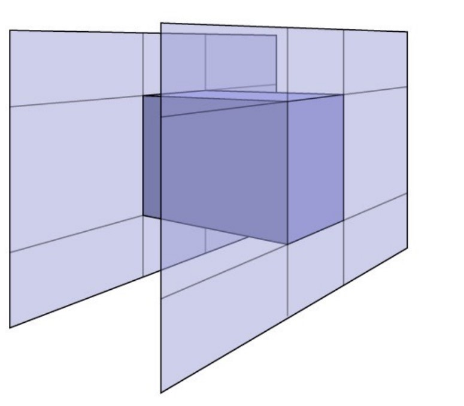
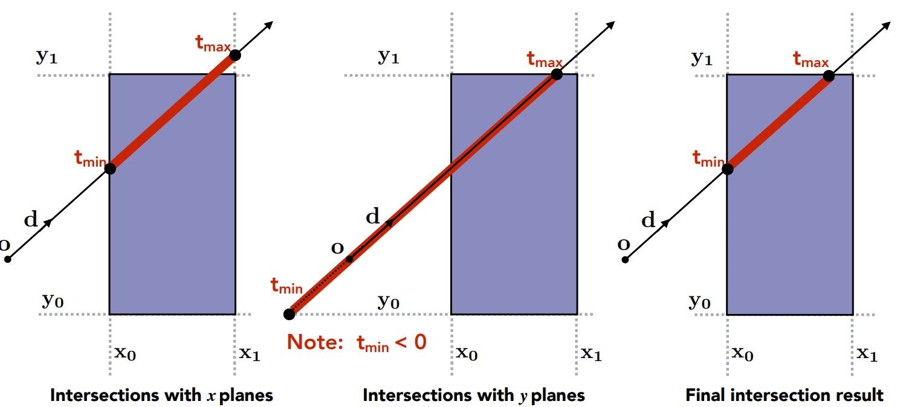
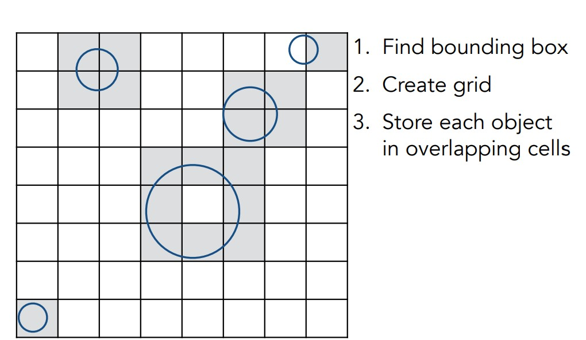
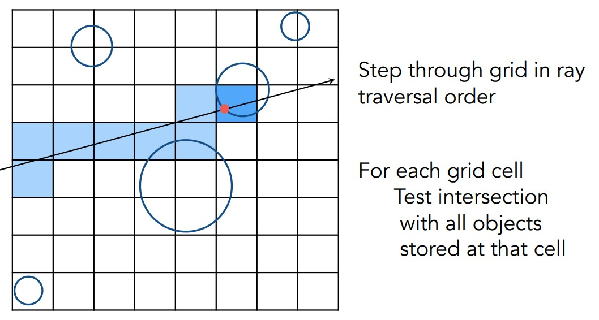
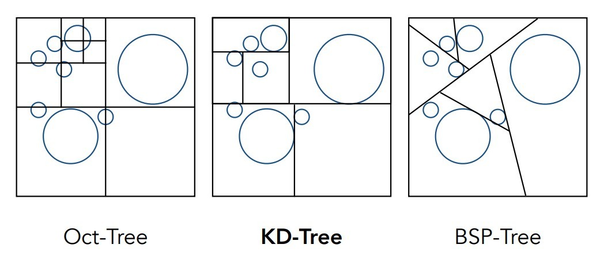
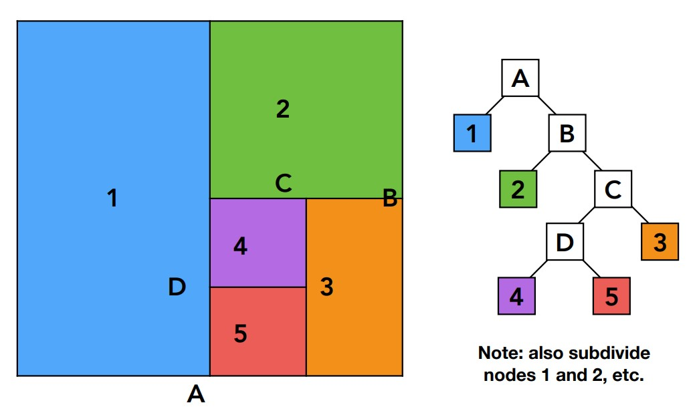
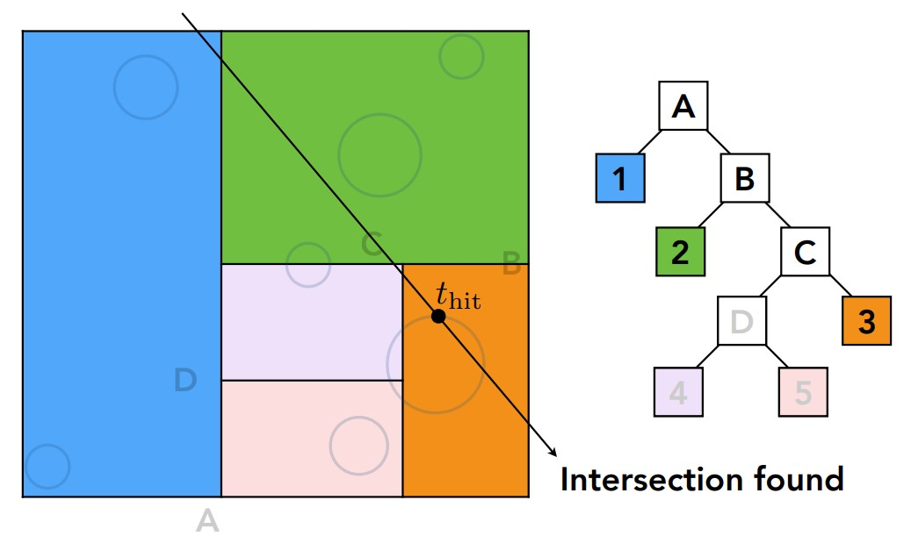
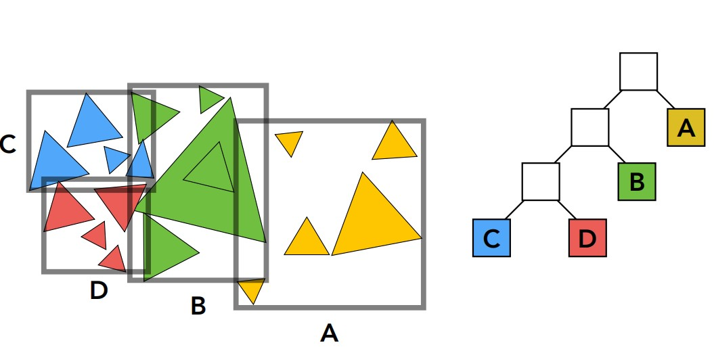

# 前言
前面介绍了光线追踪的基本原理，结合光线追踪的特点，可以想到光线追踪有一个很明显的缺点，那就是速度太慢了。为了加速光线追踪的渲染过程，提出包围体积(Bounding Volumes)加速求交点，并且在作业中，我们会将这项技术应用到光线追踪上。
<!-- more -->

# Bounding Volumes
其实前面光栅化的时候，我们已经介绍过类似的思想了，在对每个像素进行遍历求三角形内外的时候，我们也是用一个包围盒确定要计算的像素，避免每次对很多像素进行计算。而这项技术的做法和名字相同，就是用一个盒子将一个等待求交点的物体包围起来，这样一来我们先判断光线会不会与这个盒子相交，再判断会不会与物体相交，所以这里先介绍如何求一个物体的包围盒。

## Axis-Aligned Bouding Box

这种AABB盒子就是我们说的包围盒，它实际上是一个长方体，那么我们当然想到，确定这个长方体只需要六个值：上下、左右、前后，实际上也就是通过这六个值来表示长方体的。不过如何用这六个值进行求交才是重点，我们先来看看二维的情况。

仍然使用前面的光线模型，对包围盒求光线与盒子x值与y值的交点，暂时用tmin和tmax表示，如上图。当然，对x值求交点得到了一组[tmin,tmax]，通过对y值求交点又得到了一组[tmin', tmax']，而实际上我们需要的是光线什么时候最早进入盒子，什么时候又从盒子最晚出去，所以对这两组中的t，tmin取最大值，tmax又取最小值，也就是两个区间求交集，最后得到一组最终的t，记为[tEnter,tExit]。

在三维空间中，我们也采取相同的做法，tEnter=max(tmin)，tExit=min(tmax)。求这两个t值就可以进行求交的判断了，可以发现以下条件：
* tEnter<tExit，这是有交点的必要情况；
* tExit<0，说明光源在盒子外面，而且光线经过反向延长才离开盒子，所以光线实际上没有交点；
* tEnter<0 && tExit>=0，这时光源就在盒子内部，也是有交点的；当然如果tEnter>=0，光源就在盒子上或者盒子外部。

总结三种情况，可以发现当且仅当tEnter<tExit并且tExit>=0，才是有交点的情况，不论光源在盒子内部还是外部。

而之所以不直接求光线和长方体面的交点，也是为了加快速度。

## Accelerating
上面介绍了如何使用一个包围盒，现在实际考虑在光线追踪上应用，这其实有很多方法，并不是直接对所有的包围盒求交点，而是将空间划分成不同的区域，这样才能进一步加速，根据光线的位置找出可能相交的少部分包围盒。介绍两种方法，均匀划分(Uniform grids)和空间划分(Spatial partions)。

### Uniform grids
你可能注意到了，前面并没有说对某个物体如何求包围盒，因为这并不需要，在均匀划分中，首先是要找到一整个场景的包围盒，然后将这个包围盒分成均匀的块，每个块也是一个包围盒，这样找到那些存在物体的块(内部当然不计算)并存储起来，称为cell，每次对这些cell进行判断就行了。

当一条光线进入场景，用前面的方法找到光线相交的这些块，如果光线进入了一个cell，那就进一步判断光线是否和物体有交点(就是前一个作业的三角形求交Moller Trumbore Algorithm)。

如图，前面浅蓝色格子计算的都是包围盒，只有最后一个深蓝色的格子是cell，需要计算物体的交点。这样，就可以加快计算速度了。

### Spatial Partitions
上面那种做法显然造成了浪费，在一些没有物体的地方显然没有必要分这么多格子，所以就提出了一些划分空间的做法。



* 八叉树，递归地划分一个正方体，第一个图那样，存在物体的地方就进行递归，直到划分到需要的程度，不过这样会造成存储空间指数上升；
* KD-Tree，同样是递归划分，不过每次只朝一个轴划分，例如上面第二个图，先在X轴划分一次，然后对下面的物体在Y轴再次划分；上面的物体Y轴划分后，重新在X轴划分；
* BSP-Tree，与KD-Tree类似，不过不要求轴对齐划分，任意选择方向。

下面重点介绍KD-Tree，它的存储方式是下面这样：

存储也是递归的过程，叶子结点一定是具体的包围盒，而非叶子结点一定被划分成叶子结点，所以不存储实际物体。

在递归遍历的时候，从根结点开始找到每个光线穿过的根结点代表的盒子的tmin和tmax，判断是否穿过盒子，如果盒子还有孩子结点，进一步判断是否穿过了孩子结点指向的包围盒，以此类推，最后判断这些结点里面的物体是否和光线相交。


做法的缺点：
* 可能一个叶子结点重复存储了一个物体，如果这个物体同时在几个包围盒中；
* 三角形与包围盒求交点比较困难，导致物体不好判断存储在哪里；

要解决这两个问题都很困难，所以，现在介绍一种通过物体划分的方法。

### Object Partitions
通过这种方式得到的就是BVH(Bounding Volume Hierarchy)，我们仍然从整个场景的包围盒出发，然后将这个场景中的物体不断划分成两部分，分别计算这两部分物体的包围盒，直到划分得到的最小包围盒中物体数量达到一定要求。

现在的划分方式又有两个特点：存储不会重复了，但是包围盒边界可能会有交集。而遍历的算法则与上面KD-Tree相似。

# 作业
本次作业依然是光线追踪的框架，要求实现与AABB包围盒求交算法以及刚刚介绍的BVH求交算法。

## 引用代码改动
有部分需要用到之前作业写的函数，不过需要简单改动。
```
inline Intersection Triangle::getIntersection(Ray ray)
{
    Intersection inter;

    if (dotProduct(ray.direction, normal) > 0)
        return inter;
    double u, v, t_tmp = 0;
    Vector3f pvec = crossProduct(ray.direction, e2);
    double det = dotProduct(e1, pvec);
    if (fabs(det) < EPSILON)
        return inter;

    double det_inv = 1. / det;
    Vector3f tvec = ray.origin - v0;
    u = dotProduct(tvec, pvec) * det_inv;
    if (u < 0 || u > 1)
        return inter;
    Vector3f qvec = crossProduct(tvec, e1);
    v = dotProduct(ray.direction, qvec) * det_inv;
    if (v < 0 || u + v > 1)
        return inter;
    t_tmp = dotProduct(e2, qvec) * det_inv;

    // TODO find ray triangle intersection
    //下面是没有给出的部分
    if(t_tmp < 0)
        return inter;
    
    inter.happened = true;
    inter.distance = t_tmp;
    inter.m = m;
    inter.obj = this;
    inter.normal = normal;
    inter.coords = ray(t_tmp);
    return inter;
}
```
回顾前面的三角形求交算法，该函数中已经求出克莱默法则解中的t(t_tmp)，b1(u)，b2(v)，而且前面限制了u，v的取值，所以条件只要求t非负了。Intersection是一个记录数据的结构体，将求出的各种值赋值给对应的变量即可；如果前面几个if判断没有相交，将直接返回，不进行赋值(使用默认值)。
```
void Renderer::Render(const Scene& scene)
{
    std::vector<Vector3f> framebuffer(scene.width * scene.height);

    float scale = tan(deg2rad(scene.fov * 0.5));
    float imageAspectRatio = scene.width / (float)scene.height;
    Vector3f eye_pos(-1, 5, 10);
    int m = 0;
    for (uint32_t j = 0; j < scene.height; ++j) 
    {
        for (uint32_t i = 0; i < scene.width; ++i) 
        {
            float x =  (2 * (i + 0.5) / scene.width  - 1) * scale * imageAspectRatio;
            float y = -(2 * (j + 0.5) / scene.height - 1) * scale;   
            Vector3f dir = normalize(Vector3f(x, y, -1)); 
            //下面两行有所改动
            Ray ray(eye_pos,dir);
            framebuffer[m++] = scene.castRay(ray,0);
        }
    UpdateProgress(1.f);
    }

    // save framebuffer to file
    FILE* fp = fopen("binary.ppm", "wb");
    (void)fprintf(fp, "P6\n%d %d\n255\n", scene.width, scene.height);
    for (auto i = 0; i < scene.height * scene.width; ++i) {
        static unsigned char color[3];
        color[0] = (unsigned char)(255 * clamp(0, 1, framebuffer[i].x));
        color[1] = (unsigned char)(255 * clamp(0, 1, framebuffer[i].y));
        color[2] = (unsigned char)(255 * clamp(0, 1, framebuffer[i].z));
        fwrite(color, 1, 3, fp);
    }
    fclose(fp);    
}
```
这个函数的改动是castRay函数变成类Scene的一个方法了，而且输入中第一个参数变成了光线类Ray，找到Ray的构造函数输入参数即可得到ray，然后作为投射光线函数的参数。
## AABB包围盒求交
```
inline bool Bounds3::IntersectP(const Ray& ray, const Vector3f& invDir,
                                const std::array<int, 3>& dirIsNeg) const
{
    // invDir: ray direction(x,y,z), invDir=(1.0/x,1.0/y,1.0/z), use this because Multiply is faster that Division
    // dirIsNeg: ray direction(x,y,z), dirIsNeg=[int(x>0),int(y>0),int(z>0)], use this to simplify your logic
    // TODO test if ray bound intersects
    float x_tmin = (pMin.x - ray.origin.x) * invDir[0];
    float y_tmin = (pMin.y - ray.origin.y) * invDir[1];
    float z_tmin = (pMin.z - ray.origin.z) * invDir[2];
    float x_tmax = (pMax.x - ray.origin.x) * invDir[0];
    float y_tmax = (pMax.y - ray.origin.y) * invDir[1];
    float z_tmax = (pMax.z - ray.origin.z) * invDir[2];

    if(dirIsNeg[0])
    {
        float t = x_tmin;
        x_tmin = x_tmax;
        x_tmax = t;
    }

    if(dirIsNeg[1])
    {
        float t = y_tmin;
        y_tmin = y_tmax;
        y_tmax = t;
    }

    if(dirIsNeg[2])
    {
        float t = z_tmin;
        z_tmin = z_tmax;
        z_tmax = t;
    }

    float tEnter = std::max(x_tmin, std::max(y_tmin, z_tmin));
    float tExit = std::min(x_tmax, std::min(y_tmax, z_tmax));

    if(tEnter < tExit && tExit >= 0)
    {
        return true;
    }
    return false;
}
```
现在正式进入函数的编写，AABB包围盒的参数通过定义的变量pMin和pMax得到，两者分别记录了包围盒三个轴坐标的最小、最大值，按照前面的方法，我们首先要求出光线和三个轴相交的tmin和tmax值，这一步很简单，光线方程为O+t*d=x/y/z，也就是t=(x/y/z-O.x/y/z)/d，这里第一个x/y/z就是包围盒的六个参数(上下，左右，前后)，O是光源位置(ray.origin)，d则是光线方向dir，注释中说明使用乘法比除法快，所以计算的时候我们直接乘以dir的倒数invdir，对应轴进行对应坐标的计算，得到三组t值。

之后还要进行一个判断，dirIsNeg记录了三个轴上方向向量的正负，因为我们计算交点的t值时，当方向为正都是从小到大的t满足条件，即tEnter<tExit，如果方向为负，实际上t应该是tEnter>tExit满足相交，所以要交换，最后判断条件就是一样的了。
## 递归求BVH交点
```
Intersection BVHAccel::getIntersection(BVHBuildNode* node, const Ray& ray) const
{
    // TODO Traverse the BVH to find intersection
    Intersection inter;
    Vector3f invdir(1 / ray.direction.x, 1 / ray.direction.y, 1 / ray.direction.z);

    std::array<int, 3>dirIsNeg;
    dirIsNeg[0] = ray.direction.x < 0;
    dirIsNeg[1] = ray.direction.y < 0;
    dirIsNeg[2] = ray.direction.z < 0;

    if(node->bounds.IntersectP(ray, invdir, dirIsNeg) == false)
    {
        return inter;
    }

    if(node->left == nullptr && node->right == nullptr)
    {
        return node->object->getIntersection(ray);
    }

    Intersection hit_left = getIntersection(node->left, ray);
    Intersection hit_right = getIntersection(node->right, ray);

    if(hit_left.distance < hit_right.distance)
        return hit_left;
    else
        return hit_right;
}
```
这是一个递归的函数，遍历的方式是对一棵链式存储的二叉树进行遍历，访问函数就是调用前面编写的求box交点函数IntersectP，该函数需要的参数都在前面计算了，如果该结点是一个叶子结点，而且光线与这个叶子结点代表的包围盒相交了，那么就应该再与叶子结点存储的物体求交点，这里调用了一个同名的方法。

要注意的是，最后要返回一个求交结果的结构体，根据递归光线追踪的原理，每次光线投射时找到最近的那个交点即可，所以在所有这些子树返回的结果中，应该找到t值最小的那个交点的结构体，因此在返回的时候加上一个判断条件，将最近的交点返回。

## 结果


