# 前言
光线追踪的效果很不错，但是有一个细节上的假设，光线在到达光滑物体点上的时候，总是发生反射或折射(或者一起发生)；但是如果物体材质是漫反射材质，那么光线就不再进行反射和折射。这其实是错误的做法，在Phong光照反射模型中，漫反射也是一种光，现在我们要通过更科学的方式解释这种现象，也就是通过辐射度量学推导出的渲染方程，并且还将介绍应用渲染方程的高级光线追踪——路径追踪算法。
<!-- more -->

# 光线追踪的问题
重新看作业5的框架代码，你会发现我们之前确实是这样做的，对一条光线进行投射的时候，根据达到的点的材质进行不同的递归，如果反射和折射同时发生，那么同时对这两种光线进行递归投射；如果只发生了反射，只对反射光线发生递归；其他所有情况都不进行递归，而是直接计算着色情况并返回，作为递归的退出条件。下面茶壶与康奈尔盒的例子会更直观的指出这个问题：
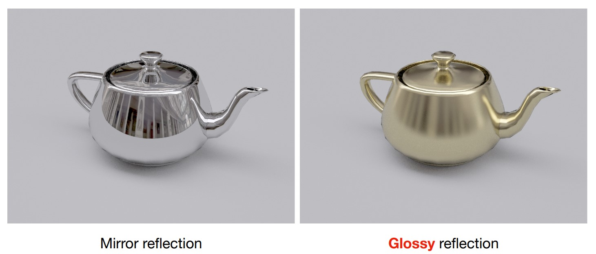
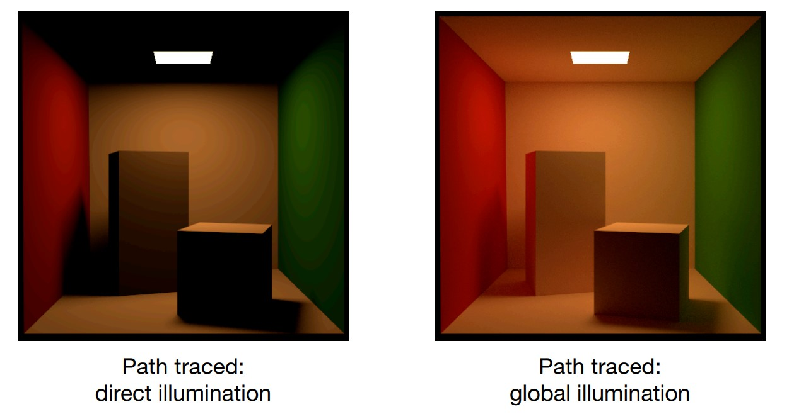
第一，光线追踪对镜面材质效果是很不错的，但是对于漫反射材质不能很好地处理，例如上面的茶壶，右边的效果使用光线追踪很难得到；
第二，康奈尔盒中，左边是限制了直接光照的路径追踪，可以看作是用简单光线追踪得到的结果，光源没有直接照到的地方明显没有了亮度，这显然就是错误的，在这种场景全部是漫反射材质的时候，即使使用光线追踪得到的效果和直接光照的光栅化也没有多大区别，因为这时光线仅仅弹射了一次。

这就是我们需要使用路径追踪的原因，路径追踪可以物理学地正确模拟任何光照结果。


# 辐射度量学

## 基本物理量
辐射度量学是渲染方程的基础，我们只需要掌握基本的定义，然后就能进行方程的推导了，这可能需要一些基本的物理知识。

首先，我们将能量记为Q[J]，中括号中的是单位。同样，定义功率Radiant flux记为能量对时间求导dQ/dt[w][lm]，然后我们再定义下面三个物理量：
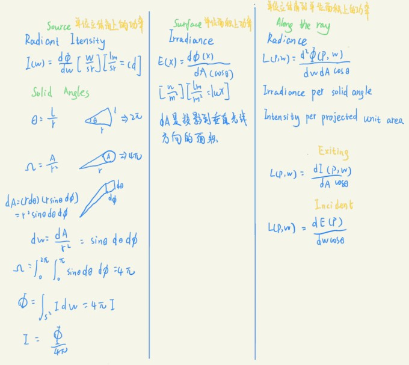
Radiant Intensity，单位立体角上的功率；Irradiance，单位面机上的功率；Radiance，单位立体角到单位面积上的功率。

在Radiant Intensity中(记为I)，关于立体角，就是球体上的一个单位面积除以球半径，可以推导出微分形式的表示，见上图；一个光源的所有功率就是所有立体角上的Radiant Intensity的积分，而且我们计算体积的二重积分时，由于只需要计算半个球体(另外一半可以通过对称得到结果)，所以只积分到PI而不是2*PI。Ω求出的就是球面上的单位立体角之和，那么自然得到Intensity为总功率除以总立体角和。

在Irradiance中(记为E)，要注意这个单位面积也应该和光线方向垂直，所以通过cos计算投影面积。球面面积4ΠR^2，所以对一个球来说Irradiance就是总功率除以总面积，发现只有R这一项是变量，所以前面在Phong光照模型中假设光线能量与距离平方的倒数成反比是正确的。

在Radiance中(记为L)，功率对方位角和单位面积同时微分，得到的就是某个方位角的Radiance到某个单位面积上的能量，与光线的传播就非常相似了。Radiance的物理意义也有两种如图：Incident Radiance和Exiting Radiance，与前面介绍的两种物理量就联系了起来。
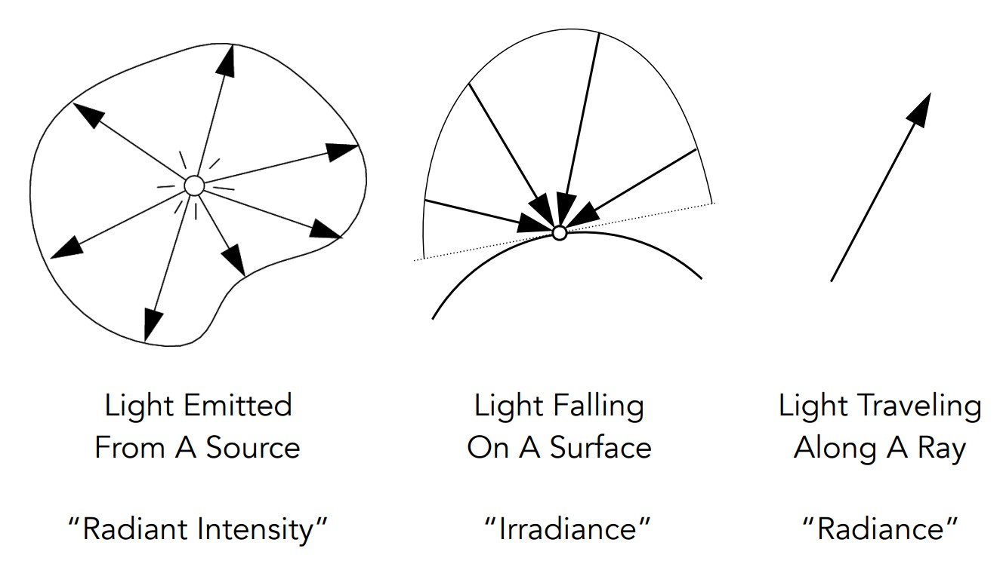

## Bidirectional Reflectance Distribution Function
双向反射分布函数是一种用来决定材质的量，可以用之前的几种物理量推导，表示的就是反射光的如何进行反射。
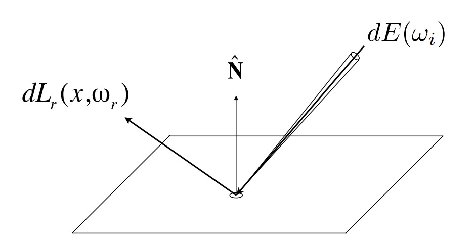
光线能量照到某个点上，可以用Irradiance表示，因为不管哪个方向的能量都算到这个点上；但是反射出去的时候应该是一个Exiting Radiance。我们将两个能量的比值定义出来，这就是BRDF，所以它其实不算一个函数，而是一种比例，确定有多少能量会被反射出去。
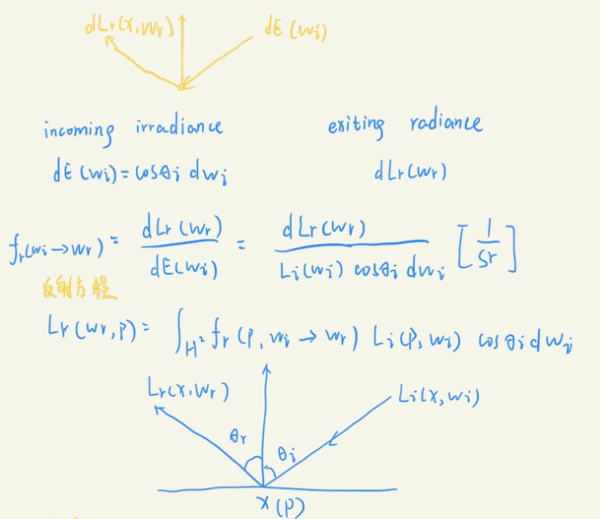
这样，就可以建立一个反射方程了，还是以半球为基准，对Irradiance进行积分得到Exiting Radiance，而且可以定义入射光线和法线的夹角θi以及反射光线和法线的夹角θr，从而具体确定不同物体的反射方式。

# 渲染方程
通过上面的反射方程，现在要推导出渲染方程。首先要解决的问题是在光线渲染的过程中，第一次光线从光源弹射到物体表面求反射光线，决定于输入的光线是什么，但是输入的光线并不仅仅是光源的光线，还有其他物体可能发射到这个点上，除非限制光线只弹射一次。

现在，先对反射方程处理以下，加上之前没有的自发光项Emission：
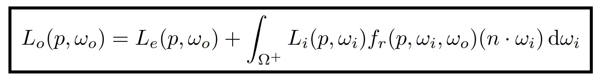
这就是渲染方程，之前的问题影响的就是如何解出渲染方程，但是此时渲染方程的形式是没有问题的，还将反射方程中的cos值换成两个向量的点积。下面通过费雷德霍姆积分方程得到式1，再进一步转化为线性算子方程，得到式2，两边有相同的L，也就是Radiance。
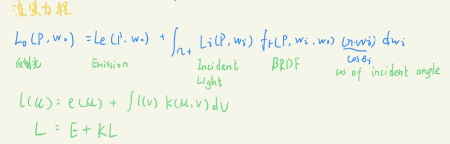
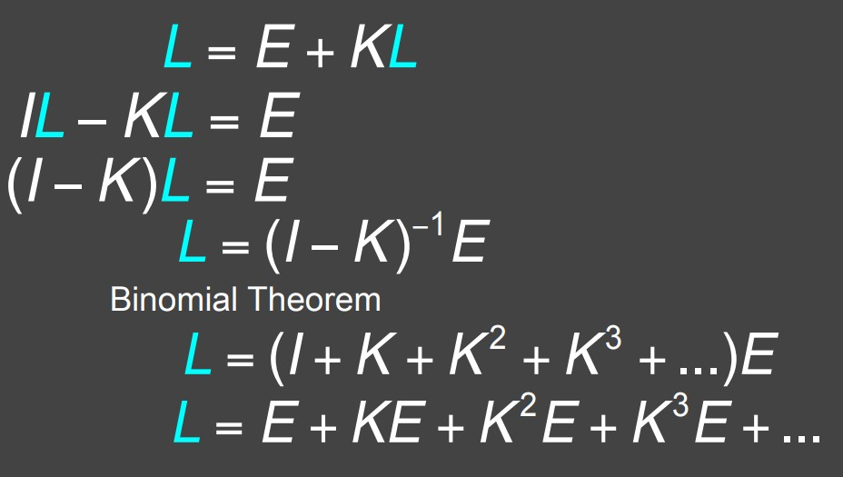
合并L后，通过二项式定理得到最终形式。
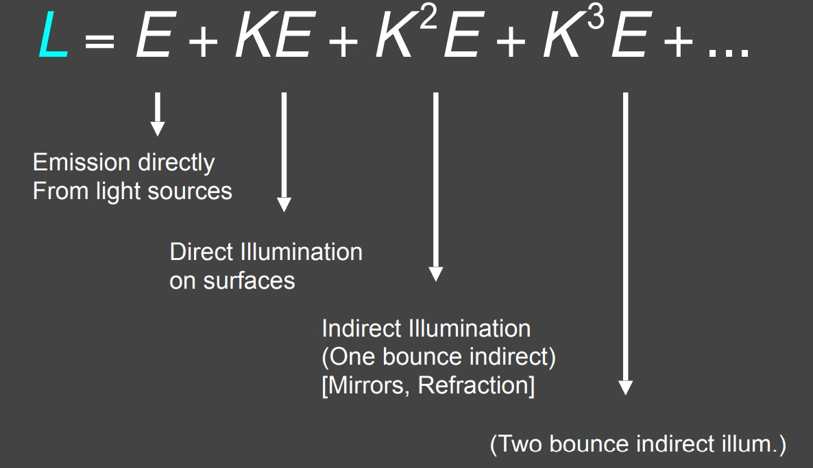
现在可以根据其统一的形式分析其物理意义了，K可以视作反射操作符，一个场景的反射光线由光源的发光E，以及经过K次反射后的E的能量，K操作一次时就是直接光照的结果，K操作两次即两次以上就是间接光照的结果，这三种能量就构成了全局光照。光栅化能模拟的，就是K至多操作一次的情况。

# 蒙特卡洛积分
在渲染方程中，K算子含有积分运算，我们采用方便的蒙特卡洛积分来求解。蒙特卡洛积分可以看作通过多此采样得到的函数平均值进行积分，或者说对所有可能的函数值求平均。
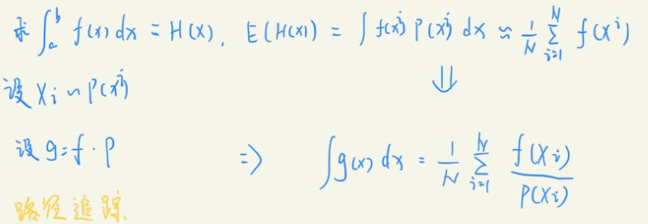
其中，H(x)是f(x)的积分，P是x的概率密度函数，g是f对P的期望值。如果P是常数，表面x所有值出现的概率相同。H(x)的期望就是对g的积分，通过对g的积分由式1可以推出，所以g再除以P就得到了H(x)的期望。可以理解成除以P进行一个概率上的平均。

而对于这个变量的概率密度函数，也有很多取法，例如取常数等等，会造成不同的结果。

# 路径追踪
现在，通过蒙特卡洛积分和渲染方程的解法，可以试着编写路径追踪的算法了。这是一个递归的shader，决定光线Li从wi入射时到p点时，反射到wo立体角上光线有多少能量。

## 积分方法解渲染方程
根据之前的知识，渲染方程中的L积分可以写成下面这样：
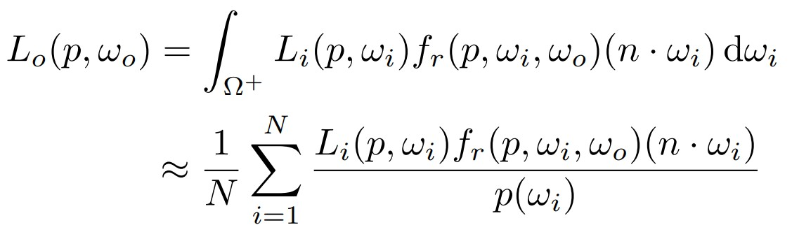
其中，概率密度函数我们这里先选择均匀采样，因为积分是对立体角的积分，所以均匀采样得到的就是半球上的总面积除以半径平方，然后取倒数，也就是1/2Π。

## 算法推导
如果还是按照光线追踪一样，递归光照结果作为新的光源重新计算：
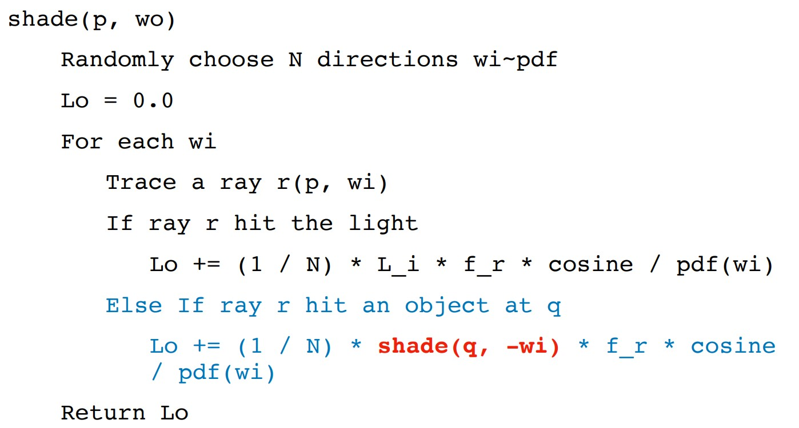
此时遇到第一个问题，这样会导致计算量太大，因为不同方向的反射光线会各自得到新的许多不同方向的反射光线，是幂函数的复杂度。
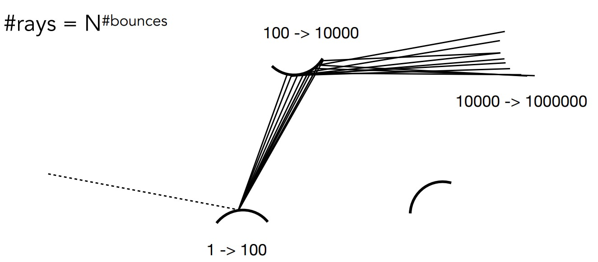
所以每次选择只取一个方向进行模拟，并且取足够多的方向求平均值，像下面这样。
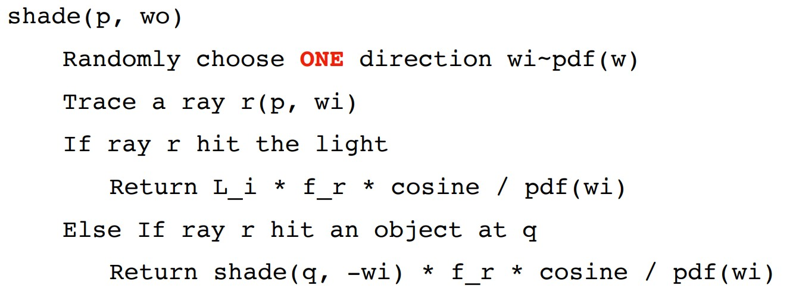
当然这样会导致得到的结果很不准确，因为采样太少了，所以我们在更外层进行更多次的路径追踪即可，也就是对每个像素取不同的方向进行模拟，得到每个像素的颜色就不会有问题了。
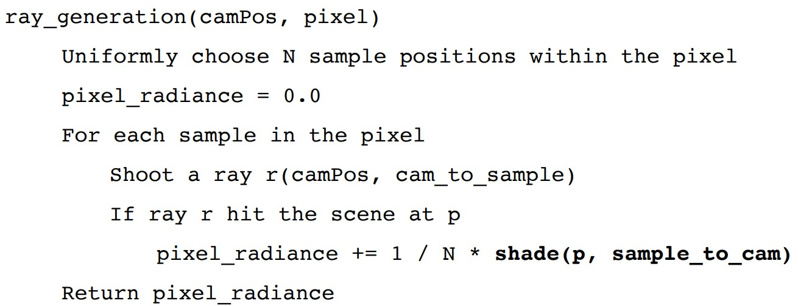

第二个问题，在实际上，由于光线满足能量守恒，所以其实是一直在不断弹射的，但是我们现在必须要让光线能够停下，也就是没有递归停止的条件，所以采用轮盘赌的方法决定光线是否停下，如果光线停下了就返回0即可。
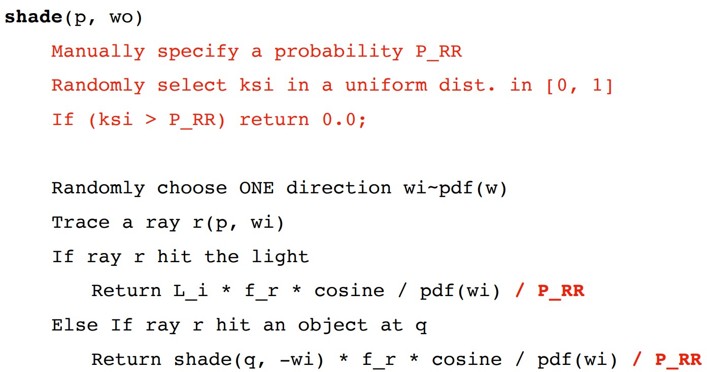
P_RP是取到当前方向的概率，所以同样要作为概率密度除去。这是一个正确的路径追踪算法的伪代码。

## 优化采样
现在得到的算法虽然正确，但是太慢了，原因是我们让打到光源的光线直接返回累计的结果这是能看到的光线；其他光线则一直弹射直到轮盘赌让他停止，如果还没有打到光线，那就只能返回0。所以导致如果对每个像素取样频率(Samples per pixel)不高，会造成很多黑点。
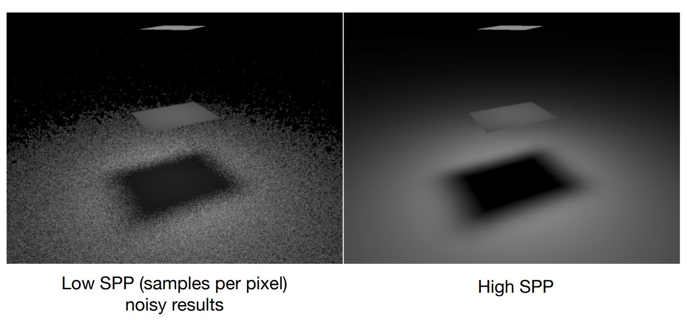
也就是说，如果对半球进行均匀采样，会有很多路径不会打到光源，计算这些路径是无效的，所以我们必须改变采样频率，进一步分析哪些立体角上的光线会打到光源。

现在假设光源总面积为A，取微分dA，只要找到dA对应哪些立体角dW，就可以知道哪些立体角是需要计算的了。根据立体角的定义，可以找到这个关系。
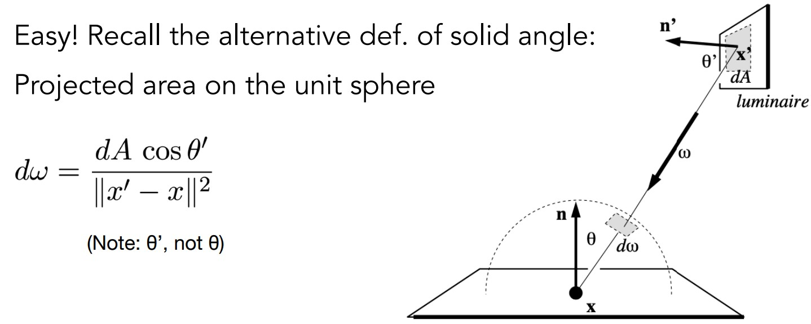
这样，对立体角积分就变成了对光源面积的积分，我们在光源上均匀采样是没有任何问题的，只不过将这个采样变换到立体角上和之前是不同的。
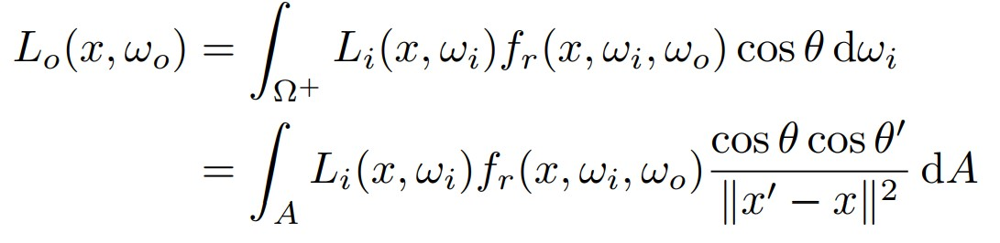
这是对光源的贡献的计算，就是直接光照；非光源贡献的计算和前面相同，就是间接光照。
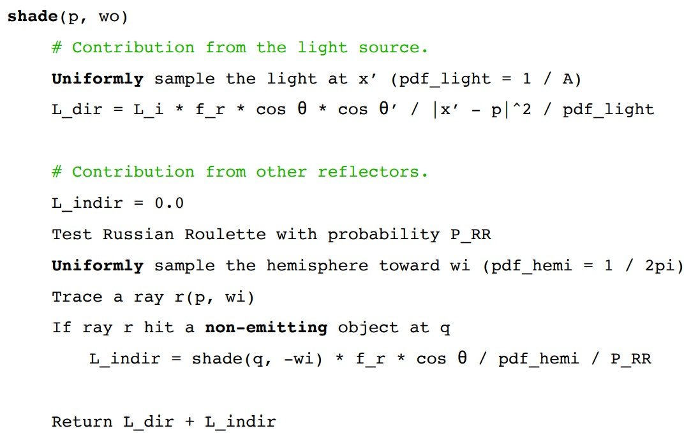
最终得到优化后的路径追踪算法。也就是说，我们对一个点的着色进行计算的时候，先看光源能不能直接照到这个点，这就是直接光照；然后选择反射方向再次追踪反射光线，如果反射光线又打到另一个非光源物体上，就可以开始递归了，直到光线什么都没打到或者打到了光源，已经因为轮盘赌概率停止。

当然，路径追踪仍然有很多地方可以进一步优化，对不同的场景也应该有不同的方法，入门以后可以继续学习。

# 作业
这将是本系列最后一个作业，课程后面的内容有机会再更新，因为后面是对材质(BRDF)先进研究的介绍，成像原理的科普，最后还有动画模拟，这部分内容也很多，但是基本的渲染方法我们已经了解了，作为本科学习来说，已经足够，但是GAMES101的课程还是偏理论，作为入门了解是够了，但是代码学习仍然重要。

作业7就是实现路径追踪算法，沿用了前面作业的一些函数。伪代码在作业说明中更详细地给出了，符合框架，照着编写理解即可。
```
Vector3f Scene::castRay(const Ray &ray, int depth) const
{
    Vector3f L_dir, L_indir;
    // TODO Implement Path Tracing Algorithm here
    // ray and scene intersect at p
    //找到交点p
    Intersection inter_p = intersect(ray);
    //如果没有交点，返回空值
    if (!inter_p.happened)
    {
        return Vector3f();
    }
    //如果打到光源，返回光源的能量，点亮光源
    if (inter_p.m->hasEmission())
    {
        return inter_p.m->getEmission();
    }

    //打到物体上

    //交点p坐标
    Vector3f& p = inter_p.coords;
    //交点p法线
    Vector3f& N = inter_p.normal;
    //交点到光线起始位置的单位向量
    Vector3f wo = (ray.origin - p).normalized();
    //交点材质
    Material* m = inter_p.m;

    Intersection inter;
    float pdf_light;
    //对光源采样
    sampleLight(inter, pdf_light);
    // Get x, ws, NN, emit from inter
    //光源坐标
    Vector3f& x = inter.coords;
    //光源法线
    Vector3f& NN = inter.normal;
    //光源能量
    Vector3f& emit = inter.emit;
    //交点到光源的单位向量
    Vector3f ws = (x - p).normalized();
    //交点到光源的距离
    float d = (x - p).norm();

    // Shoot a ray from p to x
    //计算直接光照
    //从交点发射一条光线到光源
    Ray r(p, ws);
    //光线r最近交点在i中
    Intersection i = intersect(r);

    //如果这条光线没有被阻挡，那么i记录的distance应该等于d，为了判断相等，我们
    //做差后将两个值的误差控制在绝对值0.001内，这个误差越小越可能导致横条出现
    if (i.distance - d > -0.001)
    {
        L_dir = emit * m->eval(wo, ws, N) * dotProduct(ws, N) * 
            dotProduct(-ws, NN) / (d * d * pdf_light);
    }
    //如果有阻挡当然直接光照的贡献为0

    //计算间接光照
    float f = get_random_float();
    //轮盘赌
    if (f < RussianRoulette)
    {
        //反射方向
        Vector3f wi = m->sample(wo, N).normalized();
        //追踪反射方向的光线
        Ray r(p, wi);
        Intersection i = intersect(r);
        //打到物体上
        if (i.happened && !i.m->hasEmission())
        {
            //递归开始
            L_indir = castRay(r, depth + 1) * m->eval(wo, wi, N) *
                dotProduct(wi, N) / m->pdf(wo, wi, N) / RussianRoulette;
        }
    }
    return L_dir + L_indir;
} 
```
代码注释详细写了算法具体过程。可以看到，除了后面实现的伪代码部分，前面还有一部分没有提到，我们让光线没有交点时不返回值，打到光源时返回光源的能量，这就是作业说明中最后光源全黑的原因，因为伪代码中并没有处理打到光源的光线。另外，作业说明中还提到pdf接近0的时候会导致噪点过多，采样光源时光线被挡会出现黑色横向条纹，在代码中对第二个问题进行了处理。代码来自[博客](https://blog.csdn.net/weixin_42489848/article/details/125548847
)，里面讲的很清楚。
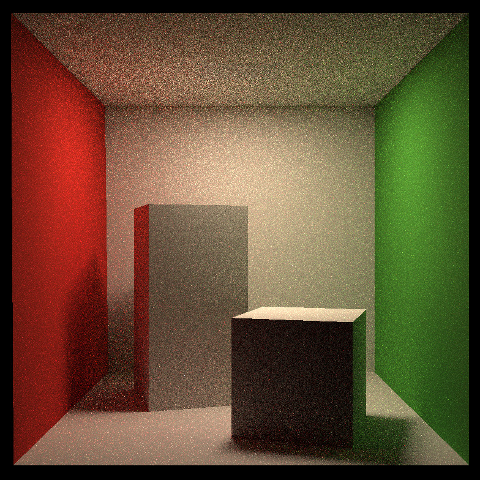
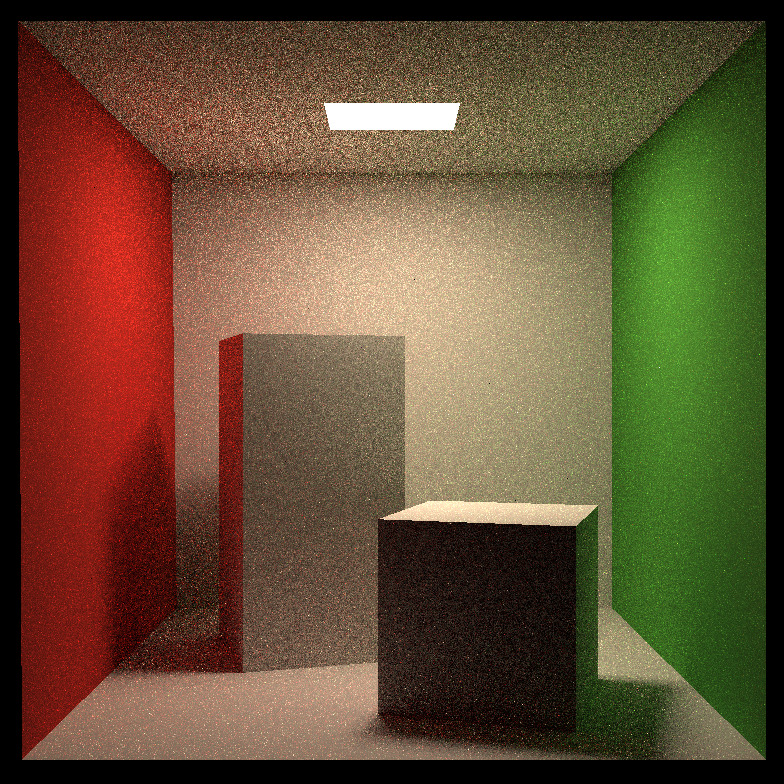

