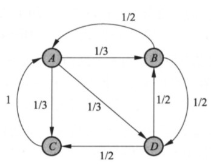
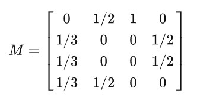
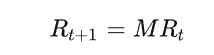
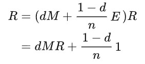
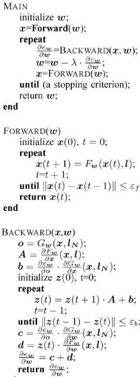
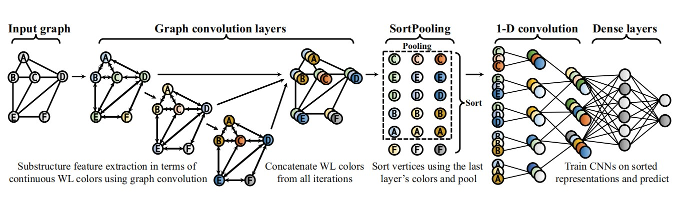
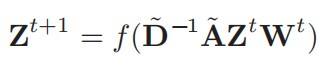
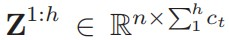

# 前言
图作为重要的数据结构，可以表示物体与物体之间的关系，这里总结一下图的深度学习中经常提到的图嵌入（图表示学习/Network Embedding/Graph Embedding）和图神经网络（GNN）。
<!--more-->
图嵌入和图神经网络是有交集的两个研究领域，并且密切相关。其中图神经网络是随深度学习发展提出的用于处理图数据的神经网络结构，而图嵌入旨在将图的节点表示成低维向量空间，同时保留图的拓扑结构和节点信息，便于用简单的机器学习算法处理。图神经网络又同时可以支持图嵌入的工作，即图嵌入的深度学习方法。  

本文中会介绍图嵌入的常见算法，以及图神经网络的结构。
# 图嵌入
在研究社交网络这样比较稀疏的图时，如果直接使用邻接矩阵花费|*V*|*|*V*|的存储空间，显然会造成浪费，数据的稀疏使得邻接矩阵的信息很难得到利用。

因此图嵌入用来学习得到网络中节点的低维向量表示，即图嵌入对每个节点*v*进行学习，得到一个向量*R*，然后提供给其他方法对数据进行处理。

一般图嵌入的方法可以大致分为三类，(1)Matrix Factorization，(2)Random Walk，(3)Deep Learning。这里着重写一下基于第二种方法的Node2vec算法。

## Matrix Factorization 矩阵分解
通过矩阵分解的方式得到每个结点的低维向量表示。

## Random Walk 随机游走
这种方法通过在图上的短距离游走，使得共现的节点具有相似的表示方式，从而优化节点的嵌入。
### PageRank
该算法作为评价互联网网页重要性的算法，对每个代表一个网页的结点给出一个正实数值，作为排序的依据。这实际上是通过在图上定义一阶的马尔可夫链实现的，因为马尔可夫链的状态转移矩阵具有很好的性质，可以找到一个平稳的分布，平稳分布的概率值就是网页的排序依据。
以下图为例，在PageRank中假设一个点转移到与他相邻的结点的概率相等，也就是说一个点转移到任何一个邻居的概率都是这个结点的度的倒数。因此结点j到邻居结点i的概率为1/n，n为i的度；如果一个结点没有出度，那么这个结点的转移概率为0。通过这样的方式定义一个状态转移矩阵M，M[i][j]代表结点j转移到结点i的概率，举例如下：

在t时刻每个结点的概率分布用一个列向量R表示，那么R的更新如下：

当达到平稳分布R的时候，R满足MR=R，这个平稳分布R就是PageRank的值。这就是PageRank的基本定义，但是其实这样的马尔可夫链不一定具有平稳分布，根据定理有强连通且非周期的有向图上定义的随机游走模型，在时间t趋于无穷的时候分布收敛到唯一分布，所以进一步推广。
如果导入平滑项，就是PageRank的一般定义了，可以证明得以下形式的马尔可夫链具有唯一分布：

其中，阻尼因子d越接近1，越按照转移矩阵进行；越接近0，随机游走越以等概率访问各个结点。1是全1的n维矩阵。这意味着，浏览者以概率d跳转到当前网页连接的其他网页；以概率1-d跳转到完全随机的其他网页(不一定连接到当前网页)，这可以保证平稳分布。

具体计算可以直接按照上式，等R的更新幅度很小，就可以停止迭代了。

### DeepWalk

## Deep Learning

# 图神经网络(GNN)
前面说到，深度学习在发展中才提出了GNN，那是什么导致GNN的出现和发展呢？答案是图这种结构的特殊性。不同于规整的图像等数据，一个图的结构往往是不规则的，并且不同节点之间还有关联，使得以往的深度学习方法没办法很好地用到图上，因此图神经网络应运而生。[这篇文章](https://blog.csdn.net/qq_44186838/article/details/109378474?ops_request_misc=%257B%2522request%255Fid%2522%253A%2522166323184816782395396213%2522%252C%2522scm%2522%253A%252220140713.130102334..%2522%257D&request_id=166323184816782395396213&biz_id=0&utm_medium=distribute.pc_search_result.none-task-blog-2~all~top_positive~default-1-109378474-null-null.142^v47^pc_rank_34_default_23,201^v3^control_2&utm_term=GNN&spm=1018.2226.3001.4187)很好地解释了GNN的计算过程，方便理解。

## 一般GNN(GCN)
GNN的输入一般是图的邻接矩阵A，以及结点的特征矩阵X。现在我们假设要对样本G进行计算，图G并不存在边特征，是一个无向图，要求进行训练并实现图分类。那么使用最简单的GNN，可以用三层网络结构描述，输入层，隐层，输出层，其中输入我们知道是(A,X)，经过隐层计算后输出，现在看看隐层计算什么以及如何计算。

在图神经网络中，对一个结点的更新定义聚合操作，也就是将这个顶点的邻居的特征向量以某种方式汇聚到这个顶点的特征向量上，方法就是使用邻接矩阵A左乘特征矩阵X，并且X还使用了训练参数W进行调整:Z=AXW，相比原始的神经网络，只不过多加了一个邻接矩阵。

此时有两个问题需要解决，一是这样更新以后结点自身的特征向量被忽略了，因此要为邻接矩阵A中的结点增加自环；二是度越大的结点汇聚的特征越多，导致这个值越大，最好进行归一化避免，将特征平均到每个度上，所以还要将每个结点的特征向量除以结点的度。

现在，就得到了隐层的完整计算，Z=inv(D)A'XW，其中inv(D)表示度对角矩阵的逆，A'表示增加了自环的邻接矩阵，X是结点信息矩阵，W是权重矩阵。每次，通过这样的方式前向，并后向传播使用SGD更新权重参数，最后完成网络的训练。当然，结点更新后生成的仍然是和X相同维度的N*M维的结点特征矩阵，其中N是结点数量，M是结点特征的维度。结合前面的嵌入，自然可以想到结点的嵌入向量实际上就在这里用作特征向量。而在实际的工作中，我们把嵌入的向量(Embeedings)称为隐式特征Implicit Feature，如果数据中结点还带有具体的属性(Attributes)，又把这部分叫做Explicit Feature，可以对这两部分特征都进行更新。

那应该如何从特征向量矩阵得到最后需要的任务目标？用全连接神经网络即可，称为局部输出函数，用这个结果来确定误差并反向传播。而反向传播的过程与一般神经网络也类似，但是因为不动点理论和压缩映射，训练目标不是简单的梯度下降算法，理解上不造成影响。

## 多跳邻居的GNN
一般的GNN也可以说是采用直接邻居的GNN，在 *Representation Learning on Graphs with Jumping Knowledge Networks* 一文中，作者将GCN的汇聚范围同Random Walk做对比，说明了GCN的每层网络汇聚就相当于Random Walk多走一步，也就是说一个结点在GNN中进行汇聚，每汇聚一次得到的全局信息就越多。但是这其实有一定缺陷，因为某些结点并不在中心结点的位置，因此它汇聚完成后的特征表示也不应该具有过多的全局信息，而是应该更多保留自身的特征，多层的GNN有可能破坏这样的特征，所以许多人提出了新的方案处理这个问题，本质上就是将每层的信息通过某种方式保留，到训练完成后再选择需要哪层汇聚的信息。
### DGCNN
DGCNN在一般GCN的基础上，加入SrotPooling层依照特征向量对结点进行排序，提取出汇聚信息最多的一部分重要的结点，解决处理图数据时为统一图大小而需要截断邻接矩阵的问题。

输入：邻接矩阵A和信息矩阵X；

卷积层：

拼接：将每次Zt的结果按行拼接起来。每行是结点的特征描述，每列是一个通道。

排序池化层：从最后一列往前，降序排列前K个大的顶点信息，并输出K个结点的特征描述矩阵。由于是从后往前排序，所以在这个过程中可以将损失梯度传回到前一层的训练，让前一层的参数可以进行训练。作者说这可以类比WL的颜色排序，得到结点的排序和统一大小的卷积后的信息矩阵。在这一层实现了不同层汇聚信息的选择，作者按照降序排列，且论文中设置的最后一层的通道数为1，也就是说作者选择了汇聚信息最多的重要的k个结点的特征进行后面的处理。

CNNs：
将前面得到的矩阵展成一列，也就是将每行拼接起来转置。用一维的CNN训练(为了学习结点的信息维度添加了一些)，结果用全连接层激活进行分类。

贡献：实现了图端到端的分类，处理不规则的图，让CNN能直接应用在图上，并且让结点有一定的顺序让CNN读取，得到更好的结果。作者认为WLNM中为了应用神经网络直接将邻接矩阵截断再训练，可能导致信息丢失，所以通过降序排序池化的方式进行截断，在一定程度上降低了信息的丢失。

作者直接按照每个通道中的大小排序，用WL解释个人感觉比较牵强，实际上就是哪个结点汇聚的更多就提取哪个结点，如果能在卷积或者池化的同时进一步增强这种“重要性”，结果可能会得到提升。后来本人找到一些关于这种思路的论文，为子图赋权或者开发某种衡量结点重要性的指标。

