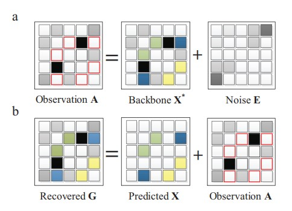
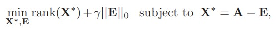
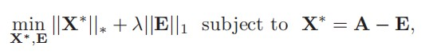
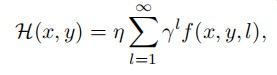
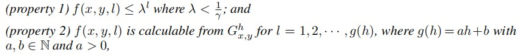
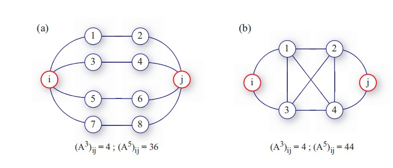

# 前言

这篇博客将会聚焦社交网络中的链路预测问题，导读 *Link prediction via matrix completion* 和 *Link Prediction Based on Graph Neural Networks* 两篇文章中的工作和贡献。  
<!--more-->

# *Link Prediction via Matrix Comletion*
## 贡献
将鲁棒主成分分析法引入到社交网络链路预测中，利用矩阵的稀疏性质和低秩性质，只要社交网络连接地足够紧密（对相对紧密的真实社交网络，对比完全图也是很稀疏的），那么通过RPCA就可以达到较好的预测效果，且对有权和无权网络都适用。

## 理论和方法
对一个社交网络的邻接矩阵 *G* ，提取一定百分比的边作为训练集，剩下的边作为验证集。然后根据RPCA的理论，假设邻接矩阵由两部分组成，一部分是冗余的噪声 *E* ，其中的正项是网络中虚假的连接，负项表示出现在信息矩阵中的缺失连接（通过后面的方法部分会更理解这里）；另一部分是矩阵中鲁棒的信息矩阵 *X** ，包含着整个邻接矩阵的构成信息，并且这部分信息矩阵应该是低秩并且稀疏的（思考一个棋盘格图像，只需要一个秩为2的信息矩阵就能构建任意大小的棋盘格图像）。

因此，社交网络的邻接矩阵 *G* 就可以通过 *E+X* 来表示，如果 *G* 中有缺失的连接，那么它也应当符合信息矩阵传达的矩阵结构，即缺失的连接应该会出现在 *X** 中。然后我们当然就可以通过找到网络的信息矩阵 *X** ，并提取其中新出现的连接 *X*（即预测的链路）来构建一个理想的恢复矩阵 *G** ,表示成 *X+G*。

这几个矩阵之间的关系可以用下图来表示：

（其中观察矩阵A就是上面说的邻接矩阵G，信息矩阵即骨干矩阵*X**，恢复的矩阵G在上面是*G**）

这样一来，只要能够找到从邻接矩阵 G 中提取信息矩阵 *X** 的方法，就能完成链路预测了。这里文中就引入了RPCA方法（不使用PCA是因为文中说PCA面对严重破坏的数据表现不好），由于 *G = E + X** ，并假设 *E* 是稀疏的（稀疏的社交网络中的噪声必然更加稀疏），且 *X** 是低秩的（类比棋盘格图像的信息矩阵，因为包含规整的结构信息并去除了不规整的噪声所以是低秩的），所以将这个问题转化成一个双目标优化问题，目标是在前面等式约束条件下找到参与 *G* 表示的最稀疏的矩阵 *E* 和最低秩的矩阵 *X**。其中参数lamda用来平衡矩阵构成的稀疏性和低秩性。

其中“最稀疏的”用零范数量化，“最低秩的”用矩阵的秩计算来量化。但是由于这个优化问题是NP难且非凸的，所以要进一步松弛零范数为一范数，矩阵的秩计算松弛为核范数，从而得到问题的松弛解。这部分在论文 *鲁棒主成分分析及其应用* 中有更详细的数学理论支持。

找到信息矩阵后，对照原矩阵 *G* 确认多出来的链路，添加到 *G* 上，就恢复得到与原本真实网络足够接近的矩阵 *G** 了，从而完成了链路预测。

值得注意的是，文中还给出了验证预测正确率的方法。恢复完成后的矩阵每项值为邻接矩阵中该项代表的链路产生连接的可能性，由于先前抹去了网络中一定数量的 *L* 个链路作为测试集，所以这里也将所有的链路（可以从恢复的矩阵 *G** 中选也可以单独从预测的链路 *X* 中选择）按照降序排列，验证前 *L* 个链路中有多少个正确的预测，作为预测的正确率。

## 分析
介绍完方法后，文中引用了论文论证使用该方法能预测何种程度的链路缺失。虽然由于网络的稀疏，一般不能满足完全预测恢复的条件，但是所幸社交网络的链路预测并不需要完全精准地恢复矩阵中的所有非零项，因为其中很大一部分仍然是空连接，只有一小部分才是缺失的连接，所以在这种程度上可以忽略（这里不是很明白，原文中说的也比较简略）。

然后提及优化问题中需要确定的超参数lamda，可以通过实验确定，不同的网络会有不同的超参数。

另外，文中还说明了链路预测的时间复杂度为 *O(kn^2)*, *k* 是矩阵的估计秩，且得益于稀疏性，*k* 要比 *n* (矩阵规模)小很多，体现了算法效率的优越性。

最后，文中还给出"global structure"的定义和计算方式，作为一个衡量网络的指标，并说明全局预测方法应当和这个数值g有关。

## 仿真
在不同的真实社交网络上进行对比，得到的结果和其他链路预测方法对比，并计算网络的各种指标，得到了较好的结果。

## 结论与讨论
使用RPCA完成链路预测是比较好的方法，但是该方法有一定缺陷。对于超参数lamda，可以通过实验确定，对于任何网络都可以将其分成测试集和训练集，反复实验确定最好的超参数后再进行链路预测即可。展望后续工作。

# *Link Prediction Based on Graph Neural Networks*
## 贡献
指出启发式预测方法的假设问题，研究一种根据网络自动学习启发式的链路预测方法。首先提出 *γ-decaying* 理论合并所有的启发式方法统一形式，并证明所有启发式计算可以从局部子图近似得到；然后基于该理论支持完成使用 *GNN* 从局部子图学习启发式的方法，结果表明这种方法有很好的链路预测效果。

## 引入
首先介绍启发式链路预测方法，这类方法通过计算结点相似性来作为链路预测的依据，并根据计算方法的最大邻居“跳数”（*hop of neighbors*）可以分为一阶、二阶等。因此定义 *h* 阶的启发式方法为需要得到 *h* 跳邻居信息的方法。高阶的启发式方法或许需要知道整个图的信息。

然后指出这类启发式方法的局限，由于假设性太强，所以某种方法往往只适合某一类网络，不够鲁棒。所以实际上这类方式都属于一种更一般化的类别，图结构特征（*graph structure features*）。这种特征指位于观测的结点和边结构中的特征，能够直接从图中计算出来。所以启发式方法可以看作预先定义的图结构特征，自然会想到能不能自动从网络中学习。前面有人研究过这个问题，也就是 *WLNM* 方法，用全连接神经网络学习节点对，以节点对的 *h* 跳子图作为输入，预测是否会产生连接。

再定义“一跳”的封闭子图，即包含一对结点及其一跳范围内邻居的子图，其包含的信息非常丰富，一阶启发式需要的信息都可以通过这个子图计算。不过对于一些高阶的启发式，看起来似乎需要使用非常高的跳数 *h*，几乎要使用整个网络作为输入。所以通过第一个理论的构建，首先可以证明大多数启发式方法可以用这个理论统一，而且即便是小的 *h* 也能支持计算高阶特征信息，而不用使用庞大的网络。

除此外，还会提出SEAL框架，从封闭子图中学习一般的图的结构特征。这种框架改进了WLNM的缺陷，首先 *GNN* （使用的是卷积图神经网络）代替 *WLNM* 使用的全连接神经网络，改进图特征的获取能力；除此之外，SEAL还允许学习除子图结构外的显式、隐式的结点特征，结合了多种信息。

## 启发式方法的统一理论
所有启发式方法的计算都可以归纳成下面的公式框架：

其中要公式满足：

那么就可以通过第一个公式进行高阶启发式的近似计算（低阶的能直接计算当然不用管）。

接着论证了三种启发式方法都满足这个框架。

这样统一的理论结果框架说明封闭子图中包含的信息已经足够进行近似计算了，因为它表明在好的启发式方法中或许较远的图结构实际上对链路存在的贡献比较小。链路预测中也应当给离目标较远的结构以较小的权重。

综上，只要提取较小的封闭子图，就能精准计算一阶、二阶启发式信息，并近似得到高阶信息。

## SEAL框架
SEAL不限制学习到的特征是某种特定形式，而是直接学习链路预测的一般图结构特征。

步骤是：提取封闭子图；构建信息矩阵；GNN学习。

### 提取子图
信息矩阵是对整体网络结点构建的，对网络中每个边，分为train和test边，对训练的边采用用户定义的h跳数提取子图，边存在则将子图标记为1，否则0，同时提取信息矩阵，将对应结点的信息向量提取出来按列拼接。

### 信息矩阵
关键是构建结点信息矩阵，包含三部分：结构标签(Structural Lable)、点的嵌入(Embeeding)、点的属性(Attributes)。

* 点的结构标签通过提出的 *DRNL* 算法完成，给子图中每个点不同的整数标签值。

* 点嵌入旨在得到点的低维向量表示，使用node2vec算法来获得全图中每个结点的嵌入，然后在提取子图的时候将子图中结点的嵌入向量提取出来。

* 点的显式显式特征向量，可以在数据中给出，并通过独热编码 (*one-hot encoding*) 得到唯一向量表示。

然后将点的隐式特征（Embeedings），显示特征（Attributes），拼接起来（按行拼接，每行是一个结点的信息向量），就得到了信息矩阵。而结构标签可以让GNN分辨哪个是要判断存在性的边。

### GNN学习
使用DGCNN训练，得到分类结果。
作者指出，*DGGNN* （一种图神经网络，SEAL也可使用其他GNN）由于会仅通过拟合结点嵌入中包含的链路存在信息进行快速优化，也就是过拟合，导致泛化性不好，所以通过“负注入”来使 *DGGNN* 不能只拟合这部分信息来分类，在图中加入负连接得到新的图，然后根据新的图再生成嵌入向量，就相当于隐藏了这部分信息，从而提高泛用性。（学习图嵌入可以更好地理解）

## 仿真
在多个网络上进行实验，并同其他方法对比，取得良好结果。

## 结论
自动学习合适的启发式是一个新领域的研究，通过这篇文章提出的理论，首先统一了启发式形式，然后还提出了性能领先的SEAL框架，作者希望SEAL不仅仅在链路预测上有突破，在其他问题上一样能得到应用和推广。

## 思考
* 为什么使用GNN：因为我们将每个子图作为样本进行二分类，子图大小总是不一样，如果使用一般的神经网络需要截断子图的邻接矩阵，可能导致信息丢失；
* 使用负注入：核心是避免过拟合，从而提升泛化性。

# 结点重要性
DGCNN中直接对结点信息通道降序排序，能不能说明汇聚信息更多，或者自身信息较大的结点更重要，如果能在卷积的同时增加这种重要性，就能进一步帮助排序结点。

另外的论文中提到，三阶邻接矩阵包含了大部分二阶的邻接矩阵信息，同时二阶的邻接矩阵在一些情况下又比一阶的邻接矩阵信息多，既然用一阶的矩阵汇聚得到邻居的信息，那么用三阶邻接矩阵进行汇聚，显然包含了一阶汇聚的信息，同时还有更多的连接权重，能不能将这部分作为汇聚的参考，可能需要进一步验证。

另外，子图最大规模是两跳，三阶的邻接矩阵应该会比较符合文中说明的意思，五跳的信息中会有很多冗余，代表紧密的局部连接。如果子图是一跳的，三跳信息就已经比较冗余了。

经过验证以后，这样汇聚的结果还是不理想，比原来的结果低1%左右，原因需要进一步分析，也许使用PageRank等方法对结点排序更有说服力。

# 链路预测评价

## 准确率
计算链路预测正确的比例，直观反应方法性能。

## *AUC metric*
用于衡量一种方法预测存在连接和非存在连接的性能。

