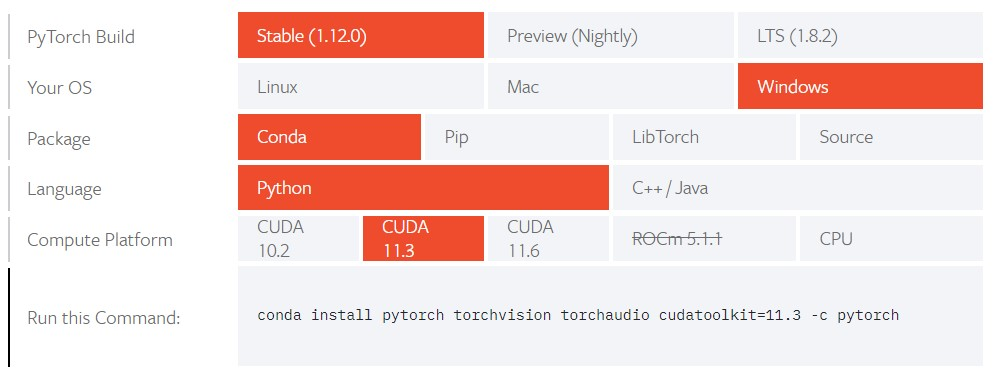
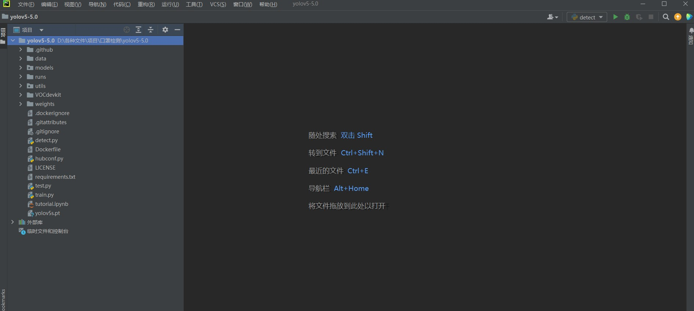
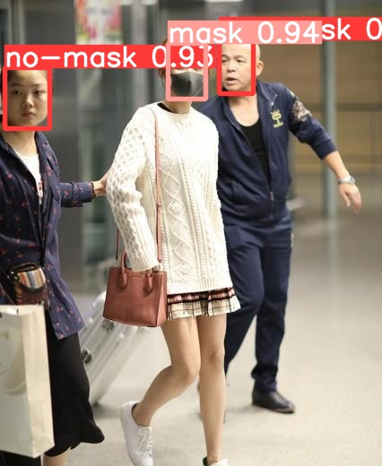

# 前言
这篇文章记录通过使用YOLOv5深度学习框架，对口罩佩戴数据集进行训练，并实现实时检测口罩佩戴情况的过程。  不需要您对深度学习有基础，可以直接快速上手。
<!--more-->
# 介绍
由于竞赛任务，我需要短时间内实现口罩检测算法，最好能够在电脑摄像头中实时检测口罩佩戴情况。  

在没有人工智能基础的情况下，最好的方式就是使用框架。这里有必要大概介绍一下，如果你完全不了解人工智能，那么可以记住机器学习是人工智能的一个子集，而深度学习就是机器学习中最前沿的方法。其中深度指的就是构建神经网络的深度。  

但是不必担心，我们将直接使用经过改进的YOLO算法，作者将这一算法整理成完整的框架，并提供了合适的接口，只要修改配置文件就可以完成基本任务了。  

当然如果你想对这部分理论进行更深层次的研究，也许这篇文章只能让你大致了解使用框架的过程，而非详尽的数学理论。

本文使用的方法为参考另外两篇博客博客总结出来的，如果过程中有疑问可以移步查看。  
[利用yolov5实现口罩佩戴检测算法(非常详细)](https://blog.csdn.net/kushe123/article/details/113702225)  
[目标检测---数据集格式转化及训练集和验证集划分](https://blog.csdn.net/didiaopao/article/details/120022845?spm=1001.2014.3001.5502)  


# 工具
现在，我们先安装YOLOv5框架必要的组件，包括pyhton环境，python包管理工具，YOLOv5项目下载，pyhotn IDE(推荐pycharm)，用于训练数据集的CUDA计算支持和pytorch安装(有必要的话)。  
这里将以我自己安装的版本为例，如有不同需要确认安装版本是否支持。当然也可以完全根据我的版本来，不容易出错。
## Python
如果已经安装了Python环境，可以忽略。在Windows中打开控制台，查看Python版本：
```
C:\Users\16677>python -V
Python 3.7.8
```
如果显示错误，就应该要重新正确安装python。这部分网上有很多教程了，推荐安装3.7以上版本，一般不会导致严重的问题。使用后面介绍的包管理工具也一样能完成python安装。  
## Python包管理工具
Python有很多功能强大的包提供算法或计算支持，庞杂的包管理通常需要安装包管理工具来解决，一般有两个工具要安装，一个是pip，提供轻量级包管理；另一个是Anaconda，除了包管理以外还提供许多必要的强大功能。  

而这两个工具其实不冲突，网上有关于这部分的介绍，感兴趣可以搜索看看。总而言之，pip和conda都可以安装python包，但是最好使用其中一个进行配置，避免重复安装。(实际上我自己安装的时候感觉环境会自动同步)  

之所以安装两个是因为有时候某个工具安装会出错，因此还是有必要的。

安装都比较简单，按照网上教程就行，使用命令查看是否正确安装：
```
C:\Users\16677>pip -V
pip 22.1.2 from d:\program files (x86)\microsoft visual studio\shared\python37_64\lib\site-packages\pip (python 3.7)

C:\Users\16677>conda -V
conda 4.12.0
```
除此之外，安装Ananconda的另一个主要用途是创建虚拟环境，pip需要额外的包才能创建，但conda直接提供了虚拟环境的管理。什么是虚拟环境？因为不同的工程需要不同的python包，如果都安装在源环境中肯定会越来越复杂，导致在你开发分享的时候生成requirements会包含很多不必要的包。而创建虚拟环境就可以避免这个问题，每个虚拟环境都有自己特有的配置，且互不冲突。  

在我们这次配置的时候就可以试着创建一个虚拟环境，再正式安装需要的pyhton包。
## YOLOv5项目下载
[YOLOv5](https://github.com/ultralytics/yolov5)在GitHub上进行了开源，可以通过git克隆或者直接下载的方式得到整个项目文件包，解压后放到自己选的目录。  
也许目录和我的会有所不同，因为YOLO也一直在更新，但是不用担心会出错，正确配置文件路径即可。

## pycharm安装
类似VS，pycharm专用于python的开发环境管理，对工程文件不推荐小型编辑器如VSCode。跟着网上教程就可以安装了。

## CUDA和pytorch(gpu)
前面基本没什么坑，但是这两个要注意一下。

这两个放在一起说，因为gpu版本的pytorch包需要CUDA协助才能工作，安装的时候也要特别注意CUDA版本是否和pytorch版本匹配。

正常来说直接使用pip安装requirements.txt(YOLOv5中的配置要求文件)也可以，当然安装的只是cpu版本的pytorch，计算会相当慢，以我的电脑i5 10200H的CPU根本无法完成训练。如果还是想在自己电脑上跑一次训练，还是有必要使用gpu进行计算。

CUDA是N卡才有的运算平台，可以参考博客[cuda安装](https://blog.csdn.net/qq_42814530/article/details/121716046)完成，注意最好先看看pytorch官网提供的CUDA支持版本再回过头来安装CUDA，相同的版本不容易出错。比如我的显卡是GTX1650Ti，支持到cuda11.7，但是我查看pytorch只有10.0和11.3，所以就安装了11.3。
```
C:\Users\16677>nvcc -V
nvcc: NVIDIA (R) Cuda compiler driver
Copyright (c) 2005-2021 NVIDIA Corporation
Built on Sun_Mar_21_19:24:09_Pacific_Daylight_Time_2021
Cuda compilation tools, release 11.3, V11.3.58
Build cuda_11.3.r11.3/compiler.29745058_0
```

pytorch是常用机器学习库，官网提供的安装方式就是pip和conda。个人推荐使用pip安装。  

这里有的教程还推荐使用清华源进行下载(国内肯定容易下载失败嘛)，不过可能会出问题，有人说清华源的pytorch就是cpu版本而不是gpu版本，但我安装的时候直接使用pip命令使用清华源就成功了，conda同样用清华镜像也可以通过测试，但是就是不能跑YOLO。所以多次尝试后我就推荐在pip中加入清华镜像源，然后直接用官网命令安装就行了。

查看自己pip源：(不是清华源可以自己找方法添加，如果能正常安装也没必要)
```
C:\Users\16677>pip config list
global.cache-dir='D:\\组件\\pip-22.1.2\\cache'
global.index-url='https://pypi.tuna.tsinghua.edu.cn/simple'
```
[pytorch官网](https://pytorch.org/get-started/locally/)命令：(自己看对应什么版本，图片的命令是conda安装，可以在Package一栏选择pip安装命令)
  
正常情况下应该能顺利安装。然后就是测试了，输入conda命令看看版本有没有匹配：(这里已经进入了虚拟环境)
```
(pytorch-gpu) C:\Users\16677>conda list
# packages in environment at D:\anaconda\envs\pytorch-gpu:
#
# Name                    Version                   Build  Channel
……
torch                     1.12.0+cu113             pypi_0    pypi
torchaudio                0.12.0+cu113             pypi_0    pypi
torchvision               0.13.0+cu113             pypi_0    pypi
```
cu113就是CUDA版本支持为11.3，说明应该没有问题，再进一步测试，进入python后导入torch，测试是否可用gpu计算：
```
C:\Users\16677>conda activate pytorch-gpu

(pytorch-gpu) C:\Users\16677>python
Python 3.7.13 (default, Mar 28 2022, 08:03:21) [MSC v.1916 64 bit (AMD64)] :: Anaconda, Inc. on win32
Type "help", "copyright", "credits" or "license" for more information.
>>> import torch
>>> print(torch.cuda.is_available())
True
>>> torch.cuda.device_count()
1
>>> torch.cuda.get_device_name(0)
'NVIDIA GeForce GTX 1650 Ti'
```
如果像上面这样显示，一般就没问题了，其实距离完成整个项目也就成功了大半(永远是第一次配环境最麻烦)。

# YOLOv5
用pycharm打开之前下载的YOLO项目，大概是这个样子：

VOCdevkit文件夹是后面加上的，其他应该都有，没有也不用担心，只要保证路径正确就不会出问题。
现在先熟悉一下项目文件，重点介绍需要使用的文件。
* data文件夹里面有关于超参数的配置文件，例如分类数，分类名称，是我们需要修改的。
* models是关于网络模型的文件夹，YOLOv5在本身算法框架的基础上还诞生了许多特别的网络模型，他们的配置都放在这里，可以进行不同的选择和修改。
* runs是结果，包括训练过程的记录和测试结果，也就是最后在这里查看效果。
* utils是工具函数，不用修改。
* weights是训练完成的权重(如果你了解神经网络就知道是什么)。
* detect.py是测试脚本，可以使用训练完成的权重对图片进行测试验证，结果就生成到runs中。
* train.py是训练数据集的脚本，训练完成后就可以用detect测试效果了。
* requirements.txt是环境配置要求，使用pip对这个文件包含的所有包进行安装，就可以正常运行YOLO了。

有所了解以后，先试试能不能跑YOLO。在pycharm右下角添加配置好的虚拟环境解释器(不做详细介绍，可以百度解决)，然后在终端中测试：
```
PS D:\各种文件\项目\口罩检测\yolov5-5.0> python detect.py
```
如果没有报错，那么会先下载最新的权重(一个pt文件，我们最后要的权重也是这种文件)，最后显示结果的保存位置(runs/detect/exp)，然后查看结果，应该有两张识别好的图片，检测人物和领带，我们最后得到的识别结果也是这个形式。

YOLOv5除了这些简单介绍实际上有很多原理需要了解，本文只介绍配置方法。

# 数据集准备
训练权重之前首先要准备数据集。数据集包含两部分，一是口罩佩戴的图片，而是图片对应的标签。一般来说数据集要自己准备，先找图片，找到足够多的图片了再用某种方式制作标签(例如labelimg)，参考这篇博客教程：[目标检测---利用labelimg制作自己的深度学习目标检测数据集](https://blog.csdn.net/didiaopao/article/details/119808973?spm=1001.2014.3001.5501)。

这里可以直接使用另一位博主标注好的文件：[利用yolov5实现口罩佩戴检测算法(非常详细)](https://blog.csdn.net/kushe123/article/details/113702225)这篇文章中有数据集链接，没有找到可以联系我。

数据标注有三种格式，分别是YOLO标签格式用的txt文件，VOC标签格式用的xml文件，createML标签格式用的json格式。标注完成后要将数据分成训练集和测试机，这里用的数据集已经标注成txt格式了，但是根据这两篇博客中提到的，直接根据txt数据集进行分类不好，训练的时候加载数据会出问题，所以先把标注好的txt转化为xml格式，再根据xml标签进行分类，并最终保存为txt文件。

我使用的代码也来自这篇博客：[目标检测---数据集格式转化及训练集和验证集划分](https://blog.csdn.net/didiaopao/article/details/120022845?spm=1001.2014.3001.5502)，里面介绍了整个的方法，简单来说就是先将txt转化成xml，然后直接将xml划分并保存为txt格式的数据集。这里主要是要注意文件层级，要将这个py文件和数据集文件(也就是VOCdevkit)放在一级，不放也行，但是要注意相对路径和绝对路径写法，该文件夹包含自己新建的VOC2007文件夹，文件夹内还有三个文件如下：
```
    picPath = "VOCdevkit/VOC2007/JPEGImages/"  
    txtPath = "VOCdevkit/VOC2007/YOLO/"  
    xmlPath = "VOCdevkit/VOC2007/Annotations/"  
```
YOLO是txt标签，将下载的数据集里面的标签txt文件移动到这里；JPEGImages中是图片，同样将刚才下载的图片移动到这里。然后就是Annotations，保存转化好的xml文件。除此之外，再把创建的字典改一下，让标签为0的对应没有正确佩戴，为1的对应正确佩戴：
```
dic = {
           '0': "no_mask",  # 创建字典用来对类型进行转换
           '1': "with_mask"  
           }
```

正确修改后保存文件，运行，就可以得到完整的xml标签了，查看文件数量，应该和图片个数一致，这里是7595个。


不过由于其中一个文件标注错了，后面读取数据会报错：
```
KeyError: 'None
```
检查后可以发现是test_306数据的txt标签写成了None，修改成1即可。

完成后再用划分的代码得到训练集和数据集，同样记得把他的分类名改一下，顺序要和上面一致：
```
classes = ["no_mask", "with_mask"]
```
依然将该py文件放在同级目录，终端运行，结束后查看VOCdevkit文件夹，已经自动生成了图片和标签的训练集和测试集。

将整个文件夹放到YOLOv5的项目文件夹中，可以开始准备训练了。

# 训练文件配置
其实口罩检测的任务也比较简单，不用做别的改变，只需要修改下配置文件中的标签和分类数量就行了。
## data配置文件
去data文件夹里面复制一份voc.yaml，重命名为mask.yaml，然后做如下修改： 
```
# download command/URL (optional)
# download: bash data/scripts/get_voc.sh

# train and val data as 1) directory: path/images/, 2) file: path/images.txt, or 3) list: [path1/images/, path2/images/]
train: ../VOCdevkit/images/train/  # 6291 images
val: ../VOCdevkit/images/val/  # 1668 images

# number of classes
nc: 2

# class names
names: [ 'no_mask', 'with_mask' ]
```
## model配置文件
去model文件夹里面复制一份yolov5s.yaml(下载的预训练的权重就是匹配这个模型)，重命名为mask.yaml，修改分类数为2即可：
```
nc: 2  # number of classes
```
## train文件配置
找到train.py提供的接口，需要修改的地方有：

```
预训练权重路径
parser.add_argument('--weights', type=str, default='weights/yolov5s.pt', help='initial weights path')
```
```
模型配置文件修改
parser.add_argument('--cfg', type=str, default='models/mask.yaml', help='model.yaml path')
```
```
数据配置文件修改
parser.add_argument('--data', type=str, default='data/mask.yaml', help='data.yaml path')
```
```
每组训练次数（根据电脑自行配置）
parser.add_argument('--epochs', type=int, default=200)
```
```
每组图片数量（根据电脑自行配置）
parser.add_argument('--batch-size', type=int, default=16, help='total batch size for all GPUs')
```
```
CPU工作核心数量（根据电脑自行配置）
parser.add_argument('--workers', type=int, default=4, help='maximum number of dataloader workers')
```
完成这些后，不出意外可以开始训练了。
# 训练
终端运行train.py，还可能有一些错误：
* pycharm：页面文件太小，无法完成操作  (我这里没有遇到)  
找到utils/datasets.py，修改81行参数为0：
``` 
num_workers=0
```

* 缺少SPFF类  
有些版本的YOLO没有这个类，所以找到新版YOLO的models/conmmon.py文件，将这个类复制到自己项目的common.py文件中去：(位置没有要求，末尾即可)
```
class SPPF(nn.Module):
    # Spatial Pyramid Pooling - Fast (SPPF) layer for YOLOv5 by Glenn Jocher
    def __init__(self, c1, c2, k=5):  # equivalent to SPP(k=(5, 9, 13))
        super().__init__()
        c_ = c1 // 2  # hidden channels
        self.cv1 = Conv(c1, c_, 1, 1)
        self.cv2 = Conv(c_ * 4, c2, 1, 1)
        self.m = nn.MaxPool2d(kernel_size=k, stride=1, padding=k // 2)

    def forward(self, x):
        x = self.cv1(x)
        with warnings.catch_warnings():
            warnings.simplefilter('ignore')  # suppress torch 1.9.0 max_pool2d() warning
            y1 = self.m(x)
            y2 = self.m(y1)
            return self.cv2(torch.cat([x, y1, y2, self.m(y2)], 1))
```
除了这些问题，其他可能就要自己再找找原因了。现在终于可以开始训练，进入目录后在终端输入命令：
```
python train.py
```
然后等待结果就行了，过程中会更新进度。（这里我用cpu跑7000+张图片，显示需要将近十天，所以很不推荐）

# 识别
训练完成后(没完成也行，权重实时更新)，找到runs/train/exp/weights/best.pt，这就是现在最准确的权重文件，就像之前使用detect.py那样，打开detect文件修改权重路径：
```
parser.add_argument('--weights', nargs='+', type=str, default=ROOT / 'best.pt', help='model path(s)')
```
然后修改测试源路径(或者直接把你要测试的图片放到source那里显示的路径中)：
```
parser.add_argument('--source', type=str, default=ROOT / 'data/images', help='file/dir/URL/glob, 0 for webcam')
```
脚本会识别文件夹中包含的所有图片，并将结果放到runs/detect/exp中，我测试的结果如下：

可以看到已经能正确识别了，如果你还想调用摄像头实时检测，那么只需要把source修改成下面这样：
```
parser.add_argument('--source', type=str, default='0', help='file/dir/URL/glob, 0 for webcam')# 调用摄像头
```
然后终端运行py脚本，就完成了。（效果图就不放了）
# 结尾
我只是总结了下网上的教程，方便快速地完成这个项目任务，毕竟写博客肯定有没写到的地方或者没遇到的问题。  

另外整个过程中修改过的配置文件和基本能用的权重pt文件都已经放在GitHub了，点下面的链接就能找到；需要数据集也可以联系我，在第一篇博客中有我的微信。

最后还是感谢文中提到两位博主，可以去看一看他们的文章。

