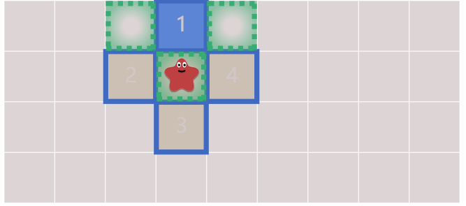
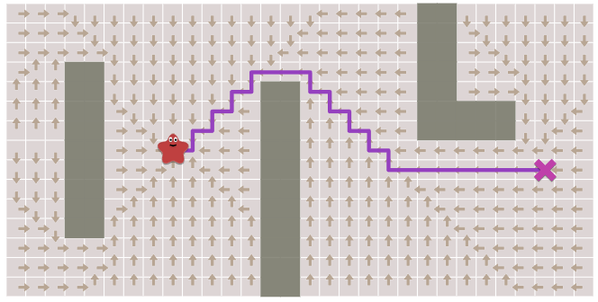
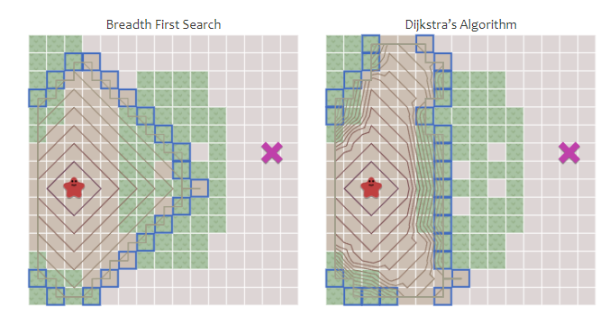
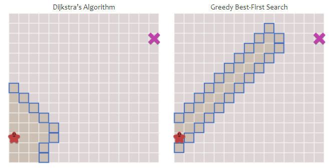
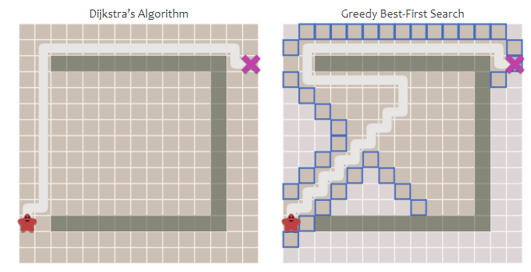
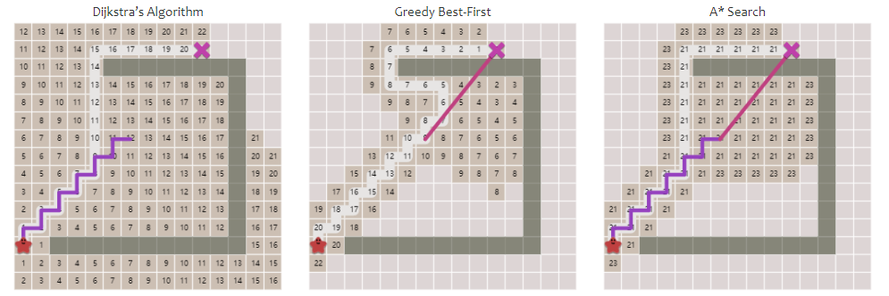

游戏开发经常会问这个问题，因为Unity的导航系统用的是A*算法，并且有时候还需要进一步改进，这里将以这篇[文章](https://www.redblobgames.com/pathfinding/a-star/introduction.html)为主，介绍几种寻路算法算法。

<!-- more -->

# 广度优先

广度优先是最简单的寻路算法了，它从出发点开始，用一个队列存储当前点的邻居点，然后开始迭代，每次出队一个点，再将新点的邻居入队。同时用一个集合存储已经访问过的结点，遍历的时候会跳过这些点避免重复访问。



例如上图中，我们从★源点开始，它的四个邻居标号为1，2，3，4，依次添加到队列中并添加到已访问的结点集合里，然后下一次遍历出队1，将上图中绿色的点入队。不过由于源点已经访问过，所以不会再被入队。伪代码如下：

```
//Declare
Queue<int> q;
Set<int> s;
q.push(start);
s.push(start);
//Start iteration
while(!q.empty())
{
	current = q.pop();
	for(neighbors of current)
	{
		if(s.contain(neighbors) == false)
		{
			q.push(neighbors);
			s.push(neighbors);
		}
	}
}
```

但是仅仅这样不能找到我们是从哪条路过来的，因为广度优先遍历仅仅是遍历，要想找到路径需要我们进一步手动记录。这里我们修改集合s，让它作为一个哈希表或字典，进一步记录访问过的结点的父结点是谁。

```
//Declare
Queue<int> q;
Hash<int> s;
q.push(start);
s[start] = None;
//Start iteration
while(!q.empty())
{
	current = q.pop();
	for(neighbors of current)
	{
		if(s.contain(neighbors) == false)
		{
			q.push(neighbors);
			s[neighbors] = current;
		}
	}
}
```

这样当我们遍历到终点时，就可以不断回溯这个哈希表，找到这条路径。而且由于一个点只对应一个父结点，因此路径是唯一确定的。我们通过下面的伪代码找到路径：

```
current = goal;
path = [];
while(current != start)
{
	path.push(current);
	current = s[current];
}
path.push(start);
//reverse so that the first element is start
path.reverse();
```



# 单源单目标寻路

上面我们能找到的是一个点到其它所有点的路径，然而我们其实并不需要这么做，我们只需要找到目标点的路径。因此上面的算法有太多无效计算。当然可以等找到目标点就马上停止，这也是一种改进方法。

```
//Declare
Queue<int> q;
Hash<int> s;
q.push(start);
s[start] = None;
//Start iteration
while(!q.empty())
{
	current = q.pop();
	//Pay attention here
	if(current == goal) break;
	for(neighbors of current)
	{
		if(s.contain(neighbors) == false)
		{
			q.push(neighbors);
			s[neighbors] = current;
		}
	}
}
```

# 考虑路径花费

现在我们进一步把结点的花费考虑进来，换句话说移动到不同结点的花费是不同的，我们需要找出其中最小的花费。比如文明中，沙漠中移动需要花费一点行动而跨山、森林需要五点。这里我们采用Dijkastra算法，在前面算法的基础上添加一个名为cost的变量来记录当前路径的花费，并且使用优先队列来记录结点。逻辑上也需要改变，不再将所有邻居放入优先队列，还要当这条新的路径优于原本路径时才添加，使得算法不会轻易选择那些花费较大的路径。

```
PriorirtQueue<int> q;
Hash<int> s;
Hash<int> cost;

q.push(start);
s[start] = None;
cost = 0;

while(s.empty() == false)
{
	currnet = s.pop();
	if(current == goal) break;
	
	for(neighbors of current)
	{
		//Calculate new cost
		newcost = cost[current] + graph.cost(neighbors);
		if(s.contain(neighbors) == false || newcost < cost[neighbors])
		{
			cost[neighbors] = newcost;
			q.push(neighbors, newcost);
			s[neighbors] = current;
		}
	}
}
```



跟之前的方法相比，现在遍历扩张就考虑了路径代价。注意我们的优先队列出队应返回最小优先级的对象。这可能跟你之前学习的Dijkastra不太像，这里做了一些改变，但是它们都属于一种贪心，即选择当前耗费最少的路径。

# 启发式方法

启发式指的是人为构造一个公式计算某个数值，这里用来估计当前点到目标点的距离。文章直接使用棋盘距离作为启发式。

```
int heuristic(a,b)
{
	return abs(a.x-b.x) + abs(a.y-b.y);
}
```

我们使用上面的式子修改之前广度优先算法，优先将具有最小估计距离的点拿出来遍历。

```
//Declare
PriorityQueue<int> q;
Hash<int> s;
q.push(start);
s[start] = None;

//Start iteration
while(!q.empty())
{
	current = q.pop();
	if(current == goal) break;
	
	for(neighbors of current)
	{
		if(s.contain(neighbors) == false)
		{
			q.push(neighbors, heuristic(goal, next));
			s[neighbors] = current;
		}
	}
}
```

这样路径搜寻会比Dijkastra算法进一步地优先访问距离目标点近的结点，而不是依靠当前的花费决定，我们的方法现在有了目标感。



然而也带来一个问题，当存在障碍物的时候，这个方法用来导航会走弯路。



当然这是可行的，不过并不正确，我们结合上面这两种方法，就是A star算法。

# A star

A星算法同时考虑当前的花费和与目标的估计值，它的伪代码如下：

```
PriorirtQueue<int> q;
Hash<int> s;
Hash<int> cost;

q.push(start);
s[start] = None;
cost = 0;

while(s.empty() == false)
{
	currnet = s.pop();
	if(current == goal) break;
	
	for(neighbors of current)
	{
		//Calculate new cost
		newcost = cost[current] + graph.cost(neighbors);
		if(s.contain(neighbors) == false || newcost < cost[neighbors])
		{
			cost[neighbors] = newcost;
			//Changed here
			priority = newcost + heuristic(goal, next);
			q.push(neighbors, heuristic);
			s[neighbors] = current;
		}
	}
}
```



A star算法同时将两种距离考虑进去，既不会像Dijkastra那样无目的地搜索，也不会想启发式方法那样找到非最短路径，它被认为是最好的路径搜索算法。
