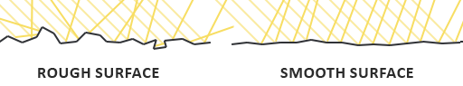
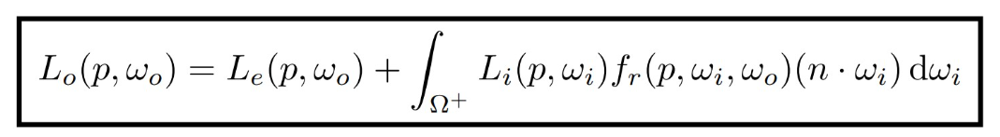
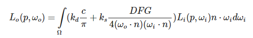
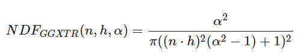
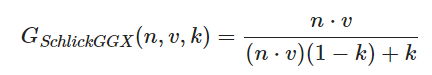
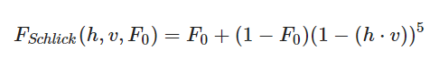
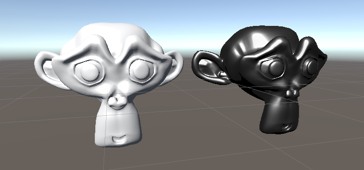
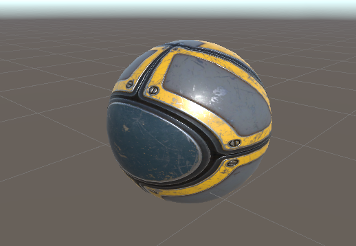

本文将使用Unity Shader实现直接光照(无纹理)的Cook-Torrance模型，该模型是一种常见的PBR渲染，但要注意这里实现的模型是只有直接光照的，这意味着纹理贴图、环境光等内容完全不关心，只了解PBR的光照部分是怎么实现的。

<!--more-->

# 原理

说到这个模型就不得不提到PBR了，PBR就是Physics Based Rendering，基于物理的渲染。虽然它也是上世纪的光照模型，不过从Phong的基础光照到Cook-Torrance代表的PBR光照是巨大的进步，Unity中Standard Shader就是一个完整的PBR实现。

不过要清楚，PBR不仅仅是光照，完整的PBR包括Image Based Lighting，它才是Global Lighting的主要功臣。仅仅是PBR的话，其实我们实现的效果比原来的基础光照没有好特别多，因为没有环境贴图支持IBL。不过也不必担心，IBL的实现比PBR光照要简单多了，实际上IBL也是在PBR光照的基础上采样立方体贴图，所以实现了PBR就可以很轻松地完成IBL。

那么下面我们再梳理一些Cook-Torrance和PBR的关系，PBR是基于物理的渲染，其中有一个非常著名的渲染公式，定义了一个被称为BRDF的函数界定光线照到物体上后，有多少光将会被反射出去。而Cook-Torrance则是在这个BRDF上进行了细致的刻画，通过物理模拟出这个比例函数，于是我们通过解出渲染方程就能得到光照情况。所以下面我们先开始介绍这个著名的渲染方程。

所有的PBR都是基于微平面理论的，必须满足能量守恒，具有物理的BRDF函数。所谓微平面就是将模型表面看成很多微元，也就是我们处理的片元，这可以用来估算平面粗糙对镜面光的影响，我们使用入射方向和观察方向的半程向量来作为量化。



而能量守恒则体现在入射和反射光线的比例，由于折射的存在，反射光线的能量一定会小于入射光线，可以将漫反射看作折射光进入物体后又发散出来的表现。但是对于金属材质，折射光将全部被吸收，因此只会显示镜面光而没有漫反射。因此我们建立一个三种光之间的关系，光线入射后，在物体表面的光只有反射形成的ks部分，折射光则是入射光减去反射光剩下的部分，也就是1-ks。

最后就是BRDF函数了，这里需要了解辐射度量学的基本概念，不再赘述，简单来说我们将一条光线能量量化为Radiance，入射光线为Radiance对方向的积分Irradiance，出射光线为Radiance对片元的积分Radiant Intensity，借此我们可以用公式表达光线的反射过程，这就是渲染方程。



其中Lo表示反射光线，wo表示反射的方向，p是顶点，Le表示自发光，Li表示wi方向过来的入射光线，fr则是BRDF函数，它表示反射光线的比例；最后一项是法线和入射光线的夹角余弦值。后面积分的意义是对正半球上的所有立体角积分，也就是统计所有入射的光线，得该点p上所有到wo方向的反射光线。

一般情况下，该积分没有解析解，所以不得不采用黎曼和的方式多次采样求平均，不过非常幸运，我们使用Unity Shader在可编程管线中操作这个积分是非常方便的，因为根本不用积分！目前我们使用的是平行光，且只有一个物体，那么片元接受的半球积分上就只有光线方向不为0，对这一个方向计算即可。就算使用了多个方向的光源，也不必担心，通过设置正确的LightMode也能轻松解决，Unity将会对多个光源进行相同的Pass。总之，完全不必担心如何积分的问题，我们可以简单地将wi看作入射光的方向，wo则是观察的方向，按照公式计算片元的颜色并返回即可。从这一点看来，cook-Torrance模型确实和之前的基础光照没有多少不同，只不过该模型进一步解释了漫反射和镜面光背后的原理，以及用物理公式而不是经验来模拟它们，所以不管怎么说，此时光照更加真实了。

最后，我们来看看cook-Torrance如何定义BRDF函数的，下面是该模型的渲染方程：



对比上面的一般方程，这里暂不考虑自发光，重点看其中的BRDF函数，前一项为漫反射的比例，c就是漫反射颜色，如果分配后将该值和后面的部分相乘，会发现它其实就是前面基础光照的兰伯特公式，只是多除以了圆周率，因为BRDF积分结果可以看作乘上了pi，我们需要抵消该项。但是我们的具体实现不用积分，所以也并不需要在具体实现中除以pi。kd是漫反射的比例，ks是镜面光比例，它们的和应当为1。

后一项是计算镜面光比例的，D、F、G分别是法线分布函数、菲涅尔方程和几何函数。其中法线分布函数估算法线方向和半程向量一致的微平面的数量，几何函数描述了微平面几何特征，某些光线可能被微平面上的不规则平面遮挡，该函数给出这种遮挡的概率。最后菲涅尔项是描述物理现象的，我们在观察物体表面时，和表面法线的夹角越大，那么反射光线就越强；夹角越小，那么反射光线就越弱。

前两种函数几乎都有不同的实现公式，这里我们选择Trowbridge-Reitz GGX法线分布，Schlick-GGX作为几何函数，它是GGX与Schlick-Beckmann近似的结合体。菲涅尔项一般采用Fresnel-Schlick进行近似计算。



法线分布D如上，其中α表示粗糙程度。



几何函数G如上，其中k也是和粗糙度有关的参数，由于我们这里只有直接光照，所以我们计算k为(α+1)^2/8。注意，如果存在环境贴图，这里的计算需要变化。



最后是菲涅尔项，其中F0是平面的基础反射率，不同材质具有不同的值。最后，我们按照之前Cook-Torrance的公式计算，就是完整的渲染流程了，可以看到实现方式并没有多少不同，我们只是修改了一些公式而已。

不过通常来说，PBR会用到四张不同的纹理，一张规定模型颜色，一张规定高模法线，一张规定金属部分，一张规定粗糙程度，有时还有专门的立方体贴图来保存环境信息，这就是目前常见的渲染过程，但是由于这里是光照部分，所以我们暂时不适用任何贴图，将采用直接光照的方式进行计算。

# 实现

经过前面的讲解，我们可以尝试对该模型进行计算了，先整理下我们需要的参数，由于是光照部分所以暂时不使用纹理，我们仅使用方向光作为光源。计算法线分布函数时，需要一个粗糙度Roughness，法线和半程向量的内积nh；计算几何函数，除前面外需要法线和观察方向的内积nv，法线和光源方向的内积nl；最后菲涅尔项需要半程向量和观察方向的内积vh，以及基础反射率Fresnel。对于反射方程，还需要光源方向、强度，然后还有一个漫反射的比例系数ks。总结下就是需要有三个Properties属性，Roughness，ks，Fresnel，再加一个漫反射颜色Color。

```
Properties {        
        _Color("Color", Color) = (1,1,1,1)         
        fresnel ("Fresnel", Range(0,1)) = 0.5
        roughness ("Roughness", Range(0,1)) = 0.5
        ks("Ks",Range(0,1))=0.5
    }
```

然后依然设置渲染模式为前向光照，在Pass中声明所需要的变量，也就是上面的属性。

```
Tags { "LightMode"="ForwardBase" }

        Pass{
        CGPROGRAM

        #pragma vertex vert
        #pragma fragment frag
        #include "Lighting.cginc" 
        

        float4 _Color;
        float fresnel;
        float roughness;
        float ks;
```

下面再分析着色器的任务，这里肯定选择逐像素渲染了，所以顶点着色器的任务是计算世界空间下的法线和顶点坐标，以及必须的裁剪空间坐标变换。所以我们的顶点着色器和基础光照中使用的完全一致。

```
struct a2f{
            float4 vertex : POSITION;
            float3 normal : NORMAL;
        };

        struct v2f{
            float4 pos:SV_POSITION;
            float4 worldPos:TEXCOORD0;
            float3 worldNormal:TEXCOORD1;
        };

        v2f vert(a2f v){
            v2f o;
            o.pos=UnityObjectToClipPos(v.vertex);
            o.worldPos=mul(unity_ObjectToWorld,v.vertex);
            o.worldNormal=normalize(mul(v.normal,(float3x3)unity_WorldToObject));
            return o;
        }
```

获得信息之后，我们需要在片元着色器中依次获得世界空间下顶点位置，法线，光照方向，观察方向，半程向量，并事先获得nh，vh，nl，nv四个点积方便我们计算BRDF。

```
float4 frag(v2f i) : SV_Target
        {
            float4 worldPos=i.worldPos;
            float3 worldNormal=normalize(i.worldNormal);            
            float3 lightDir = normalize(_WorldSpaceLightPos0.xyz);
            float3 viewDir=normalize(_WorldSpaceCameraPos-worldPos).xyz;            
            float3 halfDir=normalize(viewDir+lightDir);

            float vhDot=saturate( dot(viewDir,halfDir));
            float nhDot=saturate(dot(worldNormal,halfDir));
            float nlDot=saturate(dot(worldNormal,lightDir));
            float nvDot=saturate(dot(worldNormal,viewDir));
            
            //Diffuse
            float3 Idiff=(_Color*_LightColor0*nlDot).xyz;

            //Specular
            float3 Ispec; 
            //F
            float F =pow((1.0-vhDot),5.0);
            F *= (1.0-fresnel);
            F += fresnel;
            //D
            float D = roughness * roughness / pow((nhDot*nhDot)*(roughness*roughness-1)+1,2);
            //G
            float G_k = pow(roughness+1,2)/8;
            float G = nvDot / (nvDot*(1-G_k) + G_k);

            float Rs=saturate((F*D*G)/(nvDot*nlDot));
            Ispec=Rs*_LightColor0*nlDot;

            float3 result=(1-ks)*Idiff+ks*Ispec;
             
            return float4(result,1);
        }
         
        ENDCG
    }
    }
    FallBack "Diffuse"
}
```

注意要用saturate函数截断到[0,1]之间。之后正式计算反射方程，分别按照公式计算代表漫反射的折射和代表镜面光的反射。完整的代码在本文最后。

# 结果

由于材质、环境光的缺失，真正的PBR显然会得到比这要好得多的结果，但是我们可以在另一个略微复杂的模型上看看它们之间的区别，Blinn-Phong模型是难以调节诸多视觉效果的，而Cook-Torrance作为时下流行的实时光照，要显得灵活许多，能适应不同材质、模型的粗糙度，调节镜面光比例，以及针对金属着色的菲涅尔项，因此下面我们试着调整材质面板的参数，得到一个具有金属质感的模型。



左边是我们的Blinn-Phong模型，右边是Cook-Torrance模型，而且要说明的是，上图中我们并没有改变模型的颜色，之所有右边的渲染会显得这么黑是因为我们假定它是一个金属，而金属的折射不会重新散开到模型表面，所以漫反射比例为0；菲涅尔项的基础反射率也被我们调整到0.5，这基本是铁对应的基础反射率，因此可以大概知道生活中铁为什么也比较黑；我们还调整了粗糙度，假定这个金属工艺品具有平滑的表面，所以设定地很小，就得到了上图中的渲染质感。

想要得到其它金属的效果也是可以的，因为金属颜色的不同就体现在菲涅尔项，它们有不同的基础反射率，并且这个反射率应当用RGB的形式表达，否则只能得到黑白灰的线性结果，也就是铁、银这种金属。像金，铜就必须用RGB形式的基础反射率才能得到较好的效果。

当然，在使用我们前面介绍的四组纹理和环境光(基础光照中的Ambient)之后，将得到更加靠近目前渲染的结果，使用Unity的标准着色器就可以看到它的效果，下面是资源商店中的金属球材质，我们看看它的效果。



显然我们实现的Cook-Torrance是一个很简陋的物理光照模型，实现完整的PBR流程还需要伽马矫正，纹理，IBL等相当多的内容，需要进一步学习。在光照模型的发展中，首先是Phong光照模型代表的基础光照，仅仅是一种经验模型，只考虑了局部光照，不具备物理特征；发展到PBR以后考虑了物理实际，并且使全局光照得以发展，得到了更真实的物理光照效果。

# 推荐阅读

这里整理下学习资料。

作为PBR入门来说LearnOpenGL中文站给出的[PBR教程](https://learnopengl-cn.github.io/07%20PBR/01%20Theory/)还是比较容易接受的，缺点是缺少公式推导；这篇[知乎](https://zhuanlan.zhihu.com/p/21376124)讲解了BRDF的由来，推导了Cook-Torrance模型的公式；《Real-Time Rendering 4th》中也有PBR部分教程，有人说是绝世武功，有大量文章索引指导阅读，公式原理都有适合深入学习；GDC，SIGGRAPH等会议也有不错的演讲和文章。

而毛星云大神的博客中还有[PBR白皮书系列](https://zhuanlan.zhihu.com/p/53086060)博客，总结了上面书中的PBR部分和其它论文、会议提到的技术，可惜已经无法再见到更新了...
