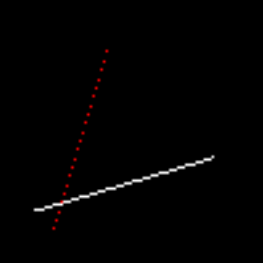
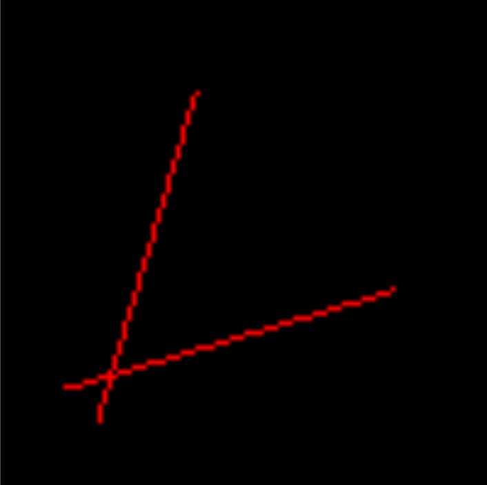
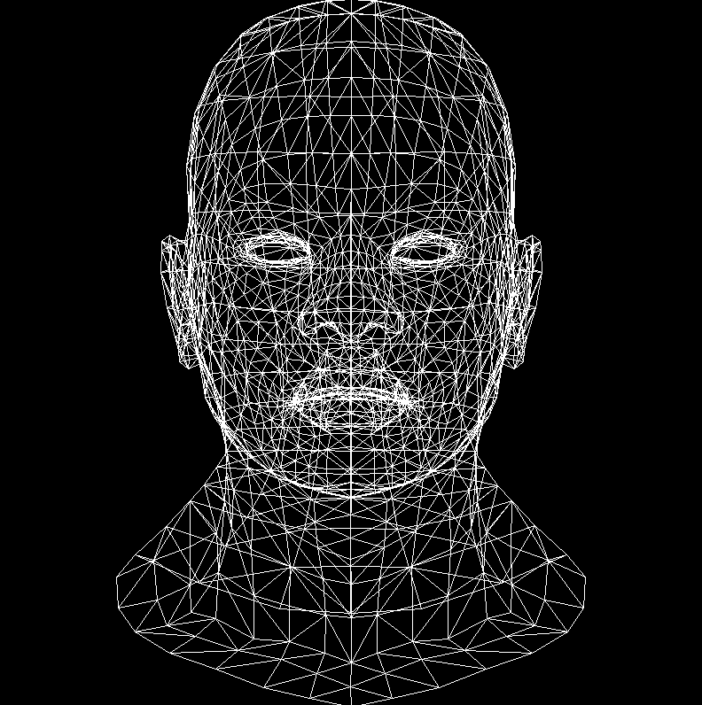

TinyRenderer是一个计算机图形学课程项目，旨在通过500行的C++代码来自行编写一个渲染器，它能够读取模型，应用纹理，基础光照，以便深入理解OpenGL的运行机制，而不是讲述如何编写OpenGL的应用程序。课程共分为九部分，这里我会根据个人学习的进度来划分，学过Games101的朋友上手会很快。

到最后，我们会将整个项目集合成一个类似shader语法的渲染器，你就可以为所欲为了。

<!--more-->

# 课前准备

尽管说是500行就能完成，实际上因为C++不像C#，Python那样有十分方便的库函数，作者也给出了自己编写的工具类，完成三个任务：读取obj模型文件，提供处理二维、三维向量的重载，提供读写tga格式图片的方法。这里我也简单记录一下，看懂语法和逻辑即可。

源文件都可以在作者的[github](https://github.com/ssloy/tinyrenderer/)中找到。

> 8.1更新：作者第一次课程给出的下列文件和后续是不一致的，下面贴的是第一次给出的文件，建议直接使用最终的版本，总的代码在我自己的[github](https://github.com/ANKIIMA/Repeat-for-TinyRenderer)中，我将每节课的主要内容写成单独的class，但是不包括每节课单独的main函数，在博客中大多记录了当时的main，不过完成class后main已经不是难事了，你完全可以自己编写增加理解。

## obj模型的读取

obj是一类最简单的三维模型文件格式，一个立方体的模型文件如下：

```
# Blender v3.1.2 OBJ File: ''
# www.blender.org
mtllib mycube.mtl
o Cube
v 1.000000 1.000000 -1.000000
v 1.000000 -1.000000 -1.000000
v 1.000000 1.000000 1.000000
v 1.000000 -1.000000 1.000000
v -1.000000 1.000000 -1.000000
v -1.000000 -1.000000 -1.000000
v -1.000000 1.000000 1.000000
v -1.000000 -1.000000 1.000000
vt 0.625000 0.500000
vt 0.875000 0.500000
vt 0.875000 0.750000
vt 0.625000 0.750000
vt 0.375000 0.750000
vt 0.625000 1.000000
vt 0.375000 1.000000
vt 0.375000 0.000000
vt 0.625000 0.000000
vt 0.625000 0.250000
vt 0.375000 0.250000
vt 0.125000 0.500000
vt 0.375000 0.500000
vt 0.125000 0.750000
vn 0.0000 1.0000 0.0000
vn 0.0000 0.0000 1.0000
vn -1.0000 0.0000 0.0000
vn 0.0000 -1.0000 0.0000
vn 1.0000 0.0000 0.0000
vn 0.0000 0.0000 -1.0000
usemtl Material
s off
f 1/1/1 5/2/1 7/3/1 3/4/1
usemtl Material.001
f 4/5/2 3/4/2 7/6/2 8/7/2
f 8/8/3 7/9/3 5/10/3 6/11/3
f 6/12/4 2/13/4 4/5/4 8/14/4
f 2/13/5 1/1/5 3/4/5 4/5/5
f 6/11/6 5/10/6 1/1/6 2/13/6
```

文件以行为单位，第一个字符表明该行的用处：

* #开头的表示注释
* mtllib表示外部材质链接库，后面是材质文件的名称
* o表示模型名称
* v表示vertices，顶点，后面三个数字表示顶点坐标
* vt表示顶点的纹理坐标，后面是二维的纹理坐标
* vn表示面法向量，后面是法向量具体的值
* usemtl表示使用材质库中的材质的名称
* s off表示关闭光滑组
* f就是面face，后面每组数字表示一个顶点，正方体每个面有四个顶点所以是四组；其中第一个数字是顶点的编号(从1开始)，第二个是该点对应的vt纹理坐标，第三个是该点对应的vn法向量。

在目前使用的模型中，我们需要的只是渲染某个面，所以仅读取这个面对应的顶点，绘制三角形即可，所以我们只关心f中每个组第一个数字，以及对应顶点的坐标即可。给出读取方法如下：

```C++
Model::Model(const char *filename) : verts_(), faces_() {
    std::ifstream in;
    in.open (filename, std::ifstream::in);
    if (in.fail()) return;
    std::string line;
    while (!in.eof()) {
        std::getline(in, line);
        std::istringstream iss(line.c_str());
        char trash;
        //v开头
        if (!line.compare(0, 2, "v ")) {
            iss >> trash;
            Vec3f v;
            for (int i=0;i<3;i++) iss >> v.raw[i];
            verts_.push_back(v);
        } 
        //f开头
        else if (!line.compare(0, 2, "f ")) {
            std::vector<int> f;
            int itrash, idx;
            iss >> trash;
            //只要每个面三个点的第一个数字，代表顶点序号
            while (iss >> idx >> trash >> itrash >> trash >> itrash) {
                idx--; // in wavefront obj all indices start at 1, not zero
                f.push_back(idx);
            }
            faces_.push_back(f);
        }
    }
    std::cerr << "# v# " << verts_.size() << " f# "  << faces_.size() << std::endl;
}
```

## 几何计算

向量的计算是C++没有提供的，尽管STL提供了一个vector类，仍然没有诸如点乘之类的向量计算，它实际上就是线性表。所以要想处理二维和三维向量，需要使用自己编写的工具类。这里我们要处理的是二维三维向量，代码如下：

```C++
//模板结构体
template <class t> struct Vec2 {
	//union共享三种类型数据
	union {
		struct {t u, v;};
		struct {t x, y;};
		t raw[2];
	};
	//构造函数
	Vec2() : u(0), v(0) {}
	Vec2(t _u, t _v) : u(_u),v(_v) {}
	//内联重载操作符处理二维向量，防止函数栈溢出
	inline Vec2<t> operator +(const Vec2<t> &V) const { return Vec2<t>(u+V.u, v+V.v); }
	inline Vec2<t> operator -(const Vec2<t> &V) const { return Vec2<t>(u-V.u, v-V.v); }
	inline Vec2<t> operator *(float f)          const { return Vec2<t>(u*f, v*f); }
	//友元函数重载<<方便输出
	template <class > friend std::ostream& operator<<(std::ostream& s, Vec2<t>& v);
};

//和上面类似
template <class t> struct Vec3 {
	union {
		struct {t x, y, z;};
		struct { t ivert, iuv, inorm; };
		t raw[3];
	};
	Vec3() : x(0), y(0), z(0) {}
	Vec3(t _x, t _y, t _z) : x(_x),y(_y),z(_z) {}
	inline Vec3<t> operator ^(const Vec3<t> &v) const { return Vec3<t>(y*v.z-z*v.y, z*v.x-x*v.z, x*v.y-y*v.x); }
	inline Vec3<t> operator +(const Vec3<t> &v) const { return Vec3<t>(x+v.x, y+v.y, z+v.z); }
	inline Vec3<t> operator -(const Vec3<t> &v) const { return Vec3<t>(x-v.x, y-v.y, z-v.z); }
	inline Vec3<t> operator *(float f)          const { return Vec3<t>(x*f, y*f, z*f); }
	inline t       operator *(const Vec3<t> &v) const { return x*v.x + y*v.y + z*v.z; }
	float norm () const { return std::sqrt(x*x+y*y+z*z); }
	Vec3<t> & normalize(t l=1) { *this = (*this)*(l/norm()); return *this; }
	template <class > friend std::ostream& operator<<(std::ostream& s, Vec3<t>& v);
};

typedef Vec2<float> Vec2f;
typedef Vec2<int>   Vec2i;
typedef Vec3<float> Vec3f;
typedef Vec3<int>   Vec3i;

template <class t> std::ostream& operator<<(std::ostream& s, Vec2<t>& v) {
	s << "(" << v.x << ", " << v.y << ")\n";
	return s;
}

template <class t> std::ostream& operator<<(std::ostream& s, Vec3<t>& v) {
	s << "(" << v.x << ", " << v.y << ", " << v.z << ")\n";
	return s;
}
```

代码中涉及到使用了模板来实现泛型，使用union共享了三种泛型的数据代表向量的值，还有结构体的构造、析构函数，以及内联运算符的重载。具体内容在代码注释，不懂的可以再搜索关键词。

不过这里好像有点问题，我在使用[]运算符对数据操作时会报错，之后作者换了另一个处理向量的头文件供后续使用，这里篇幅原因也不贴了。

## TGA文件的读写

该读写方法的实现就已经达到四百行的规模了，这里也不打算展开，我自己写了一点简单的注释，感兴趣可以到我github上看一眼，暂时以了解功能为主。

代码提供了图片读写、缩放、翻转，以及最关键的给像素点赋值的功能，翻转主要是因为C++中二维数组存储后从(0,0)开始，写图片是也是从(0,0)开始，该点是图片的左上角，所以经过翻转可以让图片以左下角为原点。

# Lesson1 直线

学习过图形学的朋友都知道著名的Bresenham算法，这里我们也会采用该方法实现，但是能够深入地了解为什么使用它。首先我们自己想办法来画一条直线。

## 自己想方法

通常会想到迭代的方法，由于x，y都是整数坐标，所以我们可以每次让x+1，计算一个t值代表此时x的进度，y更新为y0+t*(y1-y0)，将这些点全部绘制出来即可，这样的话x长度就决定了迭代的时间。最后得到的图片如下(代码不放了，很简单而且也没什么意义研究)：



放大后明显看到，红色的直线中间断开了，白色的直线是符合预期的。原因在于，当斜率超过tan(PI/4)时，起点和重点的y差值大于x的差值，因此以x为标准来绘制就会使得很多同一个x值不同y值的点跳过。所以我们还需要判断一下，当y的差值大于x时，以y为基准即可，做法就是直接交换起点和重点的x和y，这样在后续计算的时候自然绘制的应该是交换后的(y,x)处的像素，不必做其它修改；

除此外，还有一个问题是，如果我们给出的两个点并不都满足从左下到右上角，按照我们这里遍历的逻辑：

```c++
for (int x=x0; x<=x1; x++) 
```

显然当x0>x1时就直接终止了，所以我们还要判断下大小，将较小的值交换到x0处。这样我们绘制的直线就已经完美地符合预期了。



但是为什么最后不适用它呢？

答案是效率，这种方式中频繁使用乘除法和浮点数，导致运算时间很长，使用性能分析工具可以发现：

```
%   cumulative   self              self     total 
 time   seconds   seconds    calls  ms/call  ms/call  name 
 69.16      2.95     2.95  3000000     0.00     0.00  line(int, int, int, int, TGAImage&, TGAColor) 
 19.46      3.78     0.83 204000000     0.00     0.00  TGAImage::set(int, int, TGAColor) 
  8.91      4.16     0.38 207000000     0.00     0.00  TGAColor::TGAColor(TGAColor const&) 
  1.64      4.23     0.07        2    35.04    35.04  TGAColor::TGAColor(unsigned char, unsigned char, unsigned char, unsigned char) 
  0.94      4.27     0.04                             TGAImage::get(int, int)
```

调用line方法的时间占了70%，我们这时就要想办法优化一下了。

## 开始优化

这次我们不计算t了，由于x每次加1，y要不要变化则以当前累加的误差为准，误差每次累加斜率k，当累加达到1就让y变换一次。

```C++
void DrawLine::fourthAttempt(int x0, int y0, int x1, int y1, TGAImage& image, TGAColor color)
{
	bool steep = false;
	if (std::abs(x0 - x1) < std::abs(y0 - y1)) {
		std::swap(x0, y0);
		std::swap(x1, y1);
		steep = true;
	}
	if (x0 > x1) {
		std::swap(x0, x1);
		std::swap(y0, y1);
	}
	int dx = x1 - x0;
	int dy = y1 - y0;
	float derror = std::abs(dy / float(dx));
	float error = 0;
	int y = y0;
	for (int x = x0; x <= x1; x++) {
		if (steep) {
			image.set(y, x, color);
		}
		else {
			image.set(x, y, color);
		}
		error += derror;
		if (error > .5) {
			y += (y1 > y0 ? 1 : -1);
			error -= 1.;
		}
	}
}
```

这样已经明显减少了时间，我们还可以再进一步，将浮点数k也修改下，error直接和dx比较：

```C++
void DrawLine::fifthAttempt(int x0, int y0, int x1, int y1, TGAImage& image, TGAColor color)
{
	bool steep = false;
	if (std::abs(x0 - x1) < std::abs(y0 - y1)) {
		std::swap(x0, y0);
		std::swap(x1, y1);
		steep = true;
	}
	if (x0 > x1) {
		std::swap(x0, x1);
		std::swap(y0, y1);
	}
	int dx = x1 - x0;
	int dy = y1 - y0;
	int derror2 = std::abs(dy) * 2;
	int error2 = 0;
	int y = y0;
	for (int x = x0; x <= x1; x++) {
		if (steep) {
			image.set(y, x, color);
		}
		else {
			image.set(x, y, color);
		}
		error2 += derror2;
		if (error2 > dx) {
			y += (y1 > y0 ? 1 : -1);
			error2 -= dx * 2;
		}
	}
}
```

也许他跟你平常见到的Bresenham算法不太一样，但是原理上就是一致的，在我的另一篇博客《图形学知识目录》收录了几种不同的表示，但根本目的就是避免浮点计算，从而大幅提高运行效率：

```
%   cumulative   self              self     total 
 time   seconds   seconds    calls  ms/call  ms/call  name 
 42.77      0.91     0.91 204000000     0.00     0.00  TGAImage::set(int, int, TGAColor) 
 30.08      1.55     0.64  3000000     0.00     0.00  line(int, int, int, int, TGAImage&, TGAColor) 
 21.62      2.01     0.46 204000000     0.00     0.00  TGAColor::TGAColor(int, int) 
  1.88      2.05     0.04        2    20.02    20.02  TGAColor::TGAColor(unsigned char, unsigned char, unsigned char, unsigned char) 
```

下一次课程我们学习如何绘制并填充一个三角形。现在我们再让它有趣一点，绘制一个人像的线框。使用前面的工具类得到模型的顶点和面信息，然后绘制每个三角形面的三条边即可。由于模型顶点是三维的，我们需要将它转换为二维坐标，方法就是忽略代表深度的Z轴，并将xy值从[-1,1]投影到[0,width-1]和[0,height-1]即可。

```C++
for (int i=0; i<model->nfaces(); i++) { 
    //获取面信息
    std::vector<int> face = model->face(i); 
    //遍历三条边并绘制
    for (int j=0; j<3; j++) { 
        Vec3f v0 = model->vert(face[j]); 
        Vec3f v1 = model->vert(face[(j+1)%3]); 
        int x0 = (v0.x+1.)*width/2.; 
        int y0 = (v0.y+1.)*height/2.; 
        int x1 = (v1.x+1.)*width/2.; 
        int y1 = (v1.y+1.)*height/2.; 
        line(x0, y0, x1, y1, image, white); 
    } 
}
```

将该代码添加到main中，并修改以适应自己的代码，得到下面的结果：


