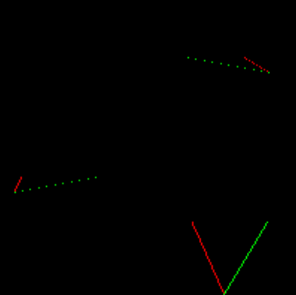
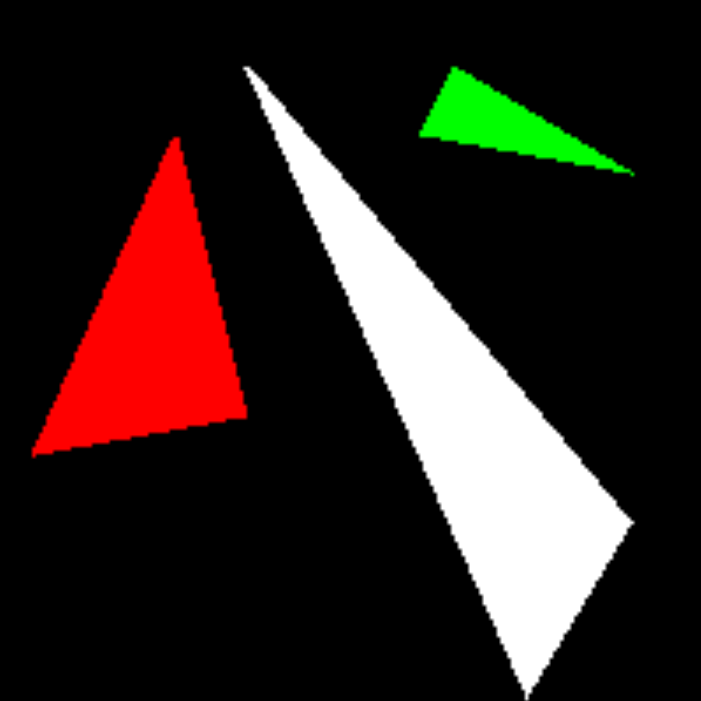
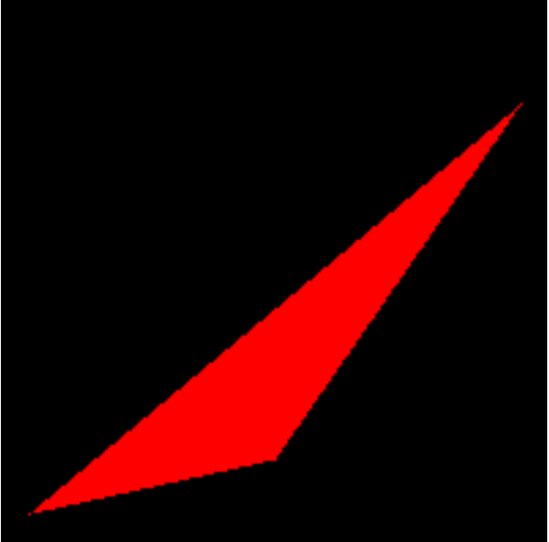
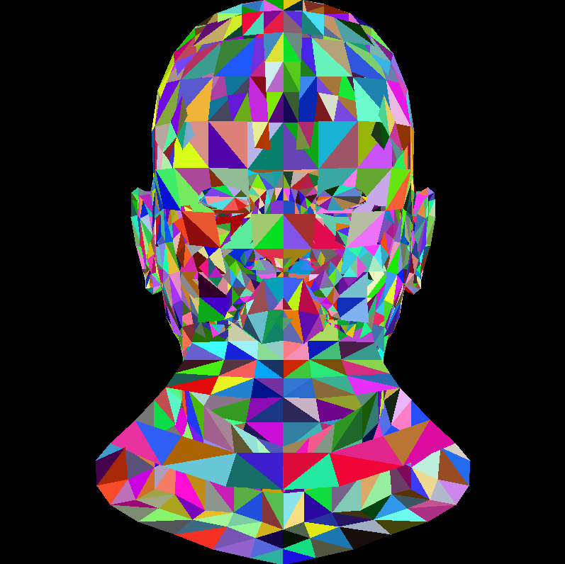
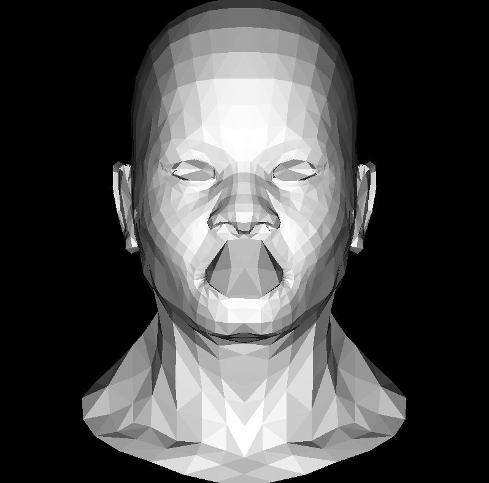

这次课程我们来想办法绘制三角形，也就是著名的光栅化，介绍两种方法实现，扫描线法和重心坐标法。Games101中使用的方法和这里介绍的不同，后面再具体说明。

<!--more-->

# Lesson2 三角形

作为最基本的图形学片元，现在学会绘制三角形可以说就已经学会大半图形学基础内容了。因为所有的模型几乎都是采用三角形作为一个面，哪怕是正方体看起来有六个四边形作为面，实际上四边形也可以拆分成两个三角形，这就是为什么三角形如此重要。

我们先学习如何用扫描线绘制三角形，再看看现在普遍的做法。

## 扫描线法

顾名思义，我们按行绘制三角形像素，因此每次都要确定三角形的边界在哪里。通过观察不难发现，无论三角形怎么摆放，你始终可以将三角形根据过中间顶点的水平线将三角形分成上下两个部分，除非三角形的某条边保持水平，但即便这样我们依然可以采用该方法。

首先回想我们如何绘制直线的，按照行或列的像素进行迭代，并选择较长的一边为基准，现在我们可以通过绘制三角形的边界来找到每一行对应的边界。

注意，此时我们不需要选择较长的一方作为基准了，因为我们后面会完全填充整个三角形，之前画线可能出现的holes也不会是问题。



具体来说，不论输入顺序如何，将y按升序排列，我们按照y值迭代每行像素，根据此时y的大小分别计算从最低点到中间点、最高点两条边的进度alpha和beta，然后计算该行上两条边的x在什么位置，然后从左绘制到右边，就完成了一行三角形的绘制。

当绘制完下半部分，或者下半部分不存在(底边平行的情况)，就要更改计算边界的方式，因为此时要开始绘制另一条边，而最低点到最高点的边还在继续绘制，不用更改，下面是代码：

```C++
void Triangle::old_DrawTriangle(Vec2i t0, Vec2i t1, Vec2i t2, TGAImage& image, TGAColor color)
{
	if (t0.y == t1.y && t0.y == t2.y) return; // I dont care about degenerate triangles 
	if (t0.y > t1.y) std::swap(t0, t1);
	if (t0.y > t2.y) std::swap(t0, t2);
	if (t1.y > t2.y) std::swap(t1, t2);

	int height = t2.y - t0.y;
	for (int i = 0; i < height; i++)
	{
		bool second_half = i >= t1.y - t0.y;
		int currentHeight = second_half ? t2.y - t1.y : t1.y - t0.y;

		//alpha:t0-t2
		//beta:second_half时，i应减去第一段高度并除以第二段的高度
		float alpha = (float)i / height;
		float beta = (float)(i - (second_half ? t1.y - t0.y : 0)) / currentHeight;
		Vec2i A = t0 + (t2 - t0) * alpha;
		Vec2i B = second_half ? t1 + (t2 - t1) * beta : t0 + (t1 - t0) * beta;

		if (A.x > B.x)
		{
			std::swap(A, B);
		}

		for (int j = A.x; j <= B.x; j++)
		{
			image.set(j, t0.y + i, color);
		}
	}

}
```

绘制的三角形如下：



## 重心坐标法

然后我们稍微介绍一下重心坐标，对于平面上一点P，必定有三个数$w_1,w_2,w_3$满足$w_1+w_2+w_3=1$，且$P = w_1*A+w_2*B+w_3*C$，三维向量$(w_1,w_2,w_3)$就是在该三角形上点P的重心坐标。

如果A的质量是$w_1$，B的质量是$w_2$，C的质量是$w_3$，那么在P点提起线来三角形就能平衡住。

重心坐标有很多用处，可以用来计算三角形中各点的各种插值，软光栅化，以及光线追踪，还有这里判断像素点是否在三角形内部。

为什么要判断？该方法的做法是，将三角形的长方形包围盒求出来，我们能快速地找到长方形的左下角和右上角，然后遍历其中每个像素，判断像素是否在三角形中，如果是则光栅化，否则跳过。

给定点P，我们先想办法求出P的重心坐标。根据前面定义我们知道，$w_1=1-w_2-w_3$，又$\vec{AB}=B-A$，可以得到公式$P=A+w_2*\vec{AB}+w_3*\vec{AC}$，P移项到右边：$w_2*\vec{AB}+w_3*\vec{AC}+\vec{PA}=0$，它们全是二维向量，也就是说现在有向量$(w_2,w_3,1)$同时和向量$(\vec{AB_x},\vec{AC_x},\vec{PA_x})$，$(\vec{AB_y},\vec{AC_y},\vec{PA_y})$的点积为零，也就是和这两个向量同时垂直。

所以我们计算后面两个向量的叉乘得到它们的法向量，用z轴的值归一化以后就得到$(w_2,w_3,1)$，那么重心坐标就求出来了。

通过重心坐标的定义可以知道，如果P点在三角形内部，那么$(w_1,w_2,w_3)$应当全部大于0，有一个值等于0说明三角形退化了，小于0说明此时重心在三角形外部。

所以我们通过判断重心坐标的正负就判断了P点的位置。

```C++
Vec3f Triangle::barycentric(Vec2i* pts, Vec2i p)
{
	int ABx = (pts[1].x - pts[0].x);
	int ABy = (pts[1].y - pts[0].y);
	int ACx = (pts[2].x - pts[0].x);
	int ACy = (pts[2].y - pts[0].y);
	int PAx = (pts[0].x - p.x);
	int PAy = (pts[0].y - p.y);

	Vec3f u = Vec3f(ABx, ACx, PAx) ^ Vec3f(ABy, ACy, PAy);

	//z小于1即z=0，此时三角形退化，AB AC在一条直线上
	if (std::abs(u.z) < 1) return Vec3f(-1, 1, 1);

	return Vec3f(1.f - (u.x + u.y) / u.z, u.x / u.z, u.y / u.z);

}
```

在Games101中，做法是采用三个叉积来判断，当然不如这里有效率，但是比较直观，当点在三角形内部，三个顶点和它的连线向量以及三条边向量分别的叉积都大于0，否则不在三角形内部，具体可以查看Games101博客中第二篇。

那么判断三角形内部就有两种方法了，重心坐标法是最快的。

回到三角形的光栅化，你已经学会了最关键的步骤，下面的代码就不是难事了。

```C++
void Triangle::new_DrawTriangle(Vec2i* pts, TGAImage& image, TGAColor color)
{
	Vec2i bboxmin(image.get_width() - 1, image.get_height() - 1);
	Vec2i bboxmax(0, 0);
	Vec2i clamp(image.get_width() - 1, image.get_height() - 1);
	//找到bounding box的大小
	for (int i = 0; i < 3; i++)
	{
		bboxmin.x = std::max(0, std::min(bboxmin.x, pts[i].x));
		bboxmin.y = std::max(0, std::min(bboxmin.y, pts[i].y));

		bboxmax.x = std::min(clamp.x, std::max(bboxmax.x, pts[i].x));
		bboxmax.y = std::min(clamp.y, std::max(bboxmax.y, pts[i].y));
	}

	//逐个判断bbox中的像素是否在三角形中
	Vec2i p;
	for (p.x = bboxmin.x; p.x <= bboxmax.x; p.x++)
	{
		for (p.y = bboxmin.y; p.y <= bboxmax.y; p.y++)
		{
			Vec3f bc_screen = baricentric(pts, p);
			if (bc_screen.x < 0 || bc_screen.y < 0 || bc_screen.z < 0) continue;
			image.set(p.x, p.y, color);
		}
	}

}
```

它得到的效果和刚才我们使用旧方法的效果几乎一致，可以忽略这点略微的不同。


## 绘制模型的线框

下面我们让它变得更有意思一些，作者给出了自己的脸部模型，下面我们将要绘制出脸部的模型面。首先用之前介绍的工具类完成模型顶点和面的提取，由于模型是三维的，这里我们渲染正面就不需要z值了(在这里z轴以屏幕为原点向里)，直接忽略并保存xy。xy转换到屏幕坐标也只需要改变它们的映射空间，从[-1,1]修改到[0,width-1]和[0,height-1]，即加一乘以像素宽度/高度并除以2。

让每个三角形的颜色保持随机，代码如下：

```
for (int i=0; i<model->nfaces(); i++) { 
    std::vector<int> face = model->face(i); 
    Vec2i screen_coords[3]; 
    for (int j=0; j<3; j++) { 
        Vec3f world_coords = model->vert(face[j]); 
        screen_coords[j] = Vec2i((world_coords.x+1.)*width/2., (world_coords.y+1.)*height/2.); 
    } 
    triangle(screen_coords[0], screen_coords[1], screen_coords[2], image, TGAColor(rand()%255, rand()%255, rand()%255, 255)); 
}
```

你需要稍微修改一下以让它适应你自己的代码，得到下面的结果：



它是杂乱无章的，因为没有使用深度测试来消除一些不可见面，渲染完全由顺序主导，下一节我们再解决这个问题。现在我们稍微引入一点光照知识，学过Games101或了解过基础光照的朋友理解起来就很轻松了，这里让光照方向设置为$(0,0,-1)$，也就是垂直屏幕向内，一个面接受的光照强度和该面向外的法向量和光线方向的夹角成反比，也就是点积越大光照越弱。

一个三角形的法向量可以用叉积来计算，这里按照读取出来的顺序计算AC，AB的叉积就是向外的法向量，用它和光照点乘作为光照强度，乘以颜色值。

```C++
Vec3f light_dir(0, 0, -1);

int main(int argc, char** argv) {
	if (2 == argc) {
		model = new Model(argv[1]);
	}
	else {
		model = new Model("obj/african_head.obj");
	}

	TGAImage image(width, height, TGAImage::RGB);
	for (int i = 0; i < model->nfaces(); i++) {
		//存储三个顶点编号
		std::vector<int> face = model->face(i);
		Vec2i screen_coords[3];
		Vec3f world_coords[3];
		for (int j = 0; j < 3; j++) {
			//根据编号返回顶点坐标
			Vec3f v = model->vert(face[j]);
			//转换为二维坐标
			screen_coords[j] = Vec2i((v.x + 1.) * width / 2., (v.y + 1.) * height / 2.);
			world_coords[j] = v;
		}
		Vec3f normal = (world_coords[2] - world_coords[0]) ^ (world_coords[1] - world_coords[0]);
		normal.normalize();

		float intensity = normal * light_dir;
		if (intensity > 0)
		{
			Triangle::new_DrawTriangle(screen_coords, image, TGAColor(intensity * 255, intensity * 255, intensity * 255, 255));
		}
	}

	image.flip_vertically(); // i want to have the origin at the left bottom corner of the image
	image.write_tga_file("output.tga");
	delete model;
	return 0;
}
```

同样记得修改代码以适应自己的部分。得到效果如下：



注意这里我们没有绘制出模型背面的面，因为在上面的代码中，当光照方向和法线方向的点积为负，也就是光线方向和法线方向的夹角超过180度后，我们简单地抛弃了它们，这就是一种简单的背面剔除。同样因为没有深度测试有地方渲染不正确，而且因为没有插值，和前面一样是Flat着色方式，下一次我们将修复这两个问题。
