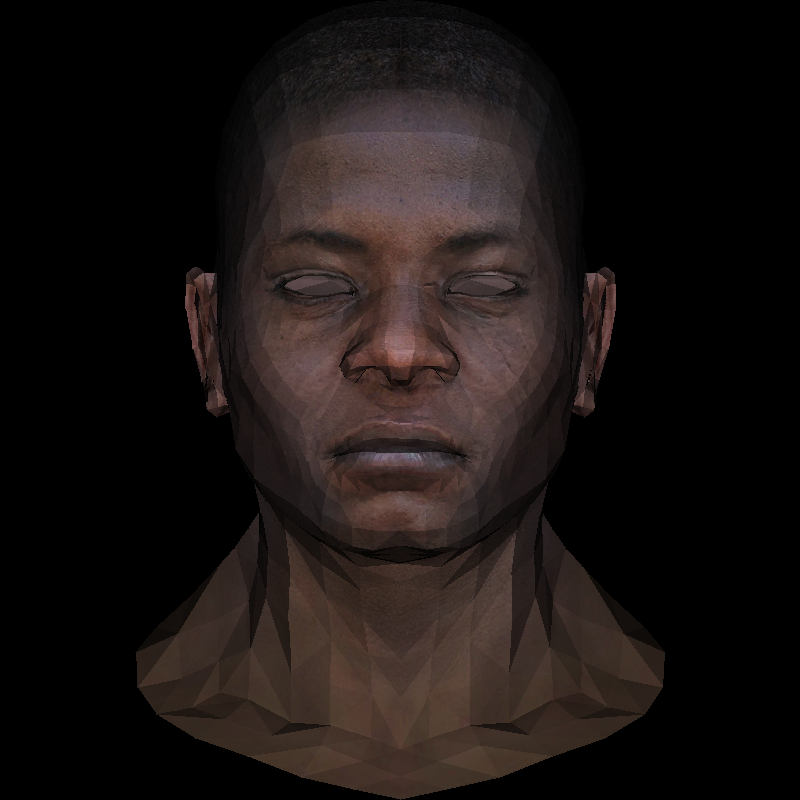

继光栅化之后的一大问题是，如何判断每个面谁被渲染，谁被遮挡。前一节的工作中我们绘制了所有的三角形面，但是并没有判断遮挡关系，也没有插值处理像素，这次我们解决这两个问题。

<!--more-->

# Lesson 3

## Z-buffer

我们的渲染器初具规模，现在终于可以学习大名鼎鼎的Z-buffer了。首先我们先简述一下画家算法，它也是一种判断遮挡关系的简单算法，因为我们绘制是直接对像素进行赋值，所以可以想到从后往前绘制的话就能得到相对正确的渲染结果了。但是为什么说是相对正确呢？看下面这个图片：


如果我们从上往下看这个场景，渲染结果应该是这样的：


发现问题了吗？如果使用画家算法，无法处理两个平面交叉时的情况，因为它们的遮挡关系不是不变的，上图中如果使用画家算法，先绘制红色三角形，然后绘制蓝色三角形，最后绘制绿色三角形，显然绿色三角形将会覆盖蓝色三角形，而不会呈现上图中交叉的正确结果。

因此我们需要采用一个buffer来存储具体像素而不是面的深度信息，以屏幕为原点Z轴正方向向里，在绘制像素时，只有当缓冲区中的深度信息大于像素的深度信息，才允许更新当前像素的颜色和深度值。buffer大小为总的像素数，初始化值为最小值。

```C++
#include "Lesson3.h"

const TGAColor white = TGAColor(255, 255, 255, 255);
const TGAColor red = TGAColor(255, 0, 0, 255);
const TGAColor green = TGAColor(0, 255, 0, 255);
Model* model = NULL;
const int width = 800;
const int height = 800;

Vec3f light_dir(0, 0, -1);

Vec3f world2screen(Vec3f v) {
	return Vec3f(int((v.x + 1.) * width / 2. + .5), int((v.y + 1.) * height / 2. + .5), v.z);
}

int main(int argc, char** argv) {
	if (2 == argc) {
		model = new Model(argv[1]);
	}
	else {
		model = new Model("obj/african_head.obj");
	}
	//初始化深度缓冲
	float* zbuffer = new float[width * height];
	for (int i = width * height; i--; zbuffer[i] = -std::numeric_limits<float>::max());

	TGAImage image(width, height, TGAImage::RGB);

	for (int i = 0; i < model->nfaces(); i++)
	{
		std::vector<int> face = model->face(i);
		Vec3f pts[3];
		for (int j = 0; j < 3; j++)
		{
			pts[j] = world2screen(model->vert(face[j]));
		}
		Triangle_ZBuffer::Triangle(pts, zbuffer, image, TGAColor(rand() % 255, rand() % 255, rand() % 255, 255), width);
	}

	image.flip_vertically(); // i want to have the origin at the left bottom corner of the image
	image.write_tga_file("output.tga");
	
	delete model;
	return 0;
}
```

当然我们修改了一下之前绘制三角形的方法：

```C++
void Triangle_ZBuffer::Triangle(Vec3f* pts, float* zbuffer, TGAImage& image, TGAColor color, int width)
{
	Vec2f bboxmin(std::numeric_limits<float>::max(), std::numeric_limits<float>::max());
	Vec2f bboxmax(-std::numeric_limits<float>::max(), -std::numeric_limits<float>::max());
	Vec2f clamp(image.get_width() - 1, image.get_height() - 1);
	//找到bounding box的大小
	for (int i = 0; i < 3; i++)
	{
		for (int j = 0; j < 2; j++) {
			bboxmin[j] = std::max(0.f, std::min(bboxmin[j], pts[i][j]));
			bboxmax[j] = std::min(clamp[j], std::max(bboxmax[j], pts[i][j]));
		}
	}

	//逐个判断bbox中的像素是否在三角形中
	Vec3f p;
	for (p.x = bboxmin.x; p.x <= bboxmax.x; p.x++)
	{
		for (p.y = bboxmin.y; p.y <= bboxmax.y; p.y++)
		{
			//p点重心坐标
			Vec3f bc_screen = barycentric(pts, p);
			//不在三角形内
			if (bc_screen.x < 0 || bc_screen.y < 0 || bc_screen.z < 0) continue;
			p.z = 0;
			//插值计算p的深度，后面会细说
			for (int i = 0; i < 3; i++) p.z += pts[i][2] * bc_screen[i];
			//深度值大于当前缓存值
			if (zbuffer[int(p.x + p.y * width)] < p.z)
			{
				zbuffer[int(p.x + p.y * width)] = p.z;
				image.set(p.x, p.y, color);
			}
		}
	}
}
```

使用了深度缓冲之后，我们就可以避免之前的错误渲染顺序了，下面是得到的结果：


如果你想使用上次课程中简单的光照模拟自然也不是问题，计算的方法和上次完全一致：

```C++
for (int i = 0; i < model->nfaces(); i++)
	{
		std::vector<int> face = model->face(i);
		Vec3f pts[3];
		Vec3f world_coords[3];
		for (int j = 0; j < 3; j++)
		{
			pts[j] = world2screen(model->vert(face[j]));
			world_coords[j] = model->vert(face[j]);
		}
		Vec3f normal = cross(Vec3f(world_coords[2] - world_coords[0]), Vec3f(world_coords[1] - world_coords[0])).normalize();
		float intensity = normal * light_dir;

		if(intensity > 0)
			Triangle_ZBuffer::Triangle(pts, zbuffer, image, TGAColor(intensity * 255, intensity * 255, intensity * 255, 255), width);
	}
```

完成的效果是下面这样的，对比上次的结果，我们这次把不同的面都正确绘制出来了，尤其是嘴巴。


## 插值计算和纹理

阅读代码后你肯定注意到，前面的部分我们为了获得每个像素单独的深度值，实际上是先计算p的重心坐标，根据这个面上三个顶点的深度值进行插值得到了p点的深度值。这是就不得不说到另一部分重要的知识：纹理。

这里不再具体讲原理了，之前说obj文件格式的时候提到里面存储了一个vt开头的行，就是代表纹理坐标，顶点将读取坐标找到纹理图中的颜色，作为该顶点的颜色。那么有了三个顶点的颜色之后，我们自然可以通过对三个顶点的颜色插值得到像素点的颜色了。注意我们不是对纹理坐标进行插值，我不能确定它是否正确，因为某些模型的纹理坐标并不保证是连续的，对颜色插值是最保险的方法。

这部分是作者给出的作业，并没有实例代码，所以简单说下思路：读取表示obj模型一个面的数据，它的形式大概是：f x/x/x x/x/x x/x/x，第一个x是顶点序号，第二个x是顶点对应的纹理坐标序号，首先要想办法把这个值读出来；之后在main中调用前面写的方法得到纹理坐标，它范围是[0,1]，读取颜色的话需要先用tga读纹理图，出来是一个二维数组，那么纹理坐标的xy分别乘以宽高，得到的就是一个TGAColor值，存储三个顶点的颜色，然后插值，再乘以光照强度，最后就是颜色了。

我们一步一步来实现。

### 读取纹理坐标

Model类中原来只写了读取顶点和边的构造函数，我们修改其中的内容，添加私有变量texcoord_，然后同样构造函数中赋值。注意两个地方，第一由于行开头是vt，trash要收集两次；第二obj文件中纹理坐标还是三维的，只不过第三维是0，所以要声明为Vec3f。

```C++
Model::Model(const char *filename) : verts_(), faces_() {
    std::ifstream in;
    in.open (filename, std::ifstream::in);
    if (in.fail()) return;
    std::string line;
    while (!in.eof()) {
        std::getline(in, line);
        std::istringstream iss(line.c_str());
        char trash;
        if (!line.compare(0, 2, "v ")) {
            iss >> trash;
            Vec3f v;
            for (int i=0;i<3;i++) iss >> v[i];
            verts_.push_back(v);
        } 
        else if (!line.compare(0, 2, "f ")) {
            std::vector<int> f;
            std::vector<int> ft;
            int itrash, idx, texidx;
            iss >> trash;
            //f x/x/x
            while (iss >> idx >> trash >> texidx >> trash >> itrash) {
                idx--; // in wavefront obj all indices start at 1, not zero
                f.push_back(idx);
                ft.push_back(texidx);
            }
            faces_.push_back(f);
            faces_tex_.push_back(ft);
        }
        else if (!line.compare(0, 3, "vt ")) {
            iss >> trash;
            iss >> trash;
            Vec3f vt;
            for (int i = 0; i < 3; i++) iss >> vt[i];
            texcoords_.push_back(vt);
        }
    }
    std::cerr << "# v# " << verts_.size() << " f# "  << faces_.size() << std::endl;
}
```

我增加了两个成员函数：

```C++
	//存储面对应的三个纹理坐标序号
	std::vector<std::vector<int> > faces_tex_;
	//存储纹理坐标
	std::vector<Vec3f> texcoords_;
```

然后给出返回纹理坐标的方法，注意在返回对应纹理坐标序号的纹理坐标时，texidx要减少1，因为obj中序号从1开始，而我们的数组从0开始。

```C++
//返回一个面三个顶点对应的纹理坐标序号
std::vector<int> Model::faceTex(int idx)
{
    return faces_tex_[idx];
}

//返回对应纹理坐标序号的纹理坐标
Vec2f Model::texcoord(int texidx)
{
    return Vec2f(texcoords_[texidx - 1][0], texcoords_[texidx - 1][1]);
}
```

### 返回纹理颜色

阅读TGA读写的方法，其中给出一个get方法用来返回像素(i,j)的颜色，所以我们这里编写一个Texture类，提供返回像素颜色的方法。注意读取图片后我对图片数据进行了垂直反转，因为数据存储颜色从图片的左上角开始，纹理坐标原点是左下角，因此需要将它上下反转。

```C++
//读取纹理图片
Texture::Texture(const char* filename)
{
	texture.read_tga_file(filename);
	texture.flip_vertically();
	width = texture.get_width();
	height = texture.get_height();
}

//返回纹理颜色
TGAColor Texture:: texColor(Vec2f texcoord)
{
	return texture.get(int(texcoord.x * (width)), int(texcoord.y * (height)));
}
```

### 插值计算像素颜色

现在通过调用纹理类，我们可以得到每个面的三个顶点的纹理颜色，对颜色进行插值，最后就能计算当前像素的颜色值了。而插值是在绘制三角形的时候，遍历每个包围盒中的像素，才能得到像素对应的重心坐标，因此现在像素颜色将由绘制三角形的方法决定，我们取消之前传入颜色的做法，将光照强度和该三角形三个顶点的颜色传入，再进行插值。

值得注意的是，常见的方法应该是通过对三个顶点的纹理坐标进行插值，根据插值得到的纹理坐标映射找到纹理颜色，作为像素的颜色。不过这种方法我们后续也会使用，所以这里我选择对颜色进行插值，这种方法得到的结果显然不如纹理映射得到的效果好，特点在于平滑了颜色值。

```C++
#include "Lesson3.h"
#include "texture.h"

const TGAColor white = TGAColor(255, 255, 255, 255);
const TGAColor red = TGAColor(255, 0, 0, 255);
const TGAColor green = TGAColor(0, 255, 0, 255);
Model* model = NULL;
const int width = 800;
const int height = 800;

Vec3f light_dir(0, 0, -1);

Vec3f world2screen(Vec3f v) {
	return Vec3f(int((v.x + 1.) * width / 2. + .5), int((v.y + 1.) * height / 2. + .5), v.z);
}

int main(int argc, char** argv) {
	if (2 == argc) {
		model = new Model(argv[1]);
	}
	else {
		model = new Model("obj/african_head.obj");
	}
	//初始化深度缓冲
	float* zbuffer = new float[width * height];
	for (int i = width * height; i--; zbuffer[i] = -std::numeric_limits<float>::max());

	TGAImage image(width, height, TGAImage::RGB);
	//初始化纹理
	Texture tex("obj/african_head/african_head_diffuse.tga");

	for (int i = 0; i < model->nfaces(); i++)
	{
		//面对应的顶点序号
		std::vector<int> face = model->face(i);
		//面对应的纹理序号
		std::vector<int> faceTex = model->faceTex(i);
		//顶点坐标
		Vec3f pts[3];
		//三个顶点的纹理坐标
		Vec2f ptstex[3];
		Vec3f world_coords[3];
		TGAColor vertColors[3];
		for (int j = 0; j < 3; j++)
		{
			pts[j] = world2screen(model->vert(face[j]));
			ptstex[j] = model->texcoord(faceTex[j]);
			world_coords[j] = model->vert(face[j]);

			vertColors[j] = tex.texColor(ptstex[j]);
		}
		Vec3f normal = cross(Vec3f(world_coords[2] - world_coords[0]), Vec3f(world_coords[1] - world_coords[0])).normalize();
		float intensity = normal * light_dir;

		if(intensity > 0)
			Triangle_ZBuffer::Triangle(pts, zbuffer, image, intensity, width, vertColors);
	}

	image.flip_vertically(); // i want to have the origin at the left bottom corner of the image
	image.write_tga_file("output.tga");
	
	delete model;
	return 0;
}
```

然后记得修改绘制三角形的方法：

```C++
void Triangle_ZBuffer::Triangle(Vec3f* pts, float* zbuffer, TGAImage& image, float intensity, int width, TGAColor* vertColors)
{
	Vec2f bboxmin(std::numeric_limits<float>::max(), std::numeric_limits<float>::max());
	Vec2f bboxmax(-std::numeric_limits<float>::max(), -std::numeric_limits<float>::max());
	Vec2f clamp(image.get_width() - 1, image.get_height() - 1);
	//找到bounding box的大小
	for (int i = 0; i < 3; i++)
	{
		for (int j = 0; j < 2; j++) {
			bboxmin[j] = std::max(0.f, std::min(bboxmin[j], pts[i][j]));
			bboxmax[j] = std::min(clamp[j], std::max(bboxmax[j], pts[i][j]));
		}
	}

	//逐个判断bbox中的像素是否在三角形中
	Vec3f p;
	for (p.x = bboxmin.x; p.x <= bboxmax.x; p.x++)
	{
		for (p.y = bboxmin.y; p.y <= bboxmax.y; p.y++)
		{
			//p点重心坐标
			Vec3f bc_screen = barycentric(pts, p);
			//不在三角形内
			if (bc_screen.x < 0 || bc_screen.y < 0 || bc_screen.z < 0) continue;
			p.z = 0;
			TGAColor curColor(0, 0, 0, 255);
			int count = 0;
			//插值计算p的深度和颜色
			for (int i = 0; i < 3; i++)
			{
				p.z += pts[i][2] * bc_screen[i];
				curColor = curColor + vertColors[i] * bc_screen[i];

			}

			//深度值大于当前缓存值
			if (zbuffer[int(p.x + p.y * width)] < p.z)
			{
				zbuffer[int(p.x + p.y * width)] = p.z;
				image.set(p.x, p.y, curColor * intensity);
			}
		}
	}
}
```

注意，上面我们对TGAColor类型的值使用了+号，文件中没有给出该符号的重载，因此我们也必须手动补充在TGAColor的结构体中：

```C++
 TGAColor operator+(const TGAColor tgacolor) const {
     //默认alpha值是255
        TGAColor res(0,0,0,255);
        for (int i = 0; i < 3; i++)
        {
            res.bgra[i] = this->bgra[i] + tgacolor.bgra[i];
        }
        return res;
    }
```

最后渲染得到的效果就是这样的：


模型还是棱角分明，但如果你看到人物额头部分，就能明白我们已经对三角形进行了平滑，但是由于采样频率太低，也就是每次仅仅对三个顶点的颜色插值，得到的纹理细节不足，单个三角形上能看到平滑的表现，但是不同三角形之间就很难关联了，所以造成这样的结果。对比一下采用坐标插值的结果：



这就是为什么我们要对纹理坐标进行插值，而不是颜色插值。当然对颜色插值或许也有它自己的用途。下节内容我们将回顾MVP变换。
