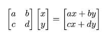
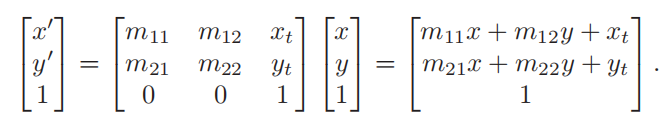
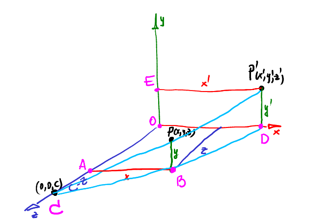
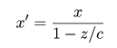
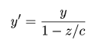
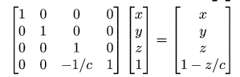
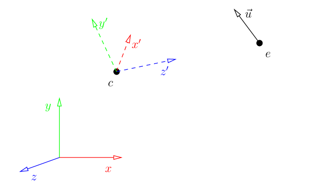
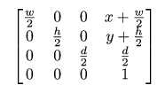

算上Unity Shader部分，这已经是第三次记录MVP变换的内容了，感兴趣可以翻一翻我关于Unity Shader的部分博客，或者其他地方学习。如果你学过Games101或虎书，这也对你不是难事，我将简述Lesson4的内容，然后快速进入实际应用，不在正交视图而是透视图下绘制之前的人头模型。

<!--more-->

# Lesson 4

## 仿射变换与齐次坐标

游戏中我们经常需要对建模的物体进行平移，旋转，缩放的操作，它们统称为仿射变换。使用线性变换矩阵就可以达到目的，假设现在有一个二维的坐标(x,y)，我们通过左乘一个2*2大小的矩阵就能将它进行除平移以外的一切操作，例如旋转、错切、缩放。



其中a，d控制缩放，b，c控制错切，b称为Y沿X方向的错切，c称为X沿Y方向的错切。旋转可以通过Paeth分解为三个错切的组合，而线性变换的乘积可以通过特征值分解或者奇异值分解还原为基本线性变换的组合。不懂的很推荐看看虎书(Fundamentals of Computer Graphics)，里面第六章有详细图文说明。

线性变换是可以通过相同维度的变换矩阵实现的，但是平移不能，想要将坐标整体变化某个值，当然可以直接加减，进一步改写，通过增加一个维度可以用乘法实现平移。因此现在线性变换和平移变换可以采用增加一个维度的方式统一起来，就是齐次坐标，线性变换加一次平移变换称为仿射变换。



齐次坐标除了实现平移外，还能提供一些关于区分点和向量的计算，当z=0，齐次除法以后得到的值无限长，就是一个向量；否则就是一个点。

## Projection

感觉TinyRenderer中讲的不好，有时间还是看看虎书吧。简单来说就是将坐标根据远近进行缩放，如果你之前接触过这方面知识会发现这里少了很多复杂的推导，原因是这里我们直接假定视锥体以原点为中心了，所以不必对视锥体进行平移，缩放也是假定不需要。所以给定一个点P，将它投影到Z=0的平面上，只需要考虑用相似三角形将它的坐标进行一次缩放就行了。



图中三角形ABC和三角形ODC相似，所以 |AB|/|AC|=|OD|/|OC| => x/(c-z) = x'/c，解得x'：



同理得到y'：



用矩阵来表达，变换矩阵就长下面这样：



Lesson4的内容到这里就结束了，都是理论的知识，我还是建议有时间一定要看虎书，不然下次见到那个复杂的透视投影矩阵肯定摸不着头脑，实际上Games101中也进行了一次推导，都可以看看，思考为什么这里的投影矩阵截然不同，毕竟常识中透视投影就和这里一样简洁。

# Lesson 5

## ModelView

第五节内容也差不多，还是MVP变换的内容。不过这里值得一看，因为作者在这里讲解了OpenGL中著名的gluLookAt函数，我们接下来手动编写自己的实现。现在模型的坐标在模型空间中，如果我们想要移动摄像机，等价于反方向移动物体，所以我们假设摄像机是不动的，所有变换均施加在模型自身的坐标上。



那么如果摄像机位于上图中e点，而且我们给定一个向上的方向向量$\vec{u}$，摄像机看向中心点c，它们就是我们需要的全部关键参数。原本的模型坐标系是(x,y,z)，但是由于我们需要从另一个方向观察，就得把该坐标系中的所有坐标变换到新的坐标系(x',y',z')中。

新的坐标系并没有改变原来模型坐标的实际位置，只不过在新的基向量下给出了表示，以c为原点，摄像机在新的基向量(x',y',z')下可以表示为(0,0,e.z)，这就和之前的情况一致了，因此如果要移动摄像机，我们唯一要做的就是将原本的模型变换到新的基向量下。你可以尝试思考移动模型和移动摄像机的区别，从摄像机的视角来看，观察到的图像是一致的。

那如何确定这个变换矩阵？我们用下面的代码来实现：

```C++
void lookat(Vec3f eye, Vec3f center, Vec3f up) {
    Vec3f z = (eye-center).normalize();
    Vec3f x = cross(up,z).normalize();
    Vec3f y = cross(z,x).normalize();
    ModelView = Matrix::identity();
    for (int i=0; i<3; i++) {
        ModelView[0][i] = x[i];
        ModelView[1][i] = y[i];
        ModelView[2][i] = z[i];
        ModelView[i][3] = -center[i];
    }
}
```

我们从模型空间开始，(1,0,0)，(0,1,0)和(0,0,1)分别表示xyz轴，e和c，向量$\vec{u}$的坐标也都表示在模型空间中。首先计算新的坐标空间(x',y',z')，其中z'是从c到e的向量，而x'应该和向量$\vec{z}$以及向量$\vec{u}$都垂直，选择图示方向，计算它们的叉积并归一化即可。最后还要计算y'，你可能疑惑y'为什么不等于向量$\vec{u}$的归一化，原因在于$\vec{u}$并不保证和z轴垂直，它作为向上向量仅提供一个大概的方向，最终它应该位于y'cz'面内，但不一定和y'重合。

现在我们得到了(x',y',z')在(x,y,z)下的表示，要想获得从(x,y,z)到(x',y',z')的线性变换矩阵，仅需要将(x',y',z')三个轴在(x,y,z)下的表示按列排列，得到的4*4矩阵就能让坐标轴完成旋转。别忘了还要将中心点移动到-e，因为把相机移动到e和把模型移动到-e才是等价的，所以还要左乘一个移动-e的平移矩阵。

总之，这一步完成的工作是从模型空间到相机空间的变换，跳过了世界空间，也只是多一次变换的事情。

## Viewport

```C++
//x，y是窗口左下角的位置，w，h定义窗口高度；
//窗口不是我们创建的图片，如果xy都是0，wh等于图片大小
//整个图片将会被用于渲染
Matrix viewport(int x, int y, int w, int h) {
    Matrix m = Matrix::identity(4);
    m[0][3] = x+w/2.f;
    m[1][3] = y+h/2.f;
    m[2][3] = depth/2.f;

    m[0][0] = w/2.f;
    m[1][1] = h/2.f;
    m[2][2] = depth/2.f;
    return m;
}
```

现在到视口了，用投影矩阵对上面变换之后的坐标处理，进行了归一化，坐标范围[-1,1]。现在视口需要缩放坐标到适合屏幕大小，上面的代码转化成矩阵是这样：



三维坐标范围从[-1,1]\*[-1,1]\*[-1,1]被缩放到[x,x+w]\*[y,y+h]\*[0,d]，其中d是z-buffer的深度/分辨率，作者设定为255方便计算，实际上对z的缩放不影响后续深度测试。至于为什么xy不是缩放到[1,w]和[1,h]，这里作者没写，如果对OpenGL不熟悉很容易误导。OpenGL中的视口变换方法为[glViewport(GLint , GLint , GLsizei , GLsizei )](https://www.opengl.org/sdk/docs/man/html/glViewport.xhtml)，前面两个参数对应这里的x和y，实际上是指定了转换后视口的左下角位置(x,y)在窗口中的哪里，它跟我们顶点的坐标没有一点关系！

## MVP变换

介绍了所有的MVP变换矩阵，时候将它们连起来了：

```
Viewport * Projection * View * Model * v
```

v是模型，Model将模型变换到世界坐标中，然后用View在摄像机坐标系的基向量下表达出来(我们的ModelView矩阵同时完成这两步)，然后投影Projection得到归一化的视体，称为裁剪坐标，最后用Viewport矩阵缩放到合适屏幕坐标。

## 法线变换

最后补充一点知识，我们前面知道除了顶点坐标外，一般顶点的法向量也有提供，但是不能用同样的变换矩阵来对法向量进行变换，因为仿射变换之后法向量和顶点或边的垂直关系会被改变，它并没有在垂直这一条件下进行。也就是说仿射变换后的法向量就不是法向量了，它和原本的顶点没有关系，我们的解决办法是计算新顶点对应的法向量，找到新旧法向量之间的关系。

这里不展开说了，在《Unity Shader入门精要》的第四章和虎书都有介绍，网上博客也有很多推导。结论是法向量的变换矩阵为原顶点变换矩阵的逆转置矩阵。

Lesson6中，我们来用上面的方法重构代码，编写自己的渲染器。
