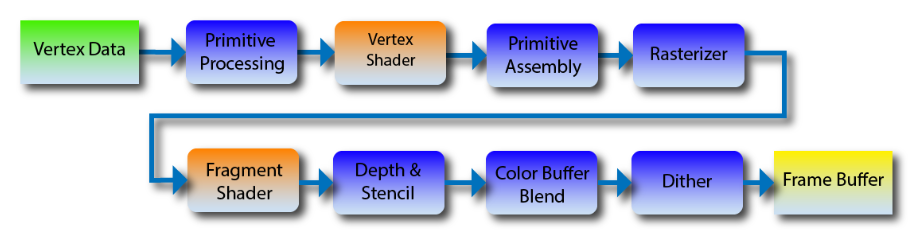
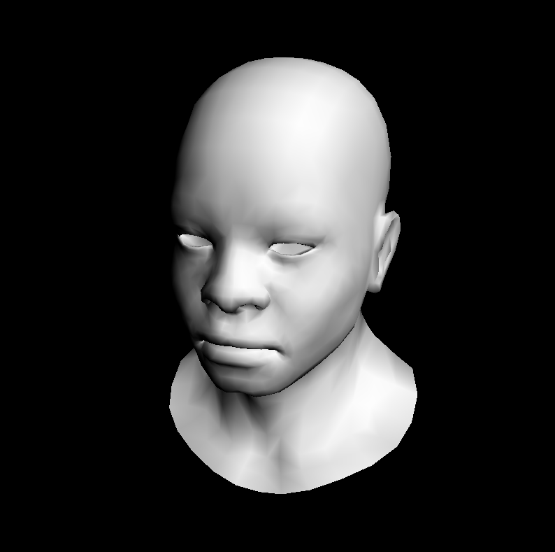
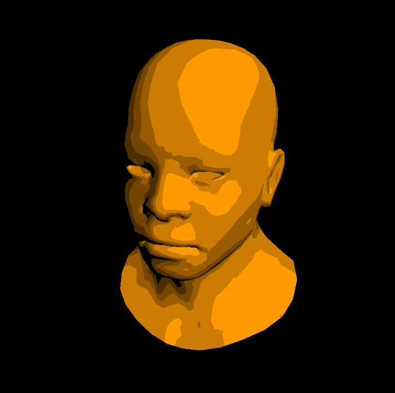
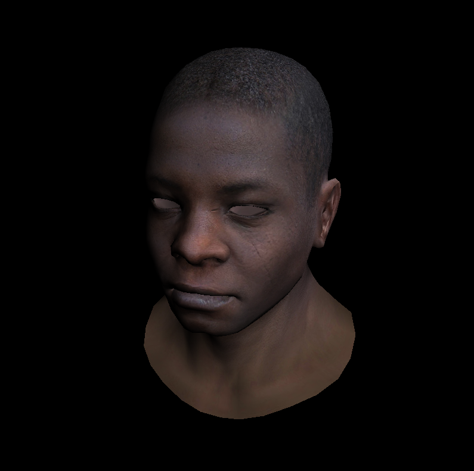
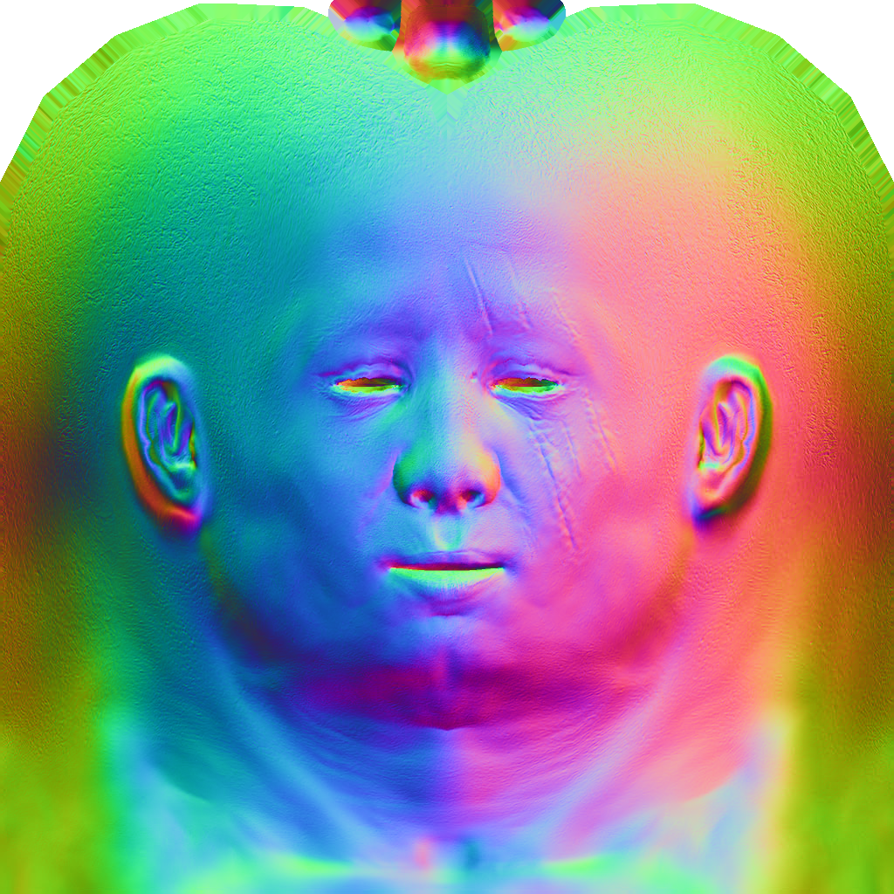
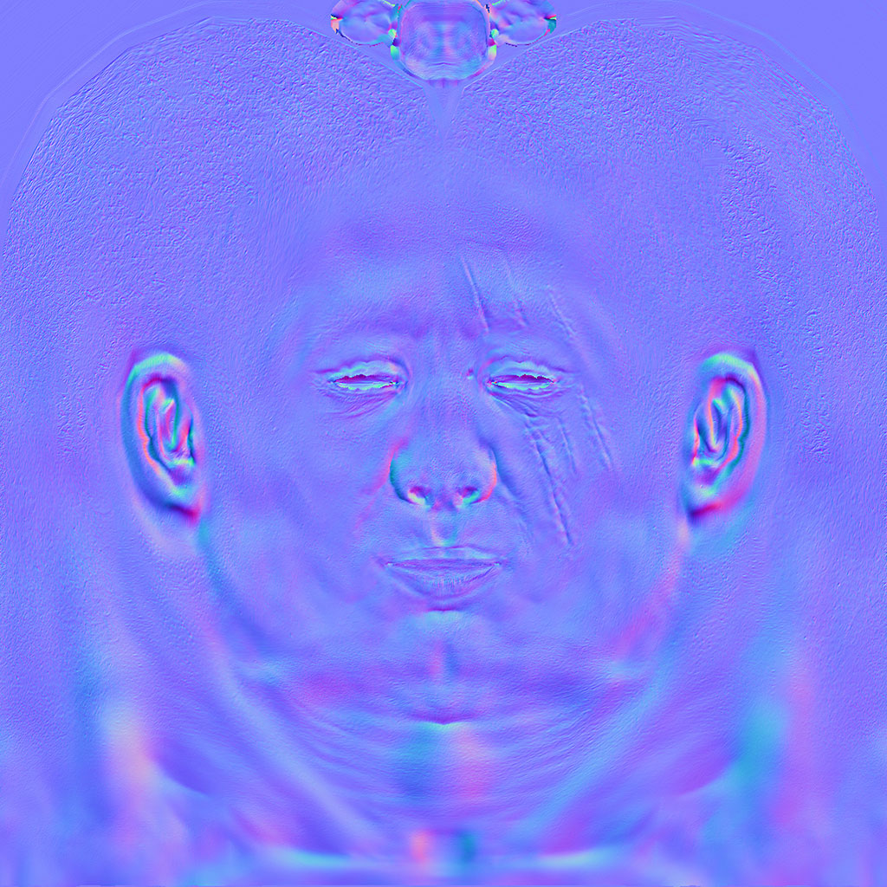
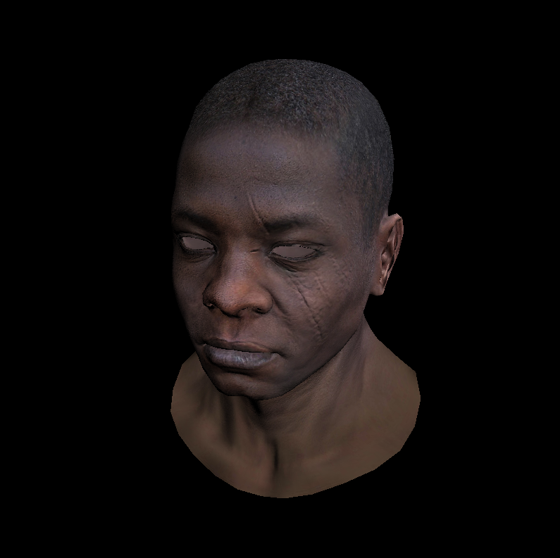
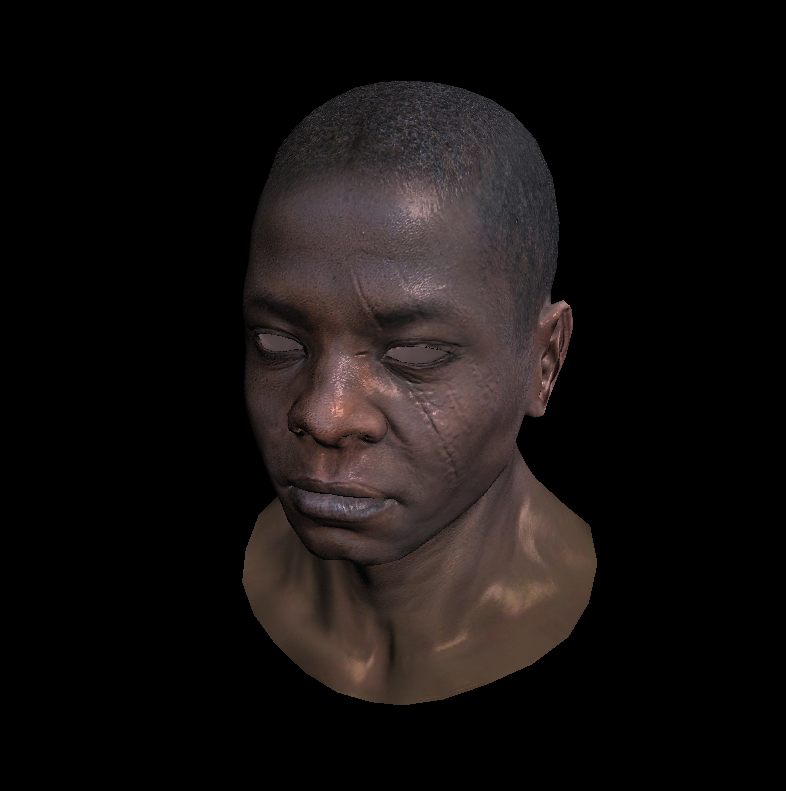

我已经迫不及待进入渲染器的实现了，上一节简述了各种原理，要记住它们十分重要，值得反复理解。接下来的工作就是重构代码，让它更加灵活，更加可用。包括之前一节遗留了一些问题，下面也会做出解释。

<!--more-->

# Lesson 6

话不多说，我们已经掌握编写软渲染器需要的全部知识了(或许有一天还有硬渲染器hh)。现在思考这样一个问题，OpenGL，或者如果你接触过Shader Language，它们是怎样工作的呢？先前我们编写、学习了很多内容，但它们都还没有达到现在我们常说的渲染管线，所以并不具备很好的功能，下面我们来了解并编写我们自己的渲染管线。

## 渲染管线

我们以OpenGL2的渲染管线为例进行说明，实际上其它的Shader、Graphics API也有着差不多的管线，更重要的是它们原理相通。下图是从顶点数据到像素的部分管线(有时还有很多其它步骤或Shaders)。



回想之前我们如何渲染模型，首先读取模型的面，面是一组由顶点序号构成的数组，存储这个面由哪些顶点构成，这些顶点的法线、纹理坐标是多少，它们就是图中的Vertex Data。另外渲染管线中不是所有部分我们都可以进行编程，因为现在为了实现更快速的渲染，有很多部分被设计在硬件之中，它们是不可编程或更改的，对应上图中蓝色部分，所以我们一般无需关心它们。这一点在Unity Shader入门精要中有更通俗的说明。

而Shader就是可编程的一部分管线，它们通常能够提供关键的作用，对它们进行编程就是我们使用图形API或者Shader Language完成的事情了。上图中Rasterizer也是不可编程的，尽管我们之前实现过自己的光栅化，所以你很清楚它的原理。

* Primitive Processing对应我们自己的main函数，它接受顶点数据之后调用Vertex Shader；
* 顶点着色器：计算顶点坐标的转换，以及法线等信息
* Primitive Assembly根据顶点信息将不同顶点组合成一个三角形进行下一步；
* Rasterizer：对三角形进行光栅化，也就是我们编写的Triangles函数，对每一个包围盒中的像素调用片元着色器；
* 片元着色器：Fragment是单个像素对应的一系列数据的计算，包括深度、颜色、法线等；
* Depth & Stencil：简单理解为深度测试即可，牵扯到[进一步的内容](https://blog.csdn.net/sinat_24229853/article/details/48710027)
* Color Buffer Blend：有时还要使用混合处理透明的渲染，对颜色缓存中的内容进行混合操作；
* Dither：抖动，一种图像处理方法；
* Frame Buffer：帧缓存，记录下一帧要显示的像素信息，其实就是颜色。

如果你不理解除了黄色的两个着色器外的内容，都无关紧要，因为它们全部不可编程，等你学会了操作Shader再理解会更好。下面我们就要开始动手了，要重构之前的代码。

## 代码实现

### our_gl

我们把MVP变换、顶点着色器、片元着色器、光栅化程序全都放到这里。讲解在代码注释里。

```C++
#ifndef __OUR_GL_H__
#define __OUR_GL_H__

#include "tgaimage.h"
#include "geometry.h"

//extern关键字声明为全局变量
extern Matrix ModelView;
extern Matrix Viewport;
extern Matrix Projection;

void viewport(int x, int y, int w, int h);
void projection(float coeff=0.f); // coeff = -1/c
void lookat(Vec3f eye, Vec3f center, Vec3f up);

struct IShader {
    virtual ~IShader();
    virtual Vec4f vertex(int iface, int nthvert) = 0;
    virtual bool fragment(Vec3f bar, TGAColor &color) = 0;
};

void triangle(Vec4f *pts, IShader &shader, TGAImage &image, TGAImage &zbuffer);

#endif //__OUR_GL_H__
```

```C++
#include <cmath>
#include <limits>
#include <cstdlib>
#include "our_gl.h"

Matrix ModelView;
Matrix Viewport;
Matrix Projection;

IShader::~IShader() {}

//和之前视口矩阵一样，xy是左下角，wh是宽高
void viewport(int x, int y, int w, int h) {
    Viewport = Matrix::identity();
    Viewport[0][3] = x+w/2.f;
    Viewport[1][3] = y+h/2.f;
    Viewport[2][3] = 255.f/2.f;
    Viewport[0][0] = w/2.f;
    Viewport[1][1] = h/2.f;
    Viewport[2][2] = 255.f/2.f;
}

//之前也说过了，这个系数由物体和摄像机的距离决定
void projection(float coeff) {
    Projection = Matrix::identity();
    Projection[3][2] = coeff;
}

//ModelView变换
void lookat(Vec3f eye, Vec3f center, Vec3f up) {
    Vec3f z = (eye-center).normalize();
    Vec3f x = cross(up,z).normalize();
    Vec3f y = cross(z,x).normalize();
    ModelView = Matrix::identity();
    for (int i=0; i<3; i++) {
        ModelView[0][i] = x[i];
        ModelView[1][i] = y[i];
        ModelView[2][i] = z[i];
        ModelView[i][3] = -center[i];
    }
}

//和我们编写的一致，不用修改
Vec3f barycentric(Vec2f A, Vec2f B, Vec2f C, Vec2f P) {
    Vec3f s[2];
    for (int i=2; i--; ) {
        s[i][0] = C[i]-A[i];
        s[i][1] = B[i]-A[i];
        s[i][2] = A[i]-P[i];
    }
    Vec3f u = cross(s[0], s[1]);
    if (std::abs(u[2])>1e-2) // dont forget that u[2] is integer. If it is zero then triangle ABC is degenerate
        return Vec3f(1.f-(u.x+u.y)/u.z, u.y/u.z, u.x/u.z);
    return Vec3f(-1,1,1); // in this case generate negative coordinates, it will be thrown away by the rasterizator
}

//光栅化器
void triangle(Vec4f *pts, IShader &shader, TGAImage &image, TGAImage &zbuffer) {
    //包围盒
    Vec2f bboxmin( std::numeric_limits<float>::max(),  std::numeric_limits<float>::max());
    Vec2f bboxmax(-std::numeric_limits<float>::max(), -std::numeric_limits<float>::max());
    for (int i=0; i<3; i++) {
        for (int j=0; j<2; j++) {
            bboxmin[j] = std::min(bboxmin[j], pts[i][j]/pts[i][3]);
            bboxmax[j] = std::max(bboxmax[j], pts[i][j]/pts[i][3]);
        }
    }
    Vec2i P;
    TGAColor color;
    //遍历每个像素
    for (P.x=bboxmin.x; P.x<=bboxmax.x; P.x++) {
        for (P.y=bboxmin.y; P.y<=bboxmax.y; P.y++) {
            //计算重心坐标，其中proj<2>是重载的方法，返回对象的前两个值，也就是xy；还有齐次除法
            Vec3f c = barycentric(proj<2>(pts[0]/pts[0][3]), proj<2>(pts[1]/pts[1][3]), proj<2>(pts[2]/pts[2][3]), proj<2>(P));
            //插值得到深度
            float z = pts[0][2]*c.x + pts[1][2]*c.y + pts[2][2]*c.z;
            //插值得到w后面齐次除法
            float w = pts[0][3]*c.x + pts[1][3]*c.y + pts[2][3]*c.z;
            //计算齐次除法后的深度值
            int frag_depth = std::max(0, std::min(255, int(z/w+.5)));
            if (c.x<0 || c.y<0 || c.z<0 || zbuffer.get(P.x, P.y)[0]>frag_depth) continue;
            //对每个片元调用片元着色器
            bool discard = shader.fragment(c, color);
            if (!discard) {
                zbuffer.set(P.x, P.y, TGAColor(frag_depth));
                image.set(P.x, P.y, color);
            }
        }
    }
}


```

### Main

```C++
#include <vector>
#include <iostream>

#include "tgaimage.h"
#include "model.h"
#include "geometry.h"
#include "our_gl.h"

Model *model     = NULL;
const int width  = 800;
const int height = 800;

Vec3f light_dir(1,1,1);
Vec3f       eye(1,1,3);
Vec3f    center(0,0,0);
Vec3f        up(0,1,0);

//本次使用的简单着色器，GouraudShading方式在下面会说
struct GouraudShader : public IShader {
    Vec3f varying_intensity; // written by vertex shader, read by fragment shader

    virtual Vec4f vertex(int iface, int nthvert) {
        //embed扩展数据到4维
        Vec4f gl_Vertex = embed<4>(model->vert(iface, nthvert)); // read the vertex from .obj file
        gl_Vertex = Viewport*Projection*ModelView*gl_Vertex;     // transform it to screen coordinates
        varying_intensity[nthvert] = std::max(0.f, model->normal(iface, nthvert)*light_dir); // get diffuse lighting intensity
        return gl_Vertex;
    }

    virtual bool fragment(Vec3f bar, TGAColor &color) {
        float intensity = varying_intensity*bar;   // interpolate intensity for the current pixel
        color = TGAColor(255, 255, 255)*intensity; // well duh
        return false;                              // no, we do not discard this pixel
    }
};

int main(int argc, char** argv) {
    if (2==argc) {
        model = new Model(argv[1]);
    } else {
        model = new Model("obj/african_head.obj");
    }

    //准备变换矩阵
    lookat(eye, center, up);
    viewport(width/8, height/8, width*3/4, height*3/4);
    projection(-1.f/(eye-center).norm());
    light_dir.normalize();

    //初始化图片和深度缓存
    TGAImage image  (width, height, TGAImage::RGB);
    TGAImage zbuffer(width, height, TGAImage::GRAYSCALE);

    //实例化shader
    GouraudShader shader;
    for (int i=0; i<model->nfaces(); i++) {
        Vec4f screen_coords[3];
        for (int j=0; j<3; j++) {
            //遍历每个顶点，调用shader
            screen_coords[j] = shader.vertex(i, j);
        }
        //光栅化
        triangle(screen_coords, shader, image, zbuffer);
    }

    image.  flip_vertically(); // to place the origin in the bottom left corner of the image
    zbuffer.flip_vertically();
    image.  write_tga_file("output.tga");
    zbuffer.write_tga_file("zbuffer.tga");

    delete model;
    return 0;
}
```

其余的文件都没有改变过，到这里我们编译运行，得到下图的结果：



这里再简单说一下Gouraud Shading，着色方式有三种，其中Flat着色是逐面计算一次光照颜色，Gouraud着色是逐顶点计算一次光照后对顶点颜色插值，Phong着色是插值得到像素的法向量再计算颜色，效果递增，这里就是对顶点计算一次光照，然后插值平滑颜色。

## 修改Shader

### 修改Fragment Shader

当前我们对片元的光照计算是连续的，intensity通过插值进行了平滑。不过在非真实渲染中，通常需要光照强度不那么平滑，我们通过限制光照强度的值来达到这一点：

```C++
    virtual bool fragment(Vec3f bar, TGAColor &color) {
        float intensity = varying_intensity*bar;
        if (intensity>.85) intensity = 1;
        else if (intensity>.60) intensity = .80;
        else if (intensity>.45) intensity = .60;
        else if (intensity>.30) intensity = .45;
        else if (intensity>.15) intensity = .30;
        else intensity = 0;
        color = TGAColor(255, 155, 0)*intensity;
        return false;
    }
```

你可以看到，我们对intensity的范围进行了划分，一共有六种值作为光强，最后得到的效果是：



我们并没有修改其它任何地方，现在你能一定程度上了解着色器有多灵活了吧。

### Texture

还记得我们之前自己实现的纹理吗？当时我们的做法是对颜色进行插值，现在我们来对纹理坐标进行插值，这样能得到更好的效果。当然目前的代码中并没有添加这一部分，我们得自己想办法补充。首先我们得修改着色器结构，让它能够传递纹理坐标：

```C++
struct Shader : public IShader {
    Vec3f          varying_intensity; // written by vertex shader, read by fragment shader
    mat<2,3,float> varying_uv;        // same as above

    virtual Vec4f vertex(int iface, int nthvert) {
        //uv找到顶点纹理坐标，按列赋值给矩阵
        varying_uv.set_col(nthvert, model->uv(iface, nthvert));
        //计算顶点的切线，找到顶点对应的光强
        varying_intensity[nthvert] = std::max(0.f, model->normal(iface, nthvert)*light_dir); // get diffuse lighting intensity
        Vec4f gl_Vertex = embed<4>(model->vert(iface, nthvert)); // read the vertex from .obj file
        return Viewport*Projection*ModelView*gl_Vertex; // transform it to screen coordinates
    }
    
    virtual bool fragment(Vec3f bar, TGAColor &color) {
        float intensity = varying_intensity*bar;   // interpolate intensity for the current pixel
        Vec2f uv = varying_uv*bar;                 // interpolate uv for the current pixel
        color = model->diffuse(uv)*intensity;      // well duh
        return false;                              // no, we do not discard this pixel
    }
};
```

上面的代码中添加了一个2行3列的纹理坐标矩阵，每列是一个顶点的纹理坐标，将它右乘3\*1的重心坐标，插值得到2\*1的片元纹理坐标，然后调用diffuse方法找到纹理颜色，该方法和我们之前实现的方法类似，它直接使用TGAColor中的get方法返回颜色值。效果在下面：



### Normal

除了纹理外，法线贴图也是常见的模型贴图，它能在不改变模型本身几何形状的条件下通过对法线值的修改，影响光照情况的计算，从而让模型看起来凹凸不平，增强立体感。在世界空间下的法线贴图是下面这样的：



它的RGB值存储了该坐标上对应的法线值。但是我们一般使用切线空间下的法线图：



切线空间和世界空间不同，它的z轴和法线方向一致，x轴以建模时uv展开的方向为准，y轴则通过xz的叉积计算。上面图中多数地方是蓝色的，这就是因为多数地方法线的扰动不强，而RGB的B存储的是和法线方向一致的z轴的值，因此多数地方就表现为蓝色，这意味着它们没有受到xy的干扰，xy分量很小。

为什么常用切线空间？相比于世界空间下的法线图，它存储的信息更少了，因为多数地方的扰动都不强。上面的例子中，世界空间下的法线图大小为1.91MB，而切线空间下的法线图为1.68MB，节省了存储空间。

```C++
struct Shader : public IShader {
    mat<2,3,float> varying_uv;  // same as above
    mat<4,4,float> uniform_M;   //  Projection*ModelView
    mat<4,4,float> uniform_MIT; // (Projection*ModelView).invert_transpose()

    virtual Vec4f vertex(int iface, int nthvert) {
        //找到纹理坐标
        varying_uv.set_col(nthvert, model->uv(iface, nthvert));
        Vec4f gl_Vertex = embed<4>(model->vert(iface, nthvert)); // read the vertex from .obj file
        return Viewport*Projection*ModelView*gl_Vertex; // transform it to screen coordinates
   }

    virtual bool fragment(Vec3f bar, TGAColor &color) {
        //插值纹理坐标
        Vec2f uv = varying_uv*bar;                 // interpolate uv for the current pixel
        //使用世界坐标的法线，变换法线到裁剪空间
        Vec3f n = proj<3>(uniform_MIT*embed<4>(model->normal(uv))).normalize();
        //变换光照到裁剪空间
        Vec3f l = proj<3>(uniform_M  *embed<4>(light_dir        )).normalize();
        float intensity = std::max(0.f, n*l);
        color = model->diffuse(uv)*intensity;      // well duh
        return false;                              // no, we do not discard this pixel
    }
};
```

这里我们选择在经过模型、透视变换之后再计算光照情况，但这里的方法并不唯一，一般情况为了方便其它值的计算，我们实际编写Shader的时候直接在世界空间或者切线空间中进行计算，省去了一次变换，最终要的结果是它们两个的点积，所以无论在哪个空间中，它们的余弦值不会改变，得到的效果基本相同，有时因为浮点数之类的精度问题可能有少许差别，但是总体没什么变化。

上面声明了两个uniform变量，它们在GLSL中是一个声明的关键词，允许将常数值传递给Shader使用。这里我们要记得在main中对它们初始化一次，因为它们只需要计算一次即可，正是我们想要的常量。

```C++
	Shader shader;
    shader.uniform_M   =  Projection*ModelView;
    shader.uniform_MIT = (Projection*ModelView).invert_transpose();
```

法线变换就不说了，前面介绍过，使用变换矩阵的逆转置矩阵。



明显看到人物脸上的疤痕变深了，这就是法线贴图的作用，它也被称为Bump Map。

### Phong光照

一切准备就绪，是时候把基础光照补上了。原理还是不介绍，主要说一下Phong和Blinn-Phong的区别，Phong计算反射光的方向，而Blinn-Phong计算半程向量的方向，这里采用Phong光照模型，更复杂的光照建议在Shader中编写，这里以软渲染器实现为主。

另外，这里Specular还是用了高光贴图，像素读取对应的高光值Glossiness作为高光计算的幂次。

```C++
struct Shader : public IShader {
    mat<2,3,float> varying_uv;  // same as above
    mat<4,4,float> uniform_M;   //  Projection*ModelView
    mat<4,4,float> uniform_MIT; // (Projection*ModelView).invert_transpose()

    virtual Vec4f vertex(int iface, int nthvert) {
        varying_uv.set_col(nthvert, model->uv(iface, nthvert));
        Vec4f gl_Vertex = embed<4>(model->vert(iface, nthvert)); // read the vertex from .obj file
        return Viewport*Projection*ModelView*gl_Vertex; // transform it to screen coordinates
    }

    virtual bool fragment(Vec3f bar, TGAColor &color) {
        Vec2f uv = varying_uv*bar;
        Vec3f n = proj<3>(uniform_MIT*embed<4>(model->normal(uv))).normalize();
        Vec3f l = proj<3>(uniform_M  *embed<4>(light_dir        )).normalize();
        Vec3f r = (n*(n*l*2.f) - l).normalize();   // reflected light
        float spec = pow(std::max(r.z, 0.0f), model->specular(uv));
        float diff = std::max(0.f, n*l);
        TGAColor c = model->diffuse(uv);
        color = c;
        for (int i=0; i<3; i++) color[i] = std::min<float>(5 + c[i]*(diff + .6*spec), 255);
        return false;
    }
};
```

和前面一个Shader相比，我们唯一添加的内容就是Specular，原本我们对Phong光照的Ambient，Diffuse，Specular都有直接的输入，不过这里将它们简化成一个浮点数模拟光强，其中反射光线的z值表示反射光是否对准了摄像机，因此可以进一步简化，而没有常规地比较反射光和观察方向的夹角，也能达到不错的效果。

人物现在更加真实了：


