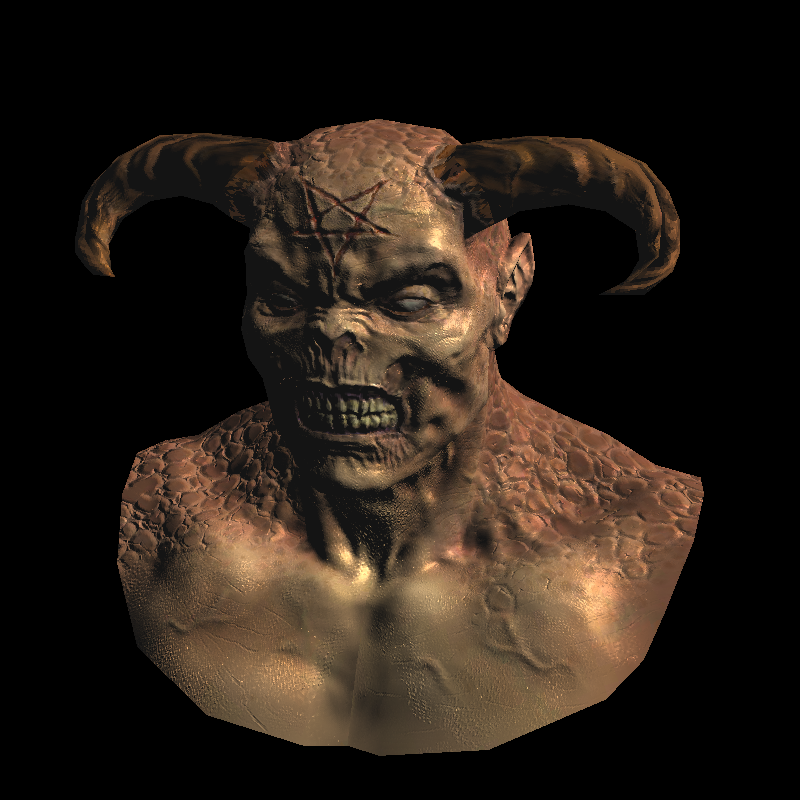
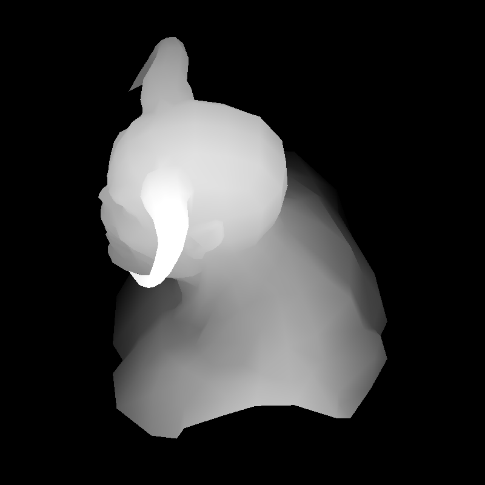
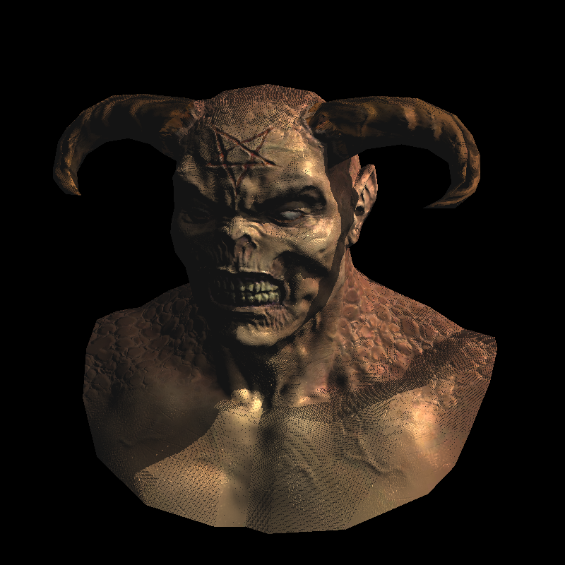
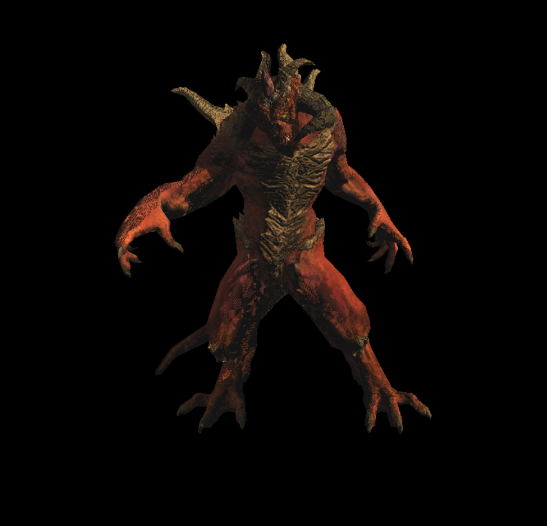
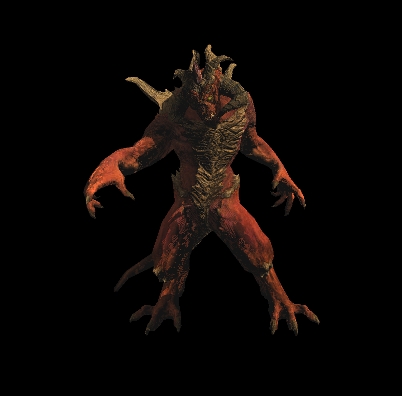

关于软渲染器，框架已经差不多了，现在让我们进入新的内容，阴影。今天我们尝试给模型加上硬阴影，注意不是软阴影。这就是最后一节内容。

<!--more-->

# Lesson 7

即便Shader中阴影通常也不会放在基础部分，不过既然有现成的代码，我们也不客气了。作者给出一个使用Phong渲染后的图：



观察一下可以发现，虽然Phong模型模拟了光照情况，但是没有模拟遮挡情况。上面的模型中，光源在右上角，那么右边肩膀上应该被挡住了才对。这就是为什么我们需要单独处理阴影。这里介绍一种最简单的思路，我们先把相机放到和光源相同的位置看模型，做一次深度测试渲染一个深度图，里面存储着从光源方向看哪些地方能够被照亮。然后我们在渲染一次，这次根据深度图的信息在给一次光照，就能得到正确的结果。这个信息实际上就是一个浮点数，我们通过将两个图中的片元匹配起来获得这个值，让最后的颜色乘以这个值，就能得到想要的结果。

例如上面这个图，第一次渲染深度后得到图片：



其中的颜色为(255,255,255,255)*Depth，然后我们再次渲染，光强乘以片元对应的Depth，得到下面的结果：



我并没有在作者的项目中找到这个模型，后面我们用另一个给出的模型来观察效果。上面关键问题在于，如何让两个视角图中的像素匹配起来？我们仍然通过变换实现，在第二次渲染的Fragment着色器中，我们可以使用的是从光源位置渲染的图片的像素坐标和当前片元在屏幕上的像素坐标，目标是从后者找到前者的坐标，也就是从当前片元的屏幕坐标变换到深度图中的屏幕坐标。

深度图中的像素坐标首先从模型空间开始，经过Model矩阵变换到位于光源的摄像机的空间，经过Projection变换到[-1,1]的标准坐标系，然后经过Viewport变换到最终的像素坐标。我们在第一次渲染的时候保存这个变换，因为第二次渲染需要重新初始化MVP矩阵。这下你可能知道怎么办了，我们先用当前的MVP矩阵还原现在的点，然后用第一次保存的大矩阵将它转换到深度图中，就得到了匹配的坐标。下面是代码。

```C++
#include <vector>
#include <limits>
#include <iostream>
#include "tgaimage.h"
#include "model.h"
#include "geometry.h"
#include "our_gl.h"

Model *model        = NULL;
float *shadowbuffer = NULL;

const int width  = 800;
const int height = 800;

Vec3f light_dir(1,1,0);
Vec3f       eye(1,1,4);
Vec3f    center(0,0,0);
Vec3f        up(0,1,0);

struct Shader : public IShader {
    mat<4,4,float> uniform_M;   //  Projection*ModelView
    mat<4,4,float> uniform_MIT; // (Projection*ModelView).invert_transpose()
    mat<4,4,float> uniform_Mshadow; // transform framebuffer screen coordinates to shadowbuffer screen coordinates
    mat<2,3,float> varying_uv;  // triangle uv coordinates, written by the vertex shader, read by the fragment shader
    mat<3,3,float> varying_tri; // triangle coordinates before Viewport transform, written by VS, read by FS

    Shader(Matrix M, Matrix MIT, Matrix MS) : uniform_M(M), uniform_MIT(MIT), uniform_Mshadow(MS), varying_uv(), varying_tri() {}

    virtual Vec4f vertex(int iface, int nthvert) {
        varying_uv.set_col(nthvert, model->uv(iface, nthvert));
        Vec4f gl_Vertex = Viewport*Projection*ModelView*embed<4>(model->vert(iface, nthvert));
        varying_tri.set_col(nthvert, proj<3>(gl_Vertex/gl_Vertex[3]));
        return gl_Vertex;
    }

    virtual bool fragment(Vec3f bar, TGAColor &color) {
        //插值得到像素的屏幕坐标，变换到深度图中
        Vec4f sb_p = uniform_Mshadow*embed<4>(varying_tri*bar); // corresponding point in the shadow buffer
        //齐次除法，虽然embed扩展后w=1，经过逆变换到深度图中w不等于1
        sb_p = sb_p/sb_p[3];
        int idx = int(sb_p[0]) + int(sb_p[1])*width; // index in the shadowbuffer array
        float shadow = .3+.7*(shadowbuffer[idx]<sb_p[2]); // magic coeff to avoid z-fighting
        Vec2f uv = varying_uv*bar;                 // interpolate uv for the current pixel
        Vec3f n = proj<3>(uniform_MIT*embed<4>(model->normal(uv))).normalize(); // normal
        Vec3f l = proj<3>(uniform_M  *embed<4>(light_dir        )).normalize(); // light vector
        Vec3f r = (n*(n*l*2.f) - l).normalize();   // reflected light
        float spec = pow(std::max(r.z, 0.0f), model->specular(uv));
        float diff = std::max(0.f, n*l);
        TGAColor c = model->diffuse(uv);
        for (int i=0; i<3; i++) color[i] = std::min<float>(20 + c[i]*shadow*(1.2*diff + .6*spec), 255);
        return false;
    }
};

//将光源位置的摄像机深度信息存入图片中
struct DepthShader : public IShader {
    mat<3,3,float> varying_tri;

    DepthShader() : varying_tri() {}

    virtual Vec4f vertex(int iface, int nthvert) {
        Vec4f gl_Vertex = embed<4>(model->vert(iface, nthvert)); // read the vertex from .obj file
        gl_Vertex = Viewport*Projection*ModelView*gl_Vertex;          // transform it to screen coordinates
        varying_tri.set_col(nthvert, proj<3>(gl_Vertex/gl_Vertex[3]));
        return gl_Vertex;
    }

    virtual bool fragment(Vec3f bar, TGAColor &color) {
        Vec3f p = varying_tri*bar;
        color = TGAColor(255, 255, 255)*(p.z/depth);
        return false;
    }
};

int main(int argc, char** argv) {
    

    float *zbuffer = new float[width*height];
    shadowbuffer   = new float[width*height];
    for (int i=width*height; --i; ) {
        zbuffer[i] = shadowbuffer[i] = -std::numeric_limits<float>::max();
    }

    model = new Model("obj/diablo3_pose.obj");
    light_dir.normalize();

    { // rendering the shadow buffer
        TGAImage depth(width, height, TGAImage::RGB);
        lookat(light_dir, center, up);
        viewport(width/8, height/8, width*3/4, height*3/4);
        projection(0);

        DepthShader depthshader;
        Vec4f screen_coords[3];
        for (int i=0; i<model->nfaces(); i++) {
            for (int j=0; j<3; j++) {
                screen_coords[j] = depthshader.vertex(i, j);
            }
            triangle(screen_coords, depthshader, depth, shadowbuffer);
        }
        depth.flip_vertically(); // to place the origin in the bottom left corner of the image
        depth.write_tga_file("depth.tga");
    }
	
    //保存深度图使用的变换矩阵
    Matrix M = Viewport*Projection*ModelView;

    { // rendering the frame buffer
        TGAImage frame(width, height, TGAImage::RGB);
        lookat(eye, center, up);
        viewport(width/8, height/8, width*3/4, height*3/4);
        projection(-1.f/(eye-center).norm());

        Shader shader(ModelView, (Projection*ModelView).invert_transpose(), M*(Viewport*Projection*ModelView).invert());
        Vec4f screen_coords[3];
        for (int i=0; i<model->nfaces(); i++) {
            for (int j=0; j<3; j++) {
                screen_coords[j] = shader.vertex(i, j);
            }
            triangle(screen_coords, shader, frame, zbuffer);
        }
        frame.flip_vertically(); // to place the origin in the bottom left corner of the image
        frame.write_tga_file("framebuffer.tga");
    }

    delete model;
    delete [] zbuffer;
    delete [] shadowbuffer;
    return 0;
}

```

理解代码后重新查看上面的渲染结果，发现出现了很多空洞，这被称为z-fighting，深度冲突。原理是在使用深度缓存比较深度值的时候，远离摄像机的地方因为透视投影，深度值被压缩到较小的一个范围，深度值不精确，导致比较可能出错，有的片元被保留，有的被抛弃了，就导致这样的结果。而靠近摄像机的地方深度值不会受到这样大的压缩影响，所以影响比较小。

结合代码来看，回忆之前的光栅化，每个片元的深度值是对三角形三个顶点的插值，并且还要做齐次除法：

```C++
			Vec3f c = barycentric(proj<2>(pts[0]/pts[0][3]), proj<2>(pts[1]/pts[1][3]), proj<2>(pts[2]/pts[2][3]), proj<2>(P));
            float z = pts[0][2]*c.x + pts[1][2]*c.y + pts[2][2]*c.z;
            float w = pts[0][3]*c.x + pts[1][3]*c.y + pts[2][3]*c.z;
            int frag_depth = z/w;
```

注意我们这里原因是在于深度图的比较，而不是第二次渲染的空间中比较出现的问题。不过z-fighting是原理是类似的。我们用Shader中的这行代码来缓解问题：

```C++
// float shadow = .3+.7*(shadowbuffer[idx]<sb_p[2]); // magic coeff to avoid z-fighting
float shadow = .3+.7*(shadowbuffer[idx]<sb_p[2]+43.34); // magic coeff to avoid z-fighting
```

原本当在深度图空间中，片元的z值大于深度图中存储的值，说明片元排在前面(不用等于是因为浮点数一般无法比较是否相等，这也是不精确的原因之一)，那么shadow就是0.3+0.7=1，不精确的比较导致后面这个0.7不一定加得上去。我们用自己的图片得到效果：



尤其是左腿上，出现了很多抖动。更改代码，将阴影值直接加上某些值，看到明显的变化：



腿部的渲染还是不尽人意，因为那里的模型凹凸不一，比较复杂，但是左手得到了极大改善。你可以尝试修改这个值观察效果。个人理解上面的代码就是简单地将一些可能会因为不准确的比较而被惩罚的像素救回来了，加上一个之让它有保底，或者另一种方法将后面两个值括起来：

```C++
float shadow = .3 + .7 * (shadowbuffer[idx] < (sb_p[2] + 100));
```

这样也是类似的，可能被抛弃的片元都会被保留下来，代价就是随着这个值的增大，也会导致非阴影的部分越来越多，与我们期望的结果稍有出入。总之这个方法显然不是根本的解决，Shader中写阴影有很多其他方案，以后再学习。

# 总结

作者后面还有两次课程，不过这两次我认为看一看就可以了，一次是关于全局光照环境光的介绍，一次是关于如何编写OpenGL应用的介绍，尤其全局光照不算基础内容了，先用高级语言实现它再回过来看也许会有其它理解，总之不必浪费时间在它们身上。这个项目最好的地方还是对光栅化的实现，并且还封装成Shader类似的样子，做完前六节课你会对基本的渲染管线有更深刻的理解，而不只是知道其中某个部分大致在干什么。

接下来我们得停下来用虎书系统整理下图形学的基本知识，接着继续学习Unity Shader，做一些常见的视觉效果如水、雾、海量草等很重要的解决方案。
