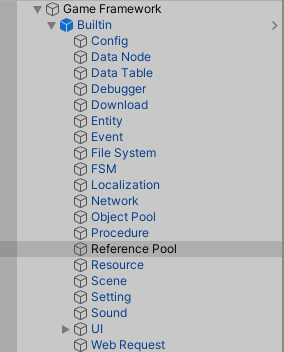
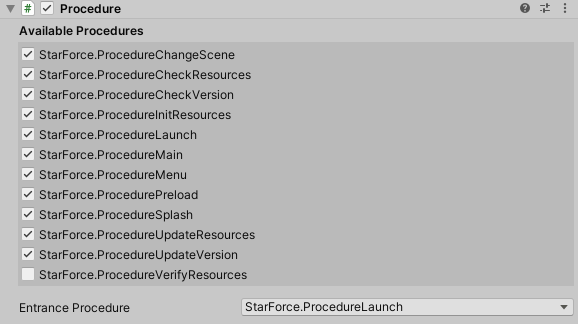
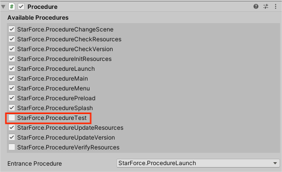

这个系列记录一下ugf框架的学习，一个比较知名的unity游戏框架，先从作者给出的实例demo开始学习。

<!--more-->

# Procedure

作者写的这个demo叫做[Star-Force](https://github.com/EllanJiang/StarForce)，我们克隆下来之后还要记得克隆子模块，这里作者将自己的框架链接成git的submodule了，不弄的话会报错，所以要注意。都拉下来之后直接用Unity打开，我是用的版本是2020.3.45f1c1，这个应该影响不大，文档烂但是代码还是很好的。

首先看到框架入口，也就是Game Entry脚本：

```C#
public partial class GameEntry : MonoBehaviour
    {
        private void Start()
        {
            InitBuiltinComponents();
            InitCustomComponents();
        }
    }
```

这是一个部分类，只有一个Start函数，调用了两个方法，分别对框架内部的组件和我们自己添加的组件进行初始化。接下来如果点开InitBuiltinComponents()，会发现该静态方法定义在该类的另一个部分类中，主要是对框架自己定义的一些组件进行初始化，这个暂时不管，我们先看CustomComponents()。

```C#
private static void InitCustomComponents()
        {
            BuiltinData = UnityGameFramework.Runtime.GameEntry.GetComponent<BuiltinDataComponent>();
            HPBar = UnityGameFramework.Runtime.GameEntry.GetComponent<HPBarComponent>();
        }
```

寥寥两行代码貌似也不足以让游戏运行起来，第一行代码又是关于框架的调用，第二行代码也似乎只是将血条进行了初始化而已，那么我们可以判断该方法真的只是进行了初始化而已，关于进一步的介绍还要看作者的叙述。[木头大佬](http://www.benmutou.com/archives/2486)提到，框架的顺序执行应该和流程有关，作者介绍流程如下：

* **流程 (Procedure)** - 是贯穿游戏运行时整个生命周期的有限状态机。通过流程，将不同的游戏状态进行解耦将是一个非常好的习惯。对于网络游戏，你可能需要如检查资源流程、更新资源流程、检查服务器列表流程、选择服务器流程、登录服务器流程、创建角色流程等流程，而对于单机游戏，你可能需要在游戏选择菜单流程和游戏实际玩法流程之间做切换。如果想增加流程，只要派生自 ProcedureBase 类并实现自己的流程类即可使用。

那么打开GameFramework的子对象列表，可以看到BuiltIn含有二十个子对象，除了Reference Pool外，其余十九个对象正是作者简介中列出来的框架组件。



因此我们点开Procedure，发现挂载的脚本上有一个列表：



这里意思应该是，勾选后可以启用该流程，并且下面还有一个Entrance Procedure代表从那个Procedure进入。根据作者描述，我们应该能在其中添加自己的Procedure，方法就是继承ProcedureBase 类，之后我们自己创建的方法就应该会被收集到这个地方。我们先看看它这些类是如何实现的，我尝试搜索ProcedureMain脚本，然后打开：

```C#
public class ProcedureMain : ProcedureBase
```

和作者描述的一致，那我再尝试新建一个自己的脚本继承以下这个Base：

```C#
using System.Collections;
using System.Collections.Generic;
using UnityEngine;

namespace StarForce
{
	public class ProcedureTest : ProcedureBase
	{  
	        //要求必须实现继承的抽象方法
	        public override bool UseNativeDialog => false;
	}
}

```

这里还需要将基类的抽象方法实现，这个应该是后来添加的，作者注释说用来决定获取流程是否使用原生对话框，在一些特殊的流程（如游戏逻辑对话框资源更新完成前的流程）中，可以考虑调用原生对话框进行消息提示行为。（我看不懂所以搬的原话）

总之参考其它类里面的选项，返回false就行了。接着回到Unity中，找到Procedure对象，发现这个方法真的被识别进去了！



那么我们就了解了Procedure的基本逻辑。那么其中的方法是以什么顺序执行？进一步查看，第一个方法是UseNativeDialog，必须实现的静态方法；下面就是OnEnter方法。看到这个方法很容易想到这应该和状态机类似，在进入该流程的时候要执行一些方法。

```C#
        protected override void OnEnter(ProcedureOwner procedureOwner)
        {
            base.OnEnter(procedureOwner);

            // 构建信息：发布版本时，把一些数据以 Json 的格式写入 Assets/GameMain/Configs/BuildInfo.txt，供游戏逻辑读取
            GameEntry.BuiltinData.InitBuildInfo();

            // 语言配置：设置当前使用的语言，如果不设置，则默认使用操作系统语言
            InitLanguageSettings();

            // 变体配置：根据使用的语言，通知底层加载对应的资源变体
            InitCurrentVariant();

            // 声音配置：根据用户配置数据，设置即将使用的声音选项
            InitSoundSettings();

            // 默认字典：加载默认字典文件 Assets/GameMain/Configs/DefaultDictionary.xml
            // 此字典文件记录了资源更新前使用的各种语言的字符串，会随 App 一起发布，故不可更新
            GameEntry.BuiltinData.InitDefaultDictionary();
        }
```

文档内搜索以下，BuiltIn的两个方法和OnEnter都是框架其它地方的内部方法，而中间三个方法则是写在这个类里面的私有方法，它们应该就是执行主要逻辑的方法。具体就不列出来了，另外还有个OnUpdate方法，猜测是和Unity的Update类似，所以打开了Base类，看到它其实又继承状态机给了五个方法：

```C#
namespace GameFramework.Procedure
{
    //
    // 摘要:
    //     流程基类。
    public abstract class ProcedureBase : FsmState<IProcedureManager>
    {
        //
        // 摘要:
        //     状态初始化时调用。
        //
        // 参数:
        //   procedureOwner:
        //     流程持有者。
        protected internal override void OnInit(IFsm<IProcedureManager> procedureOwner)
        {
            base.OnInit(procedureOwner);
        }

        //
        // 摘要:
        //     进入状态时调用。
        //
        // 参数:
        //   procedureOwner:
        //     流程持有者。
        protected internal override void OnEnter(IFsm<IProcedureManager> procedureOwner)
        {
            base.OnEnter(procedureOwner);
        }

        //
        // 摘要:
        //     状态轮询时调用。
        //
        // 参数:
        //   procedureOwner:
        //     流程持有者。
        //
        //   elapseSeconds:
        //     逻辑流逝时间，以秒为单位。
        //
        //   realElapseSeconds:
        //     真实流逝时间，以秒为单位。
        protected internal override void OnUpdate(IFsm<IProcedureManager> procedureOwner, float elapseSeconds, float realElapseSeconds)
        {
            base.OnUpdate(procedureOwner, elapseSeconds, realElapseSeconds);
        }

        //
        // 摘要:
        //     离开状态时调用。
        //
        // 参数:
        //   procedureOwner:
        //     流程持有者。
        //
        //   isShutdown:
        //     是否是关闭状态机时触发。
        protected internal override void OnLeave(IFsm<IProcedureManager> procedureOwner, bool isShutdown)
        {
            base.OnLeave(procedureOwner, isShutdown);
        }

        //
        // 摘要:
        //     状态销毁时调用。
        //
        // 参数:
        //   procedureOwner:
        //     流程持有者。
        protected internal override void OnDestroy(IFsm<IProcedureManager> procedureOwner)
        {
            base.OnDestroy(procedureOwner);
        }
    }
}
```

那么我们基本就清楚Procedure了，如果进一步查看会发现，它本质上是一个状态机，继承自FsmState类，就和动画状态机一样，方便我们管理游戏事件。

