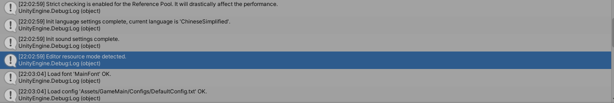
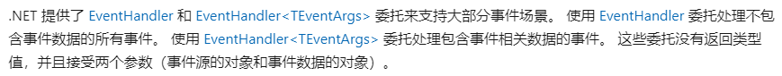

了解了Procedure的基本用法，得继续往下看看游戏如何开始运行的。

<!--more-->

# Event

回顾一下，被Procedure设置为Entrance Procedure的ProcudureLaunch脚本重写了OnEnter方法和OnUpdate方法，其中OnEnter方法执行的都是一些初始化的操作，对我们的游戏场景没有影响。那应该就是OnUpdate方法起了作用：

```C#
        protected override void OnUpdate(ProcedureOwner procedureOwner, float elapseSeconds, float realElapseSeconds)
        {
            base.OnUpdate(procedureOwner, elapseSeconds, realElapseSeconds);

            // 运行一帧即切换到 Splash 展示流程
            ChangeState<ProcedureSplash>(procedureOwner);
        }
```

Base类的OnUpdate方法是空的，那肯定是这个ChangeState方法将目前的流程改变了，改到了这个名为ProcedureSplash的流程。所以我们结束对Launch的探索，看看Splash是干嘛的。它重写了一个OnUpdate方法：

```C#
protected override void OnUpdate(ProcedureOwner procedureOwner, float elapseSeconds, float realElapseSeconds)
        {
            base.OnUpdate(procedureOwner, elapseSeconds, realElapseSeconds);

            // TODO: 这里可以播放一个 Splash 动画
            // ...

            if (GameEntry.Base.EditorResourceMode)
            {
                // 编辑器模式
                Log.Info("Editor resource mode detected.");
                ChangeState<ProcedurePreload>(procedureOwner);
            }
            else if (GameEntry.Resource.ResourceMode == ResourceMode.Package)
            {
                // 单机模式
                Log.Info("Package resource mode detected.");
                ChangeState<ProcedureInitResources>(procedureOwner);
            }
            else
            {
                // 可更新模式
                Log.Info("Updatable resource mode detected.");
                ChangeState<ProcedureCheckVersion>(procedureOwner);
            }
        }
```

可以看到该方法根据当前游戏运行的状态输出一个Log，然后跳转到不同的状态。根据之前显示的"Editor resource mode detected."，那我们跳转的应该是ProcedurePreload状态，也就是编辑器内运行。



看名字这应该是一个加载资源的流程，其中重写了OnEnter、OnLeave、OnUpdate方法，进入状态时执行OnEnter方法：

```C#
protected override void OnEnter(ProcedureOwner procedureOwner)
        {
            base.OnEnter(procedureOwner);
			//
            GameEntry.Event.Subscribe(LoadConfigSuccessEventArgs.EventId, OnLoadConfigSuccess);
            GameEntry.Event.Subscribe(LoadConfigFailureEventArgs.EventId, OnLoadConfigFailure);
            GameEntry.Event.Subscribe(LoadDataTableSuccessEventArgs.EventId, OnLoadDataTableSuccess);
            GameEntry.Event.Subscribe(LoadDataTableFailureEventArgs.EventId, OnLoadDataTableFailure);
            GameEntry.Event.Subscribe(LoadDictionarySuccessEventArgs.EventId, OnLoadDictionarySuccess);
            GameEntry.Event.Subscribe(LoadDictionaryFailureEventArgs.EventId, OnLoadDictionaryFailure);

            m_LoadedFlag.Clear();

            PreloadResources();
        }
```

里面订阅了六个事件，分别对应加载配置成功和失败、加载表格数据成功和失败、加载字典成功和失败。此外还初始化了一下成员m_LoadedFlag，它是一个Dictionary<string, bool>的字典，标志着名称为string的资源是否加载完成。

* **事件**(Event) - 游戏逻辑监听、抛出事件的机制。Game Framework 中的很多模块在完成操作后都会抛出内置事件，监听这些事件将大大解除游戏逻辑之间的耦合。用户也可以定义自己的游戏逻辑事件。

这里我们学习到另一个重要工具-事件的使用。事件主要是为了接触耦合提出的，这就涉及到委托特性了，这里相当于封装好了一套订阅事件的方法，首先需要一个id标记事件，我们进一步查看，发现这个id定义在**LoadConfigSuccessEventArgs**类中，它继承了**GameEventArgs**，进一步查看它是这里封装的事件基类，真正继承的是**GameFrameworkEventArgs**，id实际上就是这个类的哈希值：

```C#
public static readonly int EventId = typeof(LoadConfigSuccessEventArgs).GetHashCode();
```

那么我们六个事件实际上就需要定义六个类继承自GameEventArgs。可是为什么这个类名称都带有Args呢？它是什么Arguments吗？我们先看到还需要一个指定的委托作为订阅方法的第二个参数，当前面id标识的事件触发后，连带着调用后面订阅的方法，而不需要主动调用。问题就在这里，你可能会疑惑这里为什么不用传递委托方法需要的参数，而是直接写了参数名，原因在于使用了C#的EventArgs，它是前面**GameFrameworkEventArgs**的真正的基类，事件参数类，它规定了事件必须具备两个参数，一个是发布者sender，一个就是参数类args，这也是前面的类名带有args的原因。

```C#
//被订阅的事件方法
private void OnLoadConfigSuccess(object sender, GameEventArgs e)
        {
            LoadConfigSuccessEventArgs ne = (LoadConfigSuccessEventArgs)e;
            if (ne.UserData != this)
            {
                return;
            }

            m_LoadedFlag[ne.ConfigAssetName] = true;
            Log.Info("Load config '{0}' OK.", ne.ConfigAssetName);
        }

//参数类中封装的方法，实际在添加委托的时候执行
public static LoadConfigSuccessEventArgs Create(ReadDataSuccessEventArgs e)
        {
            LoadConfigSuccessEventArgs loadConfigSuccessEventArgs = ReferencePool.Acquire<LoadConfigSuccessEventArgs>();
            loadConfigSuccessEventArgs.ConfigAssetName = e.DataAssetName;
            loadConfigSuccessEventArgs.Duration = e.Duration;
            loadConfigSuccessEventArgs.UserData = e.UserData;
            return loadConfigSuccessEventArgs;
        }
```

用第一个事件为例，OnLoadConfigSuccess在配置成功的时候被调用，具有两个规定的参数，它们是使用EventArgs必须的，sender发布者就是拥有该事件的类对象，事件参数类就是LoadConfigSuccessEventArgs，它层层包装，继承自EventArgs，类内定义了Create方法返回LoadConfigSuccessEventArgs类型的值，从而完成参数的传递。刚方法在添加委托的时候被执行，发布者发布事件的时候需要用类似泛型声明的方式来指定使用这个类，剩下的就是内部类的工作了，能将发布者类和参数类匹配到等待赋值的sender和e上面，就完成了参数的传递。

在[微软文档](https://learn.microsoft.com/zh-cn/dotnet/standard/events/)中关于需要使用参数的事件是这么介绍的：



我们还是以框架为主，C#相关内容尽量减少。OnEnter最后紧接着调用类中定义的私有方法做数据加载的操作PreloadResources()：

```C#
private void PreloadResources()
        {
            // Preload configs
            LoadConfig("DefaultConfig");

            // Preload data tables
            foreach (string dataTableName in DataTableNames)
            {
                LoadDataTable(dataTableName);
            }

            // Preload dictionaries
            LoadDictionary("Default");

            // Preload fonts
            LoadFont("MainFont");
        }
```

它首先调用类内私有方法LoadConfig：

```C#
private void LoadConfig(string configName)
        {
            string configAssetName = AssetUtility.GetConfigAsset(configName, false);
            m_LoadedFlag.Add(configAssetName, false);
            GameEntry.Config.ReadData(configAssetName, this);
        }
```

这个方法首先调用AssetUtility.GetConfigAsset将传入的字符串拼接成本地路径，然后将这个路径放到字典里面，接着读取这个路径的资源文件，这里ReadData方法没找到方法体在哪里，后面再说。

遍历dataTableName中的每一个数据表名称，然后加载它们，相应的OnLeave方法里面就取消这些事件的订阅。

```C#
protected override void OnLeave(ProcedureOwner procedureOwner, bool isShutdown)
        {
            GameEntry.Event.Unsubscribe(LoadConfigSuccessEventArgs.EventId, OnLoadConfigSuccess);
            GameEntry.Event.Unsubscribe(LoadConfigFailureEventArgs.EventId, OnLoadConfigFailure);
            GameEntry.Event.Unsubscribe(LoadDataTableSuccessEventArgs.EventId, OnLoadDataTableSuccess);
            GameEntry.Event.Unsubscribe(LoadDataTableFailureEventArgs.EventId, OnLoadDataTableFailure);
            GameEntry.Event.Unsubscribe(LoadDictionarySuccessEventArgs.EventId, OnLoadDictionarySuccess);
            GameEntry.Event.Unsubscribe(LoadDictionaryFailureEventArgs.EventId, OnLoadDictionaryFailure);

            base.OnLeave(procedureOwner, isShutdown);
        }
```

我们再看Update里面：

```C#
protected override void OnUpdate(ProcedureOwner procedureOwner, float elapseSeconds, float realElapseSeconds)
        {
            base.OnUpdate(procedureOwner, elapseSeconds, realElapseSeconds);

            foreach (KeyValuePair<string, bool> loadedFlag in m_LoadedFlag)
            {
                if (!loadedFlag.Value)
                {
                    return;
                }
            }

            procedureOwner.SetData<VarInt32>("NextSceneId", GameEntry.Config.GetInt("Scene.Menu"));
            ChangeState<ProcedureChangeScene>(procedureOwner);
        }
```

Update对m_LoadedFlag中的每个元素进行了判断，如果加载没成功就返回，否则判断到完成了资源加载，之后用 procedureOwner.SetData方法来设置下一个场景的编号，跳转到Menu中。最后还要改变流程到ProcedureChangeScene。
