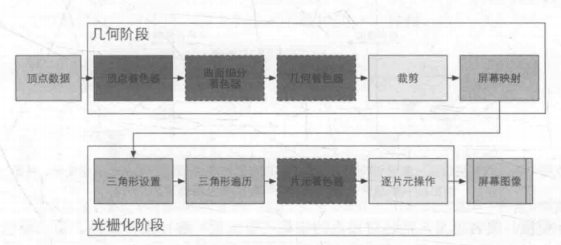
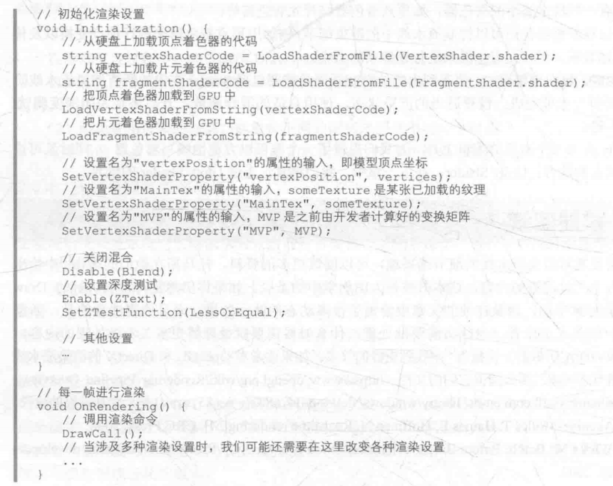
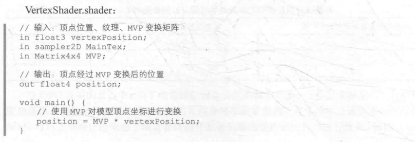
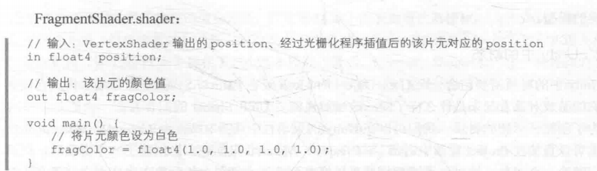
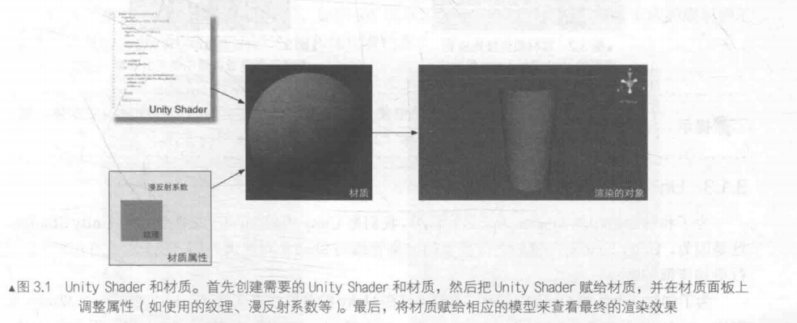

用冯乐乐大神的《Unity Shader入门精要》入门，记录个人整理的知识点和代码。Unity的Shader并不是真正意义上的Shader，实际上更像一种Shader的高级语言，因此常说是shader of Unity。而这个系列的博客主要是Shader的学习笔记，Unity的使用在Unity初始和入门系列博客中。本篇博客介绍渲染流水线和Unity Shader的概念。

<!--more-->

# 渲染流水线

## 概念流水线

学过图形学的同学肯定知道一般来说图形从定义顶点、颜色等信息开始到显示在屏幕上会经过渲染管线这个东西，其实也叫做渲染流水线，在另外一本著作《Real-Time Rendering》中，作者将渲染管线分成三个部分：

* Application Stage;
* Geometry Stage;
* Rasterizer Stage;

应用阶段进行数据准备，包括模型、摄像机、光源，可见面剔除，材质，纹理，使用的Shader，总的来说就是处理好渲染需要的集合信息，称为渲染图元(rendering primitives)，传递给几何阶段；

几何阶段用于绘制渲染图元，把上一个阶段的坐标变换到屏幕空间，输出各个顶点的二维坐标，深度值，着色信息，传递给下一个阶段；

光栅化阶段通过几何阶段传来的信息，进行插值，光栅化等操作，控制屏幕上的像素绘制出最终的图形。

## CPU执行（应用阶段）

这一阶段主要是程序员绝对控制数据，在Unity开发中体现为导入资产，地形编辑，设置材质等操作，主要是CPU在执行，大致分为三个阶段：

* 加载数据到显存中；
* 设置渲染状态；
* 调用Draw Call；

学习过操作系统或组成原理可以知道，要将数据存放到GPU的显存中，先要读取硬盘中的数据到内存中，在让数据流向GPU，因为多数GPU不能直接访问内存，而且对显存的访问很快。

渲染状态是，定义场景中的网格怎么渲染，绑定Shader，材质，光源等内容。

做好准备后，CPU调用渲染命令Draw Call通知GPU开始渲染，这个命令指向一个待渲染的图元列表，不包括任何材质信息，因为材质在渲染状态中已经定义了。

## GPU流水线

GPU的渲染过程就是GPU流水线，它实现了几何阶段和光栅化阶段，不能完全被程序员掌控，但是GPU也开放了很多控制权。下面我们详细说明几何阶段和光栅阶段中数据经历了什么变换。

在之前Games101课程的笔记中，曾经记录了一个大致的渲染管线，我当时以为它就是完整的，但是现在看来它只不过是我们这里介绍的后两个阶段的概述，图形学中介绍了这部分知识，仍然不完整，因此值得从头到尾梳理一下。（下面这个图本来是彩色的，书到了补上，不同颜色表示该阶段的可编程性）



### 几何阶段

顶点数据由应用阶段中CPU加载到显存中，再由Draw Call指定，依次经过：

* 顶点着色器(Vertex Shader)：完全可编程，实现顶点变换，着色等功能；

> 处理来自CPU的顶点数据，但是只是单个顶点，不包括顶点之间的关系，从而方便并行处理每个顶点；这一阶段的主要任务是：坐标变换和逐顶点光照。
>
> * 坐标变换：对顶点坐标进行变换，从而进行水面、布料等模拟效果，实现动画效果，最基本的是将顶点坐标从模型空间转换到齐次裁剪空间，也就是得到归一化设备坐标(Normalized Devices Coordinates，NDC)

* 曲面系分着色器(Tessellation Shader)：可选，用于细分图元；

* 几何着色器(Geometry Shader)：可选，执行逐图元的着色操作或者产生更多图元；
* 裁剪(Clipping)：可配置，将不可见的顶点和面片剔除；

> 图元不一定都在屏幕中，在屏幕外的图元要抛弃，在屏幕内的图元就传递下去，但是对于一部分在屏幕内一部分在屏幕外的图元就需要裁剪，这一步不可编程，但是可以定义裁剪操作来进行配置

* 屏幕映射(Screen Mapping)：不可编程和配置，将图元坐标转换为屏幕坐标系；

> 将归一化的坐标缩放到屏幕坐标(x，y)，对z轴不处理，一起输入光栅化阶段

### 光栅化阶段

* 三角形设置(Triangle Setup)：不可编程，固定函数；

> 由三角性的顶点数据计算三角形各条边的坐标，给下一个阶段做准备；

* 三角形遍历(Triangle Traversal)：不可编程，固定函数；

> 根据上一个阶段的数据，检查一个像素会不会被三角形覆盖，如果覆盖，就生成一个片元Fragment，还要插值计算整个覆盖区域的的像素，以及片元的深度值。输出一个片元序列，片元不是像素，而是包括该像素位置上的很多状态信息，例如屏幕深度，坐标，法线等

* 片元着色器(Fragment Shader)：完全可编程，实现逐片元的着色操作；

> 根据上一步插值得到的数据计算该片元的输出颜色，纹理映射就是这个阶段实现的，而且每个片元的颜色相互独立

* 逐片元操作(Per-Fragment Operations)：可配置，实现修改颜色、深度缓冲、混合等操作；

> 决定片元的可见性，模板测试和深度测试；如果都通过了，将片元的颜色值同已经存储在缓冲区中的颜色进行混合或者合并，不透明物体不用开启混合。很多时候为了优化性能，测试也会在片元着色器之前计算，防止计算无效的片元颜色

# 什么是Shader？

现在我们明白，Shader就是渲染流水线中高度可编程的阶段，最终编译结果会运行在GPU上，而且存在特定的着色器，如顶点、片元着色器，前者用来顶点变换、传递数据，后者用来进行逐像素渲染。

Unity提供的Shader并不是HLSL或者GLSL，GC这样的更接近GPU的Shader语言，而是更高级的编辑工具，既方便了着色器编写，又可以设置渲染状态。

# Unity Shader基础

没有Unity Shader时，为了渲染一个模型会是这样的代码：







Unity Shader方便了上面繁琐的过程，不用使用代码管理多个文件和函数。

## 概述

### 材质和Unity Shader

在Unity中我们需要配合使用材质和Shader才能达到需要的效果，使用步骤是：

* 创建材质
* 创建Unity Shader并赋给材质
* 材质赋给渲染对象
* 在材质面板中调整Unity Shader属性控制效果



Unity Shader定义的属性，会和脚本定义的属性一样显示在窗口中。

材质的创建：

* Assets或者Project窗口/Create/Material；
* 将这个Material文件拖拽到场景中目标物体或者在物体的Mseh Renderer组件中赋值；

默认情况下，新建材质会使用Standard Shader，一种基于物理模拟的渲染。

Unity Shader的创建：

* Assets或者Project窗口/Create/Shader；

> Unity提供四种Unity Shader模板，Standard Surface Shader包含标准光照模型，Unlit Shader产生一个不含光照但包含烟雾的基本着色器，Image Effect Shader提供实现各种屏幕后处理效果的基本模板，Compute Shader提供典型的表面着色器的实现方法，这本书主要用Unlit Shader

* 在材质的属性菜单中选择使用的Shader；

选中一个Shader后，Inspector窗口中会显示该Unity Shader相关的信息。

### ShaderLab和Unity Shader

ShaderLab是Unity Shader使用的Shader跨平台抽象语言，后面我们会知道，在Pass中编写的ShaderLab语言其实和Cg/HLSL两种语言是差不多的，但是ShaderLab本身于其他Shader代码来说就如同Python于C语言一样，当然这个比喻可能不是十分恰当。通过{}作为语义标识来描述Shader文件的结构，一般来说，一个Shader可以由下面的例子来说明它的结构：

```C#
shader "Custom/Simple Shader"
{
	Properties{
		_Color("Color Tint", Color) = (1.0,1.0,1.0,1.0)
        _Boundary("Boundary", Float) = 100
		_K("Max Iteration", Int) = 256
        _p("Offset of x", Float) = -1
        _q("Offset of y", Float) = 0
	}

	SubShader
	{
		        Pass
        {
            CGPROGRAM
            #pragma vertex vert
            #pragma fragment frag

            #include "UnityCG.cginc"
            float _Boundary;
			int _K;
            float _p;
            float _q;
            fixed4 _Color;
            struct a2v
            {
                float4 vertex : POSITION;
                float2 uv : TEXCOORD0;
                float3 normal : NORMAL;
            };
            struct v2f
            {
                float2 uv : TEXCOORD0;
                float4 vertex : SV_POSITION;
                float3 color : COLOR;
            };

            v2f vert (a2v v)
            {
                v2f o;
                o.vertex = UnityObjectToClipPos(v.vertex);
                o.uv = v.uv;
                o.color = v.normal * 0.5 + fixed3(0.5,0.5,0.5);
                return o;
            }
            fixed2 iteration(fixed2 pos)
			{
				fixed x2 = pos.x * pos.x;
				fixed y2 = pos.y * pos.y;
				fixed xy = pos.x * pos.y;
				fixed rx = (x2 - y2);
				fixed ry = (2 * xy);
				fixed2 result = fixed2(rx + _p, ry + _q);
				return result;
			}
            fixed4 fractal(fixed2 pos, fixed4 cor)
			{
				fixed2 pos1 = pos;
				fixed2 posF = pos;
				for (int i = 0; i < _K; i++) {
					posF = iteration(posF);
                    fixed r = (posF.x * posF.x + posF.y * posF.y);
                    if(r > _Boundary)
                    {
                        return cor;
                    }
                    if(i == _K-1)
                    {
                        return fixed4(1,1,1,1);  
                    }
				}
				return cor;
			}
            fixed4 frag (v2f i) : SV_Target
            {
                fixed4 curCol = fixed4(i.color, 1.0);
                fixed2 pos = i.vertex;
                float width = 1980;
                float height = 1080;
                float dx = 2 / (width-1);
                float dy = 2 / (height - 1);
                fixed2 complexPos = fixed2(-1 + pos.x * dx, -1 + pos.y * dy);
                curCol = fractal(complexPos, curCol);
                return curCol * _Color;
            }
            ENDCG
        }
	}

	FallBack "Diffuse"
}
```

* Properties：可以添加需要出现在材质面板中的属性，包括数值、纹理等，在这里创建的属性需要到Pass中声明才能引用；
* SubShader：一个Unity Shader中可能包含多个SubShader，Unity会选择第一个能够运行的SubShader执行，如果一个都不能执行，Unity将会选择Fallback指定的着色器；一个SubShader可能含有多个Pass，这些Pass将全部被执行；在SubShader顶部可以使用可选的Tags和RenderSetup来指定使用的渲染设置；

* 指定如果没有可运行的SubShader时选择什么着色器；

你不需要完全了解其中的含义，只要知道Shader由这三个结构组成即可，后面我们会了解这个Shader的作用，它使用了除Tags和RenderSetup以外的所有Shader结构，在屏幕上绘制一个Julia集合。此外，我们还要知道这个Shader使用了顶点和片元着色器，它们是我们接下来学习的重点，#pragma语句指定了哪个函数作为着色器使用。可以看到，Pass中是我们重点要编写的代码，它定义了一次完整的渲染流程。

下一篇开始我们将正式进入学习。

