用冯乐乐大神的《Unity Shader入门精要》入门，记录个人整理的知识点和代码。本篇博客本来应该讲到数学基础，不过由于在Games101系列第一篇博客笔记中已经有一致的内容，这里就不复习了，如有看客可以移步标签查找。本篇博客会先举例说明变换的作用，就直接进入Shader的编写了。

<!--more-->

# Unity中坐标空间的变换

通过学习我们知道，图形学中有五个用来实现变换的坐标系，也了解了如何使用矩阵对它们进行变换。（不清楚请看Games101的笔记博客）

* *MODEL*首先是物体坐标系，或者说模型坐标系，这个坐标系用来给物体进行建模，定义复杂物体的各种几何属性；
* *WORLD*世界坐标系，建模完成的物体在世界坐标系中进行变换，从而移动到不同的位置和朝向；
* *VIEW*视图坐标系，将世界坐标系中的物体再进行视图变换，使其符合摄像机的观察(“符合”同样会在后面解释)；
* *CLIP*裁剪坐标系，投影变换再次对物体进行处理，这时让整个可见空间的坐标范围缩放到标准的单位大小；
* *SCREEN*屏幕坐标系，透视投影已经让物体从三维变换到二维上了，所以可以根据屏幕大小再次缩放可见图形，在根据Z轴提供的深度关系，就完成了整个变换。

我们的变换目标就是从讲将体从以自己为准的空间中变换到屏幕上，这个过程实际上就是图形学的原理，下面我们通过例子来看如何实现。现在有一个🐂，它的Transform组件显示Position为[5,0,25]，Rotation为[0,150,0]，Scale为[2,2,2]，它还有一个子对象鼻子，坐标是[0,2,4]，缩放和旋转均为0。此外，我们或许还要用到摄像机的变换信息，Position为[0,10,-10]，Rotation为[30,0,0]，Scale为[1,1,1]。Unity使用的变换顺序是缩放旋转平移，那么这个🐂的鼻子会如何变换到屏幕上？

## MODEL->WORLD

第一步，我们从MODEL变换到WORLD中，Unity中的子对象位置坐标是在父对象的模型坐标系下的，所以我们可以根据🐂的变换和鼻子的位置坐标将它变换到世界中，先放大2倍，然后绕y轴旋转30度，最后平移到[5,0,25]。🐂的变换矩阵应该是这样的：

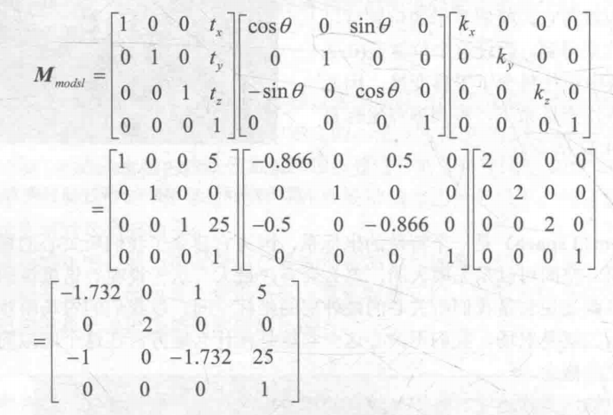

也就是说，该模型下的所有子对象都会被施加这个变换。那么鼻子的位置坐标右乘就得到鼻子在世界坐标系中的位置：

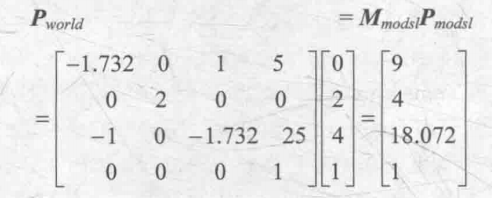

## WORLD->VIEW

之前理解VIEW空间比较难，现在知道Unity中的摄像机对象就清楚多了，要做的就是将世界坐标系中的物体再次变换到摄像机的观察空间中，这里需要主要，Unity中相机的观察空间使用的是右手坐标系，而世界空间使用的是左手坐标系，也就是Z轴方向相反，这两种标准的坐标系是不能通过平移、旋转转换的，你可以试着将左手和右手比成坐标系并尝试，肯定会发现它们总是有一个轴是相对的。唯一的方式就是将Z轴取反，统一到右手坐标系下，然后才能使用平移和旋转变换。

VIEW空间使用的坐标系以摄像机为原点，摄像机的后方、上方、右方分别作为z轴、y轴、x轴的正方向，原本我们游戏对象的前方是z轴正方向。为了得知这个变化矩阵，我们先考虑摄像机目前的情况，它从世界坐标系中的原点开始，先绕x轴旋转30度，然后平移到[0,10,-10]，那么一开始物体在世界坐标系中，此时观察坐标和世界坐标重合，在物体位置不变的情况下，我们把摄像机在世界坐标下旋转+30度，那么物体相对于摄像机就旋转了-30度，平移同理，所以把摄像机的变换逆向过来就是世界坐标变换到观察坐标了。

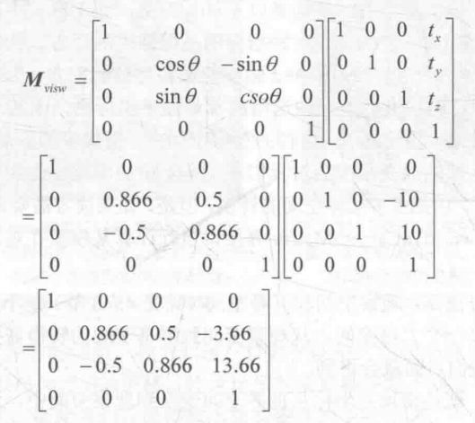

此时记得Z轴取反，这一步放在前面也行：

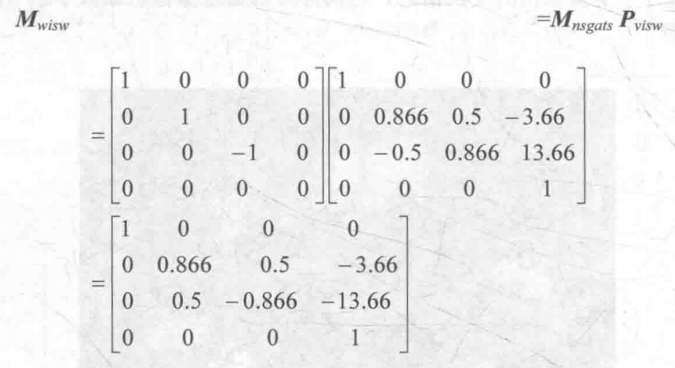

最后还是右乘本来鼻子的世界坐标，就得到鼻子在观察空间中的位置了。

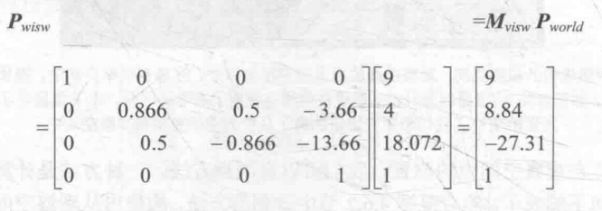

## VIEW->CLIP

这里是透视投影和正交投影，推导还是在前面说的博客中。但是这里稍有不同，因为我们又一次改变了旋向性，回到了左手坐标系。此时靠近摄像机的点具有更小的z值。

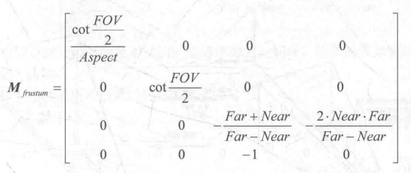

对应Unity摄像机的参数如下：

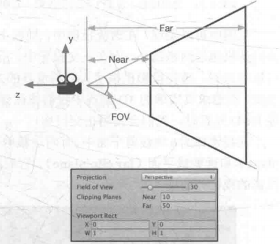

书中给出的是正交投影下的结果。正交是缩放加平移，最终矩阵如下：

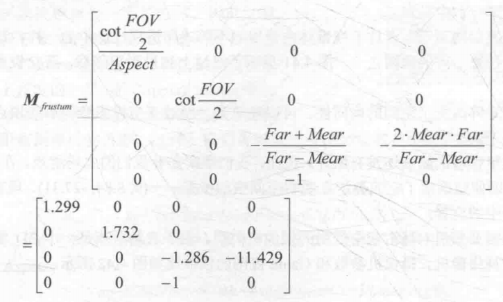

对应Unity摄像机的参数如下：

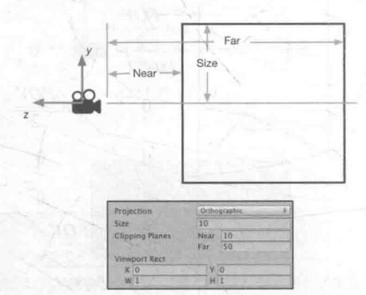

我们代入上面设置中的值计算，得到鼻子在裁剪空间中的坐标：

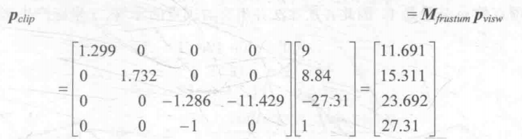


不过为了匹配不同的设备，对透视投影来说还要进行齐次除法，也就是除以最后一个分量，此时坐标变换到称为NDC的空间，坐标值在[-1,1]中，而正交投影由于已经缩放了所以不起作用。

## CLIP->SCREEN

投影后我们得到的是标准的[-1,1]，此时需要进一步映射到屏幕像素上，这里就比较简单了，对xy使用下面的公式：

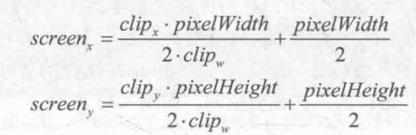

此时屏幕左下角是(0,0)，右上角和分辨率有关，其中$clip_w$实际上就是齐次除法。对于z分量我们需要进行深度测试之类的工作，所以还是要保留。最终得到鼻子在400*300屏幕上的像素位置：

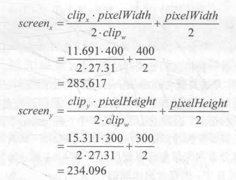

最后，我们以后还会用到法线变换，这里暂且不说。当然使用Unity Shader后我们不必自己编写这么复杂的过程了，Unity提供了一系列的变换函数，调用它们即可。阅读书中补充内容深感这部分内容复杂，还是要抽空看虎书，由于后面很多内容都是变换，这些空间及其坐标发生了什么变化非常有必要清楚地认识，例如在某个阶段顶点或片元的齐次坐标取值范围如何。在没有大的影响下，我们还是先认识如何写Shader。

# 开始使用Unity Shader

## 顶点和片元着色器的创建

Unity中使用ShaderLab作为跨平台Shader开发的语言体系，提供了许多封装好的工具函数处理底层逻辑。通过使用Unity Shader编写ShaderLab，可以方便地修改可编程管线。

要编写Shader Lab，首先需要建立材质，然后让材质使用当前的Unity Shader。材质是体现物体对光照反射的数据集，读取材质信息后Shader才能实现光照信息的交互。因此要使用Shader必须有一个材质，而材质又体现在实际的游戏对象上。因此我们先在Unity中创建场景，将Window/Lighting/Skybox设置为None，然后进行以下步骤：

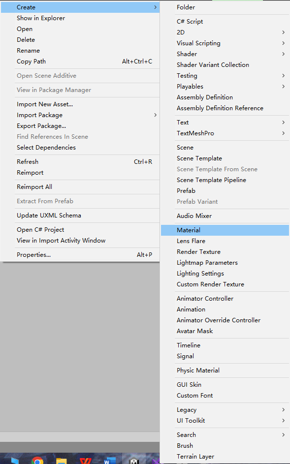

* 在Assets或者Project窗口/Create/Material，命名为SimpleShaderMat；在场景中创建一个Sphere，将这个SimpleShaderMat文件拖拽到场景中目标物体或者在物体的Mseh Renderer组件中赋值；默认情况下，新建材质会使用Standard Shader，一种基于物理模拟的渲染。

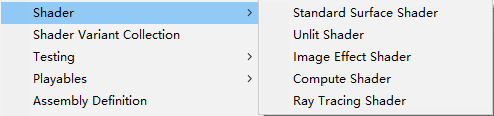

* Assets或者Project窗口/Create/Shader；Unity提供四种Unity Shader模板，Standard Surface Shader包含标准光照模型，Unlit Shader产生一个不含光照但包含烟雾的基本着色器，Image Effect Shader提供实现各种屏幕后处理效果的基本模板，Compute Shader提供典型的表面着色器的实现方法，这里我们不适用模板，创建后命名为SimpleShader，删除文件中所有内容。在材质的属性菜单中选择使用的Shader；

* 然后我们重新打开Simple Shader，输入下面的代码：

```
1.	shader "Custom/Simple Shader"
2.	{
3.	 SubShader
4.	 {
5.	       Pass
6.	        {
7.	            CGPROGRAM
8.	            #pragma vertex vert
9.	            #pragma fragment frag
10.	
11.	            float4 vert (float4 v : POSITION) : SV_POSITION
12.	            {
13.	                return mul(UNITY_MATRIX_MVP,v);
14.	            }
15.	
16.	            fixed4 frag ( ) : SV_Target
17.	            {
18.	                return fixed4(1.0,1.0,1.0,1.0);
19.	            }
20.	            ENDCG
21.	        }
22.	 }
23.	 FallBack "Diffuse"
24.	}

```

保存后回到Unity，看到场景中的球体变成了白色，材质球也是白色的。其中，第一行定义了Shader的名称，""定义在Shader栏中出现的位置。接下来是SubShader，其中定义一个Pass语义块，使用CGPROGRAM和ENDCG包裹了CG代码。然后#开头的两个字符指定了顶点着色器和片元着色器对应的函数。这里语法类似C语言，不过vert函数的参数我们使用了语义POSITION和SV_POSITION，前者表示将顶点的坐标填充到输入参数v中，后者表示该函数输出是一个系统值，顶点着色器处理后应该是裁剪空间中的顶点坐标。该函数只有一行代码，就是使用MVP变换矩阵，将顶点从模型空间转换到裁剪空间。

frag函数没有输入，SV_Target表示这个函数的输出是系统值，要将这个值存储到一个渲染目标中，这里对应默认帧缓存，可以说是像素的值。该函数返回一个fixed4类型的变量，代表颜色值。

最后是FallBack语句，告诉Unity如果没有可用的SubShader就采用漫反射这个简单的着色器。

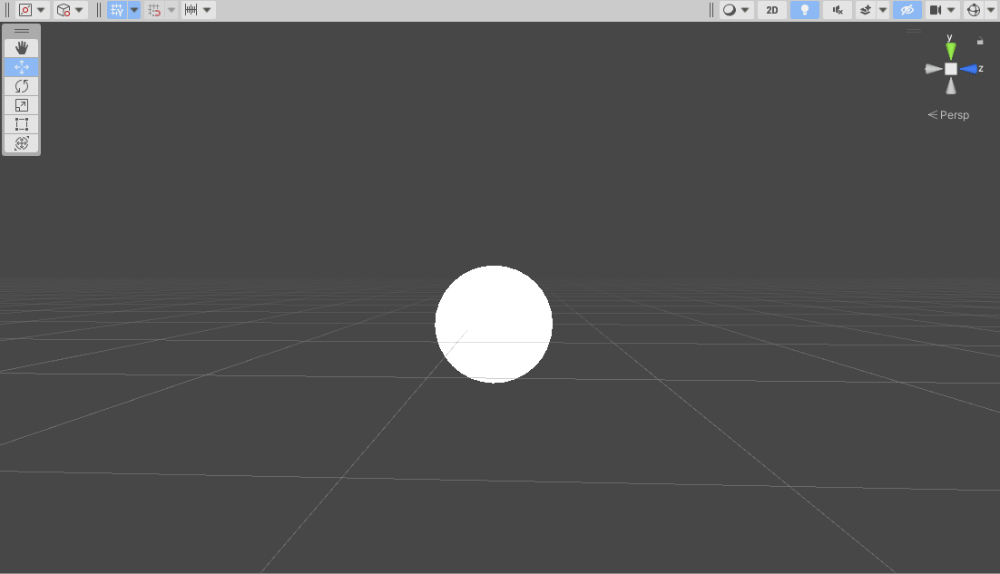

## 使用Properties和语义

之前我们知道材质面板中会显示能够修改的属性，它们和Unity脚本中的序列化很类似，设置属性后就可以才材质面板中实时调节，观察效果。我们修改代码为下面这样：

```
1.	shader "Custom/Simple Shader"
2.	{
3.	 Properties{
4.	  _Color("Color Tint", Color) = (1.0,1.0,1.0,1.0)
5.	 }
6.	
7.	 SubShader
8.	 {
9.	          Pass
10.	        {
11.	            CGPROGRAM
12.	            #pragma vertex vert
13.	            #pragma fragment frag
14.	            fixed4 _Color;
15.	
16.	            struct a2v
17.	            {
18.	                float4 vertex : POSITION;
19.	                float2 uv : TEXCOORD0;
20.	                float3 normal : NORMAL;
21.	            };
22.	
23.	            struct v2f
24.	            {
25.	                float2 uv : TEXCOORD0;
26.	                float4 vertex : SV_POSITION;
27.	                float3 color : COLOR;
28.	            };
29.	
30.	
31.	            v2f vert (a2v v)
32.	            {
33.	                v2f o;
34.	                o.vertex = UnityObjectToClipPos(v.vertex);
35.	                o.uv = v.uv;
36.	                o.color = v.normal * 0.5 + fixed3(0.5,0.5,0.5);
37.	                return o;
38.	            }
39.	
40.	            fixed4 frag (v2f i) : SV_Target
41.	            {
42.	                fixed4 curCol = fixed4(i.color, 1.0);
43.	                return curCol * _Color;
44.	            }
45.	            ENDCG
46.	        }
47.	 }
48.	
49.	 FallBack "Diffuse"
50.	}
```

可以看到我们使用Properties语义块定义了一个属性_Clolor，它的性质是一个颜色拾取器，然后我们进一步在Pass中用同样的名字命名，就可以在CG代码块中访问了。此外可以看到，我们使用了两个结构体来存储顶点和片元的一些属性，方式是使用语义，Unity会根据这些语义来填充结构体的成员，vert函数作为顶点着色器，负责将顶点数据传递给片元，我们通过流水线知道这其中发生了插值，一个片元对应三个顶点，它们的重心插值就是片元的值，所以不论其中如何，顶点着色器中仍然给v2f赋值了，在片元着色器中我们返回这个顶点着色器中计算的颜色值，就得到了下面的图像，你可以思考下其中的流程。

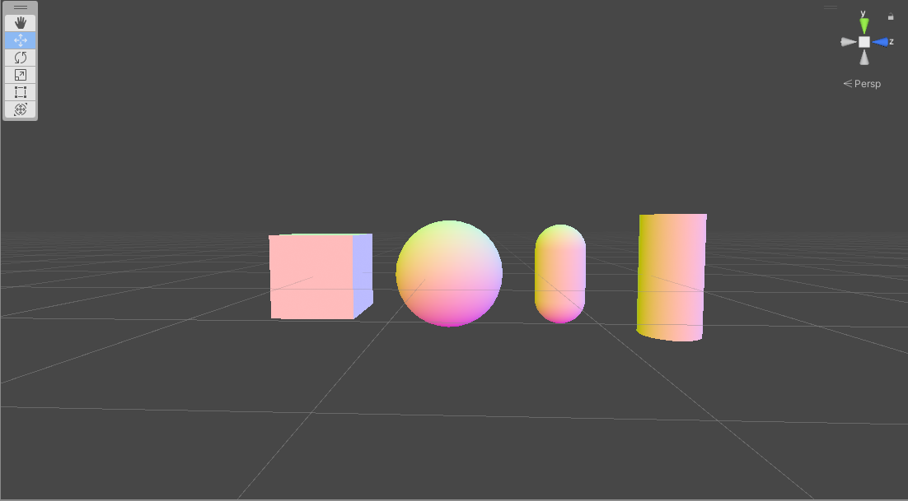

那什么是语义？它实际上就是赋值给Shader输入和输出的字符串，表达这个参数对应什么。有一些语义使用SV开头，代表System Value，这些值不可随意赋值，具有特殊含义，因为流水线会使用它们进行计算，DX10中更新了这些SV语义，也导致一些平台上的差异，例如前面POSITION在PS4上就必须指明是SV_POSITION才行。下面是一些常用语义的含义：

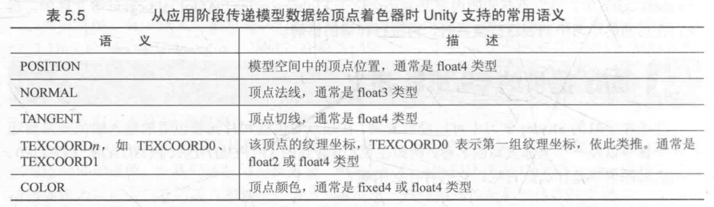

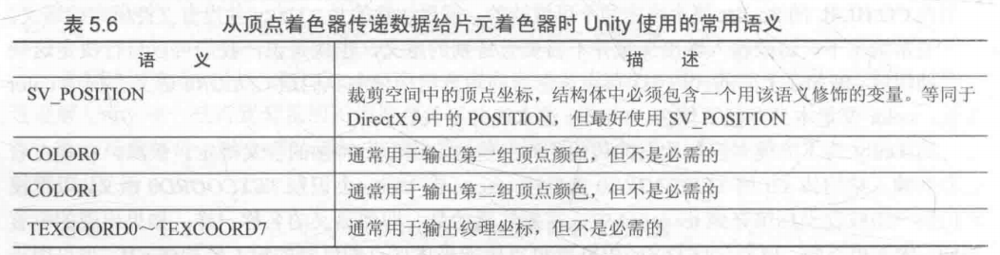

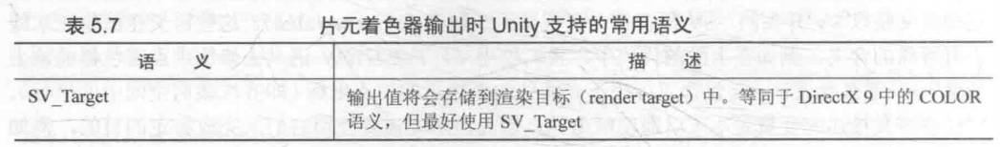

读懂上面的代码后，我们可以正式进入光照部分了。
