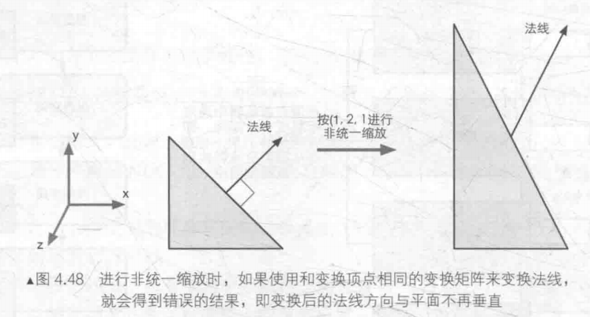
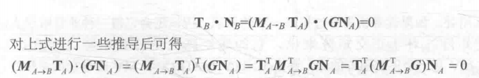
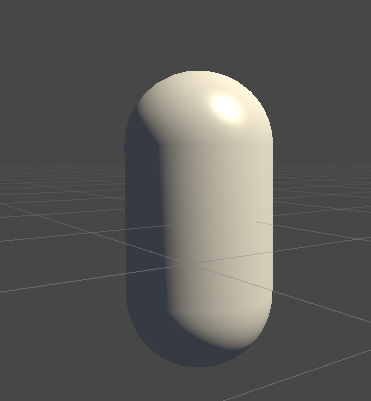
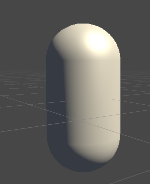
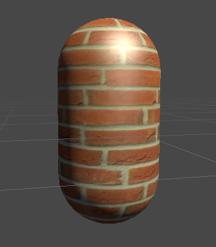
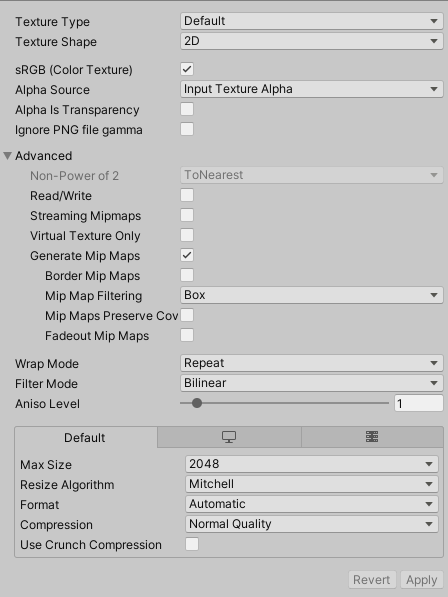
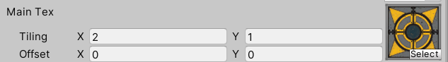
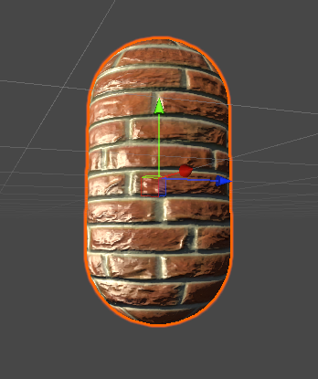

用冯乐乐大神的《Unity Shader入门精要》入门，记录个人整理的知识点和代码。现在我们进入光照部分，原理见Games101，这里注重实现不再赘述原理；纹理基础也在这一篇博客中。

<!--more-->

# Phong光照模型-基础光照

光照=环境光+漫反射+镜面光是Phong模型的基本假设，下面给出Unity Shader实现的代码：

```

Shader "Learn/Specular Pixel-Level"
{
	Properties{
		_Diffuse ("Diffuse", Color) = (1,1,1,1)
		_Specular ("Specular", Color) = (1,1,1,1)
		_Gloss ("Gloss", Range(8.0,256)) = 20
	}

	SubShader{
		Pass{
			Tags { "LightMode" = "ForwardBase"}

			CGPROGRAM
			#pragma vertex vert
			#pragma fragment frag

			#include "Lighting.cginc"

			fixed4 _Diffuse;
			fixed4 _Specular;
			float _Gloss;

			struct a2v{
				float4 vertex : POSITION;
				float3 normal : NORMAL;
			};

			struct v2f{
				float4 pos : SV_POSITION;
				float3 worldNormal : TEXCOORD0;
				float3 worldPos : TEXCOORD1;
			};

			v2f vert(a2v v){
				v2f o;
				o.pos = UnityObjectToClipPos(v.vertex);
				o.worldNormal = mul(v.normal, (float3x3)unity_WorldToObject);
				o.worldPos = mul(unity_ObjectToWorld, v.vertex).xyz;

				return o;
			}

			fixed4 frag(v2f i) : SV_Target{

				//ambient
				fixed3 ambient = UNITY_LIGHTMODEL_AMBIENT.xyz;
				fixed3 worldNormal = normalize(i.worldNormal);
				fixed3 worldLightDir = normalize(_WorldSpaceLightPos0.xyz);

				//diffuse
				fixed3 diffuse = _LightColor0.rgb * _Diffuse.rgb * saturate(dot(worldNormal, worldLightDir));

				//specular
				fixed3 reflectDir = normalize(reflect(-worldLightDir, worldNormal));
				fixed3 viewDir = normalize(_WorldSpaceCameraPos.xyz - i.worldPos.xyz);
				fixed3 specular = _LightColor0.rgb * _Specular.rgb * pow(saturate(dot(reflectDir, viewDir)), _Gloss);

				return fixed4( ambient + diffuse + specular, 1.0);
			}

			ENDCG
		}
	}
	FallBack "Specular"
}
```

首先我们定义三个属性，Diffuse是材质漫反射的颜色，Specular是镜面光反射的颜色，Gloss则是容忍度，控制镜面光的大小。然后在v2f中我们声明了worldNormal为世界坐标系下片元的法线矢量，worldPos是片元在世界坐标系下的坐标，然后vert顶点着色器中我们对worldNomal右乘了一个截断为3x3的变换矩阵，该矩阵是从世界坐标系到模型坐标系的变换矩阵，这里你可能有疑惑，为什么是右乘，而且为什么是世界到模型而不是模型到世界？为什么截断？由于我们要对一个矢量进行变换，可以知道矢量的位移是没有意义的，因此可以截断齐次坐标矩阵的3x3对矢量进行变换。下面扩展阅读中解释了这个原因，本质上还是数学变换的内容。

> 对法线进行变换和对一般矢量进行变换不同，对于模型上一个切线矢量来说，由于它是两个顶点做差得到的，所以对顶点的变化也适用于切线变换；但是法线不行，如果直接使用一样的变换矩阵变换法线，得到的法线和可能和变换后的顶点不垂直。
>
> 
>
> 非同一缩放就是xyz轴不等地缩放，通过之前学习我们可以知道，一个变换矩阵只有仅包含旋转、统一缩放的时候才是正交矩阵，其转置等于逆，我们后面再说。这里问题在于法线变换的时候没考虑约束，即法线N和切线T垂直，我们既然知道切线可以直接变换，那么应用这个垂直关系推导法线变换G：
>
> 
>
> 也就是说只要$M_{A->B}^TG = I$，也就是说法线的变换为顶点变换矩阵的逆的转置。当顶点变换矩阵正交，两者就是相同的。所以这里我们通过右乘来表示转置，模型到世界的逆变换自然就是世界到模型了。

下面vert还计算了世界坐标系下顶点的位置worldPos，后面我们需要它来计算观察方向。在frag片元着色器中，首先用语义获取了ambient，然后读取存储在v2f中的世界坐标系下的法线矢量。使用WorldSpaceLightPos0.xyz语义获取世界坐标系下平行光源的位置作为光源方向，可以将位置看作从原点到光源位置的方向矢量，注意这个方式并不通用。之后首先计算漫反射，LightColor0.rgb是光照强度，Diffuse.rgb是我们定义的漫反射颜色，然后saturate函数可以将数值限定在[0,1]中，得到法线和光照的余弦值，其实就是按照公式计算了Diffuse。

然后是镜面反射，我们要计算反射光矢量，由于内置的reflect函数要求光线方向为从光源指向和法线的交点，所以这里取反计算，观察方向则是用世界坐标系下摄像机位置减去片元位置得到的，也就是指向片元。

之后也是按照公式计算，使用了pow函数来做幂次运算。



## Blinn-Phong光照模型

和Phong模型唯一的区别就是修改了镜面光的计算，使用半程向量进行了简化，所以我们修改frag函数如下：

```
fixed4 frag(v2f i) : SV_Target{

				//ambient
				fixed3 ambient = UNITY_LIGHTMODEL_AMBIENT.xyz;
				fixed3 worldNormal = normalize(i.worldNormal);
				fixed3 worldLightDir = normalize(_WorldSpaceLightPos0.xyz);

				//diffuse
				fixed3 diffuse = _LightColor0.rgb * _Diffuse.rgb * saturate(dot(worldNormal, worldLightDir));

				//specular
				fixed3 viewDir = normalize(_WorldSpaceCameraPos.xyz - i.worldPos.xyz);
				fixed3 halfDir = normalize(worldLightDir + viewDir);
				fixed3 specular = _LightColor0.rgb * _Specular.rgb * pow(saturate(dot(worldNormal, halfDir)), _Gloss);

				return fixed4( ambient + diffuse + specular, 1.0);
			}
```

就得到Blinn-Phong的代码了。



最后我们说明，代码中使用ForwardBase的光照模式，称为前向渲染，只需要知道只有在该模式下才能通过语义获取默写光照相关的信息。此外，我们这里计算是从原理出发的做法，实际编写时Unity提供了很多内置函数来完成复杂的运算，我们以后再使用，这并不代表不需要清楚原理。这里基础光照就结束了，其实可以发现还是原理重要，具体实现依靠原理，学起来也就容易多了。

基础光照到这里就完成了，我的另一篇博客中还进一步实现了最简单的PBR光照，看过Games101的光线追踪推导就可以移步查看，很容易看懂，PBR以后还会继续记录，LearnOpenGL中文站上给出的PBR教程对原理讲解十分清晰。

# 纹理基础

下面我们将使用纹理配合光照，除了光照的颜色外，我们需要在漫反射和ambient的计算中乘上纹理的颜色，就得到增加纹理的光照了，这就是单张纹理，为此我们需要声明两个用于控制纹理的变量，一个是属性中的MainTex，它存储纹理采样的对象，也就是纹理本身；另一个是MainTex_ST，它不需要声明在Properties中，系统会将_ST识别为对应名称纹理的缩放和平移，使用.xy获取缩放，使用.zw获取平移，这两个值在材质面板中可以调节，我们后面再细说。

之前的两个结构体也需要更改，添加存储纹理的成员变量。

```
		Properties
    {
        _Color ("Color Tint", Color) = (1,1,1,1)
        _MainTex ("Main Tex", 2D) = "white" {}
        _Specular ("Specular", Color) = (1,1,1,1)
        _Gloss ("Gloss", Range(8.0, 256)) = 20
    }
		
		
		fixed4 _Color;
        sampler2D _MainTex;
        float4 _MainTex_ST;
        fixed4 _Specular;
        float _Gloss;
        
		struct a2v{
            float4 vertex : POSITION;
            float3 normal : NORMAL;
            float4 texcoord : TEXCOORD0;
        };

        struct v2f{
            float4 pos : SV_POSITION;
            float3 worldNormal : TEXCOORD0;
            float3 worldPos : TEXCOORD1;
            float2 uv : TEXCOORD2;
        };
```

a2v中使用TEXCOORD0语义将第一组纹理坐标存储到texcoord中。那v2f中的TEXCOORD又是怎么回事呢？实际上当我们使用该语义后，文档中解释说Unity会将纹理的不同套坐标存储到对应的变量中，因为建模出来的模型上一个顶点很可能含有多套坐标，用于不同的计算，例如光照、凹凸、法线等，但是其实任意高精度数据都可以使用TEXCOORD指定，类似的对于低精度范围在0和1之间的值可以用COLOR指定。

因此我们这里v2f中虽然使用了这个语义，但是实际上并没有真正使用，存储的值还是原本的意义。

```
v2f vert(a2v v){
            v2f o;
            o.pos = UnityObjectToClipPos(v.vertex);
            o.worldNormal = UnityObjectToWorldNormal(v.normal);
            o.worldPos = mul(unity_ObjectToWorld, v.vertex).xyz;

            o.uv = v.texcoord.xy * _MainTex_ST.xy + _MainTex_ST.zw;
            return o;
        }
```

顶点着色器中，除了计算裁剪空间、世界空间的顶点位置，还有世界空间的顶点法线外，我们还计算了纹理坐标uv，使用a2v的texcoord.xy读取了该顶点的纹理映射坐标，然后乘以缩放值MainTex_ST.xy，加上偏移MainTex_ST.zw，下面会详细说明这个属性。最终才得到顶点真正的纹理坐标。

```
fixed4 frag(v2f i) : SV_Target{
            fixed3 worldNormal = normalize(i.worldNormal);
            fixed3 worldLightDir = normalize(UnityWorldSpaceLightDir(i.worldPos));
            fixed3 albedo = tex2D(_MainTex, i.uv).rgb * _Color.rgb;
            fixed3 ambient = UNITY_LIGHTMODEL_AMBIENT.xyz * albedo;
            fixed3 diffuse = _LightColor0.rgb * albedo * max(0,dot(worldNormal, worldLightDir));
            fixed3 viewDir = normalize(UnityWorldSpaceViewDir(i.worldPos));
            fixed3 halfDir = normalize(worldLightDir + viewDir);
            fixed3 specular = _LightColor0.rgb * _Specular.rgb * pow(max(0,dot(worldNormal, halfDir)), _Gloss);

            return fixed4(ambient + diffuse + specular, 1.0);
        }
```

片元着色器中则是常规的Blinn-Phong光照了，只不过我们在漫反射和ambient的计算中添加了纹理采样的颜色albedo，这个颜色通过函数tex2D(_MainTex, i.uv)得到，它接受纹理和采样坐标作为参数，返回该点纹理值。保存后得到下面的例子(使用的纹理在入门精要的[github](https://github.com/candycat1992/Unity_Shaders_Book)中有)。



### 纹理属性的使用

Unity中导入一个纹理后，可以在Inspector中查看属性：



Texture Type指定了纹理的类型，这里Default就是普通纹理，还有Normal map，Cube map等选项，以后再说。选择正确的纹理类型可以让Unity正确处理和优化。其余属性在纹理导入设置的[文档](https://docs.unity3d.com/cn/2021.3/Manual/class-TextureImporter.html)中查询，这里着重说明Wrap Mode和Filter Mode。

我们知道顶点的纹理坐标会被归一化到[0,1]中，有时候也会有超过这个范围的纹理坐标，就需要通过Wrap Mode来设置具体如何对它进行处理。如果选择Repeat模式，那么纹理将会不断重复，也就是舍弃纹理的整数部分，仍然视为是[0,1]内的纹理坐标；如果选择Clamp，那么将截取纹理坐标到[0,1]之间，大于1的视为1，小于0的视为0。

至于Filter Mode，三种模式Point、Bilinear、Trilinear分别对应Games中介绍的Nearest，Bilinear，Bicubic，简单来说就是对纹理的缩小和放大采用的模式，可以移步阅读。

除了导入设置外，我们还可以在材质面板中设置纹理的Tiling和Offset属性：



其中Offset指明了纹理坐标的偏移，顶点实际uv会加上上面设置的值；Tiling可以看作为纹理的缩放，指明使用纹理的右上角的坐标，例如设置xy值为0.5将仅使用纹理的左下角四分之一区域进行映射，当uv坐标超过这个值后，根据Wrap Mode的设置会使用边界点的值或者循环到起始点。

所以上面的代码中你会看到，在声明纹理属性时我们除了纹理本身外，还会额外声明一个float4变量，并且命名为纹理名称_ST。

## 凹凸映射

Games中简单提了一下做法，就是使用法线纹理，实际上我们还可以直接使用高度纹理存储模型的高度变化来直接计算，不过无疑会加大计算。所以凹凸纹理一般就采用法线纹理计算。

法线纹理可以是和普通纹理一样直接存储在模型空间中的纹理，这样由于顶点法线变化，得到的法线纹理就会是五颜六色的。而实际我们查看法线纹理的时候会发现通常是大片的蓝色，这是因为一般制作中我们使用的是切线空间的纹理。切线空间是以顶点原来的的法线为z轴，切线方向为x轴，两者叉积得到的负切线作为y轴。其中切线与法线垂直，并且方向根据uv坐标的u值方向确定，可以看这篇[知乎](https://zhuanlan.zhihu.com/p/103546030)。

那么就很好解释为什么有大片蓝色，切线空间中如果法线纹理的值和原来的法线方向一致，那么就是(0,0,1)，对应RGB为蓝色。所以切线空间的纹理显示了法线扰动的程度，蓝色代表该点法线并不扰动。使用切线空间有以下好处：

* 自由度高，可以应用一个法线纹理到不同模型上；
* 可以进行UV动画；
* 可以重用，例如砖块纹理只需要一块的法线纹理就行；
* 可以压缩，因为法线z总是和切线、副切线的xy垂直，可以只存储xy；

这些原因导致切线空间的法线纹理更加受欢迎。

下面我们分别练习在切线空间和世界空间中实现凹凸映射的光照。

### 切线空间

这种方式让我们在顶点着色器中就完成光照和视角到切线空间的变换，效率比较高。首先我们在顶点着色器完成变换，片元着色器通过采样得到切线空间下的法线，然后与切线空间的视角方向、光照方向进行计算。如何得到模型空间到切线空间的矩阵？

通过数学原理(书中4.6.2的内容)，将切线方向、副切线方向、法线方向在模型空间下的矢量坐标按列排列，得到一个3*3矩阵，就是从切线空间到模型空间的变换矩阵，由于该矩阵仅包含旋转(三维不能表达平移，变换中也没有缩放)，所以是一个正交矩阵，它的逆矩阵为转置矩阵，那么将前面的三个方向矢量按行排列就得到了从模型到切线空间的变换。

下面我们开始编写Shader。

```
Properties{
		_Color ("Color Tint", Color) = (1,1,1,1)
		_MainTex ("Main Tex", 2D) = "White" {}
		_BumpMap ("Normal Map", 2D) = "bump" {}
		_BumpScale ("BumpScale", Float) = 1.0
		_Specular ("Specular", Color) = (1,1,1,1)
		_Gloss ("Gloss", Range(8.0,256)) = 20
	}
```

这次我们额外声明了BumpMap和BumpScale，前者存储法线纹理图，后者调节纹理的凹凸程度。同样的，我们需要给BumpMap声明它的ST变量：

```
			fixed4 _Color;
			sampler2D _MainTex;
			float4 _MainTex_ST;
			sampler2D _BumpMap;
			float4 _BumpMap_ST;
			float _BumpScale;
			fixed4 _Specular;
			float _Gloss;

			struct a2v{
				float4 vertex : POSITION;
				float3 normal : NORMAL;
				float4 tangent : TANGENT;
				float4 texcoord : TEXCOORD0;
			};

			struct v2f{
				float4 pos : SV_POSITION;
				float4 uv : TEXCOORD0;
				float3 lightDir : TEXCOORD1;
				float3 viewDir : TEXCOORD2;
			};
```

然后是a2v结构体，我们使用tangent : TANGENT可以存储顶点的切线矢量，texcoord : TEXCOORD0存储了第一组uv坐标，因为通常来说纹理uv和法线uv是同一组uv坐标。于是在v2f中，我们还需要将切线空间中的光照方向和观察方向存进去。

```
v2f vert(a2v v){
				v2f o;
				o.pos = UnityObjectToClipPos(v.vertex);
				//xy存普通uv，zw存法线uv
				o.uv.xy = v.texcoord.xy * _MainTex_ST.xy + _MainTex_ST.zw;
				o.uv.zw = v.texcoord.xy * _BumpMap_ST.xy + _BumpMap_ST.zw;

				//计算副切线，乘以v.tangent.w以确定取哪个方向的副切线
				float3 binormal = cross(normalize(v.normal), normalize(v.tangent.xyz)) * v.tangent.w;
				float3x3 rotation = float3x3(v.tangent.xyz, binormal, v.normal);
				//TANGENT_SPACE_ROTATION;

				o.lightDir = mul(rotation, ObjSpaceLightDir(v.vertex)).xyz;
				o.viewDir = mul(rotation, ObjSpaceViewDir(v.vertex)).xyz;
				
				return o;
			}
```

使用纹理的ST值计算了偏移和缩放，下面要计算顶点的副切线方向，我们用叉积函数得到法线和切线的结果，但是因为和它们垂直的方向有两个，所以还要通过切线的w分量控制副切线采用那个方向，取决于建模时采用哪个方向。之后就是按行排列得到模型到切线空间的变换矩阵，这一步可以通过内置函数TANGENT_SPACE_ROTATION完成，之前计算模型空间下副切线的方向也是这个目的。之后将模型空间中的光照和观察方向左乘这个变换矩阵，就得到了最后切线空间中的光照和观察方向，顶点着色器仅计算了这两个方向。

于是片元着色器中，只需获取切线空间的光照、观察方向，采样并计算切线空间的法线方向，就可以进行光照了。前两个已经计算，归一化后直接赋值。后一个我们需要先用采样函数和uv的zw值对法线纹理采样，图片像素的颜色值是[0,1]的，所以要转换到法线分量的范围[-1,1]之间，通过对z值的计算归一化为单位矢量，才能应用。

```
fixed4 frag(v2f i) : SV_Target{
				fixed3 tangentLightDir = normalize(i.lightDir);
				fixed3 tangentViewDir = normalize(i.viewDir);
				//采样法线纹理值
				fixed4 packedNormal = tex2D(_BumpMap, i.uv.zw);
				fixed3 tangentNormal;
				//计算法线纹理值，图片中的[0,1]变换到[-1,1]，还要乘以凹凸程度
				tangentNormal.xy = (packedNormal.xy * 2 - 1) * _BumpScale;
				//因为是单位矢量，计算归一化的z值
				tangentNormal.z = sqrt(1.0 - saturate(dot(tangentNormal.xy, tangentNormal.xy)));
				
				//也是计算切线空间法线纹理，使用内置函数UnpackNormal
				//tangentNormal.xy = UnpackNormal(packedNormal);
				//tangentNormal.xy *= _BumpScale;
				//tangentNormal.z = sqrt(1.0 - saturate(dot(tangentNormal.xy, tangentNormal.xy)));

				//光照Blinn-Phong
				fixed3 albedo = tex2D(_MainTex, i.uv).rgb * _Color.rgb;
				fixed3 ambient = UNITY_LIGHTMODEL_AMBIENT.xyz * albedo;
				fixed3 diffuse = _LightColor0.rgb * albedo * max(0,dot(tangentNormal, tangentLightDir));
				fixed3 halfDir = normalize(tangentLightDir + tangentViewDir);
				fixed3 specular = _LightColor0.rgb * _Specular.rgb * pow(max(0,dot(tangentNormal, halfDir)), _Gloss);

				return fixed4(ambient + diffuse + specular, 1.0);

			}
```

这里计算z值没有太理解，个人觉得一个是法线必须为单位矢量，此外切线空间下xy值代表了法线的扰动程度，因为z是原来的法线方向，z值越大那么扰动就越小，xy值就越大，所以只给xy乘以BumpScale才能调节凹凸程度，否则BumpScale是没有作用的。

注意，这里如果计算切线空间的法线分量时，导入的法线纹理没设置为法线贴图，那么才能像上面一样手动Unpack，否则必须使用内置函数，此时采样的BumpMap的rgb值就不是切线空间法线的xyz值了。



### 世界空间 

现在通过修改代码，我们尝试在世界空间中计算这些值，那么顶点着色器的任务就是计算切线空间到世界空间的变换矩阵，传递给片元对法线进行转换。

修改v2f如下：

```
struct v2f{
				float4 pos : SV_POSITION;
				float4 uv : TEXCOORD0;
				float4 TtoW0 : TEXCOORD1;
				float4 TtoW1 : TEXCOORD2;
				float4 TtoW2 : TEXCOORD3;
			};
```

我们要使用三个四维向量存储变换矩阵，之所以是四维是由于我们需要w来存储顶点位置，进而在片元着色器中使用内置函数得到该点的光照和观察方向。

```
v2f vert(a2v v){
				v2f o;
				o.pos = UnityObjectToClipPos(v.vertex);
				//xy存普通uv，zw存法线uv
				o.uv.xy = v.texcoord.xy * _MainTex_ST.xy + _MainTex_ST.zw;
				o.uv.zw = v.texcoord.xy * _BumpMap_ST.xy + _BumpMap_ST.zw;

				float3 worldPos = mul(unity_ObjectToWorld, v.vertex).xyz;
				float3 worldNormal = UnityObjectToWorldNormal(v.normal);
				float3 worldTangent = UnityObjectToWorldDir(v.tangent.xyz);
				float3 worldBinormal = cross(worldNormal, worldTangent) * v.tangent.w;

				o.TtoW0 = float4(worldTangent.x, worldBinormal.x, worldNormal.x, worldPos.x);
				o.TtoW1 = float4(worldTangent.y, worldBinormal.y, worldNormal.y, worldPos.y);
				o.TtoW2 = float4(worldTangent.z, worldBinormal.z, worldNormal.z, worldPos.z);
				return o;
			}
```

顶点着色器中，计算纹理坐标，计算世界坐标系下的法线、切线、副切线坐标，用它们按列排放组成变换矩阵。

```
fixed4 frag(v2f i) : SV_Target{
				float3 worldPos = float3(i.TtoW0.w, i.TtoW1.w, i.TtoW2.w);

				fixed3 lightDir = normalize(UnityWorldSpaceLightDir(worldPos));
				fixed3 ViewDir = normalize(UnityWorldSpaceViewDir(worldPos));

				fixed3 bump = UnpackNormal(tex2D(_BumpMap, i.uv.zw));
				bump.xy *= _BumpScale;
				bump.z = sqrt(1.0 - saturate(dot(bump.xy, bump.xy)));

				bump = normalize(half3(dot(i.TtoW0.xyz, bump), dot(i.TtoW1.xyz, bump), dot(i.TtoW2.xyz, bump)));
				
				//光照
				fixed3 albedo = tex2D(_MainTex, i.uv).rgb * _Color.rgb;
				fixed3 ambient = UNITY_LIGHTMODEL_AMBIENT.xyz * albedo;
				fixed3 diffuse = _LightColor0.rgb * albedo * max(0,dot(bump, lightDir));
				fixed3 halfDir = normalize(lightDir + ViewDir);
				fixed3 specular = _LightColor0.rgb * _Specular.rgb * pow(max(0,dot(bump, halfDir)), _Gloss);

				return fixed4(ambient + diffuse + specular, 1.0);

			}
```

最后顶点着色器中获取世界坐标系下的观察和光照方向，然后采样法线纹理值，用v2f中存储的变换矩阵将他从切线空间变换到世界空间，之后进行光照计算。观察得到的结果，几乎是没有差别的，不过这种做法更加通用，因为有时我们不得不在世界坐标系中计算一些其它值。

