前面我们学习了基础纹理和法线纹理，现在我们认识到纹理就是顶点的某种数据，我们下面将学习渐变纹理和遮罩纹理。之后我们再补充一些透明的基本做法，那么入门精要的基础篇就完成了。

<!--more-->

# 渐变纹理

渐变纹理是用来控制物体漫反射的，我们本来计算漫反射是采用兰伯特公式计算：

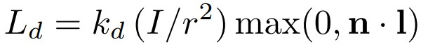

不过曾经有人提出一种基于冷到暖色调变化进行着色的技术，使物体的轮廓线比直接使用漫反射更加明显，而且具有多种色调的变化，卡通渲染中大多使用这种技术。原理就是修改上面公式中的最后一项$n \cdot l$，我们将用这个值扩展得到的二维向量$(n \cdot l, n \cdot l)$来作为uv坐标，使用特定的渐变纹理进行采样，得到需要的颜色并返回到上面公式中作为最后一项。

因此实现渐变纹理只需要轻微改变漫反射即可。我们使用半兰伯特光照模型的漫反射，看看它的效果如何。

```
Shader "Learn/Ramp Texture"
{
	Properties{
		_Color("Color Tint", Color) = (1,1,1,1)
		_RampTex("Ramp Tex", 2D) = "white" {}
		_Specular("Specular", Color) = (1,1,1,1)
		_Gloss("Gloss", Range(8.0,256)) = 20
	}

	SubShader{
		Pass{
			Tags { "LightMode" = "ForwardBase"}

			CGPROGRAM
			#pragma vertex vert
			#pragma fragment frag
			#include "Lighting.cginc"

			fixed4 _Color;
			sampler2D _RampTex;
			float4 _RampTex_ST;
			fixed4 _Specular;
			float _Gloss;

			struct a2v{
				float4 vertex : POSITION;
				float3 normal : NORMAL;
				float4 texcoord : TEXCOORD0;
			};

			struct v2f{
				float4 pos : SV_POSITION;
				float3 worldNormal : TEXCOORD0;
				float3 worldPos : TEXCOORD1;
				float2 uv : TEXCOORD2;
			};

			v2f vert(a2v v){
				v2f o;
				o.pos = UnityObjectToClipPos(v.vertex);
				o.worldNormal = UnityObjectToWorldNormal(v.normal);
				o.worldPos = mul(unity_ObjectToWorld, v.vertex).xyz;
				o.uv = TRANSFORM_TEX(v.texcoord, _RampTex);

				return o;
			}

			fixed4 frag(v2f i) : SV_Target{
				fixed3 worldNormal = normalize(i.worldNormal);
				fixed3 worldPos = normalize(i.worldPos);
				fixed3 worldLightDir = normalize(UnityWorldSpaceLightDir(worldPos));

				fixed3 ambient = UNITY_LIGHTMODEL_AMBIENT.xyz;

				fixed halfLambert = 0.5 * dot(worldNormal, worldLightDir) + 0.5;
				//需要修改的地方
				fixed3 diffuseColor = tex2D(_RampTex, fixed2(halfLambert, halfLambert)).rgb * _Color.rgb;

				fixed3 diffuse = _LightColor0.rgb * diffuseColor;

				fixed3 viewDir = normalize(UnityWorldSpaceViewDir(worldPos));
				fixed3 halfDir = normalize(worldNormal + viewDir);
				fixed3 specular = _LightColor0.rgb * _Specular.rgb * pow(max(0,dot(worldNormal, halfDir)), _Gloss);

				return fixed4(ambient + diffuse + specular, 1.0);
			}

			ENDCG
		}
	}
	FallBack "Specular"

}
```

除了漫反射外，其它地方完全不用修改，得到下面的结果：

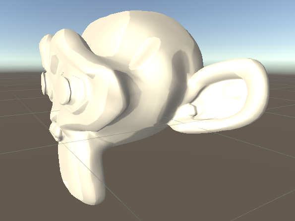

我们看到了明显的颜色变化，而非之前平滑的颜色过渡了，这就是渐变纹理，书中还提供了其它纹理，可以查看它们的不同效果。

# 遮罩纹理

在前面的学习中，我们可能会苦恼于镜面光的位置无法控制，因为物体表面不同部分对光的反射各不相同，使用统一的计算显然无法得到不同的结果。但是使用遮罩纹理就可以实现这一点，遮罩纹理可以保护某些区域，在采样的时候将得到一个矢量，它的RGBA通道可能存储了不同的数据，那么在计算中我们让光照乘以其中某个值，让这个通道原本的光照值被改变，就能完成对模型不同表面的遮罩。

具体实现上，让顶点根据默认的uv坐标，对遮罩纹理进行采样，然后直接和镜面光相乘，就可以了，因为我们这里使用的遮罩纹理很简单，它的每个通道都是相同的值，全部表示镜面光强度。

```
Shader "Learn/MaskTexture"
{
    Properties{
        _Color("Color Tint", Color) = (1,1,1,1)
        _MainTex("Main Tex", 2D) = "white" {}
        _BumpMap("Normal Map", 2D) = "bump" {}
        _BumpScale("Bump Scale", Float) = 1.0
        _SpecularMask("Specular Mask", 2D) = "white" {}
        _SpecularScale("Specular Scale", Float) = 1.0
        _Specular("Specular", Color) = (1,1,1,1)
        _Gloss("Gloss", Range(8.0,256)) = 20
    }

    SubShader{
        Pass{
            Tags{
                "LightMode" = "ForwardBase"
            }

            CGPROGRAM
            #pragma vertex vert
            #pragma fragment frag

            #include "Lighting.cginc"

            fixed4 _Color;
            sampler2D _MainTex;
            float4 _MainTex_ST;
            sampler2D _BumpMap;
            float _BumpScale;
            sampler2D _SpecularMask;
            float _SpecularScale;
            float4 _Specular;
            float _Gloss;

            struct a2v{
                float4 vertex : POSITION;
                float3 normal : NORMAL;
                float4 tangent : TANGENT;
                float4 texcoord : TEXCOORD0;
            };

            struct v2f{
                float4 pos : SV_POSITION;
                float2 uv : TEXCOORD0;
                float3 lightDir : TEXCOORD1;
                float3 viewDir : TEXCOORD2;
            };

            v2f vert(a2v v){
                v2f o;
                o.pos = UnityObjectToClipPos(v.vertex);

                o.uv.xy = v.texcoord.xy * _MainTex_ST.xy + _MainTex_ST.zw;

                TANGENT_SPACE_ROTATION;
                o.lightDir = mul(rotation, ObjSpaceLightDir(v.vertex)).xyz;
                o.viewDir = mul(rotation, ObjSpaceViewDir(v.vertex)).xyz;

                return o;
            }

            fixed4 frag(v2f i) : SV_Target{
                fixed3 tangentLightDir = normalize(i.lightDir);
                fixed3 tangentViewDir = normalize(i.viewDir);

                fixed3 tangentNormal = UnpackNormal(tex2D(_BumpMap, i.uv));
                tangentNormal.xy *= _BumpScale;
                tangentNormal.z = sqrt(1.0 - saturate(dot(tangentNormal.xy, tangentNormal.xy)));

                fixed3 albedo = tex2D(_MainTex, i.uv).rgb * _Color.rgb;

                fixed3 ambient = UNITY_LIGHTMODEL_AMBIENT.xyz * albedo;

                fixed3 diffuse = _LightColor0.rgb * albedo * max(0, dot(tangentNormal, tangentLightDir));

                fixed3 halfDir = normalize(tangentLightDir + tangentViewDir);

                fixed3 specularMask = tex2D(_SpecularMask, i.uv).r * _SpecularScale;
				//修改镜面光计算
                fixed3 specular = _LightColor0.rgb * _Specular.rgb * pow(max(0,dot(tangentNormal, halfDir)), _Gloss) * specularMask;

                return fixed4(ambient + diffuse + specular, 1.0);
            }


            ENDCG
        }
    }
    FallBack "Diffuse"
}

```

上面的代码中我们使用主纹理的缩放、平移对所有纹理进行了操作，这意味着调整主纹理的属性能影响到其它纹理。下面是这个着色器的结果。

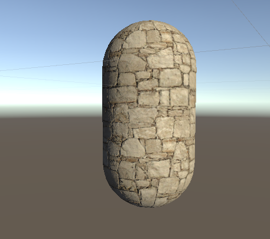

上面提供的讲解都很简单，以后我们可能会进一步使用它们。

# 透明效果

纹理基础结束后，我们进入透明效果的学习，之前的学习中我们只使用了颜色通道的RGB值，Alpha并没有使用，他就是表示透明度的，当这个值为1，像素完全显示；这个值为0，像素不会显示。

我们将学习两种实现透明的方式，透明度测试（无法实现真正的半透明）和透明度混合。

## 透明度测试

只要一个片元的透明度不满足条件，那么将直接舍弃这个片元，它不会对颜色缓冲有任何影响。在Unity Shader中我们可以使用clip函数完成这个测试。

```
// Upgrade NOTE: replaced '_Object2World' with 'unity_ObjectToWorld'
// Upgrade NOTE: replaced 'mul(UNITY_MATRIX_MVP,*)' with 'UnityObjectToClipPos(*)'

Shader "Learn/Alpha Test"
{
	Properties{
		_Color("Main Tint", Color) = (1,1,1,1)
		_MainTex("Main Tex", 2D) = "white" {}
		_Cutoff("Alpha Cutoff", Range(0,1)) = 0.5
	}

	SubShader{
		Tags{"Queue" = "AlphaTest" "IgnoreProjector" = "True" "RenderType" = "TransparentCutout"}

		Pass{
			Tags {"LightMode" = "ForwardBase"}
		

		CGPROGRAM

		#pragma vertex vert
		#pragma fragment frag

		#include "Lighting.cginc"

		fixed4 _Color;
		sampler2D _MainTex;
		float4 _MainTex_ST;
		fixed _Cutoff;

		struct a2v{
			float4 vertex : POSITION;
			float3 normal : NORMAL;
			float4 texcoord : TEXCOORD0;
		};

		struct v2f{
			float4 pos : SV_POSITION;
			float3 worldNormal : TEXCOORD0;
			float3 worldPos : TEXCOORD1;
			float2 uv : TEXCOORD2;
		};

		v2f vert(a2v v)
		{
			v2f o;
			o.pos = UnityObjectToClipPos(v.vertex);
			
			o.worldNormal = UnityObjectToWorldNormal(v.normal);
			o.worldPos = mul(unity_ObjectToWorld, v.vertex).xyz;
			o.uv = TRANSFORM_TEX(v.texcoord, _MainTex);
			return o;
		}

		fixed4 frag(v2f i) : SV_Target{
			fixed3 worldNormal = normalize(i.worldNormal);
			fixed3 worldLightDir = normalize(UnityWorldSpaceLightDir(i.worldPos));
			fixed4 texColor = tex2D(_MainTex, i.uv);

			clip(texColor.a - _Cutoff);

			fixed3 albedo = texColor.rgb * _Color.rgb;
			fixed3 ambient = UNITY_LIGHTMODEL_AMBIENT.xyz * albedo;
			fixed3 diffuse = _LightColor0.rgb * albedo * max(0, dot(worldNormal, worldLightDir));

			return fixed4(ambient + diffuse, 1.0);
		}


		ENDCG
	}
	}
	FallBack "Transparent/Cutout/VertexLit"
}
```

我们在SubShader开头使用了三个标签，第一个表示将该模型的渲染归于AlphaTest渲染队列。在渲染过程中，由于透明物体的存在，我们必须先渲染不透明物体，然后再渲染半透明物体，最终得到正确的渲染效果。不过即使这样做也会有问题，因为不同物体之间可能会有遮挡，这时我们不能直接让两个半透明物体渲染，因为它们的深度关系随着形状而改变，必须进一步分割模型网络才能得到正确结果。

Unity中定义了五个渲染队列，它们的含义如下：

* Bakcground：在其它队列之前绘制，适合背景上的物体；
* Geometry：默认的队列，不透明物体使用该队列；
* AlphaTest：使用透明度测试的物体；
* Transparent：在Geometry和AlphaTest之后，并且从后往前绘制使用了透明度混合的物体；
* Overlay：在最后渲染。

所以这里我们使用第一个队列。第二个标签是IgnoreProjector，开启后Shader不会受到投影器干扰；最后一个是RenderType，设置为TransparentCutout表示让Unity将这个Shader归入提前定义的组中，指明这个Shader使用了透明度测试。只需要知道，使用透明度测试的Shader一般都要使用这三个标签。

后面的代码就是之前很熟悉的了，不再讲解。这里注意Clip函数的使用即可。

完成后将这一章对应的纹理贴上去(素材都在[github](https://github.com/candycat1992/Unity_Shaders_Book)上)，这张纹理的alpha通道存储了不同的透明度。调整透明度的阈值，看到立方体的某些面消失了。

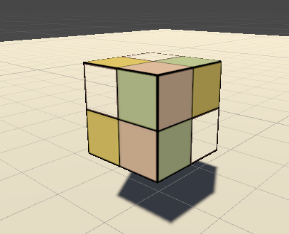

这个效果当然不是真正的透明，我们下面来看看透明度混合的做法。

## 透明度混合

开启透明度混合后，透明度将作为混合因子来对颜色进行处理。要注意的是，使用透明度混合必须关闭深度写入，但是却需要使用深度测试，这是因为深度写入将直接剔除那些在透明物体之后的点，同时我们又必须通过深度测试判断物体的前后顺序，所以这里深度测试对于我们来说是只读的，它不会影响深度缓存的内容。

使用Unity的混合命令就可以开启混合，它指定了混合时使用的混合函数。

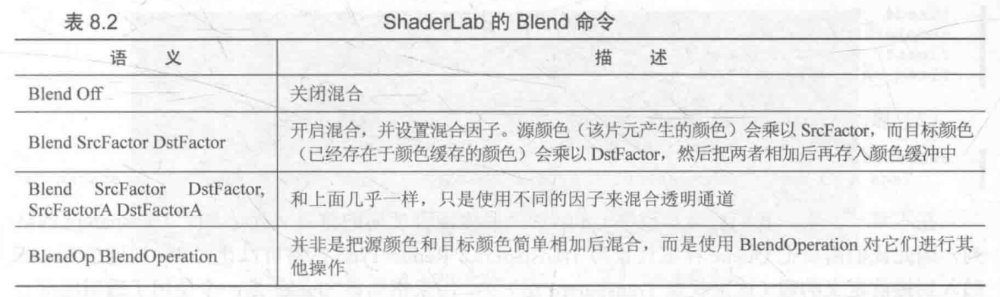

这里我们使用第二种函数，它处理RGBA的每一个通道，数学公式如下：

$$DstColor_{new}=SrcFactor*SrcColor+DstFctor*DstColor_{old}$$

除了相乘后加法以外，我们还可以使用其它不同的公式，使用BlendOp BlendOperation命令可以指定混合公式：

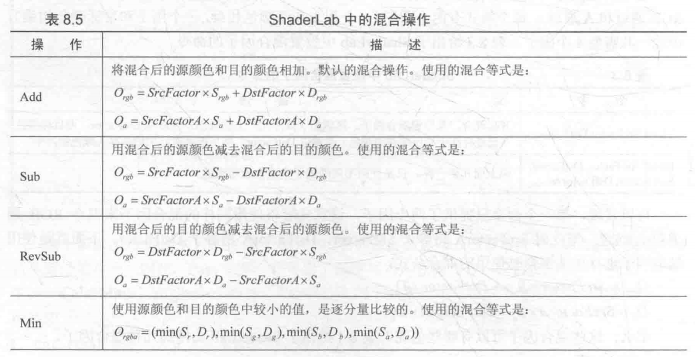

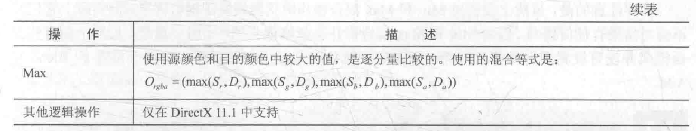

其中还可以进一步设置SrcFactor为源的Alpha值，DstFactor为1减去源的Alpha值。源指的是当前处理的颜色，也就是没有写入颜色缓存的值；目标指的是已经存在颜色缓存中的值，混合就是将当前处理的颜色和存在颜色缓冲的颜色进行混合，得到的新颜色再次覆盖原来颜色缓存中的值。将它转化成数学公式：

$$DstColor_{new}=SrcAlpha*SrcColor+(1-SrcAlpha)*DstColor_{old}$$

当然也有其它的指定方式，语法为[Blend SrcFactor DstFactor, SrcFactorA DstFactorA]。其中Factor可以替换为以下的值：

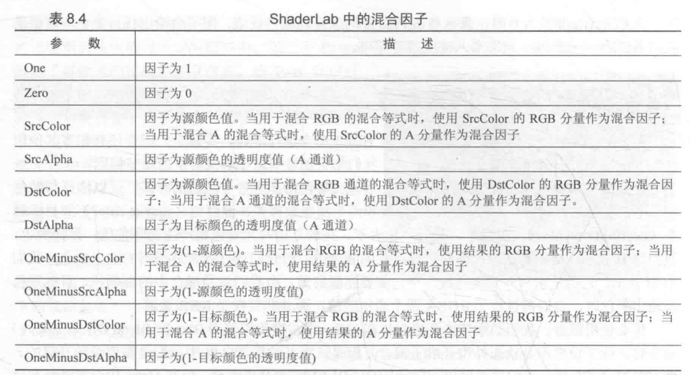

下面我们来实现这个Shader，使用和上面一样的Shader，然后修改几个地方。

首先将Properties修改如下，记得一并修改Pass中声明的变量：

```
Properties{
		_Color("Main Tint", Color) = (1,1,1,1)
		_MainTex("Main Tex", 2D) = "white" {}
		_AlphaScale("Alpha Scale", Range(0,1)) = 1
	}
	
		fixed4 _Color;
		sampler2D _MainTex;
		float4 _MainTex_ST;
		fixed _AlphaScale;
```

新增的变量AlphaScale用于控制整体的透明度。然后修改标签如下：

```
Tags{"Queue" = "Transparent" "IgnoreProjector" = "True" "RenderType" = "Transparent"}
```

RenderType指明了Shader是一个透明度混合的Shader。我们还需要在Pass中关闭深度写入，设置混合因子：

```
Pass{
			Tags {"LightMode" = "ForwardBase"}
		
		ZWrite Off
		Blend SrcAlpha OneMinusSrcAlpha
```

接下来修改片元着色器：

```
fixed4 frag(v2f i) : SV_Target{
			fixed3 worldNormal = normalize(i.worldNormal);
			fixed3 worldLightDir = normalize(UnityWorldSpaceLightDir(i.worldPos));
			fixed4 texColor = tex2D(_MainTex, i.uv);
			fixed3 albedo = texColor.rgb * _Color.rgb;

			fixed3 ambient = UNITY_LIGHTMODEL_AMBIENT.xyz * albedo;
			fixed3 diffuse = _LightColor0.rgb * albedo * max(0, dot(worldNormal, worldLightDir));

			return fixed4(ambient + diffuse, texColor.a * _AlphaScale);
		}
```

其实仅修改了返回值的Alpha，就得到下面的效果了：

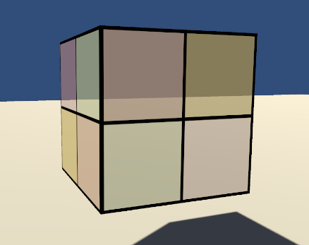

到这里我们不得不面对前面提到的一个问题：模型本身具有复杂遮挡关系时，如何保证每个部分的排序正确？由于我们关闭了深度写入，所以无法对模型进行像素级别的深度排序，不可避免地会出现一些排序错误的情况。这里我们可以使用开启深度写入的半透明效果解决这个问题。

## 开启深度写入的半透明效果

我们使用两个Pass来渲染一个模型，第一个Pass开启深度写入但是不写入颜色，这时我们的深度缓冲中已经存在了正确的深度信息；第二个Pass进行正常的透明混合，此时就可以使用和前面相同的操作了。只不过这种方法增加了性能开销。

我们只需要在前一个小节的Shader中加入以下的Pass：

```
Pass{
			ZWrite On
			ColorMask 0
		}
```

这个Pass开启了深度写入，然后使用ColorMask语义设置颜色通道的写掩码，可以是RGB/A/0/RGBA的任意组合，0表示Pass不写入任何颜色通道，不会修改颜色缓冲。

我们得到了这样的效果：

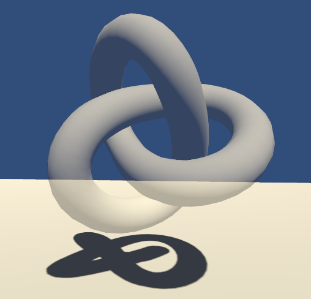

如果使用前一节的Shader，得到的就是错误的渲染：

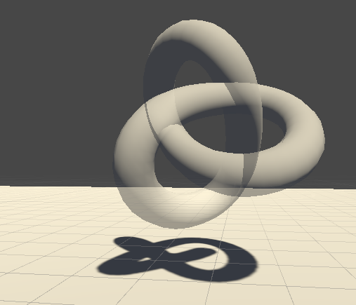

## 双面渲染的透明效果

之前的渲染中，我们没有开启双面渲染，这导致半透明物体的内部结构完全是看不到的，看起来就像只有半个一样。因此我们可以使用Cull指令来控制需要剔除哪个面，它的语法是：

Cull Back | Front | Off

设置为Back时背对摄像机的图元不会被渲染，也是默认情况；Front时朝向摄像机的图元不会被渲染；Off时关闭剔除功能。

### 透明度测试的双面渲染效果

只需要在前面透明度测试的代码中添加下面的Cull命令就能看到效果：

```
		Pass{
			Tags {"LightMode" = "ForwardBase"}

		Cull Off
```

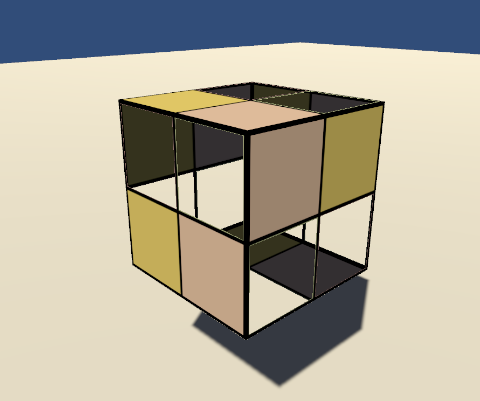

### 透明度混合的双面渲染效果

我们使用两个Pass，第一个Pass负责渲染背面，第二个Pass负责渲染正面，Unity将按顺序执行Pass，所以背面将先被渲染，这保证了渲染顺序的正确。所以将之前Shader中的Pass复制一份，第一个Pass开启剔除正面，第二个Pass开启剔除背面。

```
Pass{
			Tags {"LightMode" = "ForwardBase"}
		
		Cull Front


Pass{
			Tags {"LightMode" = "ForwardBase"}
		
		Cull Back
```

得到下面的结果：

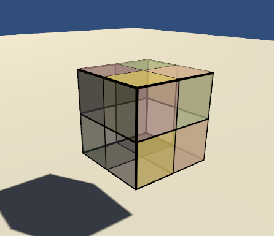

## 透明总结

到这里入门系列就结束了，透明部分主要是使用了各项ShaderLab的设置，没有太多的代码，重点是实现透明效果的两种方法，以及混合的原理，通过开启面的剔除可以得到双面渲染的结果。这里还尝试了使用多个Pass处理问题，是比较消耗性能的做法。

后面部分是中级篇，讲了进阶光照，高级纹理和动态Shder的实现。
