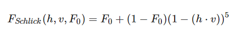

这里我们进一步学习入门精要的高级纹理，之所以跳过高级光照是因为该部分说明的内容不会影响我们直接学习高级纹理，由于学习了PBR，不如直接将立方体贴图讲清楚，之后再慢慢研究光照。除此外，高级纹理还包括渲染纹理和程序纹理。

<!--more-->

# 立方体纹理

我们之前已经接触过立方体贴图了，它包含六张图像，分别对应正方体的六个面。而读取立方体纹理需要的是三维矢量，不再是uv了，这个三维矢量从正方体的中心作为原点出发，然后按照矢量方向和立方体相交，该点得到的信息就是采样的颜色了。

立方体贴图是环境映射的一种实现方式，之前PBR的博客里有提到，PBR的全流程中光照只是基础部分，真正要实现PBR的光照需要配合各种贴图完成，尤其是用环境贴图达成近似的全局光照GI，这才是PBR的核心。PBR使用的环境贴图Ambient Occlusion，就是一张立方体贴图；我们Unity中的天空盒使用的也是立方体贴图。

使用立方体纹理的好处是简单易用，但是不灵活，因为它不是实时的，每当环境光照发生改变，都要重新对立方体纹理进行渲染，并且本身也不是完全的全局光照，本质上仅仅对周围环境进行了一次采样，还是属于局部光照的范畴。

## 天空盒

Unity中提供了一个用于解析立方体天空和的Shader，位于Skybox/6 Sided，新建纹理并应用该着色器后，会看到材质面板中出现六个纹理位置，我们可以将需要的纹理放置到对应的位置。


其中使用的纹理位于入门精要提供的github地址，图片名称标记了该图片对应的位置。之后我们打开Window/Rendering/Lighting，选择天空盒为这个新的材质。


这样我们得到下面的效果：


## 创建环境映射的立方体纹理

Unity中，如果已经有了立方体纹理，那么我们将它的Texture Type设置为Cubemap即可。但是很多时候我们都是自己搭建的场景，我们希望场景中的物体都有自己的环境立方体纹理，这样手动创建就会很麻烦，所以我们可以通过脚本创建，使用Unity提供的Camera.RenderToCubemap函数可以完成这个任务。


接下来我们要稍微接触一点Unity Editor的内容，unity editor是一个通用的编辑器，提供了unity内部对象的创建，预览，编辑的功能及可视化界面。通过使用unity提供的编辑函数，我们可以修改或者添加界面内容，定制编辑器。用于修改编辑器的脚本文件应存放在Editor文件夹中。在这里我们为了创建环境映射，需要编写一个脚本，它的功能是渲染指定位置的立方体纹理，并存储到指定的Cubemap中。

首先，我们来编写这样一个脚本，入门精要提供了代码，使用了Editor将脚本直接添加到菜单中(毕竟不太可能对每个物体都手动添加一遍这个脚本组件，然后开始一次游戏，再删除脚本组件)，这样我们右键需要的物体，就能实现这个功能了。

```C#
using UnityEngine;
using UnityEditor;
using System.Collections;

//继承ScriptableWizard以创建编辑器向导
public class RenderCubemapWizard : ScriptableWizard {
	//待指定的物体位置
	public Transform renderFromPosition;
    //待指定的立方体纹理
	public Cubemap cubemap;
	
    //在向导打开或者用户在向导中更改内容时，将调用此函数。
	void OnWizardUpdate () {
		helpString = "Select transform to render from and cubemap to render into";
		isValid = (renderFromPosition != null) && (cubemap != null);
	}
	//调用RenderToCubemap以生成立方体纹理
	void OnWizardCreate () {
		// create temporary camera for rendering
		GameObject go = new GameObject( "CubemapCamera");
		go.AddComponent<Camera>();
		// place it on the object
		go.transform.position = renderFromPosition.position;
		// render into cubemap		
		go.GetComponent<Camera>().RenderToCubemap(cubemap);
		
		// destroy temporary camera
		DestroyImmediate( go );
	}
	//序列化设置
	[MenuItem("GameObject/Render into Cubemap")]
	static void RenderCubemap () {
		ScriptableWizard.DisplayWizard<RenderCubemapWizard>(
			"Render cubemap", "Render!");
	}
}
```

保存该脚本后，场景中创建一个Empty GameObject，然后使用Create/Legacy/Cubemap创建一个立方体纹理，注意要将创建的Cubemap的Readable选项勾选，因为我们马上要修改这个文件。Cubemap的face size控制着Cubemap的大小和精度，size越大渲染的分辨率越大。

然后右键Game Object，选择Render into Cubemap，打开编辑器向导：


其中我们可以指定待渲染的位置和待修改的立方体贴图，将之前创建的两个对象拖进去，点击Render即可得到渲染好的Cubemap。

## 反射

反射和折射是最常见的环境映射，我们先看看反射的效果，它能制作一个类似金属的反射效果。仍然使用之前创建的天空盒，新建Shader和默认材质，向场景中添加一个Teapot模型，在入门精要的Github上可以找到。

```C#
Shader "Learn/Reflection"
{
	Properties{
		_Color ("Color Tint", Color) = (1, 1, 1, 1)
		_ReflectColor ("Reflection Color", Color) = (1, 1, 1, 1)
		_ReflectAmount ("Reflect Amount", Range(0, 1)) = 1
		_Cubemap ("Reflection Cubemap", Cube) = "_Skybox" {}
	}

	SubShader{
			Tags { "RenderType"="Opaque" "Queue"="Geometry"}
		
		Pass { 
			Tags { "LightMode"="ForwardBase" }
			
			CGPROGRAM
			
			#pragma multi_compile_fwdbase
			
			#pragma vertex vert
			#pragma fragment frag
			
			#include "Lighting.cginc"
			#include "AutoLight.cginc"
			
			fixed4 _Color;
			fixed4 _ReflectColor;
			fixed _ReflectAmount;
			samplerCUBE _Cubemap;
			
			struct a2v {
				float4 vertex : POSITION;
				float3 normal : NORMAL;
			};
			
			struct v2f {
				float4 pos : SV_POSITION;
				float3 worldPos : TEXCOORD0;
				fixed3 worldNormal : TEXCOORD1;
				fixed3 worldViewDir : TEXCOORD2;
				fixed3 worldRefl : TEXCOORD3;
				SHADOW_COORDS(4)
			};

			v2f vert(a2v v){
				v2f o;
				o.pos = UnityObjectToClipPos(v.vertex);
				
				o.worldNormal = UnityObjectToWorldNormal(v.normal);
				
				o.worldPos = mul(unity_ObjectToWorld, v.vertex).xyz;
				
				o.worldViewDir = UnityWorldSpaceViewDir(o.worldPos);
				
				o.worldRefl = reflect(-o.worldViewDir, o.worldNormal);

				TRANSFER_SHADOW(o);

				return o;
			}

			fixed4 frag(v2f i) : SV_Target{
				fixed3 worldNormal = normalize(i.worldNormal);
				fixed3 worldLightDir = normalize(UnityWorldSpaceLightDir(i.worldPos));
				fixed3 worldViewDir = normalize(i.worldViewDir);

				fixed3 ambient = UNITY_LIGHTMODEL_AMBIENT.xyz;

				fixed3 diffuse = _LightColor0.rgb * _Color.rgb * max(0, dot(worldNormal, worldLightDir));

				fixed3 reflection = texCUBE(_Cubemap, i.worldRefl).rgb * _ReflectColor.rgb;

				UNITY_LIGHT_ATTENUATION(atten, i, i.worldPos);

				fixed3 color = ambient + lerp(diffuse, reflection, _ReflectAmount) * atten;

				return fixed4(color, 1.0);
			}

			ENDCG

		}
	}
	FallBack "Reflective/VertexLit"
}
```

上面的代码中，使用Cube类型的属性Cubemap存储立方体纹理，然后在Pass中用samplerCUBE映射到实际值。UNITY_LIGHT_ATTENUATION是计算光照衰减的，我们通过计算世界空间下观察方向和法线方向，根据光路可逆原则，要找到光线经过反射后达到摄像机的颜色，可以通过计算观察方向到物体的反射方向得到，因此调用内置函数得到光线的入射方向，然后用这个方向对之前渲染的立方体贴图进行采样，得到该点立方体贴图的值，最后再根据ReflectAmount对漫反射颜色和采样得到的反射颜色插值。

当反射比例为1时，我们得到下面的效果：


Teapot完全反射了场景的颜色，或者说是天空盒的颜色。这里我们是在顶点着色器中计算的反射方向，如果要精细可以在片元着色器中计算，会得到更好的结果。

## 折射

折射是另一种环境映射的方法，光线照射到物体表面以后，一部分发生折射进入物体，经过物体内部反射又射出物体，因此最少用两次反射可以物理意义上地模拟折射。不过我们这里使用一次即可，因为它看起来也不那么差。

方法和前面一致，不同的是我们使用refraction内置函数计算折射的方向，它接受三个参数，第一个是光线入射方向，第二个是法线方向，最后还有一个参数是入射光线所在介质和折射光线所在介质的比值，和高中物理的计算一样，它返回折射方向，模等于入射光线，它不关心强度。

```C#
// Upgrade NOTE: replaced '_Object2World' with 'unity_ObjectToWorld'
// Upgrade NOTE: replaced 'mul(UNITY_MATRIX_MVP,*)' with 'UnityObjectToClipPos(*)'

Shader "Learn/Refraction" {
	Properties {
		_Color ("Color Tint", Color) = (1, 1, 1, 1)
		_RefractColor ("Refraction Color", Color) = (1, 1, 1, 1)
		_RefractAmount ("Refraction Amount", Range(0, 1)) = 1
		_RefractRatio ("Refraction Ratio", Range(0.1, 1)) = 0.5
		_Cubemap ("Refraction Cubemap", Cube) = "_Skybox" {}
	}
	SubShader {
		Tags { "RenderType"="Opaque" "Queue"="Geometry"}
		
		Pass { 
			Tags { "LightMode"="ForwardBase" }
		
			CGPROGRAM
			
			#pragma multi_compile_fwdbase	
			
			#pragma vertex vert
			#pragma fragment frag
			
			#include "Lighting.cginc"
			#include "AutoLight.cginc"
			
			fixed4 _Color;
			fixed4 _RefractColor;
			float _RefractAmount;
			fixed _RefractRatio;
			samplerCUBE _Cubemap;
			
			struct a2v {
				float4 vertex : POSITION;
				float3 normal : NORMAL;
			};
			
			struct v2f {
				float4 pos : SV_POSITION;
				float3 worldPos : TEXCOORD0;
				fixed3 worldNormal : TEXCOORD1;
				fixed3 worldViewDir : TEXCOORD2;
				fixed3 worldRefr : TEXCOORD3;
				SHADOW_COORDS(4)
			};
			
			v2f vert(a2v v) {
				v2f o;
				o.pos = UnityObjectToClipPos(v.vertex);
				
				o.worldNormal = UnityObjectToWorldNormal(v.normal);
				
				o.worldPos = mul(unity_ObjectToWorld, v.vertex).xyz;
				
				o.worldViewDir = UnityWorldSpaceViewDir(o.worldPos);
				
				// Compute the refract dir in world space
				o.worldRefr = refract(-normalize(o.worldViewDir), normalize(o.worldNormal), _RefractRatio);
				
				TRANSFER_SHADOW(o);
				
				return o;
			}
			
			fixed4 frag(v2f i) : SV_Target {
				fixed3 worldNormal = normalize(i.worldNormal);
				fixed3 worldLightDir = normalize(UnityWorldSpaceLightDir(i.worldPos));
				fixed3 worldViewDir = normalize(i.worldViewDir);
								
				fixed3 ambient = UNITY_LIGHTMODEL_AMBIENT.xyz;
				
				fixed3 diffuse = _LightColor0.rgb * _Color.rgb * max(0, dot(worldNormal, worldLightDir));
				
				// Use the refract dir in world space to access the cubemap
				fixed3 refraction = texCUBE(_Cubemap, i.worldRefr).rgb * _RefractColor.rgb;
				
				UNITY_LIGHT_ATTENUATION(atten, i, i.worldPos);
				
				// Mix the diffuse color with the refract color
				fixed3 color = ambient + lerp(diffuse, refraction, _RefractAmount) * atten;
				
				return fixed4(color, 1.0);
			}
			
			ENDCG
		}
	} 
	FallBack "Reflective/VertexLit"
}

```

此时使用的第一个参数是观察方向的反方向，如果将折射率拉到1，那么这样的结果应该会导致我们计算的折射光采样的就是观察方向指向的天空盒子，但是毕竟我们本来也仅仅做了一次折射，都是不符合物理规律的。


调整折射率为1后得到一个半透明的Teapot：


这样的表现验证了我们的想法，书中这里没有详细说明，只介绍了内置折射函数的使用。

## 菲涅尔反射

前面我们PBR的博客中粗略说过菲涅尔反射，这里我们仍然采用相同的近似公式进行计算：



然后重新新建材质和Shader，修改代码如下：

```C#

Shader "Learn/Fresnel"
{
	Properties{
		_Color ("Color Tint", Color) = (1, 1, 1, 1)
		_FresnelScale("Fresnel Scale", Range(0,1)) = 0.5
		_Cubemap ("Reflection Cubemap", Cube) = "_Skybox" {}
	}

	SubShader{
			Tags { "RenderType"="Opaque" "Queue"="Geometry"}
		
		Pass { 
			Tags { "LightMode"="ForwardBase" }
			
			CGPROGRAM
			
			#pragma multi_compile_fwdbase
			
			#pragma vertex vert
			#pragma fragment frag
			
			#include "Lighting.cginc"
			#include "AutoLight.cginc"
			
			fixed4 _Color;
			fixed _FresnelScale;
			samplerCUBE _Cubemap;
			
			struct a2v {
				float4 vertex : POSITION;
				float3 normal : NORMAL;
			};
			
			struct v2f {
				float4 pos : SV_POSITION;
				float3 worldPos : TEXCOORD0;
				fixed3 worldNormal : TEXCOORD1;
				fixed3 worldViewDir : TEXCOORD2;
				fixed3 worldRefl : TEXCOORD3;
				SHADOW_COORDS(4)
			};

			v2f vert(a2v v){
				v2f o;
				o.pos = UnityObjectToClipPos(v.vertex);
				o.worldNormal = UnityObjectToWorldNormal(v.normal);
				o.worldPos = mul(unity_ObjectToWorld, v.vertex).xyz;
				o.worldViewDir = UnityWorldSpaceViewDir(o.worldPos);
				o.worldRefl = reflect(-o.worldViewDir, o.worldNormal);
				TRANSFER_SHADOW(o);
				return o;
			}

			fixed4 frag(v2f i) : SV_Target{
				fixed3 worldNormal = normalize(i.worldNormal);
				fixed3 worldLightDir = normalize(UnityWorldSpaceLightDir(i.worldPos));
				fixed3 worldViewDir = normalize(i.worldViewDir);

				fixed3 ambient = UNITY_LIGHTMODEL_AMBIENT.xyz;

				UNITY_LIGHT_ATTENUATION(atten, i, i.worldPos);


				fixed3 reflection = texCUBE(_Cubemap, i.worldRefl).rgb;

				fixed fresnel = _FresnelScale + (1 - _FresnelScale) * pow(1 - dot(worldViewDir, worldNormal), 5);
				fixed3 diffuse = _LightColor0.rgb * _Color.rgb * max(0, dot(worldNormal, worldLightDir));
				
				fixed3 color = ambient + lerp(diffuse, reflection, saturate(fresnel)) * atten;

				return fixed4(color, 1.0);
			}


			ENDCG

		}
	}
	FallBack "Reflective/VertexLit"
}
```

计算菲涅尔项以后，我们将它作为插值因子来计算漫反射和反射之间的比例，当调整FresnelScale为0时，我们可以重新观察茶壶边缘，此时它的边缘会反射光线，而正面几乎不会反射光线。


后面会使用菲涅尔反射来简单模拟一个水面的效果。

# 渲染纹理

下面我们学习渲染纹理，在渲染过程中，我们把渲染的结果输出到颜色缓冲，再显示到屏幕上，不过现在我们可以把渲染结果存储到一个纹理中，这被称为RTT(Render Target Texture)技术。这种专门的纹理类型就是渲染纹理，在Unity中我们可以直接创建一个渲染纹理，并设置摄像机的渲染目标为该纹理；也可以利用屏幕后处理的命令来获取屏幕图像，将它放到和屏幕分辨率相同的渲染纹理中。

下面我们分别学习这两种方式。

## 镜子效果

我们可以用渲染纹理实现一个很简陋的镜子效果，但是它非常简单。之前我们知道可以让摄像机将画面存到渲染纹理中，那么我们搭建场景如下，然后创建一个摄像机，将它的Target Texture设置为新建的Render Texture，设置渲染纹理的属性为Readable，这样该摄像机看到的画面就会被填充进这个纹理了。我们可以通过调整纹理的分辨率来控制镜子画面的清晰度。


利用这个特点，我们从观察视角的反方向观察物体，模拟从镜子中观察的效果，上面是观察视角的图片，反过来观察我们得到一个这样的渲染纹理：


这个图片作为镜子只差最后一步了，将它的横轴x反转！那我们当然能使用Shader来对该纹理进行采样，反转它uv坐标中的x，那么左右就颠倒了，实现了镜子一样的效果，代码如下：

```C#
Shader "Learn/Mirror" {
	Properties {
		_MainTex ("Main Tex", 2D) = "white" {}
	}
	SubShader {
		Tags { "RenderType"="Opaque" "Queue"="Geometry"}
		
		Pass {
			CGPROGRAM
			
			#pragma vertex vert
			#pragma fragment frag
			
			sampler2D _MainTex;
			
			struct a2v {
				float4 vertex : POSITION;
				float3 texcoord : TEXCOORD0;
			};
			
			struct v2f {
				float4 pos : SV_POSITION;
				float2 uv : TEXCOORD0;
			};
			
			v2f vert(a2v v) {
				v2f o;
				o.pos = UnityObjectToClipPos(v.vertex);
				
				o.uv = v.texcoord;
				o.uv.x = 1 - o.uv.x;
				
				return o;
			}
			
			fixed4 frag(v2f i) : SV_Target {
				return tex2D(_MainTex, i.uv);
			}
			
			ENDCG
		}
	} 
 	FallBack Off
}

```


仔细看还是很容易露馅的，毕竟它只是一张图片。我们这里采用了一个四边形Quad作为镜子，它仅有一个面是可见的，因此在上面的场景里镜子背后还有我们之前创建的摄像机，用于填充渲染纹理，它并不能看到镜子。而在我们的观察视角下，镜子采样渲染纹理并反转，实现了这样一个效果，此时是能看到四边形的。

## 玻璃效果

前面我们使用过透明的相关设置，它主要是通过渲染队列的优先级和混合完成的。现在为了模拟玻璃的效果，我们不能再使用那样简单的方法了，使用GrabPass后，Unity会把屏幕的图像绘制在一张纹理中，供后续的Pass访问。我们可以使用它来进行更复杂的处理，使用法线模拟折射的效果。同时也要注意设置GrabPass的渲染队列，渲染透明物体仍然要使用Transparent，才能保证不透明物体率先被绘制上去。

首先声明属性和设置标签，创建着色器要使用的结构体：

```
Properties
    {
        _MainTex ("Main Tex", 2D) = "white" {}
        _BumpMap ("Normal Map", 2D) = "bump" {}
        _Cubemap ("Environment Cubemap", Cube) = "_Skybox" {}
        _Distortion ("Distortion", Range(0,1000)) = 10
        _RefractAmount("Refract Amount", Range(0.0,1.0)) = 1.0
    }
    SubShader
    {
        Tags {"Queue" = "Transparent" "RenderType" = "Opaque"}

        GrabPass {"_RefractionTex"}


        Pass{
            Tags { "LightMode"="ForwardBase" }
            CGPROGRAM

            #pragma multi_compile_fwdbase	
			
			#pragma vertex vert
			#pragma fragment frag
			
			#include "UnityCG.cginc"
			#include "Lighting.cginc"
			#include "AutoLight.cginc"

            sampler2D _MainTex;
            float4 _MainTex_ST;
            sampler2D _BumpMap;
            float4 _BumpMap_ST;
            samplerCUBE _Cubemap;
            float _Distortion;
            fixed _RefractAmount;
            sampler2D _RefractionTex;
            float4 _RefractionTex_TexelSize;

            struct a2v{
                float4 vertex : POSITION;
                float3 normal : NORMAL;
                float4 tangent : TANGENT;
                float2 texcoord : TEXCOORD0;
            };

            struct v2f{
                float4 pos : SV_POSITION;
                float4 scrPos : TEXCOORD0;
                float4 uv : TEXCOORD1;
                float4 TtoW0 : TEXCOORD2;
                float4 TtoW1 : TEXCOORD3;
                float4 TtoW2 : TEXCOORD4;
            };
```

这里我们使用了颜色纹理、法线纹理、用来环境映射的立方体贴图，Distortion控制折射的扭曲程度，没有实际意义，RefractAmount控制反射和折射的比例。然后我们设置标签，使用Transparent作为渲染的队列，但是后面又设置RenderType为Opaque，表示不透明，这个不太好理解，主要是为了在使用着色器替换的时候能正确渲染这个物体，以后再说。

GrabPass {"_RefractionTex"}是我们定义的特殊Pass，这个Pass会抓取屏幕图像并存储到其中字符串定义的纹理中，它并不会被创建到我们的Project中，而是用于后续的Pass访问。在后面其它声明的时候还要额外声明这个纹理的sampler，用RefractionTex_TexelSize可以存储纹理的纹素大小，例如一个256*512的纹理的纹素大小是(1/256,1/512)，我们需要用它计算渲染纹理采样的偏移。

此外，为了使用法线计算折射效果，我们还要将切线空间的法线转换到世界空间中。

```
v2f vert(a2v v){
                v2f o;
                o.pos = UnityObjectToClipPos(v.vertex);

                o.scrPos = ComputeGrabScreenPos(o.pos);

                o.uv.xy = TRANSFORM_TEX(v.texcoord, _MainTex);
                o.uv.zw = TRANSFORM_TEX(v.texcoord, _BumpMap);

                float3 worldPos = mul(unity_ObjectToWorld, v.vertex);
                fixed3 worldNormal = UnityObjectToWorldNormal(v.normal);
                fixed3 worldTangent = UnityObjectToWorldDir(v.tangent.xyz);
                fixed3 worldBinormal = cross(worldNormal, worldTangent) * v.tangent.w;

                o.TtoW0 = float4(worldTangent.x, worldBinormal.x, worldNormal.x, worldPos.x);
                o.TtoW1 = float4(worldTangent.y, worldBinormal.y, worldNormal.y, worldPos.y);
                o.TtoW2 = float4(worldTangent.z, worldBinormal.z, worldNormal.z, worldPos.z);

                return o;
            }
```

顶点着色器中，ComputeGrabScreenPos内置函数计算了顶点在被抓取的屏幕上(渲染纹理)的采样坐标，并存储到v2f中；然后TRANSFORM_TEX计算纹理坐标的Tiling和Offset，两个纹理分别存储到xy和zw中。然后是变换矩阵的计算，后面方便对Cubemap采样，要得到从切线空间到世界空间的变换矩阵，就用切线、副切线和法线在世界空间下的矢量表示按照列排列，最后用一列存储顶点在世界空间的坐标。

```
fixed4 frag(v2f i) : SV_Target{
                float3 worldPos = float3(i.TtoW0.w, i.TtoW1.w, i.TtoW2.w);
                fixed3 worldViewDir = normalize(UnityWorldSpaceViewDir(worldPos));

                fixed3 bump = UnpackNormal(tex2D(_BumpMap, i.uv.zw));

                float2 offset = bump.xy * _Distortion * _RefractionTex_TexelSize.xy;
				i.scrPos.xy = offset * i.scrPos.z + i.scrPos.xy;

                fixed3 refrCol = tex2D(_RefractionTex, i.scrPos.xy/i.scrPos.w).rgb;

                bump = normalize(half3(dot(i.TtoW0.xyz, bump), dot(i.TtoW1.xyz, bump), dot(i.TtoW2.xyz, bump)));

                fixed3 reflDir = reflect(-worldViewDir, bump);
                fixed4 texColor = tex2D(_MainTex, i.uv.xy);
                fixed3 reflCol = texCUBE(_Cubemap, reflDir).rgb * texColor.rgb;

                fixed3 finalColor = reflCol * (1 - _RefractAmount) + refrCol * _RefractAmount;

                return fixed4(finalColor, 1);
            }
```

片元着色器中，获得世界坐标系下顶点位置和观察方向，接着用UnpackNormal内置函数对采样得到的法线值进行转换，得到切线空间的法线矢量，对矢量的xy值(代表切线和副切线方向的值)乘以Distortion和RefractionTex_TexelSize.xy以计算偏移，给顶点在被抓取的屏幕采样的坐标加上这个偏移，此时这个offset反映了法线的扰动情况。

然后计算折射的颜色，对被抓取屏幕的采样坐标除以w分量以得到真正的屏幕坐标，然后对这个渲染纹理采样，得到折射颜色。

> 虽然叫它屏幕坐标，但是它实际上没有除以w分量，意味着此时w分量不为1，原因是之前顶点要插值得到片元，ComputeGrabScreenPos函数计算后保留了齐次除法，以得到更精确的插值结果。裁剪空间[-1,1]到视口空间[0,1]的变换是先进行齐次除法完成投影，然后将xy分量除以2加上0.5。

之后将切线空间的法线转换到世界空间，计算反射颜色，内置函数得到光线的入射方向，对颜色纹理采样得到漫反射颜色，对立方体贴图使用入射方向采样得到入射光线的颜色，乘以漫反射颜色得到最终的反射颜色，之后根据RefractAmount作为混合因子，计算实际颜色并返回，这样就完成了。

然后我们来创建场景，使用书中对应github给出的墙壁纹理，制作一个封闭的房间，然后在房间中心添加一个点光源，此时我们利用点光源的位置来渲染立方贴图，使用上面提到的脚本即可。这个新的立方体纹理将用于着色器的环境映射。

然后创建一个球体，用更大的正方体包裹住球体，对正方体应用上面着色器的材质和书中提供的纹理，得到这样的效果。


前面我们使用GrabPass {"_RefractionTex"}获得渲染纹理，实际上也可以不指定引号包裹的名称，区别在于使用名称后Unity在每一帧中只会对第一个使用了这个名称的物体执行一次屏幕抓取，后续所有使用该名称的物体都不会得到更新后的图片，而是采样同一个渲染纹理；不指定名称时，后面的Pass使用GrabTexture访问渲染纹理，Unity将会逐一给他们进行一次抓取。

# 程序纹理

使用程序可以设计多样的纹理元素，用各种参数控制它们的外观，获得丰富的视觉体验。Unity中为这类纹理方法提供了一个专门的材质，称为程序材质。下面我们来学习如何实现这个纹理。

新建材质和脚本，注意这里我们不再编写Shader了，使用前两篇博客中的单张纹理的着色器即可。纹理也不需要指定，它会通过程序生成并指定。下面我们开始编写这个脚本。

首先我们声明脚本能够在编辑器模式下运行，在类名之前添加：

```
[ExecuteInEditMode]
```

然后编写程序纹理的类，声明以下变量：

```
public class ProceduralTextureGeneration : MonoBehaviour
{
	//材质
	public Material material = null;

	#region Material properties
	[SerializeField, SetProperty("textureWidth")]
	private int m_textureWidth = 512;
	public int textureWidth
	{
		get
		{
			return m_textureWidth;
		}
		set
		{
			m_textureWidth = value;
			_UpdateMaterial();
		}
	}

	[SerializeField, SetProperty("backGroundColor")]
	private Color m_backgroundColor = Color.white;
	public Color backgroundColor
    {
        get
        {
			return m_backgroundColor;
        }
        set
        {
			m_backgroundColor = value;
			_UpdateMaterial();
		}
    }

	[SerializeField, SetProperty("circleColor")]
	private Color m_circleColor = Color.yellow;
	public Color circleColor
    {
        get
        {
            return m_circleColor;
        }
        set
        {
			m_circleColor = value;
			_UpdateMaterial();
		}
    }

	[SerializeField, SetProperty("blurFactor")]
	private float m_blurFactor = 2.0f;
	public float blurFactor
	{
		get
		{
			return m_blurFactor;
		}
		set
		{
			m_blurFactor = value;
			_UpdateMaterial();
		}
	}

	#endregion
	
	private Texture2D m_generatedTeture = null;
```

这里我们使用了一个非常有用的插件[SetProperty](https://github.com/LMNRY/SetProperty)，能让我们通过简单的语法SetProperty("")将私有变量进行序列化。上面我们声明了一些列的纹理属性，其中material是模型的材质，通过getcomponent获取；textureWidth是纹理的尺寸，backgroundColor是纹理的背景颜色，circleColor是即将绘制的圆圈的颜色，blurFactor是控制圆圈边界模糊的因子。

此外，这里还是用了一个自定义的方法_UpdateMaterial()用于在修改材质属性后更新材质。

```
private void Start()
    {
        if(material == null)
        {
			Renderer renderer = gameObject.GetComponent<Renderer>();
			if(renderer == null)
            {
				Debug.LogWarning("Cannot find a renderer.");
				return;
            }
			material = renderer.sharedMaterial;
        }

		_UpdateMaterial();
    }

	private void _UpdateMaterial()
    {
		if(material != null)
        {
			m_generatedTeture = _GenerateProceduralTexture();
			material.SetTexture("_MainTex", m_generatedTeture);
        }
    }
```

Start方法中我们获取material即可。_UpdateMaterial中，我们调用另一个自定义的程序纹理生成函数，它返回一个纹理图片，然后我们设置材质的纹理为这个图片，就完成了纹理的赋值过程。

```
private Color _MixColor(Color color0, Color color1, float mixFactor)
	{
		Color mixColor = Color.white;
		mixColor.r = Mathf.Lerp(color0.r, color1.r, mixFactor);
		mixColor.g = Mathf.Lerp(color0.g, color1.g, mixFactor);
		mixColor.b = Mathf.Lerp(color0.b, color1.b, mixFactor);
		mixColor.a = Mathf.Lerp(color0.a, color1.a, mixFactor);
		return mixColor;
	}

	private Texture2D _GenerateProceduralTexture()
    {
		Texture2D proceduralTexture = new Texture2D(textureWidth, textureWidth);

		float circleInterval = textureWidth / 4.0f;

		float radius = textureWidth / 10.0f;

		float edgeBlur = 1.0f / blurFactor;

		//pixels
		for(int w = 0; w < textureWidth; w++)
        {
			for(int h = 0; h < textureWidth; h++)
            {
				Color pixel = backgroundColor;
				//9 circles
				for(int i = 0; i < 3; i++)
                {
					for(int j = 0; j < 3; j++)
                    {
						Vector2 circleCenter = new Vector2(circleInterval * (i + 1), circleInterval * (j + 1));

						float dist = Vector2.Distance(new Vector2(w, h), circleCenter) - radius;

						Color color = _MixColor(circleColor, new Color(pixel.r, pixel.g, pixel.b, 0.0f),
							Mathf.SmoothStep(0f, 1.0f, dist * edgeBlur));

						pixel = _MixColor(pixel, color, color.a);
                    }
                }
				proceduralTexture.SetPixel(w, h, pixel);
            }
			
        }
		proceduralTexture.Apply();
		return proceduralTexture;
	}
```

最后两个方法稍显复杂，第一个方法是简单的颜色插值，调用unity的lerp函数根据混合因子对两个颜色进行插值，当因子为0返回第一个颜色，因子为1返回第二个颜色。

第二个方法就是我们主要编写的程序纹理方法了，它创建了一个2D的纹理，然后声明圆之间的间距，半径，模糊系数，遍历所有的像素点，根据像素点和圆心的位置远近，并乘以模糊系数来在背景颜色和圆圈颜色之间进行插值，这样一来靠近圆心的像素点颜色会更靠近圆圈的颜色，这就是基本的思路。


Unity提供一类专门使用程序纹理的材质，叫做程序材质，它们和普通材质基本相同，但是使用的纹理是程序纹理。一般我们使用Substance Designed软件在Unity外部生成程序纹理和程序材质。

它是一个很好用的纹理生成工具，这里篇幅原因不展开说了，有需要的可以学习该软件并应用到自己的游戏项目中。
