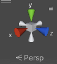

这是unity引擎学习的博客，首先会更新学习笔记，Unity学习的内容如下图，不过学习笔记将以项目为主，最后可能会汇总并按照大纲更新一遍教程。这篇博客将帮助你学会如何适用unity，包括物理、动画、渲染，最终你可以完成一个2D/3D游戏的制作，并且在后期可以进一步学习unity的高级渲染。

本次博客介绍下Unity界面，更多内容请查看后续更新。

<!-- more -->

 

上图展示了学习Unity的大致内容，如果你已经有了面向对象的编程基础，那么C#将变得十分容易，这里不做介绍。现在，我们从Unity的界面说起。

# 界面和布局

* 标题栏：标题栏显示当前项目信息，标题组成是当前项目-项目组件-运行环境-Unity版本-图形API；
* 菜单栏：Unity编辑器的各种选项卡；
* 工具栏：操作视图场景和编辑器布局的工具选项；
* 状态栏：显示程序警告、错误信息；
* Scene视图：编辑场景的地方，所有元素的设置都在Scene中修改；
* Game视图：最终游戏展示的场景，可以运行；
* Project窗口：资源库，管理资源；
* Hierarchy窗口：层级窗口，游戏中的对象、元素按照层级顺序排列，可以快速确定、选中对象；
* Inspector窗口：检查窗口，可以显示，调整选中对象的属性。

## 1 Scene View的使用

在Scene View中，可以对所有游戏对象进行互动，选中，定位，从而方便我们布置游戏场景。

## 1.1 操作视角的移动

### 坐标系统

2D和3D坐标轴的切换通过工具栏的按钮完成，按钮显示当前状态，点击后改变当前的维度；在Unity中，使用的三位坐标系是左手坐标系，X轴代表水平方向，Y轴代表竖直方向，Z轴代表深度。

Unity的坐标系分类于图形API中介绍的概念类似，分别是：

* 世界坐标系：整个场景中描述物体位置的坐标系；
* 局部坐标系：描述单个物体的坐标系；
* 屏幕坐标系：图形经过选然后显示成屏幕像素的坐标系；
* 视口坐标系：图形经过渲染后，坐标压缩在[0,1]之间的坐标系；
* GUI坐标系：最后呈现的可视化图形界面中，物体的坐标系。

在点击按钮，转换为3D坐标系后，窗口右上角会提供一个工具：

利用这个工具可以快速调整视角，单机锥形可以将当前操作视角和该锥形代表的轴对齐，锥形底座代表屏幕，尖端代表方向；右键正方体可以激活菜单，菜单中free选项代表默认视角。

### 导航工具

除了调整操作视角的朝向，移动位置也是有必要的，如同OpenGL中glLookat函数的原理。为了查看整个场景安排，缩放也是需要掌握的操作。

移动方式：

* 按住右键后，通过WASD前后左右移动，QE上下移动，按下shift键可以加速移动；
* 左侧工具栏切换到手型按钮（快捷键Q），即可左键拖动屏幕，此时不能选中；
* 按住alt键，此时按住鼠标中键也可以进行移动；

缩放方式：

* 按下alt键，此时左键可以移动视角，右键可以对场景进行缩放；要注意这里左键的移动视角和之前不同了，这里的移动视角指的是，以场景坐标原点为中心，环绕操作视角，而上面提到的则是直接移动视角，和我们平时3D游戏中完全相同（即场景漫游）。因此，场景漫游起始也可以实现场景缩放的效果。

如果不小心将视角调整到不能判断的地方，可以双击层级窗口中的对象，或者选中后按下F键，就能快速定位到这个物体，然后重新调整。

总结起来说，按下鼠标右键进入”漫游模式“，可以任意移动操作视角；按下alt键后进入”旋转模式“，此时以坐标原点为中心进行操作。

## 1.2 选中对象

（Hierarchy）层级栏中，展示了所有存在的对象，那么从场景视图中，可以更直观和清晰地选择想要修改的对象。

### 选中方式

* 单机场景中的某个对象，选中后对象的信息会显示在检查栏（Inspector）中；
* 如果对象存在重叠，那么重复单机，选中对象会在这些重叠对象中循环；
* 在视图右上角的搜索框中搜索对象；
* 拖拽鼠标左键，选中框内所有对象；但是注意此时的工具状态要为矩形工具（Rect Tool）；
* 按住shift后点击左键，同样是矩形工具；
* 选中后，还可以按住Ctrl键，进一步添加、减少选中的对象；

### 设置选中许可

在层级栏中，为了让一些没必要修改、移动的对象保持状态，可以设置其选中属性，方法是单机对象在层级栏中，名字左侧的手型按钮。

* 点击手型按钮，更改对象和对象全部的子对象的选中属性；
* 按住shift键再点击，仅更改对象，不更改子对象的选中属性；

## 1.3 对象的移动

场景视图提供了方便的操作，来对所有对象进行调整，从而方便安排场景。移动方式主要是工具栏中的五个按钮：

* 移动：使用移动工具（图1）的情况下（快捷键W），物体选中后会有相应的坐标轴显示出来，鼠标移动到坐标轴上并且进行拖动，即可更改物体的位置；拖动两个坐标轴构成的小平面，可以让物体在这个平面上进行移动；按住shift键，可以让物体在垂直于当前操作摄像机视角的平面上进行移动；
* 旋转：使用旋转工具（图2）的情况下（快捷键E），有三根线分别代表三个坐标轴，拖动细线能够让物体垂直于相应的坐标轴进行旋转；最外层的白色细线则是对应当前的操作摄像机视角，让物体垂直于当前视角旋转；
* 缩放：使用缩放工具（图3）的情况下（快捷键R），拖动三个坐标轴，让物体沿着对应的轴进行缩放，拖动中间的正方体，让物体等比例缩放；
* 2D变换：使用矩形工具（图4）的情况下（快捷键T），一般用来对2D物体进行修改，拖动四个矩形顶点即可；
* 3D变换：使用变换工具（图5）的情况下（快捷键Y），综合了移动、旋转、缩放功能，操作和上面介绍的方式完全相同；

对象的移动修改了对象的位置，位置作为属性，在检查栏中的Transform选项卡可以查看、修改。

另外，在移动的时候，某些对象可能含有子对象，如果希望在修改的同时不影响子对象，要确保切换到Pivot模式；如果要修改对象及其子对象形成的外接盒，那么就切换到Center模式。

同理，在旋转的时候，希望对象以父对象为中心，那么就切换到Local模式；否则就切换到Global模式。这两个按钮都在视图工具栏中，作为选项卡存在。

## 1.4 视图工具栏

* Draw Mode：切换不同的绘制模式，不同选项含义基本如下：

* 2D：切换2D和3D模式；
* Lighting：开启/关闭光照；
* Audio：开启/关闭声音；
* Effects：管理特效，选型卡含义基本如下：

* Visibility：开启/关闭场景的可见性，方法和对象拾取的设置相同；
* Grid：设置系统网格；
* Camera：设置场景摄像机的各项属性：

* Gizmo：在场景和游戏视图中都可以使用，用来标记不可见的游戏对象。

## 2 Game View的使用

Game视图中，有三个按钮控制游戏演示，播放(Ctrl+P)、暂停(Ctrl+Shift+P)、按帧播放(Ctrl+Alt+P)，在播放状态下，可以进行游戏演示的试玩，但是试玩过程中进行的所有操作都是暂存的，结束播放以后将重置状态。

除此外，视图中还有一个工具栏，功能如下：

* Game：切换Game运行的平台，点击选项卡Stimulator后，可以切换到模拟器视图，用模拟器查看不同设备上游戏运行的情况；
* Display：切换到不同场景摄像机视角；
* Free Aspect：调整设备尺寸，分辨率等，可以自行添加自定义尺寸；
* Scale：缩放；
* Play Focused：设置演示时是否最大化；
* Mute Audio：声音；
* Stats：性能统计；
* Gizmos：和Scene视图中的Gizmos相似；

## 3 Hierarchy窗口的使用

场景中游戏对象的管理器，包括模型、摄像机、预制件等，和Scene中的物体一一对应。

窗口功能有：

* 对象父子关系的设置；
* 游戏对象的管理，复制、粘贴、删除、更改嵌套关系，排序等；
* 多场景编辑；

## 4 Project窗口的使用

Project窗口管理所有的项目资源，用于查找文件和资源导航；功能和资源管理器类似，能直接进行创建、删除等文件操作。

### 4.1 工具栏

* 加号：创建文件，给出多种文件类型，或者添加资源；
* 搜索框：按照文件命搜索；
* 打开搜索框：用于以单独窗口进行搜索；
* 按类型搜索，如网格、预制件；
* 按标签搜索；
* 收藏文件，将按照当前的搜索设置生成一个过滤器，添加到Favorites中；
* 更改隐藏文件可见性；

### 4.2 基本目录说明

通常项目会将所有文件分别放在两个根目录中，一个是Assets，一个是Packages，前者是游戏的资源文件，包括动画、纹理等内容，后者则是游戏运行需要的库文件，一般不需要手动进行链接等操作了。

## 5 Inspector窗口

显示游戏对象的所有属性，包括渲染设置、碰撞设置、移动变换设置等。

* 如果选中了相同类型的多个资源，窗口将显示他们共有的属性；如果是多个不同类型的资源，窗口会给出各种类型资源的数量，单机该列表以后可以看到该类型的所有资源。
* 一个游戏对象通常关联许多其他的资源，在该窗口中使用Ping选项卡可以快速定位到这些有关联的物体，称为查找“源”。

