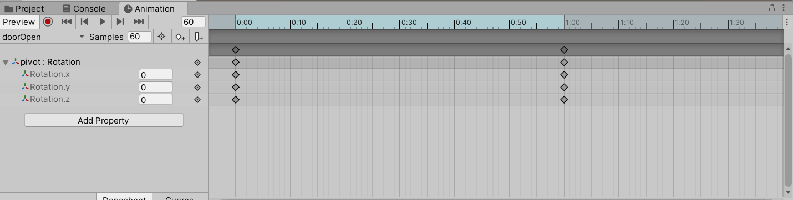
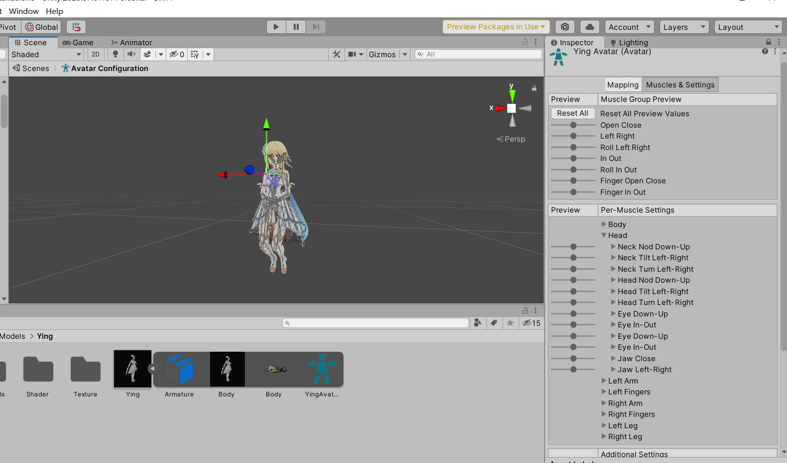

有了场景，我们想让角色动起来，制作一个移动系统，使用IK动画来进行优化，然后配合第三人称摄像机，就可以在自己制作的场景中漫游了。其中动画系统的使用是重点，无论是角色在各种地形上动画的矫正，还是移动时动画的播放，都需要我们完全掌握动画系统的使用，这篇博客就详细说明动画系统各个部分的使用，主要是前面没有提到过的内容。

<!--more-->

经过前面的学习我们知道，2D动画中有三个重要概念：

* Animation Clip：制作动画的基本素材，包含动画的关键帧
* Animator Controller：动画状态机，控制动画如何播放
* Animator Component：动画组件，实现脚本和Controller的交互，以及绑定骨骼等动画管理

这里就不重复说明了，不过当涉及人形动画的时候，还有一个重要的概念：Avatar，也就是我们在前面博客中绑定的骨骼。

现在我们深入认识这些概念的用法。

# Animation Clip

我们现在直接用unity制作一个开关门的动画，新建一个Cube并拉伸到门的尺寸，然后创建一个空游戏对象pivot在门的侧边上，接着将door设置为pivot的子对象，然后试着旋转Y轴，你就会发现现在门的旋转轴已经变成在它边框上的pivot了。


然后我们选中pivot，打开Animation窗口，点击Create创建一个Animation Clip，命名为doorOpen，和之前一样，Unity给pivot自动添加了Animator组件、设置了Animation Controller，并有了第一个Clip。

此时打开存放动画的文件夹，用文本编辑器打卡Clip对应的文件，可以看到Clip实际上是用YAML语言制作的，Unity中大多数资源文件都是用这个语言编写的，可以看到此时文本中具有很多属性，内容为空，并且是以Curves进行命名，这个我们稍后再说。

下面我们选中pivot并回到Animation窗口，点击Add Property，就是添加属性内容，这里可以选择如何让游戏对象变化，使得Clip记录不为空，就能让动画生效了。

因此我们选择加入Transform-Rotation属性并添加，选择一分钟刻度对应的地方，可以看到白色提示线，并且此时Animation窗口中的Preview窗口右上角显示为60，表示我们在处理第60帧，也就是我们的动画默认60帧/S。



接着我们将左边Rotation.y修改为120，拖动时间轴，发现Unity使用插值算法修补了我们中间没有设置的帧的旋转值。然后点击下面的Curves按钮，转到曲线界面，这就是实际保存在文本中的内容了，可以通过曲线查看和修改当前动画，这就是为什么使用Curves来保存。

## 动画复用

了解了为什么要使用Curves和文本的方式来保存动画，就可以进一步学习动画复用了。我们选中刚才制作的Clip文件，然后新建一个3D对象拖到其Inspector窗口下面的预览中：


此时发现方块也在旋转，说明这个动画可以用到它上面，甚至是我们的人形模型：


当一个游戏对象包含多个子对象的时候，Property选项也会给出对应子对象的动画选项，这里我们创建一个双开门，删除创建的动画和动画组件，将刚才的门复制一个，然后新建一个空游戏对象作为它们的父对象，接着重新添加动画Clip，点击Add Property：


这时分别添加两个子对象的旋转属性，然后设置到合适位置，得到双开门的动画。重新打开Clip文本文件，此时看到其中用我们的命名给这两个子对象设置了旋转曲线，也就是说，Unity会根据子对象的命名来寻找这个对象，并让这个对象发生对应的旋转，如果我们修改了子对象的名称，那么Unity找不到对应的物体，就不能正常播放了。


那么现在我们清楚了，当动画文件中指定子对象名称一致的时候，动画就可以实现相同的效果，也就是动画复用；如果没有，那么动画不起作用。而父对象的命名则没有要求，因为动画文件搜索的就是发生变化的子对象。因此，对于人形动画，我们将所有关节作成一个pivot，Clip描述这些关节的运动，就得到了人物的动画。

那么问题来了，如果确保人体关节的命名一致？美术人员制作的动画很可能命名不同，甚至骨骼结构也不同，这时就需要使用替身系统了。

前面我们说Avatar就是骨骼实际上并不准确，Avatar是替身的意思，在Unity中想要复用一个动画到另一个骨骼不同的角色上，需要我们进行以下步骤：

* 选中模型，使用Unity的Rig/Animation Type/Humanoid设置导出该角色骨骼和Unity标准骨骼对应的信息，也就是模型展开后的蓝绿色的小人；Animation Type的其他设置为Legacy旧版动画，Generic通用动画，None无动画；
* Unity将原来的动画文件对原骨骼的描述转化为对标准骨骼的描述；
* 通过标准骨骼作为中介，将动画复用到新角色上面。


Animation Define两个选项：

* Create From This Model：根据该模型建立Avatar；
* Copy From Another Model：拷贝另一个已经配置好的Avatar；

Skin Weights：

* 蒙皮能够被几个骨骼的运动影响，默认是4根；

Optimize Game Objects：

* 选中后将删除原来无用的模型骨骼从而节省空间；

现在点击Apply确认，看到Inspector窗口中本来灰色的Configure按钮可以使用了，点击后进入Avatar设置界面，它包含一个Mapping映射设置和Muscles & Settings设置，我们先看前者。

### Mapping设置


这些是骨骼映射信息，进入的时候Unity已经自动绑定了。

下拉界面，点击左下角的Mapping：

* Clear：清空映射；
* Auto Map：自动映射；
* Load：加载映射；
* Save：将当前映射保存为模板Template；

点击Pose：

* Reset：重置角色动作，如果FBX文件包含动画则会显示动画动作；
* Sample Bind-Pose：改成绑定骨骼时的造型；
* enforce T-Pose：强制模型为T-pose；

如果骨骼不正确，需要在这里重新手动绑定以下。

### Muscles & Settings

这是用来调整角色动作的设置，可以拖动滑动条来查看角色的肌肉能被拉伸到什么程度，或者作出限制。



设置完成后点击Done退出Configure。现在我们了解整个原理了，不过有一个操作我们没有做过，当出现无法适配的动画时，可以点开FBX动画的Inspector窗口，将动画的Rig设置为Copy From Other Avatar，并选择需要适配的模型作为Copy对象即可。也可使用动画自己创建的Avatar进行调整，最终达到满意的效果。

# Animator组件

前面接触很熟悉了，要再说明的就是Avatar，如果没有绑定骨骼，那么会按照模型原本的骨骼去严格匹配动画。使用Avatar的话不仅能在子对象中寻找，就算是在很多层下面也能成功映射。下面说一说前面没使用的属性：


* Apply Root Motion：应用动画本身的移动；
* Update Mode：更新计算骨骼节点位移的方式，Normal表示和帧率同步，Animate Physics表示和物理系统同步，用到物理组件的时候就会刷新，unscaled time表示忽略时间标尺。
* Culling Mode：剔除不可见动画的方式，Always Animate表示不剔除，Cull Update Transforms会停止IK动画(后面介绍)之类的操作，Cull Completely表示不可见时完全停止动画。

# Animator Controller

现在我们开始介绍最重要的状态机，与前面介绍的2D相比，3D部分新增加用到的就是Layers了，它可以让角色的不同部分播放不同的动画，这样在我们有两个动画Clip的时候，让角色的一部分播放第一个动画，另一部分播放第二个动画，可以实现其他的动画效果。

另外界面右上角有一个Auto Live Link，开启后可以在运行时跟踪当前播放的状态。

## 动画状态的属性

选中一个状态，查看Inspector窗口：


* Speed：播放速度，如果要在脚本中使用这个属性，需要勾选下面的Multiplier并添加对应的Float变量作为中间变量，动画实际播放速度是Speed和这个变量的乘积；
* Motion Time：仅播放动画的特定帧，要关联一个Float变量，0表示开始时，1表示结束时；

* Mirror：镜像动画，仅对人形动画有作用，要关联一个Bool变量；
* Cycle Offset：开始播放时动画的偏移，表示从哪一帧开始播放，同样0表示开始，1表示结束，关联一个Float变量；而且后续循环播放动画的时候不会有影响；

### Foot IK和IK

Inverse Kinematics，反向动力学，一般来收我们计算角色动画是从根节点到末端骨骼的，这种称为正向动力学，Forward Kinematics，但是有时候我们希望角色的末端骨骼放到特定的地方，因而先确定末端骨骼的位置，再反向计算根节点。

Unity中可以在运行中选中角色，然后勾选Gizmos中的Animator，可以看到出现了一些小红球，这些红球称为IK Goal，是Unity提供的关于骨骼位置的标记，表示当前角色的某个骨骼应该靠近哪个地方，因此利用IK Goal可以查看确认角色动画是否完美匹配了。


可以看到这里模型匹配地还是不错的，而我们动画状态的Foot IK属性勾选后，就会稍微纠正脚步的动作，让脚往对应的两个红球上靠近，从而调整动画，我这里由于匹配很好，所以勾选后没有变化。

而且，修改IK Gola也不会改变Foot IK的位置，因为Foot IK参照的是原本的IK Goal，即使我们在代码中修改了IK Goal，Foot IK还是会按照运行之前的位置调整。因此，要让角色真正实现指挥身体这个操作，还是要靠我们实际改动IK Goal并在脚本中告诉角色怎么去运动，而不是勾选Foot IK。

现在我们尝试调整IK Goal，在Animator/Layers窗口中点击Base Layer的设置，勾选IK Pass，就可以调用IK的API了。给角色添加一个脚本，然后增加以下代码：

```C#
using System.Collections;
using System.Collections.Generic;
using UnityEngine;

public class test : MonoBehaviour
{
    // Start is called before the first frame update
    Animator animator;
    [Range(0, 1)]
    public float weight = 0;
    void Start()
    {
        animator = GetComponent<Animator>();   
    }

    // Update is called once per frame
    void Update()
    {
        
    }

    private void OnAnimatorIK(int layerIndex)
    {
        animator.SetIKPosition(AvatarIKGoal.RightFoot, new Vector3(0, 0, 0));
        animator.SetIKPositionWeight(AvatarIKGoal.RightFoot, weight);
    }
}

```

可以看到如下结果，当我们不调整这个weight时，角色不会靠近我们设置的IK Goal，调整weight后角色将右脚放在这个点上。


配合射线检测地形，就可以制作好的适应地形的效果，我们后面再说IK怎么做。当然，如果模型某一部分和动画不匹配，也可以直接设置weight为1，绑定到对应的IK Goal上。

### Write Default

这个选项默认开启，我们先介绍一个方法OnEnable，和Awake方法有点类似，这个方法会在对象被启用的时候调用，对象实例化的时候就也会调用这个方法。因此，Animator挂接到对象以后，开始游戏，对象被实例化的时候Animator被启用，它的OnEable方法就会记录当前状态机里的Clip修改了哪些属性，作为默认值。

那么在一些情况下，一个动画Clip中只包含对某些对象的属性更改，另一些对象的属性更改并不存在，例如电梯开门动画和电梯的上下行动画，前者只控制门的位移，后者控制电梯(包括电梯门，门是它的子对象)的位移，此时由于Animator记录了开始的那一帧中，这些对象的位置，也就是默认值，会自动填充给当前状态对应的动画Clip中没有修改的对象，例如电梯开门动画中没有对电梯这个对象的修改，这导致本来不想修改这个电梯对象时反而让电梯读取默认值发生了动画。

因此，如果开始的时候电梯在下层，那么我们先让电梯转移到上层，然后开门，开门动画没找到电梯对象的变换，所以填充默认值，导致电梯总是转移到下层再开门。如果状态中存在改变这个对象的属性，那么就交给这个值处理，所以不会发生问题，也就是开门动画。

更多技术讲解可以异步这篇[博客](https://blog.csdn.net/rickshaozhiheng/article/details/77838379)。

## 动画转换的属性

之前我们用到不少状态机中动画转换的属性了，这里仅介绍没有使用的：


* solo/Mute：当有多个同方向的转换时，勾选solo表示仅执行这些选中的转换，哪个条件满足就执行哪个；如果同时满足，执行排在上面的转换，在动画状态中可以调整顺序，但在转换属性中不可以调整。Mute表示转换永不执行；
* 白色曲线：表示Root Motion，动画自带的位移；
* Fixed Duration：下一项转换时间计算按秒还是按百分比；
* Transition Offset：进入下一个动画的偏移量；
* Interruption Source：可以打断当前转换的Transition；
* Ordered Interruption：和上面的有关，下次再说；

* Conditions：可以添加多个转换条件，它们之间的关系是逻辑与；如果希望转移之间存在逻辑或的条件，可以通过设置多个同方向转换实现；

### Transition Interruptions

我们详细说明一下前面略过的Interruption Source和Ordered Interruption两个属性，一般动画的转移都是不可打断的，但是有些时候我们希望动画和玩家的交互是及时的，当玩家发出命令以后不管角色此时处于什么动画，或者处于什么动画之间的转换，都要将这个动画/转移打断，然后向新的转移变换。

那么这里又涉及状态转换的优先级了，前面我们说状态转换之间存在优先级，当勾选了多个solo的转移时，如果同时条件满足，将执行排在状态的Inspector/Transitions上面的转换，也就是从上往下转移的优先级降低。这其实就是Ordered Interruption选项的作用，这个选项默认被勾选，表示按照状态转换的优先级来执行状态之间的打断。

例如下面这个Run状态的属性中有两个转移，分别转移到Idle和Jump状态，此时转移到Idle的状态转移就具有更高的优先级。此时能Run->Idle能打断Run->Jump的转换，而后者却不能打断前者的转换。


如果取消了Ordered Interruption，那么优先级关系不会被应用，状态转换之间可以任意打断。

然后再看Interruption Source的选项，代表能够打断当前转换的状态转换的源：

* Current State：从当前转移的当前状态出发的所有转移；
* Next State：从当前转移的下一个状态出发的所有转移；
* Current State Then Next State：两个状态出发的转移都可以打断，但是当前状态出发的优先级更高；
* Next State Then Current State：两个状态出发的转移都可以打断，但是下一个状态出发的优先级更高；

解释一下后两个，我们知道同时激活多个状态转换的时候状态机根据优先级判断哪个转换被执行，那么状态之间的打断也是类似的，一个状态在执行的时候，同时有两个可以打断它的动画出现了，那么状态机就会根据上面的选项来判断，选择Current State Then Next State时就会执行从当前状态出发的，另外一个从下一状态出发的但是同时被激活的状态转移不会被执行。
