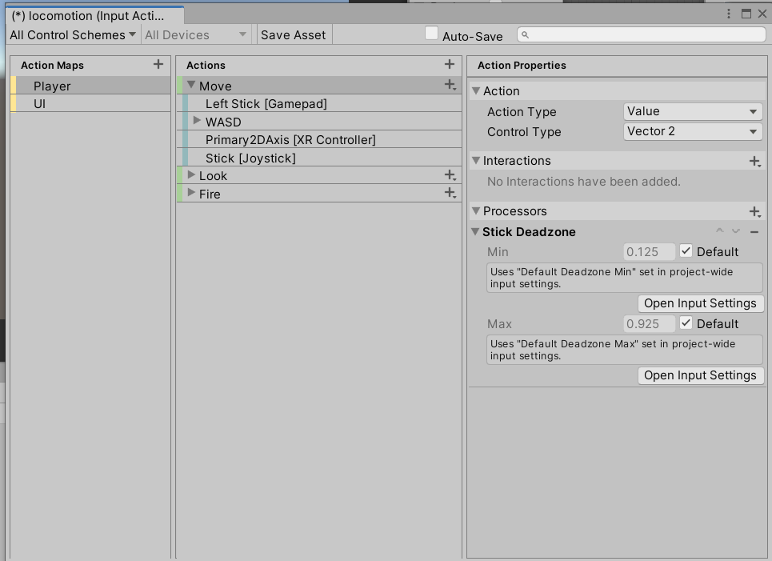

除了上次介绍的内容外，这篇博客中我们还会进一步使用New Input System和Root Motion，后者是很常见的动画概念，动画是可以包含角色移动控制的，这里会着重讲解。

<!--more-->

# New Input System

与我们一直使用的输入系统相比，新输入系统有更好的性能，还提供更好的扩展性，所以我们有必要学习。要使用它，需要我们在Package Manager/Registry中搜索input system并安装，完成后会提示需要重启。


然后选中角色，添加Player Input组件，这就是new input system提供的，它需要一个配置文件来定义玩家的输入，点击Create创建，我们使用默认配置，保存会会打开这个配置的编辑窗口，我们先放在一边；然后修改Behavior属性为Invoke Unity Events，表示检测到输入时执行Unity的事件方法，从而调用我们编写的脚本函数。


接着展开下面的Events，可以看到列出了很多空表，它们对应左侧配置窗口中的信息，表示此时执行Callback回调，这里用法其实就是我们将写好的方法添加到右侧的List中注册，那么当右侧被回调的时候就会连带执行我们注册的方法了，例如Move中WASD表示按下WASD移动角色，并且此时系统检测到玩家处于Move状态，那么就执行Move的回调函数，将我们播放动画的方法添加进去，那么角色移动的同时就会播放动画了。

上面图中选中了Move，看到右边的Action Type为Value，Control Type为Vector2，即决定角色动作触发的形式是采用值判断，控制方式为使用二维向量，其中x值表示AD的按键，y值表示WS的按键，而且如果同时按下W和D，这个二维向量不会是(1,1)，因为Unity会自动归一化长度超过1的向量。

下面我们开始编写等待调用的方法，新建一个脚本，添加以下内容：

```C#
using System.Collections;
using System.Collections.Generic;
using UnityEngine;
using UnityEngine.InputSystem;

public class PlayerMove : MonoBehaviour
{
    Animator animator;
    float threshold = 0.1f;
    public float forwardSpeed = 2.0f;
    public float backwardSpeed = -1.5f;
    float currentSpeed;
    // Start is called before the first frame update
    void Start()
    {
        animator = GetComponent<Animator>();
    }

    // Update is called once per frame
    void Update()
    {
        moveCharacter();
    }

    void moveCharacter()
    {
        Vector3 movement;
        movement = new Vector3(0, 0, currentSpeed * Time.deltaTime);
        transform.position += movement;
    }

    public void Move(InputAction.CallbackContext callbackContext)
    {
        //记录玩家输入
        Vector2 movement = callbackContext.ReadValue<Vector2>();
        currentSpeed = 0f;
        if(movement.y > threshold)
        {
            animator.SetBool("Forward", true);
            currentSpeed = forwardSpeed;
        }
        if (movement.y <= threshold)
        {
            animator.SetBool("Forward", false);
        }
        if (movement.y < -threshold)
        {
            animator.SetBool("Backward", true);
            currentSpeed = backwardSpeed;
        }
        if (movement.y >= -threshold)
        {
            animator.SetBool("Backward", false);
        }

    }
}

```

保存后运行游戏，我们的人物现在可以通过WS控制前进和后退，使用摇杆的玩家也可以通过我们设定的阈值来进行输入，而且动画可能并不匹配人物移动的速度，这可以通过调整动画或者移动的速度来控制，我们后面会用Root Motion来彻底解决问题。

除此外，这里我们一按下按键角色就开始进行移动了，而且对使用手柄或者手机摇杆的玩家很不友好，通常希望移动遥感的程度与角色移动的速度同步，并且在从静止切换走路的时候速度是逐渐加快的，到因此我们修改一下，将上面的currentSpeed重命名为targetSpeed，然后调用线性插值方法来使我们的currentSpeed从零逐渐提高到targetSpeed，因为moveCharacter方法每帧都会调用一次，意味着currentSpeed总是在向TargetSpeed靠近而不是直接等于；然后对于移动的targetSpeed也乘上玩家输入的控制值movement.y。

```C#
	//注意不要设置currentSpeed初始化为0，Lerp方法的第三个参数t表示插值返回的值有多靠近第一个参数，例如这里0.9就是取			//(targetSpeed-currentSpeed)*0.9+currentSpeed
    currentSpeed = Mathf.Lerp(targetSpeed, currentSpeed, 0.9f);

	targetSpeed = forwardSpeed * movement.y;
	targetSpeed = backwardSpeed * movement.y;
```

这样就改进了没有过渡速度的问题，而且手柄玩家也可也正常使用这个移动系统了。但是还有一个问题没解决，我们的移动速度在变化，但是动画的播放速度并不会同步，这就要使用我们之前熟悉过的Blend Tree了。所以我们通过将速度传递给Blend Tree之后，混合树会根据currentSpeed帮我们计算当前动画的状态。

最终我们的代码如下：

```C#
using System.Collections;
using System.Collections.Generic;
using UnityEngine;
using UnityEngine.InputSystem;

public class PlayerMove : MonoBehaviour
{
    Animator animator;
    public float forwardSpeed = 2.0f;
    public float backwardSpeed = 1.5f;
    float targetSpeed;
    float currentSpeed;

    Vector3 movevalue;
    // Start is called before the first frame update
    void Start()
    {
        animator = GetComponent<Animator>();
    }

    // Update is called once per frame
    void Update()
    {
        moveCharacter();
    }

    void moveCharacter()
    {
        currentSpeed = Mathf.Lerp(targetSpeed, currentSpeed, 0.9f);
        movevalue = new Vector3(0, 0, currentSpeed * Time.deltaTime);
        transform.position += movevalue;
        animator.SetFloat("Speed", currentSpeed);
    }

    public void Move(InputAction.CallbackContext callbackContext)
    {
        //记录玩家输入
        Vector2 movement = callbackContext.ReadValue<Vector2>();
        targetSpeed = movement.y > 0 ? forwardSpeed * movement.y : backwardSpeed * movement.y;
    }
}

```

只不过我们由于删除了阈值，所以如果玩家的摇杆有漂移、损坏的情况就会很难受，他们的输入始终无法达到最值1，所以我们速度的最大值也无法达到，因此我们重新打开new input system的配置文件，添加一个叫Stick DeadZone的processor：



这个processor会对输入的数据进行处理，最小值意味着[-0.125,0.125]之间的输入会被视为0，防止误触；小于-0.925的会被视为-0，大于0.925的会被视为1。

# Root Motion

我们先尝试简单使用Root Motion功能，首先在Maximo上找到包含Root Motion的动画，你可以使用这个[移动包](https://www.mixamo.com/#/?page=1&query=locomation+pack)，下载之后我们复制一个角色出来，然后重新更改状态机，使用Pack中提供的Walking，Running，Idle三个动画，你可以在预览窗口中查看是否正确，确保将他们都设置为人形动画。

如果你角色的Animator窗口中勾选了Apply Root Motion属性，那么此时播放Walking或者Running时预览窗口中的角色就会有自主的位移了。然后添加一个只设置状态机变量而完全不处理输入的脚本：

```C#
using System.Collections;
using System.Collections.Generic;
using UnityEngine;
using UnityEngine.InputSystem;
public class PlayerRootmotion : MonoBehaviour
{
    // Start is called before the first frame update
    Animator animator;
    void Start()
    {
        animator = GetComponent<Animator>();
    }

    // Update is called once per frame
    void Update()
    {

    }

    public void PlayerMove(InputAction.CallbackContext context)
    {
        Vector2 movement = context.ReadValue<Vector2>();
        if (movement.y > 0f)
        {
            animator.SetBool("Forward", true);
        }
        else
        {
            animator.SetBool("Forward", false);
        }

        if (movement.y < 0f)
        {
            animator.SetBool("Backward", true);
        }
        else
        {
            animator.SetBool("Backward", false);
        }
    }
}

```

保存并运行游戏，发现角色确实会自己移动，但是角色的移动并不正确，不是直线移动，而且还会发生高度的变化。因此我们有必要理解Root Motion的核心机制，当启动Root Motion后，我们计算动画中Transform的方式改变了，之前我们介绍动画的时候说，动画实际上就是对象及其子对象的一系列变换，动画的关键帧记录了对象的变换值，播放到这一帧的时候就会将对象的变换设置为记录的值，从而完成动画。

但是启用Root Motion后，动画之间将不再强制赋值，而是计算相对变换，用图形学中旋转、缩放、位移矩阵来解释，就是每次计算帧和帧之间的移动不再通过给这些矩阵赋值的方式，而是给物体的这些矩阵不断乘以一个相对位移矩阵，这个相对位移矩阵就是当前对象变换的情况，就像惯性一样。所以，勾选Root Motion后对象的变换就不会被重置，如果一个动画的开头记录了对象的初始位置，结尾记录了最后的位置，那么在这个动画播放一次之后不会将物体重置到开头的位置，而是乘以让对象不断移动的相对变换矩阵，因此对象将继续沿着动画指定的方向移动。

## Generic中的Root Motion

在Generic的动画中，不像Hunmanoid那样有人形骨骼，如果我们打开一个Generic的动画，会发现它的Clip中没有对游戏对象的移动，那应该怎么让动画对游戏对象的移动生效呢？方法就是指定一个骨骼，将这个骨骼的所有变换应用到整个游戏对象上，因此同样需要指定Generic的Avatar，不过Generic的Avatart仅有一根骨骼，也只会进行一次绑定。

那么总结一下，Generic中的Root Motion就是将根骨骼的运动应用到整个游戏对象上。而在模型制作中，骨骼一般不使用模型上面的某一个骨骼，而是会单独制作一个骨骼来记录变换，应该把这个骨骼设置为Root Node。

有需要可以下载这个[狐狸资源](https://assetstore.unity.com/packages/3d/characters/animals/toon-fox-183005)查看，它的Root Node就设置在模型的中间了。


## Hunmanoid中的Root Motion

### 动画的Root Motion基础设置

下面我们才能真正理解动画中Root Motion选项的作用，点开一个动画的Inspector窗口，查看下面这些属性：


要说明的是，在Generic动画中这些root motion相关的设置中，Based Upon一项会有一个Root Node Oreintation，不同于Hunmanoid中的Body Oreintation，这里我们先当成一样的，马上我们会解释它们的差别。

#### Root Transform Rotation

表示旋转的Root Motion设置，我们依次介绍。

* Bake Into Pose：将根骨骼节点的旋转当作普通动画处理，而不是Root Motion的一部分；如果我们不想让动画的根骨骼带动对象，就可以勾选，例如英雄联盟中角色跳舞的时候游戏对象停在原地；所以像前进、待机、后退这种动画我们希望自己能控制移动，就可以勾选，避免莫名其妙的旋转。后面的loop match表示动画在角度上的吻合度，如果动画带动的旋转很大，这个标记会是红色的，代表效果比较显著；绿色则是代表没有什么影响。
* Based Upon：对象在动画开始时对准的方向，Body Orientation表示根骨骼的方向，但这个方向是Unity根据整个动画算出来的平均方向，所以不准确，我们可以使用下面的offset来矫正这个方向；Original则表示原本的朝向，也就是美术规定的方向，一般可以信任。

#### Root Transform Position(Y)

表示垂直方向上的设置：

* Bake Into Pose：和上面类似，勾选表示不要将根骨骼Y方向上的位移带动游戏对象；
* Based Upon：将垂直方向上的哪个位置对齐到游戏对象的原点，选择Original表示美术选择的部分，通常也就是脚；选择Feet也是差不多；最后Center of Mass就是将质心放到原点；下面的Offset同样调整便宜；

#### Root Transform Position(XZ)

表示水平方向上的设置：

* Bake Into Pose：和上面类似，勾选表示不要将根骨骼水平方向上的位移带动游戏对象；
* Based Upon：将水平方向上的哪个位置对齐到游戏对象的原点，和Y方向上的完全一致，只不过是水平面上的。

## 机制和配置

不像Generic模型那样，Hunmanoid动画通常没有根骨骼，Unity会通过分析模型计算重心Center of Mass，也就是预览窗口中开启右上角坐标系图标的时候会显示的蓝色箭头：


这个Mass Center在脚本中通过animator.bodyPosition和animator.bodyRotation来访问坐标和方向，可以用OndrawGizmos方法在场景中画出来。然后Unity将这个重心在水平面上的投影作为根骨骼来对待，被称为Root Transform，通过animator.rootPosition和animator.rootRotation访问坐标和方向。

因此，如果角色的动画此时是歪斜的，root Transform也会跟着有变化，Unity会把root Transform的位移应用到游戏对象上，简单来说，可以将root Transform作为root motion的根骨骼。

那么通过这种方式，Unity将人形模型中可能不同的根节点转化为root Transform，能帮助在不同的骨骼结构上复用一个Root Motion动画。

最后关于Root Node Oreintation和Body Oreintation，其实前者就是根骨骼，后者因为没有根骨骼，所以就是root transform。

现在你明白我们之前动画的问题如何解决了，就是设置Root Motion选项，将水平移动的Root Motion动画的Y方向和Rotation勾选Bake Into Pose，调整Rotation的Based Upon为Original，这样角色就不会走歪路，或者走到地面中了。
