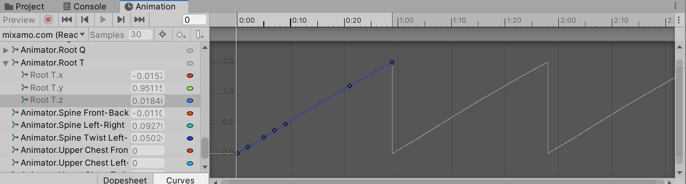

上期主要说了New Input System和Root Motion核心机制，这次我们将在Blend Tree中使用Root Motion，配合Character Controller组件和Cinemachine，可以制作一个角色的移动系统了。注意，这里并没有详细讲解如何制作，只包括这三个组件的介绍。可能后面会有专门的博客提供解决方案。

<!--more-->

# Blend Tree中使用Root Motion

现在我们重新给角色建立一个Blend Tree，然后还是添加三个动画：Idle，Walking，BackwardWalking。确保它们都正确建立了Avatar，并且都具有Root Motion，而且基础设置完成。然后我们使用下面的代码，其实就是将前面的代码简化了，移动交给root motion来完成，我们只负责状态机中Speed变量的赋值。

```C#
using System.Collections;
using System.Collections.Generic;
using UnityEngine;
using UnityEngine.InputSystem;

public class Locomotion : MonoBehaviour
{
    Animator animator;
    public float forwardSpeed = 1.6f;
    public float backwardSpeed = 1.2f;
    float targetSpeed;
    float currentSpeed;

    Vector3 movevalue;
    // Start is called before the first frame update
    void Start()
    {
        animator = GetComponent<Animator>();
    }

    // Update is called once per frame
    void Update()
    {
        Move();
    }

    void Move()
    {
        currentSpeed = Mathf.Lerp(targetSpeed, currentSpeed, 0.9f);
        animator.SetFloat("Speed", currentSpeed);
    }

    public void PlayerMove(InputAction.CallbackContext callbackContext)
    {
        //记录玩家输入
        Vector2 movement = callbackContext.ReadValue<Vector2>();
        targetSpeed = movement.y > 0 ? forwardSpeed * movement.y : backwardSpeed * movement.y;
    }
}
```

这里有一个地方值得说明，在我们使用root motion的时候，移动的阈值不是我们确定的，因此需要使用Blend Tree中的阈值计算功能，它会根据动画来计算一个合适的阈值以供参考，下面我们打开Blend Tree的Inspector窗口：


阈值默认勾选Automate Thresholds，Unity会在最大值和最小值之间平均分布阈值；勾选以后，才能使用下面的选项。

点开Compute Thresholds，选项代表根据动画的变化来计算阈值，含义如下：

* Speed：下面三个变量组成的三维向量长度；
* Velocity X：根据X轴上的速度(左右移动)；
* Velocity Y：根据Y轴上的速度(垂直移动)；
* Velocity Z：根据Z轴上的速度(前后移动)；
* Angular Speed(Rad)：弧度制的角速度；
* Angular Speed(Deg)：角度制的角速度；

所以，我们这里选择的是Velocity Z，用动画前后移动的速度来计算阈值，就得到了上面的结果。此时运行游戏可以发现前进和后退的速度是不一致的，如果想要它们一致，我们只能调整某个动画的播放速度，因此Unity下面还提供了Adjust Time Scale选项，他有两个选项：

* Homogeneous Speed：计算出让所有列表中动画root motion速度一致时的播放速度。
* Reset Time Scale：重置动画播放速度。

注意，计算播放速度时会让待机动画的播放速度改变，因为待机动画没有位移，使得计算出来的速度非常大，我们把它的播放速度设置为1即可。如果你的动画没有root motion，那么也不必使用这个选项。

## 存在的问题

现在又回到前面的问题，如果动画播放速度为1，被关联的阈值就代表了角色播放这个动画时的移动速度。角色前进的速度是受限于阈值的，即使我们代码中的速度大于root motion的阈值，Unity也会将超过阈值的值限制。另外，就算我们代码中设置的速度即使是小于阈值的，也没有办法保证角色的移动速度就是这个值，因为混合树根据阈值进行混合的时候有可能会做非线性插值，所以导致代码中的这个速度完全无法控制实际的角色移动。

更重要的是，直接修改阈值可能会导致角色脚滑的情况，因为动画播放速度和实际移动速度不匹配。

那么解决方案就只有一个了，改变动画的播放速度，因为设置动画的播放速度不会受到阈值上限的影响，也能让角色快速移动的时候播放匹配速度的动画：

* Unity计算动画阈值；
* 播放速度=希望的速度阈值/计算阈值；
* 阈值=希望的速度阈值；

这样以后原本动画的计算阈值是1.5，而我们希望的速度阈值是1，但是播放速度是1/1.5，所以在我们希望速度阈值下角色确实只有1的速度，而且动画播放速度也是小于1的；如果速度阈值达到了计算阈值1.5，那么播放速度就会变为1。因此这个方法可以做到移动速度和动画播放速度的同步，我们后面都可以这样进行阈值的设置。

当然，这个思路照样有bug，非线性插值会导致代码中速度和关联阈值不一致，所以当代码让关联阈值处于阈值最大值和最小值之间的时候，速度仍然是不可控的，不过这种不精确也是可以接受的。

此外，这个方法还是不通用，因为动画复用在不同的模型上，导致Unity计算出来的阈值也不同，高的角色就走得快，矮的角色就走得慢，使用同样的状态机和动画，明日香就比可莉走得快很多，所以原本root motion设定的速度就不再合适了。

所以综上所述，要让不同的人物使用root motion，最好为每个角色制作自己的状态机，单独设置速度。下面我们解决这两个问题。

### 不同角色使用root motion

前面我们说过，root motion会计算物体的缩放值，一个物体越小，那么物体其他变换的程度也越小。但是从Transform组件上看，两个人物模型的缩放值都是1，其实在制作Avatar时，unity已经对模型进行了缩放映射，小的模型对标准的Avatar来说要放大，或者让Avatar变小，大的模型反之。这种差异就导致了root motion不同，小模型上的root motion随着Avatar的缩小也缩小了。

解决方法还是调整播放速度，将动画播放速度除以缩放值即可：

```C#
animator.speed = animator.humanScale;
```

此时腿短的角色就会跑得更快，最后两个角色移动速度就是一致的。如果我们又不想改变整个Animator中动画的播放速度，只改变当前混合树中的动画，此时就要用到Animation State的Multiplier属性了，把上面这个值传递给它就好了。

```C#
animator.SetFloat("ScaleFactor", 1 / animator.humanScale)；
```

注意，如果一个模型大小在导入Unity的时候不符合要求，应该在该模型的配置中解决，而不是使用Transform组件中的Scale属性来完成，这会导致不必要的计算。


### 自主控制移动速度

即使我们正确修改了播放速度来一定程度上修正移动速度，最后角色还是不会按照设想移动，因为角色的root motion不是匀速的！我们设置的阈值其实是root motion移动的平均值，在Clip的Inspector窗口可以看到Average Velocity，就是Unity计算的阈值。如果打开Clip中的Root属性，选择Curves查看，你会看到真正的的root motion：



你肯定已经觉得很不妙了，阈值也不是线性的，root motion本身也不是线性的，这意味着角色移动速度完全就是不可控的，即使玩家看不出来，但当我们必须使用其他游戏组件控制对象位移时也不能让root motion完全接管移动了，所以这么复杂而且不精确的东西还有必要使用？

是的，它确实没有必要使用了，对一般的移动来说使用root motion的确解决了脚底打滑的问题，但我们有更好的方案，root motion也并不是一无是处。

这里介绍的方法就是通过刚体配合动画，回想为什么会发生脚底打滑，动画上来说是播放速度和移动速度不匹配，物理上来说是因为没有摩擦力！所以我们得让物理引擎参与进来，给角色添加刚体，碰撞体，冻结刚体在X轴和Y轴上的旋转防止角色倒地，修改脚本代码如下：

```C#
using System.Collections;
using System.Collections.Generic;
using UnityEngine;
using UnityEngine.InputSystem;

public class Locomotion : MonoBehaviour
{
    Animator animator;
    Rigidbody rigidbody;
    public float forwardSpeed = 1.6f;
    public float backwardSpeed = 1.2f;
    float targetSpeed;
    float currentSpeed;

    Vector3 movevalue;
    // Start is called before the first frame update
    void Start()
    {
        animator = GetComponent<Animator>();
        animator.SetFloat("ScaleFactor", 1 / animator.humanScale);
        rigidbody = GetComponent<Rigidbody>();
    }

    private void OnAnimatorMove()
    {
        Move();
    }

    void Move()
    {
        currentSpeed = Mathf.Lerp(targetSpeed, currentSpeed, 0.9f);
        animator.SetFloat("Speed", currentSpeed);
        rigidbody.velocity = animator.velocity;
    }

    public void PlayerMove(InputAction.CallbackContext callbackContext)
    {
        //记录玩家输入
        Vector2 movement = callbackContext.ReadValue<Vector2>();
        targetSpeed = movement.y > 0 ? forwardSpeed * movement.y : backwardSpeed * movement.y;
    }
}
```

也就是说，现在我们让Move方法的调用放到OnAnimatorMove中而不是Update，并且接管了角色的移动，如果你回去查看Animator的Apply Root Motion选项，会发现此时它后面变成不可选的描述语句，显示Handled by Script。角色移动的方式就是使用刚体的速度属性，这里还是root motion的速度，但是添加了更多的物理模拟如摩擦力，当然还是不精确的速度，如果你希望的话可以直接将currentSpeed赋值给它，只不过可能会有一点点动画上的不同步。

然后将Animator组件的Update Mode修改为**Animate Physics**，这会让OnAnimatorMove方法中计算角色骨骼位移的Move方法和Fixed Update同步，而且其中动画的计算处于动画系统和Fixed Update计算之后，物理系统计算之前，具体可以看[这里](https://docs.unity3d.com/cn/2021.3/Manual/ExecutionOrder.html)：


这样我们的动画就比较不错了，简单有效，因为物理模拟而更加真实。不过我们Rigidbody中的重力却出问题了，角色受到的重力加速度很小，这其实还是root motion的冲突，因为具有root motion的动画需要勾选Bake Into Pose，否则Y方向上的移动动画会和重力冲突，所以勾选即可。

### 重力失效

重新运行，你发现角色虽然下降了，但是怎么是匀速下降呢？重看上面的OhelnAnimatorMove方法，我们强调它在物理系统之前调用，也就是说，每次物理系统计算出一个合理的速度后，被我们的OnAnimatorMove中的Move方法重置了！

所以我们赋值速度的时候仅改变水平方向速度即可，Y方向的速度设置为rigidbody.y，这样重力的问题就解决啦。

这又导致另一个问题，如果角色水平方向受力了，这个问题不是又发生了吗？如果我想用root motion影响角色Y方向的运动该怎么办？因此，这样的移动方式也不是万能的，具体情况需要你自己权衡。到这里root motion就暂时结束了，下面我们才能正式开始制作移动系统，你也理解了为什么我们要花这么多偏度理解root motion，它是动画和移动的核心。

# 移动控制器

前面我们一直在使用root motion来进行角色移动的控制，但是主要还是学习动画系统。为了方便后面开发，我们如果不需要对角色进行物理模拟(也就是不使用RigidBody组件)，可以直接使用Unity的Character Controller来处理简单的移动和碰撞。

确保角色身上没有碰撞体和刚体组件，添加Character Controller组件，各项属性含义如下：


* Slope Limit：角色能越过的斜坡角度；
* Step Offset：角色能过跨越的台阶高度；
* Skin Width：角色发生碰撞时碰撞方向上的最小间隔距离，设置为Radius的十分之一可以防止卡死；
* Min Move Distance：最小移动距离，小于该距离的移动会被忽略；
* Center：碰撞体中心；
* Radius：碰撞体半径；
* Height：碰撞体高度；

可以看到这个控制器其实也能负责碰撞体的简单工作，接下来打开脚本，在OnAnimatorMove方法中启用移动方法。

```C#
	CharacterController = GetComponent<CharacterController>();
	private void OnAnimatorMove()
    {
        //CharacterController.Move(animator.deltaPosition);
        CharacterController.SimpleMove(animator.velocity);
    }
```

Move方法不具有重力，SimpleMove方法默认启用重力，传入对应参数就配置好控制器了。一般来说，如果使用这个控制器组件，重力需要自己手写。

# Cinemachine

我们仍然使用前面提到的cinemachine制作摄像机。安装cinemachine包后，打开顶部菜单栏新建一个Virtual Camera，添加后可以发现，此时我们场景中的Main Camera多出一个禁用的红色图标，并且自动添加了Cinemachine Brain组件，这个组件和我们新建的虚拟相机一同管理摄像机运行。

绑定之后，Main Camera的某些属性已经无法修改了，而是要通过读取某个虚拟摄像机的数属性来更改。我们可以定义任意数量的虚拟摄像机，并且在它们之间切换。

## Cinemachine Brain


* Live Camera：读取哪一个虚拟摄像机；
* Live Blend：转换到哪一个摄像机，当一个摄像机被禁用，这里会转到下一个启用的摄像机；
* Show Debug Text：游戏窗口中显示Live Camera和Live Blend；
* Show Camera Frustum：显示摄像机的视锥体；
* Ignore Time Scale：相机行为是否受到时间缩放值影响；
* World Up Override：当相机Y轴和世界坐标系Y轴夹角大于90°，相机重设方向使得该夹角小于90°；如果给这里添加了对象，那么Up方向就会采用这个物体的Y轴方向。
* Update Method：指出相机同步的方法，Fixed Update表示同步物理引擎，Late Update表示同步画面绘制，Smart Upadte表示自动选择，Manual Update表示脚本控制；
* Blend Update Method：指明两个虚拟相机之间的切换行为同步的方法，只能选Fixed Update和Late Update。
* Default Blend：默认的相机切换模式。
* Custom Blends：自定义不同相机的切换模式，点击Create Asset可以创建并添加切换模式；
* Events：相机触发的事件；

## Virtual Machine

在实际开发中，我们通常只修改Cinemachine Brain的配置，读取不同的Virtual Machine配置来实现相机的行为，因此原则上相机有几种行为就是用几个Virtual Machine。


* Status：状态，Live表示启用，Standby表示待机且运行，Disabled表示被禁用，点击后面的solo可以让相机立即启用；
* Game Window Guides：游戏窗口中显示提示信息；
* Save During Play：在Play状态下的修改会被保存；
* Priority：优先级较高的摄像机会被启用；
* Follow：跟随游戏对象；具体在Body中设置；
* Look At：看向游戏对象；具体在Aim中设置；
* Standy Update：待机时以什么频率执行刷新；Never表示不计算，Always表示和激活的相机一致；Round Robin表示轮盘赌计算不同的虚拟摄像机；
* Lens：镜头设置，FOV，Near Clip和Far Clip都和图形学中一致。Dutch表示斜角镜头的角度。
* Transition：相机切换的设置，Blend Hint表示相机切换的行为的物理特征，None表示线性切换，Spherical Position表示球面切换，Cylindrical Postion表示圆柱切换，Screen Space Aim When Target Differ表示当look at的对象不同时在屏幕空间之间切换；Inherit Position表示让虚拟相机移动到相机的位置；
* Noise：添加晃动效果；
* Extension：额外功能；

下面我们进一步介绍Body和Aim两个属性的配置。

### Body


Body控制摄像机的Position。当Body为Transposer时，表示摄像机会在固定的偏移上跟随游戏对象。偏移通过Follow Offset调整，XYZ的Damping是相机移动的阻尼系数。

而Binding Mode则是摄像机跟随使用的坐标系，有以下选项：


* Lock To Target On Assign：当目标被分配给Fllow，或者虚拟摄像机被激活的时候，根据Offset在对象本地坐标系下锁定相对位置，跟随对象；如果对象发生旋转、移动，再次触发Assign，相机位置就会重新根据Offset锁定。也就是世界坐标系改变，但是本地坐标系不变；


* Lock To Target With World Up：这个比较复杂，飞机飞行有三个旋转轴，分别是偏航Yaw，俯仰Pitch，横滚Roll，可以看这篇[博客](https://blog.csdn.net/qq_38800089/article/details/108768388)，该模式下摄像机坐标随对象的偏航Yaw轴旋转，而虚拟相机本身自然是不旋转的。该模式下使用Yaw Dampling可以调整旋转的阻尼；
* Lock To Target No Roll：相机绕偏航Yaw和俯仰Pitch轴旋转，但不能绕横滚Roll旋转；同样使用Damping设置阻尼；
* Lock To Target：此时绕三个轴都可以旋转，还可以选择使用四元数或欧拉角调整阻尼；
* World Space：和Lock To Target On Assign类似，只不过在世界坐标系下进行，因此与世界坐标系的相对位置不变；
* Simple Follow With World Up：相机不会绕任何一个轴旋转，并且在横向尽量不移动；

暂时我们就介绍Transposer一个选项。

### Aim

Aim中调整摄像机的Rotation。

Aim有以下模式：


* Do nothing：不旋转；
* Composer：标准的Aim模式，让相机看向Look At对象，而且该模式的各项属性和之前我们介绍的Game Window Guides有关。


提示界面中，黄点代表要对准的目标。Tracked Object Offset是偏移量，调整它可以让相机追踪的对象发生偏移。Lookahead Time表示根据对象的移动速度推算一个偏移量，并施加在摄像机上。Lookahead Smoothing是平滑的速度预测偏移量，可以用来消除镜头抖动。Lookahead Ignore Y会忽略预测垂直方向上的移动。Damping还是阻尼。Screen X和Screen Y则是后面Dead Zone的中心位置。Dead Zone Width和Dead Zone Height则是宽高。Dead Zone是屏幕中的一块矩形，只要Target还在这个区域中，相机就不会发生转动，它在游戏视图中表现为一块透明区域。

而蓝色区域则是Soft Zone，Target落在这里面的时候相机会发生转动，让Target回到Dead Zone，宽高也就不解释了。Bias X和Bias Y则是Soft Zone距离中心的的偏移量。最外层的红色区域是黄点绝不会落入的区域。Center On Active表示相机被启用的时候会把对象放到正中央，不勾选则会放在最近的Dead Zone的边缘。

其余Aim选项我们依然暂时不做介绍。
