做好了角色控制器以后，是时候进一步填充游戏内容了，我们接下来还是学习动画，Animation Layer可以帮助我们在角色上播放不同的动画，让角色持有武器并移动的动作通过移动和握持两个动画来实现；更进一步的IK则会帮助角色适应不同地形。除了前面实现角色基本移动功能的状态机，root motion等，这两个功能都很有必要学习。

<!--more-->

# Animation Layer

使用Animation Layer可以管理不同身体部分的复杂状态机，骨骼蒙版就是来控制使用哪些骨骼的：

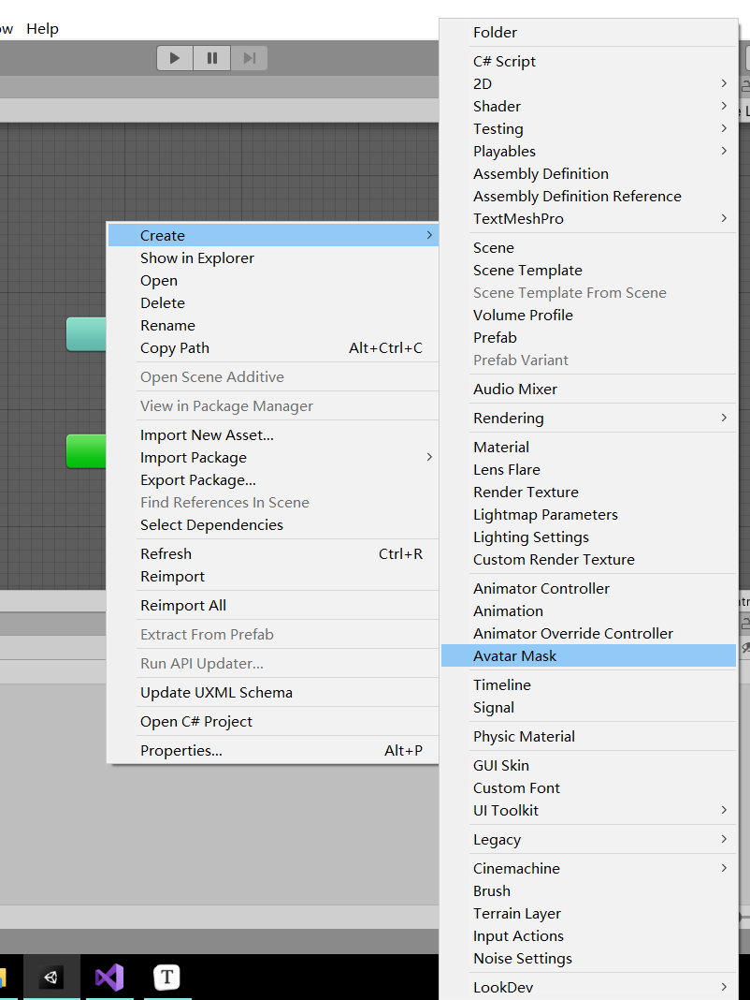

创建完成后我们选择手臂及其IK Goal，代表选择的是手臂、手掌和两个IK：

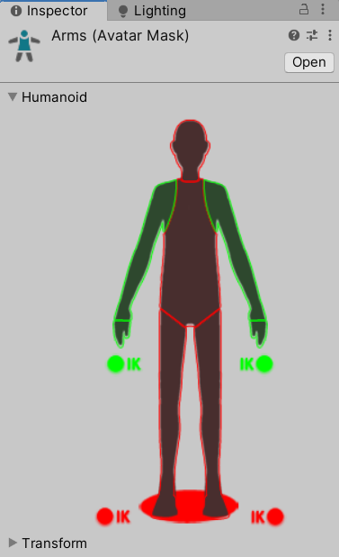

接着回到状态机中，将我们创建的这个Avatar Mask赋值给新建的Arms Layer：

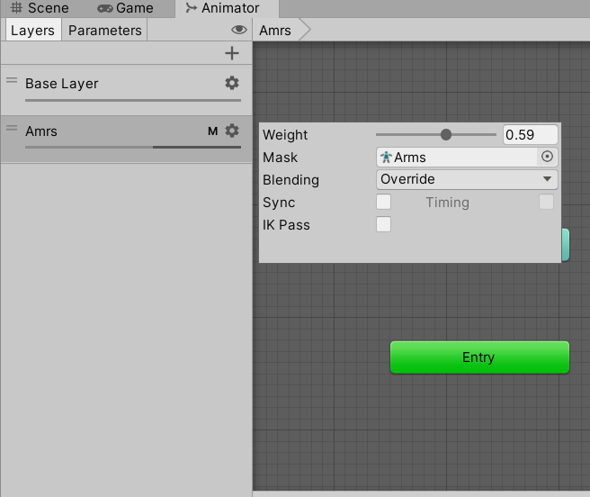

可以看到出现了M字样作为标记，表示这个Layer使用了Avatar Mask。在Layer的设置中，还有以下几项：

* Weight：当前Layer影响动画的权重；
* Mask：使用的Avatar Mask；
* Blending：和上层动画的混合方式，Override为取代，Additive为正常混合；
* Sync：选择是否和其他层级同步；
* IK Pass：是否使用IK；

然后我们找到一个持枪动画，按照之前讲解的方法修改必要的地方，添加进状态机中的Arms层，用一个bool变量来控制当前是否持枪，得到效果就是角色在bool变量为真时双手抬起，并且可以行走，不会影响手部的动作。

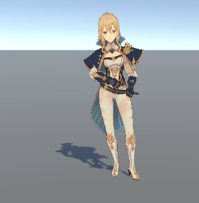

## Additive模式的使用

上面我们用override覆盖了原本的手臂动画，现在我们使用Additive模式为角色添加疲劳感。找到一个喘气的动画，添加到新建的状态机层中即可。接着打开Layer的设置，创建一个只影响头部和驱赶的Avatar Mask给这个层：

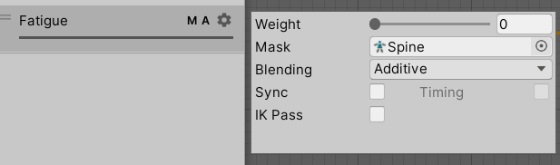

这样一来，层中只有一个状态，也就是说只要Weight变大，那么这个层的状态就会附加到原本的状态上做一个混合，达到角色喘气、疲劳的感觉。

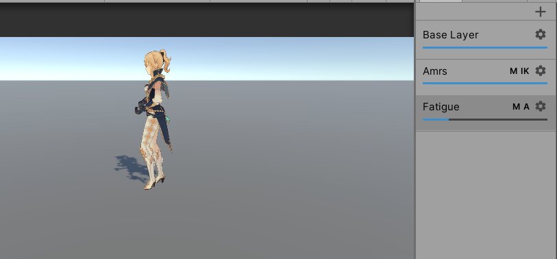

我们下面修改脚本，用脚本来控制角色的疲劳值，将代码修改成下面这样：

```C#
using System.Collections;
using System.Collections.Generic;
using UnityEngine;
using UnityEngine.InputSystem;

public class QinController : MonoBehaviour
{
    public float RotateSpeed = 1000f;

    Transform Playertransform;
    Animator animator;
    Vector2 playerInput;
    bool isRunning;
    Vector3 playermovement;

    float currentSpeed;
    float targetSpeed;
    float WalkingSpeed = 1.5f;
    float RunSpeed = 3.3f;
    bool armedRifle = false;
    float currentFatigue;
    float minFatigue = 0f;
    float maxFatigue = 10f;
    int FatigueLayerIndex;
    // Start is called before the first frame update
    void Start()
    {
        animator = GetComponent<Animator>();
        Playertransform = GetComponent<Transform>();
        FatigueLayerIndex = animator.GetLayerIndex("Fatigue");
    }

    // Update is called once per frame
    void Update()
    {
        PlayerRotate();
        PlayerMove();
        CaculateFatigue();
    }

    public void GetPlayerMoveInput(InputAction.CallbackContext callbackContext)
    {
        playerInput = callbackContext.ReadValue<Vector2>();
        Debug.Log(playerInput);
    }

    public void GetPlayerRunInput(InputAction.CallbackContext callbackContext)
    {
        isRunning = callbackContext.ReadValue<float>() > 0 ? true : false;
        Debug.Log(isRunning);
    }

    void PlayerRotate()
    {
        if (playerInput.Equals(Vector2.zero)) return;
        playermovement.x = playerInput.x;
        playermovement.z = playerInput.y;

        Quaternion targetRotation = Quaternion.LookRotation(playermovement, Vector3.up);
        Playertransform.rotation = Quaternion.RotateTowards(Playertransform.rotation, targetRotation, RotateSpeed * Time.deltaTime);
    }

    void PlayerMove()
    {
        targetSpeed = isRunning ? RunSpeed : WalkingSpeed;
        targetSpeed *= playerInput.magnitude;
        currentSpeed = Mathf.Lerp(currentSpeed, targetSpeed, 0.5f);
        animator.SetFloat("VerticalSpeed", currentSpeed);
    }

    public void GetArmedRifleInput(InputAction.CallbackContext callback)
    {
        if(callback.ReadValue<float>() == 0)
        {
            armedRifle = !armedRifle;
            animator.SetBool("Rifle", armedRifle);
        }
    }

    void CaculateFatigue()
    {
        if (currentSpeed < 1f && currentFatigue >= 0)
        {
            currentFatigue -= Time.deltaTime;

        }
        else if (currentSpeed > 2f && currentFatigue <= 10)
        {
            currentFatigue += Time.deltaTime;
        }
        else
            return;
        currentFatigue = Mathf.Clamp(currentFatigue, minFatigue, maxFatigue);
        animator.SetLayerWeight(FatigueLayerIndex, currentFatigue / 10f);
    }
}

```

进入游戏，可以看到状态机中Fatigue层的weight随着角色移动而更改，这就是Additive模式的基本用法了。

了解之后我们不妨进一步思考原理，之前说动画其实就是对游戏对象的一系列的变换，那么Additive模式含义就是，让当前层动画的变化施加到游戏对象上，让游戏对象乘以变换矩阵。那么问题来了，如果一个动画并没有包含任何变换，或者说Curves，例如持枪动画中，角色的双手从头到尾是静止的，因此将持枪动画的层级修改为Additive时，角色的动作就不会被这个动画影响，因为乘以的变换矩阵为单位矩阵，我们才只能使用override模式让变换强制执行，一如root motion。

## 同步的使用

Sync是Unity提供的同步功能，在开发中有时我们希望能使用角色原来的状态机，但是播放和原来不同的动画，例如角色受伤以后的动画，那么就可以使用Sync进行同步，所谓同步其实仅仅是同步动画状态和状态转换关系，因此对于其中播放什么动画、Blend Tree的内容都不会同步，这样就可以重新添加了。

值得说明的是，如果两个动画状态通过Exit time进行转换，并且这两个动画不一样长，原本的动画可能播放2s后转换，结果现在需要同步的动画只有1s，Unity就会将1s的动画同步缩放到2s，从而保证转换状态不变。

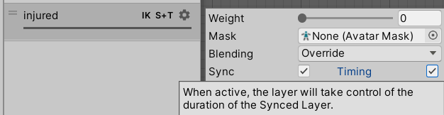

但是如果希望用1s的动画作为基准，将基准层的2s动画缩放到1s呢？这就是使用Timing选项的作用，注意只有当使用override模式时Timing才是可选的。Timing会根据两个层的权重来对动画时间的缩放进行计算，设置当前层的权重为1，那么自然2s的动画就会被缩小到1s了。

## Layer优先级

你可能发现，在添加了injured层之后角色的Fatigue层和Amrs层就失效了，因为在Unity种位于下面的Layer拥有更高的优先级，因此injured代替了上层的所有动画，为了不妨碍Fatigue生效，我们把injured层拖到这两个层上面即可：

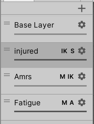

通过合理使用Layer，可以制作精美的角色动画，包括面部表情，这是一个非常强大的功能。

# Inverse kinematic Goal

为了让角色持枪的动作更贴合模型，我们可以用IK Goal来实现，前面我们已经使用过了。在勾选Layer中的IK Pass后，代表你开启了IK计算，系统将会每帧回调OnAnimatorIK方法。

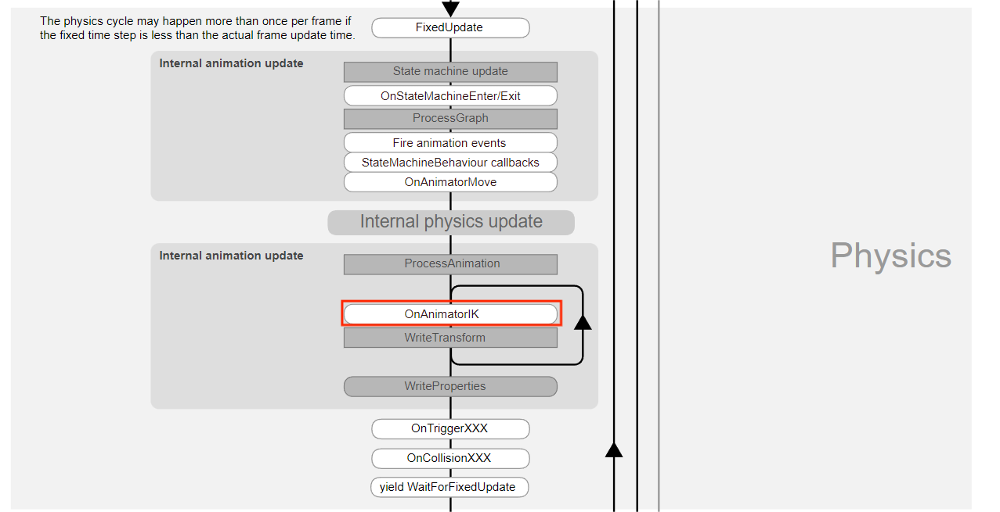

根据反向动力学，Unity会计算将目标骨骼移动到对应位置后角色身体其他部分的变化，因此可以用IK Goal来移动角色四肢，这里持枪姿态就是将角色的双手移动到枪身上面。但是直接在代码中移动IK Goal又看不见，我们很难用调整代码的方式来调整IK Goal位置，因此通常的做法是建立一个空对象代表IK Goal，然后运行后调整这个空对象的位置，就能看到角色四肢的移动效果了。

我们这里可以给角色的左右手分别创建一个枪支的空子对象，然后在代码中让Avatar左右手的位置、朝向都和空对象统一，接着就可以调整空对象的位置，进而调整手的位置了。

```C#
    private void OnAnimatorIK(int layerIndex)
    {
        animator.SetIKPosition(AvatarIKGoal.RightHand, righthandposition.position);
        animator.SetIKRotation(AvatarIKGoal.RightHand, righthandposition.rotation);

        animator.SetIKPosition(AvatarIKGoal.LeftHand, lefthandposition.position);
        animator.SetIKRotation(AvatarIKGoal.LeftHand, lefthandposition.rotation);

        animator.SetIKPositionWeight(AvatarIKGoal.LeftHand, 1f);
        animator.SetIKPositionWeight(AvatarIKGoal.RightHand, 1f);
        animator.SetIKRotationWeight(AvatarIKGoal.LeftHand, 1f);
        animator.SetIKRotationWeight(AvatarIKGoal.RightHand, 1f);
    }
```

如何在游戏运行的时候保存属性？点击Transform组件右上角的三个点，展开后可以看到Copy Component选项，点击后结束游戏，再打开选择Paste Component Values即可粘贴调整好的值。

另外还有一个重要的地方，由于我们计算IK时对整个骨骼都会有影响，导致设置IK Goal后可能会发现右手位置对了，左手却偏移了，这就是左手的IK Goal受到了右手IK计算的影响。IK效果并不会立即被体现出来，导致一方对另一方绑定位置的影响具有滞后性，导致后绑定的一方绑定位置出错，也就是左手。

因此我们可以创建一个新的Layer，勾选IK Pass用于逻辑运行，并采用形参LayerIndex作为逻辑分支，在不同的层逻辑中进行不同的处理，就可以解决问题了。

我们这里可以直接开启两个层的IK Pass，左右手也不会发生偏移，因为每更新帧中对每个层调用一次OnAnimatorIK和WriteTransform，也就是说给两个层都执行了相同的内容，第一次调用时左手绑定Goal的代码在右手后面，导致绑定出错，第二次调用以后右手绑定位置已经ok了，所以左手重新调整到正确的位置了。

# Animation Rigging

Animation Rigging是unity推出的简化动画系统的框架，可以使用一系列的组件将骨骼摆动到正确的位置上。我们这里使用最简单的Two Bone Contrains来进行手部持枪动画的绑定。

首先在Packge Manager中导入Animation Rigging，然后看到顶部菜单栏多出来一个Animation Rigging的选项。然后我们可以先使用Bone Renderer Setup来给角色添加骨骼渲染，之后就可以通过点击场景的方式来选择需要哪个骨骼：

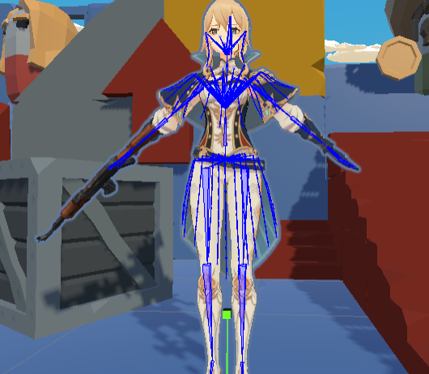

然后就是rig的使用，rig就相当于一个变换骨骼的操作，一个角色可以拥有多个rig，它们统一被Rig Builder组件管理；每个rig下也可以有多个Constrains，相当于更详细的骨骼变换操作描述，那么我们要使用rig将手部放到合适的位置，就不用像之前那样通过代码慢慢调整。

先给角色添加Rig Builder组件，它自动给角色创建一个名为Rig1的子对象(Rig Builder中也可以点击加号添加新的Rig)，将其重命名为Two Hands Rig，可以看到这个对象已经添加了Rig组件，管理两个手的骨骼变换；再给Rig然后添加两个子对象Right Hand Constrain，Left Hand Constrain，这两个约束详细描述了游戏中角色的手应该如何摆放，就像IK Goal一样，所以我们还是建立空子对象作为Target。

不过这里引入了Animation Rigging，有比较快的方法，原来播放的持枪动画基本OK，所以我们给Chest建立空的子对象作为右手的Target，开始游戏并让角色持枪，然后同时选中此时角色大概正确的手腕骨骼，和我们的target，点击顶部Animation Rigging中的Align Position，就可以让Target的位移同此时手腕相同，方便了我们后面调整。

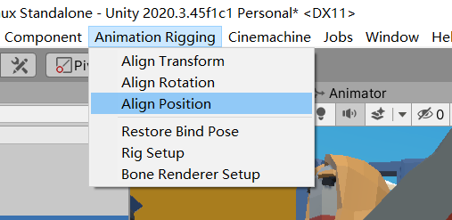

接着给两个Constrain添加Two Bone Constrains组件：

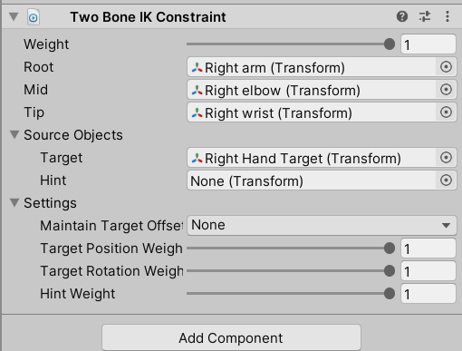

Two Bone Constrains实际上就是通过旋转root、mid两根骨骼，把tip这个骨骼放到target位置上。Maintain Target Offset代表是否保持tip和target之间的位移差。那么手腕Wrist的父节点分别是elbow和arm骨骼，所以就将它们拖进去，下面Target则是刚才对齐的子对象，配置好之后就可以开始游戏了，此时看到右手已经绑定在位置上了。接着你要做的就是调整Target的位置，让右手摆放到合适的位置。

用相同的办法调整左手位置，完成后你应该分别给左右手创建了一个对其的空游戏对象。

接着完成对Aiming Idle动画的调整，完成后一共有四个空游戏对象了。

完成后我们得到了调整后的持枪Idle和瞄准Idle，为了使用这两个动画，我们得让它们切换的同时，Constrains中的Target也一同切换，这当然可以通过代码实现，但是我们有更简单的方法，依然是动画的本质。

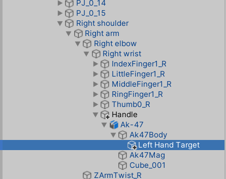

众所周知，动画通过对一层一层游戏子对象的名称来辨别并施加变换，此时我们设置了一个Target子对象作为手移动的对象，那么它自然也可以通过动画访问到，因此我们完全可以添加一个Animation Clip，让这个Clip来对该Target进行变换，从而让这个Target在持枪Idle的时候就保持持枪时Target的值，在瞄准Idle的时候就保持瞄准时Target的值，也就是说左右手各使用一个Target即可，就没必要通过代码进行切换了。

那么打开角色的Animation窗口，新建一个Clip，存入持枪Idle时调整好的左右手Target的Rotation和Position；再新建另一个Clip，这时由于已经有了持枪Idle时Target的位置，所以把瞄准Idle时Target的Transform组件值拷贝到持枪Idle时Target的Transform组件，再次添加持枪Idle时左右手Target的Rotation和Position。

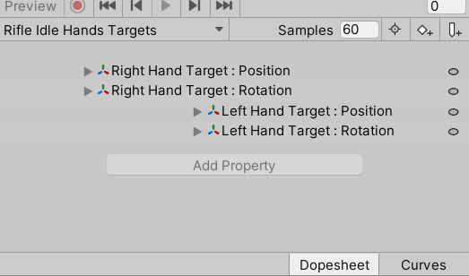

也就是说，我们两个动画Clip里存的就是对左手Target和右手Target的变换，并且它们具有不同的值，接下来应该如何使用呢？

我们知道，动画Clip会让对应的游戏对象进行变换，这里的变换则是对Target的旋转、位移变换，规定播放该Clip时让Target旋转、移动到固定的位置；又因为我们的Constraints约束了手的位置，所以手就会被带动到Target的位置。我们只需要让状态机中条件发生转换的时候，播放对应动画并override到下层动画上即可。

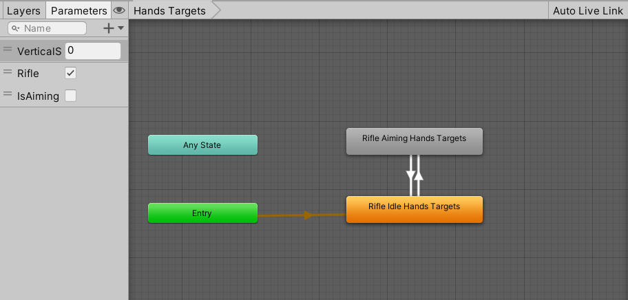

所以我们在最下面新建一个Layer层，当isAiming为true的时候播放瞄准Idle的动画Clip，false的时候播放持枪Idle的动画Clip，就实现了Constrains中Target的改变。多余的那个Target就可以删除了。这样我们瞄准动画就修改好了。
