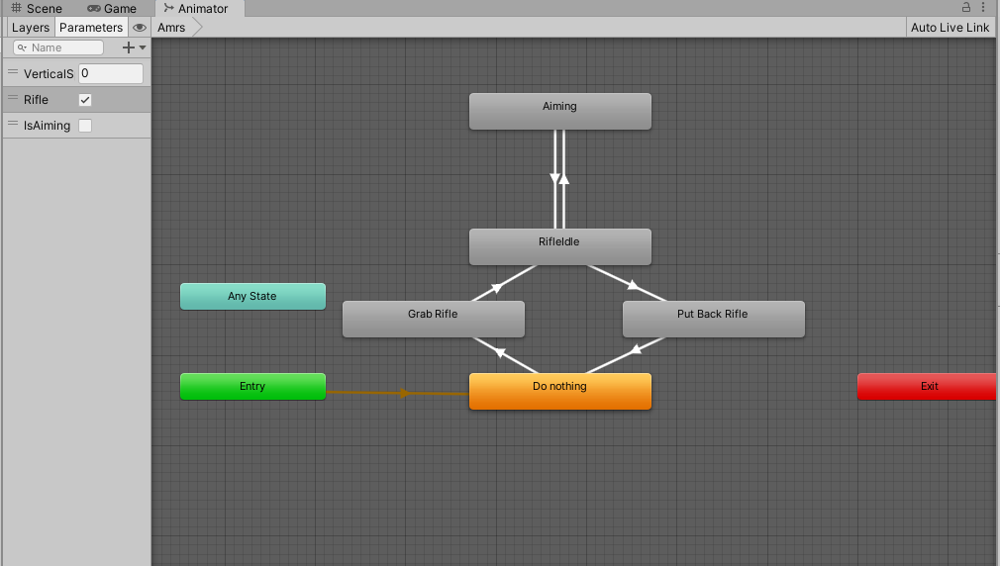
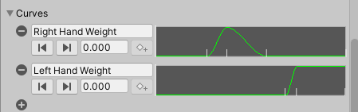

这次我们来学习动画片段的三个基本操作，分割，事件，修改Curves。虽然我们不是动画师，但是有必要对Unity的动画系统有全面的了解。

<!--more-->

# 分割片段

在游戏开发中，一个动画片段可能包含多个逻辑，例如拔枪和收枪动画常常会放在一起，我们实际使用的时候就需要将整个动画分割成两份。


在动画的FBX文件属性中，Animation下的Clips一栏显示了当前FBX文件中存在的Clips(上面是maximo动画Grab and Put Bakc Rifle分割后的列表)，右侧Start代表该Clip开始的帧数，End代表结束的帧数。点击下面的+号就可以添加Clip。


再往下就是调整Clip起始帧的地方了，我们之前在这里调整root motion的设置，右边的信号灯起始表示的是从当前Cllip起始帧到结束帧的各种差异，含义和之前介绍的一样。上面Length是Clip持续的时间，30FPS代表每秒三十帧，下面就是时间轴，拖动蓝色箭头就可以修改Clip的长度、位置，而Start和End还是表示起始和结束的帧数。其余设置就不说了，前面root motion的博客介绍过。

那么现在我们要将这个动画分割成拔枪和收枪两部分，于是点击加号添加，调整好时间以后点击下方的Apply，就得到了开始图中的两个Clip片段。

在状态机中测试：



记得禁用角色的rig约束，可以看到动画已经正确播放了。我们后面再进一步调整动画。

# 动画事件

在Unity中，有时我们需要动画的播放和一些事件关联，如角色播放技能动画时播放音效，攻击动作达到指定位置时触发伤害等，这就是Animation Event的作用。那么这里的例子就是，让角色播放收枪动画到一定程度时，将步枪绑定到角色背后；播放拔枪动画到一定程度时，将步枪绑定到角色手上。

作为例子来说，这里处理方式就采用简单的激活，弄一个枪模型挂在角色背后，当角色伸手拿枪的时候，把背上的枪禁用，然后激活手上的枪；放枪的时候就反过来激活：

```C#
    public void PutGrabRifle(int isOnBack)
    {
        if(isOnBack == 1)
        {
            rifleOnBack.SetActive(true);
            rifleInHand.SetActive(false);
        }
        else if(isOnBack == 0)
        {
            rifleOnBack.SetActive(false);
            rifleInHand.SetActive(true);
        }
    }
```

因此我们需要使用动画事件来让这个事件函数在播放到一定帧的时候被调用。点开FBX文件下面的Events：


有加号的按钮就是添加事件函数的按钮，添加以后时间轴上会多出一个白条，表示该处存在事件函数。动画事件的逻辑是，填写Function为事件函数的名称后，当动画播放到该帧，Unity会让Animator组件发出一个Message，然后根据Function名称，调用该游戏对象组件中与Function名称相同的方法，无论有多少个同名方法。

注意，Events中的时间轴不能被拖动，只能被选中，只有在预览窗口中才能拖动时间轴，达到想要的位置。我们这里选择好时间轴，添加方法名称，下面则是传入的参数，只允许传入这四种参数，所以我们传入一个Int值1/0，就完成了这里的事件函数。

然后播放动画，此时收枪拔枪动画已经正常了，只不过位置有些不对。

# 添加Curve

在开发中的很多时候，我们需要根据动画播放的进度来调整角色的某些属性，例如滑铲等动画中角色的碰撞体需要修改大小，一种方案是编写脚本来跟踪动画播放进度，不过我们可以直接将修改的属性写入动画文件，也就是Curve，从而方便开发。

刚才添加了收枪拔枪的动画之后，再打开rig，发现角色的IK动画不正常了，因为rig权重是100，导致角色一开始进入拔枪动画时手就被固定在Target上。所以我们需要让角色的rig权重随着动画播放而慢慢变化，需要IK的时候就升高权重，不需要就降低，才能达到平滑的过渡效果。另外，角色的手也应该处于枪把手的位置，这也需要调整。

所以我们要做的事情是：

* 添加一个背上的Target，这个背上Target和背上的枪的相对位置，应该和手上的枪和手上的Target的相对位置一致；
* 将背上Target的Transform按照前面一篇博客介绍的方法做成一个New Clip，就可以删除这个背上的Target了；
* 使用Animation的Curve功能调整rig的权重；
* 修改状态机

为了保持相对位置一致，可以把原来的的Target拖动到手上的枪对象下，这样Target就保存了当前相对于父对象枪的相对位置，那么新的Target可以创建到背上的枪对象下面，拷贝这个相对位置即可得到正确的Target位置。

重点说后面如何使用曲线，之前说Curves是动画保存变换的根本形式，我们自然可以通过类似的形式来添加其他变量的Curves，那么这里要修改的就是左右手的Rig权重，我们打开动画文件的Animation栏，找到下面的Curves并点开，点击加号添加一条曲线。



你可以拖动预览窗口的时间轴选择帧，然后点击菱形按钮添加关键帧并命名，注意这个名字就应该是稍后我们添加在Animator Controller中的Parameter的值，Unity会根据这个名字去匹配Parameter中的变量，然后对变量做对应曲线的修改。

这里我们要修改的是拔枪的动画，为了让角色拔枪的时候动作平滑，那么对于拔枪的右手，就要让它伸到背后枪把手的位置，也就是背上的Target。当动画刚开始播放的时候Weight肯定为0，快要拿到枪的时候让Weight开始上升，角色右手向枪把靠近，拿到枪的时候Weight肯定为1，达到Target；之后让Weight下降，角色要把手拿开，等拔枪到角色身前时，要进入持枪Idle的动画，右手肯定不在背上了，Weight为0。这就是上图中Right Hand Weight三个关键帧的含义。

对于左手，只有在拔出枪后，才会接住枪，这里接住枪的位置和持枪Idle中的约束一致，因此我们直接让左手快要接住枪的时候Weight上升，拿到枪的时候Weight为1，之后保持这个值即可。

现在你大概明白Weight和Target在控制什么了，其实就是角色肢体靠近某个位置的程度，拔枪的时候需要角色将右手放到枪把上，左手等拔出来之后放到枪托上，通过这种方式我们可以控制角色肢体进行精确的抓取操作。

之后我们要做的，就是从Animator中获取这个Curve的值，然后赋值给Constraint的Weight即可。

```C#
    public TwoBoneIKConstraint rightHandConstraint;
    public TwoBoneIKConstraint leftHandConstraint;
    
    void SetTwoHandsWeight()
    {
        rightHandConstraint.weight = animator.GetFloat("Right Hand Weight");
        leftHandConstraint.weight = animator.GetFloat("Left Hand Weight");
    }
```

当然，你也许注意到另一个问题，Right Hand Weight后半部分保持Weight为0，通过上面的代码，这意味着即使拔枪动画完成了，角色的右手约束仍然为0，此时Target虽然已经变成我们之前调整的持枪Idle，但是约束并不会被应用。所以我们用了这种方式后，就得为其他需要的Clip一并添加曲线，保持这个Weight的正常。

因此我们找到持枪Idle的动画，添加两条全为1的Curve，名称仍然是和上面图中一致。对于瞄准Idle的动画同样要添加。这样以后我们动作才正式调整完成。

最后我们只需要调整下状态机，那么这部分动画就制作好了。之前我们设置的移动、瞄准等状态机都不需要修改，现在只是要使用我们刚刚制作的新的Target动画Clip来调整手臂的IK，所以我们为了方便管理，我们可以使用同步机制来同步Arms层的转换，将之前控制Target转换的层和Arms同步，并且勾上Timing，保证有Exit Time的动画时间一致。然后将不同状态对应的Target动画放进去，其余都不需要调整。

此时运行游戏，可以看到人物的收枪、拔枪、瞄准都比较精确了。

# 2D Blend Tree原理

之前我们虽然使用了2D混合树，但是并不清楚一些细节和原理。现在我们制作的角色在瞄准的时候虽然能正常移动，但是显然枪口是随着人物移动而移动的，这在射击游戏中显然不对，我们希望的是瞄准时角色的移动不影响瞄准方向，所以需要另外的动画片段才能实现这个移动。

## 2D Simple Directional

我们之前下载的动画包中已经有了八个方向的瞄准移动动画了，使用2DBlend Tree可以让角色动画在它们之间混合，向左后方移动的角色动画枪口仍然是朝正前方的。那么我们修改瞄准移动的Blend Tree为2D Simple Directional，然后依然使用Unity自动计算它们在Blend Tree中的位置：


点击Compute Positions，Pos X根据X方向的速度计算，Pos Y根据Z方向的速度计算，就得到上面的效果了，可以看到这几个动画片段都被分配到正确位置上。

下面的Adjust Time Scale则是用于调整动画播放速度，只有重置和同步两个选项，前者不用说了，同步则是计算每个动画的平均播放速度(也就是动画文件中的速度)，然后调节播放速度，让动画的平均速度一致。

下面我们重点说明Unity如何给混合树进行混合的，如果坐标原点存在动画，如上图，那么此时Unity会根据红点的位置连线成向量n，然后再连线原点和其他动画，找到顺时针和逆时针距离n夹角最小的两个动画，这样连上原点就有三个点了，它们连成一个三角形，红点作为重心，坐标均已知，因此可以用来计算三个点的权重，作为动画播放的权重。

如果原点不存在动画，做法依然不变，不同的是最后将原点计算的权重平均给其他所有动画，无论其他动画在什么位置。因此，如果原点不存在动画，那么当红点不在重心的时候所有动画都会被分配一定权重，来自原点。

因此，2D Simple Directional模式下动画混合计算比较快速，但是由于采用同原点连线的方式进行计算权重，导致不能让同一个方向上存在两个动画，而原点的某个180度方向内也不允许一个动画都不存在，否则红点在该区域内也不能匹配到三角形。当不需要在一个方向上混合多个动画时，应该首选这个模式。

## 2D Freedom Cartesian

下面我们规范名称，进一步了解这个2D混合树机制。我们把动画称为Example Motion，红点蓝点所在的空间称为Parameter Space，红点则是Sample Point，蓝点是Example Point。

现在我们用$P$表示Sample Point，给定两个Example Point为$P_i, P_j$，定义$i$对$P$的影响力为$h_i(p)=min(1-\frac{\overrightarrow{P_iP} \cdot \overrightarrow{P_iP_j}}{|| \overrightarrow{P_iP_j} ||})$。

其物理意义是，遍历所有存在的$P_j$，向量$\overrightarrow{P_iP}$在向量$\overrightarrow{P_iP_j}$方向上的投影长度和$\overrightarrow{P_iP_j}$长度的比值，取得其中的最小值。这个比值衡量了$P_i$和$P$之间的远近，当比值越大，说明Sample Point距离Example Point越远；比值越小，说明Sample Point距离Example Point越近。将这个比值取反并归一化，就得到我们定义的影响力了。

如果再将这个影响力归一化到所有点上，也就是除以所有点影响力之和，就得到了每个点的权重。

这种混合计算方法就是2D Freedom Cartesian的分配原理，称为Gradient Band Interpolation，是由Unity的开发人员提出的，在笛卡尔坐标系下进行混合计算。[ShaderToy](https://www.shadertoy.com/view/XlKXWR)上还有人复现了该算法。

## 2D Freedom Directional

Cartesian使用的算法会导致一个问题，我们开发中有可能一个方向上角色需要播放走和跑的动画，那么当两个方向都需要走和跑的时候，即使我们的Sample Point达到边界，此时因为走路对应的Example Point计算出的影响力参考的是跑步动画的点，那么走路的点的影响力并不为0。我们当然希望这时走路的点权重为0。


因此，2D Freedom Directional使用了一个加强的Gradient Band Interpolation算法，在极坐标下进行计算。

我们根据论文补充一点数学定义(并不是普遍做法)，在笛卡尔坐标系中，向量被定义为两个点坐标的差，现已知两个点的坐标，极坐标下两个点的向量可以表示为：


其中$P_i$和$P_j$分别是两个二维坐标。之所以要除以两个坐标的模的平均，是为了保证单位大小不变。α是先验的权重，用来调整极坐标中半径和角度的重要性。

除此外，计算方法完全一致。但是由于在极坐标下进行了计算，最后呈现的效果也是不一样的。该算法的时间复杂度达到了O(n^2)。具体的计算细节我们不再展开。

只需要知道，采用这种方法以后，混合计算就比较精确了。

到这里我们的动画系统就正式介绍完了。由于Animation系统Bug很多，现在很多项目都启用了该系统，不过作为个人来说可以学习使用。
