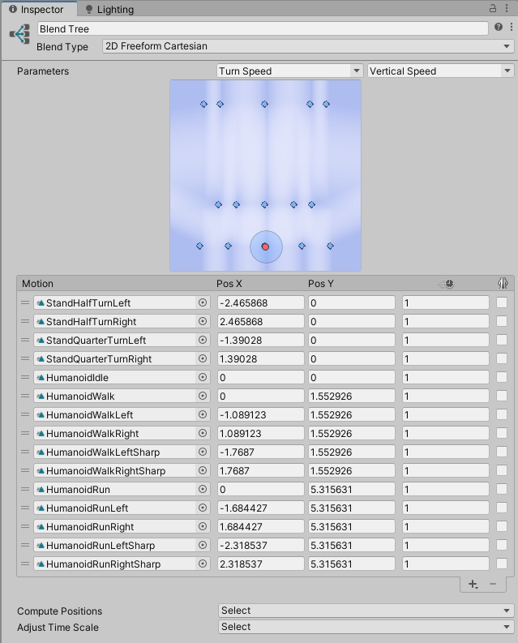
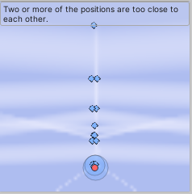
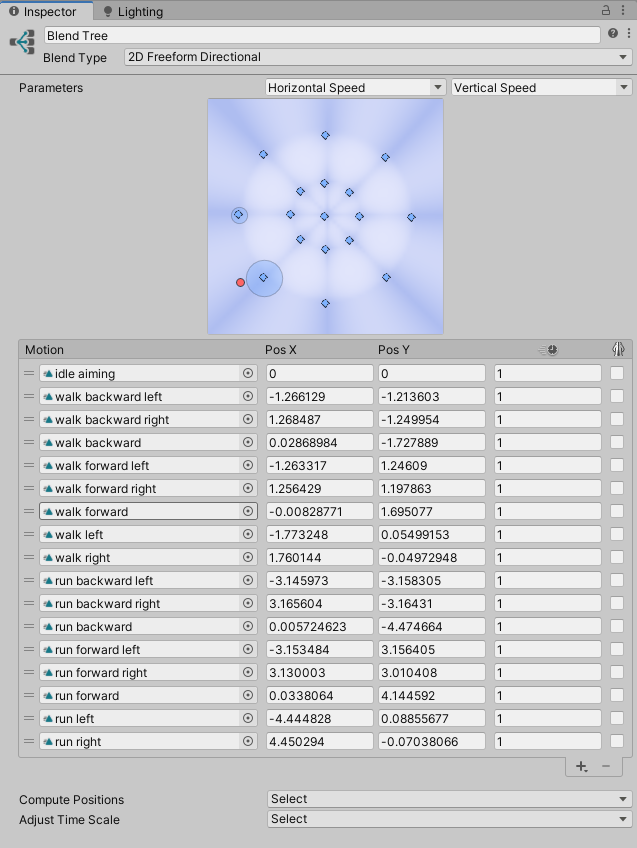
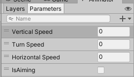
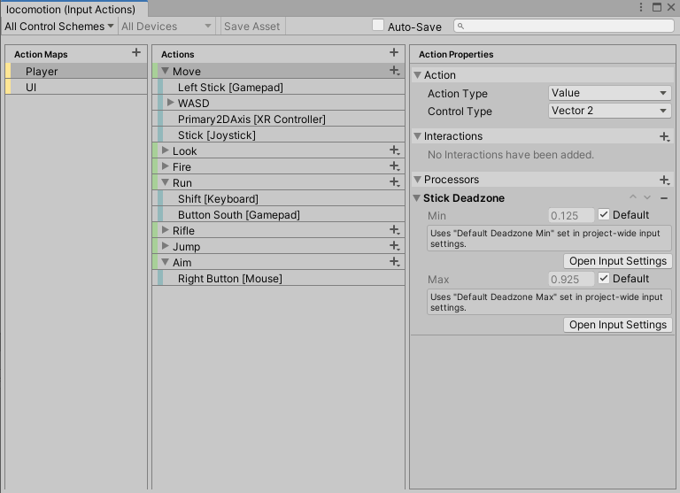
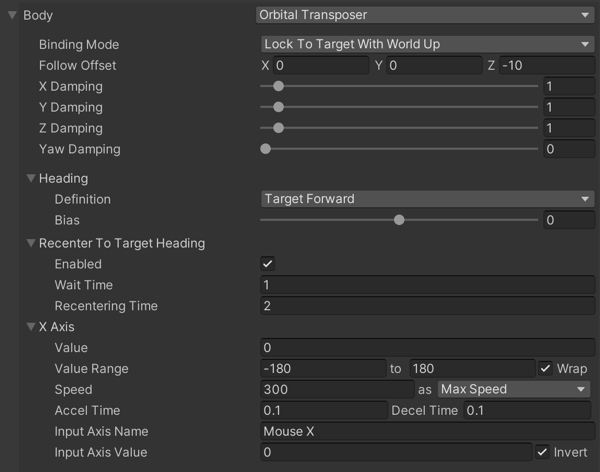
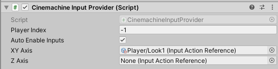
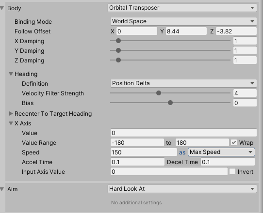
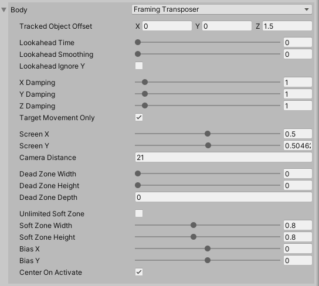
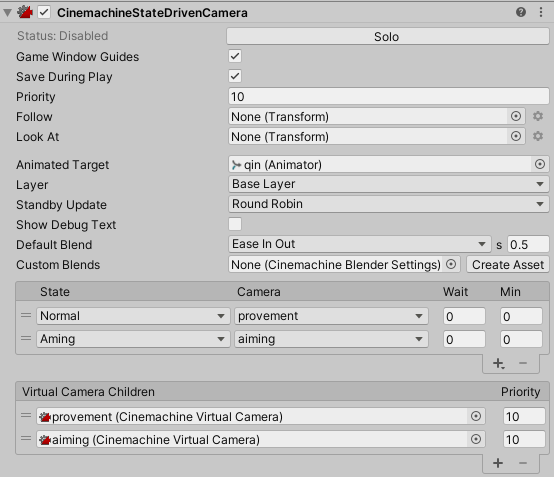

在前面的博客中我们介绍过一次Cinemachine的基本功能，包括，CinemachineBrain和Virtual的使用，结合动画系统，我们这里练习两种控制方式的制作。俯视角的相机常用在2.5D的游戏中；第三人称相机就不用说了，很主流的视角。注意，我们介绍中的解决方案可能不是十分完美，可以简单了解如何实现相机和动画、移动的统一。

<!--more-->

# 俯视角射击游戏相机制作

一般2.5D俯视角的话只需固定相机位置，然后不跟随角色旋转即可，也就是虚拟摄像机中的Aim可以选择Do Nothing，而Body选择Transposer，并设置Binding Mode为Lock To Target On Assign或者World Space，跟随目标移动即可。具体含义可到之前的博客中查找。

我们后面会进一步优化这个简单的摄像机，不过现在我们先关注如何控制角色动画，因为在俯视角射击游戏中，角色除了走动以外，瞄准方向要随鼠标位置移动。因此我们要处理非瞄准模式下的移动和瞄准模式下的移动，它们可以使用混合树完成。

## Normal状态下的移动动画

新建一个Animator Controller，添加两个混合树，一个命名为Aiming，一个命名为Normal，我们先设置Normal的动画。我们使用的素材是Unity之前发布的标准包动作，使用Maximo的其他动画也可以。这个动画包含有行走、转弯、奔跑、待机在内的共15个动画，列表如下：


可以看到这种包含转弯动作的动画一般没有向后走的Clip，也就是说如果角色向后走了，也应该让角色旋转并再向前走，这样显然比较符合实际。那么混合树变量的阈值设置自然也不能像我们之前那样使用x和z方向的位移了，因为角色转弯动画的root motion并没有大幅度的移动，而是旋转比较多。因此如果我们直接使用xz的位移来计算阈值，那么转弯动画的x位移就比较小，会导致很多Clip排布紧密，几乎在一条直线上，导致动画系统混合Clip的时候误差比较大。就算使用了计算量更大的2D Freedom Directional，也是不合适的。



所以对于这种动画可以用旋转的速度来调整动画的X阈值，也就是角速度。计算角速度可以使用角度和弧度为单位，这里选择弧度Rad比较合适，使用角度当然也没错，但是角度的取值范围远大于纵坐标的z轴速度值，因此又会导致Clip排在一条横线上。而使用了Rad以后计算，发现此时动画的距离就比较合适了，此时虽然有同方向的不同速度，但是也可以使用2D Freedom Cartesian，当然是不精确的，不过我们此时可以忍受这种小幅的偏差，因为只有少数动画在同一方向，换来更低的计算量。

计算完成后，为了让动画播放保持统一，可以将原地、走路、奔跑的动画Clip的纵坐标阈值设置为一样的，这是标准资源包的参考做法。

现在拖动Sample Point，也就是红点，就可以查看移动效果了。确定没有问题后，我们进一步制作瞄准的动画。

## Aiming状态下的移动动画

瞄准状态下的角色动画来自Maximo，包含了角色八个方向上的走路、奔跑动画，注意，这里的动画并非转向，而是角色直接朝某个方向移动的动画，而且角色的朝向不改变，因为角色瞄准的时候应该面朝我们鼠标的方向。由于此时多个同方向上都有不同速度的移动动画，因此必须要使用2D Freedom Directional了，保证动画的计算准确。



注意，这里动画的播放完全和2D中一致，动画没有角速度，所以采用的是xz速度计算阈值。

## 参数分析和赋值

现在我们分析一遍状态机有哪些参数，首先是切换瞄准状态的bool变量，命名为IsAiming；然后是Normal状态的Turn Speed和Vertical Speed，接着Aiming状态还有一个Horizontal Speed，共计四个参数。



然后确定玩家的输入值，我们这里仍使用New Input System，IsAiming同鼠标右键绑定，作为Button读取；移动使用WASD，作为二维向量读取；此外还需要一个切换奔跑的按键Shift，也做为Button读取。



```C#
    public void GetMoveInput(InputAction.CallbackContext context)
    {
        moveInput = context.ReadValue<Vector2>();
    }

    public void GetAimPositionInput(InputAction.CallbackContext context)
    {
        aimPosition = context.ReadValue<Vector2>();
    }

    public void GetRunInput(InputAction.CallbackContext context)
    {
        isRunning = context.ReadValueAsButton();
    }
    
    public void GetAimInput(InputAction.CallbackContext context)
    {
        isAiming = context.ReadValueAsButton();
    }
```

对于Normal状态，要传入Turn Speed作为动画混合的X阈值，这个值应当是一个弧度值，代表的是角色当前转向的方向和角色Z轴正方向的夹角的弧度，该弧度为正代表向右转，为负代表向左，那么在俯视角游戏中，镜头不旋转，角色的移动方向完全由WASD决定，但是角色向哪个方向转弯应该和角色当前的朝向有关，所以需要把WASD转化到角色的本地坐标系，角色才知道此时是要朝什么方向移动、转弯。

所以我们得计算角色移动的角速度，输入系统中返回的x值代表角色在世界坐标系下水平移动的方向，y值代表在世界坐标系下垂直移动的方向，那么使用下面的代码计算并设置弧度：

```C#
Vector3 dir;
dir = new Vector3(moveInput.x,0f, moveInput.y);
dir = tr.InverseTransformVector(dir);

float rad = Mathf.Atan2(dir.x, dir.z);
animator.SetFloat("Turn Speed", rad, 0.1f, Time.deltaTime);
```

其中moveInput已经获取了用户输入，我们把它换成三维向量，然后转化到角色的本地坐标系，接着用Mathf.Atan2方法计算反三角函数，就得到了弧度值。由于目前动画自带Root Motion，所以可以不用使用组件移动角色。

对于Aiming状态，需要获取角色前后左右移动的速度，这个我们之前已经使用多此，将用户的输入乘以当前速度即可。

```C#
Vector3 dir;
dir = new Vector3(moveInput.x, 0f, moveInput.y);
dir = tr.InverseTransformVector(dir);
animator.SetFloat("Horizontal Speed", dir.x * targetSpeed, 0.1f, Time.deltaTime);
animator.SetFloat("Vertical Speed", dir.z * targetSpeed, 0.1f, Time.deltaTime);
```

注意，我们这里仍然要转化到本地坐标系中，因为角色的朝向是会改变的，我们希望角色在跟随瞄准方向后知道自己是往哪个方向移动。

## 修改角色瞄准方向

现在我们处理角色瞄准方向的问题，在New Input System中，Look一项可以选择鼠标的位置来传入一个二维向量aimPosition，该向量以(0,0)作为屏幕左下角，单位是屏幕的分辨率，表示鼠标的位置。因此我们不能直接获取指针在游戏世界坐标系中的位置，需要进行转换。

转换的方法就是使用射线，我们可以设置一个和角色持枪高度一致的平面，然后从相机的位置朝着鼠标位置发出一条射线，Unity提供了API实现这个功能，通过获取射线和平面相交的位置，可以将屏幕上的点转化为世界坐标系中的点。

```C#
Vector3 playerTargetPosition;
Ray ray = Camera.main.ScreenPointToRay(aimPosition);
Plane hitPlane = new Plane(Vector3.up, tr.position);

float distance;
if (hitPlane.Raycast(ray, out distance))
{
	playerTargetPosition = ray.GetPoint(distance);
	tr.LookAt(playerTargetPosition);
}
```

这样我们就得到了当前角色的枪口瞄准的位置playerTargetPosition，使用Transform组件的LookAt方法让角色朝向该位置，其实就是旋转，角色的瞄准就完成了，又因为移动方法使用的是角色本地坐标系，所以我们设置的Animation也能正常作用。

下面是汇总的代码：

```C#
using System.Collections;
using System.Collections.Generic;
using UnityEngine;
using UnityEngine.InputSystem;

public class TopDownQinController : MonoBehaviour
{
    Transform tr;
    Animator animator;
    CharacterController characterController;

    float walkSpeed = 2f;
    float runSpeed = 5f;

    Vector2 moveInput;
    Vector2 aimPosition;

    bool isRunning;
    bool isAiming;
    bool currentAimState;

    float turnScale = 180f;

    // Start is called before the first frame update
    void Start()
    {
        tr = GetComponent<Transform>();
        animator = GetComponent<Animator>();
        characterController = GetComponent<CharacterController>();
    }

    // Update is called once per frame
    void Update()
    {
        changePlayerState();
        PlayerMove();
        PlayerRotate();
    }

    #region 玩家输入
    public void GetMoveInput(InputAction.CallbackContext context)
    {
        moveInput = context.ReadValue<Vector2>();
    }

    public void GetAimPositionInput(InputAction.CallbackContext context)
    {
        aimPosition = context.ReadValue<Vector2>();
    }

    public void GetRunInput(InputAction.CallbackContext context)
    {
        isRunning = context.ReadValueAsButton();
    }
    
    public void GetAimInput(InputAction.CallbackContext context)
    {
        isAiming = context.ReadValueAsButton();
    }
    #endregion

    void changePlayerState()
    {
        if(currentAimState != isAiming)
        {
            currentAimState = isAiming;
            animator.SetBool("IsAiming", isAiming);
        }
    }

    void PlayerMove()
    {
        float targetSpeed = isRunning ? runSpeed : walkSpeed;
        if (isAiming)
        {
            Vector3 dir;
            dir = new Vector3(moveInput.x, 0f, moveInput.y);
            dir = tr.InverseTransformVector(dir);
            animator.SetFloat("Horizontal Speed", dir.x * targetSpeed, 0.1f, Time.deltaTime);
            animator.SetFloat("Vertical Speed", dir.z * targetSpeed, 0.1f, Time.deltaTime);
        }
        else
        {
            animator.SetFloat("Vertical Speed", moveInput.magnitude * targetSpeed, 0.1f, Time.deltaTime);
        }
    }

    void PlayerRotate()
    {
        if (isAiming)
        {
            Vector3 playerTargetPosition;
            Ray ray = Camera.main.ScreenPointToRay(aimPosition);
            Plane hitPlane = new Plane(Vector3.up, tr.position);

            float distance;
            if (hitPlane.Raycast(ray, out distance))
            {
                playerTargetPosition = ray.GetPoint(distance);
                tr.LookAt(playerTargetPosition);
            }
        }
        else
        {
            Vector3 dir;
            dir = new Vector3(moveInput.x,0f, moveInput.y);
            dir = tr.InverseTransformVector(dir);

            float rad = Mathf.Atan2(dir.x, dir.z);
            animator.SetFloat("Turn Speed", rad, 0.1f, Time.deltaTime);
            tr.Rotate(0, rad * turnScale * Time.deltaTime, 0);
        }   
    }

    private void OnAnimatorMove()
    {
        characterController.SimpleMove(animator.velocity);
        tr.Rotate(animator.deltaRotation.eulerAngles);
    }

}

```

可以看到俯视视角的摄像机设置其实比较简单，下面我们试着优化摄像机来熟悉和练习Cinemachine的其他功能，最后再快速制作第三人称相机，它们有共通的地方。那么现在我们正式说明当前的需求，策划告诉你他现在要这个摄像机随着Aiming切换，普通状态下镜头的xz方向随着鼠标移动转动，并且角色前进的方向和镜头一致，依然是俯视角；而瞄准状态镜头不转动，角色随鼠标瞄准位置旋转，注意此时仍要求角色移动和镜头方向一致。如何实现？我们使用两种新的Body选项。

## Orbital Transposer

使用这种body选项的移动方式，摄像机将在以跟随对象为圆心的圆环轨道上移动，你可以通过一系列的配置规定摄像机在圆环轨道上的位置，或者使用Look At选项配置摄像机的旋转。



其中多数属性和我们之前介绍的一致，现在主要说明不同的地方：

* Recenter To Target Heading：勾选Enable后，镜头将在Wait Time后，在Recentering Time内回到Heading中定义的位置。
* Heading：定义一个镜头的前方方向，Definition中可以选择不同定义，Position Delta代表对象移动的方向，Velocity代表刚体目前的速度(如果没有刚体自动选择第一个)，Target Forward代表对象的前向方向，也就是角色的z轴正方向，World Forward代表使用世界坐标系的z轴正方向。

* X Axis：由于在这种移动方式下相机只需要知道横向，也就是x轴如何移动，因此这里提供了设置x轴输入的设置，Value代表当前的值，0就是在Heading的地方，180在Heading对面，Value Range规定移动的范围，勾选Wrap可以让镜头在边界处循环；Speed是移动速度，as Max Speed代表作为最大速度，还可以选择让输入值乘以这个速度；Accel Time表示加速到最大速度用时，Decel Time则是减速用时；Input Axix Name是在新输入系统中定义的输入值名称，后面是具体的Value，勾选Invert以反转输入；

是的，Unity提供了方便的联动，当使用这个Body后，再给摄像机添加一个脚本：



你就可以方便地使用新输入系统来控制摄像机了，通过该脚本的XY Axis，可以选择我们在输入系统中定义的按键和值传递给镜头，这里选择的方法是Pointer的delta Position，即可移动镜头。不使用新输入系统的情况下，Unity会自动寻找标准输入Input.GetAxis(name)来作为输入。

XY Axis输入二维向量改变相机的x、y轴位置，Z Axis则改变Z轴位置，类比很多第三人称游戏中，鼠标移动就控制了XY，鼠标滚轮则控制了Z。这里我们的相机设置如下：



## Framing Transposer



Framing Transposer是为2D游戏和正交投影设计的，它始终保持和目标之间的距离，该模式使用了Soft Zone和Dead Zone，可以看到其中很多设定和我们之前介绍Aim中的相同，下面介绍新增加的地方：

* Target Movement Only：勾选后阻尼将只对相机的位移作用，相机旋转会忽略阻尼；
* Camera Distance：相机和目标之间的距离，注意，该模式下不能直接修改Transform的Position，必须通过Tracked Object Offset和Rotation，Camera Distance调整；
* Dead Zone Depth：定义了三维上的Dead Zone，当镜头和目标的距离超过该值就调整相机；
* Unlimited Soft Zone：让Soft Zone填满整个屏幕；

上图就是我们目前的设置，作为瞄准状态下的摄像机。

## 摄像机随动画状态机之间的转换

为了方便管理相机，我们可以让它们同动画状态机同步，方式也很简单，Cinemachine提供了State Driven Camera，创建后将前面的两个相机拖成它的子对象：



可以看到下面的Virtual Camera Children已经有了，该组件中其他属性和Cinemachine Brain的属性类似，我们只需要设置Animated Target即可，它应该是一个具备状态机的游戏对象，也就是我们的角色。添加后State一栏中就可以添加状态了，点击右下角加号，添加后选择对应的状态和相机，就可以实现转换了。在这个组件中可以定制转移模式。

## 角色随镜头移动

现在还有最后一个问题，角色不能随镜头方向前进。这个问题也很好解决，我们之前的移动方向是将输入作为世界坐标系中的方向，然后转化到角色的本地坐标系下作为移动方向。所以此时要让角色随着镜头移动，就要将镜头的前方作为角色移动的方向。其实也就是将镜头在xz平面上的投影作为z方向，与之垂直的作为x方向，注意这里的投影方向仍然是在世界坐标系中的位置，因此我们获取了投影方向之后仍然要转换到角色本地坐标系。

```C#
    void CalculateInputDirection()
    {
        Vector3 camForwardPro = Vector3.ProjectOnPlane(camTransform.forward, Vector3.up).normalized;
        dir = camForwardPro * moveInput.y + camTransform.right * moveInput.x;
        dir = tr.InverseTransformVector(dir);
    }
```

这样就得到了dir，我们在Update中运行该函数，每帧更新dir的值。这样角色就可以随镜头指向的前方移动。

# 第三人称相机设置

说了这么多以后，制作第三人称就很容易了。我们用到的概念已经都介绍过了，但是使用的虚拟相机是Free Look，这个摄像机实际上是由上中下三个Orbital相机组成的，Top相机，Middle相机，Bottom相机。通过Free Look的属性可以配置这三个相机的高度、轨道半径，由于属性基本我们都介绍过一遍，这里不再赘述。

不同的是，Free Look中读取了鼠标x、y方向的移动，x方向和Orbital一样控制相机在轨道上的移动，这里多了y方向的值用来在上面说的三个相机之间进行线性的切换，这就是Free Look实现第三人称相机的原理。

使用Free Look同样要添加脚本Cinemachine Input Provider并配置，记得修改x、y轴的反转。如果想要在游戏中禁用鼠标显示，可以使用下面的方法：

```C#
Cursor.lockState = CursorLockMode.Locked;
```

设置完成后采用和上面一样的方法来让角色的移动方向和镜头的投影方向一致，就完成了第三人称相机的制作。
