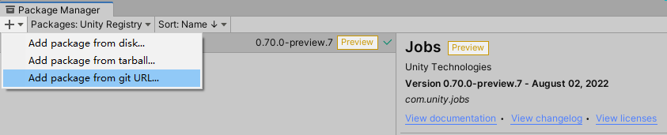
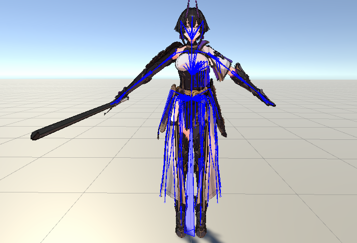
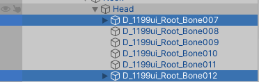
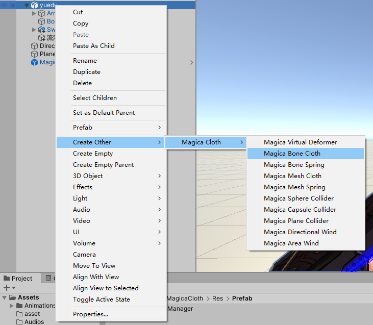
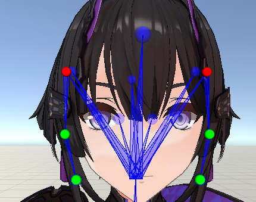
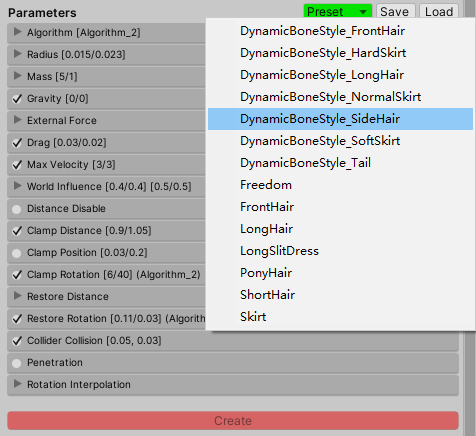
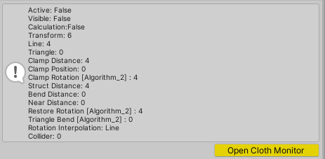
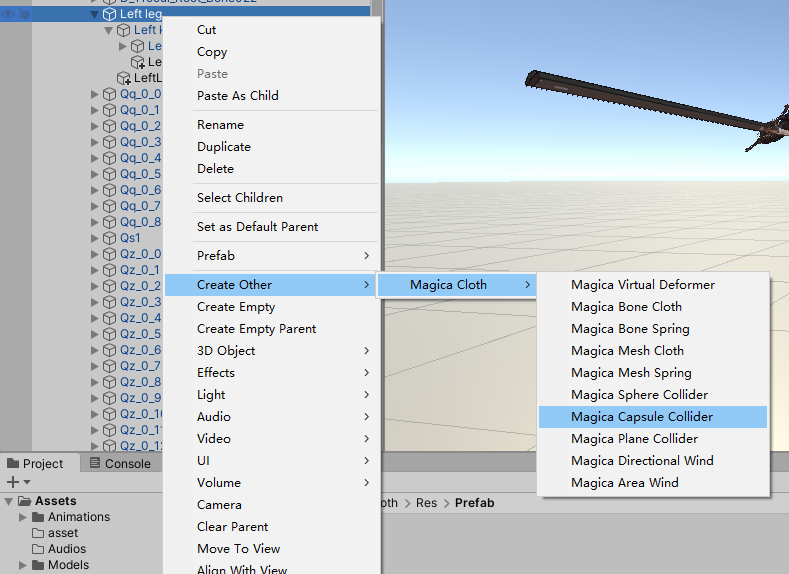
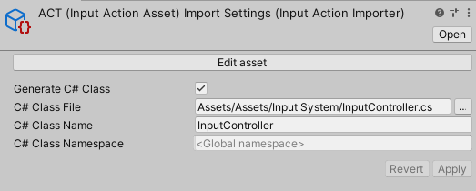

这次填上前面的坑，之前我们使用Unity-Chan的免费插件spring-bone做布料模拟，比较繁琐，这里也不选择它来介绍了，我们改用他家的Magica Cloth，操作简单方便，效果也好。输入系统Input System跟前面是一个插件，不过前面我们使用的方式最简单，但会带来问题，下面会介绍推荐使用的Asset方法。

<!--more-->

# 布料/头发模拟

## 安装Magica Cloth插件

插件是付费插件，自己捣鼓可以去淘宝或者爱给网下一个，搜索Magica Cloth。不过安装该插件之前还要先安装另外两个依赖插件，一个是Burst，Package Manager中搜索安装即可；另外一个是Jobs，2021中改名为Collections，搜索不到可以用Add Pacakge from git URL，输入地址com.unity.jobs安装即可。

这两个插件安装完成后，再导入Magica Cloth的包，没有报错就是成功了。



## 使用方法

我们以下面的模型为例，介绍如何设置人物的头发、衣服效果。图中蓝色骨骼使用Animation Rigging绘制。



### 头发

首先是人物头发，该模型中人物的头发只有左右两个侧发拥有骨骼并需要移动，所以我们对这两个侧发进行设置即可。利用Animation Rigging，点击对应位置的骨骼找到侧发的两个根节点：



编号7和12的就是要更改的头发节点，下面我们在导入的Magica Cloth/Res/Prefab中找到预制件MagicaPhysicsManager，添加到层级栏中用于管理所有的模拟，然后给人物模型添加子物体：



其中Magica Bone表示添加用于管理拥有骨骼的布料的模拟器，如果一个布料没有骨骼，使用Mesh也可以。而且这里Cloth不仅可以模拟衣服，头发也是采用这个进行模拟的，我们选择Macica Bone Cloth添加给人物模型。

完成后这里命名为流海，将刚才我们找到的两个节点拖拽给流海的MagicaBoneCloth组件的Root List，然后点击下面的Start Point Selection，会看到此时人物的这两个骨骼被绘制为不同颜色：



该插件中骨骼有以下类型：

绿色表示这个骨骼节点可以移动，红色节点表示这个骨骼节点不能移动但是可以旋转，也就是根节点，灰色节点表示不会受到插件的影响。所以我们后面要设置的时候，将根节点设置为红色，下面需要移动来模拟的节点设置为绿色即可。可以直接点击Type中的节点颜色来对模型的某个骨骼节点进行修改。

点击End Point Selection完成修改，组件的其他部分不管，直接修改最后的Parameters，插件直接提供了许多预设值供我们使用，所以我们要简单模拟的话也没必要慢慢调整了，对于侧发选择预设的Side Hair就行了：



之后点击Create，回到组件最上面看到提示信息中有各项参数，就是可以模拟了。点击运行，拖动人物就能看到头发此时有模拟效果。



注意不同大小、长度的头发都要用不同的参数，所以要多试试，不能用一个模拟器完成所有任务。

然后我们给角色的衣服都像上面这样设置，然后参数预设选择NormalSkirt。

另外，如果衣服默认不是向下的，还可以在参数中添加重力模拟。

### 碰撞体

能动了之后还要防止模型穿模，头发很短不用管，但是需要给衣服和身体添加碰撞防止穿模。当然如果头发很长也是要添加碰撞的。

Magica Cloth提供两种方法防止穿模，Surface Peneration和Collider Peneration，第一种适用于衣服和身体有联系的情况，角色移动身体部位时衣服也会动；第二种就是像我们这里，衣服有自己的骨骼，不会和身体发生联动，需要添加碰撞体。

所以这里还是要我们手动给角色的身体部位添加对应大小形状的碰撞体，找到这个部位的根骨骼添加子对象：



然后调整它们的位置符合身体大小，给所有需要防止穿模的地方都设置一次，接着回到前面不同衣服对应的模拟器上，将可能碰到的部位分别添加给模拟器组件Magica Bone Cloth上的Collider List，这样就可以防止穿模了。

# 输入系统使用

旧输入系统中我们直接通过读取输入设备的值进行其它处理，Unity的输入系统用Action这一概念来映射输入设备的输入。新输入系统的工作流可以用下面的图片描述([博客地址](https://zhuanlan.zhihu.com/p/106396562))：


我们通过创建Input Action Asset完成Action和输入设备的映射、绑定，每个Action的实现被分为五个Phase如上，其中Started、Performed、Canceled三个阶段将会调用一次Callback。

在文档实例中，给出了四种使用Input System的方式。

* Using State：读取设备状态值获取输入，和旧的输入系统一致；
* Using PlayerInput：使用playerInput组件，设置自定义事件被哪个Callback订阅，也就是我们之前使用的方式；
* Using Action Assets：使用Input Action Assets自动生成输入类，需要的时候主动调用方法获取一次输入的值；
* Using List：使用自定义的 Input Action 列表，不做介绍。

我们要使用的是第三种方式，这种方式不需要在Inspector中做任何配置，也不需要任何组件，使用代码可以完全控制输入，而且能解决乱七八糟的问题。

例如在使用player input组件的时候，容易碰到一种情况是，设置一个Button并绑定，按下对应按键后自定义的回调函数会被调用三次，如上面所说，获取的值在Started和Perfromed两个阶段为true，而最后一个阶段为false，因此在回调函数中打印获取的值，会发现按下一次按键有三次输出。

如果我们有需求是将这个Button做成转换角色状态的输入trigger，例如第一次按下后角色下蹲，再次按下后角色站起来，此时如果用这个输入值作为判断条件，那么会发现判断条件在按下的时候多次判断为true，导致函数被多次调用，因为不管多么短暂，我们的输入总是会保持那么几帧，而且每帧又包含三个阶段的调用，最后这个方法不会和我们实际按下的次数一一对应，而是会相当多次数被调用。

```C#
		//按下下蹲键
        if (inputController.Crouch)
        {
            //当前是下蹲状态
            if(isCrouched)
            {
                //头顶没有障碍物
                if(OverHeadObjDetection() == false)
                {
                    //站立
                    isCrouched = false;
                    animator.SetFloat(crouchID, 0f);
                    SetCrouchColliderValue(originHeight, originCenter);
                    cameraController.setLookAtPosition(normalLook);
                }
                
            }
            //当前不是下蹲状态
            else
            {
                //蹲下
                isCrouched = true;
                animator.SetFloat(crouchID, 1f);
                SetCrouchColliderValue(crouchHeight, crouchCenter);
                cameraController.setLookAtPosition(crouchLook);

            }
        }
```

回到Action Assets上，我们勾选Generate C# Class可以生成一个类：



类中提供了一个结构体PlayerActions，将我们设置的Bindings做成了属性，然后提供在这些属性的Started，Performed，Canceled上添加、删除回调的订阅事件的方法。总之，我们要获取输入需要先实例化这个自动生成的类，然后直接获取PlayerActions结构体，使用这些属性的方法主动获取属性的值作为输入即可。

例如，要获取一个Vector2类型的向量：

```
public Vector2 Movement { get => m_InputController.Player.Movement.ReadValue<Vector2>(); }
```

其中m_InputController是实例化的自动生成的类。如果要获取一个上面例子中Trigger类型的值：

```
public bool Crouch { get => m_InputController.Player.Crouch.triggered; }
```

如果有一个普通Button类型的值，即按下为1，松开后为0的按键，使用：

```
public bool Run { get => m_InputController.Player.Run.phase == InputActionPhase.Performed; }
```

最后这个稍微有些特殊，获取的是Performed阶段的值。

这样使用输入系统就可以解决实际按下按键后出现多次调用的事件了，因为此时我们获取是主动的，使用triggered后仅触发一次。
