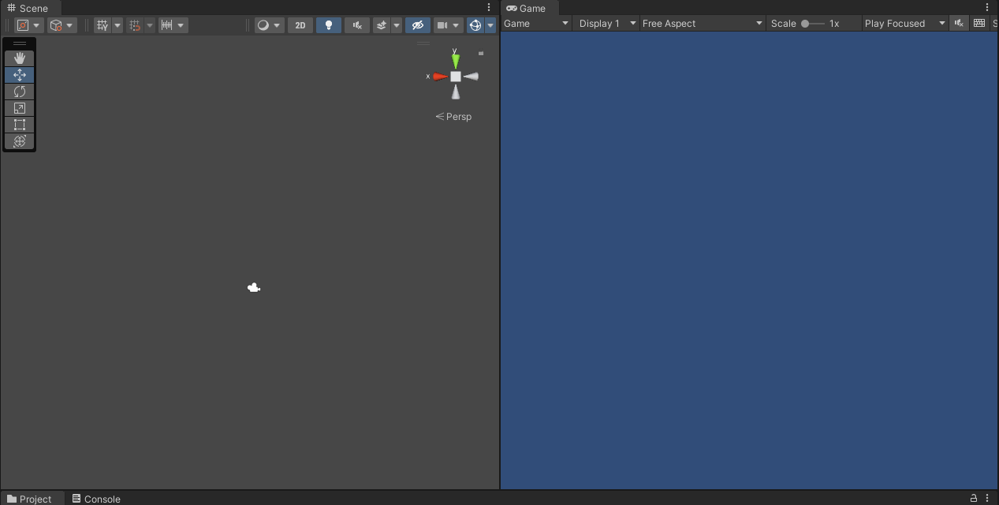
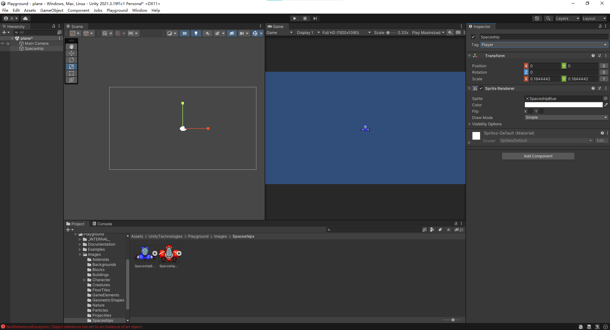
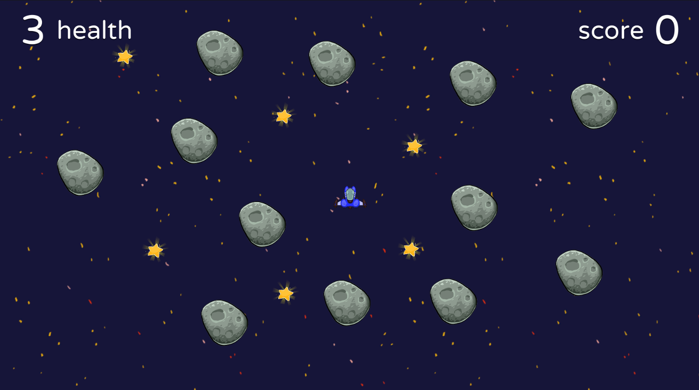

在上次的介绍中，我们对Unity的布局局面有了大致认识，了解了各类工具的使用，所有现在我们直接通过实战进行熟悉，并且不会涉及到代码编写，脚本相关从本系列第三篇博客中记录。

<!--more-->

要通过Unity的基本操作制作简单游戏，方法是使用Unity Playground，其中Unity提供了一系列可以直接使用的组件，预设了开发环境，是官方提供的熟悉基本操作的教程。具体的导入方法在前一节中已经介绍了，直接打开之前用到的项目即可。

# 制作一个小游戏

## 1 新建场景

在Hierarchy或者Project/Assets/Scene中，都可以进行新场景的创建，一个场景包含很多游戏对象，游戏中可以切换不同的游戏场景，起始就是切换到了另外一个场景。在Hierarchy中右键已有场景，选择Add New Scene；在Project中，直接右键选择Create，然后再选择Scene选项卡。

创建完成后，可以看到已经包含了一个主摄像机，而且由于创建的是2D项目，因此Scene视图中已经安排好了位置，这一节暂时不用移动摄像机了。

## 2 创建玩家对象

我们之前导入了Play Ground，这里用到的所有的资源也都是来自Play Ground。在2D游戏中，角色通常由一系列图片作为资源构成，角色的动作通过播放图片，即关键帧来实现。我们先打开Assets/UnityTechnologies/Playground/Image文件夹，看到有许多分类的图片资源，现在选中太空船(Spaceships)文件夹，任选一个飞船图片作为玩家对象。选中该图片，拖拽到Hierarchy或者Scene中，即可添加对象。

添加完成后，可以设置下游戏窗口尺寸为Full HD（1980*1080），然后利用缩放工具，将飞船缩放到合适的大小。接着设置属性，按照以下顺序：

* 修改名称（方便自己找即可）；
* 修改tag为Player；

其中，Tag的修改比较重要，Tag作为对象标签，可以将游戏对象分为不同类，方便在编写逻辑脚本的时候让脚本只针对某一类对象生效，从而方便脚本获取对象。标签是自定义的，在项目管理中更改，这里Playground由于是教程，已经导入了标签分类，所以不用我们手动修改了。

接下来为了让飞船能够动起来，就需要用到脚本了。Unity的脚本使用C#语言进行编写，功能就是控制某个游戏对象与玩家、游戏对象和游戏对象之间的交互。同样Unity提供了编写好的脚本，我们直接使用即可，后面的教程中会详细说明脚本如何编写。

脚本可以通过两种方式添加：

* 在Assets中，找到Scripts文件夹（和Image文件夹同级），然后进入Movement文件夹，选中Move文件，拖拽到飞船的Inspector窗口中即可；
* 点击Inspector窗口中下方的Add Component，然后搜索Move，点击Move with Arrows；

添加完成后，看到飞船的属性窗口多了两个选项卡，Rigidbody 2D和刚才添加的脚本，前者是2D下的刚体组件，通过脚本可以进一步赋予飞船重力控制和碰撞检测等效果，将对象和物理引擎挂接，默认情况下如果直接运行，飞船会受到重力往下掉出屏幕。我们进一步调整其中的物理选项：

* Mass：质量
* Friction：表面摩擦力
* Angular Friction：旋转摩擦力：
* Gravity：重力

将重力设置成0，摩擦力设置成5即可。另外，脚本组件中会直接显示脚本的接口，可以方便地进行调整。这里编写好的脚本提供了多种接口，我们调整下飞船的Type of Control、Speed，不好理解的是Orient to Direction，意思是让飞船随着方向键转向，打勾即可。

现在，飞船已经可以通过方向键控制进行移动了。

## 3 添加碰撞物体

设置两种物体供游玩：

* 小星星：奖励碰撞；
* 小行星：惩罚碰撞；

### 3.1 添加小行星

找到Image下的Asteroids文件夹，选中一个小行星图片，添加到场景中，缩放到合适大小。和前面一样，这里暂时不添加Tag（为什么？），直接添加脚本组件Modify Health，添加后会显示当前脚本与Collider组件关联，并且需要选择碰撞检测的类型，分别是Polygon/Rectangle/Circle，选择第一个（多边形），适合我们这样形状不规则的物体。此时添加了两个组件：脚本组件和Polygon Collider 2D，要将后者选项卡中的Is Trigger取消，意思是是否让该对象仅作为触发器而不具有物理属性，显然这个选项适合检测其他对象是否进入这个区域。而我们要做的小行星就不必了，他应该具有物理属性。另外，飞船同样应该具备碰撞检测，因此也要手动添加Polygon Collider 2D组件。

因此再手动添加Rigidbody 2D组件，然后设置重力为0，旋转阻力为0.5，摩擦力为5，质量为10（可以看看其他数值效果如何）。

### 3.2 添加小星星

小星星是奖励玩家的碰撞对象，并且严格来说并不需要具备碰撞检测的能力，而是进行区域的检测，当飞船模型和小星星模型有重叠时，让小星星自动消失，飞船并不会受到撞击，而是分数加一。在Project中找到对应的小星星图片Image/GameElements/Star，拖进Hierarchy中，缩放到合适大小，然后添加组件：

* Polygon Collider 2D并勾选Is Trigger；
* Collectable脚本：已编写好的脚本，当标签为玩家的对象触碰到这个对象时，奖励玩家积分。

## 4 添加UI界面

用户界面显示了飞船血量、分数，在Unity中，UI是作为预制件存在的，这里也略过制作过程，直接在Project中搜索对应资源UserInterface，将文件类型为预制件（Prefab Asset）的文件拖拽进入Hierarchy中，在Game视图中就会显示UI了，在Scene中并不显示。

为了让UI上的数字和游戏绑定，需要再次借助脚本，刚才我们添加了碰撞检测，但是并没有规定飞船怎么扣血，所以除了给小行星添加扣除血量的脚本外，飞船同样要添加检测和记录生命值的系统Health System。

预制件（Prefabs）：Unity 的预制件系统允许创建、配置和存储游戏对象及其所有组件、属性值和子游戏对象作为可重用资源。预制件资源充当模板，在此模板的基础之上可以在场景中创建新的预制件实例。也就是说，所有东西都可被保存成预制件，作为模板方便反复使用。

现在由于小行星制作完成，后面还需要放置很多个相同的小行星，所以我们直接将Hierarchy中的小行星拖动到Prefabs文件夹中即可保存。为了方便管理，我们在这个文件夹中进一步分类，创建一个新的文件夹，然后再拖进来。拖进来以后，可以发现原来在Hierarchy中小行星左侧空的立方体图标变成蓝色实体了，同时Inspector窗口中也显示了Prefab属性。

小星星同样可以用预制件保存。为了方便管理，可以创建一个空的游戏对象作为相同预制件的父对象，相当于新建了一个文件夹，这样以来可以通过点击空的游戏对象选中所有的相同预制件。不过要注意，当我们将一个对象列为子对象后，这个子对象Inspector窗口中的position属性实际上变成了相对位置，而不再以世界坐标系的原点作为(0,0,0)。

如果想要这些子对象依然使用世界坐标系，那么可以将父对象的坐标移动到(0,0,0)。

## 5 添加背景

前面制作了基本玩法，现在添加一个宇宙的背景，找到Image/BackGrounds文件夹，选中BG_Space图片并拖动到Hierarchy中。然后修改Sprite Renderer（精灵渲染器）：

* Draw Mode改为Tiled；
* Sorting Layer改为Background；
* 缩放到合适大小，遮盖整个背景；

这样以来我们的第一个简单小游戏就制作完成了，其实可以发现，如果熟练使用Unity之后，用这些资源五分钟就能做出来这样一个游戏，可见游戏引擎确实极大地方便了开发。
