前面的博客中我们熟悉了Unity界面的布局和使用，并没有介绍怎么让Unity和脚本/IDE进行挂接，从现在开始我们进一步学习Unity，仅导入非编程资源构建一个2D的项目，包括代码的调试方法，角色的基本移动脚本，Tilemap如何使用。默认你拥有面向对象基础，方便开展接下来的学习任务。

<!--more-->

# 准备工作

为了方便学习，我们暂时先进行一些准备工作，首先确保我们正确设置了IDE，要了解如何用IDE对Unity的脚本进行开发和调试；然后是Unity序列化的介绍，这个工具能帮助我们在Unity中直接查看并调整脚本对游戏对象的某些设置，对素材导入也有帮助；最后是素材的准备，对个人来说这通常是最头疼的部分。

## 设置Unity的IDE

C#开发的话采用vscode和visual studio都可以，不够后者更值得推荐 ，它集成了多种IDE功能，并且基本不用进行多余的设置就可以和Unity挂接成功，包括debug、项目对接、成员查找等，适合初学者使用，因此我这里直接采用后者。

Unity对visual studio支持比较完善，首先要使用vs进行C#开发，需要在vs的安装选项中选择安装桌面开发模块(.NET)，相当于Java必备的虚拟机，让C#程序有一个运行的环境支持，同时也新增了C#语言的识别工具，方便了开发，但这只是一个推荐的可选项；Unity游戏开发模块则是必选的模块，它提供了与Unity挂接的接口和编译器等C#运行环境。

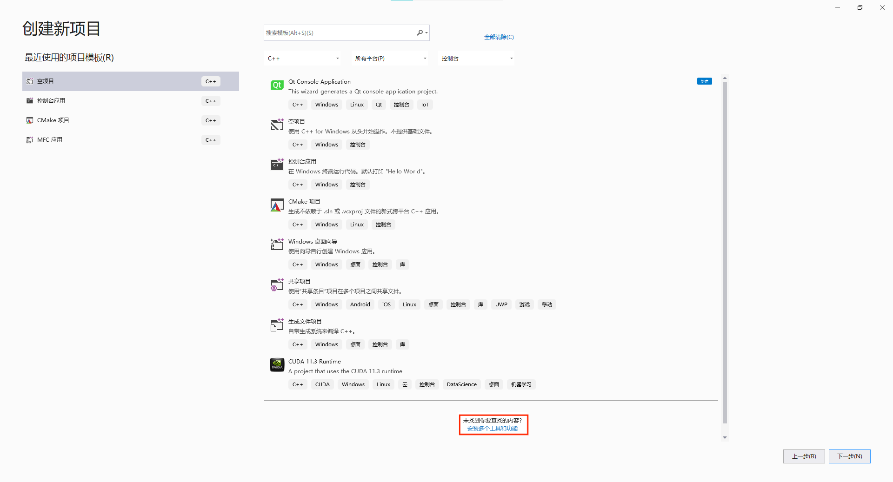

以vs2019社区版为例，安装可以在新建项目窗口找到，点击后确认安装的模块并安装即可。如果仅使用Unity进行C#的开发，可以不选择.NET，Unity仍然在使用mono作为编译环境，点击“使用Unity的游戏开发”可以发现简介中提到已经包含了C#的编译器。

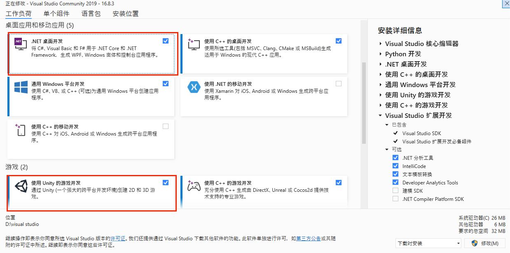

下载完成后，打开Unity，找到Edit/Preferences/ExternalTools，点击External Script Editor，选中已经存在的vs即可。

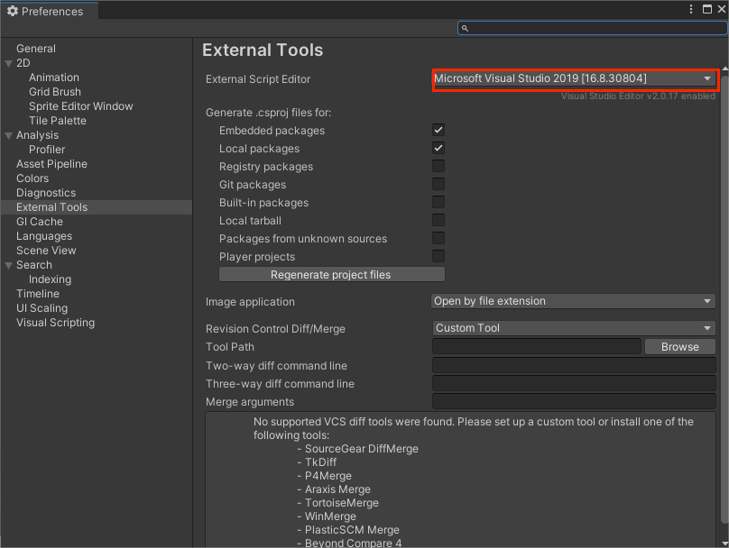

你可以打开之前的项目或者试着创建脚本，查看是否跳转成功。

接下来我们尝试调试一个脚本，随便创建一个空对象，然后添加新的脚本：

```c#
using System.Collections;
using System.Collections.Generic;
using UnityEngine;

public class MainPlayer
{

    public string myName;
    public int strength;
    public int health;
    // Start is called before the first frame update
    void Start()
    {
        Debug.Log("我的名字是：" + myName);
        Debug.Log(strength);
        Debug.Log(health);
        Debug.Log(Add(3,5,6)); 
    }

    public int Add(int x, int y, int z)
    {
        return x + y + z;
    }
}
```

然后添加断点，选择附加到Unity

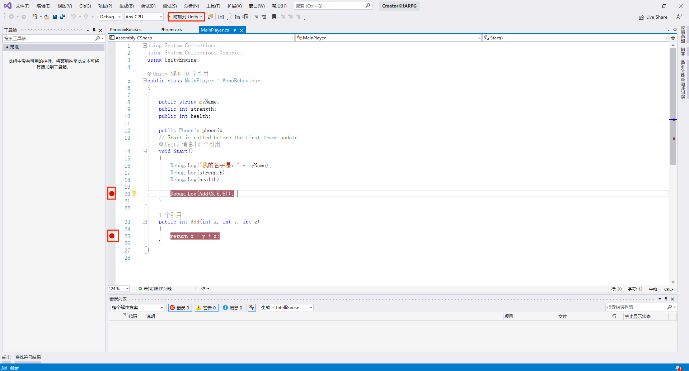

接着在Game视图中运行场景，经过调用后Unity自动会跳转到vs的调试界面，就可以和正常程序一样查看变量并且调试了。

## Unity序列化

序列化指的是，从程序运行的内存中，将指定对象转换为二进制流（数据），为传输（可能是输出到硬盘文件、或传输给网络上其他电脑）做准备的过程。这点和Unity脚本的序列化不同，后者主要说的就是能不能在Inspector窗口中查看对应脚本给游戏对象设置的属性，类等成员；而Unity也具备文件序列化的功能，方便资源读取等操作，这个我们暂且不说，导入素材的时候也许会用到。

首先对于游戏对象的脚本中，通常会定义一个主类来设置对象的属性、方法等，而属性一般以成员变量的形式呈现，我们知道成员变量需要被访问指定词限制，public的成员变量可以直接被挂接到Unity的Inspector窗口中，而private、protect修饰的成员变量并不被展示。但是有的时候又想让这些变量出现在窗口中方便更改，就可以在其定义前面添加[UnityEngine.SerializeField]，从而序列化一个私有域。

我们在Unity的脚本开发中，除了给游戏对象创建的类外，可能会有一些自定义类存在，方便在游戏对象对应的主类中进行调用。它和我们为游戏对象直接添加的脚本中类的区别是，Unity添加的类继承了一个父类MonoBehavior，这个基类为Unity提供将脚本和对象挂接的接口，也让子类能够被自动序列化，但是自定义类不同，它并没有从这个类派生出去，所以不会被Unity序列化。为了在Inspector窗口中也能对这些类进行修改，就需要在这些类的定义之前加上序列化标签：[System.Serializable]。

关于序列化暂且简单记录到这里，贴一个链接方便深入[学习](https://www.cnblogs.com/zhaoqingqing/p/3995304.html)。

## 素材准备

新建一个2D模板项目，导入Unity资产：[RubyAdventure](https://assetstore.unity.com/packages/2d/2d-beginner-tutorial-resources-140167?_ga=2.134705203.331241089.1633678521-522971275.1624332126)。


这是一个仅拥有游戏素材的Unity资产，它提供了我们接下来要制作的游戏的所有材料，例如图片、关键帧动画、音效等，而完全没有已经编写的脚本、预制件等内容，因此，所有关于Unity的内容我们都将从零开始。

这个项目包括的内容有：

* 2D素材的导入和使用；
* 角色控制系统；
* TileMap使用；
* 设置动态Sprite；
* 入门粒子系统；

# 角色控制

2D素材我们已经准备好了，具体如何使用这些五花八门的素材，将在使用到某个素材的时候结合操作进行介绍。现在作为脚本的入门，我们先选择一个简单的角色移动控制系统来引入。

2D角色的控制很简单，它通常由两部分构成：移动和动画播放。也就是说，我们创建的角色将在播放动画的同时进行移动，从而完成游戏中移动的效果。现在我们尝试制作角色移动的脚本，将上面这个主角的图片添加到Art/Sprite中，然后再次添加到层级栏中，这样就创建了主角的游戏对象。

然后我们给这个主角对象添加一个新的脚本：RubyController，并将自动创建的脚本拖动到Assets/Scripts文件夹中方便管理。

新建的脚本中给出了一个继承自MonoBehaviour的类RubyController，并且已经创建了两个基本方法：Start和Update。前者在游戏开始前自动调用一次，后者将会在每一帧进行一次调用。

就目前来看，并不需要Start方法，因此可以暂时删除它。为了让角色移动，我们需要调用Unity提供的两个基本类：Input和Transform，前者接受键盘鼠标的输入，后者记录当前游戏对象的位置状态。这样一来我们要做的事情就很明显了，你可能想到，我们使用Input接受键盘按键，再编写一个Move函数，每次接受到信号时，更改Transform即可。Input类还在ProjectSetting中提供了InputManager，将枚举的类型值绑定到自定义按键上，用GetAxis方法接受枚举值；当然你也可以直接用GetKey等一系列方法直接获取按键信息。

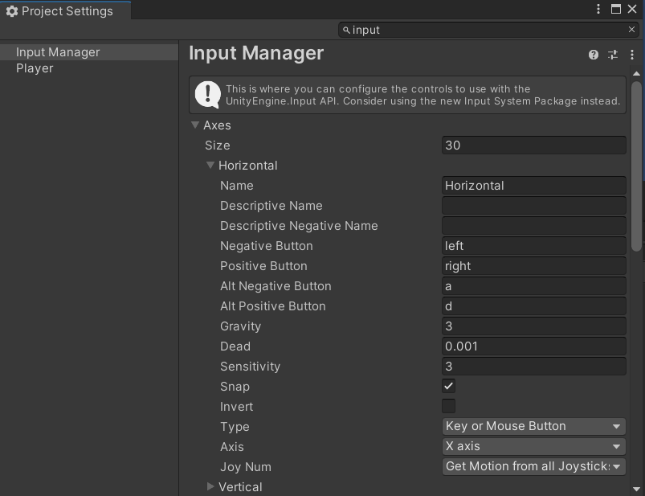

事实上我们也是这样做的，只不过其中有一个问题值得讨论：如何控制游戏帧数和移动速度？

一台高配置的PC可能会具有800帧/秒的性能，如果这个位移量为常量，它将导致极快的移动速度；但是在另一台只有10帧/秒的PC上角色将移动得很慢，并且明显能感受到0.1s的延迟。为了解决这个问题，我们需要根据帧数调整移动量，帧数通过Unity提供的基本类Time中的deltaTime获取，它记录了每帧间隔的时间，为了保持一致的移动速度，我们像下面这样进行编写：

```C#
void Update()
    {
    	//Input类接受键盘输入，在Unity设置中修改对应按键
        float horizontal = Input.GetAxis("Horizontal");
        float vertical = Input.GetAxis("Vertical");
    	//获取当前对象位置
        Vector2 position = transform.position;
    	//根据帧数设置移动速度
        position.x = position.x + speed * horizontal * Time.deltaTime;
        position.y = position.y + speed * vertical * Time.deltaTime;
        transform.position = position;
    }
```

现在我们设置了以时间为单位的移动速度，它通过deltaTime平衡了不同帧数的影响，800帧时每帧移动量为原本的1/800，10帧时移动原本的1/10，因此每秒移动的距离是相等的。

启用这个脚本以后，我们的角色已经可以移动了，不过由于缺少动画，它显得很奇怪。

# TileMap

除了角色外，另一个重要的内容是场景是如何进行绘制的。显然在我们前面做的飞机小游戏中，背景就是一张图片，我们向其中添加了一些陨石图片并加上各种组件，使得陨石可以进行交互。

而在很多2D游戏中，显然不可能直接用一张图片作为背景就结束场景制作，因为需要设计可交互的场景例如地板、门等东西，尤其是像素游戏中，可以观察到地图并不是一整个图片，而是一格一格的，这其实就是TileMap，利用它可以通过一张美术资源素材图片就设计出大片的地图，下面我们具体看看如何操作。

## 将美术素材转化为Sprite

在Unity中，对图片的操作可以使用Sprite完成，这是Unity处理纹理的容器，很像一个有很多方法的实例化对象，可以将任意图片通过Sprite处理。

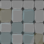

这就是我们要用到的素材，直接将图片保存到当前文件夹中自定义的地方即可，可以将其保存到Sprite中。在Unity中选中这个图片，就会发现右边的Inspector窗口中已经显示了Texture Type为Sprite(2D and UI)。

## 创建TileMap

有了素材以后，不能直接使用TileMap功能，因为它是作为一个游戏对象存在的，在层级栏中创建TileMap后才能使用它的功能。

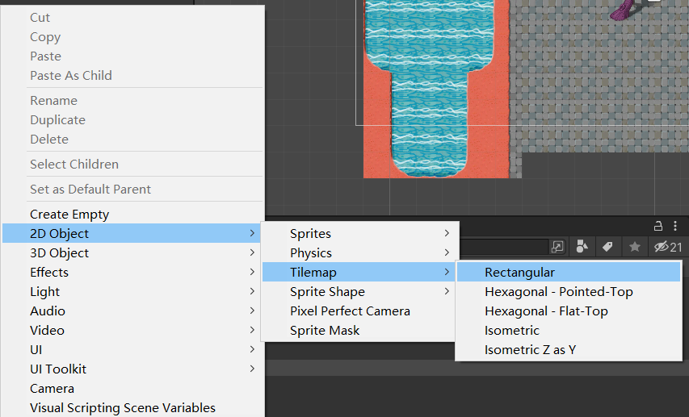

这里创建的是矩形的，这个选项卡中都是说的TileMap形状，学会矩形的就可以了，如果后面需要的话可以自行了解，都差不多。创建以后会发现，TileMap还连带创建了一个父对象Grid，都有各自对应的组件，现在也暂时不需要修改，就是一些所在平面等设置。

## 使用Sprite Editor和PPU处理美术素材

这时我们可以介绍一下Environment中那些奇怪的图片了，它们看起来毫无关联，并且上面的内容也看不出来，但其实它们是用来制作地图的。具体来说，这些图片是一个九宫格图片，其中每一个都是地图上的一块，例如看起来最明显的那一张：

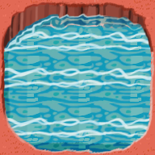

分成九宫格以后，我们可以通过后面的方法让左上角的这个格子图片只出现在拐弯的地方，从而不受限与这个图片的大小，而是制作一个足够面积、任意形状的水池：

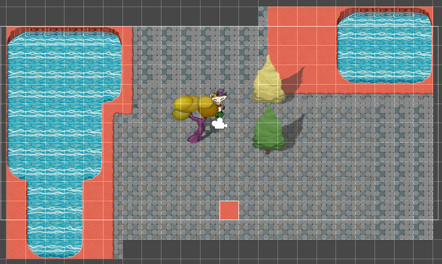

这样看就很清楚了，这里美术素材很大程度上节省了画师的时间，同时我们对资源读取的要求也只是那一张图片。选中需要分割的图片，在Inspector窗口中，修改Sprite Mode为Multiple，代表这个素材中含有多个小的素材；将Pixels Per Unit修改为64；打开Sprite Editor，点开Slice选项卡，选择Grid By Cell Count，表示用网格数进行均等划分，这里自然就是3*3，点击slice，点击右上角Apply，然后保存修改。

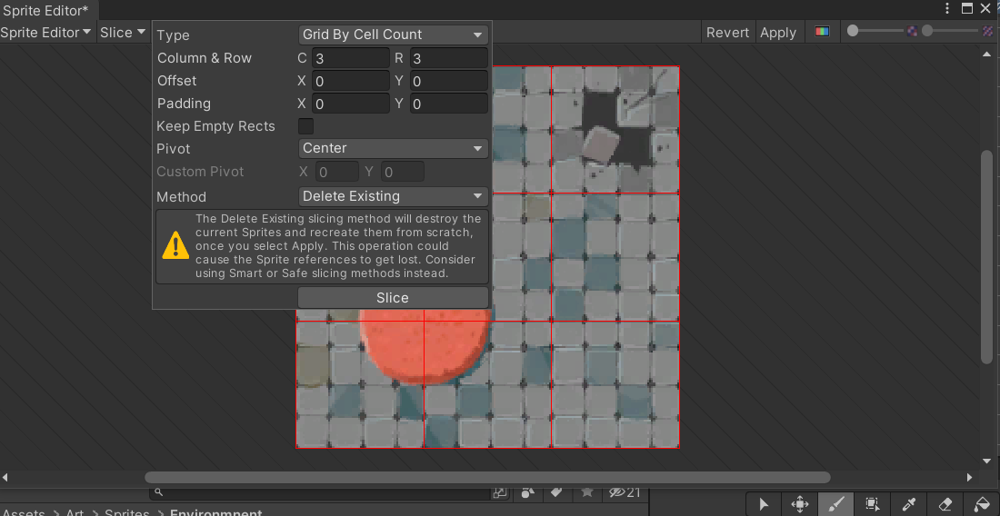

这样就划分好一个素材了。而刚才的砖块图片则不需要进行分割，因为它不需要变化，所有地方都一样。

除此之外，还要将这些图片的Sprite属性Pixels Per Unit全部改成64，默认情况下图片读取进来都是100，100*100个像素/单位，接下来我们简称这个值为PPU。

为了解这个值的用法，首先要明白什么是一个单位，在Unity中不论2D还是3D都有摄像机Camera，其中有一个属性是size，解释为摄像机视图的垂直大小，代表摄像机能看到场景的竖直长度为几个单位。这里默认的是5，也就是说摄像机能看到上下各五个网格，总共是十个网格的长度，那么这里一个网格就是一个单位。

既然摄像机上下的尺寸可以通过size确定，那么左右呢？答案是修改size的同时也修改了左右尺寸，因为在Unity中确定了上下尺寸后，根据屏幕横纵比同时也能确定左右尺寸，例如屏幕是9:16的，又知道前面设置size为5，那么左右尺寸就应该是$16/9*5*2=160/9$个单位。

因此PPU的用处就是用来根据图片本来的尺寸计算一个单位应该给多少像素，原来图片的像素肯定是不改变的，如果一个图片是$192*192$的，那么将PPU设置成192后就能将这个图片放到一个格子中；将PPU设置成64就需要9个格子来放这个图片，因为$192=64*3$，宽高都需要三个格子，也就是九个格子。

而我们这里之所以划分成九宫格也是这个原因，Brick图片是$64*64$的，刚好一个格子；需要分割的图片则是$192*192$的，所以划分一下。

最后，某些情况下素材可能需要进一步调整才能符合需要，例如将一个图片调整到刚好覆盖整个摄像机视图，那么就需要根据图片的尺寸来设计size、PPU，从而达到理想的效果。

## 使用Tile Palette绘制场景

得到切分好的素材后，怎么将它绘制到场景中就是最后的问题了。调色板就是用来做这个的，首先在Scene视图的右上角找到一个紫色的按钮，点击后打开Tile Palette，此时其中是空的，我们需要点击Create New Palette自行创建一个调色板，并将其文件保存在Tiles/Palette中。

接着在Tiles/RuleTiles中创建一个新的RuleTile，选中，修改其中的Default Sprite为刚才处理好的素材，以不需要分割的Brick为例。设置完成后将这个RuleTile拖拽到Palette中，就完成了素材的添加。到这里就可以使用Brush工具选中这个素材，然后在场景中绘制了。

当然这是最简单的情况，我们之前对后面六个图都进行了分割，应该如何使用？答案和之前是一样的，只不过拖进去后可以发现现在可以任意选中其中某一块九宫格进行绘制。

但是显然我们创建的RuleTile还有更好的功能，Unity支持使用编程的方式定义Tile排布方式。这里先不介绍，我们使用另一种简单一些的方式实现自动的排布。

重新创建一个RuleTile，点击+号添加需要进行排布关联数量，并点击select添加图片：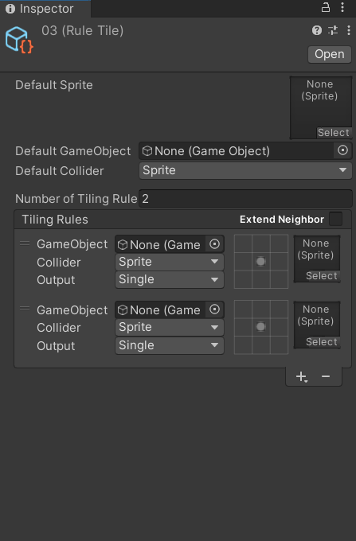

依次添加之前分割好的图片(自动以编号顺延的方式命名)，在九宫格中确定排布，勾代表这个图片的这个相对位置可以有图片，叉代表不可以，从而完成排布安排。

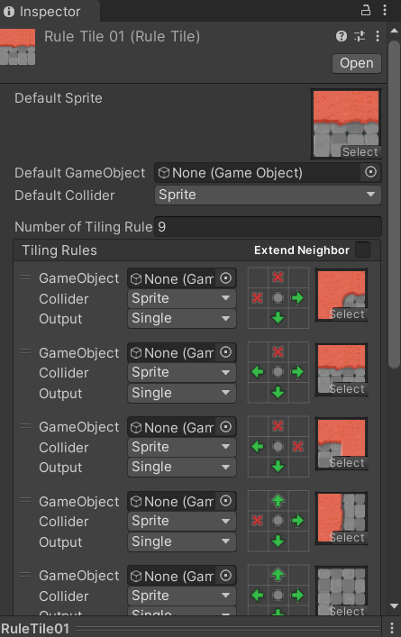

其中整个TileMap的Default Sprite可以用任意一个方便分辨的图片，因为最后是以一个格子的形式存放在Palette中的。制作完成后将这个拖动到Palette中，可以发现此时已经会自动变换图边了。

另外还有一个Rule Override Tile，就是类的继承，同样在Tiles选项卡中创建，选中，在Tile属性中设置为要继承的基Tile，然后就会发现只需要添加图片就可以得到和刚才一样的效果了。

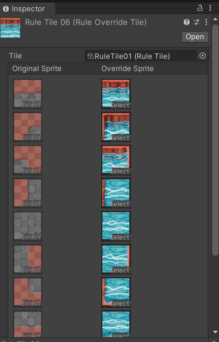

最后，如果要在Palette中调整Tile的位置等操作，注意要选中edit按钮，才能修改当前的Palette，否则不会发生改变。

## 调整图片排序

人物不能在背景之后，也就是说背景应该在最下面的图层。这通过修改order in layer实现，在TileMap的Inspector窗口中找到Tilemap Renderer，选择Additional settings中的order in layer，修改为-10，这样即使在同一层，背景的优先级也很小，也就是说这个值越大越会被排在前面。

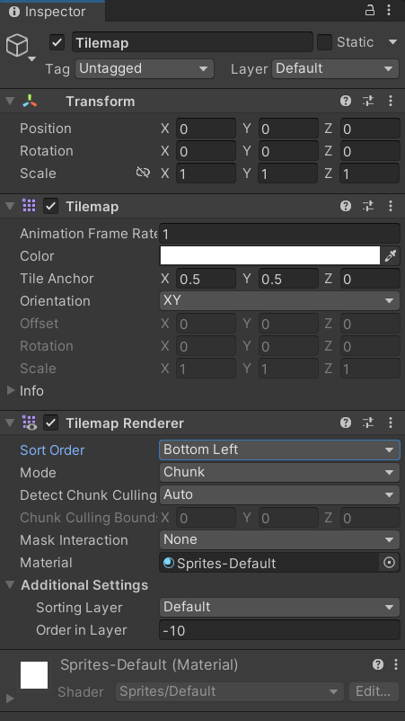

而对于一些景物需要存在遮盖关系，这个关系当然会随着人物移动而改变，这可以通过伪透视图实现，在Edit > Project Settings > Graphics > Camera Settings > Transparency Sort Mode = Custom Axis > Transparency Sort Axis x = 0 / y = 1 / z = 0进行设置，表示用y轴的大小作为伪透视的标准，这样一来在我们创建的地图上，走在上面的就会被遮盖，越往下越靠近屏幕，这就是伪透视。

现在我们将素材tree拖进场景中，启动游戏，却发现每次经过树高一半的时候树就被人物遮挡了，我们希望的是人物走到树根的时候再改变遮蔽关系，因此需要再次打开sprite editor，调整pivot为bottom center即可。pivot就是图片的支点，调整以后就可以让人物走到树根再遮挡树了。

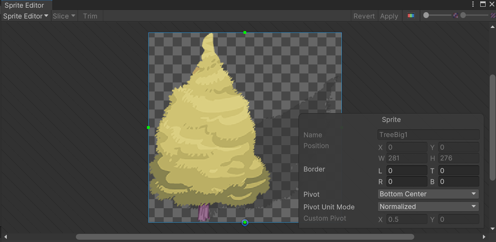

但是如果直接运行游戏会发现并没有得到理想的效果，这是因为我们默认的比较方式是用图片的center位置比较，要pivot生效需要进行两个设置：

* 在Scene视图左上角点击Toggle Handle Position，并选择Pivot；
* 在游戏对象的Sprite Renderer中将Sprite Sort Point选择为Pivot；

默认的都是center选项，这样以后就可以用自己定义的pivot位置实现透视效果了。
