这篇博客我们继续学习2D游戏制作，上一节中学习了怎么调试代码，角色的基本控制等，这一节我们会进一步学习2D的碰撞检测，触发器的使用，2D的Animator。

<!--more-->

# 碰撞检测

前面的学习中我们已经构建了基本的游戏场景，设定了伪透视等视觉效果，现在开始逐步添加场景和角色的交互。

## 物体碰撞检测的处理

首先我们以游戏素材中的保险箱为例来说明如何让场景中的某些物体能够阻挡角色。首先不管是什么操作，我们将角色制作成预制件，保存到Prefabs文件夹中，然后选中，添加Rigidbody 2D和Box Collider 2D两个组件，修改刚体组件中的Gravity scale为0防止角色直接下落。

然后进一步修改Box Collider的包围盒，仅让人物的下半身进行碰撞检测，从而满足伪透视的效果：

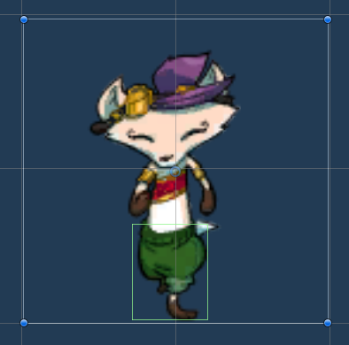

同样的，将需要检测碰撞的物体添加Box Collider 2D，设置碰撞区域保证伪透视效果。注意保险箱不需要添加Rigidbody 2D，因为我们不需要让它实现碰撞效果，碰撞后不用改变位置，所以没有必要，只需要作为一个检测碰撞的区域存在，告知人物不能进入即可。

现在添加完成后运行游戏，发现几个问题：

* 人物碰撞后会旋转；
* 人物碰撞时会抖动；

旋转很好解决，在人物的Rigidbody 2D中，找到Constrains选项卡，勾选Freeze Rotation z，表示人物不能以z轴为中心旋转，这样就没问题了。

关键是第二个问题，人物抖动是因为角色移动的脚本逻辑是先移动，然后检测碰撞，退出碰撞区域，所以帧数调高的时候人物就一直重复这个进入-退出的过程，从而看起来是在抖动。本质在于我们之前的脚本使用的是Transformer组件控制移动，要进行两点改动才能让角色碰到碰撞区域时停止：

* 在FixedUpdate方法中进行移动操作，原来的update函数仅获取键盘输入；
* 不再修改Transformer组件的位置参数进行移动，而是获得并修改rigidbody2D组件的position成员变量；

完成后运行程序，发现问题解决了。

```C++
public class RubyController : MonoBehaviour
{
    Rigidbody2D rigidbody2D;
    float horizontal;
    float vertical;

    private void Start()
    {
        //获取当前游戏对象的组件
        rigidbody2D = GetComponent<Rigidbody2D>();
    }
    // Start is called before the first frame update
    public float speed = 0.1f;
    // 每帧调用一次 Update
    void Update()
    {
        horizontal = Input.GetAxis("Horizontal");
        vertical = Input.GetAxis("Vertical");
    }

    private void FixedUpdate()
    {
        Vector2 position = transform.position;
        position.x = position.x + speed * horizontal * Time.deltaTime;
        position.y = position.y + speed * vertical * Time.deltaTime;
        rigidbody2D.position = position;
    }
}
```

之所以不在FixedUpdate中直接获取输入信息，是因为这个函数调用的频率较低，默认50次/秒，显然低于我们设定的update，这样比较流畅，除非设备不能达到50帧/秒。

FixedUpdate的默认调用次数可以在项目设置中修改，50次就是间隔0.02s调用一次：

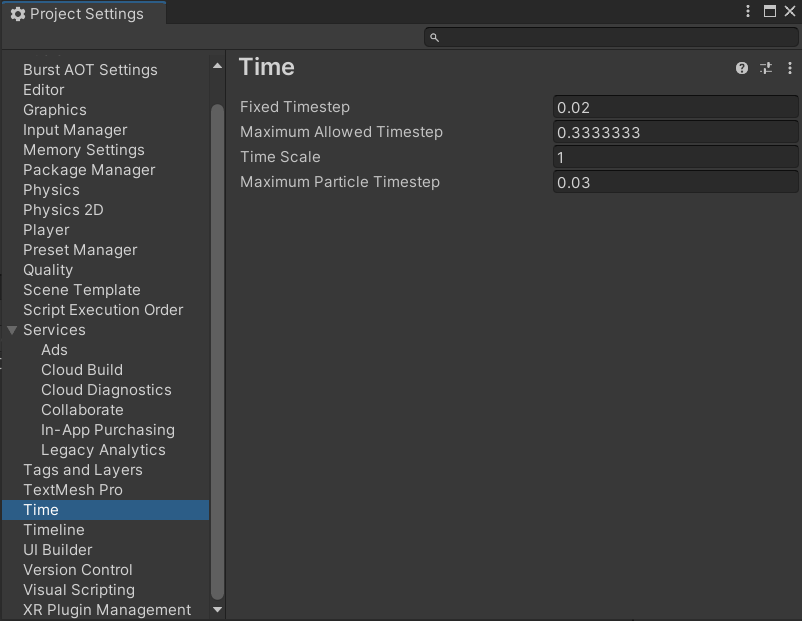

## Tilemap碰撞检测的处理

Tilemap作为一个游戏对象显然也可以添加组件，但是它并不使用刚才的碰撞组件，而是要添加Tilemap Collider 2D。添加后所有的Grid都自行添加了碰撞检测，检测边界就是网格，当然对一些不想产生碰撞的Tile，可以在它的Inspector窗口中设置Collider Type为None，默认的Sprite就是将图片的四个边当成碰撞区域。

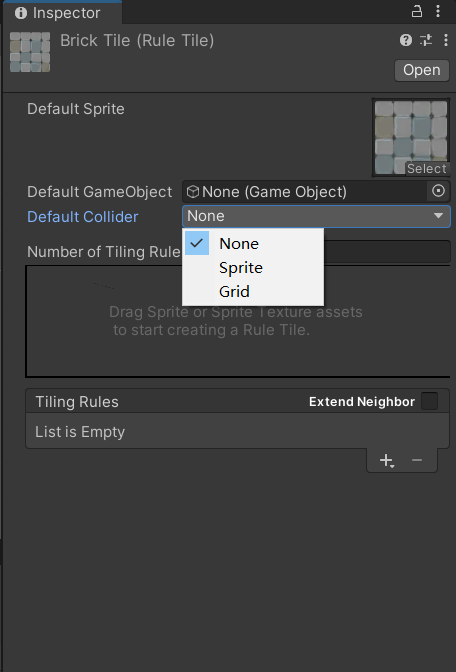

普通的Tile可以这样设置，我们之前用到的RuleTile也差不多，看起来更直观一点。

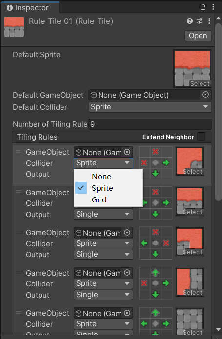

而且override的RuleTile会继承基类的collider，这点要注意。可以使用Advanced override RuleTile

## 优化碰撞体

由于我们给很多方格都添加了碰撞体组件，因此产生了庞大的计算量，为了缩小这个计算量我们可以将这些碰撞体通过Composite Collider 2D构建一个整体的碰撞体，这个组件可以获取对象及子对象的所有碰撞体。

同样给Tilemap添加这个组件，发现还自动添加了2D刚体组件，然后在Tilemap Collider 2D组件中勾选Used by Composite，然后设置刚体组件中的Body Type为static，即静止不动。

这样就完成了优化。

# 触发器

游戏中会有很多可交互对象，角色走到这个物品上就表示“吃到”这个物品，从而发生一些效果。这就要用到触发器了，前面我们已经接触过这个概念，它是碰撞体组件中的一个可选项，勾选以后碰撞体将仅检测是否进入区域而不进行碰撞效果的约束。下面我们以血瓶为例创建一个生命系统和可交互的血瓶物品。

## 生命系统

在RubyController中添加两个变量分别表示当前生命值和总生命值，添加一个方法接受参数amount并恢复等量生命：

```C#
//生命值
    public int max_health = 5;
    private int cur_health;

void change_health(int amount)
{
        cur_health = Mathf.Clamp(cur_health + amount, 0, max_health);
        Debug.Log("当前生命值：" + cur_health + "/" + max_health);
}
```

## 添加触发器

现在逻辑就很清除，触碰血瓶的时候触发器生效，调用上面的方法，就实现了恢复效果。而要给血瓶添加的组件就是碰撞器Collider，并勾选Is Trigger。Unity为触发器检测提供的事件方法是OnTriggerEnter2D(Collider2D other)，该方法在每次检测到碰撞的时候被调用，往其中添加我们编写的方法就可以调用了，因此还要添加一个脚本调用这个事件方法。

最后，除法事件以后还要让组件消失，调用父类Object的方法destroy即可，其中参数为gameObject，是当前的游戏对象。

```C#
public class HealthCollectible : MonoBehaviour
{
    public int amount = 1;
    private void OnTriggerEnter2D(Collider2D collision)
    {
        Debug.Log($"发生碰撞的物体是：{collision}");
        RubyController r = collision.GetComponent<RubyController>();
        if(r != null)
        {
            if(r.cur_health >= r.max_health) return;
            r.change_health(amount);
            Destroy(gameObject);
        }
    }
}
```

运行后发现已经完成了血瓶系统。代码中还给出了根据组件获取对应游戏对象的方法，利用GetComponent<>泛型，可以返回对象，进而赋值给需要的实例。

除了上面这个触发器事件外，Unity还给出其他与触发器交互的事件方法，上面这个事件是进入触发器范围的时候执行一次，下面我们制作一个尖刺区域来让角色持续扣血，就不能用Enter而是Stay了：

```C#
private void OnTriggerStay2D(Collider2D collision)
    {
        RubyController r = collision.GetComponent<RubyController>();
        if (r == null) return;
        r.change_health(amount);
        Debug.Log("当前生命值" + r.Cur_health + "/" + r.max_health);
    }
```

这样的话将在每次刷新的时候都进行一次判断，和FixedUpdate一致，因此角色掉血的速度会非常快，为了解决这个问题我们要认识一下RigidBody中的Sleeping Mode选项，三个子项的含义如下：

* Start Awake：初始时唤醒，也是默认选项；
* Start Asleep：初始睡眠，可以碰撞唤醒；
* Never Sleep：从不睡眠；

这里睡眠的意思就是是否检测刚体碰撞，因为有时某些物体不发生移动，就不会发生碰撞，没必要每帧计算一次，所以就可以先挂起这部分刚体，称为睡眠。默认情况下选项表示该物体是唤醒的，但是一段时间之后就会睡眠，因此如果让我们的角色一直站在这个区域上，一段时间后就会停止刷新消息了。

清除这个问题之后我们再解决人物掉血太快的问题，方法就是让角色受伤后短暂无敌，下面是要修改的脚本：

```C#
//无敌效果
public float timeInvincible = 2.0f;
private bool isInvincible;
private float invincibleTimer;

private void Start()
    {
        //其它...
    
        this.invincibleTimer = this.timeInvincible;
        this.isInvincible = false;

    }

void Update()
    {
        //其它...
    
        if(isInvincible == true)
        {
            invincibleTimer -= Time.deltaTime;
            if(invincibleTimer <= 0)
            {
                isInvincible = false;
            }
        }
    }

public void change_health(int amount)
    {
        if(amount < 0)
        {
            if(isInvincible == true)
            {
                return;
            }
            else
            {
                isInvincible = true;
                invincibleTimer = timeInvincible; 
            }
        }
    
        //其它...
    }
}
```

思路就是用全局变量作为状态依据，每帧计时器减少，当计时器归零的时候就是一次无敌结束，那么让无敌状态的变量重置为false，重置计时器，参与下一轮计时；用无敌状态变量作为依据判断要不要扣血，处于无敌状态直接返回，否则执行后面的操作。

个人感觉这里逻辑处理挺乱的，而且不够简洁，熟悉下脚本使用就行了，不必纠结。

要特别注意下Time.Deltatime这个东西，官方解释为上一帧到这一帧之间的时间间隔，我们又说Update和FixedUpdate调用的时间不一样，但是Time.deltatime会自动适应，也就是说不论什么函数中，这个值保证是两帧之间的时间间隔。

# Sprite进阶和动画

## 平铺Sprite

刚才我们用触发器实现了一个伤害区域，角色在区域内会每两秒损失一点生命值，但是如果我们想用多个Sprite伤害区域放到一起，手动操作的话太麻烦了，利用Sprite的平铺功能可以在缩放图像的同时进行区域的平铺，并且整个区域都具备我们刚才实现的逻辑。

* 取消目标对象的缩放值；
* Sprite Renderer中的Draw Mode更改为Tiled；
* 将目标对象使用的素材Sprite中的Sprite Mode/Mesh Type更改为Full Rect并Apply；

现在可以使用矩形工具进行平铺了，并且如果觉得对象大小不合适也可以再次缩放。

不过要注意，碰撞检测区域并不会随着我们拖动矩形工具而更改，因此要重新设置。

## Sprite动画

（这部分原本放在简单敌人制作完成后再进入，这里为了排版先说这个）

不管是敌人还是我们的角色，因为没有添加动画所以显得都很怪，现在我们来给他们添加上去。

首先选中敌人Robot，添加Animator组件，可以重新创建一个文件夹Animations，在其中存放动画相关的文件，注意本来也有一个Animations文件夹了，用于存储素材，这里再新建一个方便管理接下来要用的控制器。在该文件夹中创建AnimatorController，命名为Robot，然后在Robot预制件的Inspector窗口中修改Animator组件的Controller为这个Robot。

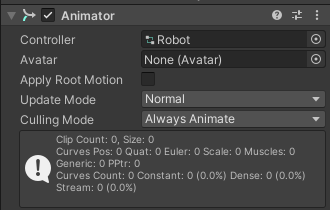

控制器创建好了，但是控制的动画还没创建好，可以想到二维的动画就是快速播放很多Sprite，这里提供的素材是每秒播放四张图片，我们先在Window中单机Animation/Animation打开动画窗口，然后选中一下Robot预制件，看到Animation窗口中出现Create字样，点击后看到可以创建anim文件，这就是动画切片，命名为RobotLeft。找到Art/Sprites/Characters/MrClockworkSheet，看到一系列图片，根据命名可知这些图片就是动画素材，称为关键帧，表示在某一帧播放这个图片就会让画面改变。

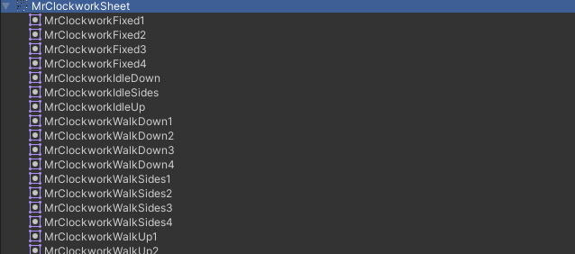

然后我们选中其中的WalkSides1到WalkSides4，拖拽进Animation窗口，就给RobotLeft这个动画切片创建好了素材。但是如果直接播放的话，会看到速度非常快，这是因为我们默认的Sample Rate是60，表示每秒采样60次，也就是每1/60s都会播放一个图片，这里我们有4个素材，将它改成4即可。

如果按钮找不到，点击动画窗口右上角的小点，勾选Show Sample Rate。

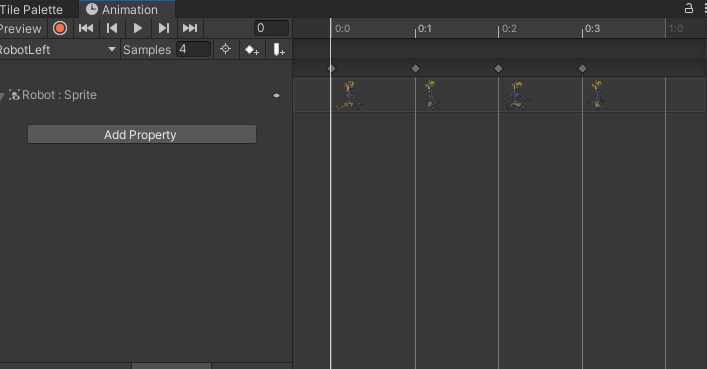

播放动画，看到了动画效果。

另外，在窗口中看到我们拖进来的四个图片依次排列在右边了，每个图片上面都有一个小点，这就是关键帧的标记，可以拖动这个标记来改变播放顺序；小点上面的数字表示进行到一秒的什么时候，0:0表示开始，往后都是1/4s，因为我们设置了Sample Rate为4。

我们现在要导入其中的walk素材，你可能会疑惑向右的图片在哪里，这里我们使用Unity的翻转功能，同样使用WalkSides，但是这里还要点击下面的Add Property，然后找到Flip x：

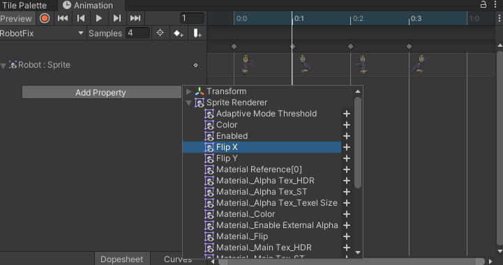

点击右边加号添加到其中，然后播放看看，就得到了向右走的Clip了。

## Animation Controller

现在有了切片，就可以使用我们前面创建的Controller了，找到Robot的Controller，点击open，或者直接在Window中打开Animator窗口：

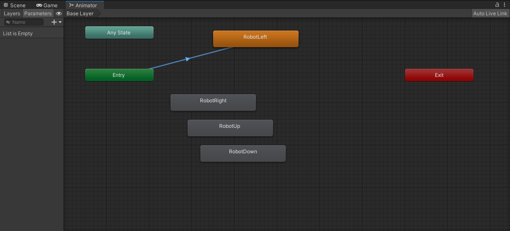

左侧是Layers窗口，用于3D管理，将动画用在角色的不同部分；Parameters控制变量，脚本可以用这个提供信息给Controller。

右侧就是动画状态机了，除了我们创建的Clip外还有三个状态：

* Entry：初始时；
* Any State：任何时候；
* Exit：退出时；

因此Entry指向向左的切片，那么游戏开始就会直接播放向左的动画。

为了让这些动画能相互转换，我们使用混合树进行管理，根据移动方向播放。

## 混合树

删除这四个状态，然后右键，Create State/From New Blend Tree，创建后双击Blend Tree进入该层，此时左侧发现Parameter中有一个Blend参数，将它删除后通过右上角的加号创建两个Float变量MoveX和MoveY，然后点击右侧窗口中的Blend Tree，更改Inspector中的Blend Type为2D Simple Directional，然后选择下面两个Parameter分别为刚才创建的两个变量。

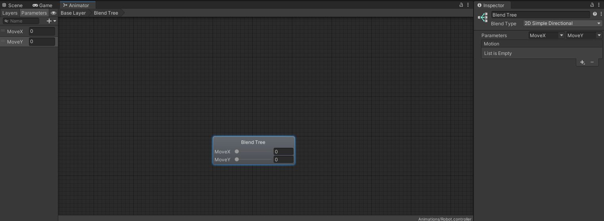

再点击变量下面的加号，Add Motion Field，添加四次，分别选择我们刚才创建的4个Clip，并修改它们的值为图中这样：

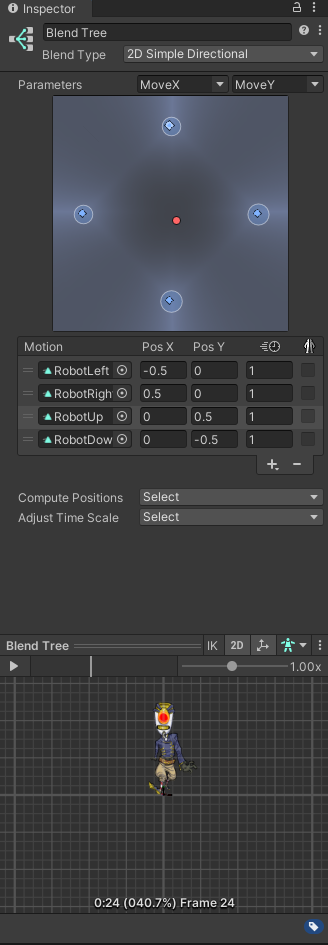

PosX和PosY分别表示此时方向，可以拖动上面的红点，会发现上下左右四个区域对应添加的四个片段，所谓的混合就是完成了动画的过渡，例如移动到右边的时候向右的动画程度更多，那就播放。在一维的时候解释更清除，不过我也先不解释了，动画应该专门的部分。

## 参数传递给Animator Controller

重新打开Robot的脚本，添加代码：

```
Animator animator;

//start()
animator = GetComponent<Animator>();

private void FixedUpdate()
    {
        Vector2 position = transform.position;
        if(vertical == true)
        {
            position.y += Time.deltaTime * speed * direction;
            animator.SetFloat("MoveX", 0);
            animator.SetFloat("MoveY", direction);
        }
        else
        {
            position.x += Time.deltaTime * speed * direction;
            animator.SetFloat("MoveX", direction);
            animator.SetFloat("MoveY", 0);
        }

        rigidbody.MovePosition(position);
    }
```

Animator作为Robot的一个组件，管理Robot的动画控制器，因此我们首先要获取这个组件，然后调用方法setFloat来给Controller中Blend Tree管理的变量赋值。运行游戏，发现动画已经正常了。现在我们用已经编辑好的AnimationController Ruby，完成Ruby的Idle，Run，Heat动画的转变。

除了添加移动的动画外，我们还要给角色添加受伤、射击的动画，切片制作就不说了，都是一摸一样的，通过预览调整到合适的效果。制作完成后依然用混合树进行管理，不同的是这次我们要管理的有四个混合树，最后在Animator中实现它们的转变：

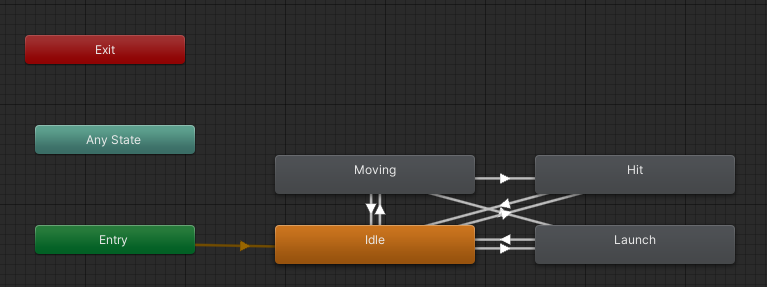

素材中给出了制作好的Animator，可以参考制作。这里值得学习的主要是如何传递消息，前面我们用SetFloat传递浮点数，Animator中的混合树之间可以通过我们添加的参数作为Conditons来判断转变到哪个状态。Trigger是其中比较特殊的一类，Bool值类型的变量在使用SetBool后会保持变量值，除非重新设置；而Trigger则在设置后会重新变回默认值，也就是说使用Trigger作为Conditions的State Transition，仅在Trigger被设置的那一次进行播放，播放完了就不再执行这个状态的动画，退出到其他状态。

所以这里Trigger就很适合作为受击状态Hit的条件，Hit播放一次后无条件退回到Idle。Launch状态也一样。

另外，由于Animator中的参数范围是[-1,1]，所以要对变量最好进行归一化操作，再传递给Animator。

## Animator Transition简介

接下来简单介绍一下状态转换的设置：

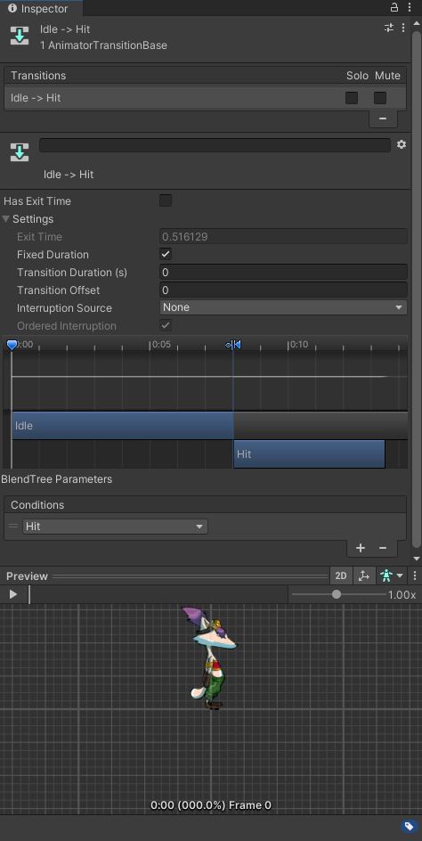

其中的功能如下，可以自行查阅Unity文档：

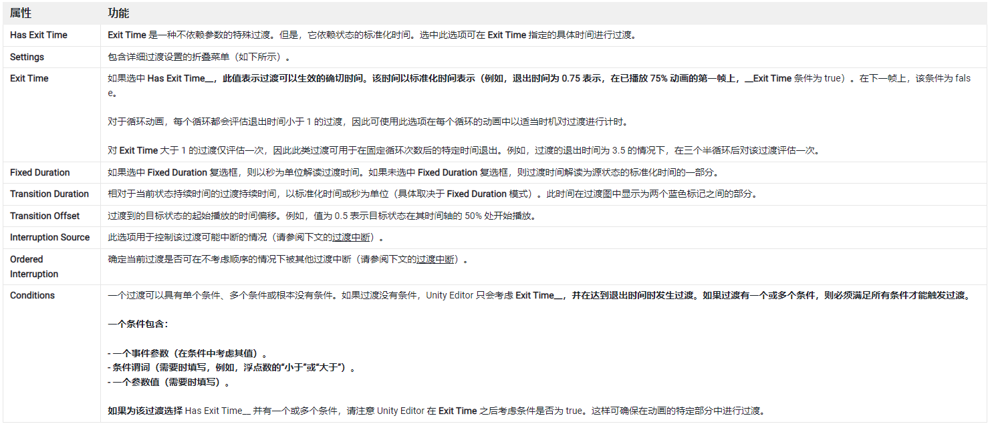

先了解，3D部分会重点使用这个，连带着会用Blender修改动画。


# 敌人移动

有了前面的脚本，可以试着编写一个控制敌人自动移动的逻辑，这里可以自由发挥，我编写的逻辑是敌人上下移动，碰到任何物体都让敌人改变上下移动的方向，从而循环移动。当然也可以控制移动距离等内容，这都很容易，因此就不多说明了

```C#
public class RobotController : MonoBehaviour
{
    public int speed = 5;
    Rigidbody2D rigidbody;
    float is_up;

    private void Start()
    {
        rigidbody = GetComponent<Rigidbody2D>();
        is_up = 1.0f;
    }

    private void Update()
    {
        
    }

    private void FixedUpdate()
    {
        Vector2 position = transform.position;
        position.y += is_up * speed * Time.deltaTime;
        rigidbody.position = position;
        
    }

    private void OnCollisionEnter2D(Collision2D collision)
    {
        is_up = -is_up;
    }


}
```


到这里本篇博客结束，我们已经掌握了人物控制和敌人控制的基本做法，它们现在拥有了动画效果，并且具备生命值交互系统，剩余的制作过程请看下一篇系列博客。
