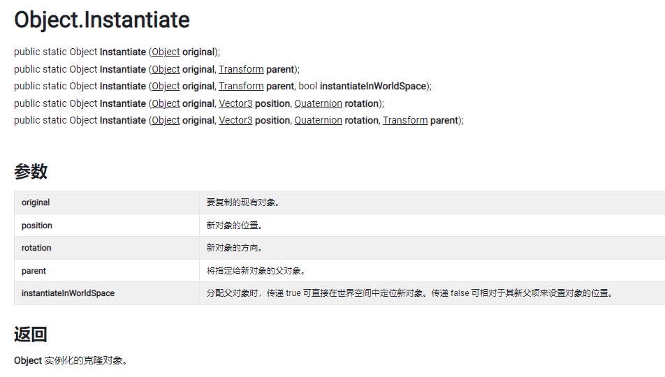
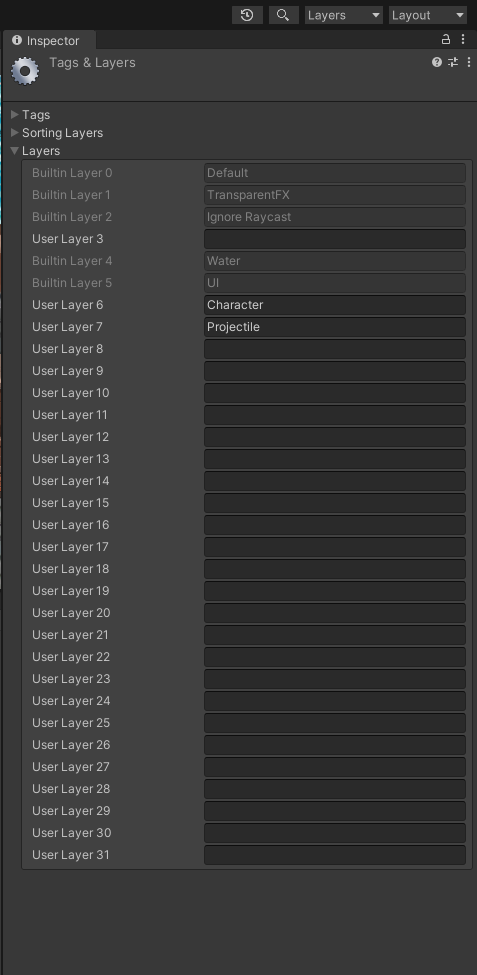
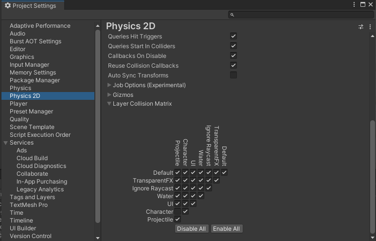
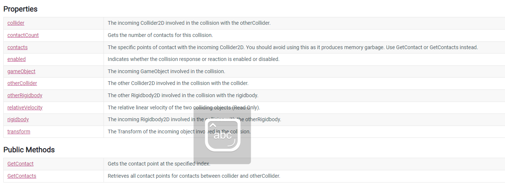

这一节我们继续制作2D游戏，添加飞弹系统及其动画，然后利用Cinemachine组件来便捷地控制摄像机。

<!--more-->

在导入的素材中，主角会发射机械零件以修复机器人，之后机器人就不会对角色造成伤害了。经过前面的学习，你肯定想到我们接下来要做的事情有以下几个：

* 角色发射零件的脚本；
* 角色发射零件的动画；
* 机器人和零件的碰撞检测；
* 机器人击中后被修复的动画；
* 更改机器人状态。

下面我们按这个流程来介绍如何操作。

# 飞弹预制件及脚本

首先在Art/Sprites/VFX中找到零件图片CogBullet，修改其PPX属性(前面介绍过)调整到合适的大小，然后将其保存为预制件到Prefabs文件夹下(忘记了？最简单的方法就是添加到Hierarchy中再拖动到Prefabs文件夹，之后删除该游戏对象即可，因为我们接下来所有操作都要在预制件上进行)。

为了进行碰撞检测和实现发射、碰撞的效果，分别要添加Box Collider 2D组件和Rigidbody 2D组件，将Rigidbody 2D中的Gravity scale设置为0。将这个预制件名称修改为Projectile，并添加一个同名脚本：

```C#
    Rigidbody2D rigidbody;

    // Start is called before the first frame update
    void Start()
    {
        rigidbody = GetComponent<Rigidbody2D>();
    }

    // Update is called once per frame
    void Update()
    {
        
    }

    public void Launch(Vector2 dir, float force)
    {
        rigidbody.AddForce(dir * force);
    }

    private void OnCollisionEnter2D(Collision2D collision)
    {
        Debug.Log($"子弹碰撞到了{collision.gameObject}");
        Destroy(gameObject);
    }
```

现在你就明白为什么一定要添加刚体组件了，我们发射的方式是调用刚体组件的AddForce方法，这个方法会施加一个瞬间的力让游戏对象进行移动，从而达到发射的效果，这样更符合实际，你要是喜欢用移动的方式来编写也可以，不过不好说会不会产生问题。

# 角色飞弹系统

现在有了发射的对象，就可以编写角色发射飞弹的代码了。

```C#
    //创建游戏对象和发射力度，序列化到Unity
	public GameObject ProjectilePrefab;
    public float force = 300;
```

序列化以后，脚本组件中会显示当前角色拥有的公开属性，注意到出现了一个需要绑定游戏对象的值ProjectilePrefab，我们把上一步创建的飞弹预制体赋值给他。完成之后在脚本中就可以通过ProjectilePreab访问这个预制体了，而并不在Start中创建，因为这个预制体的实例化是放在发射的脚本中实现的，不可能通过Start创建，所以我们进一步编写一个Launch方法给角色：

```C#
void Launch()
{
	GameObject projectileObject = Instantiate(ProjectilePrefab, rigidbody2D.position + Vector2.up * 0.5f, 					Quaternion.identity);
    
	Projectile projectile = projectileObject.GetComponent<Projectile>();
	projectile.Launch(lookDirection, force);
}
```

注意到其中出现了新的方法：



该方法用于实例化，或者说复制游戏对象，API接口如上图，这里我们编写的代码使用第四个接口，此时该实例化对象的父对象就是我们的角色，含义就是将传入的ProjectilePrefab对象进行实例化，生成位置是角色位置上移Vector2.up*0.5f = 0.5个单位的地方(就是半个格子高度)，并且不需要旋转，最后这个参数Quaternion.identity表示旋转量为(0,0,0,1)，分别表示旋转轴的x，y，z值和旋转角的余弦值。

完成后，让角色按下C键的时候发射，所以和移动脚本相似，在Update函数中添加调用这个方法的时机：

```C#
if(Input.GetKeyDown(KeyCode.C))
{
	Launch();
}
```

保存代码并运行，发射飞弹，发现报错了，指出对象Projectile不存在。

# 调试解决三个Bug

## 报错为空

这是教程给出的错误案例，我们用早前介绍的调试方法，给Instantiate语句加上断点，回到游戏按下C发射飞弹跳转到IDE，查看projectile变量，发现其中的rigidbody组件为空！

回想我们实现飞弹预制件脚本中Launch方法时，确实调用了rigidbody组件，该组件应该在Start方法中被赋值才对，这是因为刚创建该对象的时候不会调用Start方法，而是在下一帧调用，也就是说我们现在实例化了一个飞弹，但并没有立马运行Start方法。解决方法是，使用Awake方法代替Start，该方法会在创建对象后立即运行。

现在重新运行代码，不再报错null，但是发现飞弹刚发射的时候就消失了，因为飞弹创建后就碰到了人物，就被销毁了，如何解决？

## 取消飞弹和角色的碰撞

方法是使用Unity的图层功能，我们在整个窗口的右上角找到Layers，选择Edit Layers选项，在添加Character和Projectile图层：



然后将角色的Layers设置为Character，Projectile的Layers设置为Projectile。这一步就将两个图片放到了不同图层，再打开Edit/Project Settings/Physic2D，拉到最下面打开Layer Collision Matrix，去掉Character和Projectile两个图层之间的碰撞检测：



这样一来就不会检测这两个图层的物体了，保存后进行游戏，现在飞弹系统已经正常了。下一步我们添加动画。角色的飞弹动画前面已经做好了，所以我们在角色的Launch方法中加上animator即可：

```C#
animator.SetTrigger("Launch");
```

保存后运行游戏，看到动画也正常了。

## 设置飞弹最大距离

还有最后一个问题，飞弹如果没有碰到任何游戏对象，将一直存在下去，浪费游戏资源。因此我们现在给飞弹设限，如果飞弹的位置超过了某个值就将飞弹销毁：

```
void Update()
{
	if(transform.position.magnitude > 10.0f)
	{
		Destroy(gameObject);
	}
}
```

现在飞弹系统才完善。

# 机器人修复系统

设置一个bool值供脚本判断现在机器人的状态，如果机器人被零件击中，那么就将这个值修改，让Update和FixedUpdate方法通过这个值判断要不要退出方法。要判断当前碰撞到机器人的游戏对象是什么，还是要到OnCollisionEnter2D方法中实现。前面虽然我们使用了很多次，但是都是一样的模式，现在我们正式理解下这个方法，它需要一个参数collision2D，一个存储碰撞信息的类，其中具有以下对象：



可以看到它提供了一系列属性，因此我们这里要通过它获取碰撞对象的控制类，也就是RobotController。显然collision并没有这个属性，但是它的很多成员都有，这就是为什么我们有时要访问两次才能找到需要的属性。接下来思路就很清楚了，先对碰撞物体尝试获取RobotController，这个控制脚本组件只有机器人才具备，所以碰撞到其他东西的时候这个对象为空，那么我们不做处理；如果非空，说明就是碰撞到机器人了，此时让机器人执行一个修改自己状态的方法即可：

```C#
//机器人执行
public void Fix()
{
    is_fixed = true;
    //关闭机器人的刚体组件
    rigidbody.simulated = false;
}

bool Is_Fixed = false;
if(Is_Fixed == true)
    return;
```

```C#
//添加到Projectile的方法中
private void OnCollisionEnter2D(Collision2D collision)
{
	RobotController1 robotController = collision.gameObject.GetComponent<RobotController1>();
	if(robotController != null)
	{
		robotController.Fix();
	}
	Destroy(gameObject);
}
```

运行游戏，发现击中机器人后，机器人停止运动，并且不会进行碰撞检测，不过动画仍然在播放，下面我们添加机器人修复后的动画。

因为机器人修复以后就没有其他状态了，所以这里让机器人从Move混合树中添加一个到修复以后动画的转换即可，在机器人调用了Fix方法的时候同时设置播放修复后动画的Trigger，同时这个转移没有Exit Time，那么机器人被击中后就会一直播放修复动画了。

# 摄像机移动

然后就是一个关键地方了，我们摄像机前面一直没有移动过，现在要让它跟随角色移动。你可能想到如何使用脚本控制摄像机移动了，这个很简单，我们这里则是采用一个第三方插件Cinemachine，用于简化跟踪摄像机的操作。

打开Package Manager，选择Unity Registry，安装Cinemachine包。

安装完成后在层级栏中右键，选择并创建Cinemachine/2D Camera，创建后得到一个名为CM vcam1的虚拟摄像机。虚拟摄像机用于添加不同的摄相机参数便于切换，有时需要使用多个摄像机来制作过场动画等内容，创建虚拟摄像机就可以提前设定参数，然后等到需要使用的时候将这个虚拟摄像机绑定到主摄像机上。

虽然我们这里创建的是2D Camera，但是其实也是一个虚拟摄像机，用来限制摄像机的位置和跟随，只需要将跟随对象赋值给创建的摄像机的Follow对象即可。测试一下，摄像机就跟随角色移动了。

然后还要限制摄像机的移动范围，当镜头超过地图边界就不再向外移动。找到Add Extension属性，选择CinemachineConfiner并添加。

再创建一个名为CameraConfiner的空游戏对象，添加碰撞体绑定到整个游戏区域，然后设置为新的图层Layer，在Project Settings/Physics 2D中取消这个Layer和其他任何Layer的碰撞检测，保存，将这个游戏对象赋值给刚才虚拟摄像机的Cinemachine Confiner/Bounding Shape 2D属性上，然后运行游戏，就做好移动功能了。摄像机跟随角色移动，并且不会超过游戏边界。

