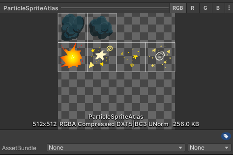
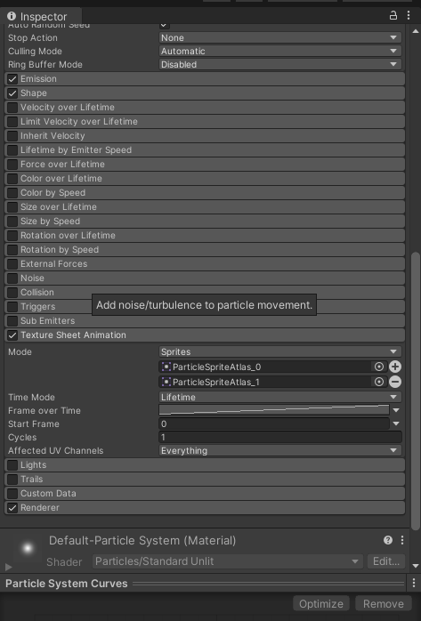
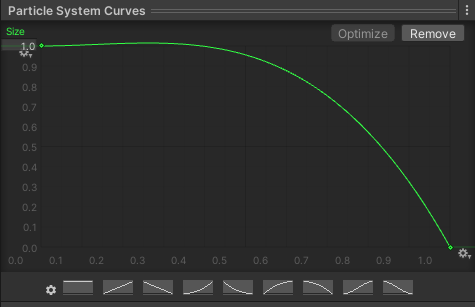
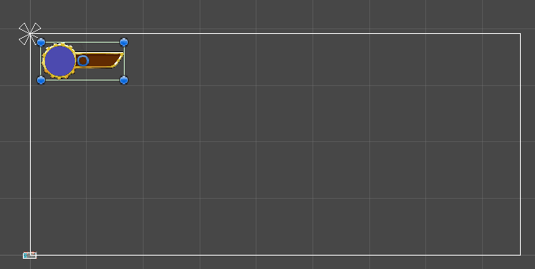
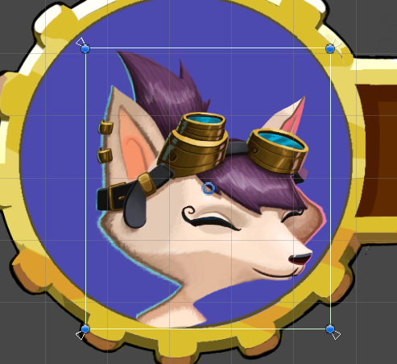
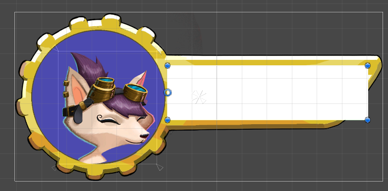
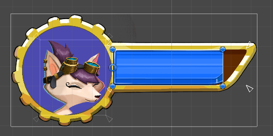
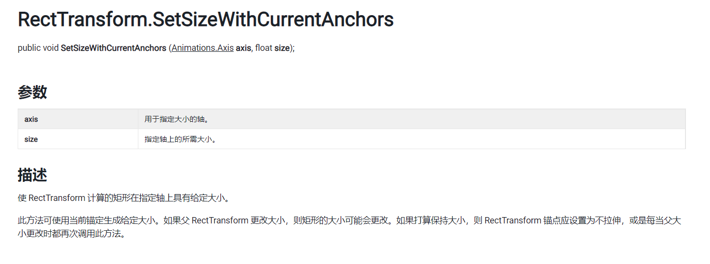

实际上我们的游戏基本功能都实现了，游戏对象逻辑上的处理已经完成，现在我们来添加两个视觉上的东西，粒子系统和UI。粒子系统说白了就是用来做特效的，例如是烟、雾、水等，这些动画效果如果用Sprite的话效果不好。UI就不用多说了，前面的生命值系统没有血条看起来很奇怪，我们还会连带制作一个对话系统。

<!--more-->

# 什么是粒子系统？

在Unity中，粒子系统是一种用于创建各种形态的粒子效果的工具。粒子系统可以用于模拟火、爆炸、烟、水流、火花、落叶、云、雾、雪、尘、流星尾迹等现象，也可以用于创建抽象的视觉效果。粒子系统由粒子发射器、粒子动画器和粒子渲染器三个独立的部分组成。粒子发射器用于控制粒子的发射位置、速度、方向和数量等属性，粒子动画器用于控制粒子的生命周期、大小、颜色、旋转和形状等属性，粒子渲染器用于将粒子渲染到屏幕上。Unity中自带了强大的粒子特效编辑器，可以用于游戏的特效制作。	

Unity还有一个类似的系统叫Visual Effect Graph，用于更大规模的粒子特效，使用可视化编程来完成。我们这里制作的效果比较简单，使用粒子系统就够了。

所谓粒子就是大量的小型图片，具有自己的方向等属性，用来模拟流体实体。我们将使用粒子系统中的内置粒子系统，它可以用脚本实现粒子的控制和交互。

## 使用粒子系统

粒子系统一样需要素材才能实现，找到VFX中的ParticleSpritesAtlas，设置为Sprite Mode为Multiple，然后打开Sprite Editor进行分割到4*4的格子中，就得到了6个特效件。



### Texture Sheet Animation

在层级栏中右键创建Effect/ParticleSystem并重命名为SmokeEffect，在它的Particle组件中找到Texture Sheet Animation并勾选以启用，调整Mode为Sprites并添加到两个图片，将刚才分割的图片中的两个烟雾赋值进去即可。



这样设置以后粒子系统不断播放第一个图片，而没有第二个，我们希望随机播放这两个图片以实现烟雾的效果，因此修改Start Frame为Random Between Two Constants，设置第二个参数为2，表示图片索引区间为[0,2)，这是看到烟雾效果会不断变化了，两个图片交替出现，但是发出以后图片也会改变。

为了让图片产生后就不变成另一个图片，现在设置Frame Over Time，此时选项为Curve，表示当前值随着曲线变化，点击线条后底部出现函数图，横轴表示时间，纵轴表示当前值，也就是图像序号，将右边最高点删除，那么Frame不会变化，此时图片产生后就不会更改了。

### Shape

Angle改为5，表示圆锥体顶角大小；Radius改为0，表示底部半径大小。

### Start speed

选择Random Between Two Constants，上下界设置为0.5和1，表示产生粒子的速度；

### Start Size

选择Random Between Two Constants，上下界设置为0.3和0.5，表示粒子的大小。

### Start Lifetime

同上，上下界设置为1.5，3，表示粒子的声明周期。

### Color Over Lifetime

勾选后，点击白条出现Gradient Editor，渐变编辑器，然后看到上下左右四个点，左边表示起点，右边表示结束，上侧两个点表示透明度alpha，将右边的alpha调整为0，就实现图片逐渐透明的效果。下方的两个点则是颜色改变，可以自己探索。

### Size Over Lifetime

意思和上一个差不多，随时间改变粒子大小，我们选择Size方式为Curves，修改曲线：



让粒子随着时间变小。

### Simulate Space

选择World，表示不以局部坐标模拟物理效果，操作以后烟雾就可以随着机器人的移动而模拟了。

我们基本就使用了这些方法，它们有类似的操作方式，篇幅限制很难全部说明一遍。

## 脚本控制粒子系统

我们经过前面的操作后得到了一个特效件，现在拖进Prefabs中做成预制件，然后再添加给Robot的预制件，这样一来机器人移动也会让特效跟着移动，就实现机器人冒烟的特效了。但是机器人被修复以后还是会冒烟，所以我们要用脚本控制特效。

前面我们制作飞弹的时候为了让飞弹不能无限飞行，在一定距离后就用Destroy()方法将其销毁了，这里的粒子特效件作为一个游戏子对象，可以在机器人被修复的时候直接摧毁，因此我们要做的就很简单了，首先获取到这个游戏对象，然后同样在机器人的Fix方法中销毁它即可。

> 注意这里指的是层级栏中的特效，而不是预制件，因为我们之前做飞弹的时候使用GameObject类型接受预制件从而直接创建出来，自行销毁，这里是原先存在不用创建，需要用ParticleSystem类型获取以后等待时机摧毁，使用预制件的话本来就不存在这个实例化的游戏对象，就肯定不能摧毁了)

另一个方法是调用粒子系统的Stop()方法，这样就会使得生命周期没有结束的粒子继续播放，不会像刚才那样直接凭空消失了。

最后我们有时想制作只播放一次的特效，那么需要进行三个操作：

* 取消勾选looping；
* Duration设置为希望的播放时间；
* Stop Action设置为Destroy；

这样以后特效将在播放时间结束后自动销毁，为了让粒子不随着时间而是一次性产生，我们还要进行两个操作：

* Emission的Rate Over Time设置为0；
* 使用Emission的Bursts属性，用叫号添加一个Burst，设置爆发的各项属性；

此时就可以创建一个只进行一次的特效了。不过问题是这个特效肯定需要某些时候创建，例如吃血瓶的时候，所以不能直接放在层级栏中，我们将他做成预制件，然后在脚本中用公开的序列化ParticleSystem类型来接受，并在调用角色加血方法的时候实例化这个特效。由于特效件设置了会自行销毁，所以不用管理Destroy方法，创建了就相当于播放一次，和动画类似。

# 什么是UI？

User Interface，简称UI，是提供给玩家进行游戏交互的面板，在Unity中由于版本原因有多种UI系统：

* UI Toolkit：一个较新的UI系统，它基于标准的Web技术，旨在优化跨平台的性能，首选；
* Unity UI（UGUI）：是较旧的UI系统，仍然可用，但已被视为过时，市面上很多游戏使用这个UI系统；
* IMGUI：一种基于函数调用的GUI系统，也称为“Immediate Mode”GUI系统，优点是易于使用和快速，但缺点是不够灵活和可扩展；

所以一般来说现在做游戏首先选UI Toolkit，只是可能会缺少功能，实在没办法再使用UGUI。我们这里用UGUI做个了解即可。

学习方面三个都要看，IMGUI因为是纯代码的，自己写界面调试比较方便，然后前两个就看情况使用。

## 使用UGUI

层级栏中创建UI/Canvas，看到还自动创建了一个EventSystem对象，用于检测用户事件，这两个都不用调整，我们仅使用最基本的功能。右键创建的画布Canvas，再次添加UI/Image，得到一个子对象，将UI文件夹中的UIHealthFrame图片赋值给Image的Source Image属性，就看到了血条显示，但是血条是变形的，点击Image组件中的Set Native Size来使图片恢复原本的比例。

现在图片又太大了，我们按住shift来等比例缩小图片，并将图片摆放到画布的左上角，可以在Game视图中进行查看当前设置。

现在我们来介绍锚点，在Unity中，锚点是指UI元素相对于其父对象的位置和样式。锚点的取值范围为0（父对象左下角）到1（父对象右上角），锚点是UI元素与父对象之间的桥梁，子对象的位置和大小会随着父对象的变化而变化。锚点中心是四个三角形的中心，如果四个三角形在一起，那么表示画布的子对象会随着锚点中心进行相同的移动，保持距离不变；如果锚点的四个三角形不在一起，它们分别对应矩形的四个顶点，让顶点和自己的距离不变，从而进行拉伸操作。

使用锚点的原因是设备分辨率不同，导致摄像机显示的大小不同，如果固定UI可能会导致错误的显示效果，例如让锚点设置为画布正中心时，左上角的UI元素和锚点保持距离不变，缩放画布会导致UI元素跑到外部。这时让锚点位于画布的左上顶点，就不会错误了。



解决这个问题后我们再将头像添加到蓝色圆圈上，UI文件夹中找到Portrait，用同样的方法给UIHealthFrame添加子图片对象，设置到合适的位置。

此时尝试缩放UIHealthFrame，发现头像不会跟着缩放，这还是锚点的问题，每一层都有自己的锚点，UIHealthFrame的锚点在他自己的中心，那么头像对应的四个顶点对应到UIHealthFrame的中心后，无论怎么变化都只保证距离不变，所以记住锚点和当前图片的关系，把锚点拖到头像图片的四个点上就好了。



## 遮盖生命条

原理是用另一个图片来遮盖血条，更改遮盖图片的大小来实现血条加减的操作。给UIHealthFrame再添加一个Image，这就是遮盖层，让这个白色的矩形刚好盖住右边空着的血条。

思考一下这里血条减少怎么设置，我们希望的效果是当生命减少时遮盖层右边往左边靠过来，也就是缩放的时候左边不动，右边减少，那么就是说，希望缩放的时候让坐标保持不动，因此可以将Mask的pivot调整到最左边中间。当前pivot在中心，缩放的话会使得图片两边同时向中间缩放，放在最左边就可以让右边往中间靠拢了。



现在给Mask添加一个图片子对象，用我们的美术素材填充Mask的区域，把UIHealthBar拖进去，如果要让这个子对象填充父对象Mask，并且图片的四个顶点和这个Mask一样的位置就好了，我们再次打开锚点设置Anchor Presets，看到右下角表示将锚点设置到父对象的四个顶点，并且按下alt表示同时设置顶点位置，就实现了填充。

虽然将刚才的锚点设置到Mask的四个顶点后，血条会随着Mask变化，但是由于需要使用遮盖，血条对应的锚点最好设置到左上角，保证Mask缩放的同时血条不会直接缩放(因为直接缩放的话没必要添加遮盖了，这里遮盖是直接让血条消失而不是缩放)因此给Mask添加一个Mask组件，取消Show Mask Graphic，这样一来，我们调整Mask，发现Mask会盖住血条，也就是说Mask会显示目前盖住的部分，没盖住的部分就会消失。



## 代码控制

下面我们控制Mask缩放。创建脚本UIHealthBar，添加代码：

```C#
using System.Collections;
using System.Collections.Generic;
using UnityEngine;
using UnityEngine.UI;

public class UIHealthBar : MonoBehaviour
{
    public static UIHealthBar Instance { get; private set; }
    public Image mask;
    float originalSize;
    // Start is called before the first frame update
    void Start()
    {
        Instance = this;
        originalSize = mask.rectTransform.rect.width;
    }

    public void SetValue(float value)
    {
        mask.rectTransform.SetSizeWithCurrentAnchors(RectTransform.Axis.Horizontal, originalSize * value);
    }


}

```

这里采用了单例模式，确保只有一个实例被创建并且可以全局访问来避免多个实例之间的冲突和资源浪费，同时也方便其他类和对象访问和使用。

另外这里要记得添加UnityEngine.UI的命名空间，因为要使用image。

最后使用了新的接口rectTransform.SetSizeWithCurrentAnchors，用来根据锚点改变矩形横纵边长的大小。



